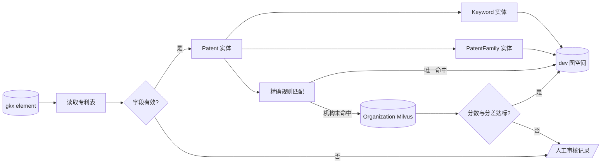
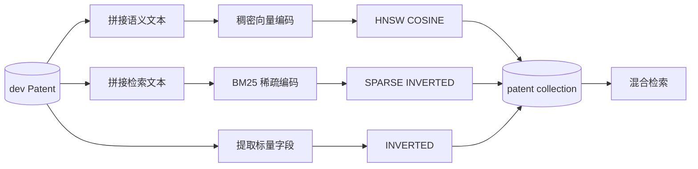

# 专利 MySQL → dev 图谱核查与改造说明（2026-08-11）

## 结论

- 本次未修改、迁移或补写 `gkx_element` 业务数据。
- 当前 `gkx_element` 共有 2000 条专利主记录，采用旧版命名：主表 `id` 为行级逻辑 ID、`patent_id` 为专利业务 ID；嵌套字段为 JSON。
- 最新要素库定义采用 `patent_id` 为行级逻辑 ID、`pn` 为专利业务 ID，并新增 SPIF、现有技术日期、相关专利、其他版本等字段。因此字段名称和字段集合不完全一致。
- 抽取代码仍以当前实际库为读取基准，避免在“不动数据”的约束下破坏线上数据；图中 `Patent.patent_id` 表示要素库业务专利 ID，即最新版定义中的 `pn`。
- 虚拟联调数据位于 `schemas/fixtures/patent_virtual_data.sql`，不会自动执行，全部 ID 带 `VIRTUAL_` 前缀并附回滚 SQL。

## 当前处理链路

1. `dao/sql/patent_entity_extract.sql` 联接专利主表、标题、摘要、法律、引用、家族表。
2. `script/load_patent_graph.py` 写入 Patent、Keyword、PatentFamily，以及 HAS_KEYWORD、MEMBER_OF_FAMILY。
3. `script/load_patent_relations.py` 构建 INVENTED_BY、APPLIED_BY、OWNED_BY、CITES、OUTPUT_OF；证据不足的候选写 ReviewRecord，不造桩点。
4. `script/patent_entity_workflow.py` 和 `script/patent_relation_workflow.py` 是独立工作流入口。
5. `script/patent_extraction_workflow.py` 是顺序执行实体阶段和关系阶段的一体化入口。

## 置信度

| 对象/匹配方式 | confidence | 自动写入 |
|---|---:|---|
| Patent 源记录直接映射 | 1.00 | 是 |
| 关键词、同域专利家族 | 1.00 | 是 |
| 标准专利编号唯一匹配 | 1.00 | 是 |
| 项目 ID 与专利编号均唯一 | 1.00 | 是 |
| 机构规范名/别名精确且唯一 | 0.98 | 是 |
| 发明人姓名+任职机构唯一 | 0.80 | 是 |
| 再有项目上下文一致 | 0.90 | 是 |
| Milvus BM25+稠密向量召回的机构候选唯一 | 实际综合分 | 默认分数>=0.88且Top1-Top2>=0.08才写 |
| 只有人名、相似度或多候选 | 不给可写分值 | 否，进入审核 |

## 溯源字段

- Patent：`confidence`、`organization_base=dwd_patent`、`organization_id=patent_id`。
- 所有关系继续保留专利事实来源：`source_table`、`source_record_id`。
- `organization_base` 与 `organization_id` 只属于实体，不写入关系；关系继续使用既有事实证据字段。

## 2026-08-12 dev 数据更新结果

- Patent 已重新写入 2000 条；`confidence=1.0`、`organization_base=dwd_patent`、`organization_id=patent_id` 已实际写入。
- Keyword 引用与 `HAS_KEYWORD` 共 9949 条。
- 机构精确匹配：`APPLIED_BY` 5 条，`OWNED_BY` 1 条，置信度 0.98。
- Organization Milvus 混合匹配：`APPLIED_BY` 51 条，置信度 0.95。
- 5943 条证据不足的记录保留人工审核；未使用大模型，未强制建边。
- `org_domain_organization` 是机构域外部只读依赖，专利流程不创建、不修改、不删除该 collection。

## 实体与关系抽取流程

编号、关键词和专利族等确定事实直接匹配。申请人和权利人先做机构名称精确匹配，失败后只读查询 Organization Milvus；默认综合分不低于 0.88，且 Top1 与 Top2 分差不低于 0.08 才自动建边。

## 专利向量索引建立流程

稠密语义文本使用中英文标题、原始标题、中文摘要和关键词。BM25 检索文本额外加入专利编号、申请号、授权号、IPC 和 CPC。公开号、申请号、授权号、专利族号、国家代码和来源表单独建立标量倒排索引。
