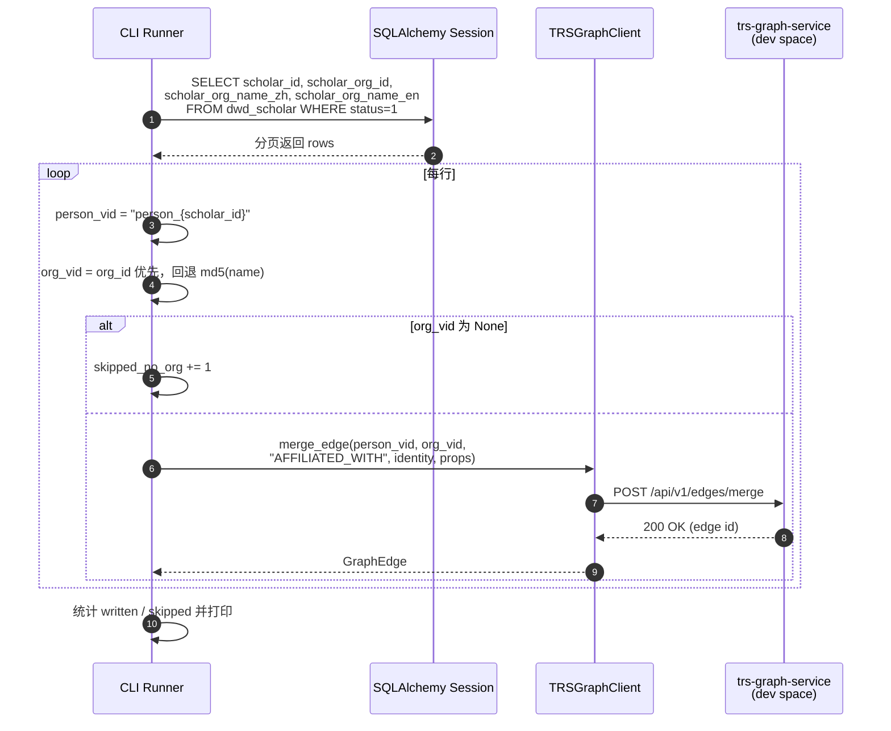

# 学者领域关系映射（Scholar Relations Mapping）

> 领域负责人：**伟宁（Scholar）**
> 图空间：`dev`
> 目标：只抽取 **从 Person（学者）出发** 的关系，不新建实体；实体由其他领域批次负责。

---

## 1. 覆盖范围

TRSGraph 边是有向的。学者领域出向边只有两类：

| 边类型 | 方向 | 数据源 |
|--------|------|--------|
| `AFFILIATED_WITH` | Person → Organization | `gkx_element.dwd_scholar` |
| `COAUTHOR_WITH`   | Person → Person       | `gkx_element.dwd_scholar_coauthor` |

其余 Person 相关的边（`AUTHORED_BY: Paper → Person`、`LEADS: Project → Person`、`INVENTED_BY: Patent → Person` 等）起点分别属于论文、项目、专利领域，本次不做。

---

## 2. VID 命名约定

| 顶点类型 | VID 格式 | 说明 |
|----------|---------|------|
| Person   | `person_{scholar_id}` | 与之前学者顶点批次一致 |
| Organization | `org_{scholar_org_id}` 优先，回退 `org_{md5(name)[:16]}` | 与国内外机构领域约定对齐；名称回退用于机构 ID 缺失场景 |

回退策略避免在同名机构上做实体对齐/去重（本轮任务不做对齐消歧）。

---

## 3. 字段级映射

### 3.1 `dwd_scholar` → `AFFILIATED_WITH`

| 源字段 | 类型 | 图上位置 | 处理规则 |
|--------|------|----------|---------|
| `scholar_id` | varchar(32) | 起点 VID | `person_{scholar_id}` |
| `scholar_org_id` | varchar(64) | 终点 VID（优先） | `org_{scholar_org_id}` |
| `scholar_org_name_zh` | varchar(1024) | 终点 VID（回退） / 边.`affiliation_name` | 若无 `scholar_org_id`，用名称 md5 生成 VID；同时写入边属性 |
| `scholar_org_name_en` | text | 终点 VID（回退） / 边.`affiliation_name` | 中文为空时用英文名 |
| `status` | int | 过滤条件 | 仅取 `status = 1` |
| — | — | 边.`source` | 固定 `"scholar"` |
| — | — | 边.`source_table` | 固定 `"dwd_scholar"` |
| — | — | 边.`source_record_id` | `scholar_id` |
| — | — | 边.`ingest_batch` | `BATCH_{yyyymmdd_HHMMSS}_scholar_rel` |
| — | — | 边.`ingest_time` | ETL 执行时刻 |

**跳过条件**：`scholar_org_id` 为空且中英文机构名均为空的记录，无法生成 Organization VID，跳过写入并计入 `skipped_no_org`。

### 3.2 `dwd_scholar_coauthor` → `COAUTHOR_WITH`

| 源字段 | 类型 | 图上位置 | 处理规则 |
|--------|------|----------|---------|
| `scholar_id` | varchar(32) | 起点 VID | `person_{scholar_id}` |
| `co_scholar_id` | varchar(32) | 终点 VID | `person_{co_scholar_id}` |
| `co_paper_count` | int | 边.`co_paper_count` | 缺失置 0 |
| `co_scholar_name_en/zh` | varchar | 不映射 | 冗余展示字段；作者姓名以 Person 顶点属性为准 |
| `co_scholar_avatar` | varchar | 不映射 | 同上 |
| `co_scholar_org_name_en/zh` | varchar | 不映射 | 机构信息由 Person 顶点或 AFFILIATED_WITH 表达 |
| `status` | int | 过滤条件 | 仅取 `status = 1` |
| `create_time` / `update_time` | datetime | 不映射为业务属性 | 溯源仅用批次号 |
| — | — | 边.`source_table` | 固定 `"dwd_scholar_coauthor"` |
| — | — | 边.`source_record_id` | `{scholar_id}_{co_scholar_id}` |
| — | — | 边.`ingest_batch` | 同上批次号 |
| — | — | 边.`ingest_time` | ETL 执行时刻 |

**方向说明**：`dwd_scholar_coauthor` 记录的合作关系天然对称，MySQL 侧同时保存 `(A, B)` 与 `(B, A)` 两条正反向行；本脚本按行 1:1 落两条有向边，保持源表原貌，不做去重。

### 3.3 未参与关系抽取的学者相关表

以下表在本轮 **不产生新的关系**（在之前的实体批次里已并入 Person 顶点属性）：

| 表 | 原因 |
|----|------|
| `dwd_scholar_talent_flag` | 只是 Person 的 `is_academician` 属性 |
| `dwd_scholar_research_direction` | 只是 Person 的 `research_fields` 属性 |
| `dwd_scholar_papers` | 论文实体，属于论文领域（亚涛） |
| `dwd_scholar_paper_relation` | 起点为 Paper，属于论文领域出向边（亚涛） |

---

## 4. 抽取流程

```mermaid
flowchart LR
    subgraph MySQL[gkx_element MySQL]
        S[(dwd_scholar<br/>status=1)]
        C[(dwd_scholar_coauthor<br/>status=1)]
    end

    subgraph ETL[backend/script/load_scholar_relations.py]
        DAO[SQLAlchemy ORM<br/>DwdScholar / DwdScholarCoauthor]
        MAP[VID 构造 + 属性拼装]
        BATCH[生成 ingest_batch<br/>BATCH_yyyymmdd_HHMMSS_scholar_rel]
    end

    subgraph Graph[TRSGraph dev 空间]
        AW[[Person -[AFFILIATED_WITH]-> Organization]]
        CW[[Person -[COAUTHOR_WITH]-> Person]]
    end

    S -->|分页读取<br/>batch=500| DAO
    C -->|分页读取<br/>batch=1000| DAO
    DAO --> MAP
    BATCH --> MAP
    MAP -->|infra.graph_db.get_trs_graph_client<br/>merge_edge| AW
    MAP -->|infra.graph_db.get_trs_graph_client<br/>merge_edge| CW
```

---

## 5. 时序（单条 `dwd_scholar` 记录的处理）



---

## 6. 幂等与批次

* `merge_edge` 以 `(source_id, target_id, edge_type, identity_props)` 为唯一键；本脚本用 `source_record_id` 作 `identityProps`，重复执行只更新属性、不产生重复边。
* 每次执行生成新的 `ingest_batch`，可用于按批次回溯或回滚：
  ```ngql
  MATCH ()-[e]->() WHERE e.ingest_batch == "BATCH_20260726_100000_scholar_rel"
  RETURN count(e);
  ```

---

## 7. 使用方式

```bash
cd backend

# 干跑，只预览前几条边
MYSQL_DATABASE=gkx_element uv run python -m script.load_scholar_relations --dry-run

# 实际写入 dev 空间
TRS_GRAPH_SPACE=dev MYSQL_DATABASE=gkx_element \
    uv run python -m script.load_scholar_relations
```

必要的环境变量：

| 变量 | 说明 |
|------|------|
| `MYSQL_HOST/PORT/USERNAME/PASSWORD` | 指向 `gkx_element` 所在 MySQL 实例 |
| `MYSQL_DATABASE` | 固定 `gkx_element`（也可用 CLI `--database`） |
| `TRS_GRAPH_BASE_URL` | 默认 `http://localhost:8090` |
| `TRS_GRAPH_SPACE` | 固定 `dev` |
| `TRS_GRAPH_API_KEY` | trs-graph-service API Key |

---

## 8. 后续（不在本次任务范围内）

* **AFFILIATED_WITH 对齐**：若与 `gkx_organization` 领域的 Organization 顶点 VID 不一致，需要建立机构名 → `org_id` 的对齐表，用 `SAME_AS` 边合并。
* **AUTHORED_BY 反向映射**：`dwd_scholar_paper_relation` 由论文领域负责，落 `Paper -[AUTHORED_BY]-> Person` 时会引用 `person_{scholar_id}`；VID 一致即可自动串联。
