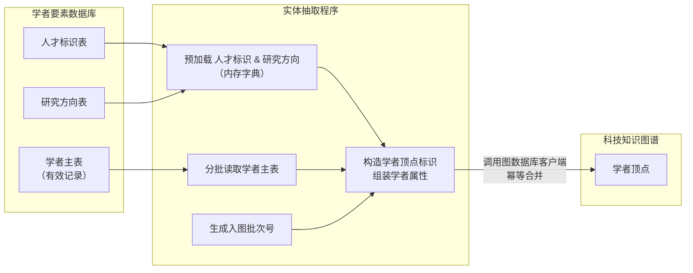
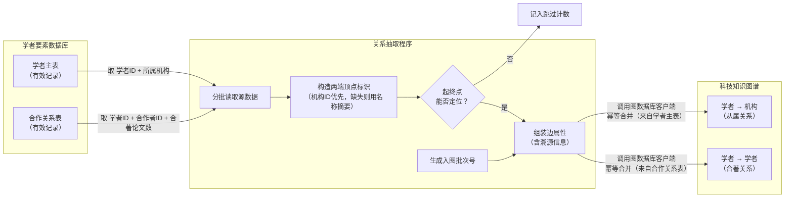
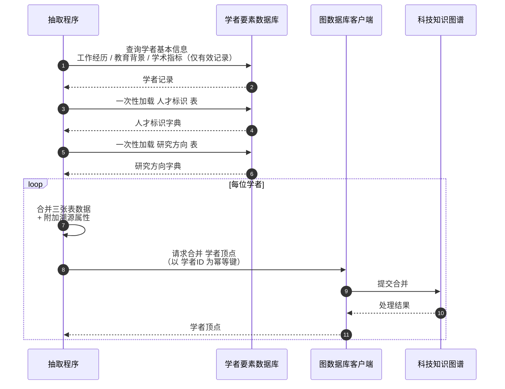
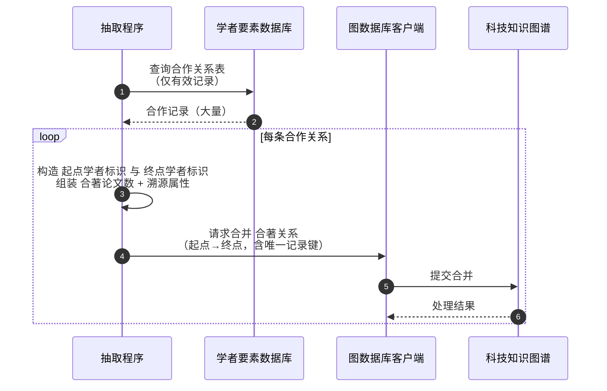

# 学者领域实体与关系映射（Scholar Domain Mapping）

> 领域负责人：**伟宁（Scholar）**
> 图空间：`dev`
> 覆盖范围：**Person 顶点** + **从 Person 出发的边**（`AFFILIATED_WITH`、`COAUTHOR_WITH`、`STUDIED_AT`）
> 图客户端：`infra.graph_db.get_trs_graph_client`（不直接依赖 nebula3 SDK）

---

## 目录

- [0. 领域切片](#0-领域切片)
- [1. 抽取脚本与产物](#1-抽取脚本与产物)
- [2. 实体：`dwd_scholar` → `Person`](#2-实体dwd_scholar--person)
- [3. 关系：`dwd_scholar` → `AFFILIATED_WITH`](#3-关系dwd_scholar--affiliated_with)
- [4. 关系：`dwd_scholar_coauthor` → `COAUTHOR_WITH`](#4-关系dwd_scholar_coauthor--coauthor_with)
- [5. 未参与本轮的表](#5-未参与本轮的表)
- [6. 流程图](#6-流程图)
- [7. 时序图](#7-时序图)
- [8. 幂等 / 批次 / 回滚](#8-幂等--批次--回滚)
- [9. 使用方式](#9-使用方式)

---

## 0. 领域切片

TRSGraph 边是有向的，按领域分配我只做 **从 Person 出发的边**：

| 边类型 | 方向 | 来源 | 是否本轮 |
|--------|------|------|--------|
| `AFFILIATED_WITH` | Person → Organization | `dwd_scholar` 任职机构 | ✅ |
| `COAUTHOR_WITH`   | Person → Person       | `dwd_scholar_coauthor` | ✅ |
| `STUDIED_AT`      | Person → Organization | `dwd_scholar` 教育院校 | ✅ |
| `AUTHORED_BY`     | Paper → Person        | `dwd_scholar_paper_relation` | ⚠️ 跨域兜底（可选，见 §5.1） |
| `LEADS`           | Project → Person      | 项目库 | ❌（属于项目领域，学者侧无源数据）|
| `INVENTED_BY`     | Patent → Person       | 专利库 | ❌（属于专利领域，学者侧无源数据）|
| `EXECUTIVE_OF` 等 | Person → Organization | 机构治理表 | ❌（属于机构领域，公司治理关系而非学术从属）|

Organization、Paper、Project、Patent 顶点由对应领域负责创建；本脚本只落 Person 顶点。

---

## 1. 抽取脚本与产物

| 步骤 | 脚本 | 产物 |
|------|------|------|
| 实体 | `backend/script/load_scholar_entities.py` | Person 顶点 |
| 关系 | `backend/script/load_scholar_relations.py` | `AFFILIATED_WITH` + `COAUTHOR_WITH` + `STUDIED_AT` 边 |

两个脚本都通过 `infra.graph_db.get_trs_graph_client()` 获取图客户端，
用 `merge_node` / `merge_edge` 幂等写入。

---

## 2. 实体：`dwd_scholar` → `Person`

**VID**：`person_{scholar_id}`
**标签**：`Person`
**identityProps**：`{"source_record_id": scholar_id}`（`merge_node` 用它去重）

### 2.1 基本属性

| 源字段 | 类型 | 图属性 | 处理 |
|--------|------|--------|------|
| `scholar_id` | varchar(32) | `source_record_id` + VID 组成 | `person_{scholar_id}` |
| `name_en` | varchar(128) | `Person.name_en` | 直连 |
| `name_zh` | varchar(128) | `Person.name_zh` | 直连 |
| `avatar` | varchar(256) | `Person.avatar` | 直连 |
| `scholar_org_name_zh` | varchar(1024) | `Person.scholar_org` | 中文优先，缺失时回退英文 |
| `scholar_org_name_en` | text | `Person.scholar_org`（回退） | 见上 |
| `bio` | text | `Person.biography` | 直连 |
| `bio_zh` | text | `Person.bio_zh` | 直连 |
| `paper_nums` | int | `Person.paper_nums` | 缺失置 0 |
| `citation_nums` | int | `Person.citation_nums` | 缺失置 0 |
| `h_index` | int | `Person.h_index` | 缺失置 0 |
| `status` | int(1) | `Person.scholar_status` + 过滤条件 | 只入库 `status=1` |
| `update_time` | datetime | `Person.source_update_time` | 格式化 `YYYY-MM-DD HH:MM:SS` |

### 2.2 工作经历（7 列 → 7 属性）

`work_experience_*` 全部按原字段名直连到 `Person.work_experience_*`：

`work_experience_date`、`work_experience_institution_en/zh`、`work_experience_department_en/zh`、`work_experience_position_en/zh`

### 2.3 教育背景（5 列 → 5 属性）

`education_background_*` 全部按原字段名直连到 `Person.education_background_*`：

`education_background_date`、`education_background_institution_en/zh`、`education_background_degree_en/zh`

### 2.4 溯源属性块（7 字段）

| 属性 | 取值 |
|------|------|
| `source_system` | 固定 `"gkx_element"` |
| `source_table` | 固定 `"dwd_scholar"` |
| `source_record_id` | `scholar_id` |
| `source_url` | 空字符串（本表无原文链接） |
| `ingest_batch` | 运行时生成，形如 `BATCH_20260727_031310_scholar_entities` |
| `ingest_time` | ETL 执行时刻 |
| `source_update_time` | `update_time` |

### 2.5 从 `dwd_scholar_talent_flag` 补充

| 源字段 | 图属性 |
|--------|--------|
| `academician` | `Person.is_academician` |

以 `scholar_id` LEFT JOIN 到 `dwd_scholar`，作为 Person 的一个字段，**不新建实体**。

### 2.6 从 `dwd_scholar_research_direction` 补充

| 源字段 | 图属性 |
|--------|--------|
| `fields` | `Person.research_fields` |

同 `scholar_id` 有多行时用中文分号 `；` 拼接。

---

## 3. 关系：`dwd_scholar` → `AFFILIATED_WITH`

**方向**：`Person → Organization`
**identityProps**：`{"source_record_id": scholar_id}`（`merge_edge` 用它做幂等去重）

### 3.1 端点 VID

| 端 | VID 规则 |
|----|--------|
| 起点 Person | `person_{scholar_id}` |
| 终点 Organization | `org_{scholar_org_id}` 优先；若 `scholar_org_id` 缺失，回退 `org_{md5(scholar_org_name_zh 或 en)[:16]}` |

回退方案确保能落地关系；同名机构的对齐/去重留给后续。

### 3.2 边属性

| 源字段 | 边属性 | 处理 |
|--------|--------|------|
| `scholar_org_name_zh` / `_en` | `AFFILIATED_WITH.affiliation_name` | 中文优先 |
| — | `AFFILIATED_WITH.source` | 固定 `"scholar"` |
| — | `AFFILIATED_WITH.source_table` | 固定 `"dwd_scholar"` |
| `scholar_id` | `AFFILIATED_WITH.source_record_id` | 用作 identityProps |
| — | `AFFILIATED_WITH.ingest_batch` | 批次号 |
| — | `AFFILIATED_WITH.ingest_time` | 时间戳 |

### 3.3 跳过条件

`scholar_org_id` 与 `scholar_org_name_*` 全部为空的记录，无法定位机构 VID，
计入 `skipped_no_org` 但不阻塞流程。

---

## 3b. 关系：`dwd_scholar` 教育院校 → `STUDIED_AT`

**方向**：`Person → Organization`（供科技专家校友关系邻域查询，对齐同事关系的机构走边模式）

**identityProps**：`{"source_record_id": "{scholar_id}|studied|{org_vid}"}`

### 源字段 → 边属性

| 源字段 | 边属性 |
|--------|--------|
| `education_background_institution_zh/en` | `institution_zh` / `institution_en` |
| `education_background_degree_zh/en` | `degree_zh` / `degree_en` |
| `education_background_date` | `education_date` |

终点 Organization 必须已在图中存在，按中英文名精确归一匹配（与 `AFFILIATED_WITH` 无 `scholar_org_id` 时相同）；匹配不到则跳过，不建桩机构。

CLI：`load_scholar_relations` 默认写入；`--skip-studied-at` 可关闭。

---

## 4. 关系：`dwd_scholar_coauthor` → `COAUTHOR_WITH`

**方向**：`Person → Person`
**identityProps**：`{"source_record_id": "{scholar_id}_{co_scholar_id}"}`

### 4.1 字段映射

| 源字段 | 图上位置 | 处理 |
|--------|--------|------|
| `scholar_id` | 起点 VID | `person_{scholar_id}` |
| `co_scholar_id` | 终点 VID | `person_{co_scholar_id}` |
| `co_paper_count` | `COAUTHOR_WITH.co_paper_count` | 缺失置 0 |
| `co_scholar_name_en/zh` | 不映射 | 冗余展示字段，作者姓名以 Person 顶点属性为准 |
| `co_scholar_avatar` | 不映射 | 同上 |
| `co_scholar_org_name_en/zh` | 不映射 | 机构信息由 Person + AFFILIATED_WITH 表达 |
| `status` | 过滤条件 | 仅取 `status=1` |
| `create_time` / `update_time` | 不映射 | 溯源只用批次号 |
| — | `COAUTHOR_WITH.source_table` | 固定 `"dwd_scholar_coauthor"` |
| — | `COAUTHOR_WITH.source_record_id` | 组合键 `{scholar_id}_{co_scholar_id}` |
| — | `COAUTHOR_WITH.ingest_batch` | 批次号 |
| — | `COAUTHOR_WITH.ingest_time` | 时间戳 |

### 4.2 双向说明

`dwd_scholar_coauthor` 天然对称：同一对合作学者存 `(A, B)` 和 `(B, A)` 两行。
本脚本按行 1:1 落两条**有向边**，保持源数据原貌，不做去重。

生产数据实际规模（`gkx_element` 中 `status=1`）：

- 2063 位学者
- 156141 行合作关系（平均 75.6 位合作者/学者，最高 100）

---

## 5. 未参与本轮的表

| 表 | 说明 |
|----|------|
| `dwd_scholar_papers` | 论文实体，属于**论文领域（亚涛）** |
| `dwd_scholar_paper_relation` | 起点为 Paper，`AUTHORED_BY: Paper → Person` 属于**论文领域**；本脚本支持"跨域兜底"以覆盖其漏落，见 §5.1 |

`Person` 侧只做出向边；论文侧的入向边在合并时会通过 `person_{scholar_id}` VID 自动对齐。

### 5.1 跨域兜底：`AUTHORED_BY`（可选）

TRSGraph 边有向、按起点分工时，`AUTHORED_BY: Paper → Person` 的起点在论文领域。
但 `dwd_scholar_paper_relation` 是**学者领域**能读到的关系表，也承载该边的语义。为避免
论文领域抽取遗漏 / 排期滞后，脚本 `load_scholar_relations.py` 提供可选的兜底能力：

**规则**：只在图中两端顶点都已存在时才写边，缺一即跳过。

| 端点 | VID | 存在性判定 |
|------|-----|-----------|
| 起点 Paper | `paper_{paper_id}` | 每个 `paper_id` 通过 `graph.get_node` 探测一次并缓存 |
| 终点 Person | `person_{scholar_id}` | 同上（学者顶点由本领域负责，通常全在） |

**字段映射**：

| 源字段 | 图上位置 | 处理 |
|--------|--------|------|
| `paper_id` | 起点 VID | `paper_{paper_id}` |
| `scholar_id` | 终点 VID | `person_{scholar_id}` |
| `citations` | `AUTHORED_BY.citations` | 缺失置 0 |
| `year` / `publish_time` / `publication_id` / `related_paper_id` | 不映射 | 论文领域批次里落 Paper / Journal 顶点属性时使用 |
| `status` | 过滤条件 | 仅取 `status=1` |
| — | `AUTHORED_BY.source_table` | 固定 `"dwd_scholar_paper_relation"` |
| — | `AUTHORED_BY.source_record_id` | 组合键 `{paper_id}_{scholar_id}` |
| — | `AUTHORED_BY.ingest_batch` | 与主流程共用批次号 |
| — | `AUTHORED_BY.ingest_time` | 时间戳 |

**开关**：默认关闭；显式加 `--include-authored-by-fallback` 才启用。开启后统计信息新增：

```
AUTHORED_BY (fallback): {
  written: N,                # 两端都存在，成功写入
  skipped_missing_paper: X,  # Paper 顶点尚未落地
  skipped_missing_person: Y  # Person 顶点尚未落地（正常情况下应为 0）
}
```

**协作原则**：论文领域用 `dwd_zh_paper_author` / `dwd_en_paper_author` 抽 `AUTHORED_BY`
仍是主线；本兜底只是补集，`merge_edge` 幂等，两侧写同一条边只更新属性不重复。

---

## 6. 流程图

### 6.1 实体抽取



### 6.2 关系抽取



---

## 7. 时序图

### 7.1 单位学者的实体入图



### 7.2 一条合作关系的入图



---

## 8. 幂等 / 批次 / 回滚

* `merge_node` / `merge_edge` 以 `identityProps` 做 upsert，重复执行仅更新属性，不产生重复顶点或边。
* 每次执行生成新的 `ingest_batch`（顶点、边分别有独立命名空间：`_scholar_entities` / `_scholar_rel`），
  用于按批次回溯或删除：

```ngql
# 按批次统计
MATCH (v:Person) WHERE v.Person.ingest_batch == "BATCH_20260727_031310_scholar_entities"
RETURN count(v);

MATCH ()-[e]->() WHERE e.ingest_batch == "BATCH_20260727_031310_scholar_rel"
RETURN count(e);
```

* 出现异常需回滚时，可按 `ingest_batch` 精确删除，不影响其他领域数据。

---

## 9. 使用方式

```bash
cd backend

# 干跑（不写库，只统计和预览）
MYSQL_DATABASE=gkx_element uv run python -m script.load_scholar_entities --dry-run
MYSQL_DATABASE=gkx_element uv run python -m script.load_scholar_relations --dry-run

# 实际写入 dev 空间
TRS_GRAPH_SPACE=dev MYSQL_DATABASE=gkx_element \
    uv run python -m script.load_scholar_entities

TRS_GRAPH_SPACE=dev MYSQL_DATABASE=gkx_element \
    uv run python -m script.load_scholar_relations
```

### 环境变量

| 变量 | 说明 |
|------|------|
| `MYSQL_HOST/PORT/USERNAME/PASSWORD` | 指向 `gkx_element` 所在 MySQL |
| `MYSQL_DATABASE` | 固定 `gkx_element`（也可用 CLI `--database`） |
| `TRS_GRAPH_BASE_URL` | 默认 `http://localhost:8090` |
| `TRS_GRAPH_SPACE` | 固定 `dev` |
| `TRS_GRAPH_API_KEY` | trs-graph-service API Key |

### 运行顺序建议

1. **实体先行**：先跑 `load_scholar_entities.py` 建好 Person 顶点。
2. **机构先行**：`AFFILIATED_WITH` 依赖 Organization 顶点（周威领域）；若目标 VID 不存在，
   `merge_edge` 会挂空边端点，可以在 Organization 批次落地后再运行本脚本。
3. **合作者**：`COAUTHOR_WITH` 只依赖 Person 顶点。
