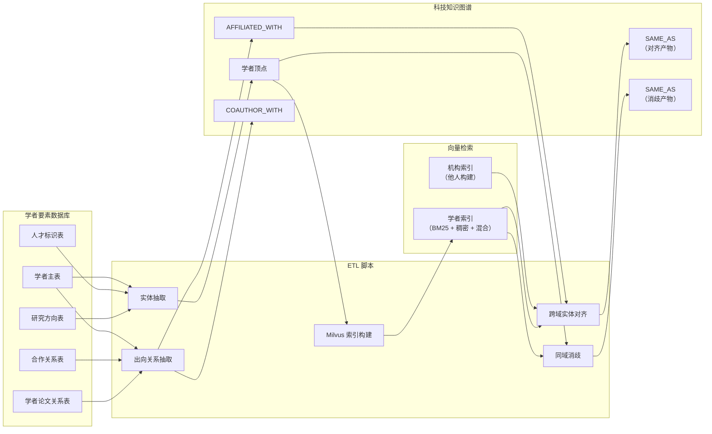
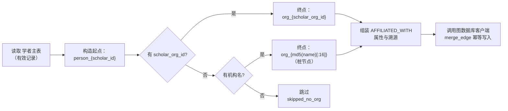
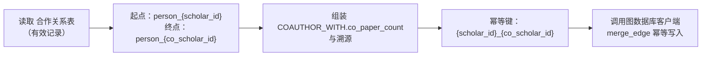
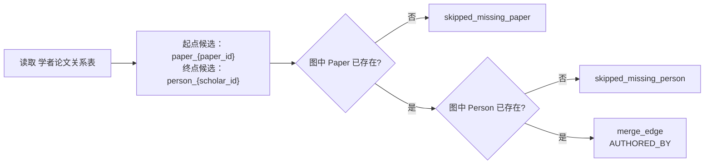
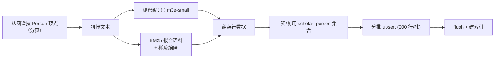
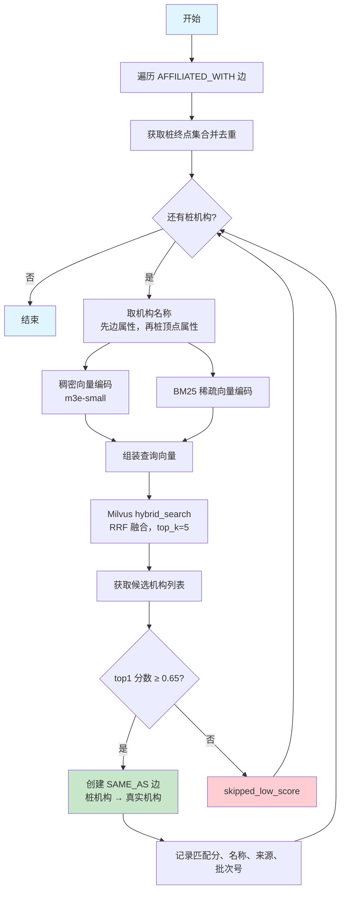
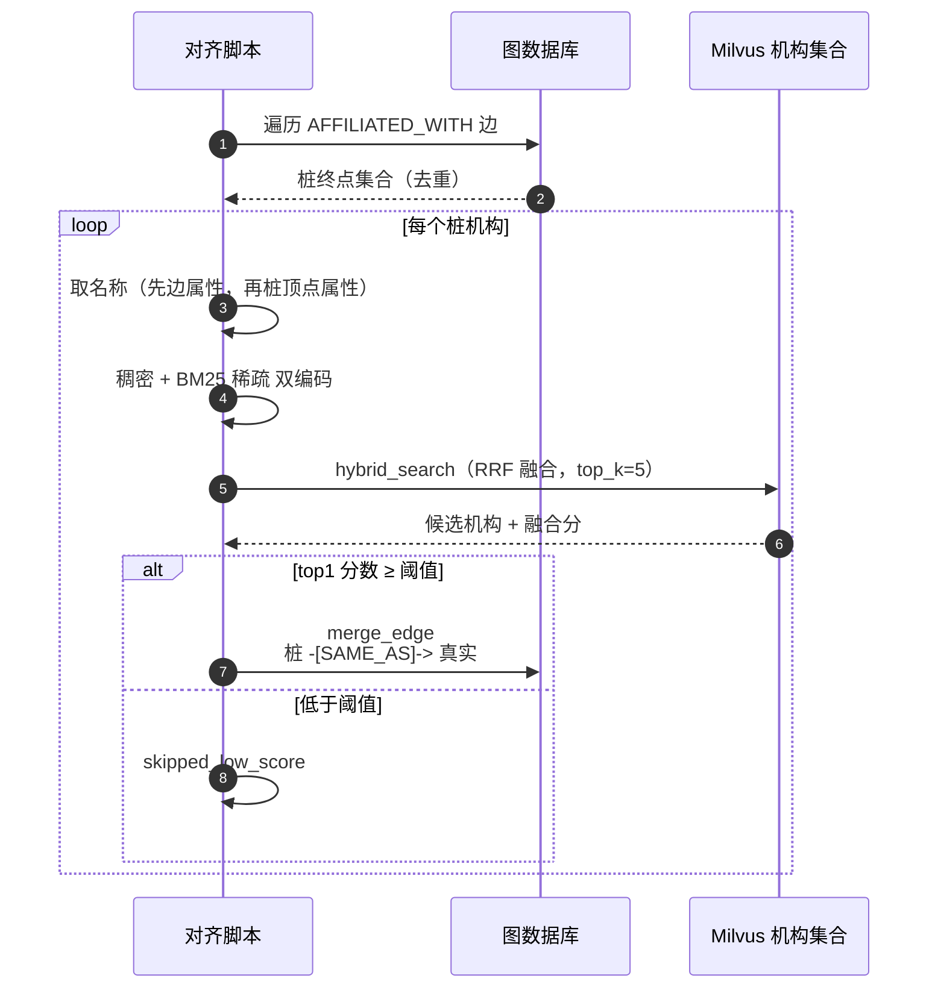
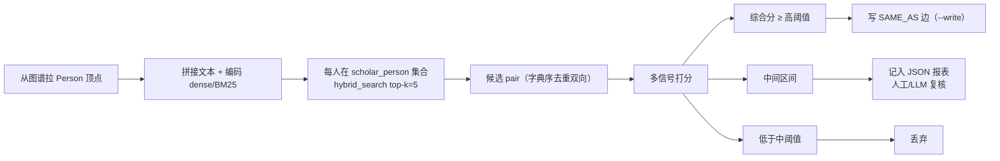

# 学者领域关系抽取与索引流程

> 领域负责人：**伟宁（Scholar）**
> 图空间：`dev`
> 关联脚本：`backend/script/load_scholar_entities.py`、`load_scholar_relations.py`、
> `build_scholar_milvus_index.py`、`align_scholar_affiliations.py`、
> `dedupe_scholar_persons.py`

本文档单独描述**每一种边**的抽取流程、依赖的源表以及 Milvus 索引与实体对齐环节。
配套字段级映射见 `scholar_mapping.md`。

---

## 0. 数据流全景



---

## 1. `AFFILIATED_WITH`（学者 → 机构）

### 1.1 抽取来源

| 源表 | 使用字段 |
|------|---------|
| `dwd_scholar` | `scholar_id`, `scholar_org_id`, `scholar_org_name_zh`, `scholar_org_name_en`, `status` |

只处理 `status = 1` 的记录。

### 1.2 抽取步骤



**关键点**：
- 有正式 `scholar_org_id` → 终点直接命中机构领域正式机构顶点。
- 无 ID 只有名 → 桩节点 `org_{md5(...)}`，**留待 §4 实体对齐环节修正**。
- 幂等键：`identityProps = {"source_record_id": scholar_id}`。

### 1.3 边属性

| 属性 | 值 |
|------|----|
| `affiliation_name` | 机构中文名，缺失回退英文名 |
| `source` | `"scholar"` |
| `source_table` | `"dwd_scholar"` |
| `source_record_id` | `scholar_id` |
| `ingest_batch` / `ingest_time` | 每次 ETL 自动生成 |

---

## 2. `COAUTHOR_WITH`（学者 → 学者）

### 2.1 抽取来源

| 源表 | 使用字段 |
|------|---------|
| `dwd_scholar_coauthor` | `scholar_id`, `co_scholar_id`, `co_paper_count`, `status` |

只处理 `status = 1` 的记录。

### 2.2 抽取步骤



### 2.3 方向语义

`dwd_scholar_coauthor` 天然对称：源表同时保存 `(A, B)` 与 `(B, A)` 两行。脚本按行
1:1 落两条**有向边**，不做去重。从 A 或从 B 出发均可到达对方。

### 2.4 边属性

| 属性 | 值 |
|------|----|
| `co_paper_count` | 合著论文数，缺失置 0 |
| `source_table` | `"dwd_scholar_coauthor"` |
| `source_record_id` | 组合键 `{scholar_id}_{co_scholar_id}` |
| `ingest_batch` / `ingest_time` | 每次 ETL 自动生成 |

---

## 3. `AUTHORED_BY`（论文 → 学者，跨域兜底）

起点在论文领域（亚涛），学者领域**可选**开启兜底以提高覆盖率。

### 3.1 抽取来源

| 源表 | 使用字段 |
|------|---------|
| `dwd_scholar_paper_relation` | `paper_id`, `scholar_id`, `citations`, `status` |

### 3.2 兜底规则



**开关**：默认关闭，需要 `--include-authored-by-fallback` 显式启用。
`graph.get_node` 探测结果按 VID 缓存，避免重复请求。

### 3.3 边属性

| 属性 | 值 |
|------|----|
| `citations` | 学者对该论文的被引数 |
| `source_table` | `"dwd_scholar_paper_relation"` |
| `source_record_id` | 组合键 `{paper_id}_{scholar_id}` |
| `ingest_batch` / `ingest_time` | 每次 ETL 自动生成 |

---

## 4. Milvus 索引：`scholar_person` 集合

### 4.1 目标

给每个 Person 顶点建立可检索的文本索引，同时支持**关键词精准匹配**与
**语义相似度**，供他人对齐、检索、问答等下游使用。

### 4.2 集合 Schema

| 字段 | 类型 | 说明 |
|------|------|------|
| `vid` | VARCHAR (主键) | `person_{scholar_id}` |
| `scholar_id` | VARCHAR | 供业务侧回查 |
| `name_zh` / `name_en` | VARCHAR | 元数据过滤 |
| `scholar_org` | VARCHAR | 机构名（未经对齐的原文本） |
| `research_fields` | VARCHAR | 研究方向 |
| `text` | VARCHAR | 供 debug 的拼接原文 |
| `dense_vec` | FLOAT_VECTOR (512d) | `moka-ai/m3e-small` 稠密向量 |
| `sparse_vec` | SPARSE_FLOAT_VECTOR | BM25 稀疏向量 |

### 4.3 索引

- `dense_vec`：HNSW，metric = COSINE，`M=16`, `efConstruction=200`
- `sparse_vec`：SPARSE_INVERTED_INDEX，metric = IP

### 4.4 文本拼接

```
{name_zh}｜{name_en}｜机构：{scholar_org}｜研究方向：{research_fields}｜简介：{bio_zh[:500]}
```

### 4.5 构建流程



### 4.6 混合检索

```python
client.hybrid_search(
    collection_name="scholar_person",
    reqs=[dense_req, sparse_req],
    ranker=RRFRanker(k=60),
    limit=top_k,
)
```

---

## 5. 实体对齐：`AFFILIATED_WITH` 桩机构 → 真实机构

### 5.1 触发条件

`AFFILIATED_WITH` 的终点满足回退 VID 形态：正则 `^org_[a-f0-9]{16}$`。
这类桩机构由 §1 抽取时因缺少 `scholar_org_id` 而产生。

### 5.2 对齐流程





### 5.3 参数与开关

| 变量 | 默认 | 说明 |
|------|------|------|
| `SCHOLAR_ORG_COLLECTION` | `organization` | 机构领域 Milvus 集合名 |
| `SCHOLAR_ALIGN_TOPK` | `5` | Milvus 混合检索候选数 |
| `SCHOLAR_ALIGN_MIN_SCORE` | `0.65` | 融合分阈值 |
| `SCHOLAR_DENSE_MODEL` | `moka-ai/m3e-small` | 稠密编码模型 |
| `SCHOLAR_DENSE_DEVICE` | `cpu` | 本地推理设备 |

### 5.4 产物

- 新增 `SAME_AS` 边（桩机构 → 真实机构），带匹配分数、名称、来源与批次号。
- **本轮不删除也不改写**原 `AFFILIATED_WITH`；查询侧遍历 `SAME_AS` 展开，
  或后续离线 job 统一改写为直接指向真实机构。

### 5.5 依赖

- 需要机构领域已构建同名 Milvus 集合，且 `dense_vec` 维度与本脚本一致（512d，
  `moka-ai/m3e-small`）。若集合不存在，脚本会记录一条 warning 并跳过，
  不影响后续执行。

---

## 6. 同域消歧：`Person ↔ Person` `SAME_AS`

### 6.1 问题

`scholar_id` 是 `dwd_scholar` 主键，不等同于自然人全局 ID：

- 同一位学者可能有多条 `scholar_id`（不同批次录入、换机构重新登记等）
- 姓名 / 拼写 / 中英文变体导致源数据无法直接判定
- 反之，不同人也可能同名（`张伟`、`Wang Fang` 之类）

### 6.2 流程



### 6.3 多信号打分

| 信号 | 计算 | 权重 |
|------|------|------|
| Milvus 混合分（BM25+dense RRF） | `hybrid_search` 返回 score | 0.40 |
| 姓名相似度 | 中英各算 `WRatio`，取较大者 / 100 | 0.30 |
| 机构相似度 | `token_set_ratio(scholar_org)` / 100 | 0.20 |
| 研究方向 Jaccard | 按 `；,、` 切分求交并 | 0.10 |

综合分 = 加权和，取值区间 0~1。

### 6.4 决策阈值

| 综合分 | 处置 |
|--------|------|
| `≥ 0.75` | 高置信 → 直接写 `SAME_AS` |
| `0.55 ~ 0.75` | 疑似 → JSON 报表 |
| `< 0.55` | 丢弃 |

阈值可通过 `--high-threshold`、`--mid-threshold` 或 `SCHOLAR_DEDUPE_HIGH/MID` 覆盖。

### 6.5 幂等与产物

- 组合键 `identityProps = {"source_record_id": f"{a__b}"}`（按字典序规范化，避免双向重复）。
- `SAME_AS` 边属性带 `signal_*`、`match_score`、`ingest_batch/time`，可回溯判定依据。
- **不改动** `AFFILIATED_WITH` / `COAUTHOR_WITH`；查询侧遍历 `SAME_AS` 展开即可。

### 6.6 局限

- 目前**不引入合作者/论文交集信号**（避免每对 pair 都要查图，性能考虑）；生产可加 `signal_coauthor` / `signal_paper`。
- 中间区间需要 LLM 或人工判定；本脚本只出报表，不自动落图。

---

## 7. 命令速查

```bash
cd backend

# 1) 抽实体（Person）
uv run python -m script.load_scholar_entities --dry-run
uv run python -m script.load_scholar_entities

# 2) 抽出向边
uv run python -m script.load_scholar_relations --dry-run
uv run python -m script.load_scholar_relations

# 3) 兜底：跨域 AUTHORED_BY（可选）
uv run python -m script.load_scholar_relations --include-authored-by-fallback

# 4) 建 Milvus 学者索引（BM25 + 稠密 + 混合）
uv run python -m script.build_scholar_milvus_index --dry-run
uv run python -m script.build_scholar_milvus_index

# 5) 对齐 AFFILIATED_WITH 桩机构（依赖 4 与他人构建的 Organization 集合）
uv run python -m script.align_scholar_affiliations --dry-run
uv run python -m script.align_scholar_affiliations

# 6) 同域消歧：识别疑似同一人（依赖 4）
uv run python -m script.dedupe_scholar_persons --dry-run --report /tmp/scholar_dedupe.json
uv run python -m script.dedupe_scholar_persons --write
```

### 环境变量

| 变量 | 说明 |
|------|------|
| `MYSQL_HOST/PORT/USERNAME/PASSWORD` | 指向 `gkx_element` 所在 MySQL |
| `MYSQL_DATABASE` | `gkx_element` |
| `TRS_GRAPH_BASE_URL` / `TRS_GRAPH_SPACE` / `TRS_GRAPH_API_KEY` | TRSGraph 连接 |
| `MILVUS_URI` | Milvus 端点，默认 `http://127.0.0.1:19531`（docker-compose 部署） |
| `MILVUS_TOKEN` | 可选认证 token |
| `MILVUS_DB_NAME` | 默认 `default` |
| `SCHOLAR_DENSE_MODEL` | 稠密模型（默认 `moka-ai/m3e-small`） |
| `SCHOLAR_DENSE_DEVICE` | `cpu` 或 `cuda`；GPU 环境显著加速 |
| `SCHOLAR_ORG_COLLECTION` | 机构集合名，默认 `organization` |
| `SCHOLAR_ALIGN_TOPK` / `SCHOLAR_ALIGN_MIN_SCORE` | 跨域对齐 top-k 与阈值 |
| `SCHOLAR_DEDUPE_TOPK` / `SCHOLAR_DEDUPE_HIGH` / `SCHOLAR_DEDUPE_MID` | 同域消歧 top-k 与两档阈值 |

---

## 8. 图谱数据重建（学者域 Runbook）

改完学者域业务后，按本节顺序重跑即可把图与向量索引恢复到与 MySQL 源表一致的状态。

**一键执行**：`rebuild_scholar_graph.py` 把 ①~⑤ 全部编排成一条命令，空间/集合/数据库全部读环境变量，无硬编码，任一步失败即中止：

```bash
TRS_GRAPH_SPACE=<图空间> SCHOLAR_MILVUS_COLLECTION=<向量集合> MYSQL_DATABASE=gkx_element \
PYTHONPATH=. ./.venv/bin/python -m script.rebuild_scholar_graph
# 常用：--dry-run / --stages schema,entities,relations / --limit 50（小规模试跑）
```

不使用一键脚本时，按下面的手工顺序执行。

### 8.1 脚本与依赖顺序

```
① load_scholar_entities  →  ② load_scholar_relations  →  ③ build_scholar_milvus_index
                                                              ├─→ ④ align_scholar_affiliations
                                                              └─→ ⑤ dedupe_scholar_persons
```

- ① 抽 `Person` 顶点（VID `person_{scholar_id}`），源表 `dwd_scholar` + `dwd_scholar_talent_flag` + `dwd_scholar_research_direction`。
- ② 抽 `AFFILIATED_WITH` / `COAUTHOR_WITH`（可选 `AUTHORED_BY`）。**软依赖 ①**：边是直接 `merge_edge`，不校验端点，跳过 ① 会产生悬挂边。
- ③ 读图中 `source_table == "dwd_scholar"` 的 `Person`，建/更新 Milvus 集合 `scholar_person`（稠密 512d HNSW-COSINE + BM25 稀疏）。集合由脚本自动建，无需单独 DDL。
- ④ 把 `AFFILIATED_WITH` 的桩机构（`^org_[a-f0-9]{16}$`）对齐到真实 `Organization`，写 `SAME_AS`。**依赖机构域的 `organization` 集合**；集合不存在时只告警跳过，不报错。
- ⑤ 同域同名消歧，写 `Person↔Person SAME_AS`。**硬依赖 ③**：`scholar_person` 不存在会直接抛 `MilvusException`。
- ④ 与 ⑤ 互不依赖，可任意顺序或并行。

三个脚本都是幂等的（`merge_node` / `merge_edge` + `identityProps`），重复执行不会产生重复数据，可以安全重跑。

### 8.2 完整命令

命令与阈值见 §7「命令速查」，直接照抄即可。约定：**每步先 `--dry-run` 看统计，再正式执行**。

补充说明：

- ⑤ `dedupe_scholar_persons` 默认就是 dry-run，只有加 `--write` 才落图。
- ③ 的 `--drop-existing` 会**删掉整个 `scholar_person` 集合**再重建，只在 schema 变更时使用。
- ② 的 `--include-authored-by-fallback` 是可选的跨域兜底，会校验两端顶点是否存在。
- ③⑤ 在本进程内跑 `SentenceTransformerEmbeddingFunction` 做向量化，**不走** `m3e-embedding` 容器（那个服务和 `PATENT_EMBEDDING_*` 只属于专利域）。首次执行会下载模型。

### 8.3 首次/新环境的一次性前置

按顺序确认，已具备的可跳过：

1. **MySQL 源表**：`backend/schemas/ddl/2026.7.18要素库更新/人才要素库.sql` 需手动执行。`init_db.py` 找的是不存在的 `schemas/ddl/scholar/` 目录，会打印 `SKIP: scholar/ not found`，**不会**帮你建学者表。
2. **图空间 schema**：`uv run python -m script.init_scholar_schema`（幂等：DESCRIBE 对比后 CREATE/ALTER，空间取 `TRS_GRAPH_SPACE`；`--create-space` 可先建空间）。旧的 `init_project_schema` 硬编码 `dev`，仅建窄版 Person，不推荐。
3. **provenance 字段**：`backend/schemas/ddl/scholar_provenance_ddl.ngql` 没有 runner，可在 nebula-console 手动执行；`load_scholar_relations.py` 的 `ensure_schema()` 也会做幂等 `ALTER EDGE ADD`，正常流程无需手动。
4. **环境变量**：见 §7「环境变量」。真实来源是 `.env` / 进程环境变量，`config/*.yml` 是遗留文件、并不会被加载。

### 8.4 不要用的同名脚本

- `script/load_graph.py` —— 早期版本，`merge_node` 行为不可靠。
- `script/init_graph_schema.py` —— 老 `techkg` 空间 + `Scholar`/`EMPLOYED_BY` 命名，和现在的 `dev` + `Person` 无关。
- `script/organization_*` —— 机构域，不由学者域负责。
- `script/register_scholar_operators.py` —— 只是把 5 个脚本注册成 operator，**不提供编排**，不能替代本节顺序。
