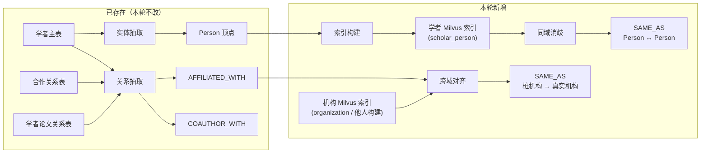
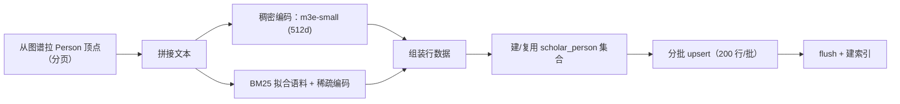
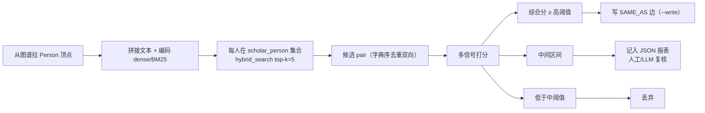

# 学者领域 Milvus 索引、对齐与消歧

> 领域负责人：**伟宁（Scholar）**
> 图空间：`dev`
> 关联脚本：
> - `backend/script/build_scholar_milvus_index.py`
> - `backend/script/align_scholar_affiliations.py`
> - `backend/script/dedupe_scholar_persons.py`

本文档只描述本轮新增的**基于 Milvus 的索引、跨域对齐、同域消歧**流程。
关系抽取本身（`AFFILIATED_WITH` / `COAUTHOR_WITH` / `AUTHORED_BY` 兜底）**未做任何改动**，
字段与幂等约定详见 [`scholar_mapping.md`](./scholar_mapping.md)。

---

## 0. 抽取部分：无变化

| 边 | 脚本 | 状态 |
|----|------|------|
| `AFFILIATED_WITH` (Person → Organization) | `load_scholar_relations.py` | 未改动 |
| `COAUTHOR_WITH` (Person → Person) | `load_scholar_relations.py` | 未改动 |
| `AUTHORED_BY` 跨域兜底 (Paper → Person) | `load_scholar_relations.py --include-authored-by-fallback` | 未改动 |
| Person 顶点 | `load_scholar_entities.py` | 未改动 |

字段级映射见 [`scholar_mapping.md`](./scholar_mapping.md)。以下小节只讲新增内容。

---

## 1. 数据流全景（含新增部分）



---

## 2. Milvus 索引：`scholar_person` 集合

### 2.1 集合 Schema

| 字段 | 类型 | 说明 |
|------|------|------|
| `vid` | VARCHAR (主键) | `person_{scholar_id}` |
| `scholar_id` | VARCHAR | 供业务侧回查 |
| `name_zh` / `name_en` | VARCHAR | 元数据过滤 |
| `scholar_org` | VARCHAR | 机构名（未经对齐的原文本） |
| `research_fields` | VARCHAR | 研究方向 |
| `text` | VARCHAR | 拼接后的完整文本（供 debug） |
| `dense_vec` | FLOAT_VECTOR (512d) | `moka-ai/m3e-small` 稠密向量 |
| `sparse_vec` | SPARSE_FLOAT_VECTOR | BM25 稀疏向量 |

### 2.2 索引

- `dense_vec`：**HNSW**，metric = COSINE，`M=16`, `efConstruction=200`
- `sparse_vec`：**SPARSE_INVERTED_INDEX**，metric = IP

### 2.3 文本拼接

```
{name_zh}｜{name_en}｜机构：{scholar_org}｜研究方向：{research_fields}｜简介：{bio_zh[:500]}
```

### 2.4 构建流程



### 2.5 混合检索接口

```python
milvus.hybrid_search(
    collection_name="scholar_person",
    reqs=[dense_req, sparse_req],
    ranker=RRFRanker(k=60),
    limit=top_k,
)
```

---

## 3. 跨域对齐：`AFFILIATED_WITH` 桩机构 → 真实机构

### 3.1 触发条件

`AFFILIATED_WITH` 终点满足回退 VID 形态：正则 `^org_[a-f0-9]{16}$`。
这类桩机构由抽取步骤在缺少 `scholar_org_id` 时按机构名 md5 摘要生成。

### 3.2 对齐流程图


### 3.3 对齐时序图


### 3.3 参数

| 变量 | 默认 | 说明 |
|------|------|------|
| `SCHOLAR_ORG_COLLECTION` | `organization` | 机构领域 Milvus 集合名 |
| `SCHOLAR_ALIGN_TOPK` | `5` | 候选数 |
| `SCHOLAR_ALIGN_MIN_SCORE` | `0.65` | 融合分阈值 |
| `SCHOLAR_DENSE_MODEL` | `moka-ai/m3e-small` | 稠密模型 |
| `SCHOLAR_DENSE_DEVICE` | `cpu` | 推理设备 |

### 3.4 产物与保护

- 新增 `SAME_AS` 边（桩机构 → 真实机构），属性含匹配分、名称、来源、批次号。
- **不删、不改**原 `AFFILIATED_WITH`；查询侧遍历 `SAME_AS` 展开。
- 目标集合不存在时脚本仅记录 warning，不阻塞流水线。

---

## 4. 同域消歧：`Person ↔ Person` `SAME_AS`

### 4.1 问题

`scholar_id` 是 `dwd_scholar` 主键，不等同于自然人全局 ID：

- 同一位学者可能有多条 `scholar_id`（不同批次录入、换机构重新登记等）
- 姓名 / 拼写 / 中英文变体导致源数据无法直接判定
- 反之，不同人也可能同名（`张伟`、`Wang Fang` 之类）

### 4.2 流程



### 4.3 多信号打分

| 信号 | 计算 | 权重 |
|------|------|------|
| Milvus 混合分（BM25+dense RRF） | `hybrid_search` 返回 score | 0.40 |
| 姓名相似度 | 中英各算 `WRatio`，取较大者 / 100 | 0.30 |
| 机构相似度 | `token_set_ratio(scholar_org)` / 100 | 0.20 |
| 研究方向 Jaccard | 按 `；,、` 切分求交并 | 0.10 |

综合分 = 加权和，取值区间 0~1。

### 4.4 决策阈值

| 综合分 | 处置 |
|--------|------|
| `≥ 0.75` | 高置信 → 直接写 `SAME_AS` |
| `0.55 ~ 0.75` | 疑似 → JSON 报表 |
| `< 0.55` | 丢弃 |

阈值可通过 `--high-threshold`、`--mid-threshold` 或 `SCHOLAR_DEDUPE_HIGH/MID` 覆盖。

### 4.5 幂等与产物

- 组合键 `identityProps = {"source_record_id": f"{a__b}"}`（按字典序规范化，避免双向重复）。
- `SAME_AS` 边属性带 `signal_*`、`match_score`、`ingest_batch/time`，可回溯判定依据。
- **不改动** `AFFILIATED_WITH` / `COAUTHOR_WITH`；查询侧遍历 `SAME_AS` 展开即可。

### 4.6 局限

- 目前**不引入合作者/论文交集信号**（避免每对 pair 都要查图，性能考虑）；生产可加 `signal_coauthor` / `signal_paper`。
- 中间区间需要 LLM 或人工判定；本脚本只出报表，不自动落图。

---

## 5. 命令速查

```bash
cd backend

# 建 Milvus 学者索引（BM25 + 稠密 + 混合）
uv run python -m script.build_scholar_milvus_index --dry-run
uv run python -m script.build_scholar_milvus_index

# 跨域对齐（依赖机构 Milvus 集合）
uv run python -m script.align_scholar_affiliations --dry-run
uv run python -m script.align_scholar_affiliations

# 同域消歧
uv run python -m script.dedupe_scholar_persons --dry-run --report /tmp/scholar_dedupe.json
uv run python -m script.dedupe_scholar_persons --write
```

### 环境变量

| 变量 | 说明 |
|------|------|
| `MILVUS_URI` | 默认 `http://127.0.0.1:19531` |
| `MILVUS_TOKEN` | 可选认证 token |
| `MILVUS_DB_NAME` | 默认 `default` |
| `SCHOLAR_DENSE_MODEL` | 稠密模型（默认 `moka-ai/m3e-small`） |
| `SCHOLAR_DENSE_DEVICE` | `cpu` 或 `cuda` |
| `SCHOLAR_ORG_COLLECTION` | 机构集合名，默认 `organization` |
| `SCHOLAR_ALIGN_TOPK` / `SCHOLAR_ALIGN_MIN_SCORE` | 跨域对齐 top-k 与阈值 |
| `SCHOLAR_DEDUPE_TOPK` / `SCHOLAR_DEDUPE_HIGH` / `SCHOLAR_DEDUPE_MID` | 同域消歧 top-k 与两档阈值 |
