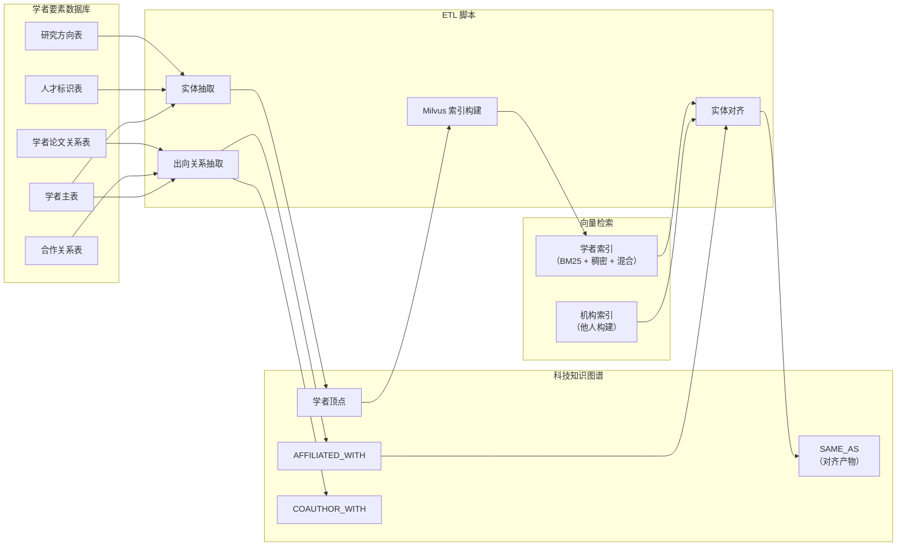
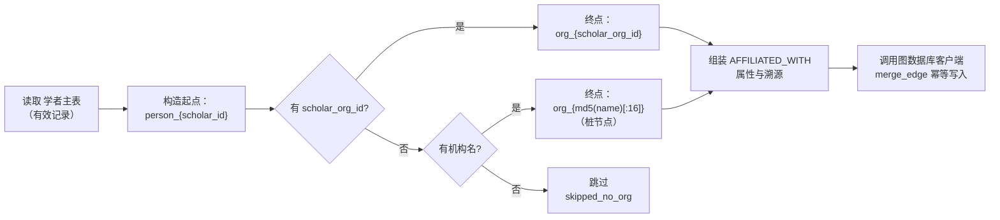
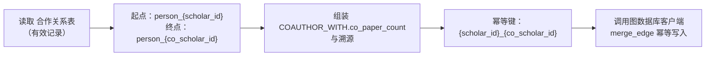
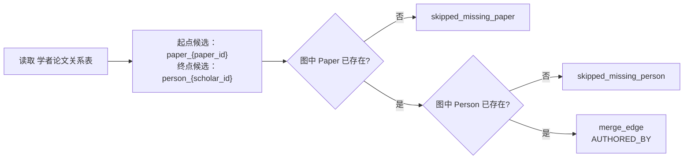
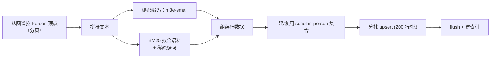
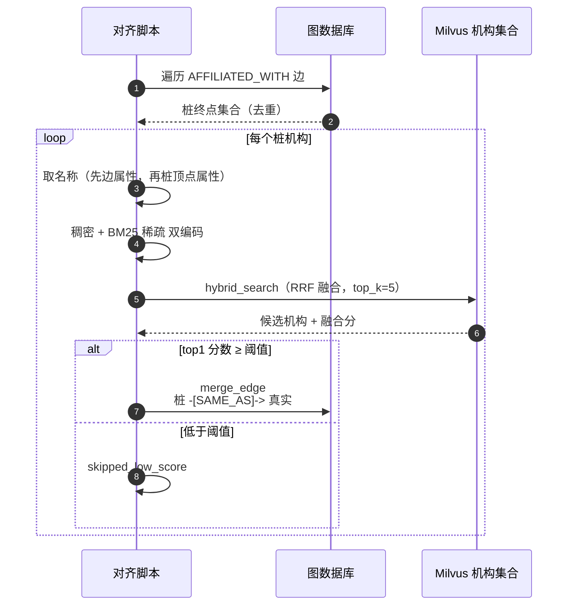

# 学者领域关系抽取与索引流程

> 领域负责人：**伟宁（Scholar）**
> 图空间：`dev`
> 关联脚本：`backend/script/load_scholar_entities.py`、`load_scholar_relations.py`、
> `build_scholar_milvus_index.py`、`align_scholar_affiliations.py`

本文档单独描述**每一种边**的抽取流程、依赖的源表以及 Milvus 索引与实体对齐环节。
配套字段级映射见 `scholar_mapping.md`。

---

## 0. 数据流全景



---

## 1. `AFFILIATED_WITH`（学者 → 机构）

### 1.1 抽取来源

| 源表 | 使用字段 |
|------|---------|
| `dwd_scholar` | `scholar_id`, `scholar_org_id`, `scholar_org_name_zh`, `scholar_org_name_en`, `status` |

只处理 `status = 1` 的记录。

### 1.2 抽取步骤



**关键点**：
- 有正式 `scholar_org_id` → 终点直接命中机构领域正式机构顶点。
- 无 ID 只有名 → 桩节点 `org_{md5(...)}`，**留待 §4 实体对齐环节修正**。
- 幂等键：`identityProps = {"source_record_id": scholar_id}`。

### 1.3 边属性

| 属性 | 值 |
|------|----|
| `affiliation_name` | 机构中文名，缺失回退英文名 |
| `source` | `"scholar"` |
| `source_table` | `"dwd_scholar"` |
| `source_record_id` | `scholar_id` |
| `ingest_batch` / `ingest_time` | 每次 ETL 自动生成 |

---

## 2. `COAUTHOR_WITH`（学者 → 学者）

### 2.1 抽取来源

| 源表 | 使用字段 |
|------|---------|
| `dwd_scholar_coauthor` | `scholar_id`, `co_scholar_id`, `co_paper_count`, `status` |

只处理 `status = 1` 的记录。

### 2.2 抽取步骤



### 2.3 方向语义

`dwd_scholar_coauthor` 天然对称：源表同时保存 `(A, B)` 与 `(B, A)` 两行。脚本按行
1:1 落两条**有向边**，不做去重。从 A 或从 B 出发均可到达对方。

### 2.4 边属性

| 属性 | 值 |
|------|----|
| `co_paper_count` | 合著论文数，缺失置 0 |
| `source_table` | `"dwd_scholar_coauthor"` |
| `source_record_id` | 组合键 `{scholar_id}_{co_scholar_id}` |
| `ingest_batch` / `ingest_time` | 每次 ETL 自动生成 |

---

## 3. `AUTHORED_BY`（论文 → 学者，跨域兜底）

起点在论文领域（亚涛），学者领域**可选**开启兜底以提高覆盖率。

### 3.1 抽取来源

| 源表 | 使用字段 |
|------|---------|
| `dwd_scholar_paper_relation` | `paper_id`, `scholar_id`, `citations`, `status` |

### 3.2 兜底规则



**开关**：默认关闭，需要 `--include-authored-by-fallback` 显式启用。
`graph.get_node` 探测结果按 VID 缓存，避免重复请求。

### 3.3 边属性

| 属性 | 值 |
|------|----|
| `citations` | 学者对该论文的被引数 |
| `source_table` | `"dwd_scholar_paper_relation"` |
| `source_record_id` | 组合键 `{paper_id}_{scholar_id}` |
| `ingest_batch` / `ingest_time` | 每次 ETL 自动生成 |

---

## 4. Milvus 索引：`scholar_person` 集合

### 4.1 目标

给每个 Person 顶点建立可检索的文本索引，同时支持**关键词精准匹配**与
**语义相似度**，供他人对齐、检索、问答等下游使用。

### 4.2 集合 Schema

| 字段 | 类型 | 说明 |
|------|------|------|
| `vid` | VARCHAR (主键) | `person_{scholar_id}` |
| `scholar_id` | VARCHAR | 供业务侧回查 |
| `name_zh` / `name_en` | VARCHAR | 元数据过滤 |
| `scholar_org` | VARCHAR | 机构名（未经对齐的原文本） |
| `research_fields` | VARCHAR | 研究方向 |
| `text` | VARCHAR | 供 debug 的拼接原文 |
| `dense_vec` | FLOAT_VECTOR (512d) | `moka-ai/m3e-small` 稠密向量 |
| `sparse_vec` | SPARSE_FLOAT_VECTOR | BM25 稀疏向量 |

### 4.3 索引

- `dense_vec`：HNSW，metric = COSINE，`M=16`, `efConstruction=200`
- `sparse_vec`：SPARSE_INVERTED_INDEX，metric = IP

### 4.4 文本拼接

```
{name_zh}｜{name_en}｜机构：{scholar_org}｜研究方向：{research_fields}｜简介：{bio_zh[:500]}
```

### 4.5 构建流程



### 4.6 混合检索

```python
client.hybrid_search(
    collection_name="scholar_person",
    reqs=[dense_req, sparse_req],
    ranker=RRFRanker(k=60),
    limit=top_k,
)
```

---

## 5. 实体对齐：`AFFILIATED_WITH` 桩机构 → 真实机构

### 5.1 触发条件

`AFFILIATED_WITH` 的终点满足回退 VID 形态：正则 `^org_[a-f0-9]{16}$`。
这类桩机构由 §1 抽取时因缺少 `scholar_org_id` 而产生。

### 5.2 对齐流程



### 5.3 参数与开关

| 变量 | 默认 | 说明 |
|------|------|------|
| `SCHOLAR_ORG_COLLECTION` | `organization` | 机构领域 Milvus 集合名 |
| `SCHOLAR_ALIGN_TOPK` | `5` | Milvus 混合检索候选数 |
| `SCHOLAR_ALIGN_MIN_SCORE` | `0.65` | 融合分阈值 |
| `SCHOLAR_DENSE_MODEL` | `moka-ai/m3e-small` | 稠密编码模型 |
| `SCHOLAR_DENSE_DEVICE` | `cpu` | 本地推理设备 |

### 5.4 产物

- 新增 `SAME_AS` 边（桩机构 → 真实机构），带匹配分数、名称、来源与批次号。
- **本轮不删除也不改写**原 `AFFILIATED_WITH`；查询侧遍历 `SAME_AS` 展开，
  或后续离线 job 统一改写为直接指向真实机构。

### 5.5 依赖

- 需要机构领域已构建同名 Milvus 集合，且 `dense_vec` 维度与本脚本一致（512d，
  `moka-ai/m3e-small`）。若集合不存在，脚本会记录一条 warning 并跳过，
  不影响后续执行。

---

## 6. 命令速查

```bash
cd backend

# 1) 抽实体（Person）
uv run python -m script.load_scholar_entities --dry-run
uv run python -m script.load_scholar_entities

# 2) 抽出向边
uv run python -m script.load_scholar_relations --dry-run
uv run python -m script.load_scholar_relations

# 3) 兜底：跨域 AUTHORED_BY（可选）
uv run python -m script.load_scholar_relations --include-authored-by-fallback

# 4) 建 Milvus 学者索引（BM25 + 稠密 + 混合）
uv run python -m script.build_scholar_milvus_index --dry-run
uv run python -m script.build_scholar_milvus_index

# 5) 对齐 AFFILIATED_WITH 桩机构（依赖 4 与他人构建的 Organization 集合）
uv run python -m script.align_scholar_affiliations --dry-run
uv run python -m script.align_scholar_affiliations
```

### 环境变量

| 变量 | 说明 |
|------|------|
| `MYSQL_HOST/PORT/USERNAME/PASSWORD` | 指向 `gkx_element` 所在 MySQL |
| `MYSQL_DATABASE` | `gkx_element` |
| `TRS_GRAPH_BASE_URL` / `TRS_GRAPH_SPACE` / `TRS_GRAPH_API_KEY` | TRSGraph 连接 |
| `MILVUS_URI` | Milvus 端点，默认 `http://127.0.0.1:19531`（docker-compose 部署） |
| `MILVUS_TOKEN` | 可选认证 token |
| `MILVUS_DB_NAME` | 默认 `default` |
| `SCHOLAR_DENSE_MODEL` | 稠密模型（默认 `moka-ai/m3e-small`） |
| `SCHOLAR_DENSE_DEVICE` | `cpu` 或 `cuda`；GPU 环境显著加速 |
