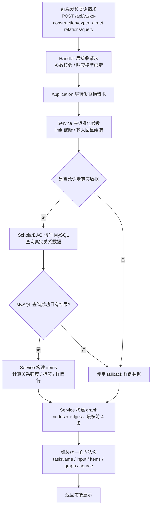

# 科技专家直接关系查询实现方案

## 1. 文档目标

本文档用于说明“科技专家直接关系查询”模块的当前实现方案，覆盖接口入口、服务分层、MySQL 数据读取、结果组装、图谱构建、降级策略与后续优化方向，便于研发、联调和后续 PR 评审时统一理解。

当前实现面向“直接关系查询”场景，核心目标是：

- 根据专家 A、专家 B、机构关键词、时间范围等条件查询真实直接关系数据
- 从 MySQL 中读取科技专家共著关系并转换为统一接口结构
- 同时返回结构化结果和前端图谱展示结果
- 当 MySQL 查询异常或无可用真实数据时，提供 fallback 样例结果，避免前端完全空白

## 2. 当前实现范围

当前模块已经落地以下能力：

- 提供 `GET /api/v1/kg-construction/expert-direct-relations`
- 提供 `POST /api/v1/kg-construction/expert-direct-relations/query`
- 提供 `GET /api/v1/kg-construction/expert-direct-relations/query`
- 支持查询参数：
  - `dataSource`
  - `expertAId`
  - `expertBId`
  - `institution`
  - `startTime`
  - `endTime`
  - `limit`
- 支持返回：
  - 查询输入回显
  - 结构化直接关系列表
  - 图谱节点与边
  - 数据来源说明
  - API 示例信息

## 3. 分层设计

当前代码按后端分层组织：

- Handler 层
  - 文件：[expert_direct_relation.py](/Users/bwn/Documents/百度技术文档/模型训练文档/tech-kg-api-main-deploy/backend/biz/handler/expert_direct_relation.py)
  - 负责路由定义、请求参数接收、响应模型绑定
- Application 层
  - 文件：[expert_direct_relation.py](/Users/bwn/Documents/百度技术文档/模型训练文档/tech-kg-api-main-deploy/backend/application/expert_direct_relation.py)
  - 负责应用编排，将请求转发给 Service
- Service 层
  - 文件：[expert_direct_relation.py](/Users/bwn/Documents/百度技术文档/模型训练文档/tech-kg-api-main-deploy/backend/service/expert_direct_relation.py)
  - 负责核心业务逻辑、结果组装、图谱构建、fallback 控制
- DAO 层
  - 文件：[scholar.py](/Users/bwn/Documents/百度技术文档/模型训练文档/tech-kg-api-main-deploy/backend/dao/scholar.py)
  - 负责从 MySQL 读取科技专家共著直接关系
- Schema 层
  - 文件：[expert_direct_relation.py](/Users/bwn/Documents/百度技术文档/模型训练文档/tech-kg-api-main-deploy/backend/biz/schema/expert_direct_relation.py)
  - 负责请求响应模型、字段约束、示例定义

## 4. 主流程图

## 5. 接口设计

### 5.1 描述接口

- 路径：`GET /api/v1/kg-construction/expert-direct-relations`
- 用途：返回模块描述信息

### 5.2 查询接口

- 路径：`POST /api/v1/kg-construction/expert-direct-relations/query`
- 路径：`GET /api/v1/kg-construction/expert-direct-relations/query`
- 用途：查询科技专家直接关系

### 5.3 请求参数

当前请求参数定义在：
[expert_direct_relation.py](/Users/bwn/Documents/百度技术文档/模型训练文档/tech-kg-api-main-deploy/backend/biz/schema/expert_direct_relation.py)

参数说明如下：

| 字段 | 类型 | 说明 |
| --- | --- | --- |
| `dataSource` | `Literal["all"]` | 当前固定为 `all` |
| `expertAId` | `str \| None` | 专家 A 的 scholar_id 或姓名关键词 |
| `expertBId` | `str \| None` | 专家 B 的 scholar_id 或姓名关键词 |
| `institution` | `str \| None` | 机构关键词 |
| `startTime` | `str \| None` | 起始日期，格式 `YYYY-MM-DD` |
| `endTime` | `str \| None` | 结束日期，格式 `YYYY-MM-DD` |
| `limit` | `int` | 返回结果数，最大 100 |

## 6. MySQL 真实数据查询方案

### 6.1 主要数据表

当前 DAO 逻辑主要依赖：

- `dwd_scholar_coauthor`
- `dwd_scholar`
- `ods_patent`
- `ods_zh_project`
- `ods_en_project`

### 6.2 查询逻辑

DAO 方法：
[list_direct_coauthor_relations](/Users/bwn/Documents/百度技术文档/模型训练文档/tech-kg-api-main-deploy/backend/dao/scholar.py)

当前 SQL 方案特点：

- 以 `dwd_scholar_coauthor` 为主表读取直接共著关系
- 左连接 `dwd_scholar`，补齐专家名称、机构、H 指数、论文数、被引数
- 支持按以下条件过滤：
  - 专家 A
  - 专家 B
  - 机构关键词
- 起始时间
- 结束时间
- 当只输入专家 A 时，支持从共著对端反向识别，保证可以查出该专家作为关系另一侧出现的记录
- 对 `limit` 做最大值裁剪，避免单次查询过大
- 对共同专利、共同项目采用严格映射策略：
  - 只有人物文本能精确映射到唯一 `scholar_id`，才生成关系
  - 找不到 `scholar_id` 或命中多个学者时，直接舍弃该人物
  - 若同一专利 / 项目下最终不足 2 个有效学者，则舍弃该关系
  - 不做模糊匹配，不引入弱确定性关系

### 6.3 查询产出字段

DAO 返回的原始字段主要包括：

- `relation_key`
- `expert_a_id`
- `expert_a_name`
- `expert_a_org`
- `expert_a_h_index`
- `expert_a_paper_nums`
- `expert_a_citation_nums`
- `expert_b_id`
- `expert_b_name`
- `expert_b_org`
- `expert_b_h_index`
- `expert_b_paper_nums`
- `expert_b_citation_nums`
- `co_paper_count`
- `relation_time`

这些原始字段在 Service 层被进一步转换为接口响应字段。

## 7. Service 层处理逻辑

Service 文件：
[expert_direct_relation.py](/Users/bwn/Documents/百度技术文档/模型训练文档/tech-kg-api-main-deploy/backend/service/expert_direct_relation.py)

### 7.1 参数标准化

在 `query()` 方法中，当前会先进行：

- `limit` 截断到 `1 ~ 100`
- 所有字符串参数做 `strip()`
- 生成 `input` 字段作为请求回显

### 7.2 数据源控制

当前逻辑中：

- `dataSource` 虽然对外保留，但实际标准化后统一按 `all` 处理
- 默认优先查询 MySQL
- 若 MySQL 查询异常，则进入 fallback

返回中的 `source` 字段用于描述最终数据来源：

- `requested`
- `actual`
- `fallback`

### 7.3 结构化结果构建

每条关系结果通过 `_build_item()` 组装，核心处理包括：

- 生成 `expertA` / `expertB` 基础信息
- 生成 `institution`
- 生成 `reasonTags`
- 生成 `relationSummary`
- 根据合作论文数和关系标签计算 `relationStrength`
- 生成 `detailRows`，供前端结构化结果卡片直接展示

### 7.4 图谱结果构建

图谱由 `_build_graph()` 生成，当前策略为：

- 最多只展示前 4 条关系结果
- 每条关系抽取三个核心节点：
  - 专家 A
  - 专家 B
  - 关系归属机构
- 每条关系抽取三类边：
  - 专家 A -> 专家 B
  - 专家 A -> 机构
  - 专家 B -> 机构

这样可以保证前端图谱不至于因结果过多而失控，同时保留“人物关系 + 机构归属”的核心信息。

## 8. fallback 降级方案

当前在 Service 层内置 `FALLBACK_ITEMS`。

触发场景：

- MySQL 查询抛异常
- 当前实际数据源未成功切到 MySQL

降级目标：

- 保证前端页面有可渲染结果
- 保证联调、演示、样式调试阶段不出现完全空白

当前 fallback 结果为静态样例数据，不代表真实线上关系，只用于兜底展示。

## 9. 响应结构

当前响应结构定义在：
[expert_direct_relation.py](/Users/bwn/Documents/百度技术文档/模型训练文档/tech-kg-api-main-deploy/backend/biz/schema/expert_direct_relation.py)

核心响应字段如下：

| 字段 | 说明 |
| --- | --- |
| `taskName` | 当前任务名称 |
| `input` | 请求参数回显 |
| `total` | 结果总数 |
| `items` | 直接关系列表 |
| `graph` | 图谱节点与边 |
| `source` | 最终数据来源说明 |
| `apiResultExample` | 前端 API 示例展示数据 |

其中 `items` 每条结果当前包含：

- `key`
- `relationType`
- `expertA`
- `expertB`
- `institution`
- `coPaperCount`
- `relationStrength`
- `reasonTags`
- `relationSummary`
- `lastUpdatedAt`
- `detailRows`

## 10. 前端对接方式

前端当前直接消费后端返回的两部分数据：

- `items`
  - 用于右侧结构化详情、详情卡片、API 返回示例
- `graph`
  - 用于左侧图谱渲染

这意味着后端已经承担了较多“面向展示”的组装职责，前端只做渲染，不再二次推理关系。

## 11. 当前方案的优点

- 分层清晰，路由、应用、服务、DAO 职责明确
- 能直接读取 MySQL 真实数据，而不是只依赖样例
- 同时支持结构化列表和图谱渲染，适合当前页面
- 内置 fallback，联调时不容易完全空白
- 对 `limit` 做了保护，避免一次性拉取过大结果

## 12. 当前已知限制

当前版本也有几个明确限制：

- `dataSource` 目前只保留了 `all`，没有真正多数据源切换能力
- 直接关系当前已覆盖共著、共同专利、共同项目三类证据，但专利/项目关系依赖人物文本到 `scholar_id` 的精确映射，召回率会低于共著关系
- 时间过滤是基于关系表更新时间 / 创建时间近似处理，不是严格业务时段
- 图谱当前只展示前 4 条结果，适合页面展示，不适合大规模分析
- fallback 仍是静态样例，不适合作为正式生产结果来源

## 13. 后续优化建议

建议按以下顺序继续演进：

### 13.1 数据层优化

- 为 `dwd_scholar_coauthor` 的高频过滤字段补索引
- 进一步核对 `scholar_id`、机构名称、时间字段的使用一致性
- 当结果量进一步增大时，考虑分页或游标查询

### 13.2 关系语义扩展

- 在“直接关系”中纳入共项目、同机构、同团队等多种关系证据
- 细化 `relationType` 与 `reasonTags` 的生成逻辑
- 对关系强度评分公式做可配置化

### 13.3 工程能力优化

- 将 fallback 改为可配置开关
- 为 Service / DAO 增加测试覆盖
- 补充统一的错误码和统一响应包装

## 14. 总结

当前“科技专家直接关系查询”模块已经形成一条完整可用链路：

- 前端请求进入 FastAPI Handler
- Application 调用 Service
- Service 通过 DAO 读取 MySQL 真实关系数据
- Service 统一输出结构化结果与图谱结果
- 异常场景下通过 fallback 保证页面可展示

这套方案适合作为当前版本的正式实现基础。后续如果继续增强，只需要在 DAO 扩充关系来源、在 Service 扩充关系判定与评分逻辑，即可逐步演进，而不必推翻现有分层结构。
