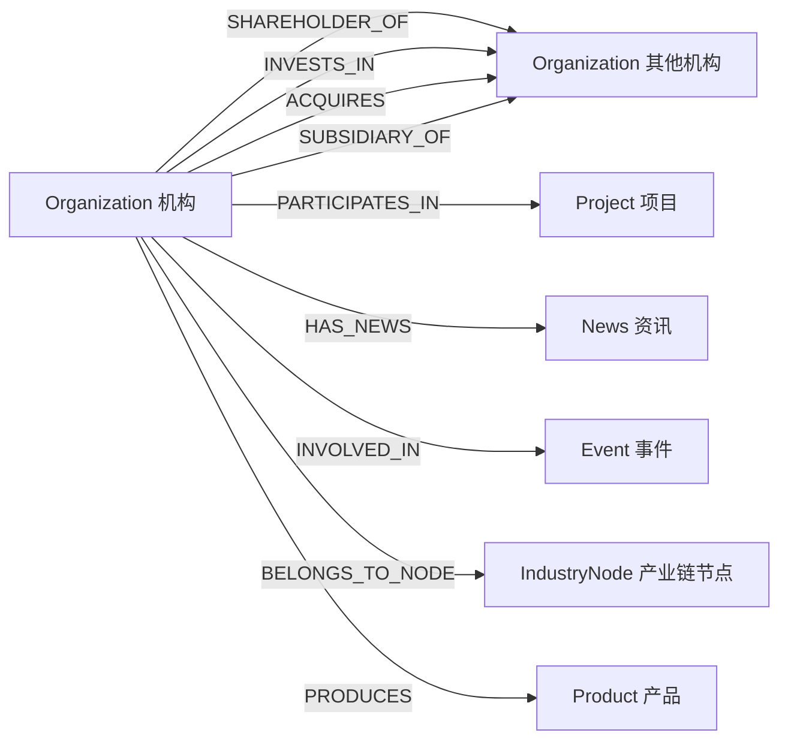
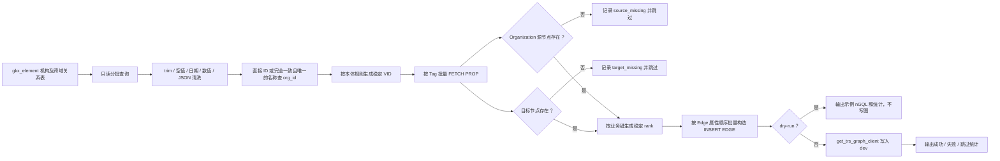

# 国内机构、国外机构要素库 → TRSGraph 图谱详细映射

> 本文档由 `gkx_element` 当前数据库 `information_schema` 自动生成，覆盖 39 张表及其每一个物理字段。
>
> 2026-07-23 补充：本文档同时覆盖“只连接已有实体”的
> `script.organization_relation_etl`。第三节以前的关系结论优先于后面的历史建点说明；
> 新 ETL 不创建 Organization、Person、Project、Patent、Paper、Journal、News、Event
> 等任何顶点。

## 一、统一建模约定

- 国内与国外机构统一为 `Organization`，通过 `org_kind` 区分国内机构、高校、科研院所、港澳台企业和海外机构。
- `Organization` VID 优先为 `org_{org_id}`；超过 dev 空间 `FIXED_STRING(64)` 限制时截断并附加 MD5。Person 按规范化姓名 MD5，Event 按表名与稳定业务键生成。
- 全部节点写入 `source_system/source_table/source_record_id/ingest_batch/ingest_time/source_update_time`；源表全部字段还会进入 `extra_json`，因此未升格为本体属性的字段也不会丢失。
- 物理 DWD 表建为 `DataSource`，业务节点通过 `SOURCED_FROM` 指向它；`data_source` 是真实上游表名时，创建 `原始 DataSource -[DERIVED_FROM]-> DWD DataSource`。
- 关系方向：`Person/Organization -[LEGAL_REP_OF|SHAREHOLDER_OF|EXECUTIVE_OF|BENEFICIAL_OWNER_OF|ACTUAL_CONTROLLER_OF]-> Organization`；`Organization -[INVESTS_IN|ACQUIRES|SUBSIDIARY_OF]-> Organization`；`Organization -[HAS_NEWS]-> News`；`Organization -[INVOLVED_IN]-> Event`。
- 幂等规则：节点 VID、边 rank 均确定性生成；同一源数据重复执行覆盖同一节点/同一条边，不产生重复结构。

## 二、与旧 mapping.md 的名称校正

- `dwd_org_reg_info` 以当前库实际表 `dwd_org_base_info` 为准。
- `dwd_org_hels_info` 以当前库实际表 `dwd_org_heis_info` 为准。
- 旧 `dwd_org_bid_info` 拆分为 `dwd_bid_base_out`、`dwd_bid_win_candidate_out`、`dwd_bid_purchase_agency_out`、`dwd_bid_target_item_out`。
- `DERIVED_FROM` 方向以 ontology.md 为准：原始数据源指向加工后的要素数据源。

## 三、当前机构关系 ETL 的判定规则

### 3.1 状态标识

| 状态 | 含义 |
|---|---|
| 已确认映射 | `ontology.md` 有正式边；真实 MySQL 表和字段已核验；`dev` 中 Tag、Edge 和 VID 规则已核验 |
| 推测映射 | 本体允许，但源表只有名称；仅在基础表中完全一致且候选唯一时解析为已有 `org_id` |
| 暂不映射 | 本体方向不是 Organization 起点，或本体没有对应机构出边 |
| 需要业务确认 | 字段角色或边名语义存在冲突；代码采用保守规则并保留跳过统计 |

### 3.2 机构领域关系图



以下本体边不是 Organization 起点，本任务明确不反转：

- `AFFILIATED_WITH`：Person → Organization；
- `APPLIED_BY`：Patent → Organization；
- `FUNDED_BY`：Project → Organization；
- `EXECUTIVE_OF`、`LEGAL_REP_OF`、`BENEFICIAL_OWNER_OF`、
  `ACTUAL_CONTROLLER_OF`：Person → Organization；
- `ISSUED_BY`：Policy → Organization；
- `REPORTED_BY`：Report → Organization。

`ontology.md` 没有定义 Organization → Paper、Organization → Journal 的正式边，
因此也不自行发明边名。

### 3.3 数据抽取流程



### 3.4 已确认与受限的关系映射

| 状态 | 业务含义 | 源表 | 起点 | 终点 | Edge Type | 源 VID 字段 | 目标 VID 字段 | 边属性 | 唯一键 / rank |
|---|---|---|---|---|---|---|---|---|---|
| 已确认映射 | 国内机构股东关系 | `dwd_org_shareholder_info` | 股东机构 | 被持股机构 | `SHAREHOLDER_OF` | `inv_org_id` | `org_id` | `ownership_percentage` + 溯源 | `inv_org_id + org_id + owners_type` |
| 推测映射 | 国外机构股东关系 | `dwd_forg_shareholder_info` | 精确唯一命中的股东机构 | `org_id` 对应机构 | `SHAREHOLDER_OF` | `owners_name` 经基础表精确唯一查 ID | `org_id` | `ownership_percentage` + 溯源 | `owners_name + org_id` |
| 已确认映射 | 对外投资 | `dwd_org_invest_info` | 投资机构 | 被投资机构 | `INVESTS_IN` | `org_id` | `inv_org_id` | `investment_amount`, `investment_ratio` + 溯源 | `org_id + inv_org_id` |
| 已确认映射 | 并购 | `dwd_org_merger_acquisition_info` | 收购机构 | 被收购机构 | `ACQUIRES` | `acquiring_org_id` | `acquired_org_id` | `ma_amount`, `currency_code` + 溯源 | 两端机构 ID |
| 需要业务确认 | 海外机构与子公司 | `dwd_forg_subsidiary_info` | `org_id` 对应机构 | `affiliate` / `affiliates_company_id` 对应机构 | `SUBSIDIARY_OF` | `org_id` | `affiliate`，其次 `affiliates_company_id`，最后精确唯一名称 | 溯源 | 两端机构 ID |
| 推测映射 | 机构参与项目 | `dwd_zh_project`, `dwd_en_project` | 参与机构 | 项目 | `PARTICIPATES_IN` | `participating_institution[]` 中 ID；无 ID时基础表精确唯一查 ID | `id` | 溯源 | `project id + 数组序号 + 机构名` |
| 已确认映射 | 机构资讯 | `dwd_org_important_news_info` | 机构 | 已有 News | `HAS_NEWS` | `org_id` | 与旧 ETL 相同的稳定记录 ID | `extra_json` + 溯源 | 源行稳定记录 ID |
| 已确认映射 | 机构事件 | 事件表、事件当事人表 | 机构 | 已有 Event | `INVOLVED_IN` | `org_id` / `company_id` | 事件表稳定业务键 | `role`, `extra_json` + 溯源 | 事件/当事人业务键 |
| 已确认本体、当前不可写 | 机构所属产业链节点 | `dwd_org_industry_chain_dtl` | 机构 | IndustryNode | `BELONGS_TO_NODE` | `antitypic` | `node_id` | `chain_score` + 溯源 | `antitypic + node_id` |
| 已确认本体、当前不可写 | 机构生产产品 | `dwd_org_industry_chain_prod_dtl` | 机构 | Product | `PRODUCES` | `antitypic` | `md5(规范化 tech_product)` | `tech_product_seq` + 溯源 | `antitypic + tech_product` |

> 当前 `dev` 没有 `IndustryNode`、`Product` Tag，也没有
> `BELONGS_TO_NODE`、`PRODUCES` Edge。初始化文件只补 Edge 定义，不建目标实体；
> 在其他领域负责人创建目标实体前，这两类记录会被跳过。

### 3.5 边级统一字段

| 图属性 | 来源 | 分类 | 转换规则 | 空值处理 |
|---|---|---|---|---|
| `source_table` | 当前物理源表名 | 数据来源或追溯字段 | 固定写实际表名 | 不允许为空 |
| `source_record_id` | 表主键或稳定业务键；无主键时为规范化源行 MD5 | 数据来源或追溯字段 | 稳定、可重复 | 不允许为空 |
| `ingest_batch` | CLI 参数或 UTC 运行批次 | ETL 控制字段 | `ORG_REL_YYYYMMDDTHHMMSSZ` | 不允许为空 |
| `ingest_time` | ETL UTC 时间 | ETL 控制字段 | ISO 8601 | 不允许为空 |
| `extra_json` | 当前关系源行 | 数据来源或追溯字段 | 日期转 ISO，Decimal 转数值，紧凑 JSON | Edge 没有该属性时不写 |

### 3.6 直接产生 Organization → Organization 的表：逐字段判定

#### `dwd_org_shareholder_info`

| 源字段 | 字段角色 | 图谱对象 | 图谱属性/用途 | 转换与空值处理 | 状态 |
|---|---|---|---|---|---|
| `org_id` | 目标实体标识 | Organization | 终点 VID `org_{org_id}` | 空值整行跳过 | 已确认映射 |
| `name_cn` | 目标实体属性 | Organization | 仅审计，不更新节点 | 放入 `extra_json` | 暂不映射 |
| `external_id` | 目标实体属性 | Organization | 仅审计，不更新节点 | 放入 `extra_json` | 暂不映射 |
| `inv_org_id` | 源实体标识 | Organization | 起点 VID `org_{inv_org_id}` | 空值整行跳过 | 已确认映射 |
| `owners_name` | 源实体属性 | Organization | 仅核验股东显示名 | 放入 `extra_json` | 暂不映射 |
| `owners_type` | 关系判定字段 | `SHAREHOLDER_OF` | 参与稳定业务键；自然人不在本任务起点范围 | trim；最终仍由 Organization Tag 存在性兜底 | 已确认映射 |
| `ownership_percentage` | 关系属性 | `SHAREHOLDER_OF` | `ownership_percentage` | 去逗号和 `%` 后转 double；非法为 NULL | 已确认映射 |
| `data_source` | 追溯字段 | `SHAREHOLDER_OF` | `extra_json.data_source` | 原样保留 | 已确认映射 |
| `created_time` | 追溯字段 | `SHAREHOLDER_OF` | `extra_json.created_time` | ISO 字符串 | 已确认映射 |
| `updated_time` | ETL/追溯字段 | `SHAREHOLDER_OF` | `extra_json.updated_time` | ISO 字符串；不参与 rank | 已确认映射 |

#### `dwd_forg_shareholder_info`

| 源字段 | 字段角色 | 图谱对象 | 图谱属性/用途 | 转换与空值处理 | 状态 |
|---|---|---|---|---|---|
| `org_id` | 目标实体标识 | Organization | 终点 VID `org_{org_id}` | 空值整行跳过 | 已确认映射 |
| `owners_name` | 源实体候选标识 | Organization | 在七张机构基础表中完全一致且唯一时解析为起点 ID | 未命中、重名、自然人均跳过 | 推测映射 |
| `ownership_percentage` | 关系属性 | `SHAREHOLDER_OF` | `ownership_percentage` | 转 double；非法为 NULL | 已确认映射 |
| `owners_country_code` | 源实体属性/追溯 | Organization | 不更新节点，写 `extra_json` | trim；空值保留 NULL | 暂不映射 |
| `owners_country` | 源实体属性/追溯 | Organization | 不更新节点，写 `extra_json` | trim；空值保留 NULL | 暂不映射 |

#### `dwd_org_invest_info`

| 源字段 | 字段角色 | 图谱对象 | 图谱属性/用途 | 转换与空值处理 | 状态 |
|---|---|---|---|---|---|
| `org_id` | 源实体标识 | Organization | 起点 VID | 空值整行跳过 | 已确认映射 |
| `name_cn` | 源实体属性 | Organization | 只审计，不更新节点 | `extra_json` | 暂不映射 |
| `external_id` | 源实体属性 | Organization | 只审计，不更新节点 | `extra_json` | 暂不映射 |
| `inv_org_id` | 目标实体标识 | Organization | 终点 VID | 空值整行跳过 | 已确认映射 |
| `inv_name` | 目标实体属性 | Organization | 只审计，不更新节点 | `extra_json` | 暂不映射 |
| `inv_external_id` | 目标实体属性 | Organization | 只审计，不更新节点 | `extra_json` | 暂不映射 |
| `investment_amount` | 关系属性 | `INVESTS_IN` | `investment_amount` | 转 double；非法为 NULL | 已确认映射 |
| `investment_ratio` | 关系属性 | `INVESTS_IN` | `investment_ratio` | 去 `%` 转 double；非法为 NULL | 已确认映射 |
| `data_source` | 追溯字段 | `INVESTS_IN` | `extra_json.data_source` | 原样保留 | 已确认映射 |
| `created_time` | 追溯字段 | `INVESTS_IN` | `extra_json.created_time` | ISO 字符串 | 已确认映射 |
| `updated_time` | ETL/追溯字段 | `INVESTS_IN` | `extra_json.updated_time` | ISO 字符串；不参与 rank | 已确认映射 |

#### `dwd_org_merger_acquisition_info`

| 源字段 | 字段角色 | 图谱对象 | 图谱属性/用途 | 转换与空值处理 | 状态 |
|---|---|---|---|---|---|
| `acquiring_org_id` | 源实体标识 | Organization | 起点 VID | 空值整行跳过 | 已确认映射 |
| `acquiring_name` | 源实体属性 | Organization | 只审计，不更新节点 | `extra_json` | 暂不映射 |
| `acquiring_external_id` | 源实体属性 | Organization | 只审计，不更新节点 | `extra_json` | 暂不映射 |
| `acquired_org_id` | 目标实体标识 | Organization | 终点 VID | 空值整行跳过 | 已确认映射 |
| `acquired_name` | 目标实体属性 | Organization | 只审计，不更新节点 | `extra_json` | 暂不映射 |
| `acquired_external_id` | 目标实体属性 | Organization | 只审计，不更新节点 | `extra_json` | 暂不映射 |
| `ma_amount` | 关系属性 | `ACQUIRES` | `ma_amount` | 转 double；非法为 NULL | 已确认映射 |
| `currency_code` | 关系属性 | `ACQUIRES` | `currency_code` | trim；空值为 NULL | 已确认映射 |
| `data_source` | 追溯字段 | `ACQUIRES` | `extra_json.data_source` | 原样保留 | 已确认映射 |
| `created_time` | 追溯字段 | `ACQUIRES` | `extra_json.created_time` | ISO 字符串 | 已确认映射 |
| `updated_time` | ETL/追溯字段 | `ACQUIRES` | `extra_json.updated_time` | ISO 字符串；不参与 rank | 已确认映射 |

#### `dwd_forg_subsidiary_info`

| 源字段 | 字段角色 | 图谱对象 | 图谱属性/用途 | 转换与空值处理 | 状态 |
|---|---|---|---|---|---|
| `org_id` | 源实体标识 | Organization | 起点 VID | 空值整行跳过 | 已确认映射 |
| `affiliate` | 目标实体标识 | Organization | 第一优先终点 ID | 空值时尝试下一字段 | 需要业务确认 |
| `affiliates_name` | 目标实体候选标识/属性 | Organization | 无 ID 时仅精确唯一解析 | 未命中或重名跳过 | 推测映射 |
| `affiliates_country_code` | 目标实体属性 | Organization | 只审计，不更新节点 | `extra_json` | 暂不映射 |
| `affiliates_country` | 目标实体属性 | Organization | 只审计，不更新节点 | `extra_json` | 暂不映射 |
| `affiliates_company_id` | 目标实体标识 | Organization | 第二优先终点 ID | 空值时才尝试名称 | 需要业务确认 |

### 3.7 项目关系表：每个字段的去向

`dwd_zh_project` 与 `dwd_en_project` 物理字段一致，以下规则同时适用。

| 源字段 | 字段角色 | 图谱对象 | 图谱属性/用途 | 状态 |
|---|---|---|---|---|
| `id` | 目标实体标识 | Project | 终点 VID `project_{id}` | 已确认映射 |
| `project_number` | 目标实体属性 | Project | 不更新节点；仅留源行审计 | 暂不映射 |
| `title` | 目标实体属性 | Project | 不更新节点；仅留源行审计 | 暂不映射 |
| `project_source` | 目标实体属性 | Project | 不更新节点 | 暂不映射 |
| `funded_institution` | 反向关系字段 | `FUNDED_BY` | 本体方向是 Project → Organization，本任务不处理 | 暂不映射 |
| `project_level` | 目标实体属性 | Project | 不更新节点 | 暂不映射 |
| `funded_amount` | `FUNDED_BY` 关系属性候选 | Project → Organization | 本任务不创建反向边 | 暂不映射 |
| `discipline` | 目标实体属性 | Project | 不更新节点 | 暂不映射 |
| `discipline_code` | 目标实体属性 | Project | 不更新节点 | 暂不映射 |
| `fund_category` | `FUNDED_BY` 关系属性候选 | Project → Organization | 本任务不创建反向边 | 暂不映射 |
| `funded_province` | 目标实体属性 | Project | 不更新节点 | 暂不映射 |
| `participating_institution` | 源实体候选标识数组 | Organization | 展开后生成 Organization → Project | 推测映射 |
| `approval_year` | 目标实体属性 | Project | 不更新节点 | 暂不映射 |
| `approval_time` | 目标实体属性 | Project | 不更新节点 | 暂不映射 |
| `research_period` | 目标实体属性/时间候选 | Project | `PARTICIPATES_IN` 本体无周期属性，不写边 | 暂不映射 |
| `project_host` | 其他领域关系字段 | `LEADS` | 本体方向 Project → Person | 暂不映射 |
| `participants` | 其他领域关系字段 | `HAS_PARTICIPANT` | 本体方向 Project → Person | 暂不映射 |
| `keywords` | 其他领域关系字段 | `HAS_KEYWORD` | 本体方向 Project → Keyword | 暂不映射 |
| `abstract` | 目标实体属性 | Project | 不更新节点 | 暂不映射 |
| `final_report_abstract` | 目标实体属性 | Project | 不更新节点 | 暂不映射 |
| `project_page_url` | 目标实体属性/追溯 | Project | 不更新节点 | 暂不映射 |
| `updated_time` | ETL/追溯字段 | Project | 不参与边 rank；不更新节点 | 暂不映射 |

`participating_institution` 转换规则：

1. 解析 JSON 数组；
2. 数组元素含 `org_id` / `organization_id` / `institution_id` 时直接使用；
3. 只有名称时，在国内企业、高校、科研院所、港澳台机构和国外机构基础表中执行
   trim 后完全一致查找；
4. 仅一个 `org_id` 时接受；零个或多个候选均跳过；
5. 不做大小写折叠、别名、拼音、相似度、向量或大模型匹配。

### 3.8 News、Event、产业链表字段判定

#### `dwd_org_important_news_info`

| 源字段 | 字段角色 | 图谱对象 | 图谱属性/用途 | 状态 |
|---|---|---|---|---|
| `org_id` | 源实体标识 | Organization | HAS_NEWS 起点 VID | 已确认映射 |
| `name_cn` | 源实体属性 | Organization | 不更新节点，写 `extra_json` | 暂不映射 |
| `external_id` | 源实体属性 | Organization | 不更新节点，写 `extra_json` | 暂不映射 |
| `news_title` | 目标实体属性/目标定位组成 | News | 参与稳定记录 ID；不更新节点 | 已确认映射 |
| `news_date` | 目标实体属性/目标定位组成 | News | 参与稳定记录 ID；不更新节点 | 已确认映射 |
| `news_content` | 目标实体属性/目标定位组成 | News | 参与稳定记录 ID；不更新节点 | 已确认映射 |
| `original_textlink` | 目标实体追溯属性 | News | 只放边 `extra_json` | 已确认映射 |
| `data_source` | 追溯字段 | HAS_NEWS | 边 `extra_json` | 已确认映射 |
| `created_time` | 追溯字段 | HAS_NEWS | 边 `extra_json` | 已确认映射 |
| `updated_time` | ETL/追溯字段 | HAS_NEWS | 边 `extra_json`；旧 News VID 兼容时参与完整行哈希 | 已确认映射 |

#### 通用机构事件表

以下表的每个物理字段已在后文“逐表逐字段映射”中列出；当前关系 ETL
不更新 Event，只用其中标识字段定位已有 Event。

| 源表 | 源实体标识 | 目标 Event 业务键 | `INVOLVED_IN.role` | 其余字段分类 |
|---|---|---|---|---|
| `dwd_org_annual_financial_info` | `org_id` | `org_id + year` | `subject` | 机构/财务目标属性，全部仅进 `extra_json` |
| `dwd_org_stock_finance_info` | `org_id` | `org_id + occur_period` | `subject` | 同上 |
| `dwd_forg_stock_fin_info` | `org_id` | `org_id + occur_period` | `subject` | 同上 |
| `dwd_org_changerecord_info` | `org_id` | `org_id + update_date + update_content` | `subject` | 变更内容为目标属性，仅审计 |
| `dwd_org_financing_info` | `org_id` | `org_id + completion_date + funding_round` | `subject` | 金额、币种、投资者为目标属性，仅审计 |
| `dwd_org_recruit_info` | `org_id` | `org_id + release_date + job_title` | `subject` | 职位、地点、人数为目标属性，仅审计 |
| `dwd_org_company_abnormal` | `org_id` | `abnormal_id` | `subject` | 其余均为目标 Event 属性/追溯 |
| `dwd_org_company_punish` | `org_id` | `penalty_id` | `subject` | 其余均为目标 Event 属性/追溯 |
| `dwd_org_company_illegal` | `org_id` | `sv_id` | `subject` | 其余均为目标 Event 属性/追溯 |
| `dwd_org_risk_tax_punish` | `org_id` | `tax_vio_id` | `subject` | 其余均为目标 Event 属性/追溯 |
| `dwd_org_opt_judicial_case` | `org_id` | `case_id` | `case_role`，空时 `subject` | 其余均为目标 Event 属性/追溯 |
| `dwd_org_risk_shixin` | `org_id` | `dishonest_id` | `subject` | 其余均为目标 Event 属性/追溯 |
| `dwd_org_risk_zhixing` | `org_id` | `exec_person_id` | `exec_person_type`，空时 `subject` | 其余均为目标 Event 属性/追溯 |
| `dwd_org_bankruptcy_public_cases_list` | `org_id` | 主事件表 `case_no` | `party_role_type` | 其他当事人字段仅进 `extra_json` |
| `dwd_bid_win_candidate_out` | `org_id` | `dwd_bid_base_out.u_id` | `winner_candidate` | 排名、金额、标段等仅进 `extra_json` |
| `dwd_bid_purchase_agency_out` | `company_id` | `dwd_bid_base_out.u_id` | `purchase_agency` | 名称、信用代码、项目字段仅进 `extra_json` |

#### `dwd_org_industry_chain_dtl`

| 源字段 | 字段角色 | 图谱对象 | 图谱属性/用途 | 状态 |
|---|---|---|---|---|
| `chain_code` | 目标实体上下文 | IndustryChain | 不参与当前边端点 | 暂不映射 |
| `chain_name` | 目标实体上下文 | IndustryChain | 不参与当前边端点 | 暂不映射 |
| `node_id` | 目标实体标识 | IndustryNode | 终点 VID `node_{node_id}` | 已确认映射 |
| `node_name` | 目标实体属性 | IndustryNode | 不更新目标节点 | 暂不映射 |
| `antitypic` | 源实体标识 | Organization | 起点 VID `org_{antitypic}` | 已确认映射 |
| `credit_code` | 源实体属性 | Organization | 仅审计 | 暂不映射 |
| `chain_score` | 关系属性 | `BELONGS_TO_NODE` | `chain_score` | 已确认映射 |
| `data_source` | 追溯字段 | Edge | `source_table` 固定物理表；原值不另写 | 暂不映射 |
| `created_time` | 追溯字段 | Edge | 不参与 rank | 暂不映射 |
| `updated_time` | ETL/追溯字段 | Edge | 不参与 rank | 暂不映射 |

#### `dwd_org_industry_chain_prod_dtl`

| 源字段 | 字段角色 | 图谱对象 | 图谱属性/用途 | 状态 |
|---|---|---|---|---|
| `chain_code` | 上下文 | IndustryChain | 不参与 PRODUCES 端点 | 暂不映射 |
| `chain_name` | 上下文 | IndustryChain | 不参与 PRODUCES 端点 | 暂不映射 |
| `antitypic` | 源实体标识 | Organization | 起点 VID `org_{antitypic}` | 已确认映射 |
| `company_name` | 源实体属性 | Organization | 不更新节点 | 暂不映射 |
| `credit_code` | 源实体属性 | Organization | 不更新节点 | 暂不映射 |
| `tech_product` | 目标实体标识/属性 | Product | 终点 VID `product_{md5(NFKC+casefold+trim)}` | 已确认映射 |
| `tech_product_seq` | 关系属性 | `PRODUCES` | `tech_product_seq` 转 int64 | 已确认映射 |
| `data_source` | 追溯字段 | Edge | `source_table` 固定物理表；原值不另写 | 暂不映射 |
| `created_time` | 追溯字段 | Edge | 不参与 rank | 暂不映射 |
| `updated_time` | ETL/追溯字段 | Edge | 不参与 rank | 暂不映射 |

### 3.9 跨领域机构字段：为何不在本任务中造反向边

| 源表 | 全部相关字段 | 字段判定 | 本体正式方向 | 本任务处理 |
|---|---|---|---|---|
| `dwd_zh_author`, `dwd_en_author` | `paper_id`, `author_sequence`, `author_id`, `en_name`, `zh_name`, `email`, `correspond`, `institution`, `affiliation`, `data_source`, `created_time`, `updated_time` | `institution`、`affiliation` 是目标 Organization 名称；其余为 Person/Paper 属性、关系属性或追溯 | Person → Organization (`AFFILIATED_WITH`) | 暂不映射；交由学者/论文领域 |
| `dwd_scholar` | `scholar_id`, `name_en`, `name_zh`, `avatar`, `scholar_org_name_en`, `scholar_org_name_zh`, `bio`, `bio_zh`, `work_experience_date`, `work_experience_institution_en`, `work_experience_department_en`, `work_experience_position_en`, `work_experience_institution_zh`, `work_experience_department_zh`, `work_experience_position_zh`, `education_background_date`, `education_background_institution_en`, `education_background_degree_en`, `education_background_institution_zh`, `education_background_degree_zh`, `paper_nums`, `citation_nums`, `h_index`, `status`, `create_time`, `update_time` | 机构名称、部门、职务、起止时间可成为 `AFFILIATED_WITH` 属性候选，其余为 Person 属性/追溯 | Person → Organization | 暂不映射；交由学者领域 |
| `dwd_patent` | `id`, `patent_id`, `publication_number`, `application_kind`, `country_code`, `country`, `publication_reference`, `application_reference`, `pct_or_regional_filing_data`, `pct_or_regional_publishing_data`, `priority_filings`, `applicants`, `assignees`, `inventors`, `first_applicant_name`, `first_current_assignee_name`, `first_inventor_name`, `main_classification_ipcr`, `further_classification_ipcr`, `main_classification_cpc`, `further_classification_cpc`, `keywords`, `claims`, `description`, `figures`, `language`, `granted_number`, `db_source`, `create_time`, `update_time`, `value`, `agents`, `agency`, `examiners`, `related_documents`, `classification_loc`, `classification_fi`, `classification_upc`, `classification_fterm` | `applicants`、`assignees` 含机构候选；`application_reference` 可给申请时间，数组序号可给 `sequence`；其余为 Patent 属性或其他关系 | Patent → Organization (`APPLIED_BY`) | 不反转为 Organization → Patent；交由专利领域 |
| `dwd_zh_journal` | `paper_id`, `publication_id`, `publication_type`, `country`, `zh_name`, `name_abbr`, `en_name`, `iscn`, `issn`, `eissn`, `founding_time`, `jn_official`, `zh_description`, `format`, `postal_code`, `chief_editor`, `organizer`, `publisher_place`, `award`, `cite_nums`, `annual_publication`, `review`, `impact_factor`, `sub_quartile`, `classify_list`, `warning`, `is_sci`, `publication_cycle`, `paper_nums`, `data_source`, `created_time`, `updated_time` | `organizer` 是主办机构候选，`publisher_place` 是地点；其余为 Journal/Paper 属性或追溯 | ontology.md 未定义 Organization → Journal | 暂不映射；需新增正式本体边后再实现 |
| `dwd_en_journal` | `id`, `issn`, `zh_name`, `en_name`, `name_abbr`, `publication_type`, `en_description`, `establish_time`, `language`, `country`, `eissn`, `annual_publication`, `review`, `impact_factor`, `jcr_zone`, `open_access`, `review_period`, `scope`, `sub_scope`, `self_rate`, `top`, `warning`, `is_sci`, `publish_period`, `jn_official`, `layout_cost`, `paper_nums`, `updated_time` | 当前没有明确的主办/出版机构 ID 字段 | ontology.md 未定义 Organization → Journal | 暂不映射 |
| `dwd_zh_report`, `dwd_en_report`, `dwd_zh_report_org`, `dwd_en_report_org` | 报告 ID、`organization`、`source_org`、`source_agency`、`org_id`、`org_name`、作者和追溯字段 | 机构是 Report 的发布/来源方 | Report → Organization (`REPORTED_BY`) | 不反转；交由报告领域 |

### 3.10 幂等、缺失实体和异常规则

- 所有边使用固定 rank：
  `sha256(edge_type|source_vid|target_vid|source_record_id)` 的前 8 字节，
  再屏蔽符号位；不使用随机数。
- 同一源业务键重复运行命中相同 `(src, dst, edge, rank)`；`INSERT EDGE`
  覆盖同 rank 属性，不生成重复边。
- 源查询先按业务键构造候选，再在批次内按完整边身份去重。
- `Organization` 源节点或目标节点缺失：不创建节点，分别累计
  `source_missing` / `target_missing`，记录源表和 `source_record_id`。
- 名称未命中或重名：累计 `unresolved_identifier`，不尝试模糊匹配。
- 单条 JSON、日期、数值脏数据：累计 `invalid` 并继续；图连接失败或批量写失败
  记录批次 nGQL 前缀并累计 `failed`。
- 明确选择缺少 Tag/Edge 的单类关系时抛出 `SchemaMismatchError`；
  `--relation all` 时记录并跳过当前不可用的产业链关系。

### 3.11 运行方式

在 `backend` 目录执行：

```bash
# 默认即为 dry-run；检查全类关系、已有端点和示例 nGQL，不写图
TRS_GRAPH_SPACE=dev \
python -m script.organization_relation_etl --relation all --batch-size 500 --dry-run

# 单类关系 dry-run
TRS_GRAPH_SPACE=dev \
python -m script.organization_relation_etl --relation project --batch-size 500 --dry-run

# 仅国内 / 仅国外
TRS_GRAPH_SPACE=dev \
python -m script.organization_relation_etl --relation all --domestic-only --dry-run
TRS_GRAPH_SPACE=dev \
python -m script.organization_relation_etl --relation all --foreign-only --dry-run

# 显式真实写入；省略 --write 不会写图
TRS_GRAPH_SPACE=dev \
python -m script.organization_relation_etl --relation all --batch-size 500 --write
```

数据库连接只读取 `GKX_ELEMENT_MYSQL_*` 环境变量，不在代码或文档中写账号密码。

### 3.12 dev 验证 nGQL

```ngql
USE dev;

-- 1. 查询某个机构全部出边
MATCH (o:Organization)-[e]->(v)
WHERE id(o) == "org_替换为真实机构ID"
RETURN id(o) AS org_vid, type(e) AS edge_type, rank(e) AS edge_rank,
       properties(e) AS edge_properties, id(v) AS target_vid
LIMIT 200;

-- 2. 按 Edge Type 查询机构关系（示例：投资）
MATCH (o:Organization)-[e:INVESTS_IN]->(target:Organization)
RETURN id(o), id(target), e.investment_amount, e.investment_ratio,
       e.source_table, e.source_record_id
LIMIT 100;

-- 3. 查询边属性
MATCH (o:Organization)-[e]->(v)
WHERE type(e) IN ["SHAREHOLDER_OF", "INVESTS_IN", "ACQUIRES",
                  "SUBSIDIARY_OF", "PARTICIPATES_IN", "HAS_NEWS", "INVOLVED_IN"]
RETURN type(e), properties(e)
LIMIT 100;

-- 4. 统计每种机构出边数量
MATCH (o:Organization)-[e]->()
RETURN type(e) AS edge_type, count(*) AS edge_count
ORDER BY edge_count DESC;

-- 5. 检查没有任何出边和入边的孤立机构
MATCH (o:Organization)
WHERE NOT (o)-[]-()
RETURN id(o), o.Organization.name_cn, o.Organization.name_en
LIMIT 100;

-- 6. 异常端点检查
-- Nebula/TRSGraph 不允许边指向物理上不存在的 VID；以下查询用于检查
-- 是否存在非本体目标 Tag，而不是检查物理悬空边。
MATCH (o:Organization)-[e]->(v)
WHERE type(e) == "PARTICIPATES_IN"
  AND NOT "Project" IN labels(v)
RETURN id(o), type(e), id(v), labels(v)
LIMIT 100;

-- 7. 国内机构关系抽样
MATCH (o:Organization)-[e]->(v)
WHERE o.Organization.org_kind STARTS WITH "domestic"
   OR o.Organization.country_code == "CN"
RETURN id(o), o.Organization.name_cn, type(e), id(v), properties(e)
LIMIT 100;

-- 8. 国外机构关系抽样
MATCH (o:Organization)-[e]->(v)
WHERE o.Organization.org_kind == "foreign_organization"
   OR (o.Organization.country_code IS NOT NULL
       AND o.Organization.country_code != ""
       AND o.Organization.country_code != "CN")
RETURN id(o), coalesce(o.Organization.name_en, o.Organization.name_cn),
       type(e), id(v), properties(e)
LIMIT 100;
```

## 四、逐表逐字段映射（节点 ETL 历史清单，仍保留）

### 1. `dwd_org_base_info` — 机构基本信息

- 所属领域：国内机构要素库
- 数据库表注释：机构基本信息
- 主图目标：`Organization`

| 源字段 | MySQL 类型 | 可空 | 字段注释 | 图实体/关系属性 | 转换与关联规则 |
|---|---|---|---|---|---|
| `org_id` | `varchar(255)` | NO | 机构id/varchar(255) | Organization.org_id（同时用于 VID：org_{org_id}） | 空值不覆盖已有非空属性；数值字段做容错转换 |
| `name_cn` | `varchar(255)` | NO | 机构名称/varchar(255) | Organization.name_cn | 空值不覆盖已有非空属性；数值字段做容错转换 |
| `external_id` | `varchar(255)` | YES | 统一社会信用代码/varchar(255) | Organization.external_id | 空值不覆盖已有非空属性；数值字段做容错转换 |
| `province` | `varchar(255)` | YES | 所在省份/varchar(255) | Organization.province | 空值不覆盖已有非空属性；数值字段做容错转换 |
| `city` | `varchar(255)` | YES | 所在城市/varchar(255) | Organization.city | 空值不覆盖已有非空属性；数值字段做容错转换 |
| `area` | `varchar(255)` | YES | 所在区县/varchar(255) | Organization.area | 空值不覆盖已有非空属性；数值字段做容错转换 |
| `address` | `text` | YES | 公司地址/text | Organization.address | 空值不覆盖已有非空属性；数值字段做容错转换 |
| `addr_lng` | `varchar(255)` | YES | 地址对应经度/varchar(255) | Organization.extra_json.addr_lng | 本体无独立属性，原样保留以避免信息丢失 |
| `addr_lat` | `varchar(255)` | YES | 地址对应维度/varchar(255) | Organization.extra_json.addr_lat | 本体无独立属性，原样保留以避免信息丢失 |
| `postal_code` | `varchar(255)` | YES | 邮政编码/varchar(255) | Organization.postal_code | 空值不覆盖已有非空属性；数值字段做容错转换 |
| `email` | `text` | YES | 电子邮箱/text | Organization.email | 空值不覆盖已有非空属性；数值字段做容错转换 |
| `lerep` | `varchar(255)` | YES | 法定代表人/varchar(255) | Organization.legal_rep；并创建 Person -[LEGAL_REP_OF]-> Organization | 空值不覆盖已有非空属性；数值字段做容错转换 |
| `reg_status` | `varchar(255)` | YES | 登记状态/varchar(255) | Organization.extra_json.reg_status | 本体无独立属性，原样保留以避免信息丢失 |
| `registration_org` | `varchar(255)` | YES | 登记机关/varchar(255) | Organization.extra_json.registration_org | 本体无独立属性，原样保留以避免信息丢失 |
| `incorporation_year` | `decimal(20,0)` | YES | 成立年份/decimal(20,0) | Organization.founded_year（转 int） | 空值不覆盖已有非空属性；数值字段做容错转换 |
| `incorporation_date` | `datetime` | YES | 成立日期/datetime | Organization.extra_json.incorporation_date | 本体无独立属性，原样保留以避免信息丢失 |
| `start_date` | `varchar(255)` | YES | 经营期限自/varchar(255) | Organization.extra_json.start_date | 本体无独立属性，原样保留以避免信息丢失 |
| `end_date` | `varchar(255)` | YES | 经营期限至/varchar(255) | Organization.extra_json.end_date | 本体无独立属性，原样保留以避免信息丢失 |
| `org_type` | `varchar(255)` | YES | 机构类型/varchar(255) | Organization.org_type | 空值不覆盖已有非空属性；数值字段做容错转换 |
| `listing_status` | `varchar(255)` | YES | 上市状态/varchar(255) | Organization.listing_status | 空值不覆盖已有非空属性；数值字段做容错转换 |
| `listing_date` | `datetime` | YES | 上市日期/datetime | Organization.listed_date | 空值不覆盖已有非空属性；数值字段做容错转换 |
| `registered_capital_value` | `decimal(20,2)` | YES | 注册资本(本币元)/decimal(20,2) | Organization.registered_capital（去除单位后转 double） | 空值不覆盖已有非空属性；数值字段做容错转换 |
| `capital_currency` | `varchar(255)` | YES | 币种/varchar(255) | Organization.capital_currency | 空值不覆盖已有非空属性；数值字段做容错转换 |
| `industry` | `varchar(255)` | YES | 最深一级的行业名称/varchar(255) | Organization.industry_class | 空值不覆盖已有非空属性；数值字段做容错转换 |
| `industry_l1_name` | `varchar(255)` | YES | 一级行业名称/varchar(255) | Organization.extra_json.industry_l1_name | 本体无独立属性，原样保留以避免信息丢失 |
| `industry_l1_code` | `varchar(255)` | YES | 一级行业编码/varchar(255) | Organization.extra_json.industry_l1_code | 本体无独立属性，原样保留以避免信息丢失 |
| `industry_l2_name` | `varchar(255)` | YES | 二级行业名称/varchar(255) | Organization.extra_json.industry_l2_name | 本体无独立属性，原样保留以避免信息丢失 |
| `industry_l2_code` | `varchar(255)` | YES | 二级行业编码/varchar(255) | Organization.extra_json.industry_l2_code | 本体无独立属性，原样保留以避免信息丢失 |
| `industry_l3_name` | `varchar(255)` | YES | 三级行业名称/varchar(255) | Organization.extra_json.industry_l3_name | 本体无独立属性，原样保留以避免信息丢失 |
| `industry_l3_code` | `varchar(255)` | YES | 三级行业编码/varchar(255) | Organization.extra_json.industry_l3_code | 本体无独立属性，原样保留以避免信息丢失 |
| `industry_l4_name` | `varchar(255)` | YES | 四级行业名称/varchar(255) | Organization.extra_json.industry_l4_name | 本体无独立属性，原样保留以避免信息丢失 |
| `industry_l4_code` | `varchar(255)` | YES | 四级行业编码/varchar(255) | Organization.extra_json.industry_l4_code | 本体无独立属性，原样保留以避免信息丢失 |
| `data_source` | `varchar(255)` | NO | 数据来源/varchar(255) | DataSource.source_table + DERIVED_FROM | 非 MOCK 值建原始 DataSource；方向为原始来源表 -> 当前要素表 |
| `created_time` | `datetime` | NO | 创建时间/datetime | 目标节点/边 extra_json | 保留源值，不作为图写入时间；ingest_time 由 ETL 生成 |
| `updated_time` | `datetime` | NO | 更新时间/datetime | Organization.source_update_time / 边 extra_json | 统一转 ISO 字符串；关系表保留在 edge.extra_json |

### 2. `dwd_org_heis_info` — 高校基本信息

- 所属领域：国内机构要素库
- 数据库表注释：高校基本信息
- 主图目标：`Organization`

| 源字段 | MySQL 类型 | 可空 | 字段注释 | 图实体/关系属性 | 转换与关联规则 |
|---|---|---|---|---|---|
| `org_id` | `varchar(255)` | NO | 机构id/varchar(255) | Organization.org_id（同时用于 VID：org_{org_id}） | 空值不覆盖已有非空属性；数值字段做容错转换 |
| `name_cn` | `varchar(255)` | NO | 学校名称/varchar(255) | Organization.name_cn | 空值不覆盖已有非空属性；数值字段做容错转换 |
| `school_code` | `varchar(255)` | NO | 学校标识码/varchar(255) | Organization.external_id（同时保留在 extra_json） | 空值不覆盖已有非空属性；数值字段做容错转换 |
| `external_id` | `varchar(255)` | YES | 统一社会信用代码/varchar(255) | Organization.external_id | 空值不覆盖已有非空属性；数值字段做容错转换 |
| `name_en` | `varchar(255)` | YES | 学校英文名称/varchar(255) | Organization.name_en | 空值不覆盖已有非空属性；数值字段做容错转换 |
| `est_year` | `decimal(20,0)` | YES | 建立时间/decimal(20,0) | Organization.founded_year（转 int） | 空值不覆盖已有非空属性；数值字段做容错转换 |
| `address` | `text` | YES | 学校地址/text | Organization.address | 空值不覆盖已有非空属性；数值字段做容错转换 |
| `addr_lng` | `varchar(255)` | YES | 地址对应经度/varchar(255) | Organization.extra_json.addr_lng | 本体无独立属性，原样保留以避免信息丢失 |
| `addr_lat` | `varchar(255)` | YES | 地址对应维度/varchar(255) | Organization.extra_json.addr_lat | 本体无独立属性，原样保留以避免信息丢失 |
| `province` | `varchar(255)` | YES | 地址所在省/varchar(255) | Organization.province | 空值不覆盖已有非空属性；数值字段做容错转换 |
| `city` | `varchar(255)` | YES | 地址所在市/varchar(255) | Organization.city | 空值不覆盖已有非空属性；数值字段做容错转换 |
| `area` | `varchar(255)` | YES | 地址所在区/varchar(255) | Organization.area | 空值不覆盖已有非空属性；数值字段做容错转换 |
| `univ_type` | `varchar(255)` | YES | 学校类型/varchar(255) | Organization.org_type | 空值不覆盖已有非空属性；数值字段做容错转换 |
| `web_link` | `text` | YES | 官方网址/text | Organization.extra_json.web_link | 本体无独立属性，原样保留以避免信息丢失 |
| `comp_dept` | `varchar(255)` | YES | 主管部门/varchar(255) | Organization.extra_json.comp_dept | 本体无独立属性，原样保留以避免信息丢失 |
| `school_nature` | `varchar(255)` | YES | 办学层次/varchar(255) | Organization.extra_json.school_nature | 本体无独立属性，原样保留以避免信息丢失 |
| `postal_code` | `varchar(255)` | YES | 邮政编码/varchar(255) | Organization.postal_code | 空值不覆盖已有非空属性；数值字段做容错转换 |
| `data_source` | `varchar(255)` | NO | 数据来源/varchar(255) | DataSource.source_table + DERIVED_FROM | 非 MOCK 值建原始 DataSource；方向为原始来源表 -> 当前要素表 |
| `created_time` | `datetime` | NO | 创建时间/datetime | 目标节点/边 extra_json | 保留源值，不作为图写入时间；ingest_time 由 ETL 生成 |
| `updated_time` | `datetime` | NO | 更新时间/datetime | Organization.source_update_time / 边 extra_json | 统一转 ISO 字符串；关系表保留在 edge.extra_json |

### 3. `dwd_research_institute_base_info` — 科研机构基本信息

- 所属领域：国内机构要素库
- 数据库表注释：科研机构基本信息
- 主图目标：`Organization`

| 源字段 | MySQL 类型 | 可空 | 字段注释 | 图实体/关系属性 | 转换与关联规则 |
|---|---|---|---|---|---|
| `org_id` | `varchar(255)` | NO | 机构id/varchar(255) | Organization.org_id（同时用于 VID：org_{org_id}） | 空值不覆盖已有非空属性；数值字段做容错转换 |
| `external_id` | `varchar(255)` | YES | 统一社会信用代码/varchar(255) | Organization.external_id | 空值不覆盖已有非空属性；数值字段做容错转换 |
| `name_cn` | `varchar(255)` | NO | 机构名称/varchar(255) | Organization.name_cn | 空值不覆盖已有非空属性；数值字段做容错转换 |
| `lerep` | `varchar(255)` | YES | 法定代表人/varchar(255) | Organization.legal_rep；并创建 Person -[LEGAL_REP_OF]-> Organization | 空值不覆盖已有非空属性；数值字段做容错转换 |
| `reg_status` | `varchar(255)` | YES | 登记状态/varchar(255) | Organization.extra_json.reg_status | 本体无独立属性，原样保留以避免信息丢失 |
| `incorporation_date` | `datetime` | YES | 成立日期/datetime | Organization.extra_json.incorporation_date | 本体无独立属性，原样保留以避免信息丢失 |
| `org_type` | `varchar(255)` | YES | 类型/varchar(255) | Organization.org_type | 空值不覆盖已有非空属性；数值字段做容错转换 |
| `registered_capital_value` | `varchar(255)` | YES | 注册资本(本币元)/varchar(255) | Organization.registered_capital（去除单位后转 double） | 空值不覆盖已有非空属性；数值字段做容错转换 |
| `capital_currency` | `varchar(255)` | YES | 币种/varchar(255) | Organization.capital_currency | 空值不覆盖已有非空属性；数值字段做容错转换 |
| `address` | `text` | YES | 登记地址/text | Organization.address | 空值不覆盖已有非空属性；数值字段做容错转换 |
| `name_en` | `varchar(255)` | YES | 英文名称/varchar(255) | Organization.name_en | 空值不覆盖已有非空属性；数值字段做容错转换 |
| `registration_org` | `varchar(255)` | YES | 登记机关/varchar(255) | Organization.extra_json.registration_org | 本体无独立属性，原样保留以避免信息丢失 |
| `province` | `varchar(255)` | YES | 所在省份/varchar(255) | Organization.province | 空值不覆盖已有非空属性；数值字段做容错转换 |
| `city` | `varchar(255)` | YES | 所在城市/varchar(255) | Organization.city | 空值不覆盖已有非空属性；数值字段做容错转换 |
| `area` | `varchar(255)` | YES | 所在区县/varchar(255) | Organization.area | 空值不覆盖已有非空属性；数值字段做容错转换 |
| `addr_lng` | `varchar(255)` | YES | 地址对应经度/varchar(255) | Organization.extra_json.addr_lng | 本体无独立属性，原样保留以避免信息丢失 |
| `addr_lat` | `varchar(255)` | YES | 地址对应维度/varchar(255) | Organization.extra_json.addr_lat | 本体无独立属性，原样保留以避免信息丢失 |
| `data_source` | `varchar(255)` | NO | 数据来源/varchar(255) | DataSource.source_table + DERIVED_FROM | 非 MOCK 值建原始 DataSource；方向为原始来源表 -> 当前要素表 |
| `created_time` | `datetime` | NO | 创建时间/datetime | 目标节点/边 extra_json | 保留源值，不作为图写入时间；ingest_time 由 ETL 生成 |
| `updated_time` | `datetime` | NO | 更新时间/datetime | Organization.source_update_time / 边 extra_json | 统一转 ISO 字符串；关系表保留在 edge.extra_json |

### 4. `dwd_special_hongkong_company` — 香港企业

- 所属领域：国内机构要素库
- 数据库表注释：香港企业
- 主图目标：`Organization`

| 源字段 | MySQL 类型 | 可空 | 字段注释 | 图实体/关系属性 | 转换与关联规则 |
|---|---|---|---|---|---|
| `province_en` | `varchar(255)` | YES | 省份(英文缩写)/varchar(255) | Organization.extra_json.province_en | 本体无独立属性，原样保留以避免信息丢失 |
| `name_cn` | `varchar(255)` | NO | 机构名称/varchar(255) | Organization.name_cn | 空值不覆盖已有非空属性；数值字段做容错转换 |
| `name_en` | `varchar(255)` | YES | 机构英文名称/varchar(255) | Organization.name_en | 空值不覆盖已有非空属性；数值字段做容错转换 |
| `traditional_name` | `varchar(255)` | NO | 机构繁体名称/varchar(255) | Organization.name_cn（name_cn 缺失时） | 空值不覆盖已有非空属性；数值字段做容错转换 |
| `org_id` | `varchar(255)` | NO | 机构id/varchar(255) | Organization.org_id（同时用于 VID：org_{org_id}） | 空值不覆盖已有非空属性；数值字段做容错转换 |
| `company_code` | `varchar(255)` | YES | 机构编号/varchar(255) | Organization.external_id | 空值不覆盖已有非空属性；数值字段做容错转换 |
| `company_type` | `varchar(255)` | YES | 机构类别/varchar(255) | Organization.org_type | 空值不覆盖已有非空属性；数值字段做容错转换 |
| `incorporation_date` | `datetime` | YES | 成立日期/datetime | Organization.extra_json.incorporation_date | 本体无独立属性，原样保留以避免信息丢失 |
| `company_status` | `varchar(255)` | YES | 机构现况/varchar(255) | Organization.extra_json.company_status | 本体无独立属性，原样保留以避免信息丢失 |
| `remark` | `varchar(255)` | YES | 备注/varchar(255) | Organization.extra_json.remark | 本体无独立属性，原样保留以避免信息丢失 |
| `liquidation_mode` | `varchar(255)` | YES | 清盘模式/varchar(255) | Organization.extra_json.liquidation_mode | 本体无独立属性，原样保留以避免信息丢失 |
| `cancel_date` | `datetime` | YES | 解散日期/datetime | Organization.extra_json.cancel_date | 本体无独立属性，原样保留以避免信息丢失 |
| `mortgage` | `varchar(255)` | YES | 押记登记册/varchar(255) | Organization.extra_json.mortgage | 本体无独立属性，原样保留以避免信息丢失 |
| `imp_matters` | `varchar(255)` | YES | 重要事项/varchar(255) | Organization.extra_json.imp_matters | 本体无独立属性，原样保留以避免信息丢失 |
| `create_time` | `datetime` | NO | 入库时间/datetime | 目标节点/边 extra_json | 保留源值，不作为图写入时间；ingest_time 由 ETL 生成 |
| `br_code` | `varchar(255)` | YES | 商业登记代码/varchar(255) | Organization.extra_json.br_code | 本体无独立属性，原样保留以避免信息丢失 |
| `data_source` | `varchar(255)` | NO | 数据来源/varchar(255) | DataSource.source_table + DERIVED_FROM | 非 MOCK 值建原始 DataSource；方向为原始来源表 -> 当前要素表 |
| `created_time` | `datetime` | NO | 创建时间/datetime | 目标节点/边 extra_json | 保留源值，不作为图写入时间；ingest_time 由 ETL 生成 |
| `updated_time` | `datetime` | NO | 更新时间/datetime | Organization.source_update_time / 边 extra_json | 统一转 ISO 字符串；关系表保留在 edge.extra_json |

### 5. `dwd_special_taiwan_company` — 台湾企业

- 所属领域：国内机构要素库
- 数据库表注释：台湾企业
- 主图目标：`Organization`

| 源字段 | MySQL 类型 | 可空 | 字段注释 | 图实体/关系属性 | 转换与关联规则 |
|---|---|---|---|---|---|
| `org_id` | `varchar(255)` | NO | 机构id/varchar(255) | Organization.org_id（同时用于 VID：org_{org_id}） | 空值不覆盖已有非空属性；数值字段做容错转换 |
| `company_name` | `varchar(255)` | YES | 原始机构名称/varchar(255) | Organization.name_cn | 空值不覆盖已有非空属性；数值字段做容错转换 |
| `n_company_name` | `varchar(255)` | YES | 标准机构名称/varchar(255) | Organization.name_cn（name_cn 缺失时） | 空值不覆盖已有非空属性；数值字段做容错转换 |
| `company_code` | `varchar(255)` | YES | 统一编号/varchar(255) | Organization.external_id | 空值不覆盖已有非空属性；数值字段做容错转换 |
| `history_company_code` | `varchar(255)` | YES | 历史统一编号/varchar(255) | Organization.extra_json.history_company_code | 本体无独立属性，原样保留以避免信息丢失 |
| `company_status` | `varchar(255)` | YES | 登记状态/varchar(255) | Organization.extra_json.company_status | 本体无独立属性，原样保留以避免信息丢失 |
| `company_type` | `varchar(255)` | YES | 类型/varchar(255) | Organization.org_type | 空值不覆盖已有非空属性；数值字段做容错转换 |
| `name_en` | `varchar(255)` | YES | 机构英文名称/varchar(255) | Organization.name_en | 空值不覆盖已有非空属性；数值字段做容错转换 |
| `capital` | `varchar(255)` | YES | 资本总额/varchar(255) | Organization.registered_capital（转 double） | 空值不覆盖已有非空属性；数值字段做容错转换 |
| `capital_num` | `decimal(20,6)` | YES | 资本总额_值(万)/decimal(20,6) | Organization.registered_capital（转 double） | 空值不覆盖已有非空属性；数值字段做容错转换 |
| `currency` | `varchar(255)` | YES | 资本总额_币种/varchar(255) | Organization.capital_currency | 空值不覆盖已有非空属性；数值字段做容错转换 |
| `real_capital` | `varchar(255)` | YES | 实缴资本额/varchar(255) | Organization.extra_json.real_capital | 本体无独立属性，原样保留以避免信息丢失 |
| `realcapital_num` | `decimal(20,6)` | YES | 实缴资本额_值(万)/decimal(20,6) | Organization.extra_json.realcapital_num | 本体无独立属性，原样保留以避免信息丢失 |
| `realcapital_currency` | `varchar(255)` | YES | 实收资本额_币种/varchar(255) | Organization.extra_json.realcapital_currency | 本体无独立属性，原样保留以避免信息丢失 |
| `amount_per_share` | `decimal(20,6)` | YES | 每股金额/decimal(20,6) | Organization.extra_json.amount_per_share | 本体无独立属性，原样保留以避免信息丢失 |
| `total_shares` | `varchar(255)` | YES | 已发行股份总数/varchar(255) | Organization.extra_json.total_shares | 本体无独立属性，原样保留以避免信息丢失 |
| `legal_person` | `varchar(255)` | YES | 代表人姓名/varchar(255) | Organization.legal_rep；并创建 Person -[LEGAL_REP_OF]-> Organization | 空值不覆盖已有非空属性；数值字段做容错转换 |
| `company_address` | `varchar(255)` | YES | 机构所在地/varchar(255) | Organization.address | 空值不覆盖已有非空属性；数值字段做容错转换 |
| `registration_org` | `varchar(255)` | YES | 登记机关/varchar(255) | Organization.extra_json.registration_org | 本体无独立属性，原样保留以避免信息丢失 |
| `incorporation_date` | `datetime` | YES | 成立日期/datetime | Organization.extra_json.incorporation_date | 本体无独立属性，原样保留以避免信息丢失 |
| `issue_date` | `datetime` | YES | 核准日期/datetime | Organization.extra_json.issue_date | 本体无独立属性，原样保留以避免信息丢失 |
| `plural_voting_shares` | `varchar(255)` | YES | 是否具有复数表决权特别股/varchar(255) | Organization.extra_json.plural_voting_shares | 本体无独立属性，原样保留以避免信息丢失 |
| `matters_veto_shares` | `varchar(255)` | YES | 是否具有对于特定事项具否决权特别股/varchar(255) | Organization.extra_json.matters_veto_shares | 本体无独立属性，原样保留以避免信息丢失 |
| `special_holder_rights` | `varchar(255)` | YES | 特别股股东被选为董事、监察人的禁止或限制或当选一定名额的权利情况/varchar(255) | Organization.extra_json.special_holder_rights | 本体无独立属性，原样保留以避免信息丢失 |
| `business_scope` | `text` | YES | 经营范围/text | Organization.description | 空值不覆盖已有非空属性；数值字段做容错转换 |
| `history_name` | `varchar(255)` | YES | 历史名称/varchar(255) | Organization.extra_json.history_name | 本体无独立属性，原样保留以避免信息丢失 |
| `equity_status` | `varchar(255)` | YES | 股权状况/varchar(255) | Organization.extra_json.equity_status | 本体无独立属性，原样保留以避免信息丢失 |
| `company_quality` | `varchar(255)` | YES | 机构属性/varchar(255) | Organization.extra_json.company_quality | 本体无独立属性，原样保留以避免信息丢失 |
| `closure_date_begin` | `datetime` | YES | 停业日期(起)/datetime | Organization.extra_json.closure_date_begin | 本体无独立属性，原样保留以避免信息丢失 |
| `closure_date_end` | `datetime` | YES | 停业日期(迄)/datetime | Organization.extra_json.closure_date_end | 本体无独立属性，原样保留以避免信息丢失 |
| `closure_authority` | `varchar(255)` | YES | 停业核准(备)机关/varchar(255) | Organization.extra_json.closure_authority | 本体无独立属性，原样保留以避免信息丢失 |
| `is_history` | `varchar(255)` | YES | 是否历史数据/varchar(255) | Organization.extra_json.is_history | 本体无独立属性，原样保留以避免信息丢失 |
| `create_time` | `datetime` | NO | 入库时间/datetime | 目标节点/边 extra_json | 保留源值，不作为图写入时间；ingest_time 由 ETL 生成 |
| `data_source` | `varchar(255)` | NO | 数据来源/varchar(255) | DataSource.source_table + DERIVED_FROM | 非 MOCK 值建原始 DataSource；方向为原始来源表 -> 当前要素表 |
| `created_time` | `datetime` | NO | 创建时间/datetime | 目标节点/边 extra_json | 保留源值，不作为图写入时间；ingest_time 由 ETL 生成 |
| `updated_time` | `datetime` | NO | 更新时间/datetime | Organization.source_update_time / 边 extra_json | 统一转 ISO 字符串；关系表保留在 edge.extra_json |

### 6. `dwd_special_aomen_company` — 澳门企业

- 所属领域：国内机构要素库
- 数据库表注释：澳门企业
- 主图目标：`Organization`

| 源字段 | MySQL 类型 | 可空 | 字段注释 | 图实体/关系属性 | 转换与关联规则 |
|---|---|---|---|---|---|
| `org_id` | `varchar(255)` | NO | 机构id/varchar(255) | Organization.org_id（同时用于 VID：org_{org_id}） | 空值不覆盖已有非空属性；数值字段做容错转换 |
| `org_loc_name` | `varchar(255)` | NO | 机构本地名称/varchar(255) | Organization.name_cn | 空值不覆盖已有非空属性；数值字段做容错转换 |
| `en_name` | `varchar(255)` | YES | 机构英文名称/varchar(255) | Organization.name_en | 空值不覆盖已有非空属性；数值字段做容错转换 |
| `incorporation_year` | `decimal(20,0)` | YES | 成立年份/decimal(20,0) | Organization.founded_year（转 int） | 空值不覆盖已有非空属性；数值字段做容错转换 |
| `incorporation_date` | `datetime` | YES | 成立日期/datetime | Organization.extra_json.incorporation_date | 本体无独立属性，原样保留以避免信息丢失 |
| `country_code` | `varchar(255)` | YES | 注册国家代码/varchar(255) | Organization.country_code | 空值不覆盖已有非空属性；数值字段做容错转换 |
| `city` | `varchar(255)` | YES | 注册城市/varchar(255) | Organization.city | 空值不覆盖已有非空属性；数值字段做容错转换 |
| `listing_status` | `varchar(255)` | YES | 上市状态/varchar(255) | Organization.listing_status | 空值不覆盖已有非空属性；数值字段做容错转换 |
| `owners_type` | `varchar(255)` | YES | 机构经济类型/varchar(255) | Organization.extra_json.owners_type | 本体无独立属性，原样保留以避免信息丢失 |
| `person_num` | `decimal(20,0)` | YES | 员工人数/decimal(20,0) | Organization.org_size | 空值不覆盖已有非空属性；数值字段做容错转换 |
| `company_code` | `varchar(255)` | YES | 统一编号/varchar(255) | Organization.external_id | 空值不覆盖已有非空属性；数值字段做容错转换 |
| `company_status` | `varchar(255)` | YES | 登记状态/varchar(255) | Organization.extra_json.company_status | 本体无独立属性，原样保留以避免信息丢失 |
| `capital` | `varchar(255)` | YES | 注册资本/varchar(255) | Organization.registered_capital（转 double） | 空值不覆盖已有非空属性；数值字段做容错转换 |
| `currency_code` | `varchar(255)` | YES | 注册资本币种/varchar(255) | Organization.capital_currency | 空值不覆盖已有非空属性；数值字段做容错转换 |
| `company_est_status` | `varchar(255)` | YES | 机构运营状态代码/varchar(255) | Organization.extra_json.company_est_status | 本体无独立属性，原样保留以避免信息丢失 |
| `address` | `varchar(255)` | YES | 地址/varchar(255) | Organization.address | 空值不覆盖已有非空属性；数值字段做容错转换 |
| `data_source` | `varchar(255)` | NO | 数据来源/varchar(255) | DataSource.source_table + DERIVED_FROM | 非 MOCK 值建原始 DataSource；方向为原始来源表 -> 当前要素表 |
| `created_time` | `datetime` | NO | 创建时间/datetime | 目标节点/边 extra_json | 保留源值，不作为图写入时间；ingest_time 由 ETL 生成 |
| `updated_time` | `datetime` | NO | 更新时间/datetime | Organization.source_update_time / 边 extra_json | 统一转 ISO 字符串；关系表保留在 edge.extra_json |

### 7. `dwd_forg_base_info` — 海外机构基本信息

- 所属领域：国外机构要素库
- 数据库表注释：海外机构基本信息
- 主图目标：`Organization`

| 源字段 | MySQL 类型 | 可空 | 字段注释 | 图实体/关系属性 | 转换与关联规则 |
|---|---|---|---|---|---|
| `org_id` | `varchar(255)` | NO | 机构id/varchar(255) | Organization.org_id（同时用于 VID：org_{org_id}） | 空值不覆盖已有非空属性；数值字段做容错转换 |
| `name_en` | `varchar(255)` | NO | 机构名称/varchar(255) | Organization.name_en | 空值不覆盖已有非空属性；数值字段做容错转换 |
| `name_alias` | `varchar(255)` | YES | 机构本地名称/varchar(255) | Organization.name_cn（本地名称缺失时） | 空值不覆盖已有非空属性；数值字段做容错转换 |
| `country_code` | `varchar(255)` | YES | 国家代码/varchar(255) | Organization.country_code | 空值不覆盖已有非空属性；数值字段做容错转换 |
| `country` | `varchar(255)` | YES | 国家/varchar(255) | Organization.country | 空值不覆盖已有非空属性；数值字段做容错转换 |
| `external_id` | `varchar(255)` | YES | 当地官方唯一注册码/varchar(255) | Organization.external_id | 空值不覆盖已有非空属性；数值字段做容错转换 |
| `city` | `varchar(255)` | YES | 所在城市/varchar(255) | Organization.city | 空值不覆盖已有非空属性；数值字段做容错转换 |
| `address` | `text` | YES | 公司地址/text | Organization.address | 空值不覆盖已有非空属性；数值字段做容错转换 |
| `postal_code` | `varchar(255)` | YES | 邮政编码（无数据）/varchar(255) | Organization.postal_code | 空值不覆盖已有非空属性；数值字段做容错转换 |
| `phone` | `varchar(255)` | YES | 联系电话/varchar(255) | Organization.phone | 空值不覆盖已有非空属性；数值字段做容错转换 |
| `email` | `varchar(255)` | YES | 电子邮箱/varchar(255) | Organization.email | 空值不覆盖已有非空属性；数值字段做容错转换 |
| `company_type` | `text` | YES | 企业类型/text | Organization.org_type | 空值不覆盖已有非空属性；数值字段做容错转换 |
| `registration_org` | `text` | YES | 注册机构（无数据）/text | Organization.extra_json.registration_org | 本体无独立属性，原样保留以避免信息丢失 |
| `incorporation_year` | `decimal(20,0)` | YES | 成立年份/decimal(20,0) | Organization.founded_year（转 int） | 空值不覆盖已有非空属性；数值字段做容错转换 |
| `incorporation_date` | `datetime` | YES | 成立日期/注册日期/核准日期/datetime | Organization.extra_json.incorporation_date | 本体无独立属性，原样保留以避免信息丢失 |
| `listing_status` | `varchar(255)` | YES | 上市状态/varchar(255) | Organization.listing_status | 空值不覆盖已有非空属性；数值字段做容错转换 |
| `registered_capital_value` | `decimal(20,0)` | YES | 注册资本/decimal(20,0) | Organization.registered_capital（去除单位后转 double） | 空值不覆盖已有非空属性；数值字段做容错转换 |
| `registered_capital_currency_code` | `varchar(255)` | YES | 注册资本货币代码/varchar(255) | Organization.capital_currency | 空值不覆盖已有非空属性；数值字段做容错转换 |
| `industry_class` | `varchar(255)` | YES | 公司行业分类/varchar(255) | Organization.industry_class | 空值不覆盖已有非空属性；数值字段做容错转换 |
| `industry_type` | `varchar(255)` | YES | 行业分类标准（新增字段）/varchar(255) | Organization.extra_json.industry_type | 本体无独立属性，原样保留以避免信息丢失 |

### 8. `dwd_org_org_product_info` — 国内机构经营信息

- 所属领域：国内机构要素库
- 数据库表注释：经营信息
- 主图目标：`Organization`

| 源字段 | MySQL 类型 | 可空 | 字段注释 | 图实体/关系属性 | 转换与关联规则 |
|---|---|---|---|---|---|
| `org_id` | `varchar(255)` | NO | 机构id/varchar(255) | Organization.org_id（同时用于 VID：org_{org_id}） | 空值不覆盖已有非空属性；数值字段做容错转换 |
| `name_cn` | `varchar(255)` | NO | 机构名称/varchar(255) | Organization.name_cn | 空值不覆盖已有非空属性；数值字段做容错转换 |
| `external_id` | `varchar(255)` | YES | 统一社会信用代码/varchar(255) | Organization.external_id | 空值不覆盖已有非空属性；数值字段做容错转换 |
| `main_activities` | `text` | YES | 公司经营范围/text | Organization.description | 空值不覆盖已有非空属性；数值字段做容错转换 |
| `description` | `text` | YES | 业务描述/text | Organization.description | 空值不覆盖已有非空属性；数值字段做容错转换 |
| `main_prod` | `varchar(1120)` | YES | — | Organization.main_products | 空值不覆盖已有非空属性；数值字段做容错转换 |
| `data_source` | `varchar(255)` | NO | 数据来源/varchar(255) | DataSource.source_table + DERIVED_FROM | 非 MOCK 值建原始 DataSource；方向为原始来源表 -> 当前要素表 |
| `created_time` | `datetime` | NO | 创建时间/datetime | 目标节点/边 extra_json | 保留源值，不作为图写入时间；ingest_time 由 ETL 生成 |
| `updated_time` | `datetime` | NO | 更新时间/datetime | Organization.source_update_time / 边 extra_json | 统一转 ISO 字符串；关系表保留在 edge.extra_json |

### 9. `dwd_org_stock_base` — 上市企业基本信息

- 所属领域：国内机构要素库
- 数据库表注释：上市企业基本信息
- 主图目标：`Organization`

| 源字段 | MySQL 类型 | 可空 | 字段注释 | 图实体/关系属性 | 转换与关联规则 |
|---|---|---|---|---|---|
| `stock_code` | `varchar(255)` | NO | 股票代码/varchar(255) | Organization.stock_code | 空值不覆盖已有非空属性；数值字段做容错转换 |
| `stock_noun` | `varchar(255)` | YES | 股票简称/varchar(255) | Organization.stock_noun | 空值不覆盖已有非空属性；数值字段做容错转换 |
| `stock_type` | `varchar(255)` | NO | 上市板块/varchar(255) | Organization.stock_type | 空值不覆盖已有非空属性；数值字段做容错转换 |
| `org_id` | `varchar(255)` | NO | 机构id/varchar(255) | Organization.org_id（同时用于 VID：org_{org_id}） | 空值不覆盖已有非空属性；数值字段做容错转换 |
| `name_cn` | `varchar(255)` | NO | 机构名称/varchar(255) | Organization.name_cn | 空值不覆盖已有非空属性；数值字段做容错转换 |
| `external_id` | `varchar(255)` | YES | 统一社会信用代码/varchar(255) | Organization.external_id | 空值不覆盖已有非空属性；数值字段做容错转换 |
| `listed_date` | `datetime` | YES | 上市日期/datetime | Organization.listed_date | 空值不覆盖已有非空属性；数值字段做容错转换 |
| `listed_status` | `varchar(255)` | NO | 上市状态/varchar(255) | Organization.listing_status | 空值不覆盖已有非空属性；数值字段做容错转换 |
| `data_source` | `varchar(255)` | NO | 数据来源/varchar(255) | DataSource.source_table + DERIVED_FROM | 非 MOCK 值建原始 DataSource；方向为原始来源表 -> 当前要素表 |
| `created_time` | `datetime` | NO | 创建时间/datetime | 目标节点/边 extra_json | 保留源值，不作为图写入时间；ingest_time 由 ETL 生成 |
| `updated_time` | `datetime` | NO | 更新时间/datetime | Organization.source_update_time / 边 extra_json | 统一转 ISO 字符串；关系表保留在 edge.extra_json |

### 10. `dwd_forg_product_info` — 海外机构经营信息

- 所属领域：国外机构要素库
- 数据库表注释：海外机构公司经营信息
- 主图目标：`Organization`

| 源字段 | MySQL 类型 | 可空 | 字段注释 | 图实体/关系属性 | 转换与关联规则 |
|---|---|---|---|---|---|
| `org_id` | `varchar(255)` | NO | 机构id/varchar(255) | Organization.org_id（同时用于 VID：org_{org_id}） | 空值不覆盖已有非空属性；数值字段做容错转换 |
| `description` | `varchar(368)` | YES | — | Organization.description | 空值不覆盖已有非空属性；数值字段做容错转换 |
| `main_products` | `varchar(1520)` | YES | — | Organization.main_products | 空值不覆盖已有非空属性；数值字段做容错转换 |

### 11. `dwd_org_shareholder_info` — 国内机构股东信息

- 所属领域：国内机构要素库
- 数据库表注释：股东信息
- 主图目标：`SHAREHOLDER_OF`

| 源字段 | MySQL 类型 | 可空 | 字段注释 | 图实体/关系属性 | 转换与关联规则 |
|---|---|---|---|---|---|
| `org_id` | `varchar(255)` | NO | 机构id/varchar(255) | SHAREHOLDER_OF 终点 Organization.org_id | 生成 org_{org_id} |
| `name_cn` | `varchar(255)` | NO | 机构名称/varchar(255) | SHAREHOLDER_OF.extra_json.name_cn | 本体无独立属性，原样保留在关系/节点 JSON |
| `external_id` | `varchar(255)` | YES | 统一社会信用代码/varchar(255) | SHAREHOLDER_OF.extra_json.external_id | 本体无独立属性，原样保留在关系/节点 JSON |
| `inv_org_id` | `varchar(255)` | YES | 股东id/varchar(255) | SHAREHOLDER_OF 起点 Organization.org_id | 按字段语义写入端点或关系属性，同时保留在 extra_json |
| `owners_name` | `varchar(255)` | NO | 股东名称/varchar(255) | SHAREHOLDER_OF 起点 Person.name_cn 或 Organization.name_cn | 按字段语义写入端点或关系属性，同时保留在 extra_json |
| `owners_type` | `varchar(255)` | YES | 股东类型/varchar(255) | 判定股东节点为 Person 或 Organization | 按字段语义写入端点或关系属性，同时保留在 extra_json |
| `ownership_percentage` | `decimal(20,2)` | YES | 所有权占比(%)/decimal(20,2) | SHAREHOLDER_OF.ownership_percentage（转 double） | 按字段语义写入端点或关系属性，同时保留在 extra_json |
| `data_source` | `varchar(255)` | NO | 数据来源/varchar(255) | DataSource.source_table + DERIVED_FROM | 非 MOCK 值建原始 DataSource；方向为原始来源表 -> 当前要素表 |
| `created_time` | `datetime` | NO | 创建时间/datetime | 目标节点/边 extra_json | 保留源值，不作为图写入时间；ingest_time 由 ETL 生成 |
| `updated_time` | `datetime` | NO | 更新时间/datetime | SHAREHOLDER_OF.source_update_time / 边 extra_json | 统一转 ISO 字符串；关系表保留在 edge.extra_json |

### 12. `dwd_forg_shareholder_info` — 海外机构股东信息

- 所属领域：国外机构要素库
- 数据库表注释：海外机构股东股权关联信息
- 主图目标：`SHAREHOLDER_OF`

| 源字段 | MySQL 类型 | 可空 | 字段注释 | 图实体/关系属性 | 转换与关联规则 |
|---|---|---|---|---|---|
| `org_id` | `varchar(255)` | NO | 机构id/varchar(255) | SHAREHOLDER_OF 终点 Organization.org_id | 生成 org_{org_id} |
| `owners_name` | `varchar(255)` | YES | 股东名称/varchar(255) | SHAREHOLDER_OF 起点名称；按企业后缀判定 Person/Organization | 按字段语义写入端点或关系属性，同时保留在 extra_json |
| `ownership_percentage` | `decimal(20,2)` | YES | 股权占比(%)/decimal(20,2) | SHAREHOLDER_OF.ownership_percentage（转 double） | 按字段语义写入端点或关系属性，同时保留在 extra_json |
| `owners_country_code` | `varchar(255)` | YES | 股东所在国家代码/varchar(255) | SHAREHOLDER_OF.extra_json.owners_country_code | 本体无独立属性，原样保留在关系/节点 JSON |
| `owners_country` | `varchar(255)` | YES | 股东所在国家/varchar(255) | SHAREHOLDER_OF.extra_json.owners_country | 本体无独立属性，原样保留在关系/节点 JSON |

### 13. `dwd_org_executive_info` — 国内机构高管信息

- 所属领域：国内机构要素库
- 数据库表注释：高管信息
- 主图目标：`EXECUTIVE_OF`

| 源字段 | MySQL 类型 | 可空 | 字段注释 | 图实体/关系属性 | 转换与关联规则 |
|---|---|---|---|---|---|
| `org_id` | `varchar(255)` | NO | 机构id/varchar(255) | EXECUTIVE_OF 终点 Organization.org_id | 生成 org_{org_id} |
| `name_cn` | `varchar(255)` | NO | 机构名称/varchar(255) | EXECUTIVE_OF.extra_json.name_cn | 本体无独立属性，原样保留在关系/节点 JSON |
| `external_id` | `varchar(255)` | YES | 统一社会信用代码/varchar(255) | EXECUTIVE_OF.extra_json.external_id | 本体无独立属性，原样保留在关系/节点 JSON |
| `executives_name` | `varchar(255)` | NO | 高管姓名/varchar(255) | EXECUTIVE_OF 起点 Person.name_cn | 按字段语义写入端点或关系属性，同时保留在 extra_json |
| `executives_position` | `varchar(255)` | YES | 职位名称/varchar(255) | EXECUTIVE_OF.position | 按字段语义写入端点或关系属性，同时保留在 extra_json |
| `data_source` | `varchar(255)` | NO | 数据来源/varchar(255) | DataSource.source_table + DERIVED_FROM | 非 MOCK 值建原始 DataSource；方向为原始来源表 -> 当前要素表 |
| `created_time` | `datetime` | NO | 创建时间/datetime | 目标节点/边 extra_json | 保留源值，不作为图写入时间；ingest_time 由 ETL 生成 |
| `updated_time` | `datetime` | NO | 更新时间/datetime | EXECUTIVE_OF.source_update_time / 边 extra_json | 统一转 ISO 字符串；关系表保留在 edge.extra_json |

### 14. `dwd_forg_executive_info` — 海外机构高管信息

- 所属领域：国外机构要素库
- 数据库表注释：海外机构高管信息
- 主图目标：`EXECUTIVE_OF`

| 源字段 | MySQL 类型 | 可空 | 字段注释 | 图实体/关系属性 | 转换与关联规则 |
|---|---|---|---|---|---|
| `org_id` | `varchar(255)` | NO | 机构id/varchar(255) | EXECUTIVE_OF 终点 Organization.org_id | 生成 org_{org_id} |
| `executives_name` | `varchar(255)` | YES | 高管姓名/varchar(255) | EXECUTIVE_OF 起点 Person.name_en/name_cn | 按字段语义写入端点或关系属性，同时保留在 extra_json |
| `executives_position` | `varchar(255)` | YES | 职位名称/varchar(255) | EXECUTIVE_OF.position | 按字段语义写入端点或关系属性，同时保留在 extra_json |
| `dm_birthdate` | `datetime` | YES | 高管出生日期(新增字段)/datetime | EXECUTIVE_OF.extra_json.dm_birthdate | 本体无独立属性，原样保留在关系/节点 JSON |
| `dm_nationalities` | `varchar(255)` | YES | 高管国籍(新增字段)/varchar(255) | EXECUTIVE_OF.extra_json.dm_nationalities | 本体无独立属性，原样保留在关系/节点 JSON |
| `dm_biography` | `text` | YES | — | EXECUTIVE_OF.extra_json.dm_biography | 本体无独立属性，原样保留在关系/节点 JSON |

### 15. `dwd_org_invest_info` — 投资事件

- 所属领域：国内机构要素库
- 数据库表注释：投资事件
- 主图目标：`INVESTS_IN`

| 源字段 | MySQL 类型 | 可空 | 字段注释 | 图实体/关系属性 | 转换与关联规则 |
|---|---|---|---|---|---|
| `org_id` | `varchar(255)` | NO | 机构id/varchar(255) | INVESTS_IN 终点 Organization.org_id | 生成 org_{org_id} |
| `name_cn` | `varchar(255)` | NO | 机构名称/varchar(255) | INVESTS_IN.extra_json.name_cn | 本体无独立属性，原样保留在关系/节点 JSON |
| `external_id` | `varchar(255)` | YES | 统一社会信用代码/varchar(255) | INVESTS_IN.extra_json.external_id | 本体无独立属性，原样保留在关系/节点 JSON |
| `inv_org_id` | `varchar(255)` | NO | 被投企业id/varchar(255) | INVESTS_IN 终点 Organization.org_id | 按字段语义写入端点或关系属性，同时保留在 extra_json |
| `inv_name` | `varchar(255)` | NO | 被投资企业名称/varchar(255) | INVESTS_IN 终点 Organization.name_cn | 按字段语义写入端点或关系属性，同时保留在 extra_json |
| `inv_external_id` | `varchar(255)` | YES | 被投资企业统一社会信用代码/varchar(255) | INVESTS_IN.extra_json.inv_external_id | 本体无独立属性，原样保留在关系/节点 JSON |
| `investment_amount` | `decimal(20,2)` | YES | 投资金额(元)/decimal(20,2) | INVESTS_IN.investment_amount（转 double） | 按字段语义写入端点或关系属性，同时保留在 extra_json |
| `investment_ratio` | `decimal(20,2)` | YES | 股权占比(%)/decimal(20,2) | INVESTS_IN.investment_ratio（转 double） | 按字段语义写入端点或关系属性，同时保留在 extra_json |
| `data_source` | `varchar(255)` | NO | 数据来源/varchar(255) | DataSource.source_table + DERIVED_FROM | 非 MOCK 值建原始 DataSource；方向为原始来源表 -> 当前要素表 |
| `created_time` | `datetime` | NO | 创建时间/datetime | 目标节点/边 extra_json | 保留源值，不作为图写入时间；ingest_time 由 ETL 生成 |
| `updated_time` | `datetime` | NO | 更新时间/datetime | INVESTS_IN.source_update_time / 边 extra_json | 统一转 ISO 字符串；关系表保留在 edge.extra_json |

### 16. `dwd_org_merger_acquisition_info` — 并购事件

- 所属领域：国内机构要素库
- 数据库表注释：并购事件
- 主图目标：`ACQUIRES`

| 源字段 | MySQL 类型 | 可空 | 字段注释 | 图实体/关系属性 | 转换与关联规则 |
|---|---|---|---|---|---|
| `acquiring_org_id` | `varchar(255)` | NO | 发起收购企业id/varchar(255) | ACQUIRES 起点 Organization.org_id | 按字段语义写入端点或关系属性，同时保留在 extra_json |
| `acquiring_name` | `varchar(255)` | NO | 发起收购企业名称/varchar(255) | ACQUIRES 起点 Organization.name_cn | 按字段语义写入端点或关系属性，同时保留在 extra_json |
| `acquiring_external_id` | `varchar(255)` | YES | 发起收购企业统一社会信用代码/varchar(255) | ACQUIRES.extra_json.acquiring_external_id | 本体无独立属性，原样保留在关系/节点 JSON |
| `acquired_org_id` | `varchar(255)` | NO | 被收购企业id/varchar(255) | ACQUIRES 终点 Organization.org_id | 按字段语义写入端点或关系属性，同时保留在 extra_json |
| `acquired_name` | `varchar(255)` | NO | 被收购企业名称/varchar(255) | ACQUIRES 终点 Organization.name_cn | 按字段语义写入端点或关系属性，同时保留在 extra_json |
| `acquired_external_id` | `varchar(255)` | YES | 被收购企业统一社会信用代码/varchar(255) | ACQUIRES.extra_json.acquired_external_id | 本体无独立属性，原样保留在关系/节点 JSON |
| `ma_amount` | `decimal(20,2)` | YES | 并购金额(元)/decimal(20,2) | ACQUIRES.ma_amount（转 double） | 按字段语义写入端点或关系属性，同时保留在 extra_json |
| `currency_code` | `varchar(255)` | YES | 并购金额币种/varchar(255) | ACQUIRES.currency_code | 按字段语义写入端点或关系属性，同时保留在 extra_json |
| `data_source` | `varchar(255)` | NO | 数据来源/varchar(255) | DataSource.source_table + DERIVED_FROM | 非 MOCK 值建原始 DataSource；方向为原始来源表 -> 当前要素表 |
| `created_time` | `datetime` | NO | 创建时间/datetime | 目标节点/边 extra_json | 保留源值，不作为图写入时间；ingest_time 由 ETL 生成 |
| `updated_time` | `datetime` | NO | 更新时间/datetime | ACQUIRES.source_update_time / 边 extra_json | 统一转 ISO 字符串；关系表保留在 edge.extra_json |

### 17. `dwd_forg_subsidiary_info` — 海外机构子公司

- 所属领域：国外机构要素库
- 数据库表注释：海外机构子公司股权关联信息
- 主图目标：`SUBSIDIARY_OF`

| 源字段 | MySQL 类型 | 可空 | 字段注释 | 图实体/关系属性 | 转换与关联规则 |
|---|---|---|---|---|---|
| `org_id` | `varchar(255)` | NO | 机构id/varchar(255) | SUBSIDIARY_OF 终点 Organization.org_id | 生成 org_{org_id} |
| `affiliate` | `varchar(255)` | YES | 子公司id/varchar(255) | SUBSIDIARY_OF 终点 Organization.org_id | 按字段语义写入端点或关系属性，同时保留在 extra_json |
| `affiliates_name` | `varchar(255)` | YES | 子公司名称/varchar(255) | SUBSIDIARY_OF 终点 Organization.name_en/name_cn | 按字段语义写入端点或关系属性，同时保留在 extra_json |
| `affiliates_country_code` | `varchar(255)` | YES | 子公司国家代码/varchar(255) | SUBSIDIARY_OF.extra_json.affiliates_country_code | 本体无独立属性，原样保留在关系/节点 JSON |
| `affiliates_country` | `varchar(255)` | YES | 子公司国家/varchar(255) | SUBSIDIARY_OF.extra_json.affiliates_country | 本体无独立属性，原样保留在关系/节点 JSON |
| `affiliates_company_id` | `varchar(255)` | YES | 子公司唯一注册码/varchar(255) | SUBSIDIARY_OF 终点 Organization.external_id/备用标识 | 按字段语义写入端点或关系属性，同时保留在 extra_json |

### 18. `dwd_forg_beneficiary_info` — 海外机构受益人

- 所属领域：国外机构要素库
- 数据库表注释：海外机构受益人信息（新增表）
- 主图目标：`BENEFICIAL_OWNER_OF`

| 源字段 | MySQL 类型 | 可空 | 字段注释 | 图实体/关系属性 | 转换与关联规则 |
|---|---|---|---|---|---|
| `org_id` | `varchar(255)` | NO | 机构id/varchar(255) | BENEFICIAL_OWNER_OF 终点 Organization.org_id | 生成 org_{org_id} |
| `bo_name` | `varchar(255)` | YES | 受益人名称/varchar(255) | BENEFICIAL_OWNER_OF 起点 Person.name_en/name_cn | 按字段语义写入端点或关系属性，同时保留在 extra_json |
| `bo_gender` | `varchar(255)` | YES | 受益人性别/varchar(255) | BENEFICIAL_OWNER_OF.extra_json.bo_gender | 本体无独立属性，原样保留在关系/节点 JSON |
| `bo_birthdate` | `datetime` | YES | 受益人出生日期/datetime | BENEFICIAL_OWNER_OF.extra_json.bo_birthdate | 本体无独立属性，原样保留在关系/节点 JSON |
| `bo_country_code` | `varchar(255)` | YES | 受益人所在国家代码/varchar(255) | BENEFICIAL_OWNER_OF.extra_json.bo_country_code | 本体无独立属性，原样保留在关系/节点 JSON |
| `path` | `varchar(3296)` | YES | — | BENEFICIAL_OWNER_OF.extra_json.path | 本体无独立属性，原样保留在关系/节点 JSON |
| `bo_manager` | `varchar(255)` | YES | 受益人是否同时是管理层/varchar(255) | BENEFICIAL_OWNER_OF.extra_json.bo_manager | 本体无独立属性，原样保留在关系/节点 JSON |
| `total_percent` | `decimal(20,2)` | YES | 总持股比例/decimal(20,2) | BENEFICIAL_OWNER_OF.total_percent（转 double） | 按字段语义写入端点或关系属性，同时保留在 extra_json |
| `direct_percent` | `decimal(20,2)` | YES | 直接持股比例/decimal(20,2) | BENEFICIAL_OWNER_OF.direct_percent（转 double） | 按字段语义写入端点或关系属性，同时保留在 extra_json |
| `indirect_percent` | `decimal(20,2)` | YES | 间接持股比例/decimal(20,2) | BENEFICIAL_OWNER_OF.indirect_percent（转 double） | 按字段语义写入端点或关系属性，同时保留在 extra_json |

### 19. `dwd_forg_act_contro_info` — 海外机构实际控制人

- 所属领域：国外机构要素库
- 数据库表注释：海外机构实控人信息（新增表）
- 主图目标：`ACTUAL_CONTROLLER_OF`

| 源字段 | MySQL 类型 | 可空 | 字段注释 | 图实体/关系属性 | 转换与关联规则 |
|---|---|---|---|---|---|
| `org_id` | `varchar(255)` | NO | 机构id/varchar(255) | ACTUAL_CONTROLLER_OF 终点 Organization.org_id | 生成 org_{org_id} |
| `country_code` | `varchar(255)` | YES | 企业国家代码/varchar(255) | ACTUAL_CONTROLLER_OF.extra_json.country_code | 本体无独立属性，原样保留在关系/节点 JSON |
| `entity_eid` | `varchar(255)` | YES | 实控人ID/varchar(255) | ACTUAL_CONTROLLER_OF 起点标识 | 按字段语义写入端点或关系属性，同时保留在 extra_json |
| `entity_name` | `varchar(255)` | YES | 实控人名称/varchar(255) | ACTUAL_CONTROLLER_OF 起点 Person/Organization 名称 | 按字段语义写入端点或关系属性，同时保留在 extra_json |
| `entity_type` | `varchar(255)` | YES | 实控人类型/varchar(255) | 判定控制人节点为 Person 或 Organization | 按字段语义写入端点或关系属性，同时保留在 extra_json |
| `entity_country_code` | `varchar(255)` | YES | 实控人国家代码/varchar(255) | ACTUAL_CONTROLLER_OF.extra_json.entity_country_code | 本体无独立属性，原样保留在关系/节点 JSON |
| `direct_pct` | `varchar(255)` | YES | 直接持股比例/varchar(255) | ACTUAL_CONTROLLER_OF.direct_pct（转 double） | 按字段语义写入端点或关系属性，同时保留在 extra_json |
| `total_pct` | `varchar(255)` | YES | 总持股比例/varchar(255) | ACTUAL_CONTROLLER_OF.total_pct（转 double） | 按字段语义写入端点或关系属性，同时保留在 extra_json |
| `direct_pct_num` | `decimal(20,2)` | YES | 直接持股比例数值/decimal(20,2) | ACTUAL_CONTROLLER_OF.direct_pct（数值字段优先） | 按字段语义写入端点或关系属性，同时保留在 extra_json |
| `total_pct_num` | `decimal(20,2)` | YES | 总持股比例数值/decimal(20,2) | ACTUAL_CONTROLLER_OF.total_pct（数值字段优先） | 按字段语义写入端点或关系属性，同时保留在 extra_json |
| `path` | `varchar(255)` | YES | 路径/varchar(255) | ACTUAL_CONTROLLER_OF.extra_json.path | 本体无独立属性，原样保留在关系/节点 JSON |

### 20. `dwd_org_important_news_info` — 重点资讯

- 所属领域：国内机构要素库
- 数据库表注释：重点资讯
- 主图目标：`News + HAS_NEWS`

| 源字段 | MySQL 类型 | 可空 | 字段注释 | 图实体/关系属性 | 转换与关联规则 |
|---|---|---|---|---|---|
| `org_id` | `varchar(255)` | NO | 机构id/varchar(255) | INVOLVED_IN/HAS_NEWS 起点 Organization.org_id | 生成 org_{org_id} |
| `name_cn` | `varchar(255)` | NO | 机构名称/varchar(255) | 关联 Organization.name_cn | 仅补全空属性，不覆盖已有机构主数据 |
| `external_id` | `varchar(255)` | YES | 统一社会信用代码/varchar(255) | News.extra_json.external_id | 本体无独立属性，原样保留 |
| `news_title` | `text` | NO | 资讯标题/text | News.title | 资讯 VID 由表名和稳定记录键生成 |
| `news_date` | `datetime` | NO | 资讯日期/datetime | News.release_date | 资讯 VID 由表名和稳定记录键生成 |
| `news_content` | `text` | YES | 资讯内容/text | News.content | 资讯 VID 由表名和稳定记录键生成 |
| `original_textlink` | `text` | YES | 咨询原文链接/text | News.original_url、News.source_url | 资讯 VID 由表名和稳定记录键生成 |
| `data_source` | `varchar(255)` | NO | 数据来源/varchar(255) | DataSource.source_table + DERIVED_FROM | 非 MOCK 值建原始 DataSource；方向为原始来源表 -> 当前要素表 |
| `created_time` | `datetime` | NO | 创建时间/datetime | 目标节点/边 extra_json | 保留源值，不作为图写入时间；ingest_time 由 ETL 生成 |
| `updated_time` | `datetime` | NO | 更新时间/datetime | News.source_update_time / 边 extra_json | 统一转 ISO 字符串；关系表保留在 edge.extra_json |

### 21. `dwd_org_annual_financial_info` — 年报财务信息

- 所属领域：国内机构要素库
- 数据库表注释：年报财务信息
- 主图目标：`Event + INVOLVED_IN`

| 源字段 | MySQL 类型 | 可空 | 字段注释 | 图实体/关系属性 | 转换与关联规则 |
|---|---|---|---|---|---|
| `org_id` | `varchar(255)` | NO | 机构id/varchar(255) | INVOLVED_IN/HAS_NEWS 起点 Organization.org_id | 生成 org_{org_id} |
| `name_cn` | `varchar(255)` | NO | 机构名称/varchar(255) | 关联 Organization.name_cn | 仅补全空属性，不覆盖已有机构主数据 |
| `external_id` | `varchar(255)` | YES | 统一社会信用代码/varchar(255) | Event.extra_json.external_id | 本体无独立属性，原样保留；事件内容类表也进入 content JSON |
| `year` | `decimal(20,0)` | NO | 年报年度/decimal(20,0) | Event.occur_date | 同时完整保留在 Event.extra_json/content JSON |
| `total_assets` | `decimal(20,2)` | YES | 资产总额/decimal(20,2) | Event.extra_json.total_assets | 本体无独立属性，原样保留；事件内容类表也进入 content JSON |
| `total_liabilities` | `decimal(20,2)` | YES | 负债总额/decimal(20,2) | Event.extra_json.total_liabilities | 本体无独立属性，原样保留；事件内容类表也进入 content JSON |
| `operating_revenue` | `decimal(20,2)` | YES | 营业收入/decimal(20,2) | Event.extra_json.operating_revenue | 本体无独立属性，原样保留；事件内容类表也进入 content JSON |
| `main_business_revenue` | `decimal(20,2)` | YES | 主营业务收入/decimal(20,2) | Event.extra_json.main_business_revenue | 本体无独立属性，原样保留；事件内容类表也进入 content JSON |
| `total_profit` | `decimal(20,2)` | YES | 利润总额/decimal(20,2) | Event.extra_json.total_profit | 本体无独立属性，原样保留；事件内容类表也进入 content JSON |
| `pure_profit` | `decimal(20,2)` | YES | 净利润/decimal(20,2) | Event.extra_json.pure_profit | 本体无独立属性，原样保留；事件内容类表也进入 content JSON |
| `total_tax_paid` | `decimal(20,2)` | YES | 纳税总额/decimal(20,2) | Event.extra_json.total_tax_paid | 本体无独立属性，原样保留；事件内容类表也进入 content JSON |
| `owners_equity` | `decimal(20,2)` | YES | 所有者权益合计/decimal(20,2) | Event.extra_json.owners_equity | 本体无独立属性，原样保留；事件内容类表也进入 content JSON |
| `employees_number` | `decimal(20,0)` | YES | 从业人数/decimal(20,0) | Event.extra_json.employees_number | 本体无独立属性，原样保留；事件内容类表也进入 content JSON |
| `data_source` | `varchar(255)` | NO | 数据来源/varchar(255) | DataSource.source_table + DERIVED_FROM | 非 MOCK 值建原始 DataSource；方向为原始来源表 -> 当前要素表 |
| `created_time` | `datetime` | NO | 创建时间/datetime | 目标节点/边 extra_json | 保留源值，不作为图写入时间；ingest_time 由 ETL 生成 |
| `updated_time` | `datetime` | NO | 更新时间/datetime | Event.source_update_time / 边 extra_json | 统一转 ISO 字符串；关系表保留在 edge.extra_json |

### 22. `dwd_org_stock_finance_info` — 上市企业财务信息

- 所属领域：国内机构要素库
- 数据库表注释：上市企业主要财务指标
- 主图目标：`Event + INVOLVED_IN`

| 源字段 | MySQL 类型 | 可空 | 字段注释 | 图实体/关系属性 | 转换与关联规则 |
|---|---|---|---|---|---|
| `org_id` | `varchar(255)` | NO | 机构id/varchar(255) | INVOLVED_IN/HAS_NEWS 起点 Organization.org_id | 生成 org_{org_id} |
| `name_cn` | `varchar(255)` | NO | 机构名称/varchar(255) | 关联 Organization.name_cn | 仅补全空属性，不覆盖已有机构主数据 |
| `stock_code` | `varchar(255)` | NO | 股票代码/varchar(255) | Event.extra_json.stock_code | 本体无独立属性，原样保留；事件内容类表也进入 content JSON |
| `external_id` | `varchar(255)` | YES | 统一社会信用代码/varchar(255) | Event.extra_json.external_id | 本体无独立属性，原样保留；事件内容类表也进入 content JSON |
| `occur_period` | `varchar(255)` | NO | 数据期/varchar(255) | Event.occur_date | 同时完整保留在 Event.extra_json/content JSON |
| `total_assets` | `decimal(20,2)` | YES | 资产总额(元)/decimal(20,2) | Event.extra_json.total_assets | 本体无独立属性，原样保留；事件内容类表也进入 content JSON |
| `fixed_assets` | `decimal(20,2)` | YES | 固定资产总额(元)/decimal(20,2) | Event.extra_json.fixed_assets | 本体无独立属性，原样保留；事件内容类表也进入 content JSON |
| `total_liabilities` | `decimal(20,2)` | YES | 负债总额(元)/decimal(20,2) | Event.extra_json.total_liabilities | 本体无独立属性，原样保留；事件内容类表也进入 content JSON |
| `operating_revenue` | `decimal(20,2)` | YES | 营业收入(元)/decimal(20,2) | Event.extra_json.operating_revenue | 本体无独立属性，原样保留；事件内容类表也进入 content JSON |
| `main_business_revenue` | `decimal(20,2)` | YES | 主营业务收入(元)/decimal(20,2) | Event.extra_json.main_business_revenue | 本体无独立属性，原样保留；事件内容类表也进入 content JSON |
| `total_profit` | `decimal(20,2)` | YES | 利润总额(元)/decimal(20,2) | Event.extra_json.total_profit | 本体无独立属性，原样保留；事件内容类表也进入 content JSON |
| `pure_profit` | `decimal(20,2)` | YES | 净利润(元)/decimal(20,2) | Event.extra_json.pure_profit | 本体无独立属性，原样保留；事件内容类表也进入 content JSON |
| `total_tax_paid` | `decimal(20,2)` | YES | 纳税总额(元)/decimal(20,2) | Event.extra_json.total_tax_paid | 本体无独立属性，原样保留；事件内容类表也进入 content JSON |
| `oper_cash_flow` | `decimal(20,2)` | YES | 经营活动现金流(元)/decimal(20,2) | Event.extra_json.oper_cash_flow | 本体无独立属性，原样保留；事件内容类表也进入 content JSON |
| `owners_equity` | `decimal(20,2)` | YES | 所有者权益合计(元)/decimal(20,2) | Event.extra_json.owners_equity | 本体无独立属性，原样保留；事件内容类表也进入 content JSON |
| `employees_number` | `decimal(20,0)` | YES | 从业人数/decimal(20,0) | Event.extra_json.employees_number | 本体无独立属性，原样保留；事件内容类表也进入 content JSON |
| `research_development_amount` | `decimal(20,2)` | YES | 研发投入金额(元)/decimal(20,2) | Event.extra_json.research_development_amount | 本体无独立属性，原样保留；事件内容类表也进入 content JSON |
| `data_source` | `varchar(255)` | NO | 数据来源/varchar(255) | DataSource.source_table + DERIVED_FROM | 非 MOCK 值建原始 DataSource；方向为原始来源表 -> 当前要素表 |
| `created_time` | `datetime` | NO | 创建时间/datetime | 目标节点/边 extra_json | 保留源值，不作为图写入时间；ingest_time 由 ETL 生成 |
| `updated_time` | `datetime` | NO | 更新时间/datetime | Event.source_update_time / 边 extra_json | 统一转 ISO 字符串；关系表保留在 edge.extra_json |

### 23. `dwd_forg_stock_fin_info` — 海外上市企业财务信息

- 所属领域：国外机构要素库
- 数据库表注释：海外上市企业财务信息
- 主图目标：`Event + INVOLVED_IN`

| 源字段 | MySQL 类型 | 可空 | 字段注释 | 图实体/关系属性 | 转换与关联规则 |
|---|---|---|---|---|---|
| `org_id` | `varchar(255)` | NO | 机构id/varchar(255) | INVOLVED_IN/HAS_NEWS 起点 Organization.org_id | 生成 org_{org_id} |
| `occur_period` | `datetime` | YES | 报告期/datetime | Event.occur_date | 同时完整保留在 Event.extra_json/content JSON |
| `total_assets` | `decimal(20,2)` | YES | 资产总额/decimal(20,2) | Event.extra_json.total_assets | 本体无独立属性，原样保留；事件内容类表也进入 content JSON |
| `fixed_assets` | `decimal(20,2)` | YES | 固定资产总额/decimal(20,2) | Event.extra_json.fixed_assets | 本体无独立属性，原样保留；事件内容类表也进入 content JSON |
| `total_liabilities` | `decimal(20,2)` | YES | 负债总额/decimal(20,2) | Event.extra_json.total_liabilities | 本体无独立属性，原样保留；事件内容类表也进入 content JSON |
| `operating_revenue` | `decimal(20,2)` | YES | 营业收入/decimal(20,2) | Event.extra_json.operating_revenue | 本体无独立属性，原样保留；事件内容类表也进入 content JSON |
| `main_business_revenue` | `decimal(20,2)` | YES | 主营业务收入/decimal(20,2) | Event.extra_json.main_business_revenue | 本体无独立属性，原样保留；事件内容类表也进入 content JSON |
| `total_profit` | `decimal(20,2)` | YES | 利润总额/decimal(20,2) | Event.extra_json.total_profit | 本体无独立属性，原样保留；事件内容类表也进入 content JSON |
| `pure_profit` | `decimal(20,2)` | YES | 净利润/decimal(20,2) | Event.extra_json.pure_profit | 本体无独立属性，原样保留；事件内容类表也进入 content JSON |
| `total_tax_paid` | `decimal(20,2)` | YES | 企业所得税/decimal(20,2) | Event.extra_json.total_tax_paid | 本体无独立属性，原样保留；事件内容类表也进入 content JSON |
| `oper_cash_flow` | `decimal(20,2)` | YES | 经营活动现金流/decimal(20,2) | Event.extra_json.oper_cash_flow | 本体无独立属性，原样保留；事件内容类表也进入 content JSON |
| `owners_equity` | `decimal(20,2)` | YES | 所有者权益合计/decimal(20,2) | Event.extra_json.owners_equity | 本体无独立属性，原样保留；事件内容类表也进入 content JSON |
| `employees_number` | `decimal(20,2)` | YES | 从业人数/decimal(20,2) | Event.extra_json.employees_number | 本体无独立属性，原样保留；事件内容类表也进入 content JSON |
| `research_development_amount` | `decimal(20,2)` | YES | 研发投入金额/decimal(20,2) | Event.extra_json.research_development_amount | 本体无独立属性，原样保留；事件内容类表也进入 content JSON |
| `research_development_employees_number` | `decimal(20,2)` | YES | 研发人员数（无数据）/decimal(20,2) | Event.extra_json.research_development_employees_number | 本体无独立属性，原样保留；事件内容类表也进入 content JSON |

### 24. `dwd_org_changerecord_info` — 工商变更

- 所属领域：国内机构要素库
- 数据库表注释：工商变更信息
- 主图目标：`Event + INVOLVED_IN`

| 源字段 | MySQL 类型 | 可空 | 字段注释 | 图实体/关系属性 | 转换与关联规则 |
|---|---|---|---|---|---|
| `org_id` | `varchar(255)` | NO | 机构id/varchar(255) | INVOLVED_IN/HAS_NEWS 起点 Organization.org_id | 生成 org_{org_id} |
| `name_cn` | `varchar(255)` | NO | 机构名称/varchar(255) | 关联 Organization.name_cn | 仅补全空属性，不覆盖已有机构主数据 |
| `external_id` | `varchar(255)` | YES | 统一社会信用代码/varchar(255) | Event.extra_json.external_id | 本体无独立属性，原样保留；事件内容类表也进入 content JSON |
| `update_content` | `varchar(255)` | YES | 变更类型/varchar(255) | Event.content | 同时完整保留在 Event.extra_json/content JSON |
| `current_name` | `text` | YES | 变更前内容/text | Event.extra_json.current_name | 本体无独立属性，原样保留；事件内容类表也进入 content JSON |
| `update_name` | `text` | YES | 变更后内容/text | Event.extra_json.update_name | 本体无独立属性，原样保留；事件内容类表也进入 content JSON |
| `update_date` | `datetime` | YES | 变更日期/datetime | Event.occur_date | 同时完整保留在 Event.extra_json/content JSON |
| `data_source` | `varchar(255)` | NO | 数据来源/varchar(255) | DataSource.source_table + DERIVED_FROM | 非 MOCK 值建原始 DataSource；方向为原始来源表 -> 当前要素表 |
| `created_time` | `datetime` | NO | 创建时间/datetime | 目标节点/边 extra_json | 保留源值，不作为图写入时间；ingest_time 由 ETL 生成 |
| `updated_time` | `datetime` | NO | 更新时间/datetime | Event.source_update_time / 边 extra_json | 统一转 ISO 字符串；关系表保留在 edge.extra_json |

### 25. `dwd_org_financing_info` — 融资事件

- 所属领域：国内机构要素库
- 数据库表注释：融资事件
- 主图目标：`Event + INVOLVED_IN`

| 源字段 | MySQL 类型 | 可空 | 字段注释 | 图实体/关系属性 | 转换与关联规则 |
|---|---|---|---|---|---|
| `org_id` | `varchar(255)` | NO | 机构id/varchar(255) | INVOLVED_IN/HAS_NEWS 起点 Organization.org_id | 生成 org_{org_id} |
| `name_cn` | `varchar(255)` | NO | 机构名称/varchar(255) | 关联 Organization.name_cn | 仅补全空属性，不覆盖已有机构主数据 |
| `external_id` | `varchar(255)` | YES | 统一社会信用代码/varchar(255) | Event.extra_json.external_id | 本体无独立属性，原样保留；事件内容类表也进入 content JSON |
| `funding_round` | `varchar(255)` | YES | 融资轮次/varchar(255) | Event.title；同时保留在 Event.extra_json | 同时完整保留在 Event.extra_json/content JSON |
| `funding_amount` | `decimal(20,2)` | YES | 获投金额(元)/decimal(20,2) | Event.amount（转 double） | 同时完整保留在 Event.extra_json/content JSON |
| `funding_currency_code` | `varchar(255)` | YES | 金额币种/varchar(255) | Event.currency | 同时完整保留在 Event.extra_json/content JSON |
| `completion_date` | `datetime` | YES | 融资完成时间/datetime | Event.occur_date | 同时完整保留在 Event.extra_json/content JSON |
| `investors_name` | `text` | NO | 投资方列表/text | Event.extra_json.investors_name | 本体无独立属性，原样保留；事件内容类表也进入 content JSON |
| `data_source` | `varchar(255)` | NO | 数据来源/varchar(255) | DataSource.source_table + DERIVED_FROM | 非 MOCK 值建原始 DataSource；方向为原始来源表 -> 当前要素表 |
| `created_time` | `datetime` | NO | 创建时间/datetime | 目标节点/边 extra_json | 保留源值，不作为图写入时间；ingest_time 由 ETL 生成 |
| `updated_time` | `datetime` | NO | 更新时间/datetime | Event.source_update_time / 边 extra_json | 统一转 ISO 字符串；关系表保留在 edge.extra_json |

### 26. `dwd_org_recruit_info` — 招聘信息

- 所属领域：国内机构要素库
- 数据库表注释：招聘信息
- 主图目标：`Event + INVOLVED_IN`

| 源字段 | MySQL 类型 | 可空 | 字段注释 | 图实体/关系属性 | 转换与关联规则 |
|---|---|---|---|---|---|
| `org_id` | `varchar(255)` | NO | 机构id/varchar(255) | INVOLVED_IN/HAS_NEWS 起点 Organization.org_id | 生成 org_{org_id} |
| `name_cn` | `varchar(255)` | NO | 机构名称/varchar(255) | 关联 Organization.name_cn | 仅补全空属性，不覆盖已有机构主数据 |
| `external_id` | `varchar(255)` | YES | 统一社会信用代码/varchar(255) | Event.extra_json.external_id | 本体无独立属性，原样保留；事件内容类表也进入 content JSON |
| `job_title` | `varchar(255)` | YES | 岗位/varchar(255) | Event.title | 同时完整保留在 Event.extra_json/content JSON |
| `job_description` | `text` | YES | 工作描述/text | Event.content | 同时完整保留在 Event.extra_json/content JSON |
| `work_place` | `text` | YES | 工作地点/text | Event.extra_json.work_place | 本体无独立属性，原样保留；事件内容类表也进入 content JSON |
| `release_date` | `datetime` | YES | 发布日期/datetime | Event.occur_date | 同时完整保留在 Event.extra_json/content JSON |
| `hiring_number` | `varchar(255)` | YES | 招聘人数/varchar(255) | Event.extra_json.hiring_number | 本体无独立属性，原样保留；事件内容类表也进入 content JSON |
| `data_source` | `varchar(255)` | NO | 数据来源/varchar(255) | DataSource.source_table + DERIVED_FROM | 非 MOCK 值建原始 DataSource；方向为原始来源表 -> 当前要素表 |
| `created_time` | `datetime` | NO | 创建时间/datetime | 目标节点/边 extra_json | 保留源值，不作为图写入时间；ingest_time 由 ETL 生成 |
| `updated_time` | `datetime` | NO | 更新时间/datetime | Event.source_update_time / 边 extra_json | 统一转 ISO 字符串；关系表保留在 edge.extra_json |

### 27. `dwd_org_company_abnormal` — 经营异常

- 所属领域：国内机构要素库
- 数据库表注释：经营异常
- 主图目标：`Event + INVOLVED_IN`

| 源字段 | MySQL 类型 | 可空 | 字段注释 | 图实体/关系属性 | 转换与关联规则 |
|---|---|---|---|---|---|
| `org_id` | `varchar(255)` | NO | 机构id/varchar(255) | INVOLVED_IN/HAS_NEWS 起点 Organization.org_id | 生成 org_{org_id} |
| `name_cn` | `varchar(255)` | NO | 机构名称/varchar(255) | 关联 Organization.name_cn | 仅补全空属性，不覆盖已有机构主数据 |
| `external_id` | `varchar(255)` | YES | 统一社会信用代码/varchar(255) | Event.extra_json.external_id | 本体无独立属性，原样保留；事件内容类表也进入 content JSON |
| `abnormal_id` | `varchar(255)` | NO | 经营异常记录id/varchar(255) | Event.extra_json.abnormal_id | 本体无独立属性，原样保留；事件内容类表也进入 content JSON |
| `abn_reason` | `text` | YES | 列入原因/text | Event.extra_json.abn_reason | 本体无独立属性，原样保留；事件内容类表也进入 content JSON |
| `abn_date` | `datetime` | YES | 列入时间/datetime | Event.occur_date | 同时完整保留在 Event.extra_json/content JSON |
| `abn_org` | `varchar(255)` | YES | 列入机关/varchar(255) | Event.extra_json.abn_org | 本体无独立属性，原样保留；事件内容类表也进入 content JSON |
| `remove_reason` | `text` | YES | 移除原因/text | Event.extra_json.remove_reason | 本体无独立属性，原样保留；事件内容类表也进入 content JSON |
| `remove_date` | `datetime` | YES | 移除时间/datetime | Event.extra_json.remove_date | 本体无独立属性，原样保留；事件内容类表也进入 content JSON |
| `remove_org` | `varchar(255)` | YES | 移除机关/varchar(255) | Event.extra_json.remove_org | 本体无独立属性，原样保留；事件内容类表也进入 content JSON |
| `data_source` | `varchar(255)` | NO | 数据来源/varchar(255) | DataSource.source_table + DERIVED_FROM | 非 MOCK 值建原始 DataSource；方向为原始来源表 -> 当前要素表 |
| `created_time` | `datetime` | NO | 创建时间/datetime | 目标节点/边 extra_json | 保留源值，不作为图写入时间；ingest_time 由 ETL 生成 |
| `updated_time` | `datetime` | NO | 更新时间/datetime | Event.source_update_time / 边 extra_json | 统一转 ISO 字符串；关系表保留在 edge.extra_json |

### 28. `dwd_org_company_punish` — 行政处罚

- 所属领域：国内机构要素库
- 数据库表注释：行政处罚
- 主图目标：`Event + INVOLVED_IN`

| 源字段 | MySQL 类型 | 可空 | 字段注释 | 图实体/关系属性 | 转换与关联规则 |
|---|---|---|---|---|---|
| `org_id` | `varchar(255)` | NO | 机构id/varchar(255) | INVOLVED_IN/HAS_NEWS 起点 Organization.org_id | 生成 org_{org_id} |
| `name_cn` | `varchar(255)` | NO | 机构名称/varchar(255) | 关联 Organization.name_cn | 仅补全空属性，不覆盖已有机构主数据 |
| `external_id` | `varchar(255)` | YES | 统一社会信用代码/varchar(255) | Event.extra_json.external_id | 本体无独立属性，原样保留；事件内容类表也进入 content JSON |
| `penalty_id` | `varchar(255)` | NO | 行政处罚记录id/varchar(255) | Event.extra_json.penalty_id | 本体无独立属性，原样保留；事件内容类表也进入 content JSON |
| `decision_no` | `varchar(255)` | YES | 决定书文号/varchar(255) | Event.extra_json.decision_no | 本体无独立属性，原样保留；事件内容类表也进入 content JSON |
| `violation_type` | `text` | YES | 违法行为类型/text | Event.extra_json.violation_type | 本体无独立属性，原样保留；事件内容类表也进入 content JSON |
| `penalty_content` | `text` | YES | 行政处罚内容/text | Event.content | 同时完整保留在 Event.extra_json/content JSON |
| `decision_org` | `varchar(255)` | YES | 决定机关/varchar(255) | Event.extra_json.decision_org | 本体无独立属性，原样保留；事件内容类表也进入 content JSON |
| `penalty_date` | `datetime` | YES | 处罚决定日期/datetime | Event.occur_date | 同时完整保留在 Event.extra_json/content JSON |
| `public_date` | `datetime` | YES | 公示日期/datetime | Event.occur_date | 同时完整保留在 Event.extra_json/content JSON |
| `penalty_basis` | `text` | YES | 处罚依据/text | Event.extra_json.penalty_basis | 本体无独立属性，原样保留；事件内容类表也进入 content JSON |
| `violation_fact` | `text` | YES | 主要违法事实/text | Event.content | 同时完整保留在 Event.extra_json/content JSON |
| `penalty_type` | `varchar(255)` | YES | 处罚种类/varchar(255) | Event.extra_json.penalty_type | 本体无独立属性，原样保留；事件内容类表也进入 content JSON |
| `fine_amount` | `varchar(255)` | YES | 罚款金额/varchar(255) | Event.amount（转 double） | 同时完整保留在 Event.extra_json/content JSON |
| `confiscate_amount` | `varchar(255)` | YES | 没收金额/varchar(255) | Event.extra_json.confiscate_amount | 本体无独立属性，原样保留；事件内容类表也进入 content JSON |
| `license_info` | `varchar(255)` | YES | 暂扣或吊销证照名称及编号/varchar(255) | Event.extra_json.license_info | 本体无独立属性，原样保留；事件内容类表也进入 content JSON |
| `validity_period` | `varchar(255)` | YES | 处罚有效期/varchar(255) | Event.extra_json.validity_period | 本体无独立属性，原样保留；事件内容类表也进入 content JSON |
| `public_deadline` | `datetime` | YES | 公示截止日期/datetime | Event.extra_json.public_deadline | 本体无独立属性，原样保留；事件内容类表也进入 content JSON |
| `mark` | `varchar(255)` | YES | 备注/varchar(255) | Event.extra_json.mark | 本体无独立属性，原样保留；事件内容类表也进入 content JSON |
| `data_source` | `varchar(255)` | NO | 数据来源/varchar(255) | DataSource.source_table + DERIVED_FROM | 非 MOCK 值建原始 DataSource；方向为原始来源表 -> 当前要素表 |
| `created_time` | `datetime` | NO | 创建时间/datetime | 目标节点/边 extra_json | 保留源值，不作为图写入时间；ingest_time 由 ETL 生成 |
| `updated_time` | `datetime` | NO | 更新时间/datetime | Event.source_update_time / 边 extra_json | 统一转 ISO 字符串；关系表保留在 edge.extra_json |

### 29. `dwd_org_company_illegal` — 严重违法

- 所属领域：国内机构要素库
- 数据库表注释：严重违法
- 主图目标：`Event + INVOLVED_IN`

| 源字段 | MySQL 类型 | 可空 | 字段注释 | 图实体/关系属性 | 转换与关联规则 |
|---|---|---|---|---|---|
| `org_id` | `varchar(255)` | NO | 机构id/varchar(255) | INVOLVED_IN/HAS_NEWS 起点 Organization.org_id | 生成 org_{org_id} |
| `name_cn` | `varchar(255)` | NO | 机构名称/varchar(255) | 关联 Organization.name_cn | 仅补全空属性，不覆盖已有机构主数据 |
| `external_id` | `varchar(255)` | YES | 统一社会信用代码/varchar(255) | Event.extra_json.external_id | 本体无独立属性，原样保留；事件内容类表也进入 content JSON |
| `sv_id` | `varchar(255)` | NO | 严重违法记录id/varchar(255) | Event.extra_json.sv_id | 本体无独立属性，原样保留；事件内容类表也进入 content JSON |
| `category` | `varchar(255)` | YES | 类别/varchar(255) | Event.extra_json.category | 本体无独立属性，原样保留；事件内容类表也进入 content JSON |
| `abn_reason` | `text` | YES | 列入原因/text | Event.extra_json.abn_reason | 本体无独立属性，原样保留；事件内容类表也进入 content JSON |
| `abn_date` | `datetime` | YES | 列入时间/datetime | Event.occur_date | 同时完整保留在 Event.extra_json/content JSON |
| `abn_org` | `varchar(255)` | YES | 列入机关/varchar(255) | Event.extra_json.abn_org | 本体无独立属性，原样保留；事件内容类表也进入 content JSON |
| `remove_reason` | `text` | YES | 移除原因/text | Event.extra_json.remove_reason | 本体无独立属性，原样保留；事件内容类表也进入 content JSON |
| `remove_date` | `datetime` | YES | 移除时间/datetime | Event.extra_json.remove_date | 本体无独立属性，原样保留；事件内容类表也进入 content JSON |
| `remove_org` | `varchar(255)` | YES | 移除机关/varchar(255) | Event.extra_json.remove_org | 本体无独立属性，原样保留；事件内容类表也进入 content JSON |
| `data_source` | `varchar(255)` | NO | 数据来源/varchar(255) | DataSource.source_table + DERIVED_FROM | 非 MOCK 值建原始 DataSource；方向为原始来源表 -> 当前要素表 |
| `created_time` | `datetime` | NO | 创建时间/datetime | 目标节点/边 extra_json | 保留源值，不作为图写入时间；ingest_time 由 ETL 生成 |
| `updated_time` | `datetime` | NO | 更新时间/datetime | Event.source_update_time / 边 extra_json | 统一转 ISO 字符串；关系表保留在 edge.extra_json |

### 30. `dwd_org_risk_tax_punish` — 税收违法

- 所属领域：国内机构要素库
- 数据库表注释：税收违法
- 主图目标：`Event + INVOLVED_IN`

| 源字段 | MySQL 类型 | 可空 | 字段注释 | 图实体/关系属性 | 转换与关联规则 |
|---|---|---|---|---|---|
| `org_id` | `varchar(255)` | NO | 机构id/varchar(255) | INVOLVED_IN/HAS_NEWS 起点 Organization.org_id | 生成 org_{org_id} |
| `taxpayer_name` | `varchar(255)` | NO | 纳税人名称/varchar(255) | 关联 Organization.name_cn | 仅补全空属性，不覆盖已有机构主数据 |
| `external_id` | `varchar(255)` | YES | 统一社会信用代码/varchar(255) | Event.extra_json.external_id | 本体无独立属性，原样保留；事件内容类表也进入 content JSON |
| `tax_vio_id` | `varchar(255)` | NO | 唯一索引id/varchar(255) | Event.extra_json.tax_vio_id | 本体无独立属性，原样保留；事件内容类表也进入 content JSON |
| `report_period` | `varchar(255)` | YES | 案件上报期/varchar(255) | Event.extra_json.report_period | 本体无独立属性，原样保留；事件内容类表也进入 content JSON |
| `taxpayer_id` | `varchar(255)` | YES | 纳税人识别码/varchar(255) | Event.extra_json.taxpayer_id | 本体无独立属性，原样保留；事件内容类表也进入 content JSON |
| `org_code` | `varchar(255)` | YES | 组织机构代码/varchar(255) | Event.extra_json.org_code | 本体无独立属性，原样保留；事件内容类表也进入 content JSON |
| `reg_address` | `text` | YES | 注册地址/text | Event.extra_json.reg_address | 本体无独立属性，原样保留；事件内容类表也进入 content JSON |
| `publish_date` | `datetime` | YES | 发布日期/datetime | Event.occur_date | 同时完整保留在 Event.extra_json/content JSON |
| `legal_name` | `varchar(255)` | YES | 法定代表人或者负责人姓名/varchar(255) | Event.extra_json.legal_name | 本体无独立属性，原样保留；事件内容类表也进入 content JSON |
| `legal_gender` | `varchar(255)` | YES | 法定代表人或者负责人性别/varchar(255) | Event.extra_json.legal_gender | 本体无独立属性，原样保留；事件内容类表也进入 content JSON |
| `legal_id_type` | `varchar(255)` | YES | 法定代表人或者负责人证件类型/varchar(255) | Event.extra_json.legal_id_type | 本体无独立属性，原样保留；事件内容类表也进入 content JSON |
| `legal_id_no` | `varchar(255)` | YES | 法定代表人或者负责人证件号码/varchar(255) | Event.extra_json.legal_id_no | 本体无独立属性，原样保留；事件内容类表也进入 content JSON |
| `finance_name` | `varchar(255)` | YES | 负有直接责任的财务负责人姓名/varchar(255) | Event.extra_json.finance_name | 本体无独立属性，原样保留；事件内容类表也进入 content JSON |
| `finance_gender` | `varchar(255)` | YES | 负有直接责任的财务负责人性别/varchar(255) | Event.extra_json.finance_gender | 本体无独立属性，原样保留；事件内容类表也进入 content JSON |
| `finance_id_type` | `varchar(255)` | YES | 负有直接责任的财务负责人证件类型/varchar(255) | Event.extra_json.finance_id_type | 本体无独立属性，原样保留；事件内容类表也进入 content JSON |
| `finance_id_no` | `varchar(255)` | YES | 负有直接责任的财务负责人证件号码/varchar(255) | Event.extra_json.finance_id_no | 本体无独立属性，原样保留；事件内容类表也进入 content JSON |
| `agency_info` | `varchar(255)` | YES | 负有直接责任的中介机构信息及其从业人员信息/varchar(255) | Event.extra_json.agency_info | 本体无独立属性，原样保留；事件内容类表也进入 content JSON |
| `case_type` | `varchar(255)` | YES | 案件性质/varchar(255) | Event.extra_json.case_type | 本体无独立属性，原样保留；事件内容类表也进入 content JSON |
| `illegal_fact` | `text` | YES | 主要违法事实/text | Event.content | 同时完整保留在 Event.extra_json/content JSON |
| `punish_basis` | `text` | YES | 相关法律依据及税务处理处罚情况/text | Event.extra_json.punish_basis | 本体无独立属性，原样保留；事件内容类表也进入 content JSON |
| `tax_authority` | `varchar(255)` | YES | 所属税务机关/varchar(255) | Event.extra_json.tax_authority | 本体无独立属性，原样保留；事件内容类表也进入 content JSON |
| `original_link` | `text` | YES | 数据原始链接/text | Event.extra_json.original_link | 本体无独立属性，原样保留；事件内容类表也进入 content JSON |
| `data_source` | `varchar(255)` | NO | 数据来源/varchar(255) | DataSource.source_table + DERIVED_FROM | 非 MOCK 值建原始 DataSource；方向为原始来源表 -> 当前要素表 |
| `created_time` | `datetime` | NO | 创建时间/datetime | 目标节点/边 extra_json | 保留源值，不作为图写入时间；ingest_time 由 ETL 生成 |
| `updated_time` | `datetime` | NO | 更新时间/datetime | Event.source_update_time / 边 extra_json | 统一转 ISO 字符串；关系表保留在 edge.extra_json |

### 31. `dwd_org_opt_judicial_case` — 司法案件

- 所属领域：国内机构要素库
- 数据库表注释：司法案件信息
- 主图目标：`Event + INVOLVED_IN`

| 源字段 | MySQL 类型 | 可空 | 字段注释 | 图实体/关系属性 | 转换与关联规则 |
|---|---|---|---|---|---|
| `org_id` | `varchar(255)` | NO | 机构id/varchar(255) | INVOLVED_IN/HAS_NEWS 起点 Organization.org_id | 生成 org_{org_id} |
| `company_name` | `varchar(255)` | NO | 企业名称/varchar(255) | 关联 Organization.name_cn | 仅补全空属性，不覆盖已有机构主数据 |
| `external_id` | `varchar(255)` | YES | 统一社会信用代码/varchar(255) | Event.extra_json.external_id | 本体无独立属性，原样保留；事件内容类表也进入 content JSON |
| `case_id` | `varchar(255)` | NO | 司法案件唯一标识/varchar(255) | Event.extra_json.case_id | 本体无独立属性，原样保留；事件内容类表也进入 content JSON |
| `reg_no` | `varchar(255)` | YES | 注册号/varchar(255) | Event.extra_json.reg_no | 本体无独立属性，原样保留；事件内容类表也进入 content JSON |
| `case_title` | `text` | YES | 案件标题/text | Event.title | 同时完整保留在 Event.extra_json/content JSON |
| `case_type_tag` | `varchar(255)` | YES | 案件类型标签/varchar(255) | Event.extra_json.case_type_tag | 本体无独立属性，原样保留；事件内容类表也进入 content JSON |
| `case_no` | `text` | YES | 案号/text | Event.case_no；破产表中也作为跨表事件连接键 | 同时完整保留在 Event.extra_json/content JSON |
| `case_cause` | `text` | YES | 案由/text | Event.case_cause | 同时完整保留在 Event.extra_json/content JSON |
| `case_role` | `text` | YES | 案件身份/text | Event.extra_json.case_role | 本体无独立属性，原样保留；事件内容类表也进入 content JSON |
| `current_procedure` | `varchar(255)` | YES | 当前审理程序/varchar(255) | Event.extra_json.current_procedure | 本体无独立属性，原样保留；事件内容类表也进入 content JSON |
| `procedure_date` | `datetime` | YES | 当前审理程序日期/datetime | Event.occur_date | 同时完整保留在 Event.extra_json/content JSON |
| `data_source` | `varchar(255)` | NO | 数据来源/varchar(255) | DataSource.source_table + DERIVED_FROM | 非 MOCK 值建原始 DataSource；方向为原始来源表 -> 当前要素表 |
| `created_time` | `datetime` | NO | 创建时间/datetime | 目标节点/边 extra_json | 保留源值，不作为图写入时间；ingest_time 由 ETL 生成 |
| `updated_time` | `datetime` | NO | 更新时间/datetime | Event.source_update_time / 边 extra_json | 统一转 ISO 字符串；关系表保留在 edge.extra_json |

### 32. `dwd_org_risk_shixin` — 失信被执行人

- 所属领域：国内机构要素库
- 数据库表注释：失信被执行人
- 主图目标：`Event + INVOLVED_IN`

| 源字段 | MySQL 类型 | 可空 | 字段注释 | 图实体/关系属性 | 转换与关联规则 |
|---|---|---|---|---|---|
| `org_id` | `varchar(255)` | NO | 机构id/varchar(255) | INVOLVED_IN/HAS_NEWS 起点 Organization.org_id | 生成 org_{org_id} |
| `name_cn` | `text` | NO | 失信人名称/text | 关联 Organization.name_cn | 仅补全空属性，不覆盖已有机构主数据 |
| `external_id` | `varchar(255)` | YES | 统一社会信用代码/varchar(255) | Event.extra_json.external_id | 本体无独立属性，原样保留；事件内容类表也进入 content JSON |
| `dishonest_id` | `varchar(255)` | NO | 失信被执行人id/varchar(255) | Event.extra_json.dishonest_id | 本体无独立属性，原样保留；事件内容类表也进入 content JSON |
| `official_id` | `varchar(255)` | YES | 官网id/varchar(255) | Event.extra_json.official_id | 本体无独立属性，原样保留；事件内容类表也进入 content JSON |
| `case_no` | `varchar(255)` | YES | 案号/varchar(255) | Event.case_no；破产表中也作为跨表事件连接键 | 同时完整保留在 Event.extra_json/content JSON |
| `gender` | `varchar(255)` | YES | 性别/varchar(255) | Event.extra_json.gender | 本体无独立属性，原样保留；事件内容类表也进入 content JSON |
| `age` | `varchar(255)` | YES | 年龄/varchar(255) | Event.extra_json.age | 本体无独立属性，原样保留；事件内容类表也进入 content JSON |
| `reg_no` | `varchar(255)` | YES | 企业注册号/varchar(255) | Event.extra_json.reg_no | 本体无独立属性，原样保留；事件内容类表也进入 content JSON |
| `display_id_no` | `varchar(255)` | YES | 展示用证件号码/varchar(255) | Event.extra_json.display_id_no | 本体无独立属性，原样保留；事件内容类表也进入 content JSON |
| `legal_person` | `varchar(255)` | YES | 法定代表人或负责人/varchar(255) | Event.extra_json.legal_person | 本体无独立属性，原样保留；事件内容类表也进入 content JSON |
| `exec_court` | `varchar(255)` | YES | 执行法院/varchar(255) | Event.extra_json.exec_court | 本体无独立属性，原样保留；事件内容类表也进入 content JSON |
| `province` | `varchar(255)` | YES | 省份/varchar(255) | Event.extra_json.province | 本体无独立属性，原样保留；事件内容类表也进入 content JSON |
| `dishonest_type` | `decimal(20,0)` | YES | 失信人类型/decimal(20,0) | Event.extra_json.dishonest_type | 本体无独立属性，原样保留；事件内容类表也进入 content JSON |
| `exec_basis_no` | `text` | YES | 执行依据文号/text | Event.extra_json.exec_basis_no | 本体无独立属性，原样保留；事件内容类表也进入 content JSON |
| `exec_basis_org` | `varchar(255)` | YES | 做出执行依据单位/varchar(255) | Event.extra_json.exec_basis_org | 本体无独立属性，原样保留；事件内容类表也进入 content JSON |
| `legal_obligation` | `text` | YES | 生效法律文书确定的义务/text | Event.content | 同时完整保留在 Event.extra_json/content JSON |
| `fulfillment_status` | `text` | YES | 被执行人的履行情况/text | Event.extra_json.fulfillment_status | 本体无独立属性，原样保留；事件内容类表也进入 content JSON |
| `dishonest_behavior` | `text` | YES | 失信被执行人行为具体情形/text | Event.extra_json.dishonest_behavior | 本体无独立属性，原样保留；事件内容类表也进入 content JSON |
| `publish_date` | `datetime` | YES | 发布时间/datetime | Event.occur_date | 同时完整保留在 Event.extra_json/content JSON |
| `filing_date` | `datetime` | YES | 立案时间/datetime | Event.occur_date | 同时完整保留在 Event.extra_json/content JSON |
| `exec_part` | `text` | YES | 执行部分/text | Event.extra_json.exec_part | 本体无独立属性，原样保留；事件内容类表也进入 content JSON |
| `unexec_part` | `text` | YES | 未执行部分/text | Event.extra_json.unexec_part | 本体无独立属性，原样保留；事件内容类表也进入 content JSON |
| `data_source` | `varchar(255)` | NO | 数据来源/varchar(255) | DataSource.source_table + DERIVED_FROM | 非 MOCK 值建原始 DataSource；方向为原始来源表 -> 当前要素表 |
| `created_time` | `datetime` | NO | 创建时间/datetime | 目标节点/边 extra_json | 保留源值，不作为图写入时间；ingest_time 由 ETL 生成 |
| `updated_time` | `datetime` | NO | 更新时间/datetime | Event.source_update_time / 边 extra_json | 统一转 ISO 字符串；关系表保留在 edge.extra_json |

### 33. `dwd_org_risk_zhixing` — 被执行人

- 所属领域：国内机构要素库
- 数据库表注释：被执行人
- 主图目标：`Event + INVOLVED_IN`

| 源字段 | MySQL 类型 | 可空 | 字段注释 | 图实体/关系属性 | 转换与关联规则 |
|---|---|---|---|---|---|
| `exec_person_id` | `varchar(255)` | NO | 唯一索引id/varchar(255) | Event.extra_json.exec_person_id | 本体无独立属性，原样保留；事件内容类表也进入 content JSON |
| `exec_person_type` | `decimal(20,0)` | YES | 被执行人类型/decimal(20,0) | Event.extra_json.exec_person_type | 本体无独立属性，原样保留；事件内容类表也进入 content JSON |
| `exec_person_name` | `varchar(255)` | NO | 被执行人名称/varchar(255) | Event.extra_json.exec_person_name | 本体无独立属性，原样保留；事件内容类表也进入 content JSON |
| `gender` | `varchar(255)` | YES | 性别/varchar(255) | Event.extra_json.gender | 本体无独立属性，原样保留；事件内容类表也进入 content JSON |
| `id_no` | `varchar(255)` | YES | 证件号码/varchar(255) | Event.extra_json.id_no | 本体无独立属性，原样保留；事件内容类表也进入 content JSON |
| `exec_court` | `varchar(255)` | YES | 执行法院/varchar(255) | Event.extra_json.exec_court | 本体无独立属性，原样保留；事件内容类表也进入 content JSON |
| `case_no` | `varchar(255)` | YES | 案号/varchar(255) | Event.case_no；破产表中也作为跨表事件连接键 | 同时完整保留在 Event.extra_json/content JSON |
| `exec_basis_no` | `varchar(255)` | YES | 执行依据文号/varchar(255) | Event.extra_json.exec_basis_no | 本体无独立属性，原样保留；事件内容类表也进入 content JSON |
| `exec_status` | `varchar(255)` | YES | 执行状态/varchar(255) | Event.extra_json.exec_status | 本体无独立属性，原样保留；事件内容类表也进入 content JSON |
| `exec_target` | `varchar(255)` | YES | 执行标的/varchar(255) | Event.extra_json.exec_target | 本体无独立属性，原样保留；事件内容类表也进入 content JSON |
| `web_id` | `varchar(255)` | YES | 执行信息公开网id/varchar(255) | Event.extra_json.web_id | 本体无独立属性，原样保留；事件内容类表也进入 content JSON |
| `filing_date` | `datetime` | YES | 立案时间/datetime | Event.occur_date | 同时完整保留在 Event.extra_json/content JSON |
| `is_hidden` | `decimal(20,0)` | YES | 是否不展示/decimal(20,0) | Event.extra_json.is_hidden | 本体无独立属性，原样保留；事件内容类表也进入 content JSON |
| `org_id` | `varchar(255)` | NO | 机构id/varchar(255) | INVOLVED_IN/HAS_NEWS 起点 Organization.org_id | 生成 org_{org_id} |
| `name_cn` | `varchar(255)` | YES | 机构名称/varchar(255) | 关联 Organization.name_cn | 仅补全空属性，不覆盖已有机构主数据 |
| `external_id` | `varchar(255)` | YES | 统一社会信用代码/varchar(255) | Event.extra_json.external_id | 本体无独立属性，原样保留；事件内容类表也进入 content JSON |
| `data_source` | `varchar(255)` | NO | 数据来源/varchar(255) | DataSource.source_table + DERIVED_FROM | 非 MOCK 值建原始 DataSource；方向为原始来源表 -> 当前要素表 |
| `created_time` | `datetime` | NO | 创建时间/datetime | 目标节点/边 extra_json | 保留源值，不作为图写入时间；ingest_time 由 ETL 生成 |
| `updated_time` | `datetime` | NO | 更新时间/datetime | Event.source_update_time / 边 extra_json | 统一转 ISO 字符串；关系表保留在 edge.extra_json |

### 34. `dwd_org_bankruptcy_public_cases` — 破产案件

- 所属领域：国内机构要素库
- 数据库表注释：破产案件
- 主图目标：`Event + INVOLVED_IN`

| 源字段 | MySQL 类型 | 可空 | 字段注释 | 图实体/关系属性 | 转换与关联规则 |
|---|---|---|---|---|---|
| `case_no` | `varchar(255)` | NO | 案号/varchar(255) | Event.case_no；破产表中也作为跨表事件连接键 | 同时完整保留在 Event.extra_json/content JSON |
| `case_type` | `varchar(255)` | YES | 案件类型/varchar(255) | Event.extra_json.case_type | 本体无独立属性，原样保留；事件内容类表也进入 content JSON |
| `handling_court` | `varchar(255)` | YES | 经办法院/varchar(255) | Event.extra_json.handling_court | 本体无独立属性，原样保留；事件内容类表也进入 content JSON |
| `applicant_info` | `text` | YES | 申请人信息/text | Event.extra_json.applicant_info | 本体无独立属性，原样保留；事件内容类表也进入 content JSON |
| `respondent_info` | `text` | YES | 被申请人信息/text | Event.extra_json.respondent_info | 本体无独立属性，原样保留；事件内容类表也进入 content JSON |
| `admin_org` | `varchar(255)` | YES | 管理人机构/varchar(255) | Event.extra_json.admin_org | 本体无独立属性，原样保留；事件内容类表也进入 content JSON |
| `admin_org_id` | `varchar(255)` | NO | 管理人机构id/varchar(255) | Event.extra_json.admin_org_id | 本体无独立属性，原样保留；事件内容类表也进入 content JSON |
| `admin_principal` | `varchar(255)` | YES | 管理人主要负责人/varchar(255) | Event.extra_json.admin_principal | 本体无独立属性，原样保留；事件内容类表也进入 content JSON |
| `public_date` | `datetime` | YES | 公开时间/datetime | Event.occur_date | 同时完整保留在 Event.extra_json/content JSON |
| `link` | `text` | YES | 链接/text | Event.extra_json.link | 本体无独立属性，原样保留；事件内容类表也进入 content JSON |
| `history_status` | `varchar(255)` | YES | 历史状态/varchar(255) | Event.extra_json.history_status | 本体无独立属性，原样保留；事件内容类表也进入 content JSON |
| `data_source` | `varchar(255)` | NO | 数据来源/varchar(255) | DataSource.source_table + DERIVED_FROM | 非 MOCK 值建原始 DataSource；方向为原始来源表 -> 当前要素表 |
| `created_time` | `datetime` | NO | 创建时间/datetime | 目标节点/边 extra_json | 保留源值，不作为图写入时间；ingest_time 由 ETL 生成 |
| `updated_time` | `datetime` | NO | 更新时间/datetime | Event.source_update_time / 边 extra_json | 统一转 ISO 字符串；关系表保留在 edge.extra_json |

### 35. `dwd_org_bankruptcy_public_cases_list` — 破产案件当事人

- 所属领域：国内机构要素库
- 数据库表注释：破产案件当事人
- 主图目标：`INVOLVED_IN`

| 源字段 | MySQL 类型 | 可空 | 字段注释 | 图实体/关系属性 | 转换与关联规则 |
|---|---|---|---|---|---|
| `bankruptcy_party_id` | `varchar(255)` | NO | 唯一索引id/varchar(255) | INVOLVED_IN.source_record_id / edge rank 输入 | 按破产案件号跨表关联 |
| `case_no` | `varchar(255)` | YES | 案号/varchar(255) | Event.raw_id（连接 dwd_org_bankruptcy_public_cases） | 按破产案件号跨表关联 |
| `related_person_name` | `varchar(255)` | YES | 相关人名称/varchar(255) | INVOLVED_IN.extra_json.related_person_name | 本体无独立属性，原样保留在关系/节点 JSON |
| `party_role_type` | `decimal(20,0)` | YES | 当事人角色类型/decimal(20,0) | INVOLVED_IN.role | 按破产案件号跨表关联 |
| `party_type` | `decimal(20,0)` | YES | 当事人类型/decimal(20,0) | INVOLVED_IN.extra_json.party_type | 本体无独立属性，原样保留在关系/节点 JSON |
| `org_id` | `varchar(255)` | NO | 机构id/varchar(255) | INVOLVED_IN 起点 Organization.org_id | 按破产案件号跨表关联 |
| `name_cn` | `varchar(255)` | YES | 机构名称/varchar(255) | INVOLVED_IN 起点 Organization.name_cn | 按破产案件号跨表关联 |
| `external_id` | `varchar(255)` | YES | 统一社会信用代码/varchar(255) | INVOLVED_IN.extra_json.external_id | 本体无独立属性，原样保留在关系/节点 JSON |
| `public_date` | `datetime` | YES | 公开时间/datetime | INVOLVED_IN.extra_json.public_date | 本体无独立属性，原样保留在关系/节点 JSON |
| `data_source` | `varchar(255)` | NO | 数据来源/varchar(255) | DataSource.source_table + DERIVED_FROM | 非 MOCK 值建原始 DataSource；方向为原始来源表 -> 当前要素表 |
| `created_time` | `datetime` | NO | 创建时间/datetime | 目标节点/边 extra_json | 保留源值，不作为图写入时间；ingest_time 由 ETL 生成 |
| `updated_time` | `datetime` | NO | 更新时间/datetime | INVOLVED_IN.source_update_time / 边 extra_json | 统一转 ISO 字符串；关系表保留在 edge.extra_json |

### 36. `dwd_bid_base_out` — 招投标公告

- 所属领域：国内机构要素库
- 数据库表注释：招投标公告基础表
- 主图目标：`Event`

| 源字段 | MySQL 类型 | 可空 | 字段注释 | 图实体/关系属性 | 转换与关联规则 |
|---|---|---|---|---|---|
| `u_id` | `varchar(255)` | NO | 公告唯一标识id/varchar(255) | Event.extra_json.u_id | 本体无独立属性，原样保留；事件内容类表也进入 content JSON |
| `publish_time` | `datetime` | YES | 发布时间/datetime | Event.occur_date | 同时完整保留在 Event.extra_json/content JSON |
| `title` | `varchar(255)` | YES | 标题/varchar(255) | Event.title | 同时完整保留在 Event.extra_json/content JSON |
| `project_number` | `text` | YES | 项目编号/text | Event.extra_json.project_number | 本体无独立属性，原样保留；事件内容类表也进入 content JSON |
| `plan_number` | `text` | YES | 计划编号/text | Event.extra_json.plan_number | 本体无独立属性，原样保留；事件内容类表也进入 content JSON |
| `project_name` | `text` | YES | 项目名称/text | Event.title | 同时完整保留在 Event.extra_json/content JSON |
| `announcement_type` | `varchar(255)` | YES | 公告类型/varchar(255) | Event.extra_json.announcement_type | 本体无独立属性，原样保留；事件内容类表也进入 content JSON |
| `announcement_type_code` | `decimal(20,0)` | YES | 公告类型编号/decimal(20,0) | Event.extra_json.announcement_type_code | 本体无独立属性，原样保留；事件内容类表也进入 content JSON |
| `industry_type` | `varchar(255)` | YES | 行业分类/varchar(255) | Event.extra_json.industry_type | 本体无独立属性，原样保留；事件内容类表也进入 content JSON |
| `procurement_method` | `varchar(255)` | YES | 采购方式/varchar(255) | Event.extra_json.procurement_method | 本体无独立属性，原样保留；事件内容类表也进入 content JSON |
| `procurement_method_code` | `decimal(20,0)` | YES | 采购方式编号/decimal(20,0) | Event.extra_json.procurement_method_code | 本体无独立属性，原样保留；事件内容类表也进入 content JSON |
| `bidding_stage` | `varchar(255)` | YES | 招投标阶段/varchar(255) | Event.extra_json.bidding_stage | 本体无独立属性，原样保留；事件内容类表也进入 content JSON |
| `target_item_type` | `varchar(255)` | YES | 标的物类型/varchar(255) | Event.extra_json.target_item_type | 本体无独立属性，原样保留；事件内容类表也进入 content JSON |
| `bidding_stage_code` | `decimal(20,0)` | YES | 招投标阶段编码/decimal(20,0) | Event.extra_json.bidding_stage_code | 本体无独立属性，原样保留；事件内容类表也进入 content JSON |
| `project_region_province` | `varchar(255)` | YES | 项目区域-省/varchar(255) | Event.extra_json.project_region_province | 本体无独立属性，原样保留；事件内容类表也进入 content JSON |
| `project_region_province_code` | `varchar(255)` | YES | 项目区域-省-编码/varchar(255) | Event.extra_json.project_region_province_code | 本体无独立属性，原样保留；事件内容类表也进入 content JSON |
| `project_region_city` | `varchar(255)` | YES | 项目区域-市/varchar(255) | Event.extra_json.project_region_city | 本体无独立属性，原样保留；事件内容类表也进入 content JSON |
| `project_region_city_code` | `varchar(255)` | YES | 项目区域-市-编码/varchar(255) | Event.extra_json.project_region_city_code | 本体无独立属性，原样保留；事件内容类表也进入 content JSON |
| `project_region_district` | `varchar(255)` | YES | 项目区域-区县/varchar(255) | Event.extra_json.project_region_district | 本体无独立属性，原样保留；事件内容类表也进入 content JSON |
| `project_region_district_code` | `varchar(255)` | YES | 项目区域-区县-编码/varchar(255) | Event.extra_json.project_region_district_code | 本体无独立属性，原样保留；事件内容类表也进入 content JSON |
| `project_budget_amount` | `decimal(20,6)` | YES | 项目预算金额/decimal(20,6) | Event.amount（转 double） | 同时完整保留在 Event.extra_json/content JSON |
| `project_budget_amount_unit` | `varchar(255)` | YES | 项目预算金额单位/varchar(255) | Event.currency | 同时完整保留在 Event.extra_json/content JSON |
| `total_amount` | `decimal(20,6)` | YES | 中标总金额/decimal(20,6) | Event.amount（转 double） | 同时完整保留在 Event.extra_json/content JSON |
| `total_amount_unit` | `varchar(255)` | YES | 中标总金额单位/varchar(255) | Event.currency | 同时完整保留在 Event.extra_json/content JSON |
| `bid_document_start_time` | `datetime` | YES | 标书获取开始时间/datetime | Event.extra_json.bid_document_start_time | 本体无独立属性，原样保留；事件内容类表也进入 content JSON |
| `bid_document_end_time` | `datetime` | YES | 标书获取截止时间/datetime | Event.extra_json.bid_document_end_time | 本体无独立属性，原样保留；事件内容类表也进入 content JSON |
| `registration_start_time` | `datetime` | YES | 报名开始时间/datetime | Event.extra_json.registration_start_time | 本体无独立属性，原样保留；事件内容类表也进入 content JSON |
| `registration_end_time` | `datetime` | YES | 报名截止时间/datetime | Event.extra_json.registration_end_time | 本体无独立属性，原样保留；事件内容类表也进入 content JSON |
| `bidding_start_time` | `datetime` | YES | 投标开始时间/datetime | Event.extra_json.bidding_start_time | 本体无独立属性，原样保留；事件内容类表也进入 content JSON |
| `bidding_end_time` | `datetime` | YES | 投标结束时间/datetime | Event.extra_json.bidding_end_time | 本体无独立属性，原样保留；事件内容类表也进入 content JSON |
| `opening_bid_time` | `datetime` | YES | 开标时间/datetime | Event.extra_json.opening_bid_time | 本体无独立属性，原样保留；事件内容类表也进入 content JSON |
| `estimated_purchasing_time` | `datetime` | YES | 预计采购时间/datetime | Event.extra_json.estimated_purchasing_time | 本体无独立属性，原样保留；事件内容类表也进入 content JSON |
| `contract_num` | `text` | YES | 合同编号/text | Event.extra_json.contract_num | 本体无独立属性，原样保留；事件内容类表也进入 content JSON |
| `quotation_validity_start` | `datetime` | YES | 报价有效期-起/datetime | Event.extra_json.quotation_validity_start | 本体无独立属性，原样保留；事件内容类表也进入 content JSON |
| `quotation_validity_end` | `datetime` | YES | 报价有效期-止/datetime | Event.extra_json.quotation_validity_end | 本体无独立属性，原样保留；事件内容类表也进入 content JSON |
| `tender_document_price_amount` | `decimal(20,6)` | YES | 标书售价(数值)/decimal(20,6) | Event.extra_json.tender_document_price_amount | 本体无独立属性，原样保留；事件内容类表也进入 content JSON |
| `tender_document_price_unit` | `varchar(255)` | YES | 标书售价(单位)/varchar(255) | Event.extra_json.tender_document_price_unit | 本体无独立属性，原样保留；事件内容类表也进入 content JSON |
| `registration_fee_amount` | `decimal(20,6)` | YES | 报名费(数值)/decimal(20,6) | Event.extra_json.registration_fee_amount | 本体无独立属性，原样保留；事件内容类表也进入 content JSON |
| `registration_fee_unit` | `varchar(255)` | YES | 报名费(单位)/varchar(255) | Event.extra_json.registration_fee_unit | 本体无独立属性，原样保留；事件内容类表也进入 content JSON |
| `bidding_security_amount` | `decimal(20,6)` | YES | 投标保证金(数值)/decimal(20,6) | Event.extra_json.bidding_security_amount | 本体无独立属性，原样保留；事件内容类表也进入 content JSON |
| `bidding_security_unit` | `varchar(255)` | YES | 投标保证金(单位)/varchar(255) | Event.extra_json.bidding_security_unit | 本体无独立属性，原样保留；事件内容类表也进入 content JSON |
| `ca_payment_amount` | `decimal(20,6)` | YES | CA缴纳费用(数值字)/decimal(20,6) | Event.extra_json.ca_payment_amount | 本体无独立属性，原样保留；事件内容类表也进入 content JSON |
| `ca_payment_unit` | `varchar(255)` | YES | CA缴纳费用(单位)/varchar(255) | Event.extra_json.ca_payment_unit | 本体无独立属性，原样保留；事件内容类表也进入 content JSON |
| `tender_agent_service_fee_amount` | `decimal(20,6)` | YES | 招标代理服务费(数值)/decimal(20,6) | Event.extra_json.tender_agent_service_fee_amount | 本体无独立属性，原样保留；事件内容类表也进入 content JSON |
| `tender_agent_service_fee_unit` | `varchar(255)` | YES | 招标代理服务费(单位)/varchar(255) | Event.extra_json.tender_agent_service_fee_unit | 本体无独立属性，原样保留；事件内容类表也进入 content JSON |
| `performance_security_amount` | `decimal(20,6)` | YES | 履约保证金(数值)/decimal(20,6) | Event.extra_json.performance_security_amount | 本体无独立属性，原样保留；事件内容类表也进入 content JSON |
| `performance_security_unit` | `varchar(255)` | YES | 履约保证金(单位)/varchar(255) | Event.extra_json.performance_security_unit | 本体无独立属性，原样保留；事件内容类表也进入 content JSON |
| `funding_source` | `text` | YES | 资金来源/text | Event.extra_json.funding_source | 本体无独立属性，原样保留；事件内容类表也进入 content JSON |
| `construction_service_location` | `text` | YES | 建设地点/服务地点/text | Event.extra_json.construction_service_location | 本体无独立属性，原样保留；事件内容类表也进入 content JSON |
| `construction_service_period` | `text` | YES | 工期/服务周期/text | Event.extra_json.construction_service_period | 本体无独立属性，原样保留；事件内容类表也进入 content JSON |
| `allow_joint_bid` | `decimal(20,0)` | YES | 是否允许联合体投标/decimal(20,0) | Event.extra_json.allow_joint_bid | 本体无独立属性，原样保留；事件内容类表也进入 content JSON |
| `bidding_document_sub_style` | `decimal(20,0)` | YES | 投标文件递交方式/decimal(20,0) | Event.extra_json.bidding_document_sub_style | 本体无独立属性，原样保留；事件内容类表也进入 content JSON |
| `supplier_qualification_criteria` | `text` | YES | 供应商的准入资质/text | Event.extra_json.supplier_qualification_criteria | 本体无独立属性，原样保留；事件内容类表也进入 content JSON |
| `data_source` | `varchar(255)` | NO | 数据来源/varchar(255) | DataSource.source_table + DERIVED_FROM | 非 MOCK 值建原始 DataSource；方向为原始来源表 -> 当前要素表 |
| `created_time` | `datetime` | NO | 创建时间/datetime | 目标节点/边 extra_json | 保留源值，不作为图写入时间；ingest_time 由 ETL 生成 |
| `updated_time` | `datetime` | NO | 更新时间/datetime | Event.source_update_time / 边 extra_json | 统一转 ISO 字符串；关系表保留在 edge.extra_json |

### 37. `dwd_bid_win_candidate_out` — 中标候选人

- 所属领域：国内机构要素库
- 数据库表注释：招投标中标候选人表
- 主图目标：`INVOLVED_IN`

| 源字段 | MySQL 类型 | 可空 | 字段注释 | 图实体/关系属性 | 转换与关联规则 |
|---|---|---|---|---|---|
| `u_id` | `varchar(255)` | NO | 公告唯一标识id/varchar(255) | Event.raw_id（连接 dwd_bid_base_out） | 按 u_id 连接招投标 Event |
| `org_id` | `varchar(255)` | YES | 机构id/varchar(255) | INVOLVED_IN 起点 Organization.org_id | 按 u_id 连接招投标 Event |
| `name_cn` | `varchar(255)` | YES | 机构名称/varchar(255) | INVOLVED_IN 起点 Organization.name_cn | 按 u_id 连接招投标 Event |
| `external_id` | `varchar(255)` | YES | 统一社会信用代码/varchar(255) | INVOLVED_IN.extra_json.external_id | 本体无独立属性，原样保留在关系/节点 JSON |
| `project_number` | `varchar(255)` | YES | 项目编号/varchar(255) | INVOLVED_IN.extra_json.project_number | 本体无独立属性，原样保留在关系/节点 JSON |
| `project_name` | `text` | YES | 项目名称/text | INVOLVED_IN.extra_json.project_name | 本体无独立属性，原样保留在关系/节点 JSON |
| `bid_item_name` | `text` | YES | 招标项目名称/text | INVOLVED_IN.extra_json.bid_item_name | 本体无独立属性，原样保留在关系/节点 JSON |
| `bid_section_number` | `varchar(255)` | YES | 标段编号/varchar(255) | INVOLVED_IN.extra_json.bid_section_number | 本体无独立属性，原样保留在关系/节点 JSON |
| `amount` | `decimal(20,6)` | YES | 中标报价(金额)/decimal(20,6) | INVOLVED_IN.extra_json.amount | 本体无独立属性，原样保留在关系/节点 JSON |
| `amount_unit` | `varchar(255)` | YES | 中标报价(单位)/varchar(255) | INVOLVED_IN.extra_json.amount_unit | 本体无独立属性，原样保留在关系/节点 JSON |
| `ranking` | `decimal(20,0)` | YES | 候选人排名/decimal(20,0) | INVOLVED_IN.extra_json.ranking | 按 u_id 连接招投标 Event |
| `relate_type` | `decimal(20,0)` | YES | 关系类型/decimal(20,0) | INVOLVED_IN.extra_json.relate_type | 按 u_id 连接招投标 Event |
| `data_source` | `varchar(255)` | NO | 数据来源/varchar(255) | DataSource.source_table + DERIVED_FROM | 非 MOCK 值建原始 DataSource；方向为原始来源表 -> 当前要素表 |
| `created_time` | `datetime` | NO | 创建时间/datetime | 目标节点/边 extra_json | 保留源值，不作为图写入时间；ingest_time 由 ETL 生成 |
| `updated_time` | `datetime` | NO | 更新时间/datetime | INVOLVED_IN.source_update_time / 边 extra_json | 统一转 ISO 字符串；关系表保留在 edge.extra_json |

### 38. `dwd_bid_purchase_agency_out` — 采购代理

- 所属领域：国内机构要素库
- 数据库表注释：招投标采购代理表
- 主图目标：`INVOLVED_IN`

| 源字段 | MySQL 类型 | 可空 | 字段注释 | 图实体/关系属性 | 转换与关联规则 |
|---|---|---|---|---|---|
| `u_id` | `varchar(255)` | NO | 公告唯一标识id/varchar(255) | Event.raw_id（连接 dwd_bid_base_out） | 按 u_id 连接招投标 Event |
| `company_id` | `varchar(255)` | YES | 机构id/varchar(255) | INVOLVED_IN 起点 Organization.org_id | 按 u_id 连接招投标 Event |
| `company_name` | `varchar(255)` | YES | 机构名称/varchar(255) | INVOLVED_IN 起点 Organization.name_cn | 按 u_id 连接招投标 Event |
| `credit_no` | `varchar(255)` | YES | 统一社会信用代码/varchar(255) | INVOLVED_IN.extra_json.credit_no | 本体无独立属性，原样保留在关系/节点 JSON |
| `project_number` | `varchar(255)` | YES | 项目编号/varchar(255) | INVOLVED_IN.extra_json.project_number | 本体无独立属性，原样保留在关系/节点 JSON |
| `project_name` | `text` | YES | 项目名称/text | INVOLVED_IN.extra_json.project_name | 本体无独立属性，原样保留在关系/节点 JSON |
| `relate_type` | `decimal(20,0)` | YES | 枚举判断/decimal(20,0) | INVOLVED_IN.extra_json.relate_type | 按 u_id 连接招投标 Event |
| `data_source` | `varchar(255)` | NO | 数据来源/varchar(255) | DataSource.source_table + DERIVED_FROM | 非 MOCK 值建原始 DataSource；方向为原始来源表 -> 当前要素表 |
| `created_time` | `datetime` | NO | 创建时间/datetime | 目标节点/边 extra_json | 保留源值，不作为图写入时间；ingest_time 由 ETL 生成 |
| `updated_time` | `datetime` | NO | 更新时间/datetime | INVOLVED_IN.source_update_time / 边 extra_json | 统一转 ISO 字符串；关系表保留在 edge.extra_json |

### 39. `dwd_bid_target_item_out` — 招投标标的物

- 所属领域：国内机构要素库
- 数据库表注释：招投标标的物表
- 主图目标：`Event.content`

| 源字段 | MySQL 类型 | 可空 | 字段注释 | 图实体/关系属性 | 转换与关联规则 |
|---|---|---|---|---|---|
| `u_id` | `varchar(255)` | NO | 公告唯一标识id/varchar(255) | Event.raw_id（连接 dwd_bid_base_out） | 同一事件 VID，标的物字段整体并入 Event.content JSON |
| `project_number` | `text` | YES | 项目编号/text | Event.extra_json.project_number | 本体无独立属性，原样保留；事件内容类表也进入 content JSON |
| `project_name` | `text` | YES | 项目名称/text | Event.title | 同时完整保留在 Event.extra_json/content JSON |
| `amount_unit` | `varchar(255)` | YES | 金额单位/varchar(255) | Event.currency | 同时完整保留在 Event.extra_json/content JSON |
| `bid_item_name` | `text` | YES | 招标项目名称/text | Event.extra_json.bid_item_name | 本体无独立属性，原样保留；事件内容类表也进入 content JSON |
| `bid_section_number` | `varchar(255)` | YES | 标段编号/varchar(255) | Event.extra_json.bid_section_number | 本体无独立属性，原样保留；事件内容类表也进入 content JSON |
| `brand` | `varchar(255)` | YES | 品牌/varchar(255) | Event.extra_json.brand | 本体无独立属性，原样保留；事件内容类表也进入 content JSON |
| `model` | `varchar(255)` | YES | 型号/varchar(255) | Event.extra_json.model | 本体无独立属性，原样保留；事件内容类表也进入 content JSON |
| `project_content` | `varchar(255)` | YES | 项目内容/varchar(255) | Event.content | 同时完整保留在 Event.extra_json/content JSON |
| `quantity` | `decimal(20,0)` | YES | 数量/decimal(20,0) | Event.extra_json.quantity | 本体无独立属性，原样保留；事件内容类表也进入 content JSON |
| `service_content` | `text` | YES | 服务内容/text | Event.extra_json.service_content | 本体无独立属性，原样保留；事件内容类表也进入 content JSON |
| `standard_product_name` | `varchar(255)` | YES | 标准产品名称/varchar(255) | Event.extra_json.standard_product_name | 本体无独立属性，原样保留；事件内容类表也进入 content JSON |
| `target_item_name` | `text` | YES | 标的物名称/text | Event.extra_json.target_item_name | 本体无独立属性，原样保留；事件内容类表也进入 content JSON |
| `target_item_type` | `varchar(255)` | YES | 标的物类型/varchar(255) | Event.extra_json.target_item_type | 本体无独立属性，原样保留；事件内容类表也进入 content JSON |
| `unit_price_amount` | `decimal(20,2)` | YES | 单价金额/decimal(20,2) | Event.extra_json.unit_price_amount | 本体无独立属性，原样保留；事件内容类表也进入 content JSON |
| `data_source` | `varchar(255)` | NO | 数据来源/varchar(255) | DataSource.source_table + DERIVED_FROM | 非 MOCK 值建原始 DataSource；方向为原始来源表 -> 当前要素表 |
| `created_time` | `datetime` | NO | 创建时间/datetime | 目标节点/边 extra_json | 保留源值，不作为图写入时间；ingest_time 由 ETL 生成 |
| `updated_time` | `datetime` | NO | 更新时间/datetime | Event.content.source_update_time / 边 extra_json | 统一转 ISO 字符串；关系表保留在 edge.extra_json |

## 四、运行与审计产物

- `manifest.json`：源表行数、各类节点/边数量以及精确 VID/edge rank 清单。
- `load.ngql`：本次批次完整 nGQL，可用于审阅和重放。
- `rollback.ngql`：只删除 manifest 中列出的边和节点，按先边后点生成。
- MySQL 连接在事务级设置为只读；图写入被代码限制为 `dev` 空间。
# 国内机构、国外机构要素库 → TRSGraph 图谱详细映射

> 本文档由 `gkx_element` 当前数据库 `information_schema` 自动生成，覆盖 39 张表及其每一个物理字段。

## 一、统一建模约定

- 国内与国外机构统一为 `Organization`，通过 `org_kind` 区分国内机构、高校、科研院所、港澳台企业和海外机构。
- `Organization` VID 优先为 `org_{org_id}`；超过 dev 空间 `FIXED_STRING(64)` 限制时截断并附加 MD5。Person 按规范化姓名 MD5，Event 按表名与稳定业务键生成。
- 全部节点写入 `source_system/source_table/source_record_id/ingest_batch/ingest_time/source_update_time`；源表全部字段还会进入 `extra_json`，因此未升格为本体属性的字段也不会丢失。
- 物理 DWD 表建为 `DataSource`，业务节点通过 `SOURCED_FROM` 指向它；`data_source` 是真实上游表名时，创建 `原始 DataSource -[DERIVED_FROM]-> DWD DataSource`。
- 关系方向：`Person/Organization -[LEGAL_REP_OF|SHAREHOLDER_OF|EXECUTIVE_OF|BENEFICIAL_OWNER_OF|ACTUAL_CONTROLLER_OF]-> Organization`；`Organization -[INVESTS_IN|ACQUIRES|SUBSIDIARY_OF]-> Organization`；`Organization -[HAS_NEWS]-> News`；`Organization -[INVOLVED_IN]-> Event`。
- 幂等规则：节点 VID、边 rank 均确定性生成；同一源数据重复执行覆盖同一节点/同一条边，不产生重复结构。

## 二、与旧 mapping.md 的名称校正

- `dwd_org_reg_info` 以当前库实际表 `dwd_org_base_info` 为准。
- `dwd_org_hels_info` 以当前库实际表 `dwd_org_heis_info` 为准。
- 旧 `dwd_org_bid_info` 拆分为 `dwd_bid_base_out`、`dwd_bid_win_candidate_out`、`dwd_bid_purchase_agency_out`、`dwd_bid_target_item_out`。
- `DERIVED_FROM` 方向以 ontology.md 为准：原始数据源指向加工后的要素数据源。

## 三、逐表逐字段映射

### 1. `dwd_org_base_info` — 机构基本信息

- 所属领域：国内机构要素库
- 数据库表注释：机构基本信息
- 主图目标：`Organization`

| 源字段 | MySQL 类型 | 可空 | 字段注释 | 图实体/关系属性 | 转换与关联规则 |
|---|---|---|---|---|---|
| `org_id` | `varchar(255)` | NO | 机构id/varchar(255) | Organization.org_id（同时用于 VID：org_{org_id}） | 空值不覆盖已有非空属性；数值字段做容错转换 |
| `name_cn` | `varchar(255)` | NO | 机构名称/varchar(255) | Organization.name_cn | 空值不覆盖已有非空属性；数值字段做容错转换 |
| `external_id` | `varchar(255)` | YES | 统一社会信用代码/varchar(255) | Organization.external_id | 空值不覆盖已有非空属性；数值字段做容错转换 |
| `province` | `varchar(255)` | YES | 所在省份/varchar(255) | Organization.province | 空值不覆盖已有非空属性；数值字段做容错转换 |
| `city` | `varchar(255)` | YES | 所在城市/varchar(255) | Organization.city | 空值不覆盖已有非空属性；数值字段做容错转换 |
| `area` | `varchar(255)` | YES | 所在区县/varchar(255) | Organization.area | 空值不覆盖已有非空属性；数值字段做容错转换 |
| `address` | `text` | YES | 公司地址/text | Organization.address | 空值不覆盖已有非空属性；数值字段做容错转换 |
| `addr_lng` | `varchar(255)` | YES | 地址对应经度/varchar(255) | Organization.extra_json.addr_lng | 本体无独立属性，原样保留以避免信息丢失 |
| `addr_lat` | `varchar(255)` | YES | 地址对应维度/varchar(255) | Organization.extra_json.addr_lat | 本体无独立属性，原样保留以避免信息丢失 |
| `postal_code` | `varchar(255)` | YES | 邮政编码/varchar(255) | Organization.postal_code | 空值不覆盖已有非空属性；数值字段做容错转换 |
| `email` | `text` | YES | 电子邮箱/text | Organization.email | 空值不覆盖已有非空属性；数值字段做容错转换 |
| `lerep` | `varchar(255)` | YES | 法定代表人/varchar(255) | Organization.legal_rep；并创建 Person -[LEGAL_REP_OF]-> Organization | 空值不覆盖已有非空属性；数值字段做容错转换 |
| `reg_status` | `varchar(255)` | YES | 登记状态/varchar(255) | Organization.extra_json.reg_status | 本体无独立属性，原样保留以避免信息丢失 |
| `registration_org` | `varchar(255)` | YES | 登记机关/varchar(255) | Organization.extra_json.registration_org | 本体无独立属性，原样保留以避免信息丢失 |
| `incorporation_year` | `decimal(20,0)` | YES | 成立年份/decimal(20,0) | Organization.founded_year（转 int） | 空值不覆盖已有非空属性；数值字段做容错转换 |
| `incorporation_date` | `datetime` | YES | 成立日期/datetime | Organization.extra_json.incorporation_date | 本体无独立属性，原样保留以避免信息丢失 |
| `start_date` | `varchar(255)` | YES | 经营期限自/varchar(255) | Organization.extra_json.start_date | 本体无独立属性，原样保留以避免信息丢失 |
| `end_date` | `varchar(255)` | YES | 经营期限至/varchar(255) | Organization.extra_json.end_date | 本体无独立属性，原样保留以避免信息丢失 |
| `org_type` | `varchar(255)` | YES | 机构类型/varchar(255) | Organization.org_type | 空值不覆盖已有非空属性；数值字段做容错转换 |
| `listing_status` | `varchar(255)` | YES | 上市状态/varchar(255) | Organization.listing_status | 空值不覆盖已有非空属性；数值字段做容错转换 |
| `listing_date` | `datetime` | YES | 上市日期/datetime | Organization.listed_date | 空值不覆盖已有非空属性；数值字段做容错转换 |
| `registered_capital_value` | `decimal(20,2)` | YES | 注册资本(本币元)/decimal(20,2) | Organization.registered_capital（去除单位后转 double） | 空值不覆盖已有非空属性；数值字段做容错转换 |
| `capital_currency` | `varchar(255)` | YES | 币种/varchar(255) | Organization.capital_currency | 空值不覆盖已有非空属性；数值字段做容错转换 |
| `industry` | `varchar(255)` | YES | 最深一级的行业名称/varchar(255) | Organization.industry_class | 空值不覆盖已有非空属性；数值字段做容错转换 |
| `industry_l1_name` | `varchar(255)` | YES | 一级行业名称/varchar(255) | Organization.extra_json.industry_l1_name | 本体无独立属性，原样保留以避免信息丢失 |
| `industry_l1_code` | `varchar(255)` | YES | 一级行业编码/varchar(255) | Organization.extra_json.industry_l1_code | 本体无独立属性，原样保留以避免信息丢失 |
| `industry_l2_name` | `varchar(255)` | YES | 二级行业名称/varchar(255) | Organization.extra_json.industry_l2_name | 本体无独立属性，原样保留以避免信息丢失 |
| `industry_l2_code` | `varchar(255)` | YES | 二级行业编码/varchar(255) | Organization.extra_json.industry_l2_code | 本体无独立属性，原样保留以避免信息丢失 |
| `industry_l3_name` | `varchar(255)` | YES | 三级行业名称/varchar(255) | Organization.extra_json.industry_l3_name | 本体无独立属性，原样保留以避免信息丢失 |
| `industry_l3_code` | `varchar(255)` | YES | 三级行业编码/varchar(255) | Organization.extra_json.industry_l3_code | 本体无独立属性，原样保留以避免信息丢失 |
| `industry_l4_name` | `varchar(255)` | YES | 四级行业名称/varchar(255) | Organization.extra_json.industry_l4_name | 本体无独立属性，原样保留以避免信息丢失 |
| `industry_l4_code` | `varchar(255)` | YES | 四级行业编码/varchar(255) | Organization.extra_json.industry_l4_code | 本体无独立属性，原样保留以避免信息丢失 |
| `data_source` | `varchar(255)` | NO | 数据来源/varchar(255) | DataSource.source_table + DERIVED_FROM | 非 MOCK 值建原始 DataSource；方向为原始来源表 -> 当前要素表 |
| `created_time` | `datetime` | NO | 创建时间/datetime | 目标节点/边 extra_json | 保留源值，不作为图写入时间；ingest_time 由 ETL 生成 |
| `updated_time` | `datetime` | NO | 更新时间/datetime | Organization.source_update_time / 边 extra_json | 统一转 ISO 字符串；关系表保留在 edge.extra_json |

### 2. `dwd_org_heis_info` — 高校基本信息

- 所属领域：国内机构要素库
- 数据库表注释：高校基本信息
- 主图目标：`Organization`

| 源字段 | MySQL 类型 | 可空 | 字段注释 | 图实体/关系属性 | 转换与关联规则 |
|---|---|---|---|---|---|
| `org_id` | `varchar(255)` | NO | 机构id/varchar(255) | Organization.org_id（同时用于 VID：org_{org_id}） | 空值不覆盖已有非空属性；数值字段做容错转换 |
| `name_cn` | `varchar(255)` | NO | 学校名称/varchar(255) | Organization.name_cn | 空值不覆盖已有非空属性；数值字段做容错转换 |
| `school_code` | `varchar(255)` | NO | 学校标识码/varchar(255) | Organization.external_id（同时保留在 extra_json） | 空值不覆盖已有非空属性；数值字段做容错转换 |
| `external_id` | `varchar(255)` | YES | 统一社会信用代码/varchar(255) | Organization.external_id | 空值不覆盖已有非空属性；数值字段做容错转换 |
| `name_en` | `varchar(255)` | YES | 学校英文名称/varchar(255) | Organization.name_en | 空值不覆盖已有非空属性；数值字段做容错转换 |
| `est_year` | `decimal(20,0)` | YES | 建立时间/decimal(20,0) | Organization.founded_year（转 int） | 空值不覆盖已有非空属性；数值字段做容错转换 |
| `address` | `text` | YES | 学校地址/text | Organization.address | 空值不覆盖已有非空属性；数值字段做容错转换 |
| `addr_lng` | `varchar(255)` | YES | 地址对应经度/varchar(255) | Organization.extra_json.addr_lng | 本体无独立属性，原样保留以避免信息丢失 |
| `addr_lat` | `varchar(255)` | YES | 地址对应维度/varchar(255) | Organization.extra_json.addr_lat | 本体无独立属性，原样保留以避免信息丢失 |
| `province` | `varchar(255)` | YES | 地址所在省/varchar(255) | Organization.province | 空值不覆盖已有非空属性；数值字段做容错转换 |
| `city` | `varchar(255)` | YES | 地址所在市/varchar(255) | Organization.city | 空值不覆盖已有非空属性；数值字段做容错转换 |
| `area` | `varchar(255)` | YES | 地址所在区/varchar(255) | Organization.area | 空值不覆盖已有非空属性；数值字段做容错转换 |
| `univ_type` | `varchar(255)` | YES | 学校类型/varchar(255) | Organization.org_type | 空值不覆盖已有非空属性；数值字段做容错转换 |
| `web_link` | `text` | YES | 官方网址/text | Organization.extra_json.web_link | 本体无独立属性，原样保留以避免信息丢失 |
| `comp_dept` | `varchar(255)` | YES | 主管部门/varchar(255) | Organization.extra_json.comp_dept | 本体无独立属性，原样保留以避免信息丢失 |
| `school_nature` | `varchar(255)` | YES | 办学层次/varchar(255) | Organization.extra_json.school_nature | 本体无独立属性，原样保留以避免信息丢失 |
| `postal_code` | `varchar(255)` | YES | 邮政编码/varchar(255) | Organization.postal_code | 空值不覆盖已有非空属性；数值字段做容错转换 |
| `data_source` | `varchar(255)` | NO | 数据来源/varchar(255) | DataSource.source_table + DERIVED_FROM | 非 MOCK 值建原始 DataSource；方向为原始来源表 -> 当前要素表 |
| `created_time` | `datetime` | NO | 创建时间/datetime | 目标节点/边 extra_json | 保留源值，不作为图写入时间；ingest_time 由 ETL 生成 |
| `updated_time` | `datetime` | NO | 更新时间/datetime | Organization.source_update_time / 边 extra_json | 统一转 ISO 字符串；关系表保留在 edge.extra_json |

### 3. `dwd_research_institute_base_info` — 科研机构基本信息

- 所属领域：国内机构要素库
- 数据库表注释：科研机构基本信息
- 主图目标：`Organization`

| 源字段 | MySQL 类型 | 可空 | 字段注释 | 图实体/关系属性 | 转换与关联规则 |
|---|---|---|---|---|---|
| `org_id` | `varchar(255)` | NO | 机构id/varchar(255) | Organization.org_id（同时用于 VID：org_{org_id}） | 空值不覆盖已有非空属性；数值字段做容错转换 |
| `external_id` | `varchar(255)` | YES | 统一社会信用代码/varchar(255) | Organization.external_id | 空值不覆盖已有非空属性；数值字段做容错转换 |
| `name_cn` | `varchar(255)` | NO | 机构名称/varchar(255) | Organization.name_cn | 空值不覆盖已有非空属性；数值字段做容错转换 |
| `lerep` | `varchar(255)` | YES | 法定代表人/varchar(255) | Organization.legal_rep；并创建 Person -[LEGAL_REP_OF]-> Organization | 空值不覆盖已有非空属性；数值字段做容错转换 |
| `reg_status` | `varchar(255)` | YES | 登记状态/varchar(255) | Organization.extra_json.reg_status | 本体无独立属性，原样保留以避免信息丢失 |
| `incorporation_date` | `datetime` | YES | 成立日期/datetime | Organization.extra_json.incorporation_date | 本体无独立属性，原样保留以避免信息丢失 |
| `org_type` | `varchar(255)` | YES | 类型/varchar(255) | Organization.org_type | 空值不覆盖已有非空属性；数值字段做容错转换 |
| `registered_capital_value` | `varchar(255)` | YES | 注册资本(本币元)/varchar(255) | Organization.registered_capital（去除单位后转 double） | 空值不覆盖已有非空属性；数值字段做容错转换 |
| `capital_currency` | `varchar(255)` | YES | 币种/varchar(255) | Organization.capital_currency | 空值不覆盖已有非空属性；数值字段做容错转换 |
| `address` | `text` | YES | 登记地址/text | Organization.address | 空值不覆盖已有非空属性；数值字段做容错转换 |
| `name_en` | `varchar(255)` | YES | 英文名称/varchar(255) | Organization.name_en | 空值不覆盖已有非空属性；数值字段做容错转换 |
| `registration_org` | `varchar(255)` | YES | 登记机关/varchar(255) | Organization.extra_json.registration_org | 本体无独立属性，原样保留以避免信息丢失 |
| `province` | `varchar(255)` | YES | 所在省份/varchar(255) | Organization.province | 空值不覆盖已有非空属性；数值字段做容错转换 |
| `city` | `varchar(255)` | YES | 所在城市/varchar(255) | Organization.city | 空值不覆盖已有非空属性；数值字段做容错转换 |
| `area` | `varchar(255)` | YES | 所在区县/varchar(255) | Organization.area | 空值不覆盖已有非空属性；数值字段做容错转换 |
| `addr_lng` | `varchar(255)` | YES | 地址对应经度/varchar(255) | Organization.extra_json.addr_lng | 本体无独立属性，原样保留以避免信息丢失 |
| `addr_lat` | `varchar(255)` | YES | 地址对应维度/varchar(255) | Organization.extra_json.addr_lat | 本体无独立属性，原样保留以避免信息丢失 |
| `data_source` | `varchar(255)` | NO | 数据来源/varchar(255) | DataSource.source_table + DERIVED_FROM | 非 MOCK 值建原始 DataSource；方向为原始来源表 -> 当前要素表 |
| `created_time` | `datetime` | NO | 创建时间/datetime | 目标节点/边 extra_json | 保留源值，不作为图写入时间；ingest_time 由 ETL 生成 |
| `updated_time` | `datetime` | NO | 更新时间/datetime | Organization.source_update_time / 边 extra_json | 统一转 ISO 字符串；关系表保留在 edge.extra_json |

### 4. `dwd_special_hongkong_company` — 香港企业

- 所属领域：国内机构要素库
- 数据库表注释：香港企业
- 主图目标：`Organization`

| 源字段 | MySQL 类型 | 可空 | 字段注释 | 图实体/关系属性 | 转换与关联规则 |
|---|---|---|---|---|---|
| `province_en` | `varchar(255)` | YES | 省份(英文缩写)/varchar(255) | Organization.extra_json.province_en | 本体无独立属性，原样保留以避免信息丢失 |
| `name_cn` | `varchar(255)` | NO | 机构名称/varchar(255) | Organization.name_cn | 空值不覆盖已有非空属性；数值字段做容错转换 |
| `name_en` | `varchar(255)` | YES | 机构英文名称/varchar(255) | Organization.name_en | 空值不覆盖已有非空属性；数值字段做容错转换 |
| `traditional_name` | `varchar(255)` | NO | 机构繁体名称/varchar(255) | Organization.name_cn（name_cn 缺失时） | 空值不覆盖已有非空属性；数值字段做容错转换 |
| `org_id` | `varchar(255)` | NO | 机构id/varchar(255) | Organization.org_id（同时用于 VID：org_{org_id}） | 空值不覆盖已有非空属性；数值字段做容错转换 |
| `company_code` | `varchar(255)` | YES | 机构编号/varchar(255) | Organization.external_id | 空值不覆盖已有非空属性；数值字段做容错转换 |
| `company_type` | `varchar(255)` | YES | 机构类别/varchar(255) | Organization.org_type | 空值不覆盖已有非空属性；数值字段做容错转换 |
| `incorporation_date` | `datetime` | YES | 成立日期/datetime | Organization.extra_json.incorporation_date | 本体无独立属性，原样保留以避免信息丢失 |
| `company_status` | `varchar(255)` | YES | 机构现况/varchar(255) | Organization.extra_json.company_status | 本体无独立属性，原样保留以避免信息丢失 |
| `remark` | `varchar(255)` | YES | 备注/varchar(255) | Organization.extra_json.remark | 本体无独立属性，原样保留以避免信息丢失 |
| `liquidation_mode` | `varchar(255)` | YES | 清盘模式/varchar(255) | Organization.extra_json.liquidation_mode | 本体无独立属性，原样保留以避免信息丢失 |
| `cancel_date` | `datetime` | YES | 解散日期/datetime | Organization.extra_json.cancel_date | 本体无独立属性，原样保留以避免信息丢失 |
| `mortgage` | `varchar(255)` | YES | 押记登记册/varchar(255) | Organization.extra_json.mortgage | 本体无独立属性，原样保留以避免信息丢失 |
| `imp_matters` | `varchar(255)` | YES | 重要事项/varchar(255) | Organization.extra_json.imp_matters | 本体无独立属性，原样保留以避免信息丢失 |
| `create_time` | `datetime` | NO | 入库时间/datetime | 目标节点/边 extra_json | 保留源值，不作为图写入时间；ingest_time 由 ETL 生成 |
| `br_code` | `varchar(255)` | YES | 商业登记代码/varchar(255) | Organization.extra_json.br_code | 本体无独立属性，原样保留以避免信息丢失 |
| `data_source` | `varchar(255)` | NO | 数据来源/varchar(255) | DataSource.source_table + DERIVED_FROM | 非 MOCK 值建原始 DataSource；方向为原始来源表 -> 当前要素表 |
| `created_time` | `datetime` | NO | 创建时间/datetime | 目标节点/边 extra_json | 保留源值，不作为图写入时间；ingest_time 由 ETL 生成 |
| `updated_time` | `datetime` | NO | 更新时间/datetime | Organization.source_update_time / 边 extra_json | 统一转 ISO 字符串；关系表保留在 edge.extra_json |

### 5. `dwd_special_taiwan_company` — 台湾企业

- 所属领域：国内机构要素库
- 数据库表注释：台湾企业
- 主图目标：`Organization`

| 源字段 | MySQL 类型 | 可空 | 字段注释 | 图实体/关系属性 | 转换与关联规则 |
|---|---|---|---|---|---|
| `org_id` | `varchar(255)` | NO | 机构id/varchar(255) | Organization.org_id（同时用于 VID：org_{org_id}） | 空值不覆盖已有非空属性；数值字段做容错转换 |
| `company_name` | `varchar(255)` | YES | 原始机构名称/varchar(255) | Organization.name_cn | 空值不覆盖已有非空属性；数值字段做容错转换 |
| `n_company_name` | `varchar(255)` | YES | 标准机构名称/varchar(255) | Organization.name_cn（name_cn 缺失时） | 空值不覆盖已有非空属性；数值字段做容错转换 |
| `company_code` | `varchar(255)` | YES | 统一编号/varchar(255) | Organization.external_id | 空值不覆盖已有非空属性；数值字段做容错转换 |
| `history_company_code` | `varchar(255)` | YES | 历史统一编号/varchar(255) | Organization.extra_json.history_company_code | 本体无独立属性，原样保留以避免信息丢失 |
| `company_status` | `varchar(255)` | YES | 登记状态/varchar(255) | Organization.extra_json.company_status | 本体无独立属性，原样保留以避免信息丢失 |
| `company_type` | `varchar(255)` | YES | 类型/varchar(255) | Organization.org_type | 空值不覆盖已有非空属性；数值字段做容错转换 |
| `name_en` | `varchar(255)` | YES | 机构英文名称/varchar(255) | Organization.name_en | 空值不覆盖已有非空属性；数值字段做容错转换 |
| `capital` | `varchar(255)` | YES | 资本总额/varchar(255) | Organization.registered_capital（转 double） | 空值不覆盖已有非空属性；数值字段做容错转换 |
| `capital_num` | `decimal(20,6)` | YES | 资本总额_值(万)/decimal(20,6) | Organization.registered_capital（转 double） | 空值不覆盖已有非空属性；数值字段做容错转换 |
| `currency` | `varchar(255)` | YES | 资本总额_币种/varchar(255) | Organization.capital_currency | 空值不覆盖已有非空属性；数值字段做容错转换 |
| `real_capital` | `varchar(255)` | YES | 实缴资本额/varchar(255) | Organization.extra_json.real_capital | 本体无独立属性，原样保留以避免信息丢失 |
| `realcapital_num` | `decimal(20,6)` | YES | 实缴资本额_值(万)/decimal(20,6) | Organization.extra_json.realcapital_num | 本体无独立属性，原样保留以避免信息丢失 |
| `realcapital_currency` | `varchar(255)` | YES | 实收资本额_币种/varchar(255) | Organization.extra_json.realcapital_currency | 本体无独立属性，原样保留以避免信息丢失 |
| `amount_per_share` | `decimal(20,6)` | YES | 每股金额/decimal(20,6) | Organization.extra_json.amount_per_share | 本体无独立属性，原样保留以避免信息丢失 |
| `total_shares` | `varchar(255)` | YES | 已发行股份总数/varchar(255) | Organization.extra_json.total_shares | 本体无独立属性，原样保留以避免信息丢失 |
| `legal_person` | `varchar(255)` | YES | 代表人姓名/varchar(255) | Organization.legal_rep；并创建 Person -[LEGAL_REP_OF]-> Organization | 空值不覆盖已有非空属性；数值字段做容错转换 |
| `company_address` | `varchar(255)` | YES | 机构所在地/varchar(255) | Organization.address | 空值不覆盖已有非空属性；数值字段做容错转换 |
| `registration_org` | `varchar(255)` | YES | 登记机关/varchar(255) | Organization.extra_json.registration_org | 本体无独立属性，原样保留以避免信息丢失 |
| `incorporation_date` | `datetime` | YES | 成立日期/datetime | Organization.extra_json.incorporation_date | 本体无独立属性，原样保留以避免信息丢失 |
| `issue_date` | `datetime` | YES | 核准日期/datetime | Organization.extra_json.issue_date | 本体无独立属性，原样保留以避免信息丢失 |
| `plural_voting_shares` | `varchar(255)` | YES | 是否具有复数表决权特别股/varchar(255) | Organization.extra_json.plural_voting_shares | 本体无独立属性，原样保留以避免信息丢失 |
| `matters_veto_shares` | `varchar(255)` | YES | 是否具有对于特定事项具否决权特别股/varchar(255) | Organization.extra_json.matters_veto_shares | 本体无独立属性，原样保留以避免信息丢失 |
| `special_holder_rights` | `varchar(255)` | YES | 特别股股东被选为董事、监察人的禁止或限制或当选一定名额的权利情况/varchar(255) | Organization.extra_json.special_holder_rights | 本体无独立属性，原样保留以避免信息丢失 |
| `business_scope` | `text` | YES | 经营范围/text | Organization.description | 空值不覆盖已有非空属性；数值字段做容错转换 |
| `history_name` | `varchar(255)` | YES | 历史名称/varchar(255) | Organization.extra_json.history_name | 本体无独立属性，原样保留以避免信息丢失 |
| `equity_status` | `varchar(255)` | YES | 股权状况/varchar(255) | Organization.extra_json.equity_status | 本体无独立属性，原样保留以避免信息丢失 |
| `company_quality` | `varchar(255)` | YES | 机构属性/varchar(255) | Organization.extra_json.company_quality | 本体无独立属性，原样保留以避免信息丢失 |
| `closure_date_begin` | `datetime` | YES | 停业日期(起)/datetime | Organization.extra_json.closure_date_begin | 本体无独立属性，原样保留以避免信息丢失 |
| `closure_date_end` | `datetime` | YES | 停业日期(迄)/datetime | Organization.extra_json.closure_date_end | 本体无独立属性，原样保留以避免信息丢失 |
| `closure_authority` | `varchar(255)` | YES | 停业核准(备)机关/varchar(255) | Organization.extra_json.closure_authority | 本体无独立属性，原样保留以避免信息丢失 |
| `is_history` | `varchar(255)` | YES | 是否历史数据/varchar(255) | Organization.extra_json.is_history | 本体无独立属性，原样保留以避免信息丢失 |
| `create_time` | `datetime` | NO | 入库时间/datetime | 目标节点/边 extra_json | 保留源值，不作为图写入时间；ingest_time 由 ETL 生成 |
| `data_source` | `varchar(255)` | NO | 数据来源/varchar(255) | DataSource.source_table + DERIVED_FROM | 非 MOCK 值建原始 DataSource；方向为原始来源表 -> 当前要素表 |
| `created_time` | `datetime` | NO | 创建时间/datetime | 目标节点/边 extra_json | 保留源值，不作为图写入时间；ingest_time 由 ETL 生成 |
| `updated_time` | `datetime` | NO | 更新时间/datetime | Organization.source_update_time / 边 extra_json | 统一转 ISO 字符串；关系表保留在 edge.extra_json |

### 6. `dwd_special_aomen_company` — 澳门企业

- 所属领域：国内机构要素库
- 数据库表注释：澳门企业
- 主图目标：`Organization`

| 源字段 | MySQL 类型 | 可空 | 字段注释 | 图实体/关系属性 | 转换与关联规则 |
|---|---|---|---|---|---|
| `org_id` | `varchar(255)` | NO | 机构id/varchar(255) | Organization.org_id（同时用于 VID：org_{org_id}） | 空值不覆盖已有非空属性；数值字段做容错转换 |
| `org_loc_name` | `varchar(255)` | NO | 机构本地名称/varchar(255) | Organization.name_cn | 空值不覆盖已有非空属性；数值字段做容错转换 |
| `en_name` | `varchar(255)` | YES | 机构英文名称/varchar(255) | Organization.name_en | 空值不覆盖已有非空属性；数值字段做容错转换 |
| `incorporation_year` | `decimal(20,0)` | YES | 成立年份/decimal(20,0) | Organization.founded_year（转 int） | 空值不覆盖已有非空属性；数值字段做容错转换 |
| `incorporation_date` | `datetime` | YES | 成立日期/datetime | Organization.extra_json.incorporation_date | 本体无独立属性，原样保留以避免信息丢失 |
| `country_code` | `varchar(255)` | YES | 注册国家代码/varchar(255) | Organization.country_code | 空值不覆盖已有非空属性；数值字段做容错转换 |
| `city` | `varchar(255)` | YES | 注册城市/varchar(255) | Organization.city | 空值不覆盖已有非空属性；数值字段做容错转换 |
| `listing_status` | `varchar(255)` | YES | 上市状态/varchar(255) | Organization.listing_status | 空值不覆盖已有非空属性；数值字段做容错转换 |
| `owners_type` | `varchar(255)` | YES | 机构经济类型/varchar(255) | Organization.extra_json.owners_type | 本体无独立属性，原样保留以避免信息丢失 |
| `person_num` | `decimal(20,0)` | YES | 员工人数/decimal(20,0) | Organization.org_size | 空值不覆盖已有非空属性；数值字段做容错转换 |
| `company_code` | `varchar(255)` | YES | 统一编号/varchar(255) | Organization.external_id | 空值不覆盖已有非空属性；数值字段做容错转换 |
| `company_status` | `varchar(255)` | YES | 登记状态/varchar(255) | Organization.extra_json.company_status | 本体无独立属性，原样保留以避免信息丢失 |
| `capital` | `varchar(255)` | YES | 注册资本/varchar(255) | Organization.registered_capital（转 double） | 空值不覆盖已有非空属性；数值字段做容错转换 |
| `currency_code` | `varchar(255)` | YES | 注册资本币种/varchar(255) | Organization.capital_currency | 空值不覆盖已有非空属性；数值字段做容错转换 |
| `company_est_status` | `varchar(255)` | YES | 机构运营状态代码/varchar(255) | Organization.extra_json.company_est_status | 本体无独立属性，原样保留以避免信息丢失 |
| `address` | `varchar(255)` | YES | 地址/varchar(255) | Organization.address | 空值不覆盖已有非空属性；数值字段做容错转换 |
| `data_source` | `varchar(255)` | NO | 数据来源/varchar(255) | DataSource.source_table + DERIVED_FROM | 非 MOCK 值建原始 DataSource；方向为原始来源表 -> 当前要素表 |
| `created_time` | `datetime` | NO | 创建时间/datetime | 目标节点/边 extra_json | 保留源值，不作为图写入时间；ingest_time 由 ETL 生成 |
| `updated_time` | `datetime` | NO | 更新时间/datetime | Organization.source_update_time / 边 extra_json | 统一转 ISO 字符串；关系表保留在 edge.extra_json |

### 7. `dwd_forg_base_info` — 海外机构基本信息

- 所属领域：国外机构要素库
- 数据库表注释：海外机构基本信息
- 主图目标：`Organization`

| 源字段 | MySQL 类型 | 可空 | 字段注释 | 图实体/关系属性 | 转换与关联规则 |
|---|---|---|---|---|---|
| `org_id` | `varchar(255)` | NO | 机构id/varchar(255) | Organization.org_id（同时用于 VID：org_{org_id}） | 空值不覆盖已有非空属性；数值字段做容错转换 |
| `name_en` | `varchar(255)` | NO | 机构名称/varchar(255) | Organization.name_en | 空值不覆盖已有非空属性；数值字段做容错转换 |
| `name_alias` | `varchar(255)` | YES | 机构本地名称/varchar(255) | Organization.name_cn（本地名称缺失时） | 空值不覆盖已有非空属性；数值字段做容错转换 |
| `country_code` | `varchar(255)` | YES | 国家代码/varchar(255) | Organization.country_code | 空值不覆盖已有非空属性；数值字段做容错转换 |
| `country` | `varchar(255)` | YES | 国家/varchar(255) | Organization.country | 空值不覆盖已有非空属性；数值字段做容错转换 |
| `external_id` | `varchar(255)` | YES | 当地官方唯一注册码/varchar(255) | Organization.external_id | 空值不覆盖已有非空属性；数值字段做容错转换 |
| `city` | `varchar(255)` | YES | 所在城市/varchar(255) | Organization.city | 空值不覆盖已有非空属性；数值字段做容错转换 |
| `address` | `text` | YES | 公司地址/text | Organization.address | 空值不覆盖已有非空属性；数值字段做容错转换 |
| `postal_code` | `varchar(255)` | YES | 邮政编码（无数据）/varchar(255) | Organization.postal_code | 空值不覆盖已有非空属性；数值字段做容错转换 |
| `phone` | `varchar(255)` | YES | 联系电话/varchar(255) | Organization.phone | 空值不覆盖已有非空属性；数值字段做容错转换 |
| `email` | `varchar(255)` | YES | 电子邮箱/varchar(255) | Organization.email | 空值不覆盖已有非空属性；数值字段做容错转换 |
| `company_type` | `text` | YES | 企业类型/text | Organization.org_type | 空值不覆盖已有非空属性；数值字段做容错转换 |
| `registration_org` | `text` | YES | 注册机构（无数据）/text | Organization.extra_json.registration_org | 本体无独立属性，原样保留以避免信息丢失 |
| `incorporation_year` | `decimal(20,0)` | YES | 成立年份/decimal(20,0) | Organization.founded_year（转 int） | 空值不覆盖已有非空属性；数值字段做容错转换 |
| `incorporation_date` | `datetime` | YES | 成立日期/注册日期/核准日期/datetime | Organization.extra_json.incorporation_date | 本体无独立属性，原样保留以避免信息丢失 |
| `listing_status` | `varchar(255)` | YES | 上市状态/varchar(255) | Organization.listing_status | 空值不覆盖已有非空属性；数值字段做容错转换 |
| `registered_capital_value` | `decimal(20,0)` | YES | 注册资本/decimal(20,0) | Organization.registered_capital（去除单位后转 double） | 空值不覆盖已有非空属性；数值字段做容错转换 |
| `registered_capital_currency_code` | `varchar(255)` | YES | 注册资本货币代码/varchar(255) | Organization.capital_currency | 空值不覆盖已有非空属性；数值字段做容错转换 |
| `industry_class` | `varchar(255)` | YES | 公司行业分类/varchar(255) | Organization.industry_class | 空值不覆盖已有非空属性；数值字段做容错转换 |
| `industry_type` | `varchar(255)` | YES | 行业分类标准（新增字段）/varchar(255) | Organization.extra_json.industry_type | 本体无独立属性，原样保留以避免信息丢失 |

### 8. `dwd_org_org_product_info` — 国内机构经营信息

- 所属领域：国内机构要素库
- 数据库表注释：经营信息
- 主图目标：`Organization`

| 源字段 | MySQL 类型 | 可空 | 字段注释 | 图实体/关系属性 | 转换与关联规则 |
|---|---|---|---|---|---|
| `org_id` | `varchar(255)` | NO | 机构id/varchar(255) | Organization.org_id（同时用于 VID：org_{org_id}） | 空值不覆盖已有非空属性；数值字段做容错转换 |
| `name_cn` | `varchar(255)` | NO | 机构名称/varchar(255) | Organization.name_cn | 空值不覆盖已有非空属性；数值字段做容错转换 |
| `external_id` | `varchar(255)` | YES | 统一社会信用代码/varchar(255) | Organization.external_id | 空值不覆盖已有非空属性；数值字段做容错转换 |
| `main_activities` | `text` | YES | 公司经营范围/text | Organization.description | 空值不覆盖已有非空属性；数值字段做容错转换 |
| `description` | `text` | YES | 业务描述/text | Organization.description | 空值不覆盖已有非空属性；数值字段做容错转换 |
| `main_prod` | `varchar(1120)` | YES | — | Organization.main_products | 空值不覆盖已有非空属性；数值字段做容错转换 |
| `data_source` | `varchar(255)` | NO | 数据来源/varchar(255) | DataSource.source_table + DERIVED_FROM | 非 MOCK 值建原始 DataSource；方向为原始来源表 -> 当前要素表 |
| `created_time` | `datetime` | NO | 创建时间/datetime | 目标节点/边 extra_json | 保留源值，不作为图写入时间；ingest_time 由 ETL 生成 |
| `updated_time` | `datetime` | NO | 更新时间/datetime | Organization.source_update_time / 边 extra_json | 统一转 ISO 字符串；关系表保留在 edge.extra_json |

### 9. `dwd_org_stock_base` — 上市企业基本信息

- 所属领域：国内机构要素库
- 数据库表注释：上市企业基本信息
- 主图目标：`Organization`

| 源字段 | MySQL 类型 | 可空 | 字段注释 | 图实体/关系属性 | 转换与关联规则 |
|---|---|---|---|---|---|
| `stock_code` | `varchar(255)` | NO | 股票代码/varchar(255) | Organization.stock_code | 空值不覆盖已有非空属性；数值字段做容错转换 |
| `stock_noun` | `varchar(255)` | YES | 股票简称/varchar(255) | Organization.stock_noun | 空值不覆盖已有非空属性；数值字段做容错转换 |
| `stock_type` | `varchar(255)` | NO | 上市板块/varchar(255) | Organization.stock_type | 空值不覆盖已有非空属性；数值字段做容错转换 |
| `org_id` | `varchar(255)` | NO | 机构id/varchar(255) | Organization.org_id（同时用于 VID：org_{org_id}） | 空值不覆盖已有非空属性；数值字段做容错转换 |
| `name_cn` | `varchar(255)` | NO | 机构名称/varchar(255) | Organization.name_cn | 空值不覆盖已有非空属性；数值字段做容错转换 |
| `external_id` | `varchar(255)` | YES | 统一社会信用代码/varchar(255) | Organization.external_id | 空值不覆盖已有非空属性；数值字段做容错转换 |
| `listed_date` | `datetime` | YES | 上市日期/datetime | Organization.listed_date | 空值不覆盖已有非空属性；数值字段做容错转换 |
| `listed_status` | `varchar(255)` | NO | 上市状态/varchar(255) | Organization.listing_status | 空值不覆盖已有非空属性；数值字段做容错转换 |
| `data_source` | `varchar(255)` | NO | 数据来源/varchar(255) | DataSource.source_table + DERIVED_FROM | 非 MOCK 值建原始 DataSource；方向为原始来源表 -> 当前要素表 |
| `created_time` | `datetime` | NO | 创建时间/datetime | 目标节点/边 extra_json | 保留源值，不作为图写入时间；ingest_time 由 ETL 生成 |
| `updated_time` | `datetime` | NO | 更新时间/datetime | Organization.source_update_time / 边 extra_json | 统一转 ISO 字符串；关系表保留在 edge.extra_json |

### 10. `dwd_forg_product_info` — 海外机构经营信息

- 所属领域：国外机构要素库
- 数据库表注释：海外机构公司经营信息
- 主图目标：`Organization`

| 源字段 | MySQL 类型 | 可空 | 字段注释 | 图实体/关系属性 | 转换与关联规则 |
|---|---|---|---|---|---|
| `org_id` | `varchar(255)` | NO | 机构id/varchar(255) | Organization.org_id（同时用于 VID：org_{org_id}） | 空值不覆盖已有非空属性；数值字段做容错转换 |
| `description` | `varchar(368)` | YES | — | Organization.description | 空值不覆盖已有非空属性；数值字段做容错转换 |
| `main_products` | `varchar(1520)` | YES | — | Organization.main_products | 空值不覆盖已有非空属性；数值字段做容错转换 |

### 11. `dwd_org_shareholder_info` — 国内机构股东信息

- 所属领域：国内机构要素库
- 数据库表注释：股东信息
- 主图目标：`SHAREHOLDER_OF`

| 源字段 | MySQL 类型 | 可空 | 字段注释 | 图实体/关系属性 | 转换与关联规则 |
|---|---|---|---|---|---|
| `org_id` | `varchar(255)` | NO | 机构id/varchar(255) | SHAREHOLDER_OF 终点 Organization.org_id | 生成 org_{org_id} |
| `name_cn` | `varchar(255)` | NO | 机构名称/varchar(255) | SHAREHOLDER_OF.extra_json.name_cn | 本体无独立属性，原样保留在关系/节点 JSON |
| `external_id` | `varchar(255)` | YES | 统一社会信用代码/varchar(255) | SHAREHOLDER_OF.extra_json.external_id | 本体无独立属性，原样保留在关系/节点 JSON |
| `inv_org_id` | `varchar(255)` | YES | 股东id/varchar(255) | SHAREHOLDER_OF 起点 Organization.org_id | 按字段语义写入端点或关系属性，同时保留在 extra_json |
| `owners_name` | `varchar(255)` | NO | 股东名称/varchar(255) | SHAREHOLDER_OF 起点 Person.name_cn 或 Organization.name_cn | 按字段语义写入端点或关系属性，同时保留在 extra_json |
| `owners_type` | `varchar(255)` | YES | 股东类型/varchar(255) | 判定股东节点为 Person 或 Organization | 按字段语义写入端点或关系属性，同时保留在 extra_json |
| `ownership_percentage` | `decimal(20,2)` | YES | 所有权占比(%)/decimal(20,2) | SHAREHOLDER_OF.ownership_percentage（转 double） | 按字段语义写入端点或关系属性，同时保留在 extra_json |
| `data_source` | `varchar(255)` | NO | 数据来源/varchar(255) | DataSource.source_table + DERIVED_FROM | 非 MOCK 值建原始 DataSource；方向为原始来源表 -> 当前要素表 |
| `created_time` | `datetime` | NO | 创建时间/datetime | 目标节点/边 extra_json | 保留源值，不作为图写入时间；ingest_time 由 ETL 生成 |
| `updated_time` | `datetime` | NO | 更新时间/datetime | SHAREHOLDER_OF.source_update_time / 边 extra_json | 统一转 ISO 字符串；关系表保留在 edge.extra_json |

### 12. `dwd_forg_shareholder_info` — 海外机构股东信息

- 所属领域：国外机构要素库
- 数据库表注释：海外机构股东股权关联信息
- 主图目标：`SHAREHOLDER_OF`

| 源字段 | MySQL 类型 | 可空 | 字段注释 | 图实体/关系属性 | 转换与关联规则 |
|---|---|---|---|---|---|
| `org_id` | `varchar(255)` | NO | 机构id/varchar(255) | SHAREHOLDER_OF 终点 Organization.org_id | 生成 org_{org_id} |
| `owners_name` | `varchar(255)` | YES | 股东名称/varchar(255) | SHAREHOLDER_OF 起点名称；按企业后缀判定 Person/Organization | 按字段语义写入端点或关系属性，同时保留在 extra_json |
| `ownership_percentage` | `decimal(20,2)` | YES | 股权占比(%)/decimal(20,2) | SHAREHOLDER_OF.ownership_percentage（转 double） | 按字段语义写入端点或关系属性，同时保留在 extra_json |
| `owners_country_code` | `varchar(255)` | YES | 股东所在国家代码/varchar(255) | SHAREHOLDER_OF.extra_json.owners_country_code | 本体无独立属性，原样保留在关系/节点 JSON |
| `owners_country` | `varchar(255)` | YES | 股东所在国家/varchar(255) | SHAREHOLDER_OF.extra_json.owners_country | 本体无独立属性，原样保留在关系/节点 JSON |

### 13. `dwd_org_executive_info` — 国内机构高管信息

- 所属领域：国内机构要素库
- 数据库表注释：高管信息
- 主图目标：`EXECUTIVE_OF`

| 源字段 | MySQL 类型 | 可空 | 字段注释 | 图实体/关系属性 | 转换与关联规则 |
|---|---|---|---|---|---|
| `org_id` | `varchar(255)` | NO | 机构id/varchar(255) | EXECUTIVE_OF 终点 Organization.org_id | 生成 org_{org_id} |
| `name_cn` | `varchar(255)` | NO | 机构名称/varchar(255) | EXECUTIVE_OF.extra_json.name_cn | 本体无独立属性，原样保留在关系/节点 JSON |
| `external_id` | `varchar(255)` | YES | 统一社会信用代码/varchar(255) | EXECUTIVE_OF.extra_json.external_id | 本体无独立属性，原样保留在关系/节点 JSON |
| `executives_name` | `varchar(255)` | NO | 高管姓名/varchar(255) | EXECUTIVE_OF 起点 Person.name_cn | 按字段语义写入端点或关系属性，同时保留在 extra_json |
| `executives_position` | `varchar(255)` | YES | 职位名称/varchar(255) | EXECUTIVE_OF.position | 按字段语义写入端点或关系属性，同时保留在 extra_json |
| `data_source` | `varchar(255)` | NO | 数据来源/varchar(255) | DataSource.source_table + DERIVED_FROM | 非 MOCK 值建原始 DataSource；方向为原始来源表 -> 当前要素表 |
| `created_time` | `datetime` | NO | 创建时间/datetime | 目标节点/边 extra_json | 保留源值，不作为图写入时间；ingest_time 由 ETL 生成 |
| `updated_time` | `datetime` | NO | 更新时间/datetime | EXECUTIVE_OF.source_update_time / 边 extra_json | 统一转 ISO 字符串；关系表保留在 edge.extra_json |

### 14. `dwd_forg_executive_info` — 海外机构高管信息

- 所属领域：国外机构要素库
- 数据库表注释：海外机构高管信息
- 主图目标：`EXECUTIVE_OF`

| 源字段 | MySQL 类型 | 可空 | 字段注释 | 图实体/关系属性 | 转换与关联规则 |
|---|---|---|---|---|---|
| `org_id` | `varchar(255)` | NO | 机构id/varchar(255) | EXECUTIVE_OF 终点 Organization.org_id | 生成 org_{org_id} |
| `executives_name` | `varchar(255)` | YES | 高管姓名/varchar(255) | EXECUTIVE_OF 起点 Person.name_en/name_cn | 按字段语义写入端点或关系属性，同时保留在 extra_json |
| `executives_position` | `varchar(255)` | YES | 职位名称/varchar(255) | EXECUTIVE_OF.position | 按字段语义写入端点或关系属性，同时保留在 extra_json |
| `dm_birthdate` | `datetime` | YES | 高管出生日期(新增字段)/datetime | EXECUTIVE_OF.extra_json.dm_birthdate | 本体无独立属性，原样保留在关系/节点 JSON |
| `dm_nationalities` | `varchar(255)` | YES | 高管国籍(新增字段)/varchar(255) | EXECUTIVE_OF.extra_json.dm_nationalities | 本体无独立属性，原样保留在关系/节点 JSON |
| `dm_biography` | `text` | YES | — | EXECUTIVE_OF.extra_json.dm_biography | 本体无独立属性，原样保留在关系/节点 JSON |

### 15. `dwd_org_invest_info` — 投资事件

- 所属领域：国内机构要素库
- 数据库表注释：投资事件
- 主图目标：`INVESTS_IN`

| 源字段 | MySQL 类型 | 可空 | 字段注释 | 图实体/关系属性 | 转换与关联规则 |
|---|---|---|---|---|---|
| `org_id` | `varchar(255)` | NO | 机构id/varchar(255) | INVESTS_IN 终点 Organization.org_id | 生成 org_{org_id} |
| `name_cn` | `varchar(255)` | NO | 机构名称/varchar(255) | INVESTS_IN.extra_json.name_cn | 本体无独立属性，原样保留在关系/节点 JSON |
| `external_id` | `varchar(255)` | YES | 统一社会信用代码/varchar(255) | INVESTS_IN.extra_json.external_id | 本体无独立属性，原样保留在关系/节点 JSON |
| `inv_org_id` | `varchar(255)` | NO | 被投企业id/varchar(255) | INVESTS_IN 终点 Organization.org_id | 按字段语义写入端点或关系属性，同时保留在 extra_json |
| `inv_name` | `varchar(255)` | NO | 被投资企业名称/varchar(255) | INVESTS_IN 终点 Organization.name_cn | 按字段语义写入端点或关系属性，同时保留在 extra_json |
| `inv_external_id` | `varchar(255)` | YES | 被投资企业统一社会信用代码/varchar(255) | INVESTS_IN.extra_json.inv_external_id | 本体无独立属性，原样保留在关系/节点 JSON |
| `investment_amount` | `decimal(20,2)` | YES | 投资金额(元)/decimal(20,2) | INVESTS_IN.investment_amount（转 double） | 按字段语义写入端点或关系属性，同时保留在 extra_json |
| `investment_ratio` | `decimal(20,2)` | YES | 股权占比(%)/decimal(20,2) | INVESTS_IN.investment_ratio（转 double） | 按字段语义写入端点或关系属性，同时保留在 extra_json |
| `data_source` | `varchar(255)` | NO | 数据来源/varchar(255) | DataSource.source_table + DERIVED_FROM | 非 MOCK 值建原始 DataSource；方向为原始来源表 -> 当前要素表 |
| `created_time` | `datetime` | NO | 创建时间/datetime | 目标节点/边 extra_json | 保留源值，不作为图写入时间；ingest_time 由 ETL 生成 |
| `updated_time` | `datetime` | NO | 更新时间/datetime | INVESTS_IN.source_update_time / 边 extra_json | 统一转 ISO 字符串；关系表保留在 edge.extra_json |

### 16. `dwd_org_merger_acquisition_info` — 并购事件

- 所属领域：国内机构要素库
- 数据库表注释：并购事件
- 主图目标：`ACQUIRES`

| 源字段 | MySQL 类型 | 可空 | 字段注释 | 图实体/关系属性 | 转换与关联规则 |
|---|---|---|---|---|---|
| `acquiring_org_id` | `varchar(255)` | NO | 发起收购企业id/varchar(255) | ACQUIRES 起点 Organization.org_id | 按字段语义写入端点或关系属性，同时保留在 extra_json |
| `acquiring_name` | `varchar(255)` | NO | 发起收购企业名称/varchar(255) | ACQUIRES 起点 Organization.name_cn | 按字段语义写入端点或关系属性，同时保留在 extra_json |
| `acquiring_external_id` | `varchar(255)` | YES | 发起收购企业统一社会信用代码/varchar(255) | ACQUIRES.extra_json.acquiring_external_id | 本体无独立属性，原样保留在关系/节点 JSON |
| `acquired_org_id` | `varchar(255)` | NO | 被收购企业id/varchar(255) | ACQUIRES 终点 Organization.org_id | 按字段语义写入端点或关系属性，同时保留在 extra_json |
| `acquired_name` | `varchar(255)` | NO | 被收购企业名称/varchar(255) | ACQUIRES 终点 Organization.name_cn | 按字段语义写入端点或关系属性，同时保留在 extra_json |
| `acquired_external_id` | `varchar(255)` | YES | 被收购企业统一社会信用代码/varchar(255) | ACQUIRES.extra_json.acquired_external_id | 本体无独立属性，原样保留在关系/节点 JSON |
| `ma_amount` | `decimal(20,2)` | YES | 并购金额(元)/decimal(20,2) | ACQUIRES.ma_amount（转 double） | 按字段语义写入端点或关系属性，同时保留在 extra_json |
| `currency_code` | `varchar(255)` | YES | 并购金额币种/varchar(255) | ACQUIRES.currency_code | 按字段语义写入端点或关系属性，同时保留在 extra_json |
| `data_source` | `varchar(255)` | NO | 数据来源/varchar(255) | DataSource.source_table + DERIVED_FROM | 非 MOCK 值建原始 DataSource；方向为原始来源表 -> 当前要素表 |
| `created_time` | `datetime` | NO | 创建时间/datetime | 目标节点/边 extra_json | 保留源值，不作为图写入时间；ingest_time 由 ETL 生成 |
| `updated_time` | `datetime` | NO | 更新时间/datetime | ACQUIRES.source_update_time / 边 extra_json | 统一转 ISO 字符串；关系表保留在 edge.extra_json |

### 17. `dwd_forg_subsidiary_info` — 海外机构子公司

- 所属领域：国外机构要素库
- 数据库表注释：海外机构子公司股权关联信息
- 主图目标：`SUBSIDIARY_OF`

| 源字段 | MySQL 类型 | 可空 | 字段注释 | 图实体/关系属性 | 转换与关联规则 |
|---|---|---|---|---|---|
| `org_id` | `varchar(255)` | NO | 机构id/varchar(255) | SUBSIDIARY_OF 终点 Organization.org_id | 生成 org_{org_id} |
| `affiliate` | `varchar(255)` | YES | 子公司id/varchar(255) | SUBSIDIARY_OF 终点 Organization.org_id | 按字段语义写入端点或关系属性，同时保留在 extra_json |
| `affiliates_name` | `varchar(255)` | YES | 子公司名称/varchar(255) | SUBSIDIARY_OF 终点 Organization.name_en/name_cn | 按字段语义写入端点或关系属性，同时保留在 extra_json |
| `affiliates_country_code` | `varchar(255)` | YES | 子公司国家代码/varchar(255) | SUBSIDIARY_OF.extra_json.affiliates_country_code | 本体无独立属性，原样保留在关系/节点 JSON |
| `affiliates_country` | `varchar(255)` | YES | 子公司国家/varchar(255) | SUBSIDIARY_OF.extra_json.affiliates_country | 本体无独立属性，原样保留在关系/节点 JSON |
| `affiliates_company_id` | `varchar(255)` | YES | 子公司唯一注册码/varchar(255) | SUBSIDIARY_OF 终点 Organization.external_id/备用标识 | 按字段语义写入端点或关系属性，同时保留在 extra_json |

### 18. `dwd_forg_beneficiary_info` — 海外机构受益人

- 所属领域：国外机构要素库
- 数据库表注释：海外机构受益人信息（新增表）
- 主图目标：`BENEFICIAL_OWNER_OF`

| 源字段 | MySQL 类型 | 可空 | 字段注释 | 图实体/关系属性 | 转换与关联规则 |
|---|---|---|---|---|---|
| `org_id` | `varchar(255)` | NO | 机构id/varchar(255) | BENEFICIAL_OWNER_OF 终点 Organization.org_id | 生成 org_{org_id} |
| `bo_name` | `varchar(255)` | YES | 受益人名称/varchar(255) | BENEFICIAL_OWNER_OF 起点 Person.name_en/name_cn | 按字段语义写入端点或关系属性，同时保留在 extra_json |
| `bo_gender` | `varchar(255)` | YES | 受益人性别/varchar(255) | BENEFICIAL_OWNER_OF.extra_json.bo_gender | 本体无独立属性，原样保留在关系/节点 JSON |
| `bo_birthdate` | `datetime` | YES | 受益人出生日期/datetime | BENEFICIAL_OWNER_OF.extra_json.bo_birthdate | 本体无独立属性，原样保留在关系/节点 JSON |
| `bo_country_code` | `varchar(255)` | YES | 受益人所在国家代码/varchar(255) | BENEFICIAL_OWNER_OF.extra_json.bo_country_code | 本体无独立属性，原样保留在关系/节点 JSON |
| `path` | `varchar(3296)` | YES | — | BENEFICIAL_OWNER_OF.extra_json.path | 本体无独立属性，原样保留在关系/节点 JSON |
| `bo_manager` | `varchar(255)` | YES | 受益人是否同时是管理层/varchar(255) | BENEFICIAL_OWNER_OF.extra_json.bo_manager | 本体无独立属性，原样保留在关系/节点 JSON |
| `total_percent` | `decimal(20,2)` | YES | 总持股比例/decimal(20,2) | BENEFICIAL_OWNER_OF.total_percent（转 double） | 按字段语义写入端点或关系属性，同时保留在 extra_json |
| `direct_percent` | `decimal(20,2)` | YES | 直接持股比例/decimal(20,2) | BENEFICIAL_OWNER_OF.direct_percent（转 double） | 按字段语义写入端点或关系属性，同时保留在 extra_json |
| `indirect_percent` | `decimal(20,2)` | YES | 间接持股比例/decimal(20,2) | BENEFICIAL_OWNER_OF.indirect_percent（转 double） | 按字段语义写入端点或关系属性，同时保留在 extra_json |

### 19. `dwd_forg_act_contro_info` — 海外机构实际控制人

- 所属领域：国外机构要素库
- 数据库表注释：海外机构实控人信息（新增表）
- 主图目标：`ACTUAL_CONTROLLER_OF`

| 源字段 | MySQL 类型 | 可空 | 字段注释 | 图实体/关系属性 | 转换与关联规则 |
|---|---|---|---|---|---|
| `org_id` | `varchar(255)` | NO | 机构id/varchar(255) | ACTUAL_CONTROLLER_OF 终点 Organization.org_id | 生成 org_{org_id} |
| `country_code` | `varchar(255)` | YES | 企业国家代码/varchar(255) | ACTUAL_CONTROLLER_OF.extra_json.country_code | 本体无独立属性，原样保留在关系/节点 JSON |
| `entity_eid` | `varchar(255)` | YES | 实控人ID/varchar(255) | ACTUAL_CONTROLLER_OF 起点标识 | 按字段语义写入端点或关系属性，同时保留在 extra_json |
| `entity_name` | `varchar(255)` | YES | 实控人名称/varchar(255) | ACTUAL_CONTROLLER_OF 起点 Person/Organization 名称 | 按字段语义写入端点或关系属性，同时保留在 extra_json |
| `entity_type` | `varchar(255)` | YES | 实控人类型/varchar(255) | 判定控制人节点为 Person 或 Organization | 按字段语义写入端点或关系属性，同时保留在 extra_json |
| `entity_country_code` | `varchar(255)` | YES | 实控人国家代码/varchar(255) | ACTUAL_CONTROLLER_OF.extra_json.entity_country_code | 本体无独立属性，原样保留在关系/节点 JSON |
| `direct_pct` | `varchar(255)` | YES | 直接持股比例/varchar(255) | ACTUAL_CONTROLLER_OF.direct_pct（转 double） | 按字段语义写入端点或关系属性，同时保留在 extra_json |
| `total_pct` | `varchar(255)` | YES | 总持股比例/varchar(255) | ACTUAL_CONTROLLER_OF.total_pct（转 double） | 按字段语义写入端点或关系属性，同时保留在 extra_json |
| `direct_pct_num` | `decimal(20,2)` | YES | 直接持股比例数值/decimal(20,2) | ACTUAL_CONTROLLER_OF.direct_pct（数值字段优先） | 按字段语义写入端点或关系属性，同时保留在 extra_json |
| `total_pct_num` | `decimal(20,2)` | YES | 总持股比例数值/decimal(20,2) | ACTUAL_CONTROLLER_OF.total_pct（数值字段优先） | 按字段语义写入端点或关系属性，同时保留在 extra_json |
| `path` | `varchar(255)` | YES | 路径/varchar(255) | ACTUAL_CONTROLLER_OF.extra_json.path | 本体无独立属性，原样保留在关系/节点 JSON |

### 20. `dwd_org_important_news_info` — 重点资讯

- 所属领域：国内机构要素库
- 数据库表注释：重点资讯
- 主图目标：`News + HAS_NEWS`

| 源字段 | MySQL 类型 | 可空 | 字段注释 | 图实体/关系属性 | 转换与关联规则 |
|---|---|---|---|---|---|
| `org_id` | `varchar(255)` | NO | 机构id/varchar(255) | INVOLVED_IN/HAS_NEWS 起点 Organization.org_id | 生成 org_{org_id} |
| `name_cn` | `varchar(255)` | NO | 机构名称/varchar(255) | 关联 Organization.name_cn | 仅补全空属性，不覆盖已有机构主数据 |
| `external_id` | `varchar(255)` | YES | 统一社会信用代码/varchar(255) | News.extra_json.external_id | 本体无独立属性，原样保留 |
| `news_title` | `text` | NO | 资讯标题/text | News.title | 资讯 VID 由表名和稳定记录键生成 |
| `news_date` | `datetime` | NO | 资讯日期/datetime | News.release_date | 资讯 VID 由表名和稳定记录键生成 |
| `news_content` | `text` | YES | 资讯内容/text | News.content | 资讯 VID 由表名和稳定记录键生成 |
| `original_textlink` | `text` | YES | 咨询原文链接/text | News.original_url、News.source_url | 资讯 VID 由表名和稳定记录键生成 |
| `data_source` | `varchar(255)` | NO | 数据来源/varchar(255) | DataSource.source_table + DERIVED_FROM | 非 MOCK 值建原始 DataSource；方向为原始来源表 -> 当前要素表 |
| `created_time` | `datetime` | NO | 创建时间/datetime | 目标节点/边 extra_json | 保留源值，不作为图写入时间；ingest_time 由 ETL 生成 |
| `updated_time` | `datetime` | NO | 更新时间/datetime | News.source_update_time / 边 extra_json | 统一转 ISO 字符串；关系表保留在 edge.extra_json |

### 21. `dwd_org_annual_financial_info` — 年报财务信息

- 所属领域：国内机构要素库
- 数据库表注释：年报财务信息
- 主图目标：`Event + INVOLVED_IN`

| 源字段 | MySQL 类型 | 可空 | 字段注释 | 图实体/关系属性 | 转换与关联规则 |
|---|---|---|---|---|---|
| `org_id` | `varchar(255)` | NO | 机构id/varchar(255) | INVOLVED_IN/HAS_NEWS 起点 Organization.org_id | 生成 org_{org_id} |
| `name_cn` | `varchar(255)` | NO | 机构名称/varchar(255) | 关联 Organization.name_cn | 仅补全空属性，不覆盖已有机构主数据 |
| `external_id` | `varchar(255)` | YES | 统一社会信用代码/varchar(255) | Event.extra_json.external_id | 本体无独立属性，原样保留；事件内容类表也进入 content JSON |
| `year` | `decimal(20,0)` | NO | 年报年度/decimal(20,0) | Event.occur_date | 同时完整保留在 Event.extra_json/content JSON |
| `total_assets` | `decimal(20,2)` | YES | 资产总额/decimal(20,2) | Event.extra_json.total_assets | 本体无独立属性，原样保留；事件内容类表也进入 content JSON |
| `total_liabilities` | `decimal(20,2)` | YES | 负债总额/decimal(20,2) | Event.extra_json.total_liabilities | 本体无独立属性，原样保留；事件内容类表也进入 content JSON |
| `operating_revenue` | `decimal(20,2)` | YES | 营业收入/decimal(20,2) | Event.extra_json.operating_revenue | 本体无独立属性，原样保留；事件内容类表也进入 content JSON |
| `main_business_revenue` | `decimal(20,2)` | YES | 主营业务收入/decimal(20,2) | Event.extra_json.main_business_revenue | 本体无独立属性，原样保留；事件内容类表也进入 content JSON |
| `total_profit` | `decimal(20,2)` | YES | 利润总额/decimal(20,2) | Event.extra_json.total_profit | 本体无独立属性，原样保留；事件内容类表也进入 content JSON |
| `pure_profit` | `decimal(20,2)` | YES | 净利润/decimal(20,2) | Event.extra_json.pure_profit | 本体无独立属性，原样保留；事件内容类表也进入 content JSON |
| `total_tax_paid` | `decimal(20,2)` | YES | 纳税总额/decimal(20,2) | Event.extra_json.total_tax_paid | 本体无独立属性，原样保留；事件内容类表也进入 content JSON |
| `owners_equity` | `decimal(20,2)` | YES | 所有者权益合计/decimal(20,2) | Event.extra_json.owners_equity | 本体无独立属性，原样保留；事件内容类表也进入 content JSON |
| `employees_number` | `decimal(20,0)` | YES | 从业人数/decimal(20,0) | Event.extra_json.employees_number | 本体无独立属性，原样保留；事件内容类表也进入 content JSON |
| `data_source` | `varchar(255)` | NO | 数据来源/varchar(255) | DataSource.source_table + DERIVED_FROM | 非 MOCK 值建原始 DataSource；方向为原始来源表 -> 当前要素表 |
| `created_time` | `datetime` | NO | 创建时间/datetime | 目标节点/边 extra_json | 保留源值，不作为图写入时间；ingest_time 由 ETL 生成 |
| `updated_time` | `datetime` | NO | 更新时间/datetime | Event.source_update_time / 边 extra_json | 统一转 ISO 字符串；关系表保留在 edge.extra_json |

### 22. `dwd_org_stock_finance_info` — 上市企业财务信息

- 所属领域：国内机构要素库
- 数据库表注释：上市企业主要财务指标
- 主图目标：`Event + INVOLVED_IN`

| 源字段 | MySQL 类型 | 可空 | 字段注释 | 图实体/关系属性 | 转换与关联规则 |
|---|---|---|---|---|---|
| `org_id` | `varchar(255)` | NO | 机构id/varchar(255) | INVOLVED_IN/HAS_NEWS 起点 Organization.org_id | 生成 org_{org_id} |
| `name_cn` | `varchar(255)` | NO | 机构名称/varchar(255) | 关联 Organization.name_cn | 仅补全空属性，不覆盖已有机构主数据 |
| `stock_code` | `varchar(255)` | NO | 股票代码/varchar(255) | Event.extra_json.stock_code | 本体无独立属性，原样保留；事件内容类表也进入 content JSON |
| `external_id` | `varchar(255)` | YES | 统一社会信用代码/varchar(255) | Event.extra_json.external_id | 本体无独立属性，原样保留；事件内容类表也进入 content JSON |
| `occur_period` | `varchar(255)` | NO | 数据期/varchar(255) | Event.occur_date | 同时完整保留在 Event.extra_json/content JSON |
| `total_assets` | `decimal(20,2)` | YES | 资产总额(元)/decimal(20,2) | Event.extra_json.total_assets | 本体无独立属性，原样保留；事件内容类表也进入 content JSON |
| `fixed_assets` | `decimal(20,2)` | YES | 固定资产总额(元)/decimal(20,2) | Event.extra_json.fixed_assets | 本体无独立属性，原样保留；事件内容类表也进入 content JSON |
| `total_liabilities` | `decimal(20,2)` | YES | 负债总额(元)/decimal(20,2) | Event.extra_json.total_liabilities | 本体无独立属性，原样保留；事件内容类表也进入 content JSON |
| `operating_revenue` | `decimal(20,2)` | YES | 营业收入(元)/decimal(20,2) | Event.extra_json.operating_revenue | 本体无独立属性，原样保留；事件内容类表也进入 content JSON |
| `main_business_revenue` | `decimal(20,2)` | YES | 主营业务收入(元)/decimal(20,2) | Event.extra_json.main_business_revenue | 本体无独立属性，原样保留；事件内容类表也进入 content JSON |
| `total_profit` | `decimal(20,2)` | YES | 利润总额(元)/decimal(20,2) | Event.extra_json.total_profit | 本体无独立属性，原样保留；事件内容类表也进入 content JSON |
| `pure_profit` | `decimal(20,2)` | YES | 净利润(元)/decimal(20,2) | Event.extra_json.pure_profit | 本体无独立属性，原样保留；事件内容类表也进入 content JSON |
| `total_tax_paid` | `decimal(20,2)` | YES | 纳税总额(元)/decimal(20,2) | Event.extra_json.total_tax_paid | 本体无独立属性，原样保留；事件内容类表也进入 content JSON |
| `oper_cash_flow` | `decimal(20,2)` | YES | 经营活动现金流(元)/decimal(20,2) | Event.extra_json.oper_cash_flow | 本体无独立属性，原样保留；事件内容类表也进入 content JSON |
| `owners_equity` | `decimal(20,2)` | YES | 所有者权益合计(元)/decimal(20,2) | Event.extra_json.owners_equity | 本体无独立属性，原样保留；事件内容类表也进入 content JSON |
| `employees_number` | `decimal(20,0)` | YES | 从业人数/decimal(20,0) | Event.extra_json.employees_number | 本体无独立属性，原样保留；事件内容类表也进入 content JSON |
| `research_development_amount` | `decimal(20,2)` | YES | 研发投入金额(元)/decimal(20,2) | Event.extra_json.research_development_amount | 本体无独立属性，原样保留；事件内容类表也进入 content JSON |
| `data_source` | `varchar(255)` | NO | 数据来源/varchar(255) | DataSource.source_table + DERIVED_FROM | 非 MOCK 值建原始 DataSource；方向为原始来源表 -> 当前要素表 |
| `created_time` | `datetime` | NO | 创建时间/datetime | 目标节点/边 extra_json | 保留源值，不作为图写入时间；ingest_time 由 ETL 生成 |
| `updated_time` | `datetime` | NO | 更新时间/datetime | Event.source_update_time / 边 extra_json | 统一转 ISO 字符串；关系表保留在 edge.extra_json |

### 23. `dwd_forg_stock_fin_info` — 海外上市企业财务信息

- 所属领域：国外机构要素库
- 数据库表注释：海外上市企业财务信息
- 主图目标：`Event + INVOLVED_IN`

| 源字段 | MySQL 类型 | 可空 | 字段注释 | 图实体/关系属性 | 转换与关联规则 |
|---|---|---|---|---|---|
| `org_id` | `varchar(255)` | NO | 机构id/varchar(255) | INVOLVED_IN/HAS_NEWS 起点 Organization.org_id | 生成 org_{org_id} |
| `occur_period` | `datetime` | YES | 报告期/datetime | Event.occur_date | 同时完整保留在 Event.extra_json/content JSON |
| `total_assets` | `decimal(20,2)` | YES | 资产总额/decimal(20,2) | Event.extra_json.total_assets | 本体无独立属性，原样保留；事件内容类表也进入 content JSON |
| `fixed_assets` | `decimal(20,2)` | YES | 固定资产总额/decimal(20,2) | Event.extra_json.fixed_assets | 本体无独立属性，原样保留；事件内容类表也进入 content JSON |
| `total_liabilities` | `decimal(20,2)` | YES | 负债总额/decimal(20,2) | Event.extra_json.total_liabilities | 本体无独立属性，原样保留；事件内容类表也进入 content JSON |
| `operating_revenue` | `decimal(20,2)` | YES | 营业收入/decimal(20,2) | Event.extra_json.operating_revenue | 本体无独立属性，原样保留；事件内容类表也进入 content JSON |
| `main_business_revenue` | `decimal(20,2)` | YES | 主营业务收入/decimal(20,2) | Event.extra_json.main_business_revenue | 本体无独立属性，原样保留；事件内容类表也进入 content JSON |
| `total_profit` | `decimal(20,2)` | YES | 利润总额/decimal(20,2) | Event.extra_json.total_profit | 本体无独立属性，原样保留；事件内容类表也进入 content JSON |
| `pure_profit` | `decimal(20,2)` | YES | 净利润/decimal(20,2) | Event.extra_json.pure_profit | 本体无独立属性，原样保留；事件内容类表也进入 content JSON |
| `total_tax_paid` | `decimal(20,2)` | YES | 企业所得税/decimal(20,2) | Event.extra_json.total_tax_paid | 本体无独立属性，原样保留；事件内容类表也进入 content JSON |
| `oper_cash_flow` | `decimal(20,2)` | YES | 经营活动现金流/decimal(20,2) | Event.extra_json.oper_cash_flow | 本体无独立属性，原样保留；事件内容类表也进入 content JSON |
| `owners_equity` | `decimal(20,2)` | YES | 所有者权益合计/decimal(20,2) | Event.extra_json.owners_equity | 本体无独立属性，原样保留；事件内容类表也进入 content JSON |
| `employees_number` | `decimal(20,2)` | YES | 从业人数/decimal(20,2) | Event.extra_json.employees_number | 本体无独立属性，原样保留；事件内容类表也进入 content JSON |
| `research_development_amount` | `decimal(20,2)` | YES | 研发投入金额/decimal(20,2) | Event.extra_json.research_development_amount | 本体无独立属性，原样保留；事件内容类表也进入 content JSON |
| `research_development_employees_number` | `decimal(20,2)` | YES | 研发人员数（无数据）/decimal(20,2) | Event.extra_json.research_development_employees_number | 本体无独立属性，原样保留；事件内容类表也进入 content JSON |

### 24. `dwd_org_changerecord_info` — 工商变更

- 所属领域：国内机构要素库
- 数据库表注释：工商变更信息
- 主图目标：`Event + INVOLVED_IN`

| 源字段 | MySQL 类型 | 可空 | 字段注释 | 图实体/关系属性 | 转换与关联规则 |
|---|---|---|---|---|---|
| `org_id` | `varchar(255)` | NO | 机构id/varchar(255) | INVOLVED_IN/HAS_NEWS 起点 Organization.org_id | 生成 org_{org_id} |
| `name_cn` | `varchar(255)` | NO | 机构名称/varchar(255) | 关联 Organization.name_cn | 仅补全空属性，不覆盖已有机构主数据 |
| `external_id` | `varchar(255)` | YES | 统一社会信用代码/varchar(255) | Event.extra_json.external_id | 本体无独立属性，原样保留；事件内容类表也进入 content JSON |
| `update_content` | `varchar(255)` | YES | 变更类型/varchar(255) | Event.content | 同时完整保留在 Event.extra_json/content JSON |
| `current_name` | `text` | YES | 变更前内容/text | Event.extra_json.current_name | 本体无独立属性，原样保留；事件内容类表也进入 content JSON |
| `update_name` | `text` | YES | 变更后内容/text | Event.extra_json.update_name | 本体无独立属性，原样保留；事件内容类表也进入 content JSON |
| `update_date` | `datetime` | YES | 变更日期/datetime | Event.occur_date | 同时完整保留在 Event.extra_json/content JSON |
| `data_source` | `varchar(255)` | NO | 数据来源/varchar(255) | DataSource.source_table + DERIVED_FROM | 非 MOCK 值建原始 DataSource；方向为原始来源表 -> 当前要素表 |
| `created_time` | `datetime` | NO | 创建时间/datetime | 目标节点/边 extra_json | 保留源值，不作为图写入时间；ingest_time 由 ETL 生成 |
| `updated_time` | `datetime` | NO | 更新时间/datetime | Event.source_update_time / 边 extra_json | 统一转 ISO 字符串；关系表保留在 edge.extra_json |

### 25. `dwd_org_financing_info` — 融资事件

- 所属领域：国内机构要素库
- 数据库表注释：融资事件
- 主图目标：`Event + INVOLVED_IN`

| 源字段 | MySQL 类型 | 可空 | 字段注释 | 图实体/关系属性 | 转换与关联规则 |
|---|---|---|---|---|---|
| `org_id` | `varchar(255)` | NO | 机构id/varchar(255) | INVOLVED_IN/HAS_NEWS 起点 Organization.org_id | 生成 org_{org_id} |
| `name_cn` | `varchar(255)` | NO | 机构名称/varchar(255) | 关联 Organization.name_cn | 仅补全空属性，不覆盖已有机构主数据 |
| `external_id` | `varchar(255)` | YES | 统一社会信用代码/varchar(255) | Event.extra_json.external_id | 本体无独立属性，原样保留；事件内容类表也进入 content JSON |
| `funding_round` | `varchar(255)` | YES | 融资轮次/varchar(255) | Event.title；同时保留在 Event.extra_json | 同时完整保留在 Event.extra_json/content JSON |
| `funding_amount` | `decimal(20,2)` | YES | 获投金额(元)/decimal(20,2) | Event.amount（转 double） | 同时完整保留在 Event.extra_json/content JSON |
| `funding_currency_code` | `varchar(255)` | YES | 金额币种/varchar(255) | Event.currency | 同时完整保留在 Event.extra_json/content JSON |
| `completion_date` | `datetime` | YES | 融资完成时间/datetime | Event.occur_date | 同时完整保留在 Event.extra_json/content JSON |
| `investors_name` | `text` | NO | 投资方列表/text | Event.extra_json.investors_name | 本体无独立属性，原样保留；事件内容类表也进入 content JSON |
| `data_source` | `varchar(255)` | NO | 数据来源/varchar(255) | DataSource.source_table + DERIVED_FROM | 非 MOCK 值建原始 DataSource；方向为原始来源表 -> 当前要素表 |
| `created_time` | `datetime` | NO | 创建时间/datetime | 目标节点/边 extra_json | 保留源值，不作为图写入时间；ingest_time 由 ETL 生成 |
| `updated_time` | `datetime` | NO | 更新时间/datetime | Event.source_update_time / 边 extra_json | 统一转 ISO 字符串；关系表保留在 edge.extra_json |

### 26. `dwd_org_recruit_info` — 招聘信息

- 所属领域：国内机构要素库
- 数据库表注释：招聘信息
- 主图目标：`Event + INVOLVED_IN`

| 源字段 | MySQL 类型 | 可空 | 字段注释 | 图实体/关系属性 | 转换与关联规则 |
|---|---|---|---|---|---|
| `org_id` | `varchar(255)` | NO | 机构id/varchar(255) | INVOLVED_IN/HAS_NEWS 起点 Organization.org_id | 生成 org_{org_id} |
| `name_cn` | `varchar(255)` | NO | 机构名称/varchar(255) | 关联 Organization.name_cn | 仅补全空属性，不覆盖已有机构主数据 |
| `external_id` | `varchar(255)` | YES | 统一社会信用代码/varchar(255) | Event.extra_json.external_id | 本体无独立属性，原样保留；事件内容类表也进入 content JSON |
| `job_title` | `varchar(255)` | YES | 岗位/varchar(255) | Event.title | 同时完整保留在 Event.extra_json/content JSON |
| `job_description` | `text` | YES | 工作描述/text | Event.content | 同时完整保留在 Event.extra_json/content JSON |
| `work_place` | `text` | YES | 工作地点/text | Event.extra_json.work_place | 本体无独立属性，原样保留；事件内容类表也进入 content JSON |
| `release_date` | `datetime` | YES | 发布日期/datetime | Event.occur_date | 同时完整保留在 Event.extra_json/content JSON |
| `hiring_number` | `varchar(255)` | YES | 招聘人数/varchar(255) | Event.extra_json.hiring_number | 本体无独立属性，原样保留；事件内容类表也进入 content JSON |
| `data_source` | `varchar(255)` | NO | 数据来源/varchar(255) | DataSource.source_table + DERIVED_FROM | 非 MOCK 值建原始 DataSource；方向为原始来源表 -> 当前要素表 |
| `created_time` | `datetime` | NO | 创建时间/datetime | 目标节点/边 extra_json | 保留源值，不作为图写入时间；ingest_time 由 ETL 生成 |
| `updated_time` | `datetime` | NO | 更新时间/datetime | Event.source_update_time / 边 extra_json | 统一转 ISO 字符串；关系表保留在 edge.extra_json |

### 27. `dwd_org_company_abnormal` — 经营异常

- 所属领域：国内机构要素库
- 数据库表注释：经营异常
- 主图目标：`Event + INVOLVED_IN`

| 源字段 | MySQL 类型 | 可空 | 字段注释 | 图实体/关系属性 | 转换与关联规则 |
|---|---|---|---|---|---|
| `org_id` | `varchar(255)` | NO | 机构id/varchar(255) | INVOLVED_IN/HAS_NEWS 起点 Organization.org_id | 生成 org_{org_id} |
| `name_cn` | `varchar(255)` | NO | 机构名称/varchar(255) | 关联 Organization.name_cn | 仅补全空属性，不覆盖已有机构主数据 |
| `external_id` | `varchar(255)` | YES | 统一社会信用代码/varchar(255) | Event.extra_json.external_id | 本体无独立属性，原样保留；事件内容类表也进入 content JSON |
| `abnormal_id` | `varchar(255)` | NO | 经营异常记录id/varchar(255) | Event.extra_json.abnormal_id | 本体无独立属性，原样保留；事件内容类表也进入 content JSON |
| `abn_reason` | `text` | YES | 列入原因/text | Event.extra_json.abn_reason | 本体无独立属性，原样保留；事件内容类表也进入 content JSON |
| `abn_date` | `datetime` | YES | 列入时间/datetime | Event.occur_date | 同时完整保留在 Event.extra_json/content JSON |
| `abn_org` | `varchar(255)` | YES | 列入机关/varchar(255) | Event.extra_json.abn_org | 本体无独立属性，原样保留；事件内容类表也进入 content JSON |
| `remove_reason` | `text` | YES | 移除原因/text | Event.extra_json.remove_reason | 本体无独立属性，原样保留；事件内容类表也进入 content JSON |
| `remove_date` | `datetime` | YES | 移除时间/datetime | Event.extra_json.remove_date | 本体无独立属性，原样保留；事件内容类表也进入 content JSON |
| `remove_org` | `varchar(255)` | YES | 移除机关/varchar(255) | Event.extra_json.remove_org | 本体无独立属性，原样保留；事件内容类表也进入 content JSON |
| `data_source` | `varchar(255)` | NO | 数据来源/varchar(255) | DataSource.source_table + DERIVED_FROM | 非 MOCK 值建原始 DataSource；方向为原始来源表 -> 当前要素表 |
| `created_time` | `datetime` | NO | 创建时间/datetime | 目标节点/边 extra_json | 保留源值，不作为图写入时间；ingest_time 由 ETL 生成 |
| `updated_time` | `datetime` | NO | 更新时间/datetime | Event.source_update_time / 边 extra_json | 统一转 ISO 字符串；关系表保留在 edge.extra_json |

### 28. `dwd_org_company_punish` — 行政处罚

- 所属领域：国内机构要素库
- 数据库表注释：行政处罚
- 主图目标：`Event + INVOLVED_IN`

| 源字段 | MySQL 类型 | 可空 | 字段注释 | 图实体/关系属性 | 转换与关联规则 |
|---|---|---|---|---|---|
| `org_id` | `varchar(255)` | NO | 机构id/varchar(255) | INVOLVED_IN/HAS_NEWS 起点 Organization.org_id | 生成 org_{org_id} |
| `name_cn` | `varchar(255)` | NO | 机构名称/varchar(255) | 关联 Organization.name_cn | 仅补全空属性，不覆盖已有机构主数据 |
| `external_id` | `varchar(255)` | YES | 统一社会信用代码/varchar(255) | Event.extra_json.external_id | 本体无独立属性，原样保留；事件内容类表也进入 content JSON |
| `penalty_id` | `varchar(255)` | NO | 行政处罚记录id/varchar(255) | Event.extra_json.penalty_id | 本体无独立属性，原样保留；事件内容类表也进入 content JSON |
| `decision_no` | `varchar(255)` | YES | 决定书文号/varchar(255) | Event.extra_json.decision_no | 本体无独立属性，原样保留；事件内容类表也进入 content JSON |
| `violation_type` | `text` | YES | 违法行为类型/text | Event.extra_json.violation_type | 本体无独立属性，原样保留；事件内容类表也进入 content JSON |
| `penalty_content` | `text` | YES | 行政处罚内容/text | Event.content | 同时完整保留在 Event.extra_json/content JSON |
| `decision_org` | `varchar(255)` | YES | 决定机关/varchar(255) | Event.extra_json.decision_org | 本体无独立属性，原样保留；事件内容类表也进入 content JSON |
| `penalty_date` | `datetime` | YES | 处罚决定日期/datetime | Event.occur_date | 同时完整保留在 Event.extra_json/content JSON |
| `public_date` | `datetime` | YES | 公示日期/datetime | Event.occur_date | 同时完整保留在 Event.extra_json/content JSON |
| `penalty_basis` | `text` | YES | 处罚依据/text | Event.extra_json.penalty_basis | 本体无独立属性，原样保留；事件内容类表也进入 content JSON |
| `violation_fact` | `text` | YES | 主要违法事实/text | Event.content | 同时完整保留在 Event.extra_json/content JSON |
| `penalty_type` | `varchar(255)` | YES | 处罚种类/varchar(255) | Event.extra_json.penalty_type | 本体无独立属性，原样保留；事件内容类表也进入 content JSON |
| `fine_amount` | `varchar(255)` | YES | 罚款金额/varchar(255) | Event.amount（转 double） | 同时完整保留在 Event.extra_json/content JSON |
| `confiscate_amount` | `varchar(255)` | YES | 没收金额/varchar(255) | Event.extra_json.confiscate_amount | 本体无独立属性，原样保留；事件内容类表也进入 content JSON |
| `license_info` | `varchar(255)` | YES | 暂扣或吊销证照名称及编号/varchar(255) | Event.extra_json.license_info | 本体无独立属性，原样保留；事件内容类表也进入 content JSON |
| `validity_period` | `varchar(255)` | YES | 处罚有效期/varchar(255) | Event.extra_json.validity_period | 本体无独立属性，原样保留；事件内容类表也进入 content JSON |
| `public_deadline` | `datetime` | YES | 公示截止日期/datetime | Event.extra_json.public_deadline | 本体无独立属性，原样保留；事件内容类表也进入 content JSON |
| `mark` | `varchar(255)` | YES | 备注/varchar(255) | Event.extra_json.mark | 本体无独立属性，原样保留；事件内容类表也进入 content JSON |
| `data_source` | `varchar(255)` | NO | 数据来源/varchar(255) | DataSource.source_table + DERIVED_FROM | 非 MOCK 值建原始 DataSource；方向为原始来源表 -> 当前要素表 |
| `created_time` | `datetime` | NO | 创建时间/datetime | 目标节点/边 extra_json | 保留源值，不作为图写入时间；ingest_time 由 ETL 生成 |
| `updated_time` | `datetime` | NO | 更新时间/datetime | Event.source_update_time / 边 extra_json | 统一转 ISO 字符串；关系表保留在 edge.extra_json |

### 29. `dwd_org_company_illegal` — 严重违法

- 所属领域：国内机构要素库
- 数据库表注释：严重违法
- 主图目标：`Event + INVOLVED_IN`

| 源字段 | MySQL 类型 | 可空 | 字段注释 | 图实体/关系属性 | 转换与关联规则 |
|---|---|---|---|---|---|
| `org_id` | `varchar(255)` | NO | 机构id/varchar(255) | INVOLVED_IN/HAS_NEWS 起点 Organization.org_id | 生成 org_{org_id} |
| `name_cn` | `varchar(255)` | NO | 机构名称/varchar(255) | 关联 Organization.name_cn | 仅补全空属性，不覆盖已有机构主数据 |
| `external_id` | `varchar(255)` | YES | 统一社会信用代码/varchar(255) | Event.extra_json.external_id | 本体无独立属性，原样保留；事件内容类表也进入 content JSON |
| `sv_id` | `varchar(255)` | NO | 严重违法记录id/varchar(255) | Event.extra_json.sv_id | 本体无独立属性，原样保留；事件内容类表也进入 content JSON |
| `category` | `varchar(255)` | YES | 类别/varchar(255) | Event.extra_json.category | 本体无独立属性，原样保留；事件内容类表也进入 content JSON |
| `abn_reason` | `text` | YES | 列入原因/text | Event.extra_json.abn_reason | 本体无独立属性，原样保留；事件内容类表也进入 content JSON |
| `abn_date` | `datetime` | YES | 列入时间/datetime | Event.occur_date | 同时完整保留在 Event.extra_json/content JSON |
| `abn_org` | `varchar(255)` | YES | 列入机关/varchar(255) | Event.extra_json.abn_org | 本体无独立属性，原样保留；事件内容类表也进入 content JSON |
| `remove_reason` | `text` | YES | 移除原因/text | Event.extra_json.remove_reason | 本体无独立属性，原样保留；事件内容类表也进入 content JSON |
| `remove_date` | `datetime` | YES | 移除时间/datetime | Event.extra_json.remove_date | 本体无独立属性，原样保留；事件内容类表也进入 content JSON |
| `remove_org` | `varchar(255)` | YES | 移除机关/varchar(255) | Event.extra_json.remove_org | 本体无独立属性，原样保留；事件内容类表也进入 content JSON |
| `data_source` | `varchar(255)` | NO | 数据来源/varchar(255) | DataSource.source_table + DERIVED_FROM | 非 MOCK 值建原始 DataSource；方向为原始来源表 -> 当前要素表 |
| `created_time` | `datetime` | NO | 创建时间/datetime | 目标节点/边 extra_json | 保留源值，不作为图写入时间；ingest_time 由 ETL 生成 |
| `updated_time` | `datetime` | NO | 更新时间/datetime | Event.source_update_time / 边 extra_json | 统一转 ISO 字符串；关系表保留在 edge.extra_json |

### 30. `dwd_org_risk_tax_punish` — 税收违法

- 所属领域：国内机构要素库
- 数据库表注释：税收违法
- 主图目标：`Event + INVOLVED_IN`

| 源字段 | MySQL 类型 | 可空 | 字段注释 | 图实体/关系属性 | 转换与关联规则 |
|---|---|---|---|---|---|
| `org_id` | `varchar(255)` | NO | 机构id/varchar(255) | INVOLVED_IN/HAS_NEWS 起点 Organization.org_id | 生成 org_{org_id} |
| `taxpayer_name` | `varchar(255)` | NO | 纳税人名称/varchar(255) | 关联 Organization.name_cn | 仅补全空属性，不覆盖已有机构主数据 |
| `external_id` | `varchar(255)` | YES | 统一社会信用代码/varchar(255) | Event.extra_json.external_id | 本体无独立属性，原样保留；事件内容类表也进入 content JSON |
| `tax_vio_id` | `varchar(255)` | NO | 唯一索引id/varchar(255) | Event.extra_json.tax_vio_id | 本体无独立属性，原样保留；事件内容类表也进入 content JSON |
| `report_period` | `varchar(255)` | YES | 案件上报期/varchar(255) | Event.extra_json.report_period | 本体无独立属性，原样保留；事件内容类表也进入 content JSON |
| `taxpayer_id` | `varchar(255)` | YES | 纳税人识别码/varchar(255) | Event.extra_json.taxpayer_id | 本体无独立属性，原样保留；事件内容类表也进入 content JSON |
| `org_code` | `varchar(255)` | YES | 组织机构代码/varchar(255) | Event.extra_json.org_code | 本体无独立属性，原样保留；事件内容类表也进入 content JSON |
| `reg_address` | `text` | YES | 注册地址/text | Event.extra_json.reg_address | 本体无独立属性，原样保留；事件内容类表也进入 content JSON |
| `publish_date` | `datetime` | YES | 发布日期/datetime | Event.occur_date | 同时完整保留在 Event.extra_json/content JSON |
| `legal_name` | `varchar(255)` | YES | 法定代表人或者负责人姓名/varchar(255) | Event.extra_json.legal_name | 本体无独立属性，原样保留；事件内容类表也进入 content JSON |
| `legal_gender` | `varchar(255)` | YES | 法定代表人或者负责人性别/varchar(255) | Event.extra_json.legal_gender | 本体无独立属性，原样保留；事件内容类表也进入 content JSON |
| `legal_id_type` | `varchar(255)` | YES | 法定代表人或者负责人证件类型/varchar(255) | Event.extra_json.legal_id_type | 本体无独立属性，原样保留；事件内容类表也进入 content JSON |
| `legal_id_no` | `varchar(255)` | YES | 法定代表人或者负责人证件号码/varchar(255) | Event.extra_json.legal_id_no | 本体无独立属性，原样保留；事件内容类表也进入 content JSON |
| `finance_name` | `varchar(255)` | YES | 负有直接责任的财务负责人姓名/varchar(255) | Event.extra_json.finance_name | 本体无独立属性，原样保留；事件内容类表也进入 content JSON |
| `finance_gender` | `varchar(255)` | YES | 负有直接责任的财务负责人性别/varchar(255) | Event.extra_json.finance_gender | 本体无独立属性，原样保留；事件内容类表也进入 content JSON |
| `finance_id_type` | `varchar(255)` | YES | 负有直接责任的财务负责人证件类型/varchar(255) | Event.extra_json.finance_id_type | 本体无独立属性，原样保留；事件内容类表也进入 content JSON |
| `finance_id_no` | `varchar(255)` | YES | 负有直接责任的财务负责人证件号码/varchar(255) | Event.extra_json.finance_id_no | 本体无独立属性，原样保留；事件内容类表也进入 content JSON |
| `agency_info` | `varchar(255)` | YES | 负有直接责任的中介机构信息及其从业人员信息/varchar(255) | Event.extra_json.agency_info | 本体无独立属性，原样保留；事件内容类表也进入 content JSON |
| `case_type` | `varchar(255)` | YES | 案件性质/varchar(255) | Event.extra_json.case_type | 本体无独立属性，原样保留；事件内容类表也进入 content JSON |
| `illegal_fact` | `text` | YES | 主要违法事实/text | Event.content | 同时完整保留在 Event.extra_json/content JSON |
| `punish_basis` | `text` | YES | 相关法律依据及税务处理处罚情况/text | Event.extra_json.punish_basis | 本体无独立属性，原样保留；事件内容类表也进入 content JSON |
| `tax_authority` | `varchar(255)` | YES | 所属税务机关/varchar(255) | Event.extra_json.tax_authority | 本体无独立属性，原样保留；事件内容类表也进入 content JSON |
| `original_link` | `text` | YES | 数据原始链接/text | Event.extra_json.original_link | 本体无独立属性，原样保留；事件内容类表也进入 content JSON |
| `data_source` | `varchar(255)` | NO | 数据来源/varchar(255) | DataSource.source_table + DERIVED_FROM | 非 MOCK 值建原始 DataSource；方向为原始来源表 -> 当前要素表 |
| `created_time` | `datetime` | NO | 创建时间/datetime | 目标节点/边 extra_json | 保留源值，不作为图写入时间；ingest_time 由 ETL 生成 |
| `updated_time` | `datetime` | NO | 更新时间/datetime | Event.source_update_time / 边 extra_json | 统一转 ISO 字符串；关系表保留在 edge.extra_json |

### 31. `dwd_org_opt_judicial_case` — 司法案件

- 所属领域：国内机构要素库
- 数据库表注释：司法案件信息
- 主图目标：`Event + INVOLVED_IN`

| 源字段 | MySQL 类型 | 可空 | 字段注释 | 图实体/关系属性 | 转换与关联规则 |
|---|---|---|---|---|---|
| `org_id` | `varchar(255)` | NO | 机构id/varchar(255) | INVOLVED_IN/HAS_NEWS 起点 Organization.org_id | 生成 org_{org_id} |
| `company_name` | `varchar(255)` | NO | 企业名称/varchar(255) | 关联 Organization.name_cn | 仅补全空属性，不覆盖已有机构主数据 |
| `external_id` | `varchar(255)` | YES | 统一社会信用代码/varchar(255) | Event.extra_json.external_id | 本体无独立属性，原样保留；事件内容类表也进入 content JSON |
| `case_id` | `varchar(255)` | NO | 司法案件唯一标识/varchar(255) | Event.extra_json.case_id | 本体无独立属性，原样保留；事件内容类表也进入 content JSON |
| `reg_no` | `varchar(255)` | YES | 注册号/varchar(255) | Event.extra_json.reg_no | 本体无独立属性，原样保留；事件内容类表也进入 content JSON |
| `case_title` | `text` | YES | 案件标题/text | Event.title | 同时完整保留在 Event.extra_json/content JSON |
| `case_type_tag` | `varchar(255)` | YES | 案件类型标签/varchar(255) | Event.extra_json.case_type_tag | 本体无独立属性，原样保留；事件内容类表也进入 content JSON |
| `case_no` | `text` | YES | 案号/text | Event.case_no；破产表中也作为跨表事件连接键 | 同时完整保留在 Event.extra_json/content JSON |
| `case_cause` | `text` | YES | 案由/text | Event.case_cause | 同时完整保留在 Event.extra_json/content JSON |
| `case_role` | `text` | YES | 案件身份/text | Event.extra_json.case_role | 本体无独立属性，原样保留；事件内容类表也进入 content JSON |
| `current_procedure` | `varchar(255)` | YES | 当前审理程序/varchar(255) | Event.extra_json.current_procedure | 本体无独立属性，原样保留；事件内容类表也进入 content JSON |
| `procedure_date` | `datetime` | YES | 当前审理程序日期/datetime | Event.occur_date | 同时完整保留在 Event.extra_json/content JSON |
| `data_source` | `varchar(255)` | NO | 数据来源/varchar(255) | DataSource.source_table + DERIVED_FROM | 非 MOCK 值建原始 DataSource；方向为原始来源表 -> 当前要素表 |
| `created_time` | `datetime` | NO | 创建时间/datetime | 目标节点/边 extra_json | 保留源值，不作为图写入时间；ingest_time 由 ETL 生成 |
| `updated_time` | `datetime` | NO | 更新时间/datetime | Event.source_update_time / 边 extra_json | 统一转 ISO 字符串；关系表保留在 edge.extra_json |

### 32. `dwd_org_risk_shixin` — 失信被执行人

- 所属领域：国内机构要素库
- 数据库表注释：失信被执行人
- 主图目标：`Event + INVOLVED_IN`

| 源字段 | MySQL 类型 | 可空 | 字段注释 | 图实体/关系属性 | 转换与关联规则 |
|---|---|---|---|---|---|
| `org_id` | `varchar(255)` | NO | 机构id/varchar(255) | INVOLVED_IN/HAS_NEWS 起点 Organization.org_id | 生成 org_{org_id} |
| `name_cn` | `text` | NO | 失信人名称/text | 关联 Organization.name_cn | 仅补全空属性，不覆盖已有机构主数据 |
| `external_id` | `varchar(255)` | YES | 统一社会信用代码/varchar(255) | Event.extra_json.external_id | 本体无独立属性，原样保留；事件内容类表也进入 content JSON |
| `dishonest_id` | `varchar(255)` | NO | 失信被执行人id/varchar(255) | Event.extra_json.dishonest_id | 本体无独立属性，原样保留；事件内容类表也进入 content JSON |
| `official_id` | `varchar(255)` | YES | 官网id/varchar(255) | Event.extra_json.official_id | 本体无独立属性，原样保留；事件内容类表也进入 content JSON |
| `case_no` | `varchar(255)` | YES | 案号/varchar(255) | Event.case_no；破产表中也作为跨表事件连接键 | 同时完整保留在 Event.extra_json/content JSON |
| `gender` | `varchar(255)` | YES | 性别/varchar(255) | Event.extra_json.gender | 本体无独立属性，原样保留；事件内容类表也进入 content JSON |
| `age` | `varchar(255)` | YES | 年龄/varchar(255) | Event.extra_json.age | 本体无独立属性，原样保留；事件内容类表也进入 content JSON |
| `reg_no` | `varchar(255)` | YES | 企业注册号/varchar(255) | Event.extra_json.reg_no | 本体无独立属性，原样保留；事件内容类表也进入 content JSON |
| `display_id_no` | `varchar(255)` | YES | 展示用证件号码/varchar(255) | Event.extra_json.display_id_no | 本体无独立属性，原样保留；事件内容类表也进入 content JSON |
| `legal_person` | `varchar(255)` | YES | 法定代表人或负责人/varchar(255) | Event.extra_json.legal_person | 本体无独立属性，原样保留；事件内容类表也进入 content JSON |
| `exec_court` | `varchar(255)` | YES | 执行法院/varchar(255) | Event.extra_json.exec_court | 本体无独立属性，原样保留；事件内容类表也进入 content JSON |
| `province` | `varchar(255)` | YES | 省份/varchar(255) | Event.extra_json.province | 本体无独立属性，原样保留；事件内容类表也进入 content JSON |
| `dishonest_type` | `decimal(20,0)` | YES | 失信人类型/decimal(20,0) | Event.extra_json.dishonest_type | 本体无独立属性，原样保留；事件内容类表也进入 content JSON |
| `exec_basis_no` | `text` | YES | 执行依据文号/text | Event.extra_json.exec_basis_no | 本体无独立属性，原样保留；事件内容类表也进入 content JSON |
| `exec_basis_org` | `varchar(255)` | YES | 做出执行依据单位/varchar(255) | Event.extra_json.exec_basis_org | 本体无独立属性，原样保留；事件内容类表也进入 content JSON |
| `legal_obligation` | `text` | YES | 生效法律文书确定的义务/text | Event.content | 同时完整保留在 Event.extra_json/content JSON |
| `fulfillment_status` | `text` | YES | 被执行人的履行情况/text | Event.extra_json.fulfillment_status | 本体无独立属性，原样保留；事件内容类表也进入 content JSON |
| `dishonest_behavior` | `text` | YES | 失信被执行人行为具体情形/text | Event.extra_json.dishonest_behavior | 本体无独立属性，原样保留；事件内容类表也进入 content JSON |
| `publish_date` | `datetime` | YES | 发布时间/datetime | Event.occur_date | 同时完整保留在 Event.extra_json/content JSON |
| `filing_date` | `datetime` | YES | 立案时间/datetime | Event.occur_date | 同时完整保留在 Event.extra_json/content JSON |
| `exec_part` | `text` | YES | 执行部分/text | Event.extra_json.exec_part | 本体无独立属性，原样保留；事件内容类表也进入 content JSON |
| `unexec_part` | `text` | YES | 未执行部分/text | Event.extra_json.unexec_part | 本体无独立属性，原样保留；事件内容类表也进入 content JSON |
| `data_source` | `varchar(255)` | NO | 数据来源/varchar(255) | DataSource.source_table + DERIVED_FROM | 非 MOCK 值建原始 DataSource；方向为原始来源表 -> 当前要素表 |
| `created_time` | `datetime` | NO | 创建时间/datetime | 目标节点/边 extra_json | 保留源值，不作为图写入时间；ingest_time 由 ETL 生成 |
| `updated_time` | `datetime` | NO | 更新时间/datetime | Event.source_update_time / 边 extra_json | 统一转 ISO 字符串；关系表保留在 edge.extra_json |

### 33. `dwd_org_risk_zhixing` — 被执行人

- 所属领域：国内机构要素库
- 数据库表注释：被执行人
- 主图目标：`Event + INVOLVED_IN`

| 源字段 | MySQL 类型 | 可空 | 字段注释 | 图实体/关系属性 | 转换与关联规则 |
|---|---|---|---|---|---|
| `exec_person_id` | `varchar(255)` | NO | 唯一索引id/varchar(255) | Event.extra_json.exec_person_id | 本体无独立属性，原样保留；事件内容类表也进入 content JSON |
| `exec_person_type` | `decimal(20,0)` | YES | 被执行人类型/decimal(20,0) | Event.extra_json.exec_person_type | 本体无独立属性，原样保留；事件内容类表也进入 content JSON |
| `exec_person_name` | `varchar(255)` | NO | 被执行人名称/varchar(255) | Event.extra_json.exec_person_name | 本体无独立属性，原样保留；事件内容类表也进入 content JSON |
| `gender` | `varchar(255)` | YES | 性别/varchar(255) | Event.extra_json.gender | 本体无独立属性，原样保留；事件内容类表也进入 content JSON |
| `id_no` | `varchar(255)` | YES | 证件号码/varchar(255) | Event.extra_json.id_no | 本体无独立属性，原样保留；事件内容类表也进入 content JSON |
| `exec_court` | `varchar(255)` | YES | 执行法院/varchar(255) | Event.extra_json.exec_court | 本体无独立属性，原样保留；事件内容类表也进入 content JSON |
| `case_no` | `varchar(255)` | YES | 案号/varchar(255) | Event.case_no；破产表中也作为跨表事件连接键 | 同时完整保留在 Event.extra_json/content JSON |
| `exec_basis_no` | `varchar(255)` | YES | 执行依据文号/varchar(255) | Event.extra_json.exec_basis_no | 本体无独立属性，原样保留；事件内容类表也进入 content JSON |
| `exec_status` | `varchar(255)` | YES | 执行状态/varchar(255) | Event.extra_json.exec_status | 本体无独立属性，原样保留；事件内容类表也进入 content JSON |
| `exec_target` | `varchar(255)` | YES | 执行标的/varchar(255) | Event.extra_json.exec_target | 本体无独立属性，原样保留；事件内容类表也进入 content JSON |
| `web_id` | `varchar(255)` | YES | 执行信息公开网id/varchar(255) | Event.extra_json.web_id | 本体无独立属性，原样保留；事件内容类表也进入 content JSON |
| `filing_date` | `datetime` | YES | 立案时间/datetime | Event.occur_date | 同时完整保留在 Event.extra_json/content JSON |
| `is_hidden` | `decimal(20,0)` | YES | 是否不展示/decimal(20,0) | Event.extra_json.is_hidden | 本体无独立属性，原样保留；事件内容类表也进入 content JSON |
| `org_id` | `varchar(255)` | NO | 机构id/varchar(255) | INVOLVED_IN/HAS_NEWS 起点 Organization.org_id | 生成 org_{org_id} |
| `name_cn` | `varchar(255)` | YES | 机构名称/varchar(255) | 关联 Organization.name_cn | 仅补全空属性，不覆盖已有机构主数据 |
| `external_id` | `varchar(255)` | YES | 统一社会信用代码/varchar(255) | Event.extra_json.external_id | 本体无独立属性，原样保留；事件内容类表也进入 content JSON |
| `data_source` | `varchar(255)` | NO | 数据来源/varchar(255) | DataSource.source_table + DERIVED_FROM | 非 MOCK 值建原始 DataSource；方向为原始来源表 -> 当前要素表 |
| `created_time` | `datetime` | NO | 创建时间/datetime | 目标节点/边 extra_json | 保留源值，不作为图写入时间；ingest_time 由 ETL 生成 |
| `updated_time` | `datetime` | NO | 更新时间/datetime | Event.source_update_time / 边 extra_json | 统一转 ISO 字符串；关系表保留在 edge.extra_json |

### 34. `dwd_org_bankruptcy_public_cases` — 破产案件

- 所属领域：国内机构要素库
- 数据库表注释：破产案件
- 主图目标：`Event + INVOLVED_IN`

| 源字段 | MySQL 类型 | 可空 | 字段注释 | 图实体/关系属性 | 转换与关联规则 |
|---|---|---|---|---|---|
| `case_no` | `varchar(255)` | NO | 案号/varchar(255) | Event.case_no；破产表中也作为跨表事件连接键 | 同时完整保留在 Event.extra_json/content JSON |
| `case_type` | `varchar(255)` | YES | 案件类型/varchar(255) | Event.extra_json.case_type | 本体无独立属性，原样保留；事件内容类表也进入 content JSON |
| `handling_court` | `varchar(255)` | YES | 经办法院/varchar(255) | Event.extra_json.handling_court | 本体无独立属性，原样保留；事件内容类表也进入 content JSON |
| `applicant_info` | `text` | YES | 申请人信息/text | Event.extra_json.applicant_info | 本体无独立属性，原样保留；事件内容类表也进入 content JSON |
| `respondent_info` | `text` | YES | 被申请人信息/text | Event.extra_json.respondent_info | 本体无独立属性，原样保留；事件内容类表也进入 content JSON |
| `admin_org` | `varchar(255)` | YES | 管理人机构/varchar(255) | Event.extra_json.admin_org | 本体无独立属性，原样保留；事件内容类表也进入 content JSON |
| `admin_org_id` | `varchar(255)` | NO | 管理人机构id/varchar(255) | Event.extra_json.admin_org_id | 本体无独立属性，原样保留；事件内容类表也进入 content JSON |
| `admin_principal` | `varchar(255)` | YES | 管理人主要负责人/varchar(255) | Event.extra_json.admin_principal | 本体无独立属性，原样保留；事件内容类表也进入 content JSON |
| `public_date` | `datetime` | YES | 公开时间/datetime | Event.occur_date | 同时完整保留在 Event.extra_json/content JSON |
| `link` | `text` | YES | 链接/text | Event.extra_json.link | 本体无独立属性，原样保留；事件内容类表也进入 content JSON |
| `history_status` | `varchar(255)` | YES | 历史状态/varchar(255) | Event.extra_json.history_status | 本体无独立属性，原样保留；事件内容类表也进入 content JSON |
| `data_source` | `varchar(255)` | NO | 数据来源/varchar(255) | DataSource.source_table + DERIVED_FROM | 非 MOCK 值建原始 DataSource；方向为原始来源表 -> 当前要素表 |
| `created_time` | `datetime` | NO | 创建时间/datetime | 目标节点/边 extra_json | 保留源值，不作为图写入时间；ingest_time 由 ETL 生成 |
| `updated_time` | `datetime` | NO | 更新时间/datetime | Event.source_update_time / 边 extra_json | 统一转 ISO 字符串；关系表保留在 edge.extra_json |

### 35. `dwd_org_bankruptcy_public_cases_list` — 破产案件当事人

- 所属领域：国内机构要素库
- 数据库表注释：破产案件当事人
- 主图目标：`INVOLVED_IN`

| 源字段 | MySQL 类型 | 可空 | 字段注释 | 图实体/关系属性 | 转换与关联规则 |
|---|---|---|---|---|---|
| `bankruptcy_party_id` | `varchar(255)` | NO | 唯一索引id/varchar(255) | INVOLVED_IN.source_record_id / edge rank 输入 | 按破产案件号跨表关联 |
| `case_no` | `varchar(255)` | YES | 案号/varchar(255) | Event.raw_id（连接 dwd_org_bankruptcy_public_cases） | 按破产案件号跨表关联 |
| `related_person_name` | `varchar(255)` | YES | 相关人名称/varchar(255) | INVOLVED_IN.extra_json.related_person_name | 本体无独立属性，原样保留在关系/节点 JSON |
| `party_role_type` | `decimal(20,0)` | YES | 当事人角色类型/decimal(20,0) | INVOLVED_IN.role | 按破产案件号跨表关联 |
| `party_type` | `decimal(20,0)` | YES | 当事人类型/decimal(20,0) | INVOLVED_IN.extra_json.party_type | 本体无独立属性，原样保留在关系/节点 JSON |
| `org_id` | `varchar(255)` | NO | 机构id/varchar(255) | INVOLVED_IN 起点 Organization.org_id | 按破产案件号跨表关联 |
| `name_cn` | `varchar(255)` | YES | 机构名称/varchar(255) | INVOLVED_IN 起点 Organization.name_cn | 按破产案件号跨表关联 |
| `external_id` | `varchar(255)` | YES | 统一社会信用代码/varchar(255) | INVOLVED_IN.extra_json.external_id | 本体无独立属性，原样保留在关系/节点 JSON |
| `public_date` | `datetime` | YES | 公开时间/datetime | INVOLVED_IN.extra_json.public_date | 本体无独立属性，原样保留在关系/节点 JSON |
| `data_source` | `varchar(255)` | NO | 数据来源/varchar(255) | DataSource.source_table + DERIVED_FROM | 非 MOCK 值建原始 DataSource；方向为原始来源表 -> 当前要素表 |
| `created_time` | `datetime` | NO | 创建时间/datetime | 目标节点/边 extra_json | 保留源值，不作为图写入时间；ingest_time 由 ETL 生成 |
| `updated_time` | `datetime` | NO | 更新时间/datetime | INVOLVED_IN.source_update_time / 边 extra_json | 统一转 ISO 字符串；关系表保留在 edge.extra_json |

### 36. `dwd_bid_base_out` — 招投标公告

- 所属领域：国内机构要素库
- 数据库表注释：招投标公告基础表
- 主图目标：`Event`

| 源字段 | MySQL 类型 | 可空 | 字段注释 | 图实体/关系属性 | 转换与关联规则 |
|---|---|---|---|---|---|
| `u_id` | `varchar(255)` | NO | 公告唯一标识id/varchar(255) | Event.extra_json.u_id | 本体无独立属性，原样保留；事件内容类表也进入 content JSON |
| `publish_time` | `datetime` | YES | 发布时间/datetime | Event.occur_date | 同时完整保留在 Event.extra_json/content JSON |
| `title` | `varchar(255)` | YES | 标题/varchar(255) | Event.title | 同时完整保留在 Event.extra_json/content JSON |
| `project_number` | `text` | YES | 项目编号/text | Event.extra_json.project_number | 本体无独立属性，原样保留；事件内容类表也进入 content JSON |
| `plan_number` | `text` | YES | 计划编号/text | Event.extra_json.plan_number | 本体无独立属性，原样保留；事件内容类表也进入 content JSON |
| `project_name` | `text` | YES | 项目名称/text | Event.title | 同时完整保留在 Event.extra_json/content JSON |
| `announcement_type` | `varchar(255)` | YES | 公告类型/varchar(255) | Event.extra_json.announcement_type | 本体无独立属性，原样保留；事件内容类表也进入 content JSON |
| `announcement_type_code` | `decimal(20,0)` | YES | 公告类型编号/decimal(20,0) | Event.extra_json.announcement_type_code | 本体无独立属性，原样保留；事件内容类表也进入 content JSON |
| `industry_type` | `varchar(255)` | YES | 行业分类/varchar(255) | Event.extra_json.industry_type | 本体无独立属性，原样保留；事件内容类表也进入 content JSON |
| `procurement_method` | `varchar(255)` | YES | 采购方式/varchar(255) | Event.extra_json.procurement_method | 本体无独立属性，原样保留；事件内容类表也进入 content JSON |
| `procurement_method_code` | `decimal(20,0)` | YES | 采购方式编号/decimal(20,0) | Event.extra_json.procurement_method_code | 本体无独立属性，原样保留；事件内容类表也进入 content JSON |
| `bidding_stage` | `varchar(255)` | YES | 招投标阶段/varchar(255) | Event.extra_json.bidding_stage | 本体无独立属性，原样保留；事件内容类表也进入 content JSON |
| `target_item_type` | `varchar(255)` | YES | 标的物类型/varchar(255) | Event.extra_json.target_item_type | 本体无独立属性，原样保留；事件内容类表也进入 content JSON |
| `bidding_stage_code` | `decimal(20,0)` | YES | 招投标阶段编码/decimal(20,0) | Event.extra_json.bidding_stage_code | 本体无独立属性，原样保留；事件内容类表也进入 content JSON |
| `project_region_province` | `varchar(255)` | YES | 项目区域-省/varchar(255) | Event.extra_json.project_region_province | 本体无独立属性，原样保留；事件内容类表也进入 content JSON |
| `project_region_province_code` | `varchar(255)` | YES | 项目区域-省-编码/varchar(255) | Event.extra_json.project_region_province_code | 本体无独立属性，原样保留；事件内容类表也进入 content JSON |
| `project_region_city` | `varchar(255)` | YES | 项目区域-市/varchar(255) | Event.extra_json.project_region_city | 本体无独立属性，原样保留；事件内容类表也进入 content JSON |
| `project_region_city_code` | `varchar(255)` | YES | 项目区域-市-编码/varchar(255) | Event.extra_json.project_region_city_code | 本体无独立属性，原样保留；事件内容类表也进入 content JSON |
| `project_region_district` | `varchar(255)` | YES | 项目区域-区县/varchar(255) | Event.extra_json.project_region_district | 本体无独立属性，原样保留；事件内容类表也进入 content JSON |
| `project_region_district_code` | `varchar(255)` | YES | 项目区域-区县-编码/varchar(255) | Event.extra_json.project_region_district_code | 本体无独立属性，原样保留；事件内容类表也进入 content JSON |
| `project_budget_amount` | `decimal(20,6)` | YES | 项目预算金额/decimal(20,6) | Event.amount（转 double） | 同时完整保留在 Event.extra_json/content JSON |
| `project_budget_amount_unit` | `varchar(255)` | YES | 项目预算金额单位/varchar(255) | Event.currency | 同时完整保留在 Event.extra_json/content JSON |
| `total_amount` | `decimal(20,6)` | YES | 中标总金额/decimal(20,6) | Event.amount（转 double） | 同时完整保留在 Event.extra_json/content JSON |
| `total_amount_unit` | `varchar(255)` | YES | 中标总金额单位/varchar(255) | Event.currency | 同时完整保留在 Event.extra_json/content JSON |
| `bid_document_start_time` | `datetime` | YES | 标书获取开始时间/datetime | Event.extra_json.bid_document_start_time | 本体无独立属性，原样保留；事件内容类表也进入 content JSON |
| `bid_document_end_time` | `datetime` | YES | 标书获取截止时间/datetime | Event.extra_json.bid_document_end_time | 本体无独立属性，原样保留；事件内容类表也进入 content JSON |
| `registration_start_time` | `datetime` | YES | 报名开始时间/datetime | Event.extra_json.registration_start_time | 本体无独立属性，原样保留；事件内容类表也进入 content JSON |
| `registration_end_time` | `datetime` | YES | 报名截止时间/datetime | Event.extra_json.registration_end_time | 本体无独立属性，原样保留；事件内容类表也进入 content JSON |
| `bidding_start_time` | `datetime` | YES | 投标开始时间/datetime | Event.extra_json.bidding_start_time | 本体无独立属性，原样保留；事件内容类表也进入 content JSON |
| `bidding_end_time` | `datetime` | YES | 投标结束时间/datetime | Event.extra_json.bidding_end_time | 本体无独立属性，原样保留；事件内容类表也进入 content JSON |
| `opening_bid_time` | `datetime` | YES | 开标时间/datetime | Event.extra_json.opening_bid_time | 本体无独立属性，原样保留；事件内容类表也进入 content JSON |
| `estimated_purchasing_time` | `datetime` | YES | 预计采购时间/datetime | Event.extra_json.estimated_purchasing_time | 本体无独立属性，原样保留；事件内容类表也进入 content JSON |
| `contract_num` | `text` | YES | 合同编号/text | Event.extra_json.contract_num | 本体无独立属性，原样保留；事件内容类表也进入 content JSON |
| `quotation_validity_start` | `datetime` | YES | 报价有效期-起/datetime | Event.extra_json.quotation_validity_start | 本体无独立属性，原样保留；事件内容类表也进入 content JSON |
| `quotation_validity_end` | `datetime` | YES | 报价有效期-止/datetime | Event.extra_json.quotation_validity_end | 本体无独立属性，原样保留；事件内容类表也进入 content JSON |
| `tender_document_price_amount` | `decimal(20,6)` | YES | 标书售价(数值)/decimal(20,6) | Event.extra_json.tender_document_price_amount | 本体无独立属性，原样保留；事件内容类表也进入 content JSON |
| `tender_document_price_unit` | `varchar(255)` | YES | 标书售价(单位)/varchar(255) | Event.extra_json.tender_document_price_unit | 本体无独立属性，原样保留；事件内容类表也进入 content JSON |
| `registration_fee_amount` | `decimal(20,6)` | YES | 报名费(数值)/decimal(20,6) | Event.extra_json.registration_fee_amount | 本体无独立属性，原样保留；事件内容类表也进入 content JSON |
| `registration_fee_unit` | `varchar(255)` | YES | 报名费(单位)/varchar(255) | Event.extra_json.registration_fee_unit | 本体无独立属性，原样保留；事件内容类表也进入 content JSON |
| `bidding_security_amount` | `decimal(20,6)` | YES | 投标保证金(数值)/decimal(20,6) | Event.extra_json.bidding_security_amount | 本体无独立属性，原样保留；事件内容类表也进入 content JSON |
| `bidding_security_unit` | `varchar(255)` | YES | 投标保证金(单位)/varchar(255) | Event.extra_json.bidding_security_unit | 本体无独立属性，原样保留；事件内容类表也进入 content JSON |
| `ca_payment_amount` | `decimal(20,6)` | YES | CA缴纳费用(数值字)/decimal(20,6) | Event.extra_json.ca_payment_amount | 本体无独立属性，原样保留；事件内容类表也进入 content JSON |
| `ca_payment_unit` | `varchar(255)` | YES | CA缴纳费用(单位)/varchar(255) | Event.extra_json.ca_payment_unit | 本体无独立属性，原样保留；事件内容类表也进入 content JSON |
| `tender_agent_service_fee_amount` | `decimal(20,6)` | YES | 招标代理服务费(数值)/decimal(20,6) | Event.extra_json.tender_agent_service_fee_amount | 本体无独立属性，原样保留；事件内容类表也进入 content JSON |
| `tender_agent_service_fee_unit` | `varchar(255)` | YES | 招标代理服务费(单位)/varchar(255) | Event.extra_json.tender_agent_service_fee_unit | 本体无独立属性，原样保留；事件内容类表也进入 content JSON |
| `performance_security_amount` | `decimal(20,6)` | YES | 履约保证金(数值)/decimal(20,6) | Event.extra_json.performance_security_amount | 本体无独立属性，原样保留；事件内容类表也进入 content JSON |
| `performance_security_unit` | `varchar(255)` | YES | 履约保证金(单位)/varchar(255) | Event.extra_json.performance_security_unit | 本体无独立属性，原样保留；事件内容类表也进入 content JSON |
| `funding_source` | `text` | YES | 资金来源/text | Event.extra_json.funding_source | 本体无独立属性，原样保留；事件内容类表也进入 content JSON |
| `construction_service_location` | `text` | YES | 建设地点/服务地点/text | Event.extra_json.construction_service_location | 本体无独立属性，原样保留；事件内容类表也进入 content JSON |
| `construction_service_period` | `text` | YES | 工期/服务周期/text | Event.extra_json.construction_service_period | 本体无独立属性，原样保留；事件内容类表也进入 content JSON |
| `allow_joint_bid` | `decimal(20,0)` | YES | 是否允许联合体投标/decimal(20,0) | Event.extra_json.allow_joint_bid | 本体无独立属性，原样保留；事件内容类表也进入 content JSON |
| `bidding_document_sub_style` | `decimal(20,0)` | YES | 投标文件递交方式/decimal(20,0) | Event.extra_json.bidding_document_sub_style | 本体无独立属性，原样保留；事件内容类表也进入 content JSON |
| `supplier_qualification_criteria` | `text` | YES | 供应商的准入资质/text | Event.extra_json.supplier_qualification_criteria | 本体无独立属性，原样保留；事件内容类表也进入 content JSON |
| `data_source` | `varchar(255)` | NO | 数据来源/varchar(255) | DataSource.source_table + DERIVED_FROM | 非 MOCK 值建原始 DataSource；方向为原始来源表 -> 当前要素表 |
| `created_time` | `datetime` | NO | 创建时间/datetime | 目标节点/边 extra_json | 保留源值，不作为图写入时间；ingest_time 由 ETL 生成 |
| `updated_time` | `datetime` | NO | 更新时间/datetime | Event.source_update_time / 边 extra_json | 统一转 ISO 字符串；关系表保留在 edge.extra_json |

### 37. `dwd_bid_win_candidate_out` — 中标候选人

- 所属领域：国内机构要素库
- 数据库表注释：招投标中标候选人表
- 主图目标：`INVOLVED_IN`

| 源字段 | MySQL 类型 | 可空 | 字段注释 | 图实体/关系属性 | 转换与关联规则 |
|---|---|---|---|---|---|
| `u_id` | `varchar(255)` | NO | 公告唯一标识id/varchar(255) | Event.raw_id（连接 dwd_bid_base_out） | 按 u_id 连接招投标 Event |
| `org_id` | `varchar(255)` | YES | 机构id/varchar(255) | INVOLVED_IN 起点 Organization.org_id | 按 u_id 连接招投标 Event |
| `name_cn` | `varchar(255)` | YES | 机构名称/varchar(255) | INVOLVED_IN 起点 Organization.name_cn | 按 u_id 连接招投标 Event |
| `external_id` | `varchar(255)` | YES | 统一社会信用代码/varchar(255) | INVOLVED_IN.extra_json.external_id | 本体无独立属性，原样保留在关系/节点 JSON |
| `project_number` | `varchar(255)` | YES | 项目编号/varchar(255) | INVOLVED_IN.extra_json.project_number | 本体无独立属性，原样保留在关系/节点 JSON |
| `project_name` | `text` | YES | 项目名称/text | INVOLVED_IN.extra_json.project_name | 本体无独立属性，原样保留在关系/节点 JSON |
| `bid_item_name` | `text` | YES | 招标项目名称/text | INVOLVED_IN.extra_json.bid_item_name | 本体无独立属性，原样保留在关系/节点 JSON |
| `bid_section_number` | `varchar(255)` | YES | 标段编号/varchar(255) | INVOLVED_IN.extra_json.bid_section_number | 本体无独立属性，原样保留在关系/节点 JSON |
| `amount` | `decimal(20,6)` | YES | 中标报价(金额)/decimal(20,6) | INVOLVED_IN.extra_json.amount | 本体无独立属性，原样保留在关系/节点 JSON |
| `amount_unit` | `varchar(255)` | YES | 中标报价(单位)/varchar(255) | INVOLVED_IN.extra_json.amount_unit | 本体无独立属性，原样保留在关系/节点 JSON |
| `ranking` | `decimal(20,0)` | YES | 候选人排名/decimal(20,0) | INVOLVED_IN.extra_json.ranking | 按 u_id 连接招投标 Event |
| `relate_type` | `decimal(20,0)` | YES | 关系类型/decimal(20,0) | INVOLVED_IN.extra_json.relate_type | 按 u_id 连接招投标 Event |
| `data_source` | `varchar(255)` | NO | 数据来源/varchar(255) | DataSource.source_table + DERIVED_FROM | 非 MOCK 值建原始 DataSource；方向为原始来源表 -> 当前要素表 |
| `created_time` | `datetime` | NO | 创建时间/datetime | 目标节点/边 extra_json | 保留源值，不作为图写入时间；ingest_time 由 ETL 生成 |
| `updated_time` | `datetime` | NO | 更新时间/datetime | INVOLVED_IN.source_update_time / 边 extra_json | 统一转 ISO 字符串；关系表保留在 edge.extra_json |

### 38. `dwd_bid_purchase_agency_out` — 采购代理

- 所属领域：国内机构要素库
- 数据库表注释：招投标采购代理表
- 主图目标：`INVOLVED_IN`

| 源字段 | MySQL 类型 | 可空 | 字段注释 | 图实体/关系属性 | 转换与关联规则 |
|---|---|---|---|---|---|
| `u_id` | `varchar(255)` | NO | 公告唯一标识id/varchar(255) | Event.raw_id（连接 dwd_bid_base_out） | 按 u_id 连接招投标 Event |
| `company_id` | `varchar(255)` | YES | 机构id/varchar(255) | INVOLVED_IN 起点 Organization.org_id | 按 u_id 连接招投标 Event |
| `company_name` | `varchar(255)` | YES | 机构名称/varchar(255) | INVOLVED_IN 起点 Organization.name_cn | 按 u_id 连接招投标 Event |
| `credit_no` | `varchar(255)` | YES | 统一社会信用代码/varchar(255) | INVOLVED_IN.extra_json.credit_no | 本体无独立属性，原样保留在关系/节点 JSON |
| `project_number` | `varchar(255)` | YES | 项目编号/varchar(255) | INVOLVED_IN.extra_json.project_number | 本体无独立属性，原样保留在关系/节点 JSON |
| `project_name` | `text` | YES | 项目名称/text | INVOLVED_IN.extra_json.project_name | 本体无独立属性，原样保留在关系/节点 JSON |
| `relate_type` | `decimal(20,0)` | YES | 枚举判断/decimal(20,0) | INVOLVED_IN.extra_json.relate_type | 按 u_id 连接招投标 Event |
| `data_source` | `varchar(255)` | NO | 数据来源/varchar(255) | DataSource.source_table + DERIVED_FROM | 非 MOCK 值建原始 DataSource；方向为原始来源表 -> 当前要素表 |
| `created_time` | `datetime` | NO | 创建时间/datetime | 目标节点/边 extra_json | 保留源值，不作为图写入时间；ingest_time 由 ETL 生成 |
| `updated_time` | `datetime` | NO | 更新时间/datetime | INVOLVED_IN.source_update_time / 边 extra_json | 统一转 ISO 字符串；关系表保留在 edge.extra_json |

### 39. `dwd_bid_target_item_out` — 招投标标的物

- 所属领域：国内机构要素库
- 数据库表注释：招投标标的物表
- 主图目标：`Event.content`

| 源字段 | MySQL 类型 | 可空 | 字段注释 | 图实体/关系属性 | 转换与关联规则 |
|---|---|---|---|---|---|
| `u_id` | `varchar(255)` | NO | 公告唯一标识id/varchar(255) | Event.raw_id（连接 dwd_bid_base_out） | 同一事件 VID，标的物字段整体并入 Event.content JSON |
| `project_number` | `text` | YES | 项目编号/text | Event.extra_json.project_number | 本体无独立属性，原样保留；事件内容类表也进入 content JSON |
| `project_name` | `text` | YES | 项目名称/text | Event.title | 同时完整保留在 Event.extra_json/content JSON |
| `amount_unit` | `varchar(255)` | YES | 金额单位/varchar(255) | Event.currency | 同时完整保留在 Event.extra_json/content JSON |
| `bid_item_name` | `text` | YES | 招标项目名称/text | Event.extra_json.bid_item_name | 本体无独立属性，原样保留；事件内容类表也进入 content JSON |
| `bid_section_number` | `varchar(255)` | YES | 标段编号/varchar(255) | Event.extra_json.bid_section_number | 本体无独立属性，原样保留；事件内容类表也进入 content JSON |
| `brand` | `varchar(255)` | YES | 品牌/varchar(255) | Event.extra_json.brand | 本体无独立属性，原样保留；事件内容类表也进入 content JSON |
| `model` | `varchar(255)` | YES | 型号/varchar(255) | Event.extra_json.model | 本体无独立属性，原样保留；事件内容类表也进入 content JSON |
| `project_content` | `varchar(255)` | YES | 项目内容/varchar(255) | Event.content | 同时完整保留在 Event.extra_json/content JSON |
| `quantity` | `decimal(20,0)` | YES | 数量/decimal(20,0) | Event.extra_json.quantity | 本体无独立属性，原样保留；事件内容类表也进入 content JSON |
| `service_content` | `text` | YES | 服务内容/text | Event.extra_json.service_content | 本体无独立属性，原样保留；事件内容类表也进入 content JSON |
| `standard_product_name` | `varchar(255)` | YES | 标准产品名称/varchar(255) | Event.extra_json.standard_product_name | 本体无独立属性，原样保留；事件内容类表也进入 content JSON |
| `target_item_name` | `text` | YES | 标的物名称/text | Event.extra_json.target_item_name | 本体无独立属性，原样保留；事件内容类表也进入 content JSON |
| `target_item_type` | `varchar(255)` | YES | 标的物类型/varchar(255) | Event.extra_json.target_item_type | 本体无独立属性，原样保留；事件内容类表也进入 content JSON |
| `unit_price_amount` | `decimal(20,2)` | YES | 单价金额/decimal(20,2) | Event.extra_json.unit_price_amount | 本体无独立属性，原样保留；事件内容类表也进入 content JSON |
| `data_source` | `varchar(255)` | NO | 数据来源/varchar(255) | DataSource.source_table + DERIVED_FROM | 非 MOCK 值建原始 DataSource；方向为原始来源表 -> 当前要素表 |
| `created_time` | `datetime` | NO | 创建时间/datetime | 目标节点/边 extra_json | 保留源值，不作为图写入时间；ingest_time 由 ETL 生成 |
| `updated_time` | `datetime` | NO | 更新时间/datetime | Event.content.source_update_time / 边 extra_json | 统一转 ISO 字符串；关系表保留在 edge.extra_json |

## 四、运行与审计产物

- `manifest.json`：源表行数、各类节点/边数量以及精确 VID/edge rank 清单。
- `load.ngql`：本次批次完整 nGQL，可用于审阅和重放。
- `rollback.ngql`：只删除 manifest 中列出的边和节点，按先边后点生成。
- MySQL 连接在事务级设置为只读；图写入被代码限制为 `dev` 空间。
