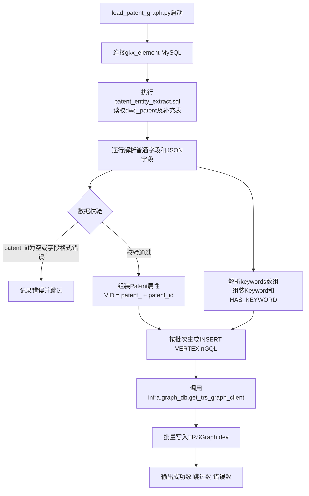
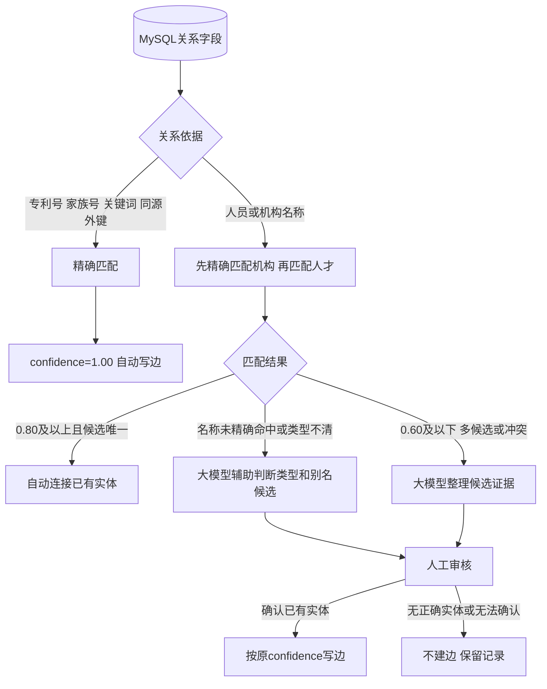

# 专利 MySQL → TRSGraph 映射

## 1. 实体映射

### 1.1 实体总表

| 图实体Tag | MySQL来源 | VID规则 | 中文含义 |
|---|---|---|---|
| `Patent` | `dwd_patent`及专利补充表 | `patent_{patent_id}` | 一件专利的主体记录 |
| `Keyword` | `dwd_patent.keywords[].zhName/enName` | `keyword_{md5(zhName非空则取zhName，否则取enName)}` | 专利记录直接给出的技术关键词 |
| `PatentFamily` | `dwd_patent_family.simple_family_number` | `patent_family_{simple_family_number}` | 供应数据划分的简单专利家族 |
| `Project` | `dwd_zh_project`、`dwd_en_project` | 读取dev现有Project的真实VID，并用`source_table + source_record_id`定位 | 产生专利成果的国内或国外项目 |
| `Person` | `dwd_scholar` | 读取dev现有Person的真实VID，并用`source_table + source_record_id`定位 | 学者数据域中的自然人；专利通过关系识别字段连接该实体 |
| `Organization` | `dwd_org_base_info`、`dwd_forg_base_info` | 读取dev现有Organization真实VID，并用`source_table + source_record_id`定位 | 机构数据域中的国内外机构；专利通过关系识别字段连接该实体 |

专利表中的`inventors/applicants/assignees[].name`只用于识别关系目标，不生成另一套Person或Organization。确认目标后，关系代码直接使用dev查询返回的真实VID；MySQL业务ID只用于通过`source_table + source_record_id`定位实体，不再拼接VID。

### 1.2 实体使用边界

- `scholar_id`、`org_id`、普通行`id`可能是采购商内部编号，只在明确共享同一主外键的数据集内使用。
- 统一社会信用代码、国外官方注册码、ORCID、标准专利号属于客观标识，但必须在待比较的两边都存在才能直接关联。
- 当前专利申请人、权利人只有`sequence + name`，没有机构代码、地区或主体类型。
- 无法确认具体Person或Organization时不建关系，记录候选并进入人工审核。

### 1.3 实体代码抽取流程

当前`load_patent_graph.py`实际装载Patent、Keyword、PatentFamily、HAS_KEYWORD和MEMBER_OF_FAMILY。

Person、Organization、Project分别由人才、机构、项目领域代码按照各自MySQL表生成并写入dev。专利实体代码不重复创建这三类实体；关系代码读取已有VID并建立从Patent出发的边。

## 2. 属性映射

### 2.1 Patent属性

| MySQL表.字段/JSON路径 | 图属性 | 类型 | 中文含义 |
|---|---|---|---|
| `dwd_patent.patent_id` | `Patent.patent_id` | string | 专利数据源内唯一标识 |
| `dwd_patent.publication_number` | `Patent.publication_number` | string | 专利公布号 |
| `dwd_patent.application_reference.apno` | `Patent.application_number` | string | 专利申请号 |
| `dwd_patent.application_kind` | `Patent.application_kind` | string | 专利申请类型 |
| `dwd_patent.country_code` | `Patent.country_code` | string | 专利申请或公开辖区代码，不是机构所在地 |
| `dwd_patent.country` | `Patent.country` | string | 专利申请或公开辖区名称 |
| `dwd_patent.publication_reference.pbdt` | `Patent.publication_date` | int64 | 专利公开日期，格式`YYYYMMDD` |
| `dwd_patent.application_reference.apdt` | `Patent.application_date` | int64 | 专利申请日期，格式`YYYYMMDD` |
| `dwd_patent.granted_number` | `Patent.granted_number` | string | 专利授权号 |
| `dwd_patent.language` | `Patent.language` | string | 专利原文语言 |
| `dwd_patent.main_classification_ipcr` | `Patent.main_ipcr` | string | IPC/IPCR主分类号 |
| `dwd_patent.further_classification_ipcr` | `Patent.further_ipcr` | string | IPC/IPCR附加分类号 |
| `dwd_patent.main_classification_cpc` | `Patent.main_cpc` | string | CPC主分类号 |
| `dwd_patent.further_classification_cpc` | `Patent.further_cpc` | string | CPC附加分类号 |
| `dwd_patent.keywords` | `Patent.keywords` | string | 中英文关键词JSON快照 |
| `dwd_patent.value` | `Patent.patent_value` | int64 | 专利价值评分 |
| `dwd_patent.db_source` | `Patent.db_source` | string | 专利数据来源 |
| `dwd_patent.create_time` | `Patent.create_time` | datetime | 数据创建时间 |
| `dwd_patent.update_time` | `Patent.update_time` | datetime | 数据更新时间 |
| `dwd_patent_title.titles[].lang/text` | `Patent.title_original` | string | 专利原文标题 |
| `dwd_patent_title.title_localized` | `Patent.title_en` | string | 专利英文标题 |
| `dwd_patent_title.title_zh` | `Patent.title_zh` | string | 专利中文标题 |
| `dwd_patent_abstract.abstract_zh` | `Patent.abstract_zh` | string | 专利中文摘要 |
| `dwd_patent_legal.status` | `Patent.status` | string | 当前法律状态 |
| `dwd_patent_legal.dates_of_public_availability.date` | `Patent.grant_date` | string | 专利授权日期 |
| `dwd_patent_legal.anticipated_expiration` | `Patent.anticipated_expiration` | int64 | 预计到期日期，格式`YYYYMMDD` |
| `dwd_patent_cited.reference_cited` | `Patent.citation_nums` | int64 | 该专利引用其他专利的数量 |
| `dwd_patent_cited.cited_by_nums` | `Patent.cited_by_nums` | int64 | 该专利被其他专利引用的数量 |
| `dwd_patent_family.simple_family_number` | `Patent.simple_family_number` | string | 简单专利家族编号 |

### 2.2 关联实体属性

| MySQL表.字段 | 图属性 | 中文含义 |
|---|---|---|
| `dwd_patent.keywords[].zhName/enName` | `Keyword.keyword` | 关键词中文名优先，中文缺失时使用英文名 |
| `dwd_patent_family.simple_family_number` | `PatentFamily.family_number` | 简单专利家族编号 |
| `dwd_org_base_info.name_cn` | `Organization.name_cn` | 国内机构法定中文名称 |
| `dwd_forg_base_info.name_en` | `Organization.name_en` | 国外机构名称 |
| `dwd_forg_base_info.name_alias` | `Organization.name_alias` | 国外机构当地语种名称或权威别名 |
| `dwd_org_base_info.external_id` | `Organization.external_id` | 国内机构统一社会信用代码；专利侧没有该字段，不能直接参与当前匹配 |
| `dwd_forg_base_info.external_id` | `Organization.external_id` | 国外机构官方注册码；专利侧没有该字段，不能直接参与当前匹配 |
| `dwd_scholar.name_zh/name_en` | `Person.name_zh/name_en` | 学者中英文姓名，用于人员候选匹配 |
| `dwd_scholar.scholar_org_name_zh/en` | Person候选证据 | 学者所属机构名称，用于人工判断同名人员 |
| `dwd_scholar.work_experience_institution_zh/en` | Person候选证据 | 学者工作经历中的一级机构名称 |
| `dwd_scholar.work_experience_department_zh/en` | Person候选证据 | 学者工作经历中的院系名称 |
| `dwd_scholar.work_experience_date` | 暂不参与关系计算 | 当前无法确认多段任职时间与多段机构是否一一对应，只保留供人工查看 |
| `dwd_zh_project.id`、`dwd_en_project.id` | 匹配`Project.source_table + Project.source_record_id`后读取真实VID | 项目主表记录标识只用于定位，不假定VID命名格式 |
| `dwd_zh_project/dwd_en_project.project_number` | `Project.project_number` | 项目业务编号 |
| `dwd_zh_project/dwd_en_project.project_source` | `Project.project_source` | 项目来源或计划类别 |

## 3. 关系映射

关系按确定程度排列：编号、明确外键或源字段直接给出的关系在前；名称匹配关系在后。

### 3.1 第一类：专利与专利

#### `CITES`：专利引用关系

| 项目 | 内容 |
|---|---|
| 方向 | 引用方Patent → 被引用方Patent |
| 中文含义 | 起点专利在其专利文献中引用了终点专利 |
| 来源字段 | `dwd_patent_cited.patent_citations[]`、`cited_by[]` |
| 目标编号字段 | `Patent.publication_number/application_number/granted_number` |
| 关联方法 | 统一编号大小写并去除明确无意义的空格、连接符；编号精确且唯一命中才建边 |
| 置信度 | 标准专利号精确且唯一命中：`1.00`；空号、格式异常或多候选：不建边 |

方向规则：`patent_citations[]`生成“当前专利→数组专利”；`cited_by[]`生成“数组专利→当前专利”。

当前不建立优先权、分案、继续申请等专利间关系。

### 3.2 第二类：专利与专利家族

#### `MEMBER_OF_FAMILY`：专利家族成员关系

| 项目 | 内容 |
|---|---|
| 方向 | Patent → PatentFamily |
| 中文含义 | 该专利属于供应数据明确划分的简单专利家族；同一家族专利可通过家族节点查询 |
| 来源字段 | `dwd_patent_family.simple_family_number` |
| 关联方法 | `simple_family_number`非空时直接定位`patent_family_{simple_family_number}`，再从Patent建边 |
| 置信度 | 家族号由源表直接提供：`1.00`；没有家族号时不根据标题、关键词推测 |

### 3.3 第三类：专利与关键词

#### `HAS_KEYWORD`：专利关键词关系

| 项目 | 内容 |
|---|---|
| 方向 | Patent → Keyword |
| 中文含义 | 专利记录直接包含该技术关键词 |
| 来源字段 | `dwd_patent.keywords[].zhName/enName` |
| 关联方法 | 中文优先、英文补充；规范化后生成稳定Keyword VID，同一专利内去重 |
| 置信度 | 关键词由当前专利记录直接提供：`1.00` |

### 3.4 第四类：专利与项目

#### `OUTPUT_OF`：项目产出关系

| 项目 | 内容 |
|---|---|
| 方向 | Patent → Project |
| 中文含义 | 该专利是某个国内或国外项目的产出成果 |
| 来源字段 | `dwd_zh_project_output/dwd_en_project_output.id`、`output_patents[].patent_number` |
| 项目定位 | `project_output.id = project.id`，再以项目来源表名和`Project.source_record_id = project.id`读取dev真实VID |
| 专利定位 | `patent_number`与Patent申请号、公布号或授权号精确且唯一匹配 |
| 置信度 | 项目同源外键命中且专利标准编号精确唯一命中：`1.00`；任一端缺失或多候选：不建边 |

这里使用`id`不是跨采购源匹配：项目主表、项目产出表和dev Project都来自同一套要素库数据，附件已明确产出表`id`关联项目主表`id`。项目名称、负责人名称不参与该关系。

### 3.5 第五类：专利与人

#### `INVENTED_BY`：发明关系

| 项目 | 内容 |
|---|---|
| 方向 | Patent → Person |
| 中文含义 | 该自然人是专利记录中的发明人；机构不能作为发明人 |
| 来源字段 | `dwd_patent.inventors[].name/sequence` |
| 目标查找字段 | `dwd_scholar.name_zh/name_en` |
| 关联步骤 | 用`inventors[].name`与`dwd_scholar.name_zh/name_en`精确匹配；再比较已确认的申请/权利机构与学者机构；若专利已通过`OUTPUT_OF`关联项目，可追加核对项目主持人、参与者和参与机构 |
| 自动关联 | 候选只有一个，且姓名与机构均精确一致时，直接连接已定位的Person真实VID；如项目人员、机构信息也一致，作为附加证据 |
| 人工介入 | 仅姓名命中、姓名不匹配、命中多人、同一机构仍有多个同名人员或证据冲突时，由人工选择已有Person；人工无法确认则不建边 |
| 大模型参与 | 只在人工审核阶段汇总专利关键词、关联项目和候选学者研究信息，生成便于审核的摘要；不选择Person、不计算`confidence`、不写边 |

置信度分级：

| 证据 | `confidence` | 处理方式 |
|---|---:|---|
| 姓名、机构、项目人员/机构信息均一致，且候选唯一 | `0.90` | 自动连接已有Person |
| 姓名精确一致＋机构一致，且候选唯一 | `0.80` | 自动连接已有Person |
| 只有姓名精确唯一 | `0.60` | 进入人工候选 |
| 同名多人、信息冲突或只有模糊相似 | 有可靠候选时逐个计算`0.60/0.80/0.90`；没有可靠候选时不评分 | 统一进入人工审核；审核前不写图边，人工补充证据后选择已有Person或确认无匹配 |

申请机构与学者任职机构一致能够增强判断，但必须保证最终Person候选唯一；同一机构存在多个同名人员时仍由人工确认。项目字段只有人员和机构名称，可增加交叉证据，但不能单独区分同名同机构人员。

#### `APPLIED_BY/OWNED_BY`中的个人主体

申请人和权利人都可能是个人。未命中机构后，姓名命中学者表时判为Person候选；候选唯一且姓名、机构同时精确一致时可自动连接；仅姓名或多候选时人工确认。

### 3.6 第六类：专利与机构

#### `APPLIED_BY`：申请关系

| 项目 | 内容 |
|---|---|
| 方向 | Patent → Organization |
| 中文含义 | 目标机构是最初提交该专利申请的申请人 |
| 来源字段 | `dwd_patent.applicants[].name/sequence` |
| 关联方法 | 名称依次与国内机构`name_cn`、国外机构`name_en/name_alias`做完整精确匹配；国内外机构候选合并后必须唯一 |
| 置信度 | 完整法定名或权威别名精确且唯一：`0.80`；多机构候选：人工确认；简称或模糊相似：不自动关联 |
| 大模型参与 | 仅在名称未精确命中机构表或人才表时，辅助判断名称更像Organization还是Person，并提出机构别名候选；结果进入人工审核，不直接关联 |

#### `OWNED_BY`：当前权利归属关系

| 项目 | 内容 |
|---|---|
| 方向 | Patent → Organization |
| 中文含义 | 目标机构是当前专利权利人，不一定等于最初申请人 |
| 来源字段 | `dwd_patent.assignees[].name/sequence` |
| 关联方法 | 与申请机构相同；边额外写`role=assignee`、`is_current=true` |
| 置信度 | 完整法定名或权威别名精确且唯一：`0.80`；多机构候选：人工确认；简称或模糊相似：不自动关联 |
| 大模型参与 | 仅在名称未精确命中机构表或人才表时，辅助判断名称更像Organization还是Person，并提出机构别名候选；结果进入人工审核，不直接关联 |

机构匹配目前只能比较名称。专利`country_code/country`表示专利辖区，不是机构所在地；机构表中的地区、地址和信用代码在专利申请人/权利人中没有对应字段，不能作为共同匹配条件。

### 3.7 关系识别公共规则

#### 3.7.1 先判断申请人/权利人是机构还是个人

| 判断结果 | 处理方式 |
|---|---|
| 名称命中机构表 | 按Organization处理；只有一个机构候选时关联，多家候选时人工选择 |
| 未命中机构，但命中人才表姓名 | 按Person处理；证据充分且候选唯一时关联，否则人工选择 |
| 机构表和人才表都未命中 | 不建关系，记录原始名称，人工判断 |

这里只选择MySQL已经生成的Person或Organization，不创建新实体。

#### 3.7.2 置信度和处理方式

| `confidence` | 判断依据 | 处理方式 |
|---:|---|---|
| `1.00` | 标准专利号、明确同源外键、源表直接给出的关键词或家族号 | 自动关联 |
| `0.90` | 人员姓名、机构、项目信息均一致，候选唯一且无冲突 | 自动关联 |
| `0.80` | 机构完整名称精确唯一；或人员姓名和机构一致且候选唯一 | 自动关联 |
| `0.60` | 只有人员姓名精确一致 | 人工审核 |
| 不评分 | 多候选、信息冲突、模糊相似或没有可靠候选 | 人工审核 |

判断原则：`0.80`及以上且候选唯一时自动关联；`0.60`及以下、多候选或冲突时人工审核。人工确认只决定是否建边，不另外生成`0.95`分值；最终边保留原规则分值。

#### 3.7.3 人工怎么审核

系统把专利原始姓名、所有Person/Organization候选、机构、关联项目、项目参与人和关键词放在同一审核记录中。审核人只做三种选择：

1. 选择一个已有实体：建立关系，保留原`confidence`。
2. 人才表或机构表中没有正确实体：不建关系，等待数据补充。
3. 暂时无法确认：保留审核记录，后续继续处理。

同一机构存在多个同名人员时，即使项目人员名称也相同，仍需人工结合原始专利或其他可靠资料确认。

#### 3.7.4 关系抽取流程

优先权、分案/继续申请、转让历史和其他未设计关系保留在MySQL，第一阶段不入图。
