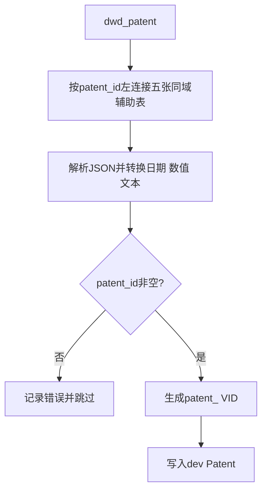
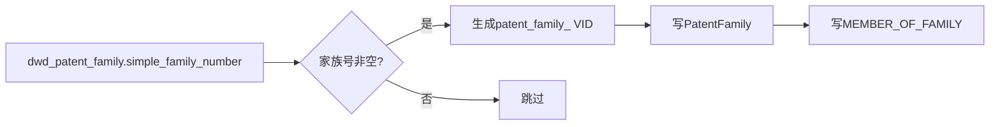

# 专利源数据到dev图空间映射

## 1. 文档范围

本文逐项说明科技要素库`gkx_element`的MySQL表和字段映射到dev图空间的哪个Tag、Edge或属性。实体和关系定义见[patent_ontology.md](patent_ontology.md)，关系判断与抽取过程见[patent_relation_extraction.md](patent_relation_extraction.md)。

## 2. 实体抽取过程

### 2.1 Patent实体抽取

五张辅助表为`dwd_patent_title`、`dwd_patent_abstract`、`dwd_patent_legal`、`dwd_patent_cited`、`dwd_patent_family`，均使用已验证同域的`patent_id`关联，不使用各表普通`id`。

### 2.2 Keyword实体抽取

### 2.3 PatentFamily实体抽取

这是dev已有专利族关系的数据规则；当前`load_patent_relations.py`尚未包含该装载过程。

## 3. Patent字段映射

### 3.1 dwd_patent主表

| MySQL表 | 源字段/JSON路径 | dev位置 | 转换规则 |
|---|---|---|---|
| `dwd_patent` | `patent_id` | `Patent.patent_id`；同时生成VID | 去首尾空白；VID=`patent_{patent_id}` |
| `dwd_patent` | `publication_number` | `Patent.publication_number` | 字符串 |
| `dwd_patent` | `application_reference.apno` | `Patent.application_number` | JSON提取 |
| `dwd_patent` | `application_kind` | `Patent.application_kind` | 字符串 |
| `dwd_patent` | `country_code` | `Patent.country_code` | 字符串 |
| `dwd_patent` | `country` | `Patent.country` | 字符串 |
| `dwd_patent` | `publication_reference.pbdt` | `Patent.publication_date` | JSON提取并转date |
| `dwd_patent` | `application_reference.apdt` | `Patent.application_date` | JSON提取并转date |
| `dwd_patent` | `granted_number` | `Patent.granted_number` | 字符串 |
| `dwd_patent` | `language` | `Patent.language` | 数组规范化后拼接 |
| `dwd_patent` | `main_classification_ipcr` | `Patent.main_ipcr` | 字符串 |
| `dwd_patent` | `further_classification_ipcr` | `Patent.further_ipcr` | 稳定JSON序列化 |
| `dwd_patent` | `main_classification_cpc` | `Patent.main_cpc` | 字符串 |
| `dwd_patent` | `further_classification_cpc` | `Patent.further_cpc` | 稳定JSON序列化 |
| `dwd_patent` | `keywords` | `Patent.keywords` | 保留规范JSON快照 |
| `dwd_patent` | `value` | `Patent.patent_value` | 转int64，空值为0 |
| `dwd_patent` | `update_time` | `Patent.source_update_time` | 转datetime |

### 3.2 辅助表

| MySQL表 | 关联字段 | 源字段/JSON路径 | dev位置 | 转换规则 |
|---|---|---|---|---|
| `dwd_patent_title` | `patent_id` | `titles` | `Patent.title_original` | 取原文文本 |
| `dwd_patent_title` | `patent_id` | `title_localized` | `Patent.title_en` | 字符串 |
| `dwd_patent_title` | `patent_id` | `title_zh` | `Patent.title_zh` | 字符串 |
| `dwd_patent_abstract` | `patent_id` | `abstract_zh` | `Patent.abstract_zh` | 字符串 |
| `dwd_patent_legal` | `patent_id` | `dates_of_public_availability.date` | `Patent.grant_date` | JSON提取并转date |
| `dwd_patent_legal` | `patent_id` | `status` | `Patent.status` | 字符串 |
| `dwd_patent_legal` | `patent_id` | `anticipated_expiration` | `Patent.anticipated_expiration` | 转date |
| `dwd_patent_cited` | `patent_id` | `reference_cited` | `Patent.citation_nums` | 转int64，空值为0 |
| `dwd_patent_cited` | `patent_id` | `cited_by_nums` | `Patent.cited_by_nums` | 转int64，空值为0 |
| `dwd_patent_family` | `patent_id` | `simple_family_number` | `Patent.simple_family_number` | 字符串 |

### 3.3 Patent溯源字段

| 来源 | dev位置 | 值 |
|---|---|---|
| 固定值 | `Patent.source_system` | `gkx_element` |
| 固定值 | `Patent.source_table` | `dwd_patent` |
| `dwd_patent.patent_id` | `Patent.source_record_id` | 原始`patent_id` |
| 当前未提供 | `Patent.source_url` | 空字符串 |
| 命令行`--batch-id` | `Patent.ingest_batch` | 当前装载批次 |
| 程序运行时间 | `Patent.ingest_time` | 当前datetime |
| `dwd_patent.update_time` | `Patent.source_update_time` | 来源更新时间 |

## 4. Keyword字段映射

| MySQL表 | 源字段/JSON路径 | dev位置 | 转换规则 |
|---|---|---|---|
| `dwd_patent` | `keywords[].zhName/enName/name` | `Keyword.keyword` | 按`zhName → enName → name`取首个非空名称并规范化 |
| `dwd_patent` | 规范化关键词名称 | Keyword VID | `keyword_{md5(normalized_name)}` |
| `dwd_patent` | `patent_id`＋关键词数组项 | `Patent-[HAS_KEYWORD]->Keyword` | 写入溯源字段，直接生成关系的`confidence=1.0` |

## 5. PatentFamily字段映射

| MySQL表 | 源字段 | dev位置 | 转换规则 |
|---|---|---|---|
| `dwd_patent_family` | `simple_family_number` | `PatentFamily` VID | `patent_family_{simple_family_number}` |
| `dwd_patent_family` | `patent_id` | `MEMBER_OF_FAMILY`起点 | 对应Patent VID |
| `dwd_patent_family` | `simple_family_number` | `MEMBER_OF_FAMILY`终点 | 对应PatentFamily VID |

## 6. 关系源字段到dev Edge映射

本节只列数据位置，不描述匹配和消歧过程。

| Edge | MySQL表 | 源字段 | dev起点 | dev终点 |
|---|---|---|---|---|
| `INVENTED_BY` | `dwd_patent` | `patent_id`, `inventors[].name`, `inventors[].sequence` | Patent VID | 对齐后的Person真实VID |
| `APPLIED_BY` | `dwd_patent` | `patent_id`, `applicants[].name`, `applicants[].sequence` | Patent VID | 对齐后的Organization/Person真实VID |
| `OWNED_BY` | `dwd_patent` | `patent_id`, `assignees[].name`, `assignees[].sequence` | Patent VID | 对齐后的Organization/Person真实VID |
| `CITES` | `dwd_patent_cited` | `patent_id`, `patent_citations[]`, `cited_by[]` | 对齐后的引用方Patent VID | 对齐后的被引用Patent VID |
| `HAS_KEYWORD` | `dwd_patent` | `patent_id`, `keywords[]` | Patent VID | Keyword VID |
| `MEMBER_OF_FAMILY` | `dwd_patent_family` | `patent_id`, `simple_family_number` | Patent VID | PatentFamily VID |
| `OUTPUT_OF` | `dwd_zh_project_output` | `id`, `output_patents[].patent_number` | 对齐后的Patent VID | 由`Project.source_record_id`取得的真实VID |

## 7. 关系属性映射

| Edge属性 | 来源 |
|---|---|
| `sequence` | 对应数组项`sequence/seq`，缺失时使用数组序号＋1 |
| `source_name` | `inventors/applicants/assignees[].name` |
| `role` | `APPLIED_BY=applicant`；`OWNED_BY=assignee` |
| `is_current` | `OWNED_BY=true` |
| `reference_identifier` | 引用数组中的原始专利业务编号 |
| `subject_type` | 对齐后确认的`Person`或`Organization` |
| `confidence` | 实体对齐结果分值 |
| `match_method` | `authoritative_id`或`exact_name` |
| `match_evidence` | 唯一匹配或编号匹配证据 |
| `resolution_status` | 自动写边时为`resolved` |
| `source_table` | `dwd_patent`、`dwd_patent_cited`或`dwd_zh_project_output` |
| `source_record_id` | `主记录ID:字段名:数组序号` |
| `ingest_batch` | 当前关系装载批次 |
| `ingest_time` | 当前关系装载时间 |

## 8. Patent到Milvus索引映射

### 8.1 索引汇总

| 类别 | 物理索引数 | 建立字段 | 说明 |
|---|---:|---|---|
| 向量索引 | 1 | `dense_vector` | `dense_hnsw`，语义相似检索 |
| BM25稀疏索引 | 1 | `sparse_vector` | `bm25_sparse_inverted`，关键词检索 |
| 标量倒排索引 | 6 | 三类专利号、家族号、国家、来源表 | 精确匹配与过滤 |
| 混合检索 | 0个新增物理索引 | 同时查询`dense_vector`和`sparse_vector` | RRF融合前两个索引，不是第9个索引 |

BM25和向量索引都来自组合文本`search_text`，其内容包括专利号、标题、摘要、关键词和IPC/CPC分类。

### 8.2 字段与索引

| dev Patent来源 | Milvus字段 | 索引 |
|---|---|---|
| 图VID | `vid` | 主键 |
| `patent_id` | `patent_id` | 字段值 |
| `publication_number` | `publication_number` | `publication_number_inverted` |
| `application_number` | `application_number` | `application_number_inverted` |
| `granted_number` | `granted_number` | `granted_number_inverted` |
| `simple_family_number` | `simple_family_number` | `family_number_inverted` |
| `country_code` | `country_code` | `country_code_inverted` |
| `source_table` | `source_table` | `source_table_inverted` |
| 标题、摘要、关键词、分类等组合文本 | `search_text` | 检索文本 |
| `search_text`的本地Embedding | `dense_vector` | `dense_hnsw` |
| `search_text`的Hashed BM25 | `sparse_vector` | `bm25_sparse_inverted` |

当前`patent` Collection为2000行，八个索引均为`Finished`。

## 9. 标识使用规则

- 同域表只有在字段语义和值域已验证一致时才按ID连接；本批五张专利辅助表使用`patent_id`。
- 不同数据域的普通`id`不能直接连接实体，应使用业务编号或名称对齐。
- dev关系端点使用实际VID，不根据外部ID或VID前缀推测。
