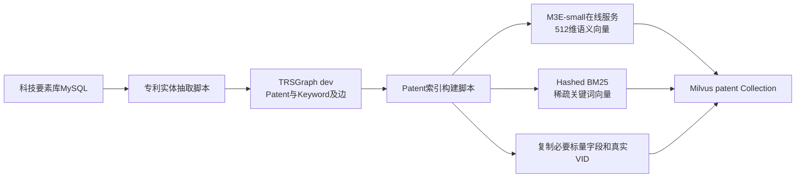
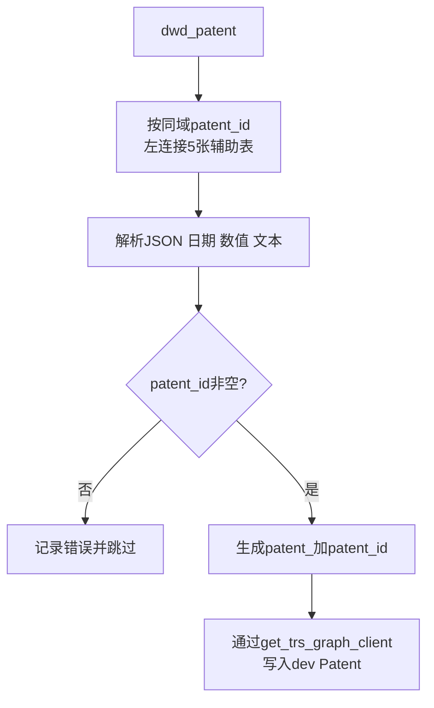
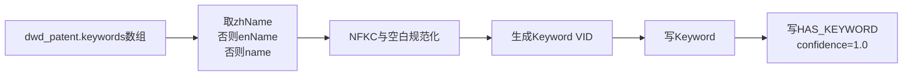
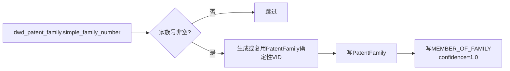
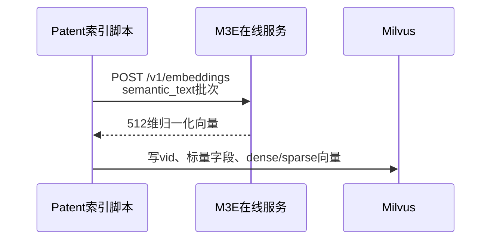

# 专利源数据、dev图空间与Milvus映射

## 1. 文档职责

本文逐项说明科技要素库MySQL字段映射到dev图空间的位置，以及Patent检索副本如何从dev映射到Milvus。关系判断算法见[patent_relation_extraction.md](patent_relation_extraction.md)。

## 2. 总体数据流



MySQL是源数据，TRSGraph dev是图事实库，Milvus是可重建的检索副本。Milvus中的`vid`必须等于dev中对应Patent的真实VID。

## 3. Patent实体抽取



同域辅助表：`dwd_patent_title`、`dwd_patent_abstract`、`dwd_patent_legal`、`dwd_patent_cited`、`dwd_patent_family`。只使用已验证语义和值域一致的`patent_id`连接，不使用各表普通`id`。

## 4. Patent字段映射

### 4.1 dwd_patent主表

| MySQL表 | 源字段/JSON路径 | dev属性 | 转换 |
|---|---|---|---|
| `dwd_patent` | `patent_id` | `Patent.patent_id`及VID | 去首尾空白；VID=`patent_{patent_id}` |
| `dwd_patent` | `publication_number` | `Patent.publication_number` | 字符串 |
| `dwd_patent` | `application_reference.apno` | `Patent.application_number` | JSON提取 |
| `dwd_patent` | `application_kind` | `Patent.application_kind` | 字符串 |
| `dwd_patent` | `country_code` | `Patent.country_code` | 字符串 |
| `dwd_patent` | `country` | `Patent.country` | 字符串 |
| `dwd_patent` | `publication_reference.pbdt` | `Patent.publication_date` | JSON提取并转date |
| `dwd_patent` | `application_reference.apdt` | `Patent.application_date` | JSON提取并转date |
| `dwd_patent` | `granted_number` | `Patent.granted_number` | 字符串 |
| `dwd_patent` | `language` | `Patent.language` | 数组规范化并拼接 |
| `dwd_patent` | `main_classification_ipcr` | `Patent.main_ipcr` | 字符串 |
| `dwd_patent` | `further_classification_ipcr` | `Patent.further_ipcr` | 稳定JSON |
| `dwd_patent` | `main_classification_cpc` | `Patent.main_cpc` | 字符串 |
| `dwd_patent` | `further_classification_cpc` | `Patent.further_cpc` | 稳定JSON |
| `dwd_patent` | `keywords` | `Patent.keywords` | 规范JSON快照 |
| `dwd_patent` | `value` | `Patent.patent_value` | int64，空值为0 |
| `dwd_patent` | `update_time` | `Patent.source_update_time` | datetime |

### 4.2 五张同域辅助表

| MySQL表 | 关联字段 | 源字段 | dev属性 | 转换 |
|---|---|---|---|---|
| `dwd_patent_title` | `patent_id` | `titles` | `Patent.title_original` | 提取原文文本 |
| `dwd_patent_title` | `patent_id` | `title_localized` | `Patent.title_en` | 字符串 |
| `dwd_patent_title` | `patent_id` | `title_zh` | `Patent.title_zh` | 字符串 |
| `dwd_patent_abstract` | `patent_id` | `abstract_zh` | `Patent.abstract_zh` | 字符串 |
| `dwd_patent_legal` | `patent_id` | `dates_of_public_availability.date` | `Patent.grant_date` | JSON提取并转date |
| `dwd_patent_legal` | `patent_id` | `status` | `Patent.status` | 字符串 |
| `dwd_patent_legal` | `patent_id` | `anticipated_expiration` | `Patent.anticipated_expiration` | date |
| `dwd_patent_cited` | `patent_id` | `reference_cited` | `Patent.citation_nums` | int64，空值为0 |
| `dwd_patent_cited` | `patent_id` | `cited_by_nums` | `Patent.cited_by_nums` | int64，空值为0 |
| `dwd_patent_family` | `patent_id` | `simple_family_number` | `Patent.simple_family_number` | 字符串 |

### 4.3 溯源字段

| 来源 | dev属性 | 值/规则 |
|---|---|---|
| 固定值 | `source_system` | `gkx_element` |
| 固定值 | `source_table` | `dwd_patent` |
| `dwd_patent.patent_id` | `source_record_id` | 原始专利主标识 |
| 当前无字段 | `source_url` | 空字符串 |
| 命令行`--batch-id` | `ingest_batch` | 当前批次 |
| 程序运行时间 | `ingest_time` | 当前datetime |
| `dwd_patent.update_time` | `source_update_time` | 来源更新时间 |

## 5. Keyword实体及关系映射



| MySQL字段 | dev位置 | 规则 |
|---|---|---|
| `dwd_patent.keywords[].zhName/enName/name` | `Keyword.keyword` | 取首个非空名称并规范化 |
| 规范化关键词 | Keyword VID | `keyword_{md5(casefold_name)}` |
| `patent_id`＋关键词数组序号 | `HAS_KEYWORD.source_record_id` | `{patent_id}:keywords:{index}` |

### 5.1 PatentFamily实体抽取



PatentFamily VID为`patent_family_{simple_family_number}`，与dev现有规则一致。源表与Patent通过已验证同域的`patent_id`连接。

## 6. 七类关系源字段映射

| Edge | MySQL表 | 源字段 | dev起点 | dev终点 |
|---|---|---|---|---|
| `HAS_KEYWORD` | `dwd_patent` | `patent_id`, `keywords[]` | Patent真实VID | Keyword确定性VID |
| `MEMBER_OF_FAMILY` | `dwd_patent_family` | `patent_id`, `simple_family_number` | Patent真实VID | PatentFamily真实VID |
| `CITES` | `dwd_patent_cited` | `patent_id`, `patent_citations[]`, `cited_by[]` | 引用方Patent VID | 被引Patent VID |
| `OUTPUT_OF` | `dwd_zh_project_output` | `id`, `output_patents[].patent_number` | 对齐后的Patent VID | Project真实VID |
| `APPLIED_BY` | `dwd_patent` | `patent_id`, `applicants[].name/sequence` | Patent真实VID | Organization或Person真实VID |
| `OWNED_BY` | `dwd_patent` | `patent_id`, `assignees[].name/sequence` | Patent真实VID | Organization或Person真实VID |
| `INVENTED_BY` | `dwd_patent` | `patent_id`, `inventors[].name/sequence` | Patent真实VID | Person真实VID |

`dwd_zh_project_output.id`只可用于匹配同项目数据域的`Project.source_record_id`；它不能构造Project VID。人员和机构的跨厂商普通ID不能直接关联。

## 7. dev Patent到Milvus字段映射

| dev来源 | Milvus字段 | 用途 |
|---|---|---|
| 图真实VID | `vid` | Milvus主键；检索后返回dev校验 |
| 固定值 | `entity_type` | `Patent` |
| `patent_id` | `patent_id` | 返回与精确辅助字段 |
| `publication_number` | `publication_number` | 标量倒排 |
| `application_number` | `application_number` | 标量倒排 |
| `granted_number` | `granted_number` | 标量倒排 |
| `simple_family_number` | `simple_family_number` | 标量倒排 |
| `country_code` | `country_code` | 标量过滤 |
| `source_table` | `source_table` | 来源过滤 |
| 标题、摘要、关键词 | `semantic_text` | 送入M3E-small，不建独立物理索引 |
| 编号、标题、摘要、关键词、IPC/CPC | `search_text` | 生成Hashed BM25，不建独立物理索引 |
| M3E-small输出 | `dense_vector` | HNSW语义索引 |
| Hashed BM25输出 | `sparse_vector` | 稀疏倒排关键词索引 |

### 7.1 M3E语义文本字段

```text
title_zh + title_en + title_original + abstract_zh + keywords
```

M3E-small支持中英文，输出512维归一化向量。编号和分类号不进入稠密语义文本，避免干扰语义；它们由BM25和标量索引处理。

### 7.2 BM25关键词文本字段

```text
patent_id + publication_number + application_number + granted_number
+ title_zh + title_en + title_original + abstract_zh + keywords
+ main_ipcr + main_cpc
```

## 8. Patent的八个Milvus物理索引

| 数量 | 索引名 | 字段 | 类型/度量 | 用途 |
|---:|---|---|---|---|
| 1 | `dense_hnsw` | `dense_vector` | HNSW/COSINE | 中英文语义相似召回 |
| 1 | `bm25_sparse_inverted` | `sparse_vector` | SPARSE_INVERTED_INDEX/IP | 关键词和专业术语召回 |
| 1 | `publication_number_inverted` | `publication_number` | INVERTED | 公开号精确匹配 |
| 1 | `application_number_inverted` | `application_number` | INVERTED | 申请号精确匹配 |
| 1 | `granted_number_inverted` | `granted_number` | INVERTED | 授权号精确匹配 |
| 1 | `family_number_inverted` | `simple_family_number` | INVERTED | 家族号精确匹配/过滤 |
| 1 | `country_code_inverted` | `country_code` | INVERTED | 国家过滤 |
| 1 | `source_table_inverted` | `source_table` | INVERTED | 来源表过滤 |

物理索引共8个。混合检索是查询时同时使用HNSW和稀疏倒排并通过RRF融合，不会产生第9个物理索引。

## 9. M3E在线服务映射



| 场景 | 地址 |
|---|---|
| Compose内部 | `http://m3e-embedding:8010/v1` |
| 服务器本机 | `http://127.0.0.1:8011/v1` |
| 模型缓存 | Docker卷`tech-kg-api_m3e-model-cache` |

Compose内索引脚本使用`PATENT_EMBEDDING_PROVIDER=openai`，这里的`openai`仅表示接口协议兼容，模型仍在本服务器CPU运行，数据不发送给OpenAI。

## 10. 标识规则

- 只有同域且已验证语义和值域一致的字段才能按ID连接。
- 不同厂商或不同数据域的普通`id`不能直接连接。
- Milvus记录必须携带dev真实VID，但VID不能从外部ID前缀猜测。
- Milvus命中后必须回dev验证Tag和节点存在性。

## 11. 当前部署验收快照（2026-07-31）

| 检查项 | 结果 |
|---|---|
| TRSGraph空间 | `dev` |
| dev Patent数量 | 2000 |
| Milvus Collection | `patent` |
| Milvus行数 | 2000 |
| M3E模型 | `moka-ai/m3e-small`，本服务器CPU在线服务 |
| 稠密向量 | 512维、归一化 |
| `semantic_text` | 已存在 |
| 物理索引数 | 8 |
| 索引状态 | 8个均为`Finished` |
| 混合检索 | 已使用中英文查询实际返回Patent VID |

该表是验收时点快照；后续增量同步后的数量以dev和Milvus实时查询为准。
