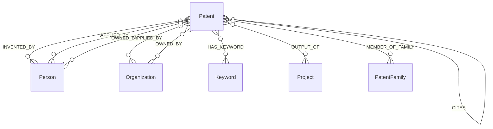

# 专利知识图谱本体

## 1. 文档范围

本文只陈列专利领域的实体、属性和关系，不描述MySQL字段映射和抽取算法。

- 源数据映射见：[patent_mapping.md](patent_mapping.md)
- 关系抽取流程见：[patent_relation_extraction.md](patent_relation_extraction.md)

## 2. 实体与关系总览

| 实体 | 图Tag | 本模块职责 | 用途 |
|---|---|---|---|
| 专利 | `Patent` | 创建和维护 | 专利成果主体 |
| 关键词 | `Keyword` | 创建并复用 | 专利主题 |
| 人员 | `Person` | 只复用已有实体 | 发明人、自然人申请人或权利人 |
| 机构 | `Organization` | 只复用已有实体 | 机构申请人或权利人 |
| 项目 | `Project` | 只复用已有实体 | 专利对应的项目产出 |
| 专利族 | `PatentFamily` | 复用dev既有实体 | 专利族归属 |

IPC/IPCR和CPC作为Patent属性保存，不单独创建分类实体。公司、高校、科研院所、医院等机构子类型由Organization实体维护，专利模块不推断。

## 3. Patent实体

### 3.1 标识

| 项目 | 定义 |
|---|---|
| Tag | `Patent` |
| VID | `patent_{patent_id}` |
| 业务主标识 | `patent_id` |

该VID规则只属于当前专利数据域，不用于推断Person、Organization或Project的VID。

### 3.2 业务属性

| 属性 | 类型 | 含义 |
|---|---|---|
| `patent_id` | string | 专利主标识 |
| `publication_number` | string | 公开号 |
| `application_number` | string | 申请号 |
| `application_kind` | string | 申请类型 |
| `country_code` | string | 国家/地区代码 |
| `country` | string | 国家/地区名称 |
| `publication_date` | date | 公开日期 |
| `application_date` | date | 申请日期 |
| `granted_number` | string | 授权号 |
| `grant_date` | date | 授权日期 |
| `status` | string | 法律状态 |
| `anticipated_expiration` | date | 预计到期日 |
| `title_original` | string | 原文标题 |
| `title_en` | string | 英文标题 |
| `title_zh` | string | 中文标题 |
| `abstract_zh` | string | 中文摘要 |
| `language` | string | 语言 |
| `main_ipcr` | string | IPC/IPCR主分类 |
| `further_ipcr` | string | IPC/IPCR附加分类JSON |
| `main_cpc` | string | CPC主分类 |
| `further_cpc` | string | CPC附加分类JSON |
| `keywords` | string | 关键词JSON快照 |
| `citation_nums` | int64 | 引用数量 |
| `cited_by_nums` | int64 | 被引数量 |
| `patent_value` | int64 | 专利价值 |
| `simple_family_number` | string | 简单专利族号 |

### 3.3 溯源属性

| 属性 | 类型 | 含义 |
|---|---|---|
| `source_system` | string | 来源系统 |
| `source_table` | string | 主来源表 |
| `source_record_id` | string | 来源记录标识 |
| `source_url` | string | 来源地址 |
| `ingest_batch` | string | 入图批次 |
| `ingest_time` | datetime | 入图时间 |
| `source_update_time` | datetime | 来源更新时间 |

## 4. Keyword实体

| 项目 | 定义 |
|---|---|
| Tag | `Keyword` |
| VID | `keyword_{md5(normalized_name)}` |
| 属性 | `keyword: string`，规范化后的关键词名称 |

## 5. 复用实体

| Tag | 本体角色 | VID使用规则 |
|---|---|---|
| `Person` | 发明人、自然人申请人、自然人权利人 | 使用Person实体已有真实VID |
| `Organization` | 机构申请人、机构权利人 | 使用Organization实体已有真实VID |
| `Project` | 专利产出所属项目 | 使用Project实体已有真实VID |
| `PatentFamily` | 专利所属家族 | 使用dev既有真实VID |

## 6. 专利出发的关系

| Edge | 方向 | 含义 | 本次代码范围 |
|---|---|---|---|
| `HAS_KEYWORD` | Patent → Keyword | 专利包含关键词 | `load_patent_graph.py` |
| `MEMBER_OF_FAMILY` | Patent → PatentFamily | 专利属于某专利族 | dev已有，当前关系脚本未覆盖 |
| `CITES` | Patent → Patent | 当前专利引用另一专利 | `load_patent_relations.py` |
| `OUTPUT_OF` | Patent → Project | 专利是项目产出 | `load_patent_relations.py` |
| `APPLIED_BY` | Patent → Organization/Person | 专利由某机构或人员申请 | `load_patent_relations.py` |
| `OWNED_BY` | Patent → Organization/Person | 专利当前权利主体 | `load_patent_relations.py` |
| `INVENTED_BY` | Patent → Person | 专利由某人员发明 | `load_patent_relations.py` |

图为有向图，本模块只维护以上从Patent出发的关系。`BELONGS_TO_NODE`等其他实体出发的关系不属于专利模块。

## 7. 关系属性

| Edge | 属性 |
|---|---|
| `INVENTED_BY` | `sequence`, `source_name`, `confidence`, `match_method`, `match_evidence`, `source_table`, `source_record_id`, `subject_type`, `resolution_status` |
| `APPLIED_BY` | `sequence`, `role`, `source_name`, `confidence`, `match_method`, `match_evidence`, `source_table`, `source_record_id`, `subject_type`, `resolution_status` |
| `OWNED_BY` | `sequence`, `role`, `is_current`, `source_name`, `confidence`, `match_method`, `match_evidence`, `source_table`, `source_record_id`, `subject_type`, `resolution_status` |
| `CITES` | `reference_identifier`, `sequence`, `confidence`, `match_method`, `match_evidence`, `source_table`, `source_record_id` |
| `HAS_KEYWORD` | `source_table`, `source_record_id`, `ingest_batch`, `ingest_time`, `confidence` |
| `MEMBER_OF_FAMILY` | `confidence`, `match_method`, `match_evidence`, `source_table`, `source_record_id` |
| `OUTPUT_OF` | `source_table`, `source_record_id`, `ingest_batch`, `ingest_time`, `confidence`, `match_method`, `match_evidence` |
