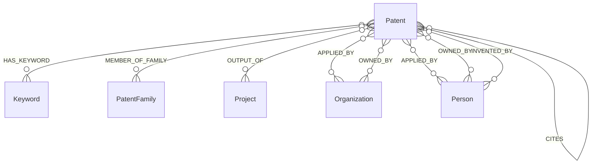

# 专利知识图谱本体设计

## 1. 文档职责

本文只定义专利领域的实体、属性、关系、方向和约束，不展开MySQL字段来源及关系算法。

- 源数据字段映射：[patent_mapping.md](patent_mapping.md)
- 关系抽取流程：[patent_relation_extraction.md](patent_relation_extraction.md)

## 2. 本体总览

本模块只维护从`Patent`出发的有向边。Person、Organization、Project等其他业务域实体由对应模块创建，专利模块只复用其dev真实VID，不反向写边。

## 3. 实体设计

| 实体 | dev Tag | 专利模块职责 | 标识规则 |
|---|---|---|---|
| 专利 | `Patent` | 创建、维护 | `patent_{patent_id}`，只适用于专利同域数据 |
| 关键词 | `Keyword` | 创建、跨专利复用 | `keyword_{md5(normalized_name)}` |
| 专利族 | `PatentFamily` | 复用dev既有实体 | 使用dev真实VID；不能把外部普通ID当VID |
| 人员 | `Person` | 只复用 | 使用Person既有真实VID |
| 机构 | `Organization` | 只复用 | 使用Organization既有真实VID |
| 项目 | `Project` | 只复用 | 使用Project既有真实VID |

IPC/IPCR和CPC当前作为Patent属性保存，不拆为分类实体。企业、高校、科研院所、医院等机构子类型由Organization领域维护，专利模块不凭名称后缀创建或修改机构类型。

## 4. Patent属性

### 4.1 业务标识与地域

| 属性 | 类型 | 含义 |
|---|---|---|
| `patent_id` | string | 专利数据域主标识 |
| `publication_number` | string | 公开号 |
| `application_number` | string | 申请号 |
| `granted_number` | string | 授权号 |
| `application_kind` | string | 申请类型 |
| `country_code` | string | 国家/地区代码 |
| `country` | string | 国家/地区名称 |
| `simple_family_number` | string | 简单专利族号 |

### 4.2 时间与法律状态

| 属性 | 类型 | 含义 |
|---|---|---|
| `publication_date` | date | 公开日期 |
| `application_date` | date | 申请日期 |
| `grant_date` | date | 授权日期 |
| `status` | string | 法律状态 |
| `anticipated_expiration` | date | 预计到期日 |

### 4.3 文本与分类

| 属性 | 类型 | 含义 |
|---|---|---|
| `title_original` | string | 原文标题 |
| `title_en` | string | 英文标题 |
| `title_zh` | string | 中文标题 |
| `abstract_zh` | string | 中文摘要 |
| `keywords` | string | 关键词JSON快照 |
| `language` | string | 语言 |
| `main_ipcr` | string | IPC/IPCR主分类 |
| `further_ipcr` | string | IPC/IPCR附加分类JSON |
| `main_cpc` | string | CPC主分类 |
| `further_cpc` | string | CPC附加分类JSON |

### 4.4 统计与溯源

| 属性 | 类型 | 含义 |
|---|---|---|
| `citation_nums` | int64 | 引用数量 |
| `cited_by_nums` | int64 | 被引数量 |
| `patent_value` | int64 | 专利价值 |
| `source_system` | string | 来源系统，当前为`gkx_element` |
| `source_table` | string | 主来源表，当前为`dwd_patent` |
| `source_record_id` | string | 来源记录标识 |
| `source_url` | string | 来源地址 |
| `ingest_batch` | string | 入图批次 |
| `ingest_time` | datetime | 入图时间 |
| `source_update_time` | datetime | 来源更新时间 |

## 5. Keyword属性

| 属性 | 类型 | 规则 |
|---|---|---|
| `keyword` | string | 关键词执行NFKC、去首尾空白、合并连续空白后保存 |

## 6. Patent出发的七类关系

按确定性从高到低排列：

| 顺序 | Edge | 方向 | 终点类型 | 含义 |
|---:|---|---|---|---|
| 1 | `HAS_KEYWORD` | Patent → Keyword | Keyword | 专利包含关键词 |
| 2 | `MEMBER_OF_FAMILY` | Patent → PatentFamily | PatentFamily | 专利属于专利族 |
| 3 | `CITES` | Patent → Patent | Patent | 当前专利引用目标专利 |
| 4 | `OUTPUT_OF` | Patent → Project | Project | 专利是项目产出 |
| 5 | `APPLIED_BY` | Patent → Organization/Person | Organization或Person | 专利申请主体 |
| 6 | `OWNED_BY` | Patent → Organization/Person | Organization或Person | 专利权利主体 |
| 7 | `INVENTED_BY` | Patent → Person | Person | 专利发明人 |

## 7. 关系公共约束与属性

所有关系必须满足：

1. 起点是dev中真实存在的Patent VID。
2. 终点是dev中真实存在且Tag正确的VID。
3. 跨数据域普通`id`不能直接作为VID或等值关联依据。
4. 同类型、同起点、同终点、rank=0的边幂等写入。
5. 无法唯一对齐的候选不写边，进入待消歧记录。

| Edge | 主要属性 |
|---|---|
| `HAS_KEYWORD` | `source_table`, `source_record_id`, `ingest_batch`, `ingest_time`, `confidence` |
| `MEMBER_OF_FAMILY` | `confidence`, `match_method`, `match_evidence`, `source_table`, `source_record_id` |
| `CITES` | `reference_identifier`, `sequence`, `confidence`, `match_method`, `match_evidence`, `source_table`, `source_record_id` |
| `OUTPUT_OF` | `source_table`, `source_record_id`, `ingest_batch`, `ingest_time`, `confidence`, `match_method`, `match_evidence` |
| `APPLIED_BY` | `sequence`, `role`, `source_name`, `confidence`, `match_method`, `match_evidence`, `subject_type`, `resolution_status`, 溯源字段 |
| `OWNED_BY` | `sequence`, `role`, `is_current`, `source_name`, `confidence`, `match_method`, `match_evidence`, `subject_type`, `resolution_status`, 溯源字段 |
| `INVENTED_BY` | `sequence`, `source_name`, `confidence`, `match_method`, `match_evidence`, `subject_type`, `resolution_status`, 溯源字段 |

## 8. 图索引与外部检索索引的边界

- TRSGraph索引直接建立在dev节点属性上，用于精确定位真实节点和图遍历。
- Milvus索引不在图空间内部；它保存Patent真实VID、必要检索字段及向量，是可重建的检索副本。
- M3E-small是向量生成模型，不是索引。它把中英文专利文本变为512维向量。
- Milvus返回候选VID后，仍需回dev校验节点和边，最终事实只写入TRSGraph。
