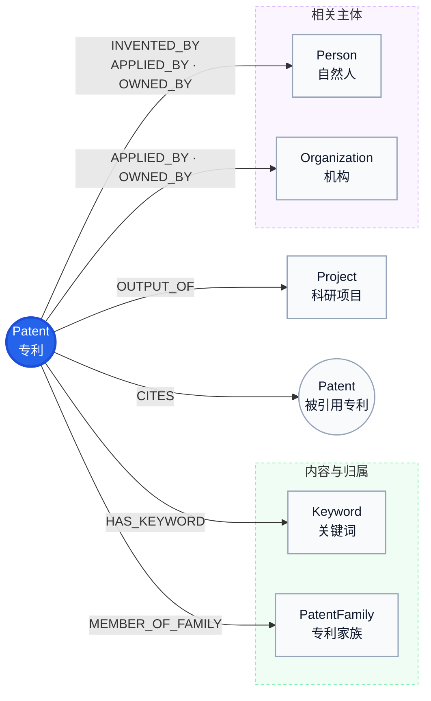

# 专利本体设计

## 1. 范围

- 图空间：`dev`。
- 专利Tag：`Patent`，VID为`patent_{patent_id}`。
- TRSGraph边均为有向边，只建立从专利领域出发的关系。
- 优先权、转让历史、分案/继续申请暂不入图，原字段保留在MySQL。

## 2. 实体设计

| Tag | 含义 | 主要属性 |
|---|---|---|
| `Patent` | 专利主体 | 下表29个MySQL源属性 |
| `Keyword` | 专利关键词 | `keyword` |
| `PatentFamily` | 供应数据给出的简单专利家族 | `family_number` |
| `Project` | 国内外科研项目 | `source_table`、`source_record_id`、`project_number`、`project_source`、`title` |
| `Person` | `dwd_scholar`生成的学者自然人 | `name_zh`、`name_en`、`name_cn`、`source_table`、`source_record_id`、`person_kind` |
| `Organization` | 国内机构、国外机构、高校、科研院所及港澳台正式机构表生成的机构 | `name_cn`、`name_en`、`name_alias`、`external_id`、`org_id`、`country_code`、`source_table`、`source_record_id`、`org_kind` |

采购商自建的`scholar_id`、`org_id`和表主键只在明确共享主外键的数据集内部使用，不作为跨采购源统一标识。

## 3. Patent属性

| 属性 | 类型 | 含义 |
|---|---|---|
| `patent_id` | string | 专利源内唯一标识 |
| `publication_number` | string | 公布号 |
| `application_number` | string | 申请号 |
| `application_kind` | string | 申请类型 |
| `country_code` | string | 专利申请/公开辖区代码 |
| `country` | string | 专利申请/公开辖区名称 |
| `publication_date` | int64 | 公开日期，`YYYYMMDD` |
| `application_date` | int64 | 申请日期，`YYYYMMDD` |
| `granted_number` | string | 授权号 |
| `grant_date` | string | 授权日期 |
| `status` | string | 法律状态 |
| `anticipated_expiration` | int64 | 预计到期日，`YYYYMMDD` |
| `title_original` | string | 原文标题 |
| `title_en` | string | 英文标题 |
| `title_zh` | string | 中文标题 |
| `abstract_zh` | string | 中文摘要 |
| `language` | string | 原文语言 |
| `main_ipcr` | string | IPC/IPCR主分类 |
| `further_ipcr` | string | IPC/IPCR附加分类 |
| `main_cpc` | string | CPC主分类 |
| `further_cpc` | string | CPC附加分类 |
| `keywords` | string | 关键词JSON快照 |
| `citation_nums` | int64 | 引用数量 |
| `cited_by_nums` | int64 | 被引数量 |
| `patent_value` | int64 | 专利价值 |
| `simple_family_number` | string | 简单家族号 |
| `db_source` | string | 数据来源 |
| `create_time` | datetime | 创建时间 |
| `update_time` | datetime | 更新时间 |

## 4. 关系设计

确定性强的关系排在前面。

| Edge | 方向 | 含义 | 关系属性 |
|---|---|---|---|
| `HAS_KEYWORD` | Patent→Keyword | 专利记录直接包含该关键词 | `confidence`、来源字段 |
| `CITES` | Patent→Patent | 起点专利引用终点专利 | `reference_identifier`、`sequence`、`confidence`、匹配与来源字段 |
| `MEMBER_OF_FAMILY` | Patent→PatentFamily | 专利属于供应数据明确给出的简单家族 | `confidence`、匹配与来源字段 |
| `OUTPUT_OF` | Patent→Project | 专利是项目产出成果 | `confidence`、匹配与来源字段 |
| `INVENTED_BY` | Patent→Person | Person是专利记录中的发明人；发明人只能是自然人 | `sequence`、`source_name`、`confidence`、`resolution_status`、匹配与来源字段 |
| `APPLIED_BY` | Patent→Person或Organization | 目标主体是最初提交专利申请的申请人 | `sequence`、`role`、`source_name`、`subject_type`、`confidence`、`resolution_status`、匹配与来源字段 |
| `OWNED_BY` | Patent→Person或Organization | 目标主体是当前专利权利人，不等同于申请人或机构隶属关系 | `sequence`、`role`、`is_current`、`source_name`、`subject_type`、`confidence`、`resolution_status`、匹配与来源字段 |

“匹配字段”指`match_method`、`match_evidence`；“来源字段”指`source_table`、`source_record_id`。`confidence`只保留一个指标，表示关系端点关联正确的可信等级。

## 5. 实体关系图

下图只描述图谱Schema中的实体类型、关系类型和方向，不表示代码执行步骤。实际抽取、匹配、缓存、大模型及写入流程见`patent_mapping.md`的“关系抽取流程”。

反向查询通过遍历入边完成，不重复创建反向Edge。
