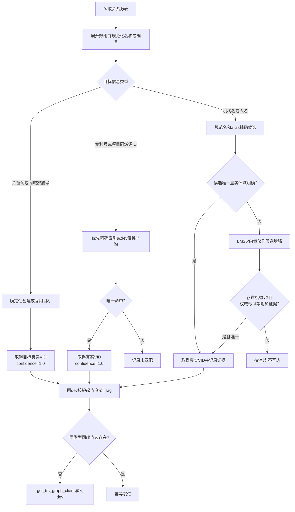
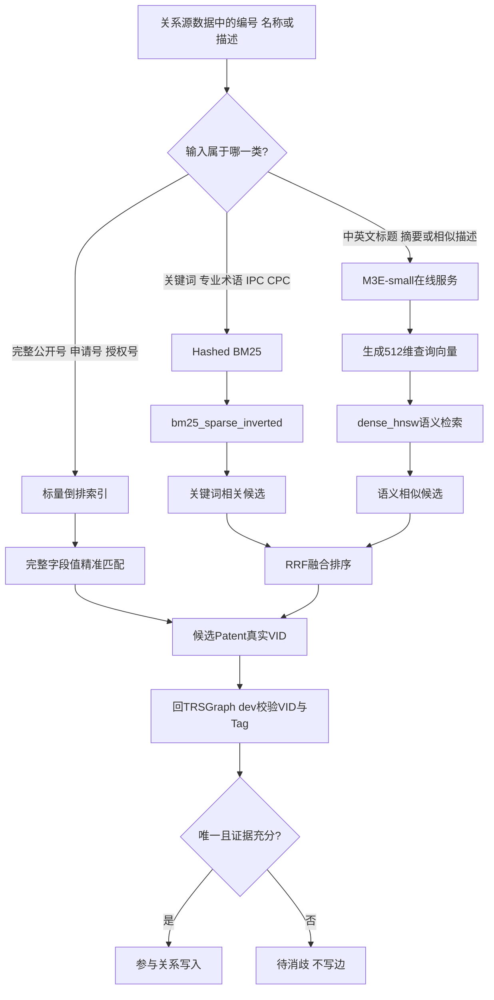
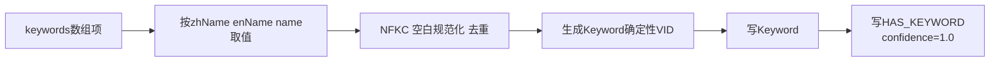
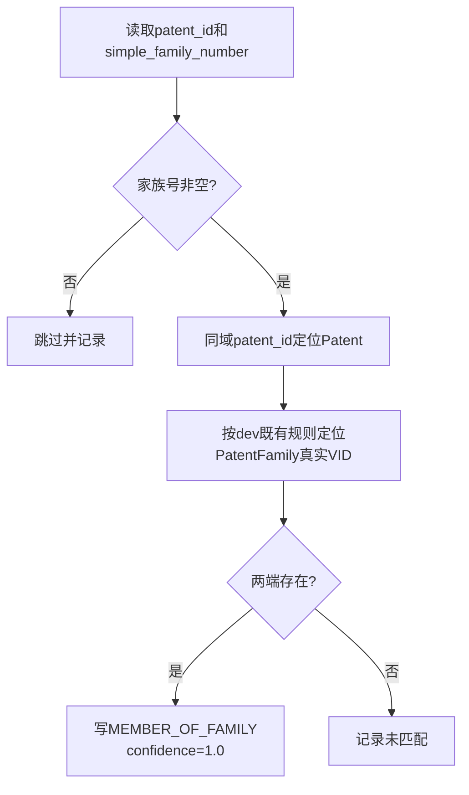
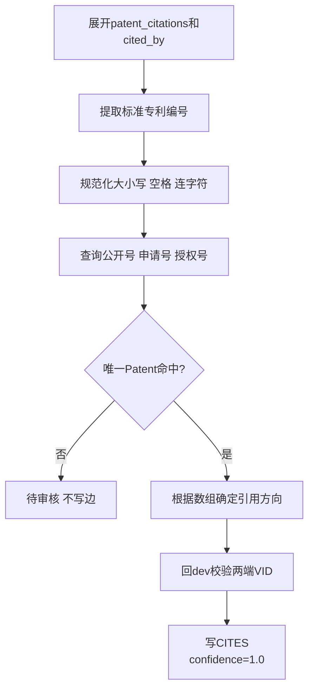
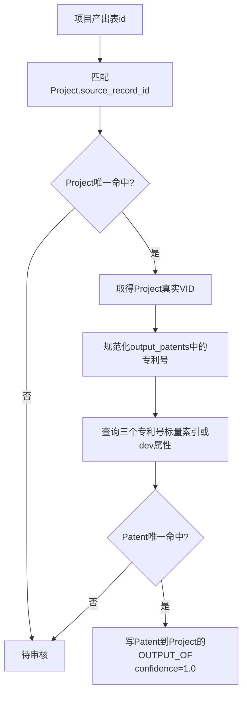
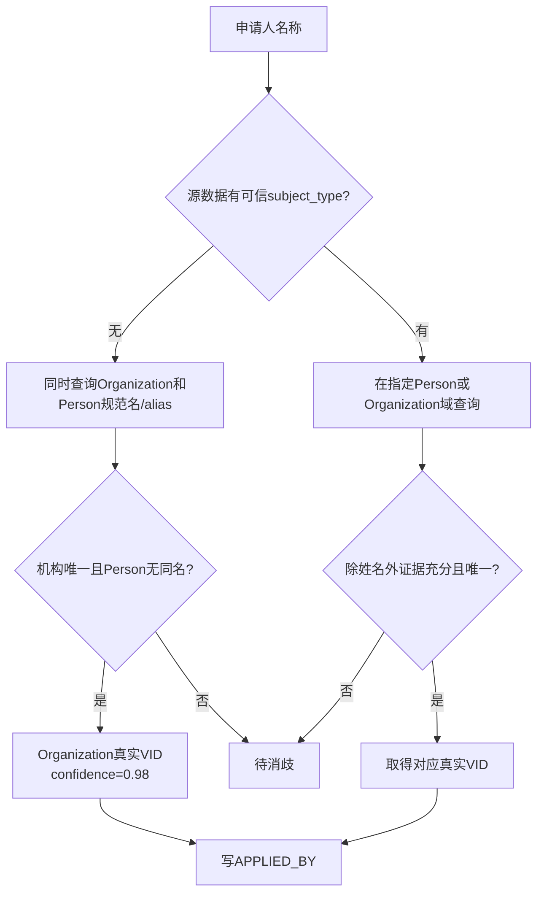
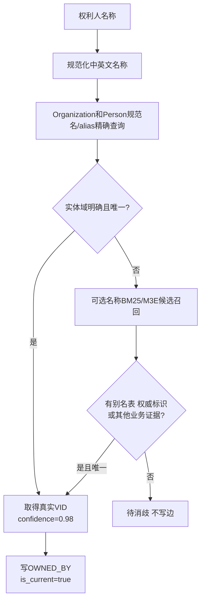
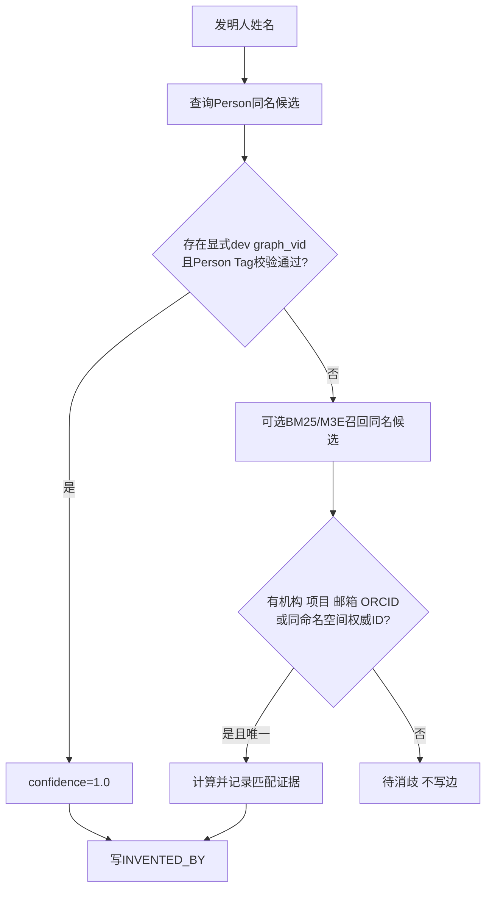
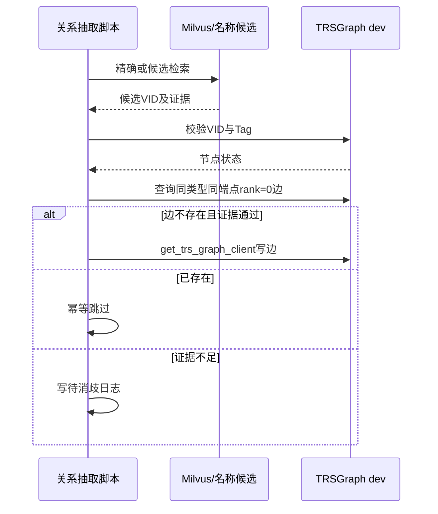

# 专利关系抽取流程

## 1. 文档职责与范围

本文完整描述从`Patent`出发的七类有向关系，按“源数据可直接确定 → 标准业务标识唯一匹配 → 名称对齐与消歧”排序。图读写统一通过`infra.graph_db.get_trs_graph_client`，不直接使用`nebula3` Python SDK。

| 顺序 | 关系 | 确定方式 | 自动写边条件 |
|---:|---|---|---|
| 1 | `HAS_KEYWORD` | 源关键词确定性生成 | 关键词非空 |
| 2 | `MEMBER_OF_FAMILY` | 同域`patent_id`＋家族号 | 家族号非空且终点存在 |
| 3 | `CITES` | 专利标准编号唯一匹配 | 唯一Patent命中 |
| 4 | `OUTPUT_OF` | 项目同域源ID＋专利标准编号 | 两端均唯一命中 |
| 5 | `APPLIED_BY` | 申请人名称跨Person/Organization域裁决 | 机构唯一且人员域无同名，或有权威dev VID |
| 6 | `OWNED_BY` | 权利人名称对齐 | 唯一且证据充分 |
| 7 | `INVENTED_BY` | 人名＋附加证据消歧 | 不允许只凭姓名写边 |

## 2. 总处理流程



共同原则：

1. 同域ID仅在字段语义和值域已验证一致时使用。
2. 不同厂商或数据域的普通`id`不能直接关联，也不能构造dev VID。
3. 标准专利号可以跨域对齐，但必须规范化并唯一命中。
4. Milvus只返回候选及dev VID，最终实体和边必须回TRSGraph验证。
5. 相似度不是事实；人名、机构名不能仅凭向量分数自动写边。

## 3. 索引如何参与关系抽取

### 3.1 Patent自身八个Milvus索引

| 序号 | 索引名称 | Milvus字段 | 来源字段（中文说明） | 索引类型 | 使用的模型或算法 | 在关系构建中的作用 |
|---:|---|---|---|---|---|---|
| 1 | `dense_hnsw` | `dense_vector` | 中文标题（`title_zh`）、英文标题（`title_en`）、原始标题（`title_original`）、中文摘要（`abstract_zh`）、关键词（`keywords`） | HNSW，COSINE | `moka-ai/m3e-small`，512维归一化向量 | 中英文Patent标题、摘要语义候选召回 |
| 2 | `bm25_sparse_inverted` | `sparse_vector` | 专利业务ID、公开号、申请号、授权号、中英文及原始标题、中文摘要、关键词、IPC主分类、CPC主分类 | SPARSE_INVERTED_INDEX，IP | 自定义Hashed BM25，262144维稀疏空间 | 编号、关键词、专业术语和分类号相关性召回 |
| 3 | `publication_number_inverted` | `publication_number` | 公开号（`publication_number`） | 标量INVERTED | 不使用模型 | `CITES`、`OUTPUT_OF`精确定位Patent |
| 4 | `application_number_inverted` | `application_number` | 申请号（`application_number`） | 标量INVERTED | 不使用模型 | `CITES`、`OUTPUT_OF`精确定位Patent |
| 5 | `granted_number_inverted` | `granted_number` | 授权号（`granted_number`） | 标量INVERTED | 不使用模型 | `CITES`、`OUTPUT_OF`精确定位Patent |
| 6 | `family_number_inverted` | `simple_family_number` | 简单专利族号（`simple_family_number`） | 标量INVERTED | 不使用模型 | 核验同族Patent；不能代替PatentFamily终点 |
| 7 | `country_code_inverted` | `country_code` | 国家或地区代码（`country_code`） | 标量INVERTED | 不使用模型 | 按国家或地区过滤候选 |
| 8 | `source_table_inverted` | `source_table` | 数据来源表（`source_table`） | 标量INVERTED | 不使用模型 | 按来源表过滤候选 |

M3E语义文本只包含标题、摘要和关键词；专利编号、IPC、CPC由BM25和标量索引负责，避免编号干扰语义向量。



混合检索是查询时联合使用`dense_hnsw`和`bm25_sparse_inverted`并进行RRF融合，不是第9个物理索引。Patent索引只能返回Patent VID，不能用于寻找Person或Organization。

### 3.2 其他实体索引的复用边界

| 终点 | 当前代码使用 | 限制 |
|---|---|---|
| Person | 只读`org_domain_person`的`canonical_name`和`aliases` | 只有姓名不自动写`INVENTED_BY` |
| Organization | 只读`org_domain_organization`的规范名和别名 | 唯一机构命中且人员域无同名时才自动通过 |
| Project | dev中`Project.source_record_id` | 只允许与同项目数据域ID匹配 |
| PatentFamily | `load_patent_graph.py`按同域家族号创建或复用 | 使用确定性VID并校验dev端点 |

当前`load_patent_relations.py`已经实现Person/Organization名称精确候选，但没有调用它们的BM25＋向量检索。文档中的向量流程是安全的候选增强规则，不表示相似度可以直接写边。

### 3.3 置信度规则

| 匹配方式 | confidence | 自动写边 |
|---|---:|---|
| 源关键词、同域家族号直接确定 | 1.00 | 是 |
| 显式属于dev命名空间的`graph_vid`且Tag校验通过 | 1.00 | 是 |
| 标准专利编号唯一命中 | 1.00 | 是 |
| Organization规范名/alias唯一命中且Person域无同名 | 0.98 | 是 |
| 图属性名称唯一匹配 | 0.99 | 是，仍需Tag校验 |
| BM25或M3E相似候选 | 不直接作为最终置信度 | 否，需附加证据 |
| Person只有姓名 | 不赋可写边分值 | 否 |

## 4. 第1条：HAS_KEYWORD

**方向**：Patent → Keyword
**源表字段**：`dwd_patent.patent_id`、`keywords[].zhName/enName/name`
**代码入口**：`script/load_patent_graph.py`



不需要Milvus或跨域消歧。`source_record_id`保存`{patent_id}:keywords:{index}`。

## 5. 第2条：MEMBER_OF_FAMILY

**方向**：Patent → PatentFamily
**源表字段**：`dwd_patent_family.patent_id`、`simple_family_number`



`family_number_inverted`可以查询同族Patent，但不能代替PatentFamily终点实体。由`load_patent_graph.py`随Patent实体批次创建或复用PatentFamily，并幂等写入该关系；`load_patent_relations.py`不重复处理。

## 6. 第3条：CITES

**方向**：Patent → Patent
**源表字段**：`dwd_patent_cited.patent_id`、`patent_citations[]`、`cited_by[]`
**代码入口**：`script/load_patent_relations.py --relation-types CITES`



- `patent_citations[]`：当前Patent引用目标Patent。
- `cited_by[]`：数组中的Patent引用当前Patent，写边方向反转。
- 原始编号保存在`reference_identifier`。
- 当前命令默认关系集合不含`CITES`，必须显式指定，避免在未检查引用覆盖率前批量写入。

## 7. 第4条：OUTPUT_OF

**方向**：Patent → Project
**源表字段**：`dwd_zh_project_output.id`、`output_patents[].patent_number`
**代码入口**：`script/load_patent_relations.py`



项目表ID只在项目同域中匹配`source_record_id`；专利编号是跨域标准业务标识。两者都唯一时才写边。

## 8. 第5条：APPLIED_BY

**方向**：Patent → Organization/Person
**源表字段**：`dwd_patent.applicants[].name/sequence`



专利源数据可能无法区分人名和机构名，所以不能只根据“有限公司、大学”等后缀直接判定。若名称同时出现在Person和Organization域，保持待消歧。

## 9. 第6条：OWNED_BY

**方向**：Patent → Organization/Person
**源表字段**：`dwd_patent.assignees[].name/sequence`



当前专利权利人可能以英文机构名出现，而Organization可能只保存中文名。M3E可以帮助召回跨语言候选，但必须结合别名或权威证据，不能只凭向量相似度写边。

## 10. 第7条：INVENTED_BY

**方向**：Patent → Person
**源表字段**：`dwd_patent.inventors[].name/sequence`



姓名不具备全局唯一性。当前源数据若只有姓名和顺序，即使Person Collection中只有一个同名记录也不自动写边。

## 11. 写边、幂等与审计



每条自动写入关系至少记录：`confidence`、`match_method`、`match_evidence`、`source_table`、`source_record_id`；人员/机构关系还记录`source_name`、`subject_type`和`resolution_status`。

## 12. 代码覆盖与执行

| 关系 | 当前代码状态 |
|---|---|
| `HAS_KEYWORD` | 已实现于`load_patent_graph.py` |
| `MEMBER_OF_FAMILY` | 已实现于`load_patent_graph.py` |
| `CITES` | 已实现，但需显式加入`--relation-types` |
| `OUTPUT_OF` | 已实现，默认启用 |
| `APPLIED_BY` | 已实现精确名称裁决，默认启用 |
| `OWNED_BY` | 已实现精确名称裁决，默认启用 |
| `INVENTED_BY` | 已实现安全拒绝仅姓名匹配，默认启用 |

```bash
cd backend

# 先演练，不写图
uv run python -m script.load_patent_relations \
  --dry-run \
  --batch-size 500 \
  --relation-types INVENTED_BY APPLIED_BY OWNED_BY CITES OUTPUT_OF

# 确认待消歧和命中情况后，再去掉--dry-run
```

关系数量属于运行时状态，不在文档中硬编码。应从dev按`Patent`起点和Edge Type实时统计；建立Milvus索引本身不会自动增加关系，只有关系脚本通过校验并写边后数量才会变化。
