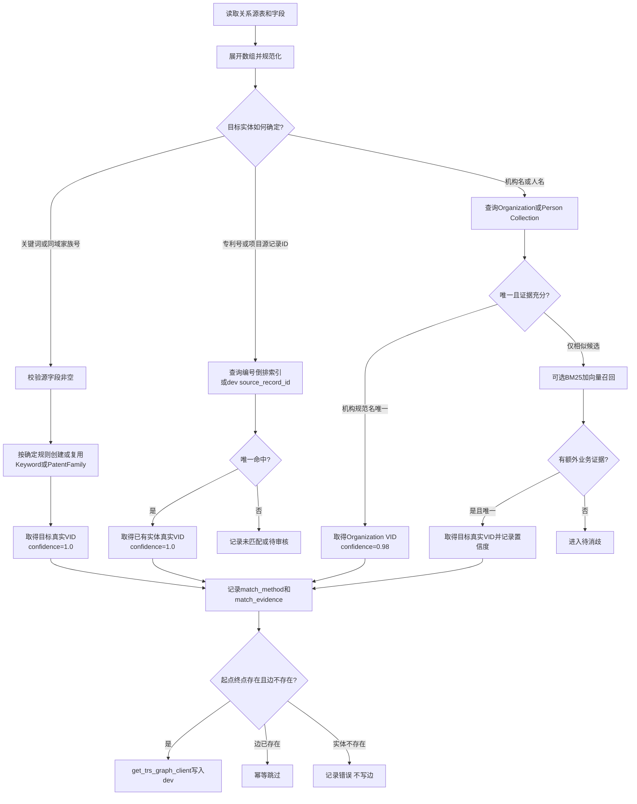
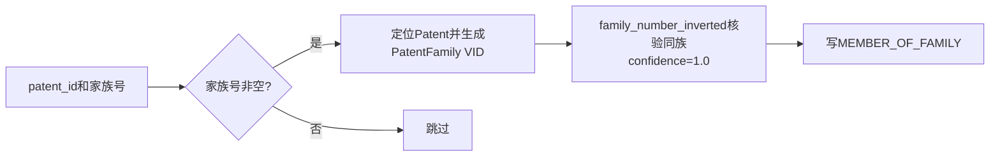
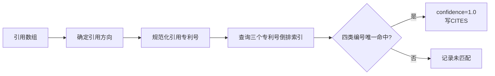
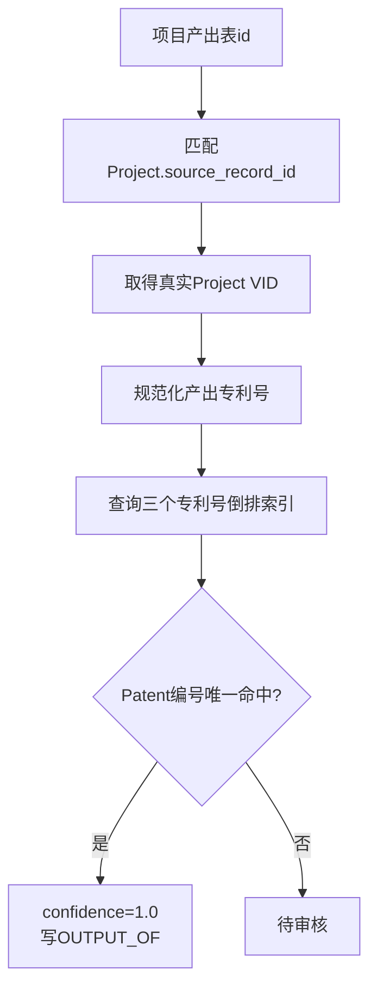
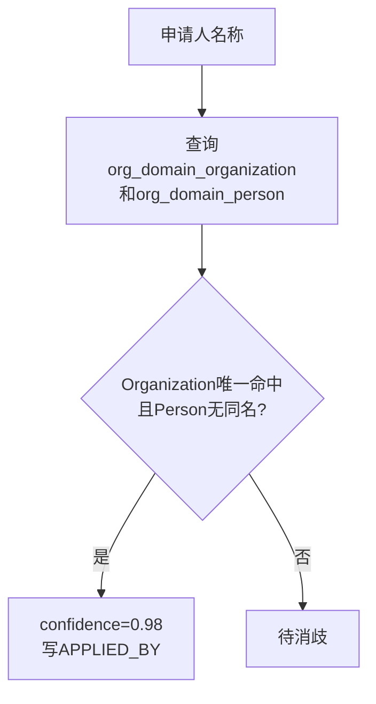
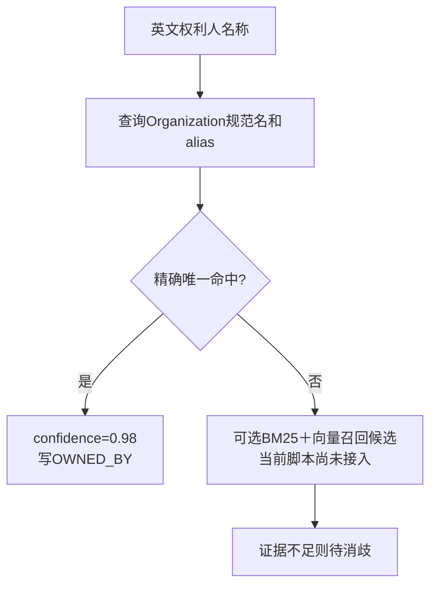
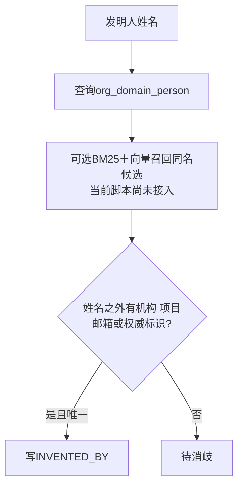

# 专利关系抽取说明

## 1. 范围与排序

本文描述全部从`Patent`出发的关系，并按“源数据直接确定 → 业务标识唯一匹配 → 名称对齐与消歧”排序。图操作统一使用`infra.graph_db.get_trs_graph_client`。

| 顺序 | 确定方式                 | 关系                 | 当前Patent出边 |
| ---: | ------------------------ | -------------------- | -------------: |
|    1 | 源字段直接生成           | `HAS_KEYWORD`      |           9949 |
|    2 | 同域家族号直接生成       | `MEMBER_OF_FAMILY` |           2000 |
|    3 | 专利业务编号唯一匹配     | `CITES`            |              0 |
|    4 | 项目同域ID＋专利业务编号 | `OUTPUT_OF`        |              0 |
|    5 | 机构名称唯一匹配         | `APPLIED_BY`       |             51 |
|    6 | 中英文机构名称对齐       | `OWNED_BY`         |              0 |
|    7 | 人名及附加证据消歧       | `INVENTED_BY`      |              0 |

`BELONGS_TO_NODE`等起点不是Patent的关系不由专利模块写入。

## 2. 总体处理过程



共同规则：

- 同域ID只有在字段语义和值域已验证一致时使用。
- 不同数据域不使用普通`id`直连，改用业务编号或名称对齐。
- Person、Organization和Project的VID从dev或其索引读取，不根据外部ID推测。
- 写边前使用`get_edge("{src}->{dst}@0", edge_type)`保证幂等。
- 无法唯一对齐的数据进入待消歧，不创建名称桩或低置信边。

### 2.1 索引在关系抽取中的使用

| 关系                 | 使用的索引/Collection                                  | 作用                                                                 |
| -------------------- | ------------------------------------------------------ | -------------------------------------------------------------------- |
| `HAS_KEYWORD`      | 不需要索引                                             | 源关键词直接生成Keyword                                              |
| `MEMBER_OF_FAMILY` | `family_number_inverted`（可选核验）                 | 按`simple_family_number`检索同族Patent；建边本身由源家族号直接确定 |
| `CITES`            | 三个专利号倒排索引                                     | 公开号、申请号、授权号精确匹配Patent                                 |
| `OUTPUT_OF`        | 三个专利号倒排索引                                     | 项目产出专利号精确匹配Patent                                         |
| `APPLIED_BY`       | `org_domain_organization`＋`org_domain_person`     | 规范名和alias精确候选及跨实体域排歧                                  |
| `OWNED_BY`         | Organization/Person Collection；可选BM25＋向量混合召回 | 精确名称优先；混合检索只补充中英文候选                               |
| `INVENTED_BY`      | `org_domain_person`；可选BM25＋向量混合召回          | 召回同名候选；仍需姓名之外的证据                                     |

当前关系代码从Milvus Collection读取`vid`和索引字段，构造规范化精确匹配表。Person/Organization的BM25＋向量混合召回是候选补充方案，当前统一关系脚本尚未调用；即使接入，也不能仅凭相似度自动写边。

### 2.2 置信度规则

| 匹配方式                                         |     `confidence` | 是否自动写边         |
| ------------------------------------------------ | -----------------: | -------------------- |
| 源关键词、源家族号直接确定                       |               1.00 | 是                   |
| 显式dev`graph_vid`且Tag校验通过                |               1.00 | 是                   |
| 专利业务编号唯一命中                             |               1.00 | 是                   |
| Organization规范名/alias唯一命中，Person域无同名 |               0.98 | 是                   |
| BM25或向量相似候选                               | 不直接形成最终分值 | 否，必须增加业务证据 |
| Person只有姓名                                   |   不赋可写边置信度 | 否，进入待消歧       |

## 3. 第1条：HAS_KEYWORD（直接生成）

**方向**：Patent → Keyword
**源数据**：`dwd_patent.patent_id`、`keywords[].zhName/enName/name`。


关键词执行NFKC、空白规整和大小写折叠，按规范名称生成确定性VID，不需要跨域消歧。由`load_patent_graph.py`随Patent装载，当前9949条。

## 4. 第2条：MEMBER_OF_FAMILY（同域家族号）

**方向**：Patent → PatentFamily
**源数据**：`dwd_patent_family.patent_id`、`simple_family_number`。



该表与`dwd_patent`通过已验证同域的`patent_id`关联；家族号直接确定PatentFamily。dev当前已有2000条，Edge属性为`confidence`、`match_method`、`match_evidence`、`source_table`、`source_record_id`。

当前`load_patent_relations.py`尚未覆盖此关系；文档已补全，但代码仍需将现有专利族装载过程纳入统一脚本。

## 5. 第3条：CITES（专利编号匹配）

**方向**：Patent → Patent
**源数据**：`dwd_patent_cited.patent_id`、`patent_citations[]`、`cited_by[]`。



- `patent_citations[]`：当前Patent → 被引用Patent。
- `cited_by[]`：引用方Patent → 当前Patent。
- `patent_id`使用规范化精确表；公开号、申请号、授权号使用三个标量倒排索引唯一匹配。
- 边保存源记录中的原始`reference_identifier`。

当前13250个引用编号与这2000个Patent无交集，所以Patent出发的`CITES`为0。全空间179958条同名边是`Paper → Paper`，不计入专利关系。

## 6. 第4条：OUTPUT_OF（项目ID＋专利编号）

**方向**：Patent → Project
**源数据**：`dwd_zh_project_output.id`、`output_patents[].patent_number`；dev `Project.source_record_id`。



项目产出表和项目主表同域，`id`用于定位项目源记录；专利号属于跨域业务标识，必须在Patent四类编号中唯一命中。当前2514个产出专利号命中0个Patent，因此关系数为0。

## 7. 第5条：APPLIED_BY（机构名称唯一匹配）

**方向**：Patent → Organization/Person
**源数据**：`dwd_patent.patent_id`、`applicants[].name`、`applicants[].sequence`。



当前源数据没有主体类型。机构规范名或alias唯一命中且Person域无同名时自动通过；自然人姓名或跨域同名均待消歧。当前已有51条。

## 8. 第6条：OWNED_BY（中英文机构名称对齐）

**方向**：Patent → Organization/Person
**源数据**：`dwd_patent.patent_id`、`assignees[].name`、`assignees[].sequence`。



当前权利人主要为英文机构名，现有Organization中文规范名和alias不能可靠唯一对应，因此数量为0。公司、大学、医院等后缀只能用于候选分类，不能单独证明实体一致。

## 9. 第7条：INVENTED_BY（人名消歧）

**方向**：Patent → Person
**源数据**：`dwd_patent.patent_id`、`inventors[].name`、`inventors[].sequence`。



当前2000条记录只有姓名和顺序，没有可交叉验证的机构、项目、邮箱、ORCID或同命名空间ID。仅凭姓名不能自动连接Person，因此数量为0。

## 10. 执行与代码覆盖

| 关系                 | 当前代码入口                              |
| -------------------- | ----------------------------------------- |
| `HAS_KEYWORD`      | `script/load_patent_graph.py`           |
| `MEMBER_OF_FAMILY` | dev已有关系；当前专利脚本缺少统一装载实现 |
| 其余五条             | `script/load_patent_relations.py`       |

```bash
cd backend
uv run python -m script.load_patent_relations --dry-run --batch-size 500
```

正式执行前必须先dry-run。未通过唯一性判断的数据只记录待消歧。
