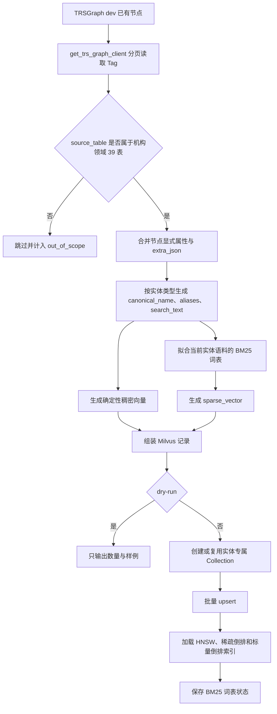
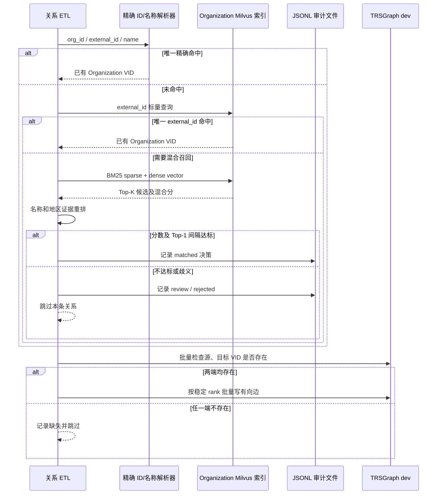

# 国内外机构 Milvus 索引与实体对齐说明

## 1. 实施范围

本实现只处理 `organization_etl_common.py` 中登记的 39 张国内外机构领域表，以及这些表已经写入 TRSGraph `dev` 图空间的实体。它不会扫描其他团队负责的论文、期刊、项目、专利主数据，也不会创建新的图节点。

“从国内外机构业务领域出发”指关系的源记录属于这 39 张表。边的实际方向严格服从本体，例如法定代表人和高管仍然是 `Person -> Organization`，子公司关系是 `Organization(子公司) -> Organization(母公司)`。

39 张表在本领域实际产生六类实体，因此分别建立六个独立 Milvus Collection：

| 图实体 | Milvus Collection | BM25 稀疏索引内容 | 稠密向量内容 | 标量过滤索引 |
| --- | --- | --- | --- | --- |
| Organization | `org_domain_organization` | 中英文名、别名、地区、地址、行业、经营范围、简介 | 同左，使用稳定的中英文字符/词 n-gram 特征哈希 | `external_id`、`country_code`、`source_table` |
| Person | `org_domain_person` | 中英文名、人员类型、国籍、出生日期、简介 | 同左 | 同上 |
| News | `org_domain_news` | 标题、正文、发布日期、原文链接 | 同左 | 同上 |
| Event | `org_domain_event` | 标题、事件类型、案号、正文、发生时间、币种 | 同左 | 同上 |
| Product | `org_domain_product` | 产品名、说明 | 同左 | 同上 |
| DataSource | `org_domain_datasource` | 中文表名、源表名、库、层级 | 同左 | 同上 |

每个 Collection 同时创建：

- `sparse_vector`：`SPARSE_INVERTED_INDEX`，用于 BM25 风格词项召回；
- `dense_vector`：`HNSW + COSINE`，用于名称规范化和中英文 n-gram 相似召回；
- `external_id`、`country_code`、`source_table`：`INVERTED` 标量索引；
- 混合检索：Milvus `WeightedRanker(0.45, 0.55)` 合并稠密向量与 BM25 稀疏向量结果。

本实现的稠密向量是本地、确定性的特征哈希向量，不需要在线模型或 API 密钥。它重点表达机构名称及地址的字词形态相似性，不把主题相似误当成实体相同。以后如果项目统一引入经过验证的中文实体向量模型，可以在保持 Milvus Schema 和对齐策略不变的前提下替换编码器。

## 2. 数据进入索引的条件

图节点必须同时满足以下条件：

1. Tag 属于 `Organization`、`Person`、`News`、`Event`、`Product`、`DataSource`；
2. 节点 `source_table` 在 39 表白名单内；
3. 节点已存在于 TRSGraph `dev`；
4. 能取得稳定 VID；
5. 节点属性及 `extra_json` 可以转换为检索文本。

因此，索引不会因为同一 Tag 中存在其他团队的数据而把它们带入机构领域 Collection。索引程序只读图，不创建或修改 TRSGraph 实体和关系；所有图读取均通过：

```python
from infra.graph_db import get_trs_graph_client
```

## 3. 实体索引生成流程



## 4. Organization 对齐与消歧策略

关系补齐只发生在源表缺少可直接对应现有 Organization VID 的情况下。算法不创建临时节点，也不使用名称模糊结果强行连边。

### 4.1 决策顺序

1. 使用源表已有 `org_id`、`inv_org_id`、`entity_eid`、`company_id` 等稳定标识；
2. 使用基础机构表中的唯一精确名称映射；
3. 如果启用 `--alignment-mode hybrid`，用外部 ID 查询标量索引：
   - 唯一命中：直接采用；
   - 多个命中：标记 `review`，不写边；
4. 执行 BM25 + 稠密向量混合召回；
5. 对候选重新计算证据分：
   - 规范化名称：60%；
   - Milvus 混合召回分：25%；
   - 国家/地区、城市、地址等结构化证据：最多约 25%，冲突会扣分；
6. 默认总分至少 `0.88`，且第一名比第二名至少高 `0.08` 才自动匹配；
7. 其余结果写入 JSONL 审计文件，状态为 `review` 或 `rejected`，不写图。

### 4.2 对齐序列图



## 5. 幂等性与安全边界

- Milvus 使用图 VID 作为主键，重复同步为 `upsert`；
- 完整重建时仅允许删除所选 `org_domain_*` Collection，不接触其他 Collection；
- 图边 rank 固定为 `SHA256(edge_type|source_vid|target_vid|source_record_id)` 的 63 位整数；
- 写图前批量检查两个端点存在性；
- 对同批候选按 `edge_type + source_vid + target_vid + rank` 去重；
- 对齐不通过就跳过，不创建虚假节点；
- 默认均为 dry-run，必须显式使用 `--write` 才会修改 Milvus 或 TRSGraph；
- `organization_entity_etl` 与 `organization_relation_etl` 共用进程锁，避免交叉写入。

## 6. 运行方式

所有命令在 `backend` 目录执行。

```bash
export TRS_GRAPH_SPACE=dev
export MILVUS_HOST=127.0.0.1
export MILVUS_PORT=19530
```

只检查每类实体最多 100 条，不写 Milvus：

```bash
python -m script.organization_milvus_index \
  --entity all \
  --max-records 100 \
  --dry-run
```

首次完整建立六类索引：

```bash
python -m script.organization_milvus_index \
  --entity all \
  --batch-size 500 \
  --write \
  --replace
```

先对少量关系做对齐 dry-run：

```bash
python -m script.organization_relation_etl \
  --relation all \
  --alignment-mode hybrid \
  --max-records 100 \
  --alignment-audit output/organization_alignment_sample.jsonl \
  --dry-run
```

审查 JSONL 后，仅写入达到自动阈值且图中两端均存在的关系：

```bash
python -m script.organization_relation_etl \
  --relation all \
  --alignment-mode hybrid \
  --alignment-audit output/organization_alignment_full.jsonl \
  --batch-size 500 \
  --write
```

## 7. 输出统计

索引程序按实体输出：

- 图中扫描数量；
- 39 表领域节点数量；
- 越界跳过数量；
- 非法节点数量；
- 索引数量；
- 批次数；
- Collection 名称；
- 三条节点样例。

关系程序按源表输出：

- 查询数、有效数、写入数、更新数；
- 跳过数、非法数；
- 源/目标端点缺失数；
- 未解析标识数；
- 批内重复数、图中已存在数；
- 执行失败数和 nGQL 样例。

对齐审计逐条保留源表、源记录 ID、查询证据、Top-5 候选、得分、间隔、匹配方法和最终状态。

## 8. 本次 `dev` 实机验证结果

2026-07-30 已在服务器 Milvus `127.0.0.1:19530` 完成六个正式 Collection 的全量构建：

| Collection | 实际索引记录数 | 索引核验 |
| --- | ---: | --- |
| `org_domain_organization` | 6,378 | HNSW、BM25 稀疏倒排、3 个标量倒排均存在 |
| `org_domain_person` | 17,109 | 同上 |
| `org_domain_news` | 1,063 | 同上 |
| `org_domain_event` | 24,175 | 同上 |
| `org_domain_product` | 2,039 | 同上；另有 1 个非 39 表 Product 被正确排除 |
| `org_domain_datasource` | 39 | 同上；另有 14 个其他领域 DataSource 被正确排除 |

关系对齐使用每个 RelationSpec 前 20 条记录完成 dry-run。优化为“稳定 ID 直接使用，仅缺 ID 才查询 Milvus”后，共产生 93 条真正需要混合消歧的决策，93 条均因低于阈值或没有语料词项而拒绝，自动匹配为 0。说明这批抽样中的未连接关系主要不是名称近似问题，而是候选 Organization 本身不在当前 39 表实体集合中。

因此本次没有凭模糊名称新增图边，dry-run 前后 11 类边数量完全一致。代码已经具备补边能力；后续数据中只有出现高置信度 `matched` 且图中两端均存在时，显式 `--write` 才会增加或幂等更新关系。
