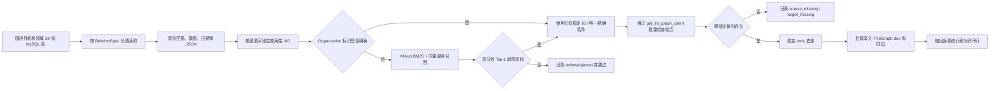
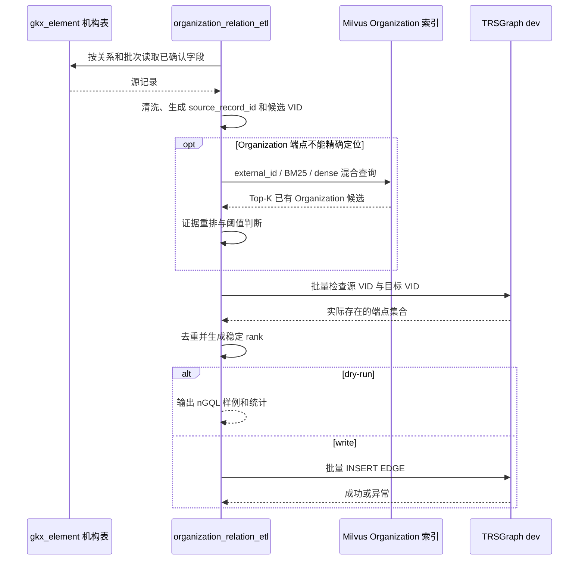

# 国内外机构关系逐项抽取流程

## 1. 文档口径

本文逐条说明 `organization_relation_etl.py` 当前从国内外机构领域 39 张表抽取的关系。只连接 TRSGraph `dev` 中已经存在的节点；源记录来自机构领域，但边方向严格采用现有本体，不把所有边强行改成 `Organization -> 其他实体`。

公共处理规则：

- Organization VID：`org_{源机构ID}`；缺少可用 ID 时才启用精确名称和 Milvus 高置信度对齐；
- Person VID：由人员角色、所属机构、姓名、出生日期/国家等源字段生成稳定哈希，不做跨领域全局学者消歧；
- News VID：`news_{源表}_{source_record_id}`；
- Event VID：`event_{源表}_{source_record_id}`；
- Product VID：规范化产品名的稳定哈希；
- `source_record_id`：优先使用每张表配置的业务唯一字段，否则对规范化整行生成稳定哈希；
- rank：`SHA256(edge_type|source_vid|target_vid|source_record_id)`，不使用随机值；
- 每条边均带 `source_table`、`source_record_id`、`ingest_batch`、`ingest_time`，其余长尾字段进入 `extra_json`；
- 对齐候选未达到阈值或存在歧义时只写审计文件，不写关系。

## 2. 总体抽取流程

## 3. 各关系的源表与字段

### 3.1 `LEGAL_REP_OF`：法定代表人属于机构

方向：`Person(法定代表人) -> Organization`

| 源表 | 人员字段 | 机构字段 | 业务唯一字段 | 边属性 |
| --- | --- | --- | --- | --- |
| `dwd_org_base_info` | `lerep` | `org_id`，备用 `name_cn`、`external_id`、`province`、`city`、`address` | `org_id + lerep` | 全行 `extra_json` + 溯源字段 |
| `dwd_research_institute_base_info` | `lerep` | `org_id`，备用 `name_cn/company_name`、`external_id`、地址字段 | `org_id + lerep` | 同上 |
| `dwd_special_taiwan_company` | `legal_person` | `org_id`，备用 `company_name` | `org_id + legal_person` | 同上 |

抽取过程：以法定代表人姓名和机构标识生成两个端点；机构 ID 缺失或不能对应已有 VID 时，用机构名称及地区证据对齐。Person 或 Organization 任一节点不存在则跳过。

### 3.2 `SHAREHOLDER_OF`：股东持有机构

方向：`Person/Organization(股东) -> Organization(被持股机构)`

| 源表 | 股东端字段 | 被持股机构字段 | 关系字段 | 业务唯一字段 |
| --- | --- | --- | --- | --- |
| `dwd_org_shareholder_info` | `inv_org_id`、`owners_name/inv_name`、`owners_type` | `org_id`，备用 `name_cn`、`external_id` | `ownership_percentage` | `inv_org_id + org_id + owners_type` |
| `dwd_forg_shareholder_info` | `owners_name`、`owners_country_code/owners_country` | `org_id`，备用 `name_en/name_cn` | `ownership_percentage` | `owners_name + org_id` |

国内表先依据 `owners_type` 判定股东是 Person 还是 Organization；类型不明确时不猜测。国外表未提供明确人员/机构类型，当前只有当 `owners_name` 能唯一对齐现有 Organization 时才生成边，否则进入审计而不是把它错误建成机构股东。

### 3.3 `EXECUTIVE_OF`：高管任职于机构

方向：`Person(高管) -> Organization`

| 源表 | 人员字段 | 机构字段 | 关系属性 | 业务唯一字段 |
| --- | --- | --- | --- | --- |
| `dwd_org_executive_info` | `executives_name` | `org_id`，备用 `name_cn/name_en`、`external_id` | `position <- executives_position` | `org_id + executives_name + executives_position` |
| `dwd_forg_executive_info` | `executives_name`、`dm_birthdate`、国籍字段 | `org_id`，备用 `name_en/name_cn` | `position <- executives_position` | `org_id + executives_name + dm_birthdate` |

人员 VID 使用角色、机构、姓名及可用出生日期/国籍生成，避免同机构同名人员被随意合并。机构端可使用混合对齐。

### 3.4 `BENEFICIAL_OWNER_OF`：受益所有人控制机构权益

方向：`Person(受益人) -> Organization`

源表：`dwd_forg_beneficiary_info`

| 类别 | 字段 |
| --- | --- |
| 人员标识 | `bo_name`、`bo_birthdate`、`bo_country_code` |
| 机构标识 | `org_id`，备用 `name_en/name_cn` |
| 边属性 | `direct_percent`、`indirect_percent`、`total_percent` |
| 业务唯一字段 | `org_id + bo_name + bo_birthdate` |

百分比统一转浮点数，非法值写 `NULL`；全行保留在 `extra_json`。

### 3.5 `ACTUAL_CONTROLLER_OF`：实际控制人控制机构

方向：`Person/Organization(实际控制人) -> Organization`

源表：`dwd_forg_act_contro_info`

| 类别 | 字段 |
| --- | --- |
| 控制人 | `entity_eid`、`entity_name`、`entity_type`、国家字段 |
| 被控制机构 | `org_id`，备用 `name_en/name_cn` |
| 边属性 | `direct_pct_num/direct_pct -> direct_pct`；`total_pct_num/total_pct -> total_pct` |
| 业务唯一字段 | `org_id + entity_eid + entity_name` |

`entity_type` 明确为人员或机构时按类型生成端点；类型未知时，只允许名称/外部 ID 唯一对齐现有 Organization。控制人和被控制机构解析成同一 VID 时跳过自环。

### 3.6 `INVESTS_IN`：机构投资机构

方向：`Organization(投资方) -> Organization(被投方)`

源表：`dwd_org_invest_info`

| 类别 | 字段 |
| --- | --- |
| 投资方 | `org_id`，备用 `name_cn`、`external_id` |
| 被投方 | `inv_org_id`，备用 `inv_name`、`inv_external_id` |
| 边属性 | `investment_amount`、`investment_ratio` |
| 业务唯一字段 | `org_id + inv_org_id` |

`inv_org_id` 缺失时，使用 `inv_name`、外部 ID 和可用地区证据对齐；只有高置信度候选才能补边。

### 3.7 `ACQUIRES`：机构并购机构

方向：`Organization(收购方) -> Organization(被收购方)`

源表：`dwd_org_merger_acquisition_info`

| 类别 | 字段 |
| --- | --- |
| 收购方 | `acquiring_org_id`，备用 `acquiring_name`、`acquiring_external_id` |
| 被收购方 | `acquired_org_id`，备用 `acquired_name`、`acquired_external_id` |
| 边属性 | `ma_amount`、`currency_code` |
| 业务唯一字段 | `acquiring_org_id + acquired_org_id` |

两个端点分别独立对齐；任一端不明确或不存在都不会写边。

### 3.8 `SUBSIDIARY_OF`：子公司隶属于母公司

方向：`Organization(子公司) -> Organization(母公司)`

源表：`dwd_forg_subsidiary_info`

| 类别 | 字段 |
| --- | --- |
| 母公司 | `org_id`，备用 `name_en/name_cn` |
| 子公司 | `affiliate/affiliates_company_id`，备用 `affiliates_name` |
| 子公司地区证据 | `affiliates_country_code`、`affiliates_country` |
| 业务唯一字段 | `org_id + affiliate + affiliates_company_id + affiliates_name` |
| 边属性 | 全行 `extra_json` + 溯源字段 |

当子公司 ID 缺失时，`affiliates_name` 与国家证据进入 Milvus 对齐。注意方向是子公司指向母公司，不反向重复创建。

### 3.9 `HAS_NEWS`：机构关联资讯

方向：`Organization -> News`

源表：`dwd_org_important_news_info`

| 类别 | 字段 |
| --- | --- |
| 机构 | `org_id`，备用 `name_cn`、`external_id` |
| 新闻节点 | `news_title`、`news_date`、`news_content` 等全行字段；VID 使用稳定源记录 ID |
| 边属性 | 全行 `extra_json` + 溯源字段 |

新闻节点必须先由实体 ETL 写入；关系 ETL 只检查并连接已有节点。

### 3.10 `INVOLVED_IN`：机构涉及业务事件

基础方向：`Organization -> Event`

| 事件类别 | 源表 | 机构定位字段 | Event 业务唯一字段 |
| --- | --- | --- | --- |
| 年报财务 | `dwd_org_annual_financial_info` | `org_id` | `org_id + year` |
| 国内上市财务 | `dwd_org_stock_finance_info` | `org_id` | `org_id + occur_period` |
| 国外上市财务 | `dwd_forg_stock_fin_info` | `org_id` | `org_id + occur_period` |
| 工商变更 | `dwd_org_changerecord_info` | `org_id` | `org_id + update_date + update_content` |
| 融资 | `dwd_org_financing_info` | `org_id` | `org_id + completion_date + funding_round` |
| 招聘 | `dwd_org_recruit_info` | `org_id` | `org_id + release_date + job_title` |
| 经营异常 | `dwd_org_company_abnormal` | `org_id`，备用名称/信用代码/地址 | `abnormal_id` |
| 行政处罚 | `dwd_org_company_punish` | `org_id`，备用名称/信用代码/地址 | `penalty_id` |
| 严重违法 | `dwd_org_company_illegal` | `org_id`，备用名称/信用代码/地址 | `sv_id` |
| 税收违法 | `dwd_org_risk_tax_punish` | `org_id`，备用 `taxpayer_name`/信用代码 | `tax_vio_id` |
| 司法案件 | `dwd_org_opt_judicial_case` | `org_id`，备用机构名称 | `case_id` |
| 失信被执行人 | `dwd_org_risk_shixin` | `org_id`，备用 `exec_person_name` | `dishonest_id` |
| 被执行人 | `dwd_org_risk_zhixing` | `org_id`，备用 `exec_person_name` | `exec_person_id` |

上述边的 `role` 默认来自 `case_role/exec_person_type`，没有时为 `subject`；全行字段进入 `extra_json`。

破产和招投标存在专门的跨表连接：

| 源表 | 方向 | 端点字段 | role |
| --- | --- | --- | --- |
| `dwd_org_bankruptcy_public_cases_list` | `Organization(当事人) -> Event(破产案件)` | `org_id/related_person_name` -> `case_no` | `party_role_type` 或 `bankruptcy_party` |
| `dwd_org_bankruptcy_public_cases` | `Organization(管理人) -> Event(破产案件)` | `admin_org_id/admin_org` -> `case_no` | `bankruptcy_administrator` |
| `dwd_bid_win_candidate_out` | `Organization(中标候选人) -> Event(招标公告)` | `org_id/company_name` -> `u_id` | `winner_candidate` |
| `dwd_bid_purchase_agency_out` | `Organization(采购代理) -> Event(招标公告)` | `company_id/company_name` -> `u_id` | `purchase_agency` |

破产管理人、候选人或代理机构缺少 ID 时可走 Organization 混合对齐；关联 Event 必须已由对应实体表写入。

### 3.11 `PRODUCES`：机构生产或经营产品

方向：`Organization -> Product`

| 源表 | 机构字段 | 产品字段 | 业务唯一字段 | 边属性 |
| --- | --- | --- | --- | --- |
| `dwd_org_org_product_info` | `org_id`，备用 `name_cn`、`external_id` | `main_prod` | `org_id + main_prod` | `extra_json` + 溯源 |
| `dwd_forg_product_info` | `org_id`，备用 `name_en/name_cn`、`external_id` | `main_products` | `org_id + main_products` | 同上 |

产品节点必须先存在。`main_prod/main_products` 为空时跳过，不创建空产品节点。

## 4. 关系执行序列

## 5. 当前不自动补齐的情况

- 股东、实际控制人的人员/机构类型无法从源字段判断；
- 同名机构候选分数接近；
- 外部 ID 在图中对应多个 Organization；
- 候选节点不是 39 表机构领域节点；
- Person 与其他团队学者节点的跨库对齐；
- 源记录指向的 News、Event、Product 实体尚未存在；
- 只有模糊简称且没有国家、地区、地址或外部 ID 佐证。

这些记录保留源表、源记录 ID 和候选列表，后续可以人工确认后通过确定性 ID 映射重跑，不会在当前批次中产生猜测关系。
