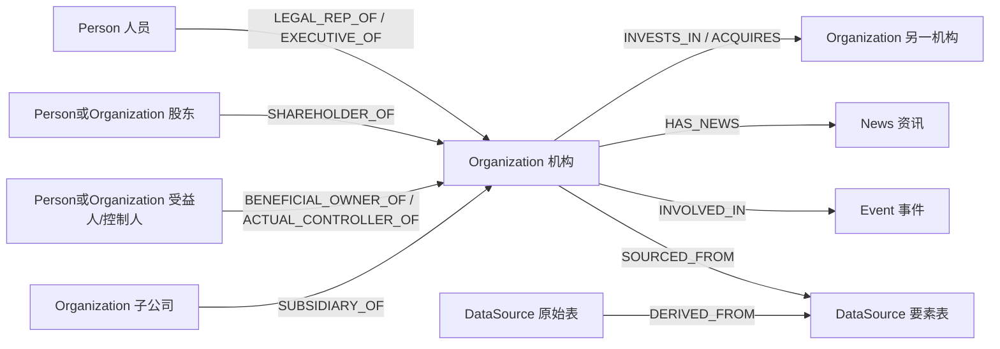
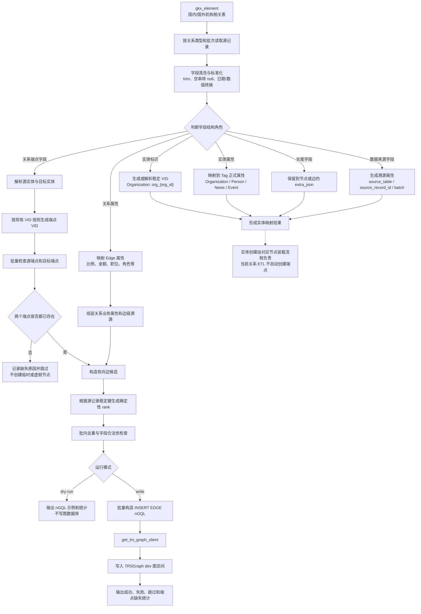
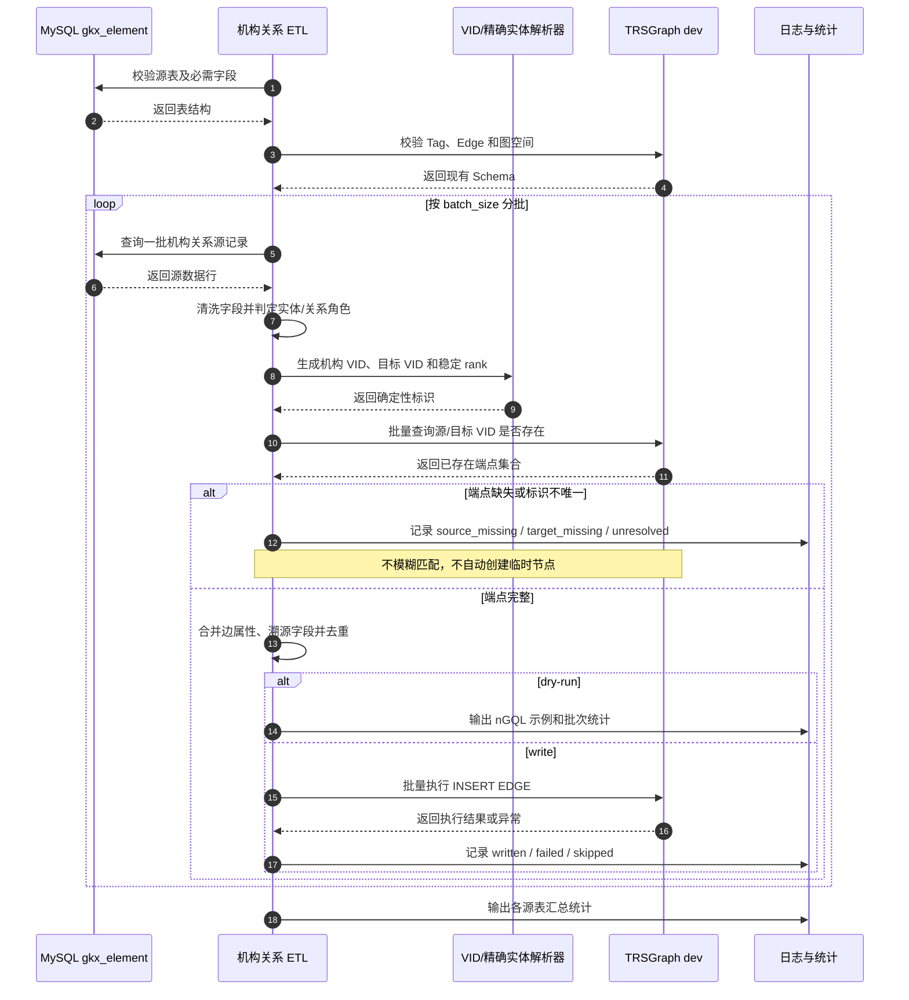

# 国内外机构要素库全字段 → TRSGraph 图谱映射说明

> 数据来源：`版权人才、企业机构、政策数据汇总表.xlsx` 中的“国内机构要素库”“国外机构要素库”工作表。
> 本体依据：`ontology.md`；详细映射依据：现有 `mapping.md` 与项目机构关系 ETL 实现。
> 生成日期：2026-07-27。本文档是字段级映射规格，不代表所有节点和关系已经写入当前共享 `dev` 图空间。

## 一、覆盖范围与核对结论

| 范围 | 表数量 | 字段数量 | 核对结果 |
|---|---:|---:|---|
| 国内机构要素库 | 31 | 547 | 工作表字段与逐字段映射一一对应 |
| 国外机构要素库 | 8 | 76 | 工作表字段与逐字段映射一一对应 |
| **合计** | **39** | **623** | **缺失 0；多余 0** |

每个字段都被分到以下用途之一：实体标识、实体属性、关系端点、关系属性、扩展属性、数据血缘/跨表连接或审计字段。没有直接丢弃源字段；暂不升格为正式图属性的内容进入相应节点或边的 `extra_json`。

## 二、怎样判断字段属于节点还是关系

| 字段类别 | 图谱归属 | 判断方式 | 示例 |
|---|---|---|---|
| 实体标识 | 节点 | 用于生成/定位 VID | `org_id → Organization VID org_{org_id}` |
| 实体属性 | 节点 | 描述单个机构、人员、资讯或事件自身 | `name_cn → Organization.name_cn` |
| 关系起点/终点 | 边的端点 | 字段决定边从谁指向谁，本身通常不写成边属性 | `org_id`、`inv_org_id` |
| 关系属性 | 边 | 描述两个端点之间这一次事实 | `ownership_percentage → SHAREHOLDER_OF.ownership_percentage` |
| 扩展属性 | 节点或边的 `extra_json` | 本体暂未定义独立属性，但需要完整保留 | 经纬度、复杂司法详情、财务长尾指标 |
| 数据血缘/连接 | DataSource 或 ETL | 用于源记录追溯、跨表连接、VID/rank | `data_source`、`u_id`、`created_time` |

### 映射状态说明

- **已确认**：`ontology.md` 或现有 Schema/ETL 已明确实体、边、方向或属性。
- **已设计：扩展保留**：当前先进入 `extra_json`，数据不会丢失，但是否升格为正式可索引属性仍可讨论。
- **推测映射**：源字段业务含义基本明确，但本体未给出完全对应的正式属性。
- **需要业务确认**：端点身份、枚举含义、母子公司方向或按名称连接存在歧义。

## 三、实体、关系与方向

### 3.1 主要实体

| Tag | 中文 | 主要来源 | VID 规则 |
|---|---|---|---|
| `Organization` | 机构 | 国内企业、高校、科研院所、港澳台企业、海外机构 | `org_{org_id}`，超 64 字节时确定性截断并附 MD5 |
| `Person` | 人员 | 法定代表人、自然人股东、高管、受益人、控制人 | 必须优先复用已有稳定人员 VID；只有姓名时不做模糊匹配 |
| `News` | 资讯 | `dwd_org_important_news_info` | `news_{稳定源记录键}` |
| `Event` | 事件 | 财务、工商、融资、招聘、风险、司法、破产、招投标 | `event_{source_table}_{稳定源记录键}` |
| `DataSource` | 数据来源 | 每张物理表及其上游来源 | `ds_{source_table}` |

### 3.2 关系方向

| Edge | 中文 | 起点 → 终点 | 正式关系属性 |
|---|---|---|---|
| `LEGAL_REP_OF` | 法定代表 | Person → Organization | 边级溯源 |
| `SHAREHOLDER_OF` | 股东/持股 | Person 或 Organization → Organization | `ownership_percentage` |
| `EXECUTIVE_OF` | 高管任职 | Person → Organization | `position` |
| `INVESTS_IN` | 投资 | Organization → Organization | `investment_amount`、`investment_ratio` |
| `ACQUIRES` | 并购/收购 | Organization → Organization | `ma_amount`、`currency_code` |
| `SUBSIDIARY_OF` | 子公司属于 | 子公司 Organization → 母公司 Organization | 边级溯源；源字段方向仍需确认 |
| `BENEFICIAL_OWNER_OF` | 最终受益 | Person/Organization → Organization | `direct_percent`、`indirect_percent`、`total_percent` |
| `ACTUAL_CONTROLLER_OF` | 实际控制 | Person/Organization → Organization | `direct_pct`、`total_pct` |
| `HAS_NEWS` | 拥有资讯 | Organization → News | 边级溯源 |
| `INVOLVED_IN` | 涉及事件 | Organization → Event | `role`、扩展信息、边级溯源 |
| `SOURCED_FROM` | 来源于 | 业务实体 → DataSource | `source_record_id`、批次和时间 |
| `DERIVED_FROM` | 派生自 | 原始 DataSource → 要素 DataSource | `transform` |

### 3.3 实体与关系抽取流程图

下面的流程图同时表示完整映射设计和当前关系 ETL 的执行边界。实体属性分支用于形成节点映射规格；当前 `organization_relation_etl.py` 主要执行关系分支，只连接图中已经存在的端点。

### 3.4 批处理抽取与写图时序图

## 四、表级映射总览

| 数据域 | 源表 | 中文表名 | 字段数 | 主图目标 | 当前代码落地 |
|---|---|---|---:|---|---|
| 国内机构要素库 | `dwd_org_base_info` | 机构基本信息 | 35 | `Organization` | 字段映射设计，非当前关系 ETL 直接写入范围 |
| 国内机构要素库 | `dwd_org_shareholder_info` | 股东信息 | 10 | `SHAREHOLDER_OF` | 已配置 `SHAREHOLDER_OF` 边抽取 |
| 国内机构要素库 | `dwd_org_executive_info` | 高管信息 | 8 | `EXECUTIVE_OF` | 字段映射设计，非当前关系 ETL 直接写入范围 |
| 国内机构要素库 | `dwd_org_org_product_info` | 经营信息 | 9 | `Organization` | 字段映射设计，非当前关系 ETL 直接写入范围 |
| 国内机构要素库 | `dwd_org_annual_financial_info` | 年报财务信息 | 16 | `Event + INVOLVED_IN` | 已配置 `INVOLVED_IN` 边抽取 |
| 国内机构要素库 | `dwd_org_important_news_info` | 重点资讯 | 10 | `News + HAS_NEWS` | 已配置 `HAS_NEWS` 边抽取 |
| 国内机构要素库 | `dwd_org_changerecord_info` | 工商变更信息 | 10 | `Event + INVOLVED_IN` | 已配置 `INVOLVED_IN` 边抽取 |
| 国内机构要素库 | `dwd_org_merger_acquisition_info` | 并购事件 | 11 | `ACQUIRES` | 已配置 `ACQUIRES` 边抽取 |
| 国内机构要素库 | `dwd_org_financing_info` | 融资事件 | 11 | `Event + INVOLVED_IN` | 已配置 `INVOLVED_IN` 边抽取 |
| 国内机构要素库 | `dwd_org_invest_info` | 投资事件 | 11 | `INVESTS_IN` | 已配置 `INVESTS_IN` 边抽取 |
| 国内机构要素库 | `dwd_org_recruit_info` | 招聘信息 | 11 | `Event + INVOLVED_IN` | 已配置 `INVOLVED_IN` 边抽取 |
| 国内机构要素库 | `dwd_org_heis_info` | 高校基本信息 | 20 | `Organization` | 字段映射设计，非当前关系 ETL 直接写入范围 |
| 国内机构要素库 | `dwd_org_stock_base` | 上市企业基本信息 | 11 | `Organization` | 字段映射设计，非当前关系 ETL 直接写入范围 |
| 国内机构要素库 | `dwd_org_stock_finance_info` | 上市企业主要财务指标 | 20 | `Event + INVOLVED_IN` | 已配置 `INVOLVED_IN` 边抽取 |
| 国内机构要素库 | `dwd_org_company_abnormal` | 经营异常 | 13 | `Event + INVOLVED_IN` | 已配置 `INVOLVED_IN` 边抽取 |
| 国内机构要素库 | `dwd_org_company_punish` | 行政处罚 | 22 | `Event + INVOLVED_IN` | 已配置 `INVOLVED_IN` 边抽取 |
| 国内机构要素库 | `dwd_org_company_illegal` | 严重违法 | 14 | `Event + INVOLVED_IN` | 已配置 `INVOLVED_IN` 边抽取 |
| 国内机构要素库 | `dwd_org_risk_tax_punish` | 税收违法 | 26 | `Event + INVOLVED_IN` | 已配置 `INVOLVED_IN` 边抽取 |
| 国内机构要素库 | `dwd_org_opt_judicial_case` | 司法案件信息 | 15 | `Event + INVOLVED_IN` | 已配置 `INVOLVED_IN` 边抽取 |
| 国内机构要素库 | `dwd_org_risk_shixin` | 失信被执行人 | 26 | `Event + INVOLVED_IN` | 已配置 `INVOLVED_IN` 边抽取 |
| 国内机构要素库 | `dwd_org_risk_zhixing` | 被执行人 | 19 | `Event + INVOLVED_IN` | 已配置 `INVOLVED_IN` 边抽取 |
| 国内机构要素库 | `dwd_org_bankruptcy_public_cases` | 破产案件 | 14 | `Event + INVOLVED_IN` | 字段映射设计，非当前关系 ETL 直接写入范围 |
| 国内机构要素库 | `dwd_org_bankruptcy_public_cases_list` | 破产案件当事人 | 12 | `INVOLVED_IN` | 已配置 `INVOLVED_IN` 边抽取 |
| 国内机构要素库 | `dwd_special_hongkong_company` | 香港企业 | 19 | `Organization` | 字段映射设计，非当前关系 ETL 直接写入范围 |
| 国内机构要素库 | `dwd_special_taiwan_company` | 台湾企业 | 36 | `Organization` | 字段映射设计，非当前关系 ETL 直接写入范围 |
| 国内机构要素库 | `dwd_special_aomen_company` | 澳门企业 | 19 | `Organization` | 字段映射设计，非当前关系 ETL 直接写入范围 |
| 国内机构要素库 | `dwd_bid_base_out` | 招投标公告基础表 | 56 | `Event` | 字段映射设计，非当前关系 ETL 直接写入范围 |
| 国内机构要素库 | `dwd_bid_win_candidate_out` | 招投标中标候选人表 | 15 | `INVOLVED_IN` | 已配置 `INVOLVED_IN` 边抽取 |
| 国内机构要素库 | `dwd_bid_purchase_agency_out` | 招投标采购代理表 | 10 | `INVOLVED_IN` | 已配置 `INVOLVED_IN` 边抽取 |
| 国内机构要素库 | `dwd_bid_target_item_out` | 招投标标的物表 | 18 | `Event.content` | 字段映射设计，非当前关系 ETL 直接写入范围 |
| 国内机构要素库 | `dwd_research_institute_base_info` | 科研机构基本信息 | 20 | `Organization` | 字段映射设计，非当前关系 ETL 直接写入范围 |
| 国外机构要素库 | `dwd_forg_base_info` | 海外机构基本信息 | 20 | `Organization` | 字段映射设计，非当前关系 ETL 直接写入范围 |
| 国外机构要素库 | `dwd_forg_shareholder_info` | 海外机构股东股权关联信息 | 5 | `SHAREHOLDER_OF` | 已配置 `SHAREHOLDER_OF` 边抽取 |
| 国外机构要素库 | `dwd_forg_subsidiary_info` | 海外机构子公司股权关联信息 | 6 | `SUBSIDIARY_OF` | 已配置 `SUBSIDIARY_OF` 边抽取 |
| 国外机构要素库 | `dwd_forg_executive_info` | 海外机构高管信息 | 6 | `EXECUTIVE_OF` | 字段映射设计，非当前关系 ETL 直接写入范围 |
| 国外机构要素库 | `dwd_forg_product_info` | 海外机构公司经营信息 | 3 | `Organization` | 字段映射设计，非当前关系 ETL 直接写入范围 |
| 国外机构要素库 | `dwd_forg_beneficiary_info` | 海外机构受益人信息（新增表） | 10 | `BENEFICIAL_OWNER_OF` | 字段映射设计，非当前关系 ETL 直接写入范围 |
| 国外机构要素库 | `dwd_forg_act_contro_info` | 海外机构实控人信息（新增表） | 11 | `ACTUAL_CONTROLLER_OF` | 字段映射设计，非当前关系 ETL 直接写入范围 |
| 国外机构要素库 | `dwd_forg_stock_fin_info` | 海外上市企业财务信息 | 15 | `Event + INVOLVED_IN` | 已配置 `INVOLVED_IN` 边抽取 |

## 五、逐表逐字段映射

> “当前落地”仅描述本工作区中的 `organization_relation_etl.py`。该程序只连接已有节点，不会因为文档中定义了节点而自动创建节点；端点 VID 不存在时会记录并跳过。

## 5.1 国内机构要素库

### `dwd_org_base_info` — 机构基本信息

- 所属领域：国内机构要素库
- 数据库表注释：机构基本信息
- 主图目标：`Organization`
- **最终图结构**：`Organization`；若 `lerep` 有值，再生成 `Person -[LEGAL_REP_OF]-> Organization`。
- **字段阅读方法**：先看“映射类别”，再看“结构角色”；端点字段决定边的方向，关系属性写在边上。

- Excel 字段数：35
- 当前落地：属于完整映射设计；当前机构关系 ETL 未直接负责创建该表对应节点/反向边。

| 源字段 | 字段含义/说明 | Excel 类型/长度 | 数据样例 | 可空/索引 | 是否参与 | 映射类别 | 图谱对象与属性/端点 | 结构角色 | 转换与关联规则 | 空值处理 | 确认状态 |
|---|---|---|---|---|---|---|---|---|---|---|---|
| `org_id` | 机构id；机构身份唯一id，用于关联其它表。 | 字符 / 255 MySQL: `varchar(255)` | 1470d623589175f1fe06fb5466b77f55 | 否 / 是 | 是 | 节点标识字段 | Organization.org_id（同时用于 VID：org_{org_id}） | 写入节点属性，并参与生成节点 VID | 空值不覆盖已有非空属性；数值字段做容错转换；trim；空串转 null；写入 nGQL 前安全转义 | 缺失则不能稳定定位端点：跳过该节点/边并计入异常 | 已确认：实体标识或关系端点 |
| `name_cn` | 机构名称 | 字符 / 255 MySQL: `varchar(255)` | 上海微创医疗机器人(集团)股份有限公司 | 否 / 是 | 是 | 节点属性 | Organization.name_cn | Organization.name_cn | 空值不覆盖已有非空属性；数值字段做容错转换；trim；空串转 null；写入 nGQL 前安全转义 | 转为 null，不覆盖图中已有非空属性 | 已确认：正式实体/关系属性 |
| `external_id` | 统一社会信用代码 | 字符 / 255 MySQL: `varchar(255)` | 91310115329558376Y | 是 / 是 | 是 | 节点属性 | Organization.external_id | Organization.external_id | 空值不覆盖已有非空属性；数值字段做容错转换；trim；空串转 null；写入 nGQL 前安全转义 | 转为 null，不覆盖图中已有非空属性 | 已确认：正式实体/关系属性 |
| `province` | 所在省份 | 字符 / 255 MySQL: `varchar(255)` | 上海市 | 是 / 否 | 是 | 节点属性 | Organization.province | Organization.province | 空值不覆盖已有非空属性；数值字段做容错转换；trim；空串转 null；写入 nGQL 前安全转义 | 转为 null，不覆盖图中已有非空属性 | 已确认：正式实体/关系属性 |
| `city` | 所在城市 | 字符 / 255 MySQL: `varchar(255)` | 上海市 | 是 / 否 | 是 | 节点属性 | Organization.city | Organization.city | 空值不覆盖已有非空属性；数值字段做容错转换；trim；空串转 null；写入 nGQL 前安全转义 | 转为 null，不覆盖图中已有非空属性 | 已确认：正式实体/关系属性 |
| `area` | 所在区县 | 字符 / 255 MySQL: `varchar(255)` | 浦东新区 | 是 / 否 | 是 | 节点属性 | Organization.area | Organization.area | 空值不覆盖已有非空属性；数值字段做容错转换；trim；空串转 null；写入 nGQL 前安全转义 | 转为 null，不覆盖图中已有非空属性 | 已确认：正式实体/关系属性 |
| `address` | 公司地址 | 文本 MySQL: `text` | 中国(上海)自由贸易试验区张东路1601号1幢B区101室 | 是 / 否 | 是 | 节点属性 | Organization.address | Organization.address | 空值不覆盖已有非空属性；数值字段做容错转换；trim；空串转 null；写入 nGQL 前安全转义 | 转为 null，不覆盖图中已有非空属性 | 已确认：正式实体/关系属性 |
| `addr_lng` | 地址对应经度 | 字符 / 255 MySQL: `varchar(255)` | 121.633175 | 是 / 否 | 是（扩展/审计保留） | 节点扩展属性 | Organization.extra_json.addr_lng | 写入 Organization 节点的 JSON 扩展内容 | 本体无独立属性，原样保留以避免信息丢失；trim；空串转 null；写入 nGQL 前安全转义 | 空字段不写入扩展 JSON，其余字段继续保留 | 已设计：扩展保留；是否升格为正式属性待确认 |
| `addr_lat` | 地址对应维度 | 字符 / 255 MySQL: `varchar(255)` | 31.213725 | 是 / 否 | 是（扩展/审计保留） | 节点扩展属性 | Organization.extra_json.addr_lat | 写入 Organization 节点的 JSON 扩展内容 | 本体无独立属性，原样保留以避免信息丢失；trim；空串转 null；写入 nGQL 前安全转义 | 空字段不写入扩展 JSON，其余字段继续保留 | 已设计：扩展保留；是否升格为正式属性待确认 |
| `postal_code` | 邮政编码 | 字符 / 255 MySQL: `varchar(255)` | 201203 | 是 / 否 | 是 | 节点属性 | Organization.postal_code | Organization.postal_code | 空值不覆盖已有非空属性；数值字段做容错转换；trim；空串转 null；写入 nGQL 前安全转义 | 转为 null，不覆盖图中已有非空属性 | 已确认：正式实体/关系属性 |
| `email` | 电子邮箱 | 文本 MySQL: `text` | medbot@microport.com | 是 / 否 | 是 | 节点属性 | Organization.email | Organization.email | 空值不覆盖已有非空属性；数值字段做容错转换；trim；空串转 null；写入 nGQL 前安全转义 | 转为 null，不覆盖图中已有非空属性 | 已确认：正式实体/关系属性 |
| `lerep` | 法定代表人 | 字符 / 255 MySQL: `varchar(255)` | 何超 | 是 / 否 | 是 | 节点属性＋关系触发 | Organization.legal_rep；并创建 Person -[LEGAL_REP_OF]-> Organization | Organization.legal_rep；并创建 Person -[LEGAL_REP_OF]-> Organization | 空值不覆盖已有非空属性；数值字段做容错转换；trim；空串转 null；写入 nGQL 前安全转义 | 转为 null，不覆盖图中已有非空属性 | 需要确认：只允许精确匹配已有实体，未命中则跳过 |
| `reg_status` | 登记状态 | 字符 / 255 MySQL: `varchar(255)` | 存续(在营/开业/在册) | 是 / 否 | 是（扩展/审计保留） | 节点扩展属性 | Organization.extra_json.reg_status | 写入 Organization 节点的 JSON 扩展内容 | 本体无独立属性，原样保留以避免信息丢失；trim；空串转 null；写入 nGQL 前安全转义 | 空字段不写入扩展 JSON，其余字段继续保留 | 已设计：扩展保留；是否升格为正式属性待确认 |
| `registration_org` | 登记机关 | 字符 / 255 MySQL: `varchar(255)` | 上海市市场监督管理局 | 是 / 否 | 是（扩展/审计保留） | 节点扩展属性 | Organization.extra_json.registration_org | 写入 Organization 节点的 JSON 扩展内容 | 本体无独立属性，原样保留以避免信息丢失；trim；空串转 null；写入 nGQL 前安全转义 | 空字段不写入扩展 JSON，其余字段继续保留 | 已设计：扩展保留；是否升格为正式属性待确认 |
| `incorporation_year` | 成立年份 | 数值 / 20 MySQL: `decimal(20,0)` | 2015 | 是 / 否 | 是 | 节点属性 | Organization.founded_year（转 int） | Organization.founded_year（转 int） | 空值不覆盖已有非空属性；数值字段做容错转换；去千分位/单位后做 int 或 double 容错转换 | 转为 null，不覆盖图中已有非空属性 | 已确认：正式实体/关系属性 |
| `incorporation_date` | 成立日期 | 日期 MySQL: `datetime` | 2015-05-11（Excel 原值 42135） | 是 / 否 | 是（扩展/审计保留） | 节点扩展属性 | Organization.extra_json.incorporation_date | 写入 Organization 节点的 JSON 扩展内容 | 本体无独立属性，原样保留以避免信息丢失；统一为 ISO 8601；非法日期记异常 | 空字段不写入扩展 JSON，其余字段继续保留 | 已设计：扩展保留；是否升格为正式属性待确认 |
| `start_date` | 经营期限自 | 字符 / 255 MySQL: `varchar(255)` | 2015-05-11（Excel 原值 42135） | 是 / 否 | 是（扩展/审计保留） | 节点扩展属性 | Organization.extra_json.start_date | 写入 Organization 节点的 JSON 扩展内容 | 本体无独立属性，原样保留以避免信息丢失；trim；空串转 null；写入 nGQL 前安全转义 | 空字段不写入扩展 JSON，其余字段继续保留 | 已设计：扩展保留；是否升格为正式属性待确认 |
| `end_date` | 经营期限至 | 字符 / 255 MySQL: `varchar(255)` | 无固定期限 | 是 / 否 | 是（扩展/审计保留） | 节点扩展属性 | Organization.extra_json.end_date | 写入 Organization 节点的 JSON 扩展内容 | 本体无独立属性，原样保留以避免信息丢失；trim；空串转 null；写入 nGQL 前安全转义 | 空字段不写入扩展 JSON，其余字段继续保留 | 已设计：扩展保留；是否升格为正式属性待确认 |
| `org_type` | 机构类型 | 字符 / 255 MySQL: `varchar(255)` | 股份有限公司（港澳台投资、上市） | 是 / 否 | 是 | 节点属性 | Organization.org_type | Organization.org_type | 空值不覆盖已有非空属性；数值字段做容错转换；trim；空串转 null；写入 nGQL 前安全转义 | 转为 null，不覆盖图中已有非空属性 | 已确认：正式实体/关系属性 |
| `listing_status` | 上市状态 | 字符 / 255 MySQL: `varchar(255)` | 是 | 是 / 否 | 是 | 节点属性 | Organization.listing_status | Organization.listing_status | 空值不覆盖已有非空属性；数值字段做容错转换；trim；空串转 null；写入 nGQL 前安全转义 | 转为 null，不覆盖图中已有非空属性 | 已确认：正式实体/关系属性 |
| `listing_date` | 上市日期 | 日期 MySQL: `datetime` | 2021-11-02（Excel 原值 44502） | 是 / 否 | 是 | 节点属性 | Organization.listed_date | Organization.listed_date | 空值不覆盖已有非空属性；数值字段做容错转换；统一为 ISO 8601；非法日期记异常 | 转为 null，不覆盖图中已有非空属性 | 已确认：正式实体/关系属性 |
| `registered_capital_value` | 注册资本(本币元) | 数值 / 20,2 MySQL: `decimal(20,2)` | 1031330331 | 是 / 否 | 是 | 节点属性 | Organization.registered_capital（去除单位后转 double） | Organization.registered_capital（去除单位后转 double） | 空值不覆盖已有非空属性；数值字段做容错转换；去千分位/单位后做 int 或 double 容错转换 | 转为 null，不覆盖图中已有非空属性 | 已确认：正式实体/关系属性 |
| `capital_currency` | 币种 | 字符 / 255 MySQL: `varchar(255)` | CNY | 是 / 否 | 是 | 节点属性 | Organization.capital_currency | Organization.capital_currency | 空值不覆盖已有非空属性；数值字段做容错转换；trim；空串转 null；写入 nGQL 前安全转义 | 转为 null，不覆盖图中已有非空属性 | 已确认：正式实体/关系属性 |
| `industry` | 最深一级的行业名称 | 字符 / 255 MySQL: `varchar(255)` | 医学研究和试验发展 | 是 / 否 | 是 | 节点属性 | Organization.industry_class | Organization.industry_class | 空值不覆盖已有非空属性；数值字段做容错转换；trim；空串转 null；写入 nGQL 前安全转义 | 转为 null，不覆盖图中已有非空属性 | 已确认：正式实体/关系属性 |
| `industry_l1_name` | 一级行业名称 | 字符 / 255 MySQL: `varchar(255)` | M | 是 / 否 | 是（扩展/审计保留） | 节点扩展属性 | Organization.extra_json.industry_l1_name | 写入 Organization 节点的 JSON 扩展内容 | 本体无独立属性，原样保留以避免信息丢失；trim；空串转 null；写入 nGQL 前安全转义 | 空字段不写入扩展 JSON，其余字段继续保留 | 已设计：扩展保留；是否升格为正式属性待确认 |
| `industry_l1_code` | 一级行业编码；国民经济行业分类代码第一个英文字母 | 字符 / 255 MySQL: `varchar(255)` | 科学研究和技术服务业 | 是 / 否 | 是（扩展/审计保留） | 节点扩展属性 | Organization.extra_json.industry_l1_code | 写入 Organization 节点的 JSON 扩展内容 | 本体无独立属性，原样保留以避免信息丢失；trim；空串转 null；写入 nGQL 前安全转义 | 空字段不写入扩展 JSON，其余字段继续保留 | 已设计：扩展保留；是否升格为正式属性待确认 |
| `industry_l2_name` | 二级行业名称 | 字符 / 255 MySQL: `varchar(255)` | M73 | 是 / 否 | 是（扩展/审计保留） | 节点扩展属性 | Organization.extra_json.industry_l2_name | 写入 Organization 节点的 JSON 扩展内容 | 本体无独立属性，原样保留以避免信息丢失；trim；空串转 null；写入 nGQL 前安全转义 | 空字段不写入扩展 JSON，其余字段继续保留 | 已设计：扩展保留；是否升格为正式属性待确认 |
| `industry_l2_code` | 二级行业编码；国民经济行业分类四位数字中的前两位 | 字符 / 255 MySQL: `varchar(255)` | 研究和试验发展 | 是 / 否 | 是（扩展/审计保留） | 节点扩展属性 | Organization.extra_json.industry_l2_code | 写入 Organization 节点的 JSON 扩展内容 | 本体无独立属性，原样保留以避免信息丢失；trim；空串转 null；写入 nGQL 前安全转义 | 空字段不写入扩展 JSON，其余字段继续保留 | 已设计：扩展保留；是否升格为正式属性待确认 |
| `industry_l3_name` | 三级行业名称 | 字符 / 255 MySQL: `varchar(255)` | M734 | 是 / 否 | 是（扩展/审计保留） | 节点扩展属性 | Organization.extra_json.industry_l3_name | 写入 Organization 节点的 JSON 扩展内容 | 本体无独立属性，原样保留以避免信息丢失；trim；空串转 null；写入 nGQL 前安全转义 | 空字段不写入扩展 JSON，其余字段继续保留 | 已设计：扩展保留；是否升格为正式属性待确认 |
| `industry_l3_code` | 三级行业编码；国民经济行业分类四位数字中的前三位 | 字符 / 255 MySQL: `varchar(255)` | 医学研究和试验发展 | 是 / 否 | 是（扩展/审计保留） | 节点扩展属性 | Organization.extra_json.industry_l3_code | 写入 Organization 节点的 JSON 扩展内容 | 本体无独立属性，原样保留以避免信息丢失；trim；空串转 null；写入 nGQL 前安全转义 | 空字段不写入扩展 JSON，其余字段继续保留 | 已设计：扩展保留；是否升格为正式属性待确认 |
| `industry_l4_name` | 四级行业名称 | 字符 / 255 MySQL: `varchar(255)` | M7340 | 是 / 否 | 是（扩展/审计保留） | 节点扩展属性 | Organization.extra_json.industry_l4_name | 写入 Organization 节点的 JSON 扩展内容 | 本体无独立属性，原样保留以避免信息丢失；trim；空串转 null；写入 nGQL 前安全转义 | 空字段不写入扩展 JSON，其余字段继续保留 | 已设计：扩展保留；是否升格为正式属性待确认 |
| `industry_l4_code` | 四级行业编码；国民经济行业分类四位数字 | 字符 / 255 MySQL: `varchar(255)` | 医学研究和试验发展 | 是 / 否 | 是（扩展/审计保留） | 节点扩展属性 | Organization.extra_json.industry_l4_code | 写入 Organization 节点的 JSON 扩展内容 | 本体无独立属性，原样保留以避免信息丢失；trim；空串转 null；写入 nGQL 前安全转义 | 空字段不写入扩展 JSON，其余字段继续保留 | 已设计：扩展保留；是否升格为正式属性待确认 |
| `data_source` | 数据来源；来源于ods表，若有多个来源则用英文分号隔开。 | 字符 / 255 MySQL: `varchar(255)` | ods_org_base_info | 否 / 否 | 是（连接/血缘） | 数据血缘字段 | DataSource.source_table + DERIVED_FROM | 创建/定位 DataSource；必要时创建 原始DataSource -[DERIVED_FROM]-> 当前DataSource | 非 MOCK 值建原始 DataSource；方向为原始来源表 -> 当前要素表；trim；空串转 null；写入 nGQL 前安全转义 | 空值回退为当前物理表名 | 已确认：连接、审计或数据血缘 |
| `created_time` | 创建时间；本表创建时间 | 日期时间 MySQL: `datetime` | 2026-06-26T12:59:00Z（Excel 原值 46199.5409722222） | 否 / 否 | 是（扩展/审计保留） | 审计保留字段 | 目标节点/边 extra_json | 保存在本表主目标对象的 extra_json，不生成新关系 | 保留源值，不作为图写入时间；ingest_time 由 ETL 生成；统一为 ISO 8601；非法日期记异常 | 空字段不写入扩展 JSON，其余字段继续保留 | 已确认：连接、审计或数据血缘 |
| `updated_time` | 更新时间 | 日期时间 MySQL: `datetime` | 2026-06-26T12:59:00Z（Excel 原值 46199.5409722222） | 否 / 否 | 是（扩展/审计保留） | 节点属性 | Organization.source_update_time / 边 extra_json | Organization.source_update_time / 边 extra_json | 统一转 ISO 字符串；关系表保留在 edge.extra_json；统一为 ISO 8601；非法日期记异常 | 空字段不写入扩展 JSON，其余字段继续保留 | 已确认：正式实体/关系属性 |

### `dwd_org_shareholder_info` — 股东信息

- 所属领域：国内机构要素库
- 数据库表注释：股东信息
- 主图目标：`SHAREHOLDER_OF`
- **最终图结构**：`Person/Organization(股东) -[SHAREHOLDER_OF]-> Organization(被持股机构)`。
- **字段阅读方法**：先看“映射类别”，再看“结构角色”；端点字段决定边的方向，关系属性写在边上。

- Excel 字段数：10
- 当前落地：当前 `organization_relation_etl.py` 已配置 `SHAREHOLDER_OF` 边候选抽取；只连接已存在端点，不创建节点。

| 源字段 | 字段含义/说明 | Excel 类型/长度 | 数据样例 | 可空/索引 | 是否参与 | 映射类别 | 图谱对象与属性/端点 | 结构角色 | 转换与关联规则 | 空值处理 | 确认状态 |
|---|---|---|---|---|---|---|---|---|---|---|---|
| `org_id` | 机构id；机构身份唯一id，用于关联其它表。 | 字符 / 255 MySQL: `varchar(255)` | fcde18227bd7e6c0903d106a699439e4 | 否 / 是 | 是 | 关系终点字段 | SHAREHOLDER_OF 终点 Organization.org_id | SHAREHOLDER_OF 终点 Organization.org_id | 生成 org_{org_id}；trim；空串转 null；写入 nGQL 前安全转义 | 缺失则不能稳定定位端点：跳过该节点/边并计入异常 | 已确认：实体标识或关系端点 |
| `name_cn` | 机构名称 | 字符 / 255 MySQL: `varchar(255)` | 蓝思科技股份有限公司 | 否 / 是 | 是（扩展/审计保留） | 关系扩展属性 | SHAREHOLDER_OF.extra_json.name_cn | 写入该关系的 extra_json/审计信息 | 本体无独立属性，原样保留在关系/节点 JSON；trim；空串转 null；写入 nGQL 前安全转义 | 空字段不写入扩展 JSON，其余字段继续保留 | 已设计：扩展保留；是否升格为正式属性待确认 |
| `external_id` | 统一社会信用代码 | 字符 / 255 MySQL: `varchar(255)` | 91430000796852865Y | 是 / 是 | 是（扩展/审计保留） | 关系扩展属性 | SHAREHOLDER_OF.extra_json.external_id | 写入该关系的 extra_json/审计信息 | 本体无独立属性，原样保留在关系/节点 JSON；trim；空串转 null；写入 nGQL 前安全转义 | 空字段不写入扩展 JSON，其余字段继续保留 | 已设计：扩展保留；是否升格为正式属性待确认 |
| `inv_org_id` | 股东id；若股东为机构非自然人，则会生成的机构唯一码，机构身份唯一id，用于关联其它表。 | 字符 / 255 MySQL: `varchar(255)` | a7cdb603759b0daa0c549dcf8e3cc36f | 是 / 是 | 是 | 关系起点字段 | SHAREHOLDER_OF 起点 Organization.org_id | SHAREHOLDER_OF 起点 Organization.org_id | 按字段语义写入端点或关系属性，同时保留在 extra_json；trim；空串转 null；写入 nGQL 前安全转义 | 缺失则不能稳定定位端点：跳过该节点/边并计入异常 | 已确认：实体标识或关系端点 |
| `owners_name` | 股东名称；有的股东是自然人 | 字符 / 255 MySQL: `varchar(255)` | 蓝思科技(香港)有限公司 | 否 / 否 | 是 | 关系起点字段 | SHAREHOLDER_OF 起点 Person.name_cn 或 Organization.name_cn | SHAREHOLDER_OF 起点 Person.name_cn 或 Organization.name_cn | 按字段语义写入端点或关系属性，同时保留在 extra_json；trim；空串转 null；写入 nGQL 前安全转义 | 缺失则不能稳定定位端点：跳过该节点/边并计入异常 | 需要确认：只允许精确匹配已有实体，未命中则跳过 |
| `owners_type` | 股东类型；单位、自然人 | 字符 / 255 MySQL: `varchar(255)` | 单位 | 是 / 否 | 是 | 端点类型判定 | 判定股东节点为 Person 或 Organization | 判定股东节点为 Person 或 Organization | 按字段语义写入端点或关系属性，同时保留在 extra_json；trim；空串转 null；写入 nGQL 前安全转义 | 转为 null，不覆盖图中已有非空属性 | 已确认：实体标识或关系端点 |
| `ownership_percentage` | 所有权占比(%) | 数值 / 20,2 MySQL: `decimal(20,2)` | 53.07 | 是 / 否 | 是 | 关系属性 | SHAREHOLDER_OF.ownership_percentage（转 double） | SHAREHOLDER_OF.ownership_percentage（转 double） | 按字段语义写入端点或关系属性，同时保留在 extra_json；去千分位/单位后做 int 或 double 容错转换 | 属性置空；端点完整时仍可保留关系 | 已确认：本体关系属性 |
| `data_source` | 数据来源；来源于ods表，若有多个来源则用英文分号隔开。 | 字符 / 255 MySQL: `varchar(255)` | ods_org_shareholder_info | 否 / 否 | 是（连接/血缘） | 数据血缘字段 | DataSource.source_table + DERIVED_FROM | 创建/定位 DataSource；必要时创建 原始DataSource -[DERIVED_FROM]-> 当前DataSource | 非 MOCK 值建原始 DataSource；方向为原始来源表 -> 当前要素表；trim；空串转 null；写入 nGQL 前安全转义 | 空值回退为当前物理表名 | 已确认：连接、审计或数据血缘 |
| `created_time` | 创建时间；本表创建时间 | 日期时间 MySQL: `datetime` | 2026-06-26T12:59:00Z（Excel 原值 46199.5409722222） | 否 / 否 | 是（扩展/审计保留） | 审计保留字段 | 目标节点/边 extra_json | 保存在本表主目标对象的 extra_json，不生成新关系 | 保留源值，不作为图写入时间；ingest_time 由 ETL 生成；统一为 ISO 8601；非法日期记异常 | 空字段不写入扩展 JSON，其余字段继续保留 | 已确认：连接、审计或数据血缘 |
| `updated_time` | 更新时间 | 日期时间 MySQL: `datetime` | 2026-06-26T12:59:00Z（Excel 原值 46199.5409722222） | 否 / 否 | 是（扩展/审计保留） | 关系扩展属性 | SHAREHOLDER_OF.source_update_time / 边 extra_json | 写入该关系的 extra_json/审计信息 | 统一转 ISO 字符串；关系表保留在 edge.extra_json；统一为 ISO 8601；非法日期记异常 | 空字段不写入扩展 JSON，其余字段继续保留 | 已设计：扩展保留；是否升格为正式属性待确认 |

### `dwd_org_executive_info` — 高管信息

- 所属领域：国内机构要素库
- 数据库表注释：高管信息
- 主图目标：`EXECUTIVE_OF`
- **最终图结构**：`Person(高管) -[EXECUTIVE_OF]-> Organization(任职机构)`。
- **字段阅读方法**：先看“映射类别”，再看“结构角色”；端点字段决定边的方向，关系属性写在边上。

- Excel 字段数：8
- 当前落地：属于完整映射设计；当前机构关系 ETL 未直接负责创建该表对应节点/反向边。

| 源字段 | 字段含义/说明 | Excel 类型/长度 | 数据样例 | 可空/索引 | 是否参与 | 映射类别 | 图谱对象与属性/端点 | 结构角色 | 转换与关联规则 | 空值处理 | 确认状态 |
|---|---|---|---|---|---|---|---|---|---|---|---|
| `org_id` | 机构id；机构身份唯一id，用于关联其它表。 | 字符 / 255 MySQL: `varchar(255)` | 0324333f6882eaca8700627c1f6f0ab2 | 否 / 是 | 是 | 关系终点字段 | EXECUTIVE_OF 终点 Organization.org_id | EXECUTIVE_OF 终点 Organization.org_id | 生成 org_{org_id}；trim；空串转 null；写入 nGQL 前安全转义 | 缺失则不能稳定定位端点：跳过该节点/边并计入异常 | 已确认：实体标识或关系端点 |
| `name_cn` | 机构名称 | 字符 / 255 MySQL: `varchar(255)` | 深圳梨享计算有限公司 | 否 / 是 | 是（扩展/审计保留） | 关系扩展属性 | EXECUTIVE_OF.extra_json.name_cn | 写入该关系的 extra_json/审计信息 | 本体无独立属性，原样保留在关系/节点 JSON；trim；空串转 null；写入 nGQL 前安全转义 | 空字段不写入扩展 JSON，其余字段继续保留 | 已设计：扩展保留；是否升格为正式属性待确认 |
| `external_id` | 统一社会信用代码 | 字符 / 255 MySQL: `varchar(255)` | 91440300MA5EDRDG7X | 是 / 是 | 是（扩展/审计保留） | 关系扩展属性 | EXECUTIVE_OF.extra_json.external_id | 写入该关系的 extra_json/审计信息 | 本体无独立属性，原样保留在关系/节点 JSON；trim；空串转 null；写入 nGQL 前安全转义 | 空字段不写入扩展 JSON，其余字段继续保留 | 已设计：扩展保留；是否升格为正式属性待确认 |
| `executives_name` | 高管姓名 | 字符 / 255 MySQL: `varchar(255)` | 庄奇东 | 否 / 否 | 是 | 关系起点字段 | EXECUTIVE_OF 起点 Person.name_cn | EXECUTIVE_OF 起点 Person.name_cn | 按字段语义写入端点或关系属性，同时保留在 extra_json；trim；空串转 null；写入 nGQL 前安全转义 | 缺失则不能稳定定位端点：跳过该节点/边并计入异常 | 需要确认：只允许精确匹配已有实体，未命中则跳过 |
| `executives_position` | 职位名称 | 字符 / 255 MySQL: `varchar(255)` | 董事长 | 是 / 否 | 是 | 关系属性 | EXECUTIVE_OF.position | EXECUTIVE_OF.position | 按字段语义写入端点或关系属性，同时保留在 extra_json；trim；空串转 null；写入 nGQL 前安全转义 | 属性置空；端点完整时仍可保留关系 | 已确认：本体关系属性 |
| `data_source` | 数据来源；来源于ods表，若有多个来源则用英文分号隔开。 | 字符 / 255 MySQL: `varchar(255)` | ods_org_executive_info | 否 / 否 | 是（连接/血缘） | 数据血缘字段 | DataSource.source_table + DERIVED_FROM | 创建/定位 DataSource；必要时创建 原始DataSource -[DERIVED_FROM]-> 当前DataSource | 非 MOCK 值建原始 DataSource；方向为原始来源表 -> 当前要素表；trim；空串转 null；写入 nGQL 前安全转义 | 空值回退为当前物理表名 | 已确认：连接、审计或数据血缘 |
| `created_time` | 创建时间；本表创建时间 | 日期时间 MySQL: `datetime` | 2026-06-26T12:59:00Z（Excel 原值 46199.5409722222） | 否 / 否 | 是（扩展/审计保留） | 审计保留字段 | 目标节点/边 extra_json | 保存在本表主目标对象的 extra_json，不生成新关系 | 保留源值，不作为图写入时间；ingest_time 由 ETL 生成；统一为 ISO 8601；非法日期记异常 | 空字段不写入扩展 JSON，其余字段继续保留 | 已确认：连接、审计或数据血缘 |
| `updated_time` | 更新时间 | 日期时间 MySQL: `datetime` | 2026-06-26T12:59:00Z（Excel 原值 46199.5409722222） | 否 / 否 | 是（扩展/审计保留） | 关系扩展属性 | EXECUTIVE_OF.source_update_time / 边 extra_json | 写入该关系的 extra_json/审计信息 | 统一转 ISO 字符串；关系表保留在 edge.extra_json；统一为 ISO 8601；非法日期记异常 | 空字段不写入扩展 JSON，其余字段继续保留 | 已设计：扩展保留；是否升格为正式属性待确认 |

### `dwd_org_org_product_info` — 经营信息

- 所属领域：国内机构要素库
- 数据库表注释：经营信息
- 主图目标：`Organization`
- **最终图结构**：定位 `Organization(org_id)`，补充经营信息属性，不单独创建事件节点。
- **字段阅读方法**：先看“映射类别”，再看“结构角色”；端点字段决定边的方向，关系属性写在边上。

- Excel 字段数：9
- 当前落地：属于完整映射设计；当前机构关系 ETL 未直接负责创建该表对应节点/反向边。

| 源字段 | 字段含义/说明 | Excel 类型/长度 | 数据样例 | 可空/索引 | 是否参与 | 映射类别 | 图谱对象与属性/端点 | 结构角色 | 转换与关联规则 | 空值处理 | 确认状态 |
|---|---|---|---|---|---|---|---|---|---|---|---|
| `org_id` | 机构id；机构身份唯一id，用于关联其它表。 | 字符 / 255 MySQL: `varchar(255)` | f71cd2e4e843590a00e6628ef63fd44a | 否 / 是 | 是 | 节点标识字段 | Organization.org_id（同时用于 VID：org_{org_id}） | 写入节点属性，并参与生成节点 VID | 空值不覆盖已有非空属性；数值字段做容错转换；trim；空串转 null；写入 nGQL 前安全转义 | 缺失则不能稳定定位端点：跳过该节点/边并计入异常 | 已确认：实体标识或关系端点 |
| `name_cn` | 机构名称 | 字符 / 255 MySQL: `varchar(255)` | 深圳柏睿网络科技有限公司 | 否 / 是 | 是 | 节点属性 | Organization.name_cn | Organization.name_cn | 空值不覆盖已有非空属性；数值字段做容错转换；trim；空串转 null；写入 nGQL 前安全转义 | 转为 null，不覆盖图中已有非空属性 | 已确认：正式实体/关系属性 |
| `external_id` | 统一社会信用代码 | 字符 / 255 MySQL: `varchar(255)` | 91440300072535258T | 是 / 是 | 是 | 节点属性 | Organization.external_id | Organization.external_id | 空值不覆盖已有非空属性；数值字段做容错转换；trim；空串转 null；写入 nGQL 前安全转义 | 转为 null，不覆盖图中已有非空属性 | 已确认：正式实体/关系属性 |
| `main_activities` | 公司经营范围 | 文本 MySQL: `text` | 一般经营项目是:计算机软件开发、经营电子商务;计算机系统集成、计算机软硬件产品销售、国内贸易;数据库及计算机网络的技术服务;信息咨询服务;经营进出口业务。,许可经营项目是:建筑智能化工程、弱电工程 | 是 / 否 | 是 | 节点属性 | Organization.description | Organization.description | 空值不覆盖已有非空属性；数值字段做容错转换；trim；空串转 null；写入 nGQL 前安全转义 | 转为 null，不覆盖图中已有非空属性 | 已确认：正式实体/关系属性 |
| `description` | 业务描述 | 文本 MySQL: `text` | 深圳柏睿网络科技有限公司成立于2013年6月25日,法定代表人为刘跃。公司是一家IT整体方案服务商,主营业务包括IT规划、系统设计、数据中心集成、云服务和网络安全。作为机房建设和弱电智能化工程专业服务商,公司提供规划设计、机房基础装修、综合布线系统、安防监控子系统和门禁管理子系统等服务。公司与多家… | 是 / 否 | 是 | 节点属性 | Organization.description | Organization.description | 空值不覆盖已有非空属性；数值字段做容错转换；trim；空串转 null；写入 nGQL 前安全转义 | 转为 null，不覆盖图中已有非空属性 | 已确认：正式实体/关系属性 |
| `main_prod` | 主要产品 | 字符 / 255 MySQL: `varchar(1120)` | 系统设计,数据中心集成,运维服务,网络安全,大数据分析平台,云服务,IT规划 | 是 / 否 | 是 | 节点属性 | Organization.main_products | Organization.main_products | 空值不覆盖已有非空属性；数值字段做容错转换；trim；空串转 null；写入 nGQL 前安全转义 | 转为 null，不覆盖图中已有非空属性 | 已确认：正式实体/关系属性 |
| `data_source` | 数据来源；来源于ods表，若有多个来源则用英文分号隔开。 | 字符 / 255 MySQL: `varchar(255)` | ods_org_product_info | 否 / 否 | 是（连接/血缘） | 数据血缘字段 | DataSource.source_table + DERIVED_FROM | 创建/定位 DataSource；必要时创建 原始DataSource -[DERIVED_FROM]-> 当前DataSource | 非 MOCK 值建原始 DataSource；方向为原始来源表 -> 当前要素表；trim；空串转 null；写入 nGQL 前安全转义 | 空值回退为当前物理表名 | 已确认：连接、审计或数据血缘 |
| `created_time` | 创建时间；本表创建时间 | 日期时间 MySQL: `datetime` | 2026-06-26T12:59:00Z（Excel 原值 46199.5409722222） | 否 / 否 | 是（扩展/审计保留） | 审计保留字段 | 目标节点/边 extra_json | 保存在本表主目标对象的 extra_json，不生成新关系 | 保留源值，不作为图写入时间；ingest_time 由 ETL 生成；统一为 ISO 8601；非法日期记异常 | 空字段不写入扩展 JSON，其余字段继续保留 | 已确认：连接、审计或数据血缘 |
| `updated_time` | 更新时间 | 日期时间 MySQL: `datetime` | 2026-06-26T12:59:00Z（Excel 原值 46199.5409722222） | 否 / 否 | 是（扩展/审计保留） | 节点属性 | Organization.source_update_time / 边 extra_json | Organization.source_update_time / 边 extra_json | 统一转 ISO 字符串；关系表保留在 edge.extra_json；统一为 ISO 8601；非法日期记异常 | 空字段不写入扩展 JSON，其余字段继续保留 | 已确认：正式实体/关系属性 |

### `dwd_org_annual_financial_info` — 年报财务信息

- 所属领域：国内机构要素库
- 数据库表注释：年报财务信息
- 主图目标：`Event + INVOLVED_IN`
- **最终图结构**：`Organization(org_id) -[INVOLVED_IN {role: subject}]-> Event(年报财务)`。
- **字段阅读方法**：先看“映射类别”，再看“结构角色”；端点字段决定边的方向，关系属性写在边上。

- Excel 字段数：16
- 当前落地：当前 `organization_relation_etl.py` 已配置 `INVOLVED_IN` 边候选抽取；只连接已存在端点，不创建节点。

| 源字段 | 字段含义/说明 | Excel 类型/长度 | 数据样例 | 可空/索引 | 是否参与 | 映射类别 | 图谱对象与属性/端点 | 结构角色 | 转换与关联规则 | 空值处理 | 确认状态 |
|---|---|---|---|---|---|---|---|---|---|---|---|
| `org_id` | 机构id；机构身份唯一id，用于关联其它表。 | 字符 / 255 MySQL: `varchar(255)` | 06f0ee0fa34048da1e4405b18ec730c5 | 否 / 是 | 是 | 关系起点字段 | INVOLVED_IN 起点 Organization.org_id | INVOLVED_IN 起点 Organization.org_id | 生成 org_{org_id}；trim；空串转 null；写入 nGQL 前安全转义 | 缺失则不能稳定定位端点：跳过该节点/边并计入异常 | 已设计：Event 建模；财务实体化方案待确认 |
| `name_cn` | 机构名称 | 字符 / 255 MySQL: `varchar(255)` | 太平洋证券股份有限公司 | 否 / 是 | 是 | 关联节点补全 | 关联 Organization.name_cn | 关联 Organization.name_cn | 仅补全空属性，不覆盖已有机构主数据；trim；空串转 null；写入 nGQL 前安全转义 | 转为 null，不覆盖图中已有非空属性 | 已设计：Event 建模；财务实体化方案待确认 |
| `external_id` | 统一社会信用代码 | 字符 / 255 MySQL: `varchar(255)` | 91530000757165982D | 是 / 是 | 是（扩展/审计保留） | 节点扩展属性 | Event.extra_json.external_id | 写入 Event 节点的 JSON 扩展内容 | 本体无独立属性，原样保留；事件内容类表也进入 content JSON；trim；空串转 null；写入 nGQL 前安全转义 | 空字段不写入扩展 JSON，其余字段继续保留 | 推测映射：先保留到 Event；财务指标是否升格待确认 |
| `year` | 年报年度 | 数值 / 20 MySQL: `decimal(20,0)` | 2025 | 否 / 否 | 是 | 节点属性 | Event.occur_date | Event.occur_date | 同时完整保留在 Event.extra_json/content JSON；去千分位/单位后做 int 或 double 容错转换 | 转为 null，不覆盖图中已有非空属性 | 推测映射：先保留到 Event；财务指标是否升格待确认 |
| `total_assets` | 资产总额 | 数值 / 20,2 MySQL: `decimal(20,2)` | 19920957514 | 是 / 否 | 是（扩展/审计保留） | 节点扩展属性 | Event.extra_json.total_assets | 写入 Event 节点的 JSON 扩展内容 | 本体无独立属性，原样保留；事件内容类表也进入 content JSON；去千分位/单位后做 int 或 double 容错转换 | 空字段不写入扩展 JSON，其余字段继续保留 | 推测映射：先保留到 Event；财务指标是否升格待确认 |
| `total_liabilities` | 负债总额 | 数值 / 20,2 MySQL: `decimal(20,2)` | 10010168229 | 是 / 否 | 是（扩展/审计保留） | 节点扩展属性 | Event.extra_json.total_liabilities | 写入 Event 节点的 JSON 扩展内容 | 本体无独立属性，原样保留；事件内容类表也进入 content JSON；去千分位/单位后做 int 或 double 容错转换 | 空字段不写入扩展 JSON，其余字段继续保留 | 推测映射：先保留到 Event；财务指标是否升格待确认 |
| `operating_revenue` | 营业收入 | 数值 / 20,2 MySQL: `decimal(20,2)` | 1327300257 | 是 / 否 | 是（扩展/审计保留） | 节点扩展属性 | Event.extra_json.operating_revenue | 写入 Event 节点的 JSON 扩展内容 | 本体无独立属性，原样保留；事件内容类表也进入 content JSON；去千分位/单位后做 int 或 double 容错转换 | 空字段不写入扩展 JSON，其余字段继续保留 | 推测映射：先保留到 Event；财务指标是否升格待确认 |
| `main_business_revenue` | 主营业务收入 | 数值 / 20,2 MySQL: `decimal(20,2)` | 1327300300 | 是 / 否 | 是（扩展/审计保留） | 节点扩展属性 | Event.extra_json.main_business_revenue | 写入 Event 节点的 JSON 扩展内容 | 本体无独立属性，原样保留；事件内容类表也进入 content JSON；去千分位/单位后做 int 或 double 容错转换 | 空字段不写入扩展 JSON，其余字段继续保留 | 推测映射：先保留到 Event；财务指标是否升格待确认 |
| `total_profit` | 利润总额 | 数值 / 20,2 MySQL: `decimal(20,2)` | 293994313.2 | 是 / 否 | 是（扩展/审计保留） | 节点扩展属性 | Event.extra_json.total_profit | 写入 Event 节点的 JSON 扩展内容 | 本体无独立属性，原样保留；事件内容类表也进入 content JSON；去千分位/单位后做 int 或 double 容错转换 | 空字段不写入扩展 JSON，其余字段继续保留 | 推测映射：先保留到 Event；财务指标是否升格待确认 |
| `pure_profit` | 净利润 | 数值 / 20,2 MySQL: `decimal(20,2)` | 210441998.4 | 是 / 否 | 是（扩展/审计保留） | 节点扩展属性 | Event.extra_json.pure_profit | 写入 Event 节点的 JSON 扩展内容 | 本体无独立属性，原样保留；事件内容类表也进入 content JSON；去千分位/单位后做 int 或 double 容错转换 | 空字段不写入扩展 JSON，其余字段继续保留 | 推测映射：先保留到 Event；财务指标是否升格待确认 |
| `total_tax_paid` | 纳税总额 | 数值 / 20,2 MySQL: `decimal(20,2)` | 180427261.3 | 是 / 否 | 是（扩展/审计保留） | 节点扩展属性 | Event.extra_json.total_tax_paid | 写入 Event 节点的 JSON 扩展内容 | 本体无独立属性，原样保留；事件内容类表也进入 content JSON；去千分位/单位后做 int 或 double 容错转换 | 空字段不写入扩展 JSON，其余字段继续保留 | 推测映射：先保留到 Event；财务指标是否升格待确认 |
| `owners_equity` | 所有者权益合计 | 数值 / 20,2 MySQL: `decimal(20,2)` | — | 是 / 否 | 是（扩展/审计保留） | 节点扩展属性 | Event.extra_json.owners_equity | 写入 Event 节点的 JSON 扩展内容 | 本体无独立属性，原样保留；事件内容类表也进入 content JSON；去千分位/单位后做 int 或 double 容错转换 | 空字段不写入扩展 JSON，其余字段继续保留 | 推测映射：先保留到 Event；财务指标是否升格待确认 |
| `employees_number` | 从业人数 | 数值 / 20 MySQL: `decimal(20,0)` | 1353 | 是 / 否 | 是（扩展/审计保留） | 节点扩展属性 | Event.extra_json.employees_number | 写入 Event 节点的 JSON 扩展内容 | 本体无独立属性，原样保留；事件内容类表也进入 content JSON；去千分位/单位后做 int 或 double 容错转换 | 空字段不写入扩展 JSON，其余字段继续保留 | 推测映射：先保留到 Event；财务指标是否升格待确认 |
| `data_source` | 数据来源；来源于ods表，若有多个来源则用英文分号隔开。 | 字符 / 255 MySQL: `varchar(255)` | ods_org_annual_report_asset | 否 / 否 | 是（连接/血缘） | 数据血缘字段 | DataSource.source_table + DERIVED_FROM | 创建/定位 DataSource；必要时创建 原始DataSource -[DERIVED_FROM]-> 当前DataSource | 非 MOCK 值建原始 DataSource；方向为原始来源表 -> 当前要素表；trim；空串转 null；写入 nGQL 前安全转义 | 空值回退为当前物理表名 | 已设计：Event 建模；财务实体化方案待确认 |
| `created_time` | 创建时间；本表创建时间 | 日期时间 MySQL: `datetime` | 2026-06-26T12:59:00Z（Excel 原值 46199.5409722222） | 否 / 否 | 是（扩展/审计保留） | 审计保留字段 | 目标节点/边 extra_json | 保存在本表主目标对象的 extra_json，不生成新关系 | 保留源值，不作为图写入时间；ingest_time 由 ETL 生成；统一为 ISO 8601；非法日期记异常 | 空字段不写入扩展 JSON，其余字段继续保留 | 推测映射：先保留到 Event；财务指标是否升格待确认 |
| `updated_time` | 更新时间 | 日期时间 MySQL: `datetime` | 2026-06-26T12:59:00Z（Excel 原值 46199.5409722222） | 否 / 否 | 是（扩展/审计保留） | 节点属性 | Event.source_update_time / 边 extra_json | Event.source_update_time / 边 extra_json | 统一转 ISO 字符串；关系表保留在 edge.extra_json；统一为 ISO 8601；非法日期记异常 | 空字段不写入扩展 JSON，其余字段继续保留 | 推测映射：先保留到 Event；财务指标是否升格待确认 |

### `dwd_org_important_news_info` — 重点资讯

- 所属领域：国内机构要素库
- 数据库表注释：重点资讯
- 主图目标：`News + HAS_NEWS`
- **最终图结构**：`Organization(org_id) -[HAS_NEWS]-> News(资讯)`。
- **字段阅读方法**：先看“映射类别”，再看“结构角色”；端点字段决定边的方向，关系属性写在边上。

- Excel 字段数：10
- 当前落地：当前 `organization_relation_etl.py` 已配置 `HAS_NEWS` 边候选抽取；只连接已存在端点，不创建节点。

| 源字段 | 字段含义/说明 | Excel 类型/长度 | 数据样例 | 可空/索引 | 是否参与 | 映射类别 | 图谱对象与属性/端点 | 结构角色 | 转换与关联规则 | 空值处理 | 确认状态 |
|---|---|---|---|---|---|---|---|---|---|---|---|
| `org_id` | 机构id；机构身份唯一id，用于关联其它表。 | 字符 / 255 MySQL: `varchar(255)` | 93feafe6f361f8eb82ad537598f00c41 | 否 / 是 | 是 | 关系起点字段 | HAS_NEWS 起点 Organization.org_id | HAS_NEWS 起点 Organization.org_id | 生成 org_{org_id}；trim；空串转 null；写入 nGQL 前安全转义 | 缺失则不能稳定定位端点：跳过该节点/边并计入异常 | 已确认：实体标识或关系端点 |
| `name_cn` | 机构名称 | 字符 / 255 MySQL: `varchar(255)` | 苏州绿的谐波传动科技股份有限公司 | 否 / 是 | 是 | 关联节点补全 | 关联 Organization.name_cn | 关联 Organization.name_cn | 仅补全空属性，不覆盖已有机构主数据；trim；空串转 null；写入 nGQL 前安全转义 | 转为 null，不覆盖图中已有非空属性 | 已确认：正式实体/关系属性 |
| `external_id` | 统一社会信用代码 | 字符 / 255 MySQL: `varchar(255)` | 91320506567813635P | 是 / 是 | 是（扩展/审计保留） | 节点扩展属性 | News.extra_json.external_id | 写入 News 节点的 JSON 扩展内容 | 本体无独立属性，原样保留；trim；空串转 null；写入 nGQL 前安全转义 | 空字段不写入扩展 JSON，其余字段继续保留 | 已设计：扩展保留；是否升格为正式属性待确认 |
| `news_title` | 资讯标题 | 文本 MySQL: `text` | 科创50V型反转涨1.12%!机器人+半导体设备掀涨停潮 | 否 / 否 | 是 | 节点属性 | News.title | News.title | 资讯 VID 由表名和稳定记录键生成；trim；空串转 null；写入 nGQL 前安全转义 | 转为 null，不覆盖图中已有非空属性 | 已确认：正式实体/关系属性 |
| `news_date` | 资讯日期 | 日期 MySQL: `datetime` | 2026-05-15（Excel 原值 46157） | 否 / 是 | 是 | 节点属性 | News.release_date | News.release_date | 资讯 VID 由表名和稳定记录键生成；统一为 ISO 8601；非法日期记异常 | 转为 null，不覆盖图中已有非空属性 | 已确认：正式实体/关系属性 |
| `news_content` | 资讯内容 | 文本 MySQL: `text` | 科创50V型反转涨1.12%!机器人+半导体设备掀涨停潮 | 是 / 否 | 是 | 节点属性 | News.content | News.content | 资讯 VID 由表名和稳定记录键生成；trim；空串转 null；写入 nGQL 前安全转义 | 转为 null，不覆盖图中已有非空属性 | 已确认：正式实体/关系属性 |
| `original_textlink` | 咨询原文链接 | 文本 MySQL: `text` | https://www.163.com/dy/article/KSVRF1DH0556299F.html | 是 / 否 | 是 | 节点属性 | News.original_url、News.source_url | News.original_url、News.source_url | 资讯 VID 由表名和稳定记录键生成；trim；空串转 null；写入 nGQL 前安全转义 | 转为 null，不覆盖图中已有非空属性 | 已确认：正式实体/关系属性 |
| `data_source` | 数据来源；来源于ods表，若有多个来源则用英文分号隔开。 | 字符 / 255 MySQL: `varchar(255)` | ods_org_news | 否 / 否 | 是（连接/血缘） | 数据血缘字段 | DataSource.source_table + DERIVED_FROM | 创建/定位 DataSource；必要时创建 原始DataSource -[DERIVED_FROM]-> 当前DataSource | 非 MOCK 值建原始 DataSource；方向为原始来源表 -> 当前要素表；trim；空串转 null；写入 nGQL 前安全转义 | 空值回退为当前物理表名 | 已确认：连接、审计或数据血缘 |
| `created_time` | 创建时间；本表创建时间 | 日期时间 MySQL: `datetime` | 2026-06-26T12:59:00Z（Excel 原值 46199.5409722222） | 否 / 否 | 是（扩展/审计保留） | 审计保留字段 | 目标节点/边 extra_json | 保存在本表主目标对象的 extra_json，不生成新关系 | 保留源值，不作为图写入时间；ingest_time 由 ETL 生成；统一为 ISO 8601；非法日期记异常 | 空字段不写入扩展 JSON，其余字段继续保留 | 已确认：连接、审计或数据血缘 |
| `updated_time` | 更新时间 | 日期时间 MySQL: `datetime` | 2026-06-26T12:59:00Z（Excel 原值 46199.5409722222） | 否 / 否 | 是（扩展/审计保留） | 节点属性 | News.source_update_time / 边 extra_json | News.source_update_time / 边 extra_json | 统一转 ISO 字符串；关系表保留在 edge.extra_json；统一为 ISO 8601；非法日期记异常 | 空字段不写入扩展 JSON，其余字段继续保留 | 已确认：正式实体/关系属性 |

### `dwd_org_changerecord_info` — 工商变更信息

- 所属领域：国内机构要素库
- 数据库表注释：工商变更信息
- 主图目标：`Event + INVOLVED_IN`
- **最终图结构**：`Organization(org_id) -[INVOLVED_IN {role: subject}]-> Event(工商变更)`。
- **字段阅读方法**：先看“映射类别”，再看“结构角色”；端点字段决定边的方向，关系属性写在边上。

- Excel 字段数：10
- 当前落地：当前 `organization_relation_etl.py` 已配置 `INVOLVED_IN` 边候选抽取；只连接已存在端点，不创建节点。

| 源字段 | 字段含义/说明 | Excel 类型/长度 | 数据样例 | 可空/索引 | 是否参与 | 映射类别 | 图谱对象与属性/端点 | 结构角色 | 转换与关联规则 | 空值处理 | 确认状态 |
|---|---|---|---|---|---|---|---|---|---|---|---|
| `org_id` | 机构id；机构身份唯一id，用于关联其它表。 | 字符 / 255 MySQL: `varchar(255)` | b897be8ace081fb06af99c5787c1d0cf | 否 / 是 | 是 | 关系起点字段 | INVOLVED_IN 起点 Organization.org_id | INVOLVED_IN 起点 Organization.org_id | 生成 org_{org_id}；trim；空串转 null；写入 nGQL 前安全转义 | 缺失则不能稳定定位端点：跳过该节点/边并计入异常 | 已确认：实体标识或关系端点 |
| `name_cn` | 机构名称 | 字符 / 255 MySQL: `varchar(255)` | 平安银行股份有限公司信用卡中心 | 否 / 是 | 是 | 关联节点补全 | 关联 Organization.name_cn | 关联 Organization.name_cn | 仅补全空属性，不覆盖已有机构主数据；trim；空串转 null；写入 nGQL 前安全转义 | 转为 null，不覆盖图中已有非空属性 | 已确认：正式实体/关系属性 |
| `external_id` | 统一社会信用代码 | 字符 / 255 MySQL: `varchar(255)` | 9144030032669759X1 | 是 / 是 | 是（扩展/审计保留） | 节点扩展属性 | Event.extra_json.external_id | 写入 Event 节点的 JSON 扩展内容 | 本体无独立属性，原样保留；事件内容类表也进入 content JSON；trim；空串转 null；写入 nGQL 前安全转义 | 空字段不写入扩展 JSON，其余字段继续保留 | 已设计：扩展保留；是否升格为正式属性待确认 |
| `update_content` | 变更类型 | 字符 / 255 MySQL: `varchar(255)` | 名称变更 | 是 / 否 | 是 | 节点属性 | Event.content | Event.content | 同时完整保留在 Event.extra_json/content JSON；trim；空串转 null；写入 nGQL 前安全转义 | 转为 null，不覆盖图中已有非空属性 | 已确认：正式实体/关系属性 |
| `current_name` | 变更前内容 | 文本 MySQL: `text` | 平安银行股份有限公司信用卡中心(简称:平安银行信用卡中心) | 是 / 否 | 是（扩展/审计保留） | 节点扩展属性 | Event.extra_json.current_name | 写入 Event 节点的 JSON 扩展内容 | 本体无独立属性，原样保留；事件内容类表也进入 content JSON；trim；空串转 null；写入 nGQL 前安全转义 | 空字段不写入扩展 JSON，其余字段继续保留 | 已设计：扩展保留；是否升格为正式属性待确认 |
| `update_name` | 变更后内容 | 文本 MySQL: `text` | 平安银行股份有限公司信用卡中心 | 是 / 否 | 是（扩展/审计保留） | 节点扩展属性 | Event.extra_json.update_name | 写入 Event 节点的 JSON 扩展内容 | 本体无独立属性，原样保留；事件内容类表也进入 content JSON；trim；空串转 null；写入 nGQL 前安全转义 | 空字段不写入扩展 JSON，其余字段继续保留 | 已设计：扩展保留；是否升格为正式属性待确认 |
| `update_date` | 变更日期 | 日期 MySQL: `datetime` | 2026-04-23（Excel 原值 46135） | 是 / 是 | 是 | 节点属性 | Event.occur_date | Event.occur_date | 同时完整保留在 Event.extra_json/content JSON；统一为 ISO 8601；非法日期记异常 | 转为 null，不覆盖图中已有非空属性 | 已确认：正式实体/关系属性 |
| `data_source` | 数据来源；来源于ods表，若有多个来源则用英文分号隔开。 | 字符 / 255 MySQL: `varchar(255)` | ods_org_change | 否 / 否 | 是（连接/血缘） | 数据血缘字段 | DataSource.source_table + DERIVED_FROM | 创建/定位 DataSource；必要时创建 原始DataSource -[DERIVED_FROM]-> 当前DataSource | 非 MOCK 值建原始 DataSource；方向为原始来源表 -> 当前要素表；trim；空串转 null；写入 nGQL 前安全转义 | 空值回退为当前物理表名 | 已确认：连接、审计或数据血缘 |
| `created_time` | 创建时间；本表创建时间 | 日期时间 MySQL: `datetime` | 2026-06-26T12:59:00Z（Excel 原值 46199.5409722222） | 否 / 否 | 是（扩展/审计保留） | 审计保留字段 | 目标节点/边 extra_json | 保存在本表主目标对象的 extra_json，不生成新关系 | 保留源值，不作为图写入时间；ingest_time 由 ETL 生成；统一为 ISO 8601；非法日期记异常 | 空字段不写入扩展 JSON，其余字段继续保留 | 已确认：连接、审计或数据血缘 |
| `updated_time` | 更新时间 | 日期时间 MySQL: `datetime` | 2026-06-26T12:59:00Z（Excel 原值 46199.5409722222） | 否 / 否 | 是（扩展/审计保留） | 节点属性 | Event.source_update_time / 边 extra_json | Event.source_update_time / 边 extra_json | 统一转 ISO 字符串；关系表保留在 edge.extra_json；统一为 ISO 8601；非法日期记异常 | 空字段不写入扩展 JSON，其余字段继续保留 | 已确认：正式实体/关系属性 |

### `dwd_org_merger_acquisition_info` — 并购事件

- 所属领域：国内机构要素库
- 数据库表注释：并购事件
- 主图目标：`ACQUIRES`
- **最终图结构**：`Organization(acquiring_org_id，收购方) -[ACQUIRES]-> Organization(acquired_org_id，被收购方)`。
- **字段阅读方法**：先看“映射类别”，再看“结构角色”；端点字段决定边的方向，关系属性写在边上。

- Excel 字段数：11
- 当前落地：当前 `organization_relation_etl.py` 已配置 `ACQUIRES` 边候选抽取；只连接已存在端点，不创建节点。

| 源字段 | 字段含义/说明 | Excel 类型/长度 | 数据样例 | 可空/索引 | 是否参与 | 映射类别 | 图谱对象与属性/端点 | 结构角色 | 转换与关联规则 | 空值处理 | 确认状态 |
|---|---|---|---|---|---|---|---|---|---|---|---|
| `acquiring_org_id` | 发起收购企业id；机构身份唯一id，用于关联其它表。 | 字符 / 255 MySQL: `varchar(255)` | 2d240b58a1ed544730a7459fe767c2d3 | 否 / 是 | 是 | 关系起点字段 | ACQUIRES 起点 Organization.org_id | ACQUIRES 起点 Organization.org_id | 按字段语义写入端点或关系属性，同时保留在 extra_json；trim；空串转 null；写入 nGQL 前安全转义 | 缺失则不能稳定定位端点：跳过该节点/边并计入异常 | 已确认：实体标识或关系端点 |
| `acquiring_name` | 发起收购企业名称 | 字符 / 255 MySQL: `varchar(255)` | 深圳市道合通瞭信息咨询企业(有限合伙) | 否 / 否 | 是 | 关系起点字段 | ACQUIRES 起点 Organization.name_cn | ACQUIRES 起点 Organization.name_cn | 按字段语义写入端点或关系属性，同时保留在 extra_json；trim；空串转 null；写入 nGQL 前安全转义 | 缺失则不能稳定定位端点：跳过该节点/边并计入异常 | 需要确认：只允许精确匹配已有实体，未命中则跳过 |
| `acquiring_external_id` | 发起收购企业统一社会信用代码 | 字符 / 255 MySQL: `varchar(255)` | 91440300MA5HG9660H | 是 / 是 | 是（扩展/审计保留） | 关系扩展属性 | ACQUIRES.extra_json.acquiring_external_id | 写入该关系的 extra_json/审计信息 | 本体无独立属性，原样保留在关系/节点 JSON；trim；空串转 null；写入 nGQL 前安全转义 | 空字段不写入扩展 JSON，其余字段继续保留 | 已设计：扩展保留；是否升格为正式属性待确认 |
| `acquired_org_id` | 被收购企业id；机构身份唯一id，用于关联其它表。 | 字符 / 255 MySQL: `varchar(255)` | 556469130fe247c295ab77e2a0390897 | 否 / 是 | 是 | 关系终点字段 | ACQUIRES 终点 Organization.org_id | ACQUIRES 终点 Organization.org_id | 按字段语义写入端点或关系属性，同时保留在 extra_json；trim；空串转 null；写入 nGQL 前安全转义 | 缺失则不能稳定定位端点：跳过该节点/边并计入异常 | 已确认：实体标识或关系端点 |
| `acquired_name` | 被收购企业名称 | 字符 / 255 MySQL: `varchar(255)` | 深圳市塞防科技有限公司 | 否 / 否 | 是 | 关系终点字段 | ACQUIRES 终点 Organization.name_cn | ACQUIRES 终点 Organization.name_cn | 按字段语义写入端点或关系属性，同时保留在 extra_json；trim；空串转 null；写入 nGQL 前安全转义 | 缺失则不能稳定定位端点：跳过该节点/边并计入异常 | 需要确认：只允许精确匹配已有实体，未命中则跳过 |
| `acquired_external_id` | 被收购企业统一社会信用代码 | 字符 / 255 MySQL: `varchar(255)` | 91440300MA5G4HRU60 | 是 / 是 | 是（扩展/审计保留） | 关系扩展属性 | ACQUIRES.extra_json.acquired_external_id | 写入该关系的 extra_json/审计信息 | 本体无独立属性，原样保留在关系/节点 JSON；trim；空串转 null；写入 nGQL 前安全转义 | 空字段不写入扩展 JSON，其余字段继续保留 | 已设计：扩展保留；是否升格为正式属性待确认 |
| `ma_amount` | 并购金额(元) | 数值 / 20,2 MySQL: `decimal(20,2)` | 10856 | 是 / 否 | 是 | 关系属性 | ACQUIRES.ma_amount（转 double） | ACQUIRES.ma_amount（转 double） | 按字段语义写入端点或关系属性，同时保留在 extra_json；去千分位/单位后做 int 或 double 容错转换 | 属性置空；端点完整时仍可保留关系 | 已确认：本体关系属性 |
| `currency_code` | 并购金额币种 | 字符 / 255 MySQL: `varchar(255)` | CNY | 是 / 否 | 是 | 关系属性 | ACQUIRES.currency_code | ACQUIRES.currency_code | 按字段语义写入端点或关系属性，同时保留在 extra_json；trim；空串转 null；写入 nGQL 前安全转义 | 属性置空；端点完整时仍可保留关系 | 已确认：本体关系属性 |
| `data_source` | 数据来源；来源于ods表，若有多个来源则用英文分号隔开。 | 字符 / 255 MySQL: `varchar(255)` | ods_merger_acquisition_events_info | 否 / 否 | 是（连接/血缘） | 数据血缘字段 | DataSource.source_table + DERIVED_FROM | 创建/定位 DataSource；必要时创建 原始DataSource -[DERIVED_FROM]-> 当前DataSource | 非 MOCK 值建原始 DataSource；方向为原始来源表 -> 当前要素表；trim；空串转 null；写入 nGQL 前安全转义 | 空值回退为当前物理表名 | 已确认：连接、审计或数据血缘 |
| `created_time` | 创建时间；本表创建时间 | 日期时间 MySQL: `datetime` | 2026-06-26T12:59:00Z（Excel 原值 46199.5409722222） | 否 / 否 | 是（扩展/审计保留） | 审计保留字段 | 目标节点/边 extra_json | 保存在本表主目标对象的 extra_json，不生成新关系 | 保留源值，不作为图写入时间；ingest_time 由 ETL 生成；统一为 ISO 8601；非法日期记异常 | 空字段不写入扩展 JSON，其余字段继续保留 | 已确认：连接、审计或数据血缘 |
| `updated_time` | 更新时间 | 日期时间 MySQL: `datetime` | 2026-06-26T12:59:00Z（Excel 原值 46199.5409722222） | 否 / 否 | 是（扩展/审计保留） | 关系扩展属性 | ACQUIRES.source_update_time / 边 extra_json | 写入该关系的 extra_json/审计信息 | 统一转 ISO 字符串；关系表保留在 edge.extra_json；统一为 ISO 8601；非法日期记异常 | 空字段不写入扩展 JSON，其余字段继续保留 | 已设计：扩展保留；是否升格为正式属性待确认 |

### `dwd_org_financing_info` — 融资事件

- 所属领域：国内机构要素库
- 数据库表注释：融资事件
- 主图目标：`Event + INVOLVED_IN`
- **最终图结构**：`Organization(org_id) -[INVOLVED_IN {role: subject}]-> Event(融资)`。
- **字段阅读方法**：先看“映射类别”，再看“结构角色”；端点字段决定边的方向，关系属性写在边上。

- Excel 字段数：11
- 当前落地：当前 `organization_relation_etl.py` 已配置 `INVOLVED_IN` 边候选抽取；只连接已存在端点，不创建节点。

| 源字段 | 字段含义/说明 | Excel 类型/长度 | 数据样例 | 可空/索引 | 是否参与 | 映射类别 | 图谱对象与属性/端点 | 结构角色 | 转换与关联规则 | 空值处理 | 确认状态 |
|---|---|---|---|---|---|---|---|---|---|---|---|
| `org_id` | 机构id；机构身份唯一id，用于关联其它表。 | 字符 / 255 MySQL: `varchar(255)` | 4dac31e9ce846476ec4b9ec7b56b7242 | 否 / 是 | 是 | 关系起点字段 | INVOLVED_IN 起点 Organization.org_id | INVOLVED_IN 起点 Organization.org_id | 生成 org_{org_id}；trim；空串转 null；写入 nGQL 前安全转义 | 缺失则不能稳定定位端点：跳过该节点/边并计入异常 | 已确认：实体标识或关系端点 |
| `name_cn` | 机构名称 | 字符 / 255 MySQL: `varchar(255)` | 深圳市美丽加互联网有限公司 | 否 / 是 | 是 | 关联节点补全 | 关联 Organization.name_cn | 关联 Organization.name_cn | 仅补全空属性，不覆盖已有机构主数据；trim；空串转 null；写入 nGQL 前安全转义 | 转为 null，不覆盖图中已有非空属性 | 已确认：正式实体/关系属性 |
| `external_id` | 统一社会信用代码 | 字符 / 255 MySQL: `varchar(255)` | 914403000943954870 | 是 / 是 | 是（扩展/审计保留） | 节点扩展属性 | Event.extra_json.external_id | 写入 Event 节点的 JSON 扩展内容 | 本体无独立属性，原样保留；事件内容类表也进入 content JSON；trim；空串转 null；写入 nGQL 前安全转义 | 空字段不写入扩展 JSON，其余字段继续保留 | 已设计：扩展保留；是否升格为正式属性待确认 |
| `funding_round` | 融资轮次 | 字符 / 255 MySQL: `varchar(255)` | A轮 | 是 / 否 | 是（扩展/审计保留） | 节点扩展属性 | Event.title；同时保留在 Event.extra_json | 写入 Event 节点的 JSON 扩展内容 | 同时完整保留在 Event.extra_json/content JSON；trim；空串转 null；写入 nGQL 前安全转义 | 空字段不写入扩展 JSON，其余字段继续保留 | 已设计：扩展保留；是否升格为正式属性待确认 |
| `funding_amount` | 获投金额(元) | 数值 / 20,2 MySQL: `decimal(20,2)` | 60000000 | 是 / 否 | 是 | 节点属性 | Event.amount（转 double） | Event.amount（转 double） | 同时完整保留在 Event.extra_json/content JSON；去千分位/单位后做 int 或 double 容错转换 | 转为 null，不覆盖图中已有非空属性 | 已确认：正式实体/关系属性 |
| `funding_currency_code` | 金额币种 | 字符 / 255 MySQL: `varchar(255)` | CNY | 是 / 否 | 是 | 节点属性 | Event.currency | Event.currency | 同时完整保留在 Event.extra_json/content JSON；trim；空串转 null；写入 nGQL 前安全转义 | 转为 null，不覆盖图中已有非空属性 | 已确认：正式实体/关系属性 |
| `completion_date` | 融资完成时间 | 日期 MySQL: `datetime` | 2016-03-14（Excel 原值 42443） | 是 / 否 | 是 | 节点属性 | Event.occur_date | Event.occur_date | 同时完整保留在 Event.extra_json/content JSON；统一为 ISO 8601；非法日期记异常 | 转为 null，不覆盖图中已有非空属性 | 已确认：正式实体/关系属性 |
| `investors_name` | 投资方列表 | 文本 MySQL: `text` | 宏流投资、红秀资本、富海深湾、微光创投、安卓信创投 | 否 / 否 | 是（扩展/审计保留） | 节点扩展属性 | Event.extra_json.investors_name | 写入 Event 节点的 JSON 扩展内容 | 本体无独立属性，原样保留；事件内容类表也进入 content JSON；trim；空串转 null；写入 nGQL 前安全转义 | 空字段不写入扩展 JSON，其余字段继续保留 | 已设计：扩展保留；是否升格为正式属性待确认 |
| `data_source` | 数据来源；来源于ods表，若有多个来源则用英文分号隔开。 | 字符 / 255 MySQL: `varchar(255)` | ods_org_financing | 否 / 否 | 是（连接/血缘） | 数据血缘字段 | DataSource.source_table + DERIVED_FROM | 创建/定位 DataSource；必要时创建 原始DataSource -[DERIVED_FROM]-> 当前DataSource | 非 MOCK 值建原始 DataSource；方向为原始来源表 -> 当前要素表；trim；空串转 null；写入 nGQL 前安全转义 | 空值回退为当前物理表名 | 已确认：连接、审计或数据血缘 |
| `created_time` | 创建时间；本表创建时间 | 日期时间 MySQL: `datetime` | 2026-06-26T12:59:00Z（Excel 原值 46199.5409722222） | 否 / 否 | 是（扩展/审计保留） | 审计保留字段 | 目标节点/边 extra_json | 保存在本表主目标对象的 extra_json，不生成新关系 | 保留源值，不作为图写入时间；ingest_time 由 ETL 生成；统一为 ISO 8601；非法日期记异常 | 空字段不写入扩展 JSON，其余字段继续保留 | 已确认：连接、审计或数据血缘 |
| `updated_time` | 更新时间 | 日期时间 MySQL: `datetime` | 2026-06-26T12:59:00Z（Excel 原值 46199.5409722222） | 否 / 否 | 是（扩展/审计保留） | 节点属性 | Event.source_update_time / 边 extra_json | Event.source_update_time / 边 extra_json | 统一转 ISO 字符串；关系表保留在 edge.extra_json；统一为 ISO 8601；非法日期记异常 | 空字段不写入扩展 JSON，其余字段继续保留 | 已确认：正式实体/关系属性 |

### `dwd_org_invest_info` — 投资事件

- 所属领域：国内机构要素库
- 数据库表注释：投资事件
- 主图目标：`INVESTS_IN`
- **最终图结构**：`Organization(org_id，投资方) -[INVESTS_IN]-> Organization(inv_org_id，被投方)`。
- **字段阅读方法**：先看“映射类别”，再看“结构角色”；端点字段决定边的方向，关系属性写在边上。

- Excel 字段数：11
- 当前落地：当前 `organization_relation_etl.py` 已配置 `INVESTS_IN` 边候选抽取；只连接已存在端点，不创建节点。

| 源字段 | 字段含义/说明 | Excel 类型/长度 | 数据样例 | 可空/索引 | 是否参与 | 映射类别 | 图谱对象与属性/端点 | 结构角色 | 转换与关联规则 | 空值处理 | 确认状态 |
|---|---|---|---|---|---|---|---|---|---|---|---|
| `org_id` | 机构id；机构身份唯一id，用于关联其它表。 | 字符 / 255 MySQL: `varchar(255)` | 99f82a789fbdd0a66cff5f7dedd1d18b | 否 / 是 | 是 | 关系起点字段 | INVESTS_IN 起点 Organization.org_id | INVESTS_IN 起点 Organization.org_id | 生成 org_{org_id}；trim；空串转 null；写入 nGQL 前安全转义 | 缺失则不能稳定定位端点：跳过该节点/边并计入异常 | 已确认：实体标识或关系端点 |
| `name_cn` | 机构名称 | 字符 / 255 MySQL: `varchar(255)` | 深圳市远望谷信息技术股份有限公司 | 否 / 是 | 是（扩展/审计保留） | 关系扩展属性 | INVESTS_IN.extra_json.name_cn | 写入该关系的 extra_json/审计信息 | 本体无独立属性，原样保留在关系/节点 JSON；trim；空串转 null；写入 nGQL 前安全转义 | 空字段不写入扩展 JSON，其余字段继续保留 | 已设计：扩展保留；是否升格为正式属性待确认 |
| `external_id` | 统一社会信用代码 | 字符 / 255 MySQL: `varchar(255)` | 914403007152568356 | 是 / 是 | 是（扩展/审计保留） | 关系扩展属性 | INVESTS_IN.extra_json.external_id | 写入该关系的 extra_json/审计信息 | 本体无独立属性，原样保留在关系/节点 JSON；trim；空串转 null；写入 nGQL 前安全转义 | 空字段不写入扩展 JSON，其余字段继续保留 | 已设计：扩展保留；是否升格为正式属性待确认 |
| `inv_org_id` | 被投企业id；机构身份唯一id，用于关联其它表。 | 字符 / 255 MySQL: `varchar(255)` | 0c478fda698ea74e5fc82d1ff00c5806 | 否 / 是 | 是 | 关系终点字段 | INVESTS_IN 终点 Organization.org_id | INVESTS_IN 终点 Organization.org_id | 按字段语义写入端点或关系属性，同时保留在 extra_json；trim；空串转 null；写入 nGQL 前安全转义 | 缺失则不能稳定定位端点：跳过该节点/边并计入异常 | 已确认：实体标识或关系端点 |
| `inv_name` | 被投资企业名称 | 字符 / 255 MySQL: `varchar(255)` | 深圳市远望谷锐泰科技有限公司 | 否 / 否 | 是 | 关系终点字段 | INVESTS_IN 终点 Organization.name_cn | INVESTS_IN 终点 Organization.name_cn | 按字段语义写入端点或关系属性，同时保留在 extra_json；trim；空串转 null；写入 nGQL 前安全转义 | 缺失则不能稳定定位端点：跳过该节点/边并计入异常 | 需要确认：只允许精确匹配已有实体，未命中则跳过 |
| `inv_external_id` | 被投资企业统一社会信用代码 | 字符 / 255 MySQL: `varchar(255)` | 91440300MA5F22E21R | 是 / 是 | 是（扩展/审计保留） | 关系扩展属性 | INVESTS_IN.extra_json.inv_external_id | 写入该关系的 extra_json/审计信息 | 本体无独立属性，原样保留在关系/节点 JSON；trim；空串转 null；写入 nGQL 前安全转义 | 空字段不写入扩展 JSON，其余字段继续保留 | 已设计：扩展保留；是否升格为正式属性待确认 |
| `investment_amount` | 投资金额(元) | 数值 / 20,2 MySQL: `decimal(20,2)` | 50000000 | 是 / 否 | 是 | 关系属性 | INVESTS_IN.investment_amount（转 double） | INVESTS_IN.investment_amount（转 double） | 按字段语义写入端点或关系属性，同时保留在 extra_json；去千分位/单位后做 int 或 double 容错转换 | 属性置空；端点完整时仍可保留关系 | 已确认：本体关系属性 |
| `investment_ratio` | 股权占比(%) | 数值 / 20,2 MySQL: `decimal(20,2)` | 100 | 是 / 否 | 是 | 关系属性 | INVESTS_IN.investment_ratio（转 double） | INVESTS_IN.investment_ratio（转 double） | 按字段语义写入端点或关系属性，同时保留在 extra_json；去千分位/单位后做 int 或 double 容错转换 | 属性置空；端点完整时仍可保留关系 | 已确认：本体关系属性 |
| `data_source` | 数据来源；来源于ods表，若有多个来源则用英文分号隔开。 | 字符 / 255 MySQL: `varchar(255)` | ods_org_shareholder | 否 / 否 | 是（连接/血缘） | 数据血缘字段 | DataSource.source_table + DERIVED_FROM | 创建/定位 DataSource；必要时创建 原始DataSource -[DERIVED_FROM]-> 当前DataSource | 非 MOCK 值建原始 DataSource；方向为原始来源表 -> 当前要素表；trim；空串转 null；写入 nGQL 前安全转义 | 空值回退为当前物理表名 | 已确认：连接、审计或数据血缘 |
| `created_time` | 创建时间；本表创建时间 | 日期时间 MySQL: `datetime` | 2026-06-26T12:59:00Z（Excel 原值 46199.5409722222） | 否 / 否 | 是（扩展/审计保留） | 审计保留字段 | 目标节点/边 extra_json | 保存在本表主目标对象的 extra_json，不生成新关系 | 保留源值，不作为图写入时间；ingest_time 由 ETL 生成；统一为 ISO 8601；非法日期记异常 | 空字段不写入扩展 JSON，其余字段继续保留 | 已确认：连接、审计或数据血缘 |
| `updated_time` | 更新时间 | 日期时间 MySQL: `datetime` | 2026-06-26T12:59:00Z（Excel 原值 46199.5409722222） | 否 / 否 | 是（扩展/审计保留） | 关系扩展属性 | INVESTS_IN.source_update_time / 边 extra_json | 写入该关系的 extra_json/审计信息 | 统一转 ISO 字符串；关系表保留在 edge.extra_json；统一为 ISO 8601；非法日期记异常 | 空字段不写入扩展 JSON，其余字段继续保留 | 已设计：扩展保留；是否升格为正式属性待确认 |

### `dwd_org_recruit_info` — 招聘信息

- 所属领域：国内机构要素库
- 数据库表注释：招聘信息
- 主图目标：`Event + INVOLVED_IN`
- **最终图结构**：`Organization(org_id) -[INVOLVED_IN {role: subject}]-> Event(招聘)`。
- **字段阅读方法**：先看“映射类别”，再看“结构角色”；端点字段决定边的方向，关系属性写在边上。

- Excel 字段数：11
- 当前落地：当前 `organization_relation_etl.py` 已配置 `INVOLVED_IN` 边候选抽取；只连接已存在端点，不创建节点。

| 源字段 | 字段含义/说明 | Excel 类型/长度 | 数据样例 | 可空/索引 | 是否参与 | 映射类别 | 图谱对象与属性/端点 | 结构角色 | 转换与关联规则 | 空值处理 | 确认状态 |
|---|---|---|---|---|---|---|---|---|---|---|---|
| `org_id` | 机构id；机构身份唯一id，用于关联其它表。 | 字符 / 255 MySQL: `varchar(255)` | 98e68fdf64b81709249dc23816a89c66 | 否 / 是 | 是 | 关系起点字段 | INVOLVED_IN 起点 Organization.org_id | INVOLVED_IN 起点 Organization.org_id | 生成 org_{org_id}；trim；空串转 null；写入 nGQL 前安全转义 | 缺失则不能稳定定位端点：跳过该节点/边并计入异常 | 已确认：实体标识或关系端点 |
| `name_cn` | 机构名称 | 字符 / 255 MySQL: `varchar(255)` | 深圳市富视康智能股份有限公司 | 否 / 是 | 是 | 关联节点补全 | 关联 Organization.name_cn | 关联 Organization.name_cn | 仅补全空属性，不覆盖已有机构主数据；trim；空串转 null；写入 nGQL 前安全转义 | 转为 null，不覆盖图中已有非空属性 | 已确认：正式实体/关系属性 |
| `external_id` | 统一社会信用代码 | 字符 / 255 MySQL: `varchar(255)` | 91440300748869419F | 是 / 是 | 是（扩展/审计保留） | 节点扩展属性 | Event.extra_json.external_id | 写入 Event 节点的 JSON 扩展内容 | 本体无独立属性，原样保留；事件内容类表也进入 content JSON；trim；空串转 null；写入 nGQL 前安全转义 | 空字段不写入扩展 JSON，其余字段继续保留 | 已设计：扩展保留；是否升格为正式属性待确认 |
| `job_title` | 岗位 | 字符 / 255 MySQL: `varchar(255)` | 采购助理 | 是 / 否 | 是 | 节点属性 | Event.title | Event.title | 同时完整保留在 Event.extra_json/content JSON；trim；空串转 null；写入 nGQL 前安全转义 | 转为 null，不覆盖图中已有非空属性 | 已确认：正式实体/关系属性 |
| `job_description` | 工作描述 | 文本 MySQL: `text` | 岗位职责:1、协助上级下订单,跟进采购单的下达。2、跟踪采购物品的交货期,与供应商沟通协调交期和交量等问题。3、寻找潜在供应商,询价、比价,签订采购合同,跟踪物流信息。4、处理与供应商的往来账款,进行市场调查,建立合格供应商档案。5、协助采购经理进行日常工作和供应商谈判价格。6、操作ERP系统。任… | 是 / 否 | 是 | 节点属性 | Event.content | Event.content | 同时完整保留在 Event.extra_json/content JSON；trim；空串转 null；写入 nGQL 前安全转义 | 转为 null，不覆盖图中已有非空属性 | 已确认：正式实体/关系属性 |
| `work_place` | 工作地点 | 文本 MySQL: `text` | 南山区西丽街道深圳国际创新谷一期1栋A座7楼701 | 是 / 否 | 是（扩展/审计保留） | 节点扩展属性 | Event.extra_json.work_place | 写入 Event 节点的 JSON 扩展内容 | 本体无独立属性，原样保留；事件内容类表也进入 content JSON；trim；空串转 null；写入 nGQL 前安全转义 | 空字段不写入扩展 JSON，其余字段继续保留 | 已设计：扩展保留；是否升格为正式属性待确认 |
| `release_date` | 发布日期 | 日期 MySQL: `datetime` | 2025-02-19（Excel 原值 45707） | 是 / 否 | 是 | 节点属性 | Event.occur_date | Event.occur_date | 同时完整保留在 Event.extra_json/content JSON；统一为 ISO 8601；非法日期记异常 | 转为 null，不覆盖图中已有非空属性 | 已确认：正式实体/关系属性 |
| `hiring_number` | 招聘人数 | 字符 / 255 MySQL: `varchar(255)` | 若干 | 是 / 否 | 是（扩展/审计保留） | 节点扩展属性 | Event.extra_json.hiring_number | 写入 Event 节点的 JSON 扩展内容 | 本体无独立属性，原样保留；事件内容类表也进入 content JSON；trim；空串转 null；写入 nGQL 前安全转义 | 空字段不写入扩展 JSON，其余字段继续保留 | 已设计：扩展保留；是否升格为正式属性待确认 |
| `data_source` | 数据来源；来源于ods表，若有多个来源则用英文分号隔开。 | 字符 / 255 MySQL: `varchar(255)` | ods_org_employment | 否 / 否 | 是（连接/血缘） | 数据血缘字段 | DataSource.source_table + DERIVED_FROM | 创建/定位 DataSource；必要时创建 原始DataSource -[DERIVED_FROM]-> 当前DataSource | 非 MOCK 值建原始 DataSource；方向为原始来源表 -> 当前要素表；trim；空串转 null；写入 nGQL 前安全转义 | 空值回退为当前物理表名 | 已确认：连接、审计或数据血缘 |
| `created_time` | 创建时间；本表创建时间 | 日期时间 MySQL: `datetime` | 2026-06-26T12:59:00Z（Excel 原值 46199.5409722222） | 否 / 否 | 是（扩展/审计保留） | 审计保留字段 | 目标节点/边 extra_json | 保存在本表主目标对象的 extra_json，不生成新关系 | 保留源值，不作为图写入时间；ingest_time 由 ETL 生成；统一为 ISO 8601；非法日期记异常 | 空字段不写入扩展 JSON，其余字段继续保留 | 已确认：连接、审计或数据血缘 |
| `updated_time` | 更新时间 | 日期时间 MySQL: `datetime` | 2026-06-26T12:59:00Z（Excel 原值 46199.5409722222） | 否 / 否 | 是（扩展/审计保留） | 节点属性 | Event.source_update_time / 边 extra_json | Event.source_update_time / 边 extra_json | 统一转 ISO 字符串；关系表保留在 edge.extra_json；统一为 ISO 8601；非法日期记异常 | 空字段不写入扩展 JSON，其余字段继续保留 | 已确认：正式实体/关系属性 |

### `dwd_org_heis_info` — 高校基本信息

- 所属领域：国内机构要素库
- 数据库表注释：高校基本信息
- 主图目标：`Organization`
- **最终图结构**：`Organization`（高校）；本表字段写入机构节点。
- **字段阅读方法**：先看“映射类别”，再看“结构角色”；端点字段决定边的方向，关系属性写在边上。

- Excel 字段数：20
- 当前落地：属于完整映射设计；当前机构关系 ETL 未直接负责创建该表对应节点/反向边。

| 源字段 | 字段含义/说明 | Excel 类型/长度 | 数据样例 | 可空/索引 | 是否参与 | 映射类别 | 图谱对象与属性/端点 | 结构角色 | 转换与关联规则 | 空值处理 | 确认状态 |
|---|---|---|---|---|---|---|---|---|---|---|---|
| `org_id` | 机构id；机构身份唯一id，用于关联其它表。 | 字符 / 255 MySQL: `varchar(255)` | b6c91c7c709ae4ec9a158c7796396a1a | 否 / 是 | 是 | 节点标识字段 | Organization.org_id（同时用于 VID：org_{org_id}） | 写入节点属性，并参与生成节点 VID | 空值不覆盖已有非空属性；数值字段做容错转换；trim；空串转 null；写入 nGQL 前安全转义 | 缺失则不能稳定定位端点：跳过该节点/边并计入异常 | 已确认：实体标识或关系端点 |
| `name_cn` | 学校名称 | 字符 / 255 MySQL: `varchar(255)` | 北京大学 | 否 / 是 | 是 | 节点属性 | Organization.name_cn | Organization.name_cn | 空值不覆盖已有非空属性；数值字段做容错转换；trim；空串转 null；写入 nGQL 前安全转义 | 转为 null，不覆盖图中已有非空属性 | 已确认：正式实体/关系属性 |
| `school_code` | 学校标识码 | 字符 / 255 MySQL: `varchar(255)` | 4111010001 | 否 / 是 | 是（扩展/审计保留） | 节点属性 | Organization.external_id（同时保留在 extra_json） | Organization.external_id（同时保留在 extra_json） | 空值不覆盖已有非空属性；数值字段做容错转换；trim；空串转 null；写入 nGQL 前安全转义 | 空字段不写入扩展 JSON，其余字段继续保留 | 已确认：正式实体/关系属性 |
| `external_id` | 统一社会信用代码 | 字符 / 255 MySQL: `varchar(255)` | 12100000400002259P | 是 / 是 | 是 | 节点属性 | Organization.external_id | Organization.external_id | 空值不覆盖已有非空属性；数值字段做容错转换；trim；空串转 null；写入 nGQL 前安全转义 | 转为 null，不覆盖图中已有非空属性 | 已确认：正式实体/关系属性 |
| `name_en` | 学校英文名称 | 字符 / 255 MySQL: `varchar(255)` | Peking University | 是 / 是 | 是 | 节点属性 | Organization.name_en | Organization.name_en | 空值不覆盖已有非空属性；数值字段做容错转换；trim；空串转 null；写入 nGQL 前安全转义 | 转为 null，不覆盖图中已有非空属性 | 已确认：正式实体/关系属性 |
| `est_year` | 建立时间 | 数值 / 20 MySQL: `decimal(20,0)` | 1898 | 是 / 否 | 是 | 节点属性 | Organization.founded_year（转 int） | Organization.founded_year（转 int） | 空值不覆盖已有非空属性；数值字段做容错转换；去千分位/单位后做 int 或 double 容错转换 | 转为 null，不覆盖图中已有非空属性 | 已确认：正式实体/关系属性 |
| `address` | 学校地址 | 文本 MySQL: `text` | 北京市海淀区颐和园路5号 | 是 / 否 | 是 | 节点属性 | Organization.address | Organization.address | 空值不覆盖已有非空属性；数值字段做容错转换；trim；空串转 null；写入 nGQL 前安全转义 | 转为 null，不覆盖图中已有非空属性 | 已确认：正式实体/关系属性 |
| `addr_lng` | 地址对应经度 | 字符 / 255 MySQL: `varchar(255)` | 116.310454 | 是 / 否 | 是（扩展/审计保留） | 节点扩展属性 | Organization.extra_json.addr_lng | 写入 Organization 节点的 JSON 扩展内容 | 本体无独立属性，原样保留以避免信息丢失；trim；空串转 null；写入 nGQL 前安全转义 | 空字段不写入扩展 JSON，其余字段继续保留 | 已设计：扩展保留；是否升格为正式属性待确认 |
| `addr_lat` | 地址对应维度 | 字符 / 255 MySQL: `varchar(255)` | 39.992734 | 是 / 否 | 是（扩展/审计保留） | 节点扩展属性 | Organization.extra_json.addr_lat | 写入 Organization 节点的 JSON 扩展内容 | 本体无独立属性，原样保留以避免信息丢失；trim；空串转 null；写入 nGQL 前安全转义 | 空字段不写入扩展 JSON，其余字段继续保留 | 已设计：扩展保留；是否升格为正式属性待确认 |
| `province` | 地址所在省 | 字符 / 255 MySQL: `varchar(255)` | 北京市 | 是 / 否 | 是 | 节点属性 | Organization.province | Organization.province | 空值不覆盖已有非空属性；数值字段做容错转换；trim；空串转 null；写入 nGQL 前安全转义 | 转为 null，不覆盖图中已有非空属性 | 已确认：正式实体/关系属性 |
| `city` | 地址所在市 | 字符 / 255 MySQL: `varchar(255)` | 北京市 | 是 / 否 | 是 | 节点属性 | Organization.city | Organization.city | 空值不覆盖已有非空属性；数值字段做容错转换；trim；空串转 null；写入 nGQL 前安全转义 | 转为 null，不覆盖图中已有非空属性 | 已确认：正式实体/关系属性 |
| `area` | 地址所在区 | 字符 / 255 MySQL: `varchar(255)` | 海淀区 | 是 / 否 | 是 | 节点属性 | Organization.area | Organization.area | 空值不覆盖已有非空属性；数值字段做容错转换；trim；空串转 null；写入 nGQL 前安全转义 | 转为 null，不覆盖图中已有非空属性 | 已确认：正式实体/关系属性 |
| `univ_type` | 学校类型 | 字符 / 255 MySQL: `varchar(255)` | 全国普通高等学校 | 是 / 否 | 是 | 节点属性 | Organization.org_type | Organization.org_type | 空值不覆盖已有非空属性；数值字段做容错转换；trim；空串转 null；写入 nGQL 前安全转义 | 转为 null，不覆盖图中已有非空属性 | 已确认：正式实体/关系属性 |
| `web_link` | 官方网址 | 文本 MySQL: `text` | https://www.pku.edu.cn/ | 是 / 否 | 是（扩展/审计保留） | 节点扩展属性 | Organization.extra_json.web_link | 写入 Organization 节点的 JSON 扩展内容 | 本体无独立属性，原样保留以避免信息丢失；trim；空串转 null；写入 nGQL 前安全转义 | 空字段不写入扩展 JSON，其余字段继续保留 | 已设计：扩展保留；是否升格为正式属性待确认 |
| `comp_dept` | 主管部门 | 字符 / 255 MySQL: `varchar(255)` | 国家教育部 | 是 / 否 | 是（扩展/审计保留） | 节点扩展属性 | Organization.extra_json.comp_dept | 写入 Organization 节点的 JSON 扩展内容 | 本体无独立属性，原样保留以避免信息丢失；trim；空串转 null；写入 nGQL 前安全转义 | 空字段不写入扩展 JSON，其余字段继续保留 | 已设计：扩展保留；是否升格为正式属性待确认 |
| `school_nature` | 办学层次 | 字符 / 255 MySQL: `varchar(255)` | 本科 | 是 / 否 | 是（扩展/审计保留） | 节点扩展属性 | Organization.extra_json.school_nature | 写入 Organization 节点的 JSON 扩展内容 | 本体无独立属性，原样保留以避免信息丢失；trim；空串转 null；写入 nGQL 前安全转义 | 空字段不写入扩展 JSON，其余字段继续保留 | 已设计：扩展保留；是否升格为正式属性待确认 |
| `postal_code` | 邮政编码 | 字符 / 255 MySQL: `varchar(255)` | 102000 | 是 / 否 | 是 | 节点属性 | Organization.postal_code | Organization.postal_code | 空值不覆盖已有非空属性；数值字段做容错转换；trim；空串转 null；写入 nGQL 前安全转义 | 转为 null，不覆盖图中已有非空属性 | 已确认：正式实体/关系属性 |
| `data_source` | 数据来源；来源于ods表，若有多个来源则用英文分号隔开。 | 字符 / 255 MySQL: `varchar(255)` | ods_heis_info | 否 / 否 | 是（连接/血缘） | 数据血缘字段 | DataSource.source_table + DERIVED_FROM | 创建/定位 DataSource；必要时创建 原始DataSource -[DERIVED_FROM]-> 当前DataSource | 非 MOCK 值建原始 DataSource；方向为原始来源表 -> 当前要素表；trim；空串转 null；写入 nGQL 前安全转义 | 空值回退为当前物理表名 | 已确认：连接、审计或数据血缘 |
| `created_time` | 创建时间；本表创建时间 | 日期时间 MySQL: `datetime` | 2026-06-26T12:59:00Z（Excel 原值 46199.5409722222） | 否 / 否 | 是（扩展/审计保留） | 审计保留字段 | 目标节点/边 extra_json | 保存在本表主目标对象的 extra_json，不生成新关系 | 保留源值，不作为图写入时间；ingest_time 由 ETL 生成；统一为 ISO 8601；非法日期记异常 | 空字段不写入扩展 JSON，其余字段继续保留 | 已确认：连接、审计或数据血缘 |
| `updated_time` | 更新时间 | 日期时间 MySQL: `datetime` | 2026-06-26T12:59:00Z（Excel 原值 46199.5409722222） | 否 / 否 | 是（扩展/审计保留） | 节点属性 | Organization.source_update_time / 边 extra_json | Organization.source_update_time / 边 extra_json | 统一转 ISO 字符串；关系表保留在 edge.extra_json；统一为 ISO 8601；非法日期记异常 | 空字段不写入扩展 JSON，其余字段继续保留 | 已确认：正式实体/关系属性 |

### `dwd_org_stock_base` — 上市企业基本信息

- 所属领域：国内机构要素库
- 数据库表注释：上市企业基本信息
- 主图目标：`Organization`
- **最终图结构**：定位 `Organization(org_id)`，补充上市和股票属性，不单独创建事件节点。
- **字段阅读方法**：先看“映射类别”，再看“结构角色”；端点字段决定边的方向，关系属性写在边上。

- Excel 字段数：11
- 当前落地：属于完整映射设计；当前机构关系 ETL 未直接负责创建该表对应节点/反向边。

| 源字段 | 字段含义/说明 | Excel 类型/长度 | 数据样例 | 可空/索引 | 是否参与 | 映射类别 | 图谱对象与属性/端点 | 结构角色 | 转换与关联规则 | 空值处理 | 确认状态 |
|---|---|---|---|---|---|---|---|---|---|---|---|
| `stock_code` | 股票代码 | 字符 / 255 MySQL: `varchar(255)` | 001393.SZ | 否 / 是 | 是 | 节点属性 | Organization.stock_code | Organization.stock_code | 空值不覆盖已有非空属性；数值字段做容错转换；trim；空串转 null；写入 nGQL 前安全转义 | 转为 null，不覆盖图中已有非空属性 | 已确认：正式实体/关系属性 |
| `stock_noun` | 股票简称 | 字符 / 255 MySQL: `varchar(255)` | 维通利 | 是 / 否 | 是 | 节点属性 | Organization.stock_noun | Organization.stock_noun | 空值不覆盖已有非空属性；数值字段做容错转换；trim；空串转 null；写入 nGQL 前安全转义 | 转为 null，不覆盖图中已有非空属性 | 已确认：正式实体/关系属性 |
| `stock_type` | 上市板块 | 字符 / 255 MySQL: `varchar(255)` | 中国_深市A股_主板 | 否 / 否 | 是 | 节点属性 | Organization.stock_type | Organization.stock_type | 空值不覆盖已有非空属性；数值字段做容错转换；trim；空串转 null；写入 nGQL 前安全转义 | 转为 null，不覆盖图中已有非空属性 | 已确认：正式实体/关系属性 |
| `org_id` | 机构id；机构身份唯一id，用于关联其它表。 | 字符 / 255 MySQL: `varchar(255)` | 8099f262f1ea001913fbdbec965370e9 | 否 / 是 | 是 | 节点标识字段 | Organization.org_id（同时用于 VID：org_{org_id}） | 写入节点属性，并参与生成节点 VID | 空值不覆盖已有非空属性；数值字段做容错转换；trim；空串转 null；写入 nGQL 前安全转义 | 缺失则不能稳定定位端点：跳过该节点/边并计入异常 | 已确认：实体标识或关系端点 |
| `name_cn` | 机构名称 | 字符 / 255 MySQL: `varchar(255)` | 北京维通利电气股份有限公司 | 否 / 是 | 是 | 节点属性 | Organization.name_cn | Organization.name_cn | 空值不覆盖已有非空属性；数值字段做容错转换；trim；空串转 null；写入 nGQL 前安全转义 | 转为 null，不覆盖图中已有非空属性 | 已确认：正式实体/关系属性 |
| `external_id` | 统一社会信用代码 | 字符 / 255 MySQL: `varchar(255)` | 91110112756036089M | 是 / 是 | 是 | 节点属性 | Organization.external_id | Organization.external_id | 空值不覆盖已有非空属性；数值字段做容错转换；trim；空串转 null；写入 nGQL 前安全转义 | 转为 null，不覆盖图中已有非空属性 | 已确认：正式实体/关系属性 |
| `listed_date` | 上市日期 | 日期 MySQL: `datetime` | 2026-05-15（Excel 原值 46157） | 是 / 否 | 是 | 节点属性 | Organization.listed_date | Organization.listed_date | 空值不覆盖已有非空属性；数值字段做容错转换；统一为 ISO 8601；非法日期记异常 | 转为 null，不覆盖图中已有非空属性 | 已确认：正式实体/关系属性 |
| `listed_status` | 上市状态 | 字符 / 255 MySQL: `varchar(255)` | 已上市 | 否 / 否 | 是 | 节点属性 | Organization.listing_status | Organization.listing_status | 空值不覆盖已有非空属性；数值字段做容错转换；trim；空串转 null；写入 nGQL 前安全转义 | 转为 null，不覆盖图中已有非空属性 | 已确认：正式实体/关系属性 |
| `data_source` | 数据来源；来源于ods表，若有多个来源则用英文分号隔开。 | 字符 / 255 MySQL: `varchar(255)` | ods_org_stock_base_info | 否 / 否 | 是（连接/血缘） | 数据血缘字段 | DataSource.source_table + DERIVED_FROM | 创建/定位 DataSource；必要时创建 原始DataSource -[DERIVED_FROM]-> 当前DataSource | 非 MOCK 值建原始 DataSource；方向为原始来源表 -> 当前要素表；trim；空串转 null；写入 nGQL 前安全转义 | 空值回退为当前物理表名 | 已确认：连接、审计或数据血缘 |
| `created_time` | 创建时间；本表创建时间 | 日期时间 MySQL: `datetime` | 2026-06-26T12:59:00Z（Excel 原值 46199.5409722222） | 否 / 否 | 是（扩展/审计保留） | 审计保留字段 | 目标节点/边 extra_json | 保存在本表主目标对象的 extra_json，不生成新关系 | 保留源值，不作为图写入时间；ingest_time 由 ETL 生成；统一为 ISO 8601；非法日期记异常 | 空字段不写入扩展 JSON，其余字段继续保留 | 已确认：连接、审计或数据血缘 |
| `updated_time` | 更新时间 | 日期时间 MySQL: `datetime` | 2026-06-26T12:59:00Z（Excel 原值 46199.5409722222） | 否 / 否 | 是（扩展/审计保留） | 节点属性 | Organization.source_update_time / 边 extra_json | Organization.source_update_time / 边 extra_json | 统一转 ISO 字符串；关系表保留在 edge.extra_json；统一为 ISO 8601；非法日期记异常 | 空字段不写入扩展 JSON，其余字段继续保留 | 已确认：正式实体/关系属性 |

### `dwd_org_stock_finance_info` — 上市企业主要财务指标

- 所属领域：国内机构要素库
- 数据库表注释：上市企业主要财务指标
- 主图目标：`Event + INVOLVED_IN`
- **最终图结构**：`Organization(org_id) -[INVOLVED_IN {role: subject}]-> Event(上市财务)`。
- **字段阅读方法**：先看“映射类别”，再看“结构角色”；端点字段决定边的方向，关系属性写在边上。

- Excel 字段数：20
- 当前落地：当前 `organization_relation_etl.py` 已配置 `INVOLVED_IN` 边候选抽取；只连接已存在端点，不创建节点。

| 源字段 | 字段含义/说明 | Excel 类型/长度 | 数据样例 | 可空/索引 | 是否参与 | 映射类别 | 图谱对象与属性/端点 | 结构角色 | 转换与关联规则 | 空值处理 | 确认状态 |
|---|---|---|---|---|---|---|---|---|---|---|---|
| `org_id` | 机构id；机构身份唯一id，用于关联其它表。 | 字符 / 255 MySQL: `varchar(255)` | 941168162e66194c13f82380bbe6d827 | 否 / 是 | 是 | 关系起点字段 | INVOLVED_IN 起点 Organization.org_id | INVOLVED_IN 起点 Organization.org_id | 生成 org_{org_id}；trim；空串转 null；写入 nGQL 前安全转义 | 缺失则不能稳定定位端点：跳过该节点/边并计入异常 | 已设计：Event 建模；财务实体化方案待确认 |
| `name_cn` | 机构名称 | 字符 / 255 MySQL: `varchar(255)` | 胜宏科技(惠州)股份有限公司 | 否 / 是 | 是 | 关联节点补全 | 关联 Organization.name_cn | 关联 Organization.name_cn | 仅补全空属性，不覆盖已有机构主数据；trim；空串转 null；写入 nGQL 前安全转义 | 转为 null，不覆盖图中已有非空属性 | 已设计：Event 建模；财务实体化方案待确认 |
| `stock_code` | 股票代码 | 字符 / 255 MySQL: `varchar(255)` | 300476.SZ | 否 / 是 | 是（扩展/审计保留） | 节点扩展属性 | Event.extra_json.stock_code | 写入 Event 节点的 JSON 扩展内容 | 本体无独立属性，原样保留；事件内容类表也进入 content JSON；trim；空串转 null；写入 nGQL 前安全转义 | 空字段不写入扩展 JSON，其余字段继续保留 | 推测映射：先保留到 Event；财务指标是否升格待确认 |
| `external_id` | 统一社会信用代码 | 字符 / 255 MySQL: `varchar(255)` | 91441300791200462B | 是 / 是 | 是（扩展/审计保留） | 节点扩展属性 | Event.extra_json.external_id | 写入 Event 节点的 JSON 扩展内容 | 本体无独立属性，原样保留；事件内容类表也进入 content JSON；trim；空串转 null；写入 nGQL 前安全转义 | 空字段不写入扩展 JSON，其余字段继续保留 | 推测映射：先保留到 Event；财务指标是否升格待确认 |
| `occur_period` | 数据期 | 字符 / 255 MySQL: `varchar(255)` | 202512 | 否 / 是 | 是 | 节点属性 | Event.occur_date | Event.occur_date | 同时完整保留在 Event.extra_json/content JSON；trim；空串转 null；写入 nGQL 前安全转义 | 转为 null，不覆盖图中已有非空属性 | 推测映射：先保留到 Event；财务指标是否升格待确认 |
| `total_assets` | 资产总额(元) | 数值 / 20,2 MySQL: `decimal(20,2)` | 35244486988 | 是 / 否 | 是（扩展/审计保留） | 节点扩展属性 | Event.extra_json.total_assets | 写入 Event 节点的 JSON 扩展内容 | 本体无独立属性，原样保留；事件内容类表也进入 content JSON；去千分位/单位后做 int 或 double 容错转换 | 空字段不写入扩展 JSON，其余字段继续保留 | 推测映射：先保留到 Event；财务指标是否升格待确认 |
| `fixed_assets` | 固定资产总额(元) | 数值 / 20,2 MySQL: `decimal(20,2)` | — | 是 / 否 | 是（扩展/审计保留） | 节点扩展属性 | Event.extra_json.fixed_assets | 写入 Event 节点的 JSON 扩展内容 | 本体无独立属性，原样保留；事件内容类表也进入 content JSON；去千分位/单位后做 int 或 double 容错转换 | 空字段不写入扩展 JSON，其余字段继续保留 | 推测映射：先保留到 Event；财务指标是否升格待确认 |
| `total_liabilities` | 负债总额(元) | 数值 / 20,2 MySQL: `decimal(20,2)` | 18626878544 | 是 / 否 | 是（扩展/审计保留） | 节点扩展属性 | Event.extra_json.total_liabilities | 写入 Event 节点的 JSON 扩展内容 | 本体无独立属性，原样保留；事件内容类表也进入 content JSON；去千分位/单位后做 int 或 double 容错转换 | 空字段不写入扩展 JSON，其余字段继续保留 | 推测映射：先保留到 Event；财务指标是否升格待确认 |
| `operating_revenue` | 营业收入(元) | 数值 / 20,2 MySQL: `decimal(20,2)` | 19292313457 | 是 / 否 | 是（扩展/审计保留） | 节点扩展属性 | Event.extra_json.operating_revenue | 写入 Event 节点的 JSON 扩展内容 | 本体无独立属性，原样保留；事件内容类表也进入 content JSON；去千分位/单位后做 int 或 double 容错转换 | 空字段不写入扩展 JSON，其余字段继续保留 | 推测映射：先保留到 Event；财务指标是否升格待确认 |
| `main_business_revenue` | 主营业务收入(元) | 数值 / 20,2 MySQL: `decimal(20,2)` | 38584626915 | 是 / 否 | 是（扩展/审计保留） | 节点扩展属性 | Event.extra_json.main_business_revenue | 写入 Event 节点的 JSON 扩展内容 | 本体无独立属性，原样保留；事件内容类表也进入 content JSON；去千分位/单位后做 int 或 double 容错转换 | 空字段不写入扩展 JSON，其余字段继续保留 | 推测映射：先保留到 Event；财务指标是否升格待确认 |
| `total_profit` | 利润总额(元) | 数值 / 20,2 MySQL: `decimal(20,2)` | 5021716113 | 是 / 否 | 是（扩展/审计保留） | 节点扩展属性 | Event.extra_json.total_profit | 写入 Event 节点的 JSON 扩展内容 | 本体无独立属性，原样保留；事件内容类表也进入 content JSON；去千分位/单位后做 int 或 double 容错转换 | 空字段不写入扩展 JSON，其余字段继续保留 | 推测映射：先保留到 Event；财务指标是否升格待确认 |
| `pure_profit` | 净利润(元) | 数值 / 20,2 MySQL: `decimal(20,2)` | 4311988274 | 是 / 否 | 是（扩展/审计保留） | 节点扩展属性 | Event.extra_json.pure_profit | 写入 Event 节点的 JSON 扩展内容 | 本体无独立属性，原样保留；事件内容类表也进入 content JSON；去千分位/单位后做 int 或 double 容错转换 | 空字段不写入扩展 JSON，其余字段继续保留 | 推测映射：先保留到 Event；财务指标是否升格待确认 |
| `total_tax_paid` | 纳税总额(元) | 数值 / 20,2 MySQL: `decimal(20,2)` | 593750018.4 | 是 / 否 | 是（扩展/审计保留） | 节点扩展属性 | Event.extra_json.total_tax_paid | 写入 Event 节点的 JSON 扩展内容 | 本体无独立属性，原样保留；事件内容类表也进入 content JSON；去千分位/单位后做 int 或 double 容错转换 | 空字段不写入扩展 JSON，其余字段继续保留 | 推测映射：先保留到 Event；财务指标是否升格待确认 |
| `oper_cash_flow` | 经营活动现金流(元) | 数值 / 20,2 MySQL: `decimal(20,2)` | — | 是 / 否 | 是（扩展/审计保留） | 节点扩展属性 | Event.extra_json.oper_cash_flow | 写入 Event 节点的 JSON 扩展内容 | 本体无独立属性，原样保留；事件内容类表也进入 content JSON；去千分位/单位后做 int 或 double 容错转换 | 空字段不写入扩展 JSON，其余字段继续保留 | 推测映射：先保留到 Event；财务指标是否升格待确认 |
| `owners_equity` | 所有者权益合计(元) | 数值 / 20,2 MySQL: `decimal(20,2)` | — | 是 / 否 | 是（扩展/审计保留） | 节点扩展属性 | Event.extra_json.owners_equity | 写入 Event 节点的 JSON 扩展内容 | 本体无独立属性，原样保留；事件内容类表也进入 content JSON；去千分位/单位后做 int 或 double 容错转换 | 空字段不写入扩展 JSON，其余字段继续保留 | 推测映射：先保留到 Event；财务指标是否升格待确认 |
| `employees_number` | 从业人数 | 数值 / 20 MySQL: `decimal(20,0)` | 12167 | 是 / 否 | 是（扩展/审计保留） | 节点扩展属性 | Event.extra_json.employees_number | 写入 Event 节点的 JSON 扩展内容 | 本体无独立属性，原样保留；事件内容类表也进入 content JSON；去千分位/单位后做 int 或 double 容错转换 | 空字段不写入扩展 JSON，其余字段继续保留 | 推测映射：先保留到 Event；财务指标是否升格待确认 |
| `research_development_amount` | 研发投入金额(元) | 数值 / 20,2 MySQL: `decimal(20,2)` | 777643427.1 | 是 / 否 | 是（扩展/审计保留） | 节点扩展属性 | Event.extra_json.research_development_amount | 写入 Event 节点的 JSON 扩展内容 | 本体无独立属性，原样保留；事件内容类表也进入 content JSON；去千分位/单位后做 int 或 double 容错转换 | 空字段不写入扩展 JSON，其余字段继续保留 | 推测映射：先保留到 Event；财务指标是否升格待确认 |
| `data_source` | 数据来源；来源于ods表，若有多个来源则用英文分号隔开。 | 字符 / 255 MySQL: `varchar(255)` | ods_org_balance_sheet;ods_org_cashflow_statement;ods_org_income_statement | 否 / 否 | 是（连接/血缘） | 数据血缘字段 | DataSource.source_table + DERIVED_FROM | 创建/定位 DataSource；必要时创建 原始DataSource -[DERIVED_FROM]-> 当前DataSource | 非 MOCK 值建原始 DataSource；方向为原始来源表 -> 当前要素表；trim；空串转 null；写入 nGQL 前安全转义 | 空值回退为当前物理表名 | 已设计：Event 建模；财务实体化方案待确认 |
| `created_time` | 创建时间；本表创建时间 | 日期时间 MySQL: `datetime` | 2026-06-26T12:59:00Z（Excel 原值 46199.5409722222） | 否 / 否 | 是（扩展/审计保留） | 审计保留字段 | 目标节点/边 extra_json | 保存在本表主目标对象的 extra_json，不生成新关系 | 保留源值，不作为图写入时间；ingest_time 由 ETL 生成；统一为 ISO 8601；非法日期记异常 | 空字段不写入扩展 JSON，其余字段继续保留 | 推测映射：先保留到 Event；财务指标是否升格待确认 |
| `updated_time` | 更新时间 | 日期时间 MySQL: `datetime` | 2026-06-26T12:59:00Z（Excel 原值 46199.5409722222） | 否 / 否 | 是（扩展/审计保留） | 节点属性 | Event.source_update_time / 边 extra_json | Event.source_update_time / 边 extra_json | 统一转 ISO 字符串；关系表保留在 edge.extra_json；统一为 ISO 8601；非法日期记异常 | 空字段不写入扩展 JSON，其余字段继续保留 | 推测映射：先保留到 Event；财务指标是否升格待确认 |

### `dwd_org_company_abnormal` — 经营异常

- 所属领域：国内机构要素库
- 数据库表注释：经营异常
- 主图目标：`Event + INVOLVED_IN`
- **最终图结构**：`Organization(org_id) -[INVOLVED_IN {role: subject}]-> Event(经营异常)`。
- **字段阅读方法**：先看“映射类别”，再看“结构角色”；端点字段决定边的方向，关系属性写在边上。

- Excel 字段数：13
- 当前落地：当前 `organization_relation_etl.py` 已配置 `INVOLVED_IN` 边候选抽取；只连接已存在端点，不创建节点。

| 源字段 | 字段含义/说明 | Excel 类型/长度 | 数据样例 | 可空/索引 | 是否参与 | 映射类别 | 图谱对象与属性/端点 | 结构角色 | 转换与关联规则 | 空值处理 | 确认状态 |
|---|---|---|---|---|---|---|---|---|---|---|---|
| `org_id` | 机构id；机构身份唯一id，用于关联其它表。 | 字符 / 255 MySQL: `varchar(255)` | 9effae5d00c96a5d4bbb6a0a0a1bab04 | 否 / 是 | 是 | 关系起点字段 | INVOLVED_IN 起点 Organization.org_id | INVOLVED_IN 起点 Organization.org_id | 生成 org_{org_id}；trim；空串转 null；写入 nGQL 前安全转义 | 缺失则不能稳定定位端点：跳过该节点/边并计入异常 | 已确认：实体标识或关系端点 |
| `name_cn` | 机构名称 | 字符 / 255 MySQL: `varchar(255)` | 合肥至乐德文化科技有限公司 | 否 / 是 | 是 | 关联节点补全 | 关联 Organization.name_cn | 关联 Organization.name_cn | 仅补全空属性，不覆盖已有机构主数据；trim；空串转 null；写入 nGQL 前安全转义 | 转为 null，不覆盖图中已有非空属性 | 已确认：正式实体/关系属性 |
| `external_id` | 统一社会信用代码 | 字符 / 255 MySQL: `varchar(255)` | 91340104MA8P0A5703 | 是 / 是 | 是（扩展/审计保留） | 节点扩展属性 | Event.extra_json.external_id | 写入 Event 节点的 JSON 扩展内容 | 本体无独立属性，原样保留；事件内容类表也进入 content JSON；trim；空串转 null；写入 nGQL 前安全转义 | 空字段不写入扩展 JSON，其余字段继续保留 | 已设计：扩展保留；是否升格为正式属性待确认 |
| `abnormal_id` | 经营异常记录id；经营异常记录唯一标识id。 | 字符 / 255 MySQL: `varchar(255)` | 0ac28c60e526495541ce84c692739919 | 否 / 是 | 是（扩展/审计保留） | 节点扩展属性 | Event.extra_json.abnormal_id | 写入 Event 节点的 JSON 扩展内容 | 本体无独立属性，原样保留；事件内容类表也进入 content JSON；trim；空串转 null；写入 nGQL 前安全转义 | 空字段不写入扩展 JSON，其余字段继续保留 | 已设计：扩展保留；是否升格为正式属性待确认 |
| `abn_reason` | 列入原因 | 文本 MySQL: `text` | 通过登记的住所或者经营场所无法联系的 | 是 / 否 | 是（扩展/审计保留） | 节点扩展属性 | Event.extra_json.abn_reason | 写入 Event 节点的 JSON 扩展内容 | 本体无独立属性，原样保留；事件内容类表也进入 content JSON；trim；空串转 null；写入 nGQL 前安全转义 | 空字段不写入扩展 JSON，其余字段继续保留 | 已设计：扩展保留；是否升格为正式属性待确认 |
| `abn_date` | 列入时间 | 日期 MySQL: `datetime` | 2026-05-21（Excel 原值 46163） | 是 / 否 | 是 | 节点属性 | Event.occur_date | Event.occur_date | 同时完整保留在 Event.extra_json/content JSON；统一为 ISO 8601；非法日期记异常 | 转为 null，不覆盖图中已有非空属性 | 已确认：正式实体/关系属性 |
| `abn_org` | 列入机关 | 字符 / 255 MySQL: `varchar(255)` | 合肥市蜀山区市场监督管理局 | 是 / 否 | 是（扩展/审计保留） | 节点扩展属性 | Event.extra_json.abn_org | 写入 Event 节点的 JSON 扩展内容 | 本体无独立属性，原样保留；事件内容类表也进入 content JSON；trim；空串转 null；写入 nGQL 前安全转义 | 空字段不写入扩展 JSON，其余字段继续保留 | 已设计：扩展保留；是否升格为正式属性待确认 |
| `remove_reason` | 移除原因 | 文本 MySQL: `text` | — | 是 / 否 | 是（扩展/审计保留） | 节点扩展属性 | Event.extra_json.remove_reason | 写入 Event 节点的 JSON 扩展内容 | 本体无独立属性，原样保留；事件内容类表也进入 content JSON；trim；空串转 null；写入 nGQL 前安全转义 | 空字段不写入扩展 JSON，其余字段继续保留 | 已设计：扩展保留；是否升格为正式属性待确认 |
| `remove_date` | 移除时间 | 日期 MySQL: `datetime` | — | 是 / 否 | 是（扩展/审计保留） | 节点扩展属性 | Event.extra_json.remove_date | 写入 Event 节点的 JSON 扩展内容 | 本体无独立属性，原样保留；事件内容类表也进入 content JSON；统一为 ISO 8601；非法日期记异常 | 空字段不写入扩展 JSON，其余字段继续保留 | 已设计：扩展保留；是否升格为正式属性待确认 |
| `remove_org` | 移除机关 | 字符 / 255 MySQL: `varchar(255)` | — | 是 / 否 | 是（扩展/审计保留） | 节点扩展属性 | Event.extra_json.remove_org | 写入 Event 节点的 JSON 扩展内容 | 本体无独立属性，原样保留；事件内容类表也进入 content JSON；trim；空串转 null；写入 nGQL 前安全转义 | 空字段不写入扩展 JSON，其余字段继续保留 | 已设计：扩展保留；是否升格为正式属性待确认 |
| `data_source` | 数据来源；来源于ods表，若有多个来源则用英文分号隔开。 | 字符 / 255 MySQL: `varchar(255)` | ods_org_company_abnormal | 否 / 否 | 是（连接/血缘） | 数据血缘字段 | DataSource.source_table + DERIVED_FROM | 创建/定位 DataSource；必要时创建 原始DataSource -[DERIVED_FROM]-> 当前DataSource | 非 MOCK 值建原始 DataSource；方向为原始来源表 -> 当前要素表；trim；空串转 null；写入 nGQL 前安全转义 | 空值回退为当前物理表名 | 已确认：连接、审计或数据血缘 |
| `created_time` | 创建时间；本表创建时间 | 日期时间 MySQL: `datetime` | 2026-06-26T12:59:00Z（Excel 原值 46199.5409722222） | 否 / 否 | 是（扩展/审计保留） | 审计保留字段 | 目标节点/边 extra_json | 保存在本表主目标对象的 extra_json，不生成新关系 | 保留源值，不作为图写入时间；ingest_time 由 ETL 生成；统一为 ISO 8601；非法日期记异常 | 空字段不写入扩展 JSON，其余字段继续保留 | 已确认：连接、审计或数据血缘 |
| `updated_time` | 更新时间 | 日期时间 MySQL: `datetime` | 2026-06-26T12:59:00Z（Excel 原值 46199.5409722222） | 否 / 否 | 是（扩展/审计保留） | 节点属性 | Event.source_update_time / 边 extra_json | Event.source_update_time / 边 extra_json | 统一转 ISO 字符串；关系表保留在 edge.extra_json；统一为 ISO 8601；非法日期记异常 | 空字段不写入扩展 JSON，其余字段继续保留 | 已确认：正式实体/关系属性 |

### `dwd_org_company_punish` — 行政处罚

- 所属领域：国内机构要素库
- 数据库表注释：行政处罚
- 主图目标：`Event + INVOLVED_IN`
- **最终图结构**：`Organization(org_id) -[INVOLVED_IN {role: subject}]-> Event(行政处罚)`。
- **字段阅读方法**：先看“映射类别”，再看“结构角色”；端点字段决定边的方向，关系属性写在边上。

- Excel 字段数：22
- 当前落地：当前 `organization_relation_etl.py` 已配置 `INVOLVED_IN` 边候选抽取；只连接已存在端点，不创建节点。

| 源字段 | 字段含义/说明 | Excel 类型/长度 | 数据样例 | 可空/索引 | 是否参与 | 映射类别 | 图谱对象与属性/端点 | 结构角色 | 转换与关联规则 | 空值处理 | 确认状态 |
|---|---|---|---|---|---|---|---|---|---|---|---|
| `org_id` | 机构id；机构身份唯一id，用于关联其它表。 | 字符 / 255 MySQL: `varchar(255)` | 3b2f1f5761fba71d83c450143a4d0166 | 否 / 是 | 是 | 关系起点字段 | INVOLVED_IN 起点 Organization.org_id | INVOLVED_IN 起点 Organization.org_id | 生成 org_{org_id}；trim；空串转 null；写入 nGQL 前安全转义 | 缺失则不能稳定定位端点：跳过该节点/边并计入异常 | 已确认：实体标识或关系端点 |
| `name_cn` | 机构名称 | 字符 / 255 MySQL: `varchar(255)` | 马山县周鹿镇飞速网吧 | 否 / 是 | 是 | 关联节点补全 | 关联 Organization.name_cn | 关联 Organization.name_cn | 仅补全空属性，不覆盖已有机构主数据；trim；空串转 null；写入 nGQL 前安全转义 | 转为 null，不覆盖图中已有非空属性 | 已确认：正式实体/关系属性 |
| `external_id` | 统一社会信用代码 | 字符 / 255 MySQL: `varchar(255)` | 91450124MA5KBX6B2E | 是 / 是 | 是（扩展/审计保留） | 节点扩展属性 | Event.extra_json.external_id | 写入 Event 节点的 JSON 扩展内容 | 本体无独立属性，原样保留；事件内容类表也进入 content JSON；trim；空串转 null；写入 nGQL 前安全转义 | 空字段不写入扩展 JSON，其余字段继续保留 | 已设计：扩展保留；是否升格为正式属性待确认 |
| `penalty_id` | 行政处罚记录id；行政处罚记录唯一标识id。 | 字符 / 255 MySQL: `varchar(255)` | 90a28a17bce35171157d5d9ebcad8c27 | 否 / 是 | 是（扩展/审计保留） | 节点扩展属性 | Event.extra_json.penalty_id | 写入 Event 节点的 JSON 扩展内容 | 本体无独立属性，原样保留；事件内容类表也进入 content JSON；trim；空串转 null；写入 nGQL 前安全转义 | 空字段不写入扩展 JSON，其余字段继续保留 | 已设计：扩展保留；是否升格为正式属性待确认 |
| `decision_no` | 决定书文号 | 字符 / 255 MySQL: `varchar(255)` | 桂南马市监处罚〔2025〕138号 | 是 / 否 | 是（扩展/审计保留） | 节点扩展属性 | Event.extra_json.decision_no | 写入 Event 节点的 JSON 扩展内容 | 本体无独立属性，原样保留；事件内容类表也进入 content JSON；trim；空串转 null；写入 nGQL 前安全转义 | 空字段不写入扩展 JSON，其余字段继续保留 | 已设计：扩展保留；是否升格为正式属性待确认 |
| `violation_type` | 违法行为类型 | 文本 MySQL: `text` | 无烟草专卖零售许可证经营烟草制品零售业务的行为 | 是 / 否 | 是（扩展/审计保留） | 节点扩展属性 | Event.extra_json.violation_type | 写入 Event 节点的 JSON 扩展内容 | 本体无独立属性，原样保留；事件内容类表也进入 content JSON；trim；空串转 null；写入 nGQL 前安全转义 | 空字段不写入扩展 JSON，其余字段继续保留 | 已设计：扩展保留；是否升格为正式属性待确认 |
| `penalty_content` | 行政处罚内容 | 文本 MySQL: `text` | 1、没收违法所得：50元； 2、罚款：280元。 | 是 / 否 | 是 | 节点属性 | Event.content | Event.content | 同时完整保留在 Event.extra_json/content JSON；trim；空串转 null；写入 nGQL 前安全转义 | 转为 null，不覆盖图中已有非空属性 | 已确认：正式实体/关系属性 |
| `decision_org` | 决定机关 | 字符 / 255 MySQL: `varchar(255)` | 马山县市场监督管理局 | 是 / 否 | 是（扩展/审计保留） | 节点扩展属性 | Event.extra_json.decision_org | 写入 Event 节点的 JSON 扩展内容 | 本体无独立属性，原样保留；事件内容类表也进入 content JSON；trim；空串转 null；写入 nGQL 前安全转义 | 空字段不写入扩展 JSON，其余字段继续保留 | 已设计：扩展保留；是否升格为正式属性待确认 |
| `penalty_date` | 处罚决定日期 | 日期 MySQL: `datetime` | 2025-12-03（Excel 原值 45994） | 是 / 否 | 是 | 节点属性 | Event.occur_date | Event.occur_date | 同时完整保留在 Event.extra_json/content JSON；统一为 ISO 8601；非法日期记异常 | 转为 null，不覆盖图中已有非空属性 | 已确认：正式实体/关系属性 |
| `public_date` | 公示日期 | 日期 MySQL: `datetime` | 2025-12-16（Excel 原值 46007） | 是 / 否 | 是 | 节点属性 | Event.occur_date | Event.occur_date | 同时完整保留在 Event.extra_json/content JSON；统一为 ISO 8601；非法日期记异常 | 转为 null，不覆盖图中已有非空属性 | 已确认：正式实体/关系属性 |
| `penalty_basis` | 处罚依据 | 文本 MySQL: `text` | 《中华人民共和国烟草专卖法(2015修正)》 / 第三十二条\|《中华人民共和国烟草专卖法实施条例(2023修订)》 / 第五十七条 | 是 / 否 | 是（扩展/审计保留） | 节点扩展属性 | Event.extra_json.penalty_basis | 写入 Event 节点的 JSON 扩展内容 | 本体无独立属性，原样保留；事件内容类表也进入 content JSON；trim；空串转 null；写入 nGQL 前安全转义 | 空字段不写入扩展 JSON，其余字段继续保留 | 已设计：扩展保留；是否升格为正式属性待确认 |
| `violation_fact` | 主要违法事实 | 文本 MySQL: `text` | 当事人2025年9月21日开始从县城其他烟草制品经销店购进真龙(起源)0.5条(进货价：230元/条，销售价：250元/条)，真龙(轩云)0.2条(进货价：150元/条，销售价：160元/条)，84软盒玉溪0.8条(进货价：210元/条，销售价：230元/条)，真龙(软祥云)0.9条(进货价：13… | 是 / 否 | 是 | 节点属性 | Event.content | Event.content | 同时完整保留在 Event.extra_json/content JSON；trim；空串转 null；写入 nGQL 前安全转义 | 转为 null，不覆盖图中已有非空属性 | 已确认：正式实体/关系属性 |
| `penalty_type` | 处罚种类 | 字符 / 255 MySQL: `varchar(255)` | 罚款#没收违法所得 | 是 / 否 | 是（扩展/审计保留） | 节点扩展属性 | Event.extra_json.penalty_type | 写入 Event 节点的 JSON 扩展内容 | 本体无独立属性，原样保留；事件内容类表也进入 content JSON；trim；空串转 null；写入 nGQL 前安全转义 | 空字段不写入扩展 JSON，其余字段继续保留 | 已设计：扩展保留；是否升格为正式属性待确认 |
| `fine_amount` | 罚款金额 | 字符 / 255 MySQL: `varchar(255)` | 0.028万元 | 是 / 否 | 是 | 节点属性 | Event.amount（转 double） | Event.amount（转 double） | 同时完整保留在 Event.extra_json/content JSON；trim；空串转 null；写入 nGQL 前安全转义 | 转为 null，不覆盖图中已有非空属性 | 已确认：正式实体/关系属性 |
| `confiscate_amount` | 没收金额 | 字符 / 255 MySQL: `varchar(255)` | 0.005万元 | 是 / 否 | 是（扩展/审计保留） | 节点扩展属性 | Event.extra_json.confiscate_amount | 写入 Event 节点的 JSON 扩展内容 | 本体无独立属性，原样保留；事件内容类表也进入 content JSON；trim；空串转 null；写入 nGQL 前安全转义 | 空字段不写入扩展 JSON，其余字段继续保留 | 已设计：扩展保留；是否升格为正式属性待确认 |
| `license_info` | 暂扣或吊销证照名称及编号 | 字符 / 255 MySQL: `varchar(255)` | — | 是 / 否 | 是（扩展/审计保留） | 节点扩展属性 | Event.extra_json.license_info | 写入 Event 节点的 JSON 扩展内容 | 本体无独立属性，原样保留；事件内容类表也进入 content JSON；trim；空串转 null；写入 nGQL 前安全转义 | 空字段不写入扩展 JSON，其余字段继续保留 | 已设计：扩展保留；是否升格为正式属性待确认 |
| `validity_period` | 处罚有效期 | 字符 / 255 MySQL: `varchar(255)` | 73020 | 是 / 否 | 是（扩展/审计保留） | 节点扩展属性 | Event.extra_json.validity_period | 写入 Event 节点的 JSON 扩展内容 | 本体无独立属性，原样保留；事件内容类表也进入 content JSON；trim；空串转 null；写入 nGQL 前安全转义 | 空字段不写入扩展 JSON，其余字段继续保留 | 已设计：扩展保留；是否升格为正式属性待确认 |
| `public_deadline` | 公示截止日期 | 日期 MySQL: `datetime` | 2028-12-16（Excel 原值 47103） | 是 / 否 | 是（扩展/审计保留） | 节点扩展属性 | Event.extra_json.public_deadline | 写入 Event 节点的 JSON 扩展内容 | 本体无独立属性，原样保留；事件内容类表也进入 content JSON；统一为 ISO 8601；非法日期记异常 | 空字段不写入扩展 JSON，其余字段继续保留 | 已设计：扩展保留；是否升格为正式属性待确认 |
| `mark` | 备注 | 字符 / 255 MySQL: `varchar(255)` | — | 是 / 否 | 是（扩展/审计保留） | 节点扩展属性 | Event.extra_json.mark | 写入 Event 节点的 JSON 扩展内容 | 本体无独立属性，原样保留；事件内容类表也进入 content JSON；trim；空串转 null；写入 nGQL 前安全转义 | 空字段不写入扩展 JSON，其余字段继续保留 | 已设计：扩展保留；是否升格为正式属性待确认 |
| `data_source` | 数据来源；来源于ods表，若有多个来源则用英文分号隔开。 | 字符 / 255 MySQL: `varchar(255)` | ods_org_company_punish | 否 / 否 | 是（连接/血缘） | 数据血缘字段 | DataSource.source_table + DERIVED_FROM | 创建/定位 DataSource；必要时创建 原始DataSource -[DERIVED_FROM]-> 当前DataSource | 非 MOCK 值建原始 DataSource；方向为原始来源表 -> 当前要素表；trim；空串转 null；写入 nGQL 前安全转义 | 空值回退为当前物理表名 | 已确认：连接、审计或数据血缘 |
| `created_time` | 创建时间；本表创建时间 | 日期时间 MySQL: `datetime` | 2026-06-26T12:59:00Z（Excel 原值 46199.5409722222） | 否 / 否 | 是（扩展/审计保留） | 审计保留字段 | 目标节点/边 extra_json | 保存在本表主目标对象的 extra_json，不生成新关系 | 保留源值，不作为图写入时间；ingest_time 由 ETL 生成；统一为 ISO 8601；非法日期记异常 | 空字段不写入扩展 JSON，其余字段继续保留 | 已确认：连接、审计或数据血缘 |
| `updated_time` | 更新时间 | 日期时间 MySQL: `datetime` | 2026-06-26T12:59:00Z（Excel 原值 46199.5409722222） | 否 / 否 | 是（扩展/审计保留） | 节点属性 | Event.source_update_time / 边 extra_json | Event.source_update_time / 边 extra_json | 统一转 ISO 字符串；关系表保留在 edge.extra_json；统一为 ISO 8601；非法日期记异常 | 空字段不写入扩展 JSON，其余字段继续保留 | 已确认：正式实体/关系属性 |

### `dwd_org_company_illegal` — 严重违法

- 所属领域：国内机构要素库
- 数据库表注释：严重违法
- 主图目标：`Event + INVOLVED_IN`
- **最终图结构**：`Organization(org_id) -[INVOLVED_IN {role: subject}]-> Event(严重违法)`。
- **字段阅读方法**：先看“映射类别”，再看“结构角色”；端点字段决定边的方向，关系属性写在边上。

- Excel 字段数：14
- 当前落地：当前 `organization_relation_etl.py` 已配置 `INVOLVED_IN` 边候选抽取；只连接已存在端点，不创建节点。

| 源字段 | 字段含义/说明 | Excel 类型/长度 | 数据样例 | 可空/索引 | 是否参与 | 映射类别 | 图谱对象与属性/端点 | 结构角色 | 转换与关联规则 | 空值处理 | 确认状态 |
|---|---|---|---|---|---|---|---|---|---|---|---|
| `org_id` | 机构id；机构身份唯一id，用于关联其它表。 | 字符 / 255 MySQL: `varchar(255)` | 615c6cac72c069c73b9d9fbed0809c85 | 否 / 是 | 是 | 关系起点字段 | INVOLVED_IN 起点 Organization.org_id | INVOLVED_IN 起点 Organization.org_id | 生成 org_{org_id}；trim；空串转 null；写入 nGQL 前安全转义 | 缺失则不能稳定定位端点：跳过该节点/边并计入异常 | 已确认：实体标识或关系端点 |
| `name_cn` | 机构名称 | 字符 / 255 MySQL: `varchar(255)` | 中煊企业服务(大连)有限公司 | 否 / 是 | 是 | 关联节点补全 | 关联 Organization.name_cn | 关联 Organization.name_cn | 仅补全空属性，不覆盖已有机构主数据；trim；空串转 null；写入 nGQL 前安全转义 | 转为 null，不覆盖图中已有非空属性 | 已确认：正式实体/关系属性 |
| `external_id` | 统一社会信用代码 | 字符 / 255 MySQL: `varchar(255)` | 91210200097187165U | 是 / 是 | 是（扩展/审计保留） | 节点扩展属性 | Event.extra_json.external_id | 写入 Event 节点的 JSON 扩展内容 | 本体无独立属性，原样保留；事件内容类表也进入 content JSON；trim；空串转 null；写入 nGQL 前安全转义 | 空字段不写入扩展 JSON，其余字段继续保留 | 已设计：扩展保留；是否升格为正式属性待确认 |
| `sv_id` | 严重违法记录id；严重违法记录唯一标识id。 | 字符 / 255 MySQL: `varchar(255)` | cfebc2540265254f2f4432abed76a41f | 否 / 是 | 是（扩展/审计保留） | 节点扩展属性 | Event.extra_json.sv_id | 写入 Event 节点的 JSON 扩展内容 | 本体无独立属性，原样保留；事件内容类表也进入 content JSON；trim；空串转 null；写入 nGQL 前安全转义 | 空字段不写入扩展 JSON，其余字段继续保留 | 已设计：扩展保留；是否升格为正式属性待确认 |
| `category` | 类别 | 字符 / 255 MySQL: `varchar(255)` | 严重违法失信名单 | 是 / 否 | 是（扩展/审计保留） | 节点扩展属性 | Event.extra_json.category | 写入 Event 节点的 JSON 扩展内容 | 本体无独立属性，原样保留；事件内容类表也进入 content JSON；trim；空串转 null；写入 nGQL 前安全转义 | 空字段不写入扩展 JSON，其余字段继续保留 | 已设计：扩展保留；是否升格为正式属性待确认 |
| `abn_reason` | 列入原因 | 文本 MySQL: `text` | 被列入经营异常名录届满3年公告提醒后仍未履行相关义务 | 是 / 否 | 是（扩展/审计保留） | 节点扩展属性 | Event.extra_json.abn_reason | 写入 Event 节点的 JSON 扩展内容 | 本体无独立属性，原样保留；事件内容类表也进入 content JSON；trim；空串转 null；写入 nGQL 前安全转义 | 空字段不写入扩展 JSON，其余字段继续保留 | 已设计：扩展保留；是否升格为正式属性待确认 |
| `abn_date` | 列入时间 | 日期 MySQL: `datetime` | 2023-11-27（Excel 原值 45257） | 是 / 否 | 是 | 节点属性 | Event.occur_date | Event.occur_date | 同时完整保留在 Event.extra_json/content JSON；统一为 ISO 8601；非法日期记异常 | 转为 null，不覆盖图中已有非空属性 | 已确认：正式实体/关系属性 |
| `abn_org` | 列入机关 | 字符 / 255 MySQL: `varchar(255)` | 大连市甘井子区市场监督管理局 | 是 / 否 | 是（扩展/审计保留） | 节点扩展属性 | Event.extra_json.abn_org | 写入 Event 节点的 JSON 扩展内容 | 本体无独立属性，原样保留；事件内容类表也进入 content JSON；trim；空串转 null；写入 nGQL 前安全转义 | 空字段不写入扩展 JSON，其余字段继续保留 | 已设计：扩展保留；是否升格为正式属性待确认 |
| `remove_reason` | 移除原因 | 文本 MySQL: `text` | — | 是 / 否 | 是（扩展/审计保留） | 节点扩展属性 | Event.extra_json.remove_reason | 写入 Event 节点的 JSON 扩展内容 | 本体无独立属性，原样保留；事件内容类表也进入 content JSON；trim；空串转 null；写入 nGQL 前安全转义 | 空字段不写入扩展 JSON，其余字段继续保留 | 已设计：扩展保留；是否升格为正式属性待确认 |
| `remove_date` | 移除时间 | 日期 MySQL: `datetime` | — | 是 / 否 | 是（扩展/审计保留） | 节点扩展属性 | Event.extra_json.remove_date | 写入 Event 节点的 JSON 扩展内容 | 本体无独立属性，原样保留；事件内容类表也进入 content JSON；统一为 ISO 8601；非法日期记异常 | 空字段不写入扩展 JSON，其余字段继续保留 | 已设计：扩展保留；是否升格为正式属性待确认 |
| `remove_org` | 移除机关 | 字符 / 255 MySQL: `varchar(255)` | — | 是 / 否 | 是（扩展/审计保留） | 节点扩展属性 | Event.extra_json.remove_org | 写入 Event 节点的 JSON 扩展内容 | 本体无独立属性，原样保留；事件内容类表也进入 content JSON；trim；空串转 null；写入 nGQL 前安全转义 | 空字段不写入扩展 JSON，其余字段继续保留 | 已设计：扩展保留；是否升格为正式属性待确认 |
| `data_source` | 数据来源；来源于ods表，若有多个来源则用英文分号隔开。 | 字符 / 255 MySQL: `varchar(255)` | ods_org_company_illegal | 否 / 否 | 是（连接/血缘） | 数据血缘字段 | DataSource.source_table + DERIVED_FROM | 创建/定位 DataSource；必要时创建 原始DataSource -[DERIVED_FROM]-> 当前DataSource | 非 MOCK 值建原始 DataSource；方向为原始来源表 -> 当前要素表；trim；空串转 null；写入 nGQL 前安全转义 | 空值回退为当前物理表名 | 已确认：连接、审计或数据血缘 |
| `created_time` | 创建时间；本表创建时间 | 日期时间 MySQL: `datetime` | 2026-06-26T12:59:00Z（Excel 原值 46199.5409722222） | 否 / 否 | 是（扩展/审计保留） | 审计保留字段 | 目标节点/边 extra_json | 保存在本表主目标对象的 extra_json，不生成新关系 | 保留源值，不作为图写入时间；ingest_time 由 ETL 生成；统一为 ISO 8601；非法日期记异常 | 空字段不写入扩展 JSON，其余字段继续保留 | 已确认：连接、审计或数据血缘 |
| `updated_time` | 更新时间 | 日期时间 MySQL: `datetime` | 2026-06-26T12:59:00Z（Excel 原值 46199.5409722222） | 否 / 否 | 是（扩展/审计保留） | 节点属性 | Event.source_update_time / 边 extra_json | Event.source_update_time / 边 extra_json | 统一转 ISO 字符串；关系表保留在 edge.extra_json；统一为 ISO 8601；非法日期记异常 | 空字段不写入扩展 JSON，其余字段继续保留 | 已确认：正式实体/关系属性 |

### `dwd_org_risk_tax_punish` — 税收违法

- 所属领域：国内机构要素库
- 数据库表注释：税收违法
- 主图目标：`Event + INVOLVED_IN`
- **最终图结构**：`Organization(org_id) -[INVOLVED_IN {role: subject}]-> Event(税收违法)`。
- **字段阅读方法**：先看“映射类别”，再看“结构角色”；端点字段决定边的方向，关系属性写在边上。

- Excel 字段数：26
- 当前落地：当前 `organization_relation_etl.py` 已配置 `INVOLVED_IN` 边候选抽取；只连接已存在端点，不创建节点。

| 源字段 | 字段含义/说明 | Excel 类型/长度 | 数据样例 | 可空/索引 | 是否参与 | 映射类别 | 图谱对象与属性/端点 | 结构角色 | 转换与关联规则 | 空值处理 | 确认状态 |
|---|---|---|---|---|---|---|---|---|---|---|---|
| `org_id` | 机构id；机构身份唯一id，用于关联其它表。 | 字符 / 255 MySQL: `varchar(255)` | ed38ad93f25051c87909a2dbd210632c | 否 / 是 | 是 | 关系起点字段 | INVOLVED_IN 起点 Organization.org_id | INVOLVED_IN 起点 Organization.org_id | 生成 org_{org_id}；trim；空串转 null；写入 nGQL 前安全转义 | 缺失则不能稳定定位端点：跳过该节点/边并计入异常 | 已确认：实体标识或关系端点 |
| `taxpayer_name` | 纳税人名称；纳税人登记名称。 | 字符 / 255 MySQL: `varchar(255)` | 北京福禄厚德商贸有限公司 | 否 / 否 | 是 | 关联节点补全 | 关联 Organization.name_cn | 关联 Organization.name_cn | 仅补全空属性，不覆盖已有机构主数据；trim；空串转 null；写入 nGQL 前安全转义 | 转为 null，不覆盖图中已有非空属性 | 已确认：正式实体/关系属性 |
| `external_id` | 统一社会信用代码 | 字符 / 255 MySQL: `varchar(255)` | 91110105080521673J | 是 / 是 | 是（扩展/审计保留） | 节点扩展属性 | Event.extra_json.external_id | 写入 Event 节点的 JSON 扩展内容 | 本体无独立属性，原样保留；事件内容类表也进入 content JSON；trim；空串转 null；写入 nGQL 前安全转义 | 空字段不写入扩展 JSON，其余字段继续保留 | 已设计：扩展保留；是否升格为正式属性待确认 |
| `tax_vio_id` | 唯一索引id；税收违法记录唯一标识id。 | 字符 / 255 MySQL: `varchar(255)` | 6f07452926ae5cb9f3a1f6e51fe4d74b | 否 / 是 | 是（扩展/审计保留） | 节点扩展属性 | Event.extra_json.tax_vio_id | 写入 Event 节点的 JSON 扩展内容 | 本体无独立属性，原样保留；事件内容类表也进入 content JSON；trim；空串转 null；写入 nGQL 前安全转义 | 空字段不写入扩展 JSON，其余字段继续保留 | 已设计：扩展保留；是否升格为正式属性待确认 |
| `report_period` | 案件上报期 | 字符 / 255 MySQL: `varchar(255)` | — | 是 / 否 | 是（扩展/审计保留） | 节点扩展属性 | Event.extra_json.report_period | 写入 Event 节点的 JSON 扩展内容 | 本体无独立属性，原样保留；事件内容类表也进入 content JSON；trim；空串转 null；写入 nGQL 前安全转义 | 空字段不写入扩展 JSON，其余字段继续保留 | 已设计：扩展保留；是否升格为正式属性待确认 |
| `taxpayer_id` | 纳税人识别码 | 字符 / 255 MySQL: `varchar(255)` | 110105080521673 | 是 / 否 | 是（扩展/审计保留） | 节点扩展属性 | Event.extra_json.taxpayer_id | 写入 Event 节点的 JSON 扩展内容 | 本体无独立属性，原样保留；事件内容类表也进入 content JSON；trim；空串转 null；写入 nGQL 前安全转义 | 空字段不写入扩展 JSON，其余字段继续保留 | 已设计：扩展保留；是否升格为正式属性待确认 |
| `org_code` | 组织机构代码 | 字符 / 255 MySQL: `varchar(255)` | — | 是 / 否 | 是（扩展/审计保留） | 节点扩展属性 | Event.extra_json.org_code | 写入 Event 节点的 JSON 扩展内容 | 本体无独立属性，原样保留；事件内容类表也进入 content JSON；trim；空串转 null；写入 nGQL 前安全转义 | 空字段不写入扩展 JSON，其余字段继续保留 | 已设计：扩展保留；是否升格为正式属性待确认 |
| `reg_address` | 注册地址 | 文本 MySQL: `text` | 北京市朝阳区广渠门外大街8号B座12层1201室 | 是 / 否 | 是（扩展/审计保留） | 节点扩展属性 | Event.extra_json.reg_address | 写入 Event 节点的 JSON 扩展内容 | 本体无独立属性，原样保留；事件内容类表也进入 content JSON；trim；空串转 null；写入 nGQL 前安全转义 | 空字段不写入扩展 JSON，其余字段继续保留 | 已设计：扩展保留；是否升格为正式属性待确认 |
| `publish_date` | 发布日期 | 日期 MySQL: `datetime` | — | 是 / 否 | 是 | 节点属性 | Event.occur_date | Event.occur_date | 同时完整保留在 Event.extra_json/content JSON；统一为 ISO 8601；非法日期记异常 | 转为 null，不覆盖图中已有非空属性 | 已确认：正式实体/关系属性 |
| `legal_name` | 法定代表人或者负责人姓名 | 字符 / 255 MySQL: `varchar(255)` | **豪 | 是 / 否 | 是（扩展/审计保留） | 节点扩展属性 | Event.extra_json.legal_name | 写入 Event 节点的 JSON 扩展内容 | 本体无独立属性，原样保留；事件内容类表也进入 content JSON；trim；空串转 null；写入 nGQL 前安全转义 | 空字段不写入扩展 JSON，其余字段继续保留 | 已设计：扩展保留；是否升格为正式属性待确认 |
| `legal_gender` | 法定代表人或者负责人性别 | 字符 / 255 MySQL: `varchar(255)` | 男性 | 是 / 否 | 是（扩展/审计保留） | 节点扩展属性 | Event.extra_json.legal_gender | 写入 Event 节点的 JSON 扩展内容 | 本体无独立属性，原样保留；事件内容类表也进入 content JSON；trim；空串转 null；写入 nGQL 前安全转义 | 空字段不写入扩展 JSON，其余字段继续保留 | 已设计：扩展保留；是否升格为正式属性待确认 |
| `legal_id_type` | 法定代表人或者负责人证件类型 | 字符 / 255 MySQL: `varchar(255)` | 居民身份证 | 是 / 否 | 是（扩展/审计保留） | 节点扩展属性 | Event.extra_json.legal_id_type | 写入 Event 节点的 JSON 扩展内容 | 本体无独立属性，原样保留；事件内容类表也进入 content JSON；trim；空串转 null；写入 nGQL 前安全转义 | 空字段不写入扩展 JSON，其余字段继续保留 | 已设计：扩展保留；是否升格为正式属性待确认 |
| `legal_id_no` | 法定代表人或者负责人证件号码 | 字符 / 255 MySQL: `varchar(255)` | 610623*********232 | 是 / 否 | 是（扩展/审计保留） | 节点扩展属性 | Event.extra_json.legal_id_no | 写入 Event 节点的 JSON 扩展内容 | 本体无独立属性，原样保留；事件内容类表也进入 content JSON；trim；空串转 null；写入 nGQL 前安全转义 | 空字段不写入扩展 JSON，其余字段继续保留 | 已设计：扩展保留；是否升格为正式属性待确认 |
| `finance_name` | 负有直接责任的财务负责人姓名 | 字符 / 255 MySQL: `varchar(255)` | — | 是 / 否 | 是（扩展/审计保留） | 节点扩展属性 | Event.extra_json.finance_name | 写入 Event 节点的 JSON 扩展内容 | 本体无独立属性，原样保留；事件内容类表也进入 content JSON；trim；空串转 null；写入 nGQL 前安全转义 | 空字段不写入扩展 JSON，其余字段继续保留 | 已设计：扩展保留；是否升格为正式属性待确认 |
| `finance_gender` | 负有直接责任的财务负责人性别 | 字符 / 255 MySQL: `varchar(255)` | — | 是 / 否 | 是（扩展/审计保留） | 节点扩展属性 | Event.extra_json.finance_gender | 写入 Event 节点的 JSON 扩展内容 | 本体无独立属性，原样保留；事件内容类表也进入 content JSON；trim；空串转 null；写入 nGQL 前安全转义 | 空字段不写入扩展 JSON，其余字段继续保留 | 已设计：扩展保留；是否升格为正式属性待确认 |
| `finance_id_type` | 负有直接责任的财务负责人证件类型 | 字符 / 255 MySQL: `varchar(255)` | — | 是 / 否 | 是（扩展/审计保留） | 节点扩展属性 | Event.extra_json.finance_id_type | 写入 Event 节点的 JSON 扩展内容 | 本体无独立属性，原样保留；事件内容类表也进入 content JSON；trim；空串转 null；写入 nGQL 前安全转义 | 空字段不写入扩展 JSON，其余字段继续保留 | 已设计：扩展保留；是否升格为正式属性待确认 |
| `finance_id_no` | 负有直接责任的财务负责人证件号码 | 字符 / 255 MySQL: `varchar(255)` | — | 是 / 否 | 是（扩展/审计保留） | 节点扩展属性 | Event.extra_json.finance_id_no | 写入 Event 节点的 JSON 扩展内容 | 本体无独立属性，原样保留；事件内容类表也进入 content JSON；trim；空串转 null；写入 nGQL 前安全转义 | 空字段不写入扩展 JSON，其余字段继续保留 | 已设计：扩展保留；是否升格为正式属性待确认 |
| `agency_info` | 负有直接责任的中介机构信息及其从业人员信息 | 字符 / 255 MySQL: `varchar(255)` | — | 是 / 否 | 是（扩展/审计保留） | 节点扩展属性 | Event.extra_json.agency_info | 写入 Event 节点的 JSON 扩展内容 | 本体无独立属性，原样保留；事件内容类表也进入 content JSON；trim；空串转 null；写入 nGQL 前安全转义 | 空字段不写入扩展 JSON，其余字段继续保留 | 已设计：扩展保留；是否升格为正式属性待确认 |
| `case_type` | 案件性质 | 字符 / 255 MySQL: `varchar(255)` | 虚开增值税专用发票或者虚开用于骗取出口退税、抵扣税款的其他发票 | 是 / 否 | 是（扩展/审计保留） | 节点扩展属性 | Event.extra_json.case_type | 写入 Event 节点的 JSON 扩展内容 | 本体无独立属性，原样保留；事件内容类表也进入 content JSON；trim；空串转 null；写入 nGQL 前安全转义 | 空字段不写入扩展 JSON，其余字段继续保留 | 已设计：扩展保留；是否升格为正式属性待确认 |
| `illegal_fact` | 主要违法事实 | 文本 MySQL: `text` | 经国家税务总局北京市税务局第二稽查局检查,发现其在2014年01月至2014年12月期间,主要存在以下问题:为他人(为自己)开具与实际经营业务情况不符的增值税专用发票25份,金额231.37万元,税额39.33万元。 | 是 / 否 | 是 | 节点属性 | Event.content | Event.content | 同时完整保留在 Event.extra_json/content JSON；trim；空串转 null；写入 nGQL 前安全转义 | 转为 null，不覆盖图中已有非空属性 | 已确认：正式实体/关系属性 |
| `punish_basis` | 相关法律依据及税务处理处罚情况 | 文本 MySQL: `text` | 依照《中华人民共和国税收征收管理法》等相关法律法规的有关规定,出具《已证实虚开通知单》,依法移送司法机关。 | 是 / 否 | 是（扩展/审计保留） | 节点扩展属性 | Event.extra_json.punish_basis | 写入 Event 节点的 JSON 扩展内容 | 本体无独立属性，原样保留；事件内容类表也进入 content JSON；trim；空串转 null；写入 nGQL 前安全转义 | 空字段不写入扩展 JSON，其余字段继续保留 | 已设计：扩展保留；是否升格为正式属性待确认 |
| `tax_authority` | 所属税务机关 | 字符 / 255 MySQL: `varchar(255)` | 国家税务总局北京市税务局第二稽查局 | 是 / 否 | 是（扩展/审计保留） | 节点扩展属性 | Event.extra_json.tax_authority | 写入 Event 节点的 JSON 扩展内容 | 本体无独立属性，原样保留；事件内容类表也进入 content JSON；trim；空串转 null；写入 nGQL 前安全转义 | 空字段不写入扩展 JSON，其余字段继续保留 | 已设计：扩展保留；是否升格为正式属性待确认 |
| `original_link` | 数据原始链接 | 文本 MySQL: `text` | https://etax.beijing.chinatax.gov.cn:8443/xxbg/view/zhsffw/#/query/zdsswfajcx | 是 / 否 | 是（扩展/审计保留） | 节点扩展属性 | Event.extra_json.original_link | 写入 Event 节点的 JSON 扩展内容 | 本体无独立属性，原样保留；事件内容类表也进入 content JSON；trim；空串转 null；写入 nGQL 前安全转义 | 空字段不写入扩展 JSON，其余字段继续保留 | 已设计：扩展保留；是否升格为正式属性待确认 |
| `data_source` | 数据来源；来源于ods表，若有多个来源则用英文分号隔开。 | 字符 / 255 MySQL: `varchar(255)` | ods_org_risk_tax_punish | 否 / 否 | 是（连接/血缘） | 数据血缘字段 | DataSource.source_table + DERIVED_FROM | 创建/定位 DataSource；必要时创建 原始DataSource -[DERIVED_FROM]-> 当前DataSource | 非 MOCK 值建原始 DataSource；方向为原始来源表 -> 当前要素表；trim；空串转 null；写入 nGQL 前安全转义 | 空值回退为当前物理表名 | 已确认：连接、审计或数据血缘 |
| `created_time` | 创建时间；本表创建时间 | 日期时间 MySQL: `datetime` | 2026-06-26T12:59:00Z（Excel 原值 46199.5409722222） | 否 / 否 | 是（扩展/审计保留） | 审计保留字段 | 目标节点/边 extra_json | 保存在本表主目标对象的 extra_json，不生成新关系 | 保留源值，不作为图写入时间；ingest_time 由 ETL 生成；统一为 ISO 8601；非法日期记异常 | 空字段不写入扩展 JSON，其余字段继续保留 | 已确认：连接、审计或数据血缘 |
| `updated_time` | 更新时间 | 日期时间 MySQL: `datetime` | 2026-06-26T12:59:00Z（Excel 原值 46199.5409722222） | 否 / 否 | 是（扩展/审计保留） | 节点属性 | Event.source_update_time / 边 extra_json | Event.source_update_time / 边 extra_json | 统一转 ISO 字符串；关系表保留在 edge.extra_json；统一为 ISO 8601；非法日期记异常 | 空字段不写入扩展 JSON，其余字段继续保留 | 已确认：正式实体/关系属性 |

### `dwd_org_opt_judicial_case` — 司法案件信息

- 所属领域：国内机构要素库
- 数据库表注释：司法案件信息
- 主图目标：`Event + INVOLVED_IN`
- **最终图结构**：`Organization(org_id) -[INVOLVED_IN {role: subject}]-> Event(司法案件)`。
- **字段阅读方法**：先看“映射类别”，再看“结构角色”；端点字段决定边的方向，关系属性写在边上。

- Excel 字段数：15
- 当前落地：当前 `organization_relation_etl.py` 已配置 `INVOLVED_IN` 边候选抽取；只连接已存在端点，不创建节点。

| 源字段 | 字段含义/说明 | Excel 类型/长度 | 数据样例 | 可空/索引 | 是否参与 | 映射类别 | 图谱对象与属性/端点 | 结构角色 | 转换与关联规则 | 空值处理 | 确认状态 |
|---|---|---|---|---|---|---|---|---|---|---|---|
| `org_id` | 机构id；机构身份唯一id，用于关联其它表。 | 字符 / 255 MySQL: `varchar(255)` | 891fd40bc16c726b2580d5b3535aada6 | 否 / 是 | 是 | 关系起点字段 | INVOLVED_IN 起点 Organization.org_id | INVOLVED_IN 起点 Organization.org_id | 生成 org_{org_id}；trim；空串转 null；写入 nGQL 前安全转义 | 缺失则不能稳定定位端点：跳过该节点/边并计入异常 | 已确认：实体标识或关系端点 |
| `company_name` | 企业名称 | 字符 / 255 MySQL: `varchar(255)` | 玉环领航数控机床有限公司 | 否 / 否 | 是 | 关联节点补全 | 关联 Organization.name_cn | 关联 Organization.name_cn | 仅补全空属性，不覆盖已有机构主数据；trim；空串转 null；写入 nGQL 前安全转义 | 转为 null，不覆盖图中已有非空属性 | 已确认：正式实体/关系属性 |
| `external_id` | 统一社会信用代码 | 字符 / 255 MySQL: `varchar(255)` | 91331021552869257P | 是 / 是 | 是（扩展/审计保留） | 节点扩展属性 | Event.extra_json.external_id | 写入 Event 节点的 JSON 扩展内容 | 本体无独立属性，原样保留；事件内容类表也进入 content JSON；trim；空串转 null；写入 nGQL 前安全转义 | 空字段不写入扩展 JSON，其余字段继续保留 | 已设计：扩展保留；是否升格为正式属性待确认 |
| `case_id` | 司法案件唯一标识；司法案件记录唯一标识id。 | 字符 / 255 MySQL: `varchar(255)` | 823688cb6bc63a52bddb78ac32b537f7 | 否 / 是 | 是（扩展/审计保留） | 节点扩展属性 | Event.extra_json.case_id | 写入 Event 节点的 JSON 扩展内容 | 本体无独立属性，原样保留；事件内容类表也进入 content JSON；trim；空串转 null；写入 nGQL 前安全转义 | 空字段不写入扩展 JSON，其余字段继续保留 | 已设计：扩展保留；是否升格为正式属性待确认 |
| `reg_no` | 注册号 | 字符 / 255 MySQL: `varchar(255)` | 331021000074555 | 是 / 否 | 是（扩展/审计保留） | 节点扩展属性 | Event.extra_json.reg_no | 写入 Event 节点的 JSON 扩展内容 | 本体无独立属性，原样保留；事件内容类表也进入 content JSON；trim；空串转 null；写入 nGQL 前安全转义 | 空字段不写入扩展 JSON，其余字段继续保留 | 已设计：扩展保留；是否升格为正式属性待确认 |
| `case_title` | 案件标题 | 文本 MySQL: `text` | 合肥奥林数控设备有限公司与玉环领航数控机床有限公司买卖合同纠纷的案件 | 是 / 否 | 是 | 节点属性 | Event.title | Event.title | 同时完整保留在 Event.extra_json/content JSON；trim；空串转 null；写入 nGQL 前安全转义 | 转为 null，不覆盖图中已有非空属性 | 已确认：正式实体/关系属性 |
| `case_type_tag` | 案件类型标签 | 字符 / 255 MySQL: `varchar(255)` | 执行案件,民事案件 | 是 / 否 | 是（扩展/审计保留） | 节点扩展属性 | Event.extra_json.case_type_tag | 写入 Event 节点的 JSON 扩展内容 | 本体无独立属性，原样保留；事件内容类表也进入 content JSON；trim；空串转 null；写入 nGQL 前安全转义 | 空字段不写入扩展 JSON，其余字段继续保留 | 已设计：扩展保留；是否升格为正式属性待确认 |
| `case_no` | 案号 | 文本 MySQL: `text` | (2017)浙1021执2655号,(2016)浙1021民初5310号 | 是 / 否 | 是（连接/血缘） | 跨表连接字段 | Event.case_no；破产表中也作为跨表事件连接键 | Event.case_no；破产表中也作为跨表事件连接键 | 同时完整保留在 Event.extra_json/content JSON；trim；空串转 null；写入 nGQL 前安全转义 | 缺失则不能稳定定位端点：跳过该节点/边并计入异常 | 已确认：连接、审计或数据血缘 |
| `case_cause` | 案由 | 文本 MySQL: `text` | 买卖合同纠纷 | 是 / 否 | 是 | 节点属性 | Event.case_cause | Event.case_cause | 同时完整保留在 Event.extra_json/content JSON；trim；空串转 null；写入 nGQL 前安全转义 | 转为 null，不覆盖图中已有非空属性 | 已确认：正式实体/关系属性 |
| `case_role` | 案件身份 | 文本 MySQL: `text` | ["被执行人", "一审被告"] | 是 / 否 | 是（扩展/审计保留） | 节点扩展属性 | Event.extra_json.case_role | 写入 Event 节点的 JSON 扩展内容 | 本体无独立属性，原样保留；事件内容类表也进入 content JSON；trim；空串转 null；写入 nGQL 前安全转义 | 空字段不写入扩展 JSON，其余字段继续保留 | 已设计：扩展保留；是否升格为正式属性待确认 |
| `current_procedure` | 当前审理程序 | 字符 / 255 MySQL: `varchar(255)` | 首次执行 | 是 / 否 | 是（扩展/审计保留） | 节点扩展属性 | Event.extra_json.current_procedure | 写入 Event 节点的 JSON 扩展内容 | 本体无独立属性，原样保留；事件内容类表也进入 content JSON；trim；空串转 null；写入 nGQL 前安全转义 | 空字段不写入扩展 JSON，其余字段继续保留 | 已设计：扩展保留；是否升格为正式属性待确认 |
| `procedure_date` | 当前审理程序日期 | 日期 MySQL: `datetime` | 2018-07-25（Excel 原值 43306） | 是 / 否 | 是 | 节点属性 | Event.occur_date | Event.occur_date | 同时完整保留在 Event.extra_json/content JSON；统一为 ISO 8601；非法日期记异常 | 转为 null，不覆盖图中已有非空属性 | 已确认：正式实体/关系属性 |
| `data_source` | 数据来源；来源于ods表，若有多个来源则用英文分号隔开。 | 字符 / 255 MySQL: `varchar(255)` | ods_org_opt_judicial_case | 否 / 否 | 是（连接/血缘） | 数据血缘字段 | DataSource.source_table + DERIVED_FROM | 创建/定位 DataSource；必要时创建 原始DataSource -[DERIVED_FROM]-> 当前DataSource | 非 MOCK 值建原始 DataSource；方向为原始来源表 -> 当前要素表；trim；空串转 null；写入 nGQL 前安全转义 | 空值回退为当前物理表名 | 已确认：连接、审计或数据血缘 |
| `created_time` | 创建时间；本表创建时间 | 日期时间 MySQL: `datetime` | 2026-06-26T12:59:00Z（Excel 原值 46199.5409722222） | 否 / 否 | 是（扩展/审计保留） | 审计保留字段 | 目标节点/边 extra_json | 保存在本表主目标对象的 extra_json，不生成新关系 | 保留源值，不作为图写入时间；ingest_time 由 ETL 生成；统一为 ISO 8601；非法日期记异常 | 空字段不写入扩展 JSON，其余字段继续保留 | 已确认：连接、审计或数据血缘 |
| `updated_time` | 更新时间 | 日期时间 MySQL: `datetime` | 2026-06-26T12:59:00Z（Excel 原值 46199.5409722222） | 否 / 否 | 是（扩展/审计保留） | 节点属性 | Event.source_update_time / 边 extra_json | Event.source_update_time / 边 extra_json | 统一转 ISO 字符串；关系表保留在 edge.extra_json；统一为 ISO 8601；非法日期记异常 | 空字段不写入扩展 JSON，其余字段继续保留 | 已确认：正式实体/关系属性 |

### `dwd_org_risk_shixin` — 失信被执行人

- 所属领域：国内机构要素库
- 数据库表注释：失信被执行人
- 主图目标：`Event + INVOLVED_IN`
- **最终图结构**：`Organization(org_id) -[INVOLVED_IN {role: subject}]-> Event(失信被执行)`。
- **字段阅读方法**：先看“映射类别”，再看“结构角色”；端点字段决定边的方向，关系属性写在边上。

- Excel 字段数：26
- 当前落地：当前 `organization_relation_etl.py` 已配置 `INVOLVED_IN` 边候选抽取；只连接已存在端点，不创建节点。

| 源字段 | 字段含义/说明 | Excel 类型/长度 | 数据样例 | 可空/索引 | 是否参与 | 映射类别 | 图谱对象与属性/端点 | 结构角色 | 转换与关联规则 | 空值处理 | 确认状态 |
|---|---|---|---|---|---|---|---|---|---|---|---|
| `org_id` | 机构id；机构身份唯一id，用于关联其它表。 | 字符 / 255 MySQL: `varchar(255)` | 1a4cf11d462fd2d1ec18445c39b115b4 | 否 / 是 | 是 | 关系起点字段 | INVOLVED_IN 起点 Organization.org_id | INVOLVED_IN 起点 Organization.org_id | 生成 org_{org_id}；trim；空串转 null；写入 nGQL 前安全转义 | 缺失则不能稳定定位端点：跳过该节点/边并计入异常 | 已确认：实体标识或关系端点 |
| `name_cn` | 失信人名称 | 文本 MySQL: `text` | 尉氏县通慧膨化饲料有限公司 | 否 / 否 | 是 | 关联节点补全 | 关联 Organization.name_cn | 关联 Organization.name_cn | 仅补全空属性，不覆盖已有机构主数据；trim；空串转 null；写入 nGQL 前安全转义 | 转为 null，不覆盖图中已有非空属性 | 已确认：正式实体/关系属性 |
| `external_id` | 统一社会信用代码 | 字符 / 255 MySQL: `varchar(255)` | 91410223060038684B | 是 / 是 | 是（扩展/审计保留） | 节点扩展属性 | Event.extra_json.external_id | 写入 Event 节点的 JSON 扩展内容 | 本体无独立属性，原样保留；事件内容类表也进入 content JSON；trim；空串转 null；写入 nGQL 前安全转义 | 空字段不写入扩展 JSON，其余字段继续保留 | 已设计：扩展保留；是否升格为正式属性待确认 |
| `dishonest_id` | 失信被执行人id；失信被执行人记录唯一标识id。 | 字符 / 255 MySQL: `varchar(255)` | 8d5b23b1f0cc5afdd8c48f4efebfdefa | 否 / 是 | 是（扩展/审计保留） | 节点扩展属性 | Event.extra_json.dishonest_id | 写入 Event 节点的 JSON 扩展内容 | 本体无独立属性，原样保留；事件内容类表也进入 content JSON；trim；空串转 null；写入 nGQL 前安全转义 | 空字段不写入扩展 JSON，其余字段继续保留 | 已设计：扩展保留；是否升格为正式属性待确认 |
| `official_id` | 官网id | 字符 / 255 MySQL: `varchar(255)` | 712040989 | 是 / 否 | 是（扩展/审计保留） | 节点扩展属性 | Event.extra_json.official_id | 写入 Event 节点的 JSON 扩展内容 | 本体无独立属性，原样保留；事件内容类表也进入 content JSON；trim；空串转 null；写入 nGQL 前安全转义 | 空字段不写入扩展 JSON，其余字段继续保留 | 已设计：扩展保留；是否升格为正式属性待确认 |
| `case_no` | 案号 | 字符 / 255 MySQL: `varchar(255)` | (2020)豫0223执2127号 | 是 / 否 | 是（连接/血缘） | 跨表连接字段 | Event.case_no；破产表中也作为跨表事件连接键 | Event.case_no；破产表中也作为跨表事件连接键 | 同时完整保留在 Event.extra_json/content JSON；trim；空串转 null；写入 nGQL 前安全转义 | 缺失则不能稳定定位端点：跳过该节点/边并计入异常 | 已确认：连接、审计或数据血缘 |
| `gender` | 性别 | 字符 / 255 MySQL: `varchar(255)` | -1 | 是 / 否 | 是（扩展/审计保留） | 节点扩展属性 | Event.extra_json.gender | 写入 Event 节点的 JSON 扩展内容 | 本体无独立属性，原样保留；事件内容类表也进入 content JSON；trim；空串转 null；写入 nGQL 前安全转义 | 空字段不写入扩展 JSON，其余字段继续保留 | 已设计：扩展保留；是否升格为正式属性待确认 |
| `age` | 年龄 | 字符 / 255 MySQL: `varchar(255)` | — | 是 / 否 | 是（扩展/审计保留） | 节点扩展属性 | Event.extra_json.age | 写入 Event 节点的 JSON 扩展内容 | 本体无独立属性，原样保留；事件内容类表也进入 content JSON；trim；空串转 null；写入 nGQL 前安全转义 | 空字段不写入扩展 JSON，其余字段继续保留 | 已设计：扩展保留；是否升格为正式属性待确认 |
| `reg_no` | 企业注册号 | 字符 / 255 MySQL: `varchar(255)` | 410223000029768 | 是 / 否 | 是（扩展/审计保留） | 节点扩展属性 | Event.extra_json.reg_no | 写入 Event 节点的 JSON 扩展内容 | 本体无独立属性，原样保留；事件内容类表也进入 content JSON；trim；空串转 null；写入 nGQL 前安全转义 | 空字段不写入扩展 JSON，其余字段继续保留 | 已设计：扩展保留；是否升格为正式属性待确认 |
| `display_id_no` | 展示用证件号码 | 字符 / 255 MySQL: `varchar(255)` | 9141022306****684B | 是 / 否 | 是（扩展/审计保留） | 节点扩展属性 | Event.extra_json.display_id_no | 写入 Event 节点的 JSON 扩展内容 | 本体无独立属性，原样保留；事件内容类表也进入 content JSON；trim；空串转 null；写入 nGQL 前安全转义 | 空字段不写入扩展 JSON，其余字段继续保留 | 已设计：扩展保留；是否升格为正式属性待确认 |
| `legal_person` | 法定代表人或负责人 | 字符 / 255 MySQL: `varchar(255)` | — | 是 / 否 | 是（扩展/审计保留） | 节点扩展属性 | Event.extra_json.legal_person | 写入 Event 节点的 JSON 扩展内容 | 本体无独立属性，原样保留；事件内容类表也进入 content JSON；trim；空串转 null；写入 nGQL 前安全转义 | 空字段不写入扩展 JSON，其余字段继续保留 | 已设计：扩展保留；是否升格为正式属性待确认 |
| `exec_court` | 执行法院 | 字符 / 255 MySQL: `varchar(255)` | 尉氏县人民法院 | 是 / 否 | 是（扩展/审计保留） | 节点扩展属性 | Event.extra_json.exec_court | 写入 Event 节点的 JSON 扩展内容 | 本体无独立属性，原样保留；事件内容类表也进入 content JSON；trim；空串转 null；写入 nGQL 前安全转义 | 空字段不写入扩展 JSON，其余字段继续保留 | 已设计：扩展保留；是否升格为正式属性待确认 |
| `province` | 省份 | 字符 / 255 MySQL: `varchar(255)` | 河南 | 是 / 否 | 是（扩展/审计保留） | 节点扩展属性 | Event.extra_json.province | 写入 Event 节点的 JSON 扩展内容 | 本体无独立属性，原样保留；事件内容类表也进入 content JSON；trim；空串转 null；写入 nGQL 前安全转义 | 空字段不写入扩展 JSON，其余字段继续保留 | 已设计：扩展保留；是否升格为正式属性待确认 |
| `dishonest_type` | 失信人类型 | 数值 / 20 MySQL: `decimal(20,0)` | 1 | 是 / 否 | 是（扩展/审计保留） | 节点扩展属性 | Event.extra_json.dishonest_type | 写入 Event 节点的 JSON 扩展内容 | 本体无独立属性，原样保留；事件内容类表也进入 content JSON；去千分位/单位后做 int 或 double 容错转换 | 空字段不写入扩展 JSON，其余字段继续保留 | 已设计：扩展保留；是否升格为正式属性待确认 |
| `exec_basis_no` | 执行依据文号 | 文本 MySQL: `text` | (2019)豫0223民初168号 | 是 / 否 | 是（扩展/审计保留） | 节点扩展属性 | Event.extra_json.exec_basis_no | 写入 Event 节点的 JSON 扩展内容 | 本体无独立属性，原样保留；事件内容类表也进入 content JSON；trim；空串转 null；写入 nGQL 前安全转义 | 空字段不写入扩展 JSON，其余字段继续保留 | 已设计：扩展保留；是否升格为正式属性待确认 |
| `exec_basis_org` | 做出执行依据单位 | 字符 / 255 MySQL: `varchar(255)` | 尉氏县人民法院 | 是 / 否 | 是（扩展/审计保留） | 节点扩展属性 | Event.extra_json.exec_basis_org | 写入 Event 节点的 JSON 扩展内容 | 本体无独立属性，原样保留；事件内容类表也进入 content JSON；trim；空串转 null；写入 nGQL 前安全转义 | 空字段不写入扩展 JSON，其余字段继续保留 | 已设计：扩展保留；是否升格为正式属性待确认 |
| `legal_obligation` | 生效法律文书确定的义务 | 文本 MySQL: `text` | 被告应偿还原告1075138.08元 | 是 / 否 | 是 | 节点属性 | Event.content | Event.content | 同时完整保留在 Event.extra_json/content JSON；trim；空串转 null；写入 nGQL 前安全转义 | 转为 null，不覆盖图中已有非空属性 | 已确认：正式实体/关系属性 |
| `fulfillment_status` | 被执行人的履行情况 | 文本 MySQL: `text` | 全部未履行 | 是 / 否 | 是（扩展/审计保留） | 节点扩展属性 | Event.extra_json.fulfillment_status | 写入 Event 节点的 JSON 扩展内容 | 本体无独立属性，原样保留；事件内容类表也进入 content JSON；trim；空串转 null；写入 nGQL 前安全转义 | 空字段不写入扩展 JSON，其余字段继续保留 | 已设计：扩展保留；是否升格为正式属性待确认 |
| `dishonest_behavior` | 失信被执行人行为具体情形 | 文本 MySQL: `text` | 有履行能力而拒不履行生效法律文书确定义务 | 是 / 否 | 是（扩展/审计保留） | 节点扩展属性 | Event.extra_json.dishonest_behavior | 写入 Event 节点的 JSON 扩展内容 | 本体无独立属性，原样保留；事件内容类表也进入 content JSON；trim；空串转 null；写入 nGQL 前安全转义 | 空字段不写入扩展 JSON，其余字段继续保留 | 已设计：扩展保留；是否升格为正式属性待确认 |
| `publish_date` | 发布时间 | 日期 MySQL: `datetime` | 2021-01-08（Excel 原值 44204） | 是 / 否 | 是 | 节点属性 | Event.occur_date | Event.occur_date | 同时完整保留在 Event.extra_json/content JSON；统一为 ISO 8601；非法日期记异常 | 转为 null，不覆盖图中已有非空属性 | 已确认：正式实体/关系属性 |
| `filing_date` | 立案时间 | 日期 MySQL: `datetime` | 2020-11-12（Excel 原值 44147） | 是 / 否 | 是 | 节点属性 | Event.occur_date | Event.occur_date | 同时完整保留在 Event.extra_json/content JSON；统一为 ISO 8601；非法日期记异常 | 转为 null，不覆盖图中已有非空属性 | 已确认：正式实体/关系属性 |
| `exec_part` | 执行部分 | 文本 MySQL: `text` | 暂无 | 是 / 否 | 是（扩展/审计保留） | 节点扩展属性 | Event.extra_json.exec_part | 写入 Event 节点的 JSON 扩展内容 | 本体无独立属性，原样保留；事件内容类表也进入 content JSON；trim；空串转 null；写入 nGQL 前安全转义 | 空字段不写入扩展 JSON，其余字段继续保留 | 已设计：扩展保留；是否升格为正式属性待确认 |
| `unexec_part` | 未执行部分 | 文本 MySQL: `text` | 暂无 | 是 / 否 | 是（扩展/审计保留） | 节点扩展属性 | Event.extra_json.unexec_part | 写入 Event 节点的 JSON 扩展内容 | 本体无独立属性，原样保留；事件内容类表也进入 content JSON；trim；空串转 null；写入 nGQL 前安全转义 | 空字段不写入扩展 JSON，其余字段继续保留 | 已设计：扩展保留；是否升格为正式属性待确认 |
| `data_source` | 数据来源；来源于ods表，若有多个来源则用英文分号隔开。 | 字符 / 255 MySQL: `varchar(255)` | ods_org_risk_shixin | 否 / 否 | 是（连接/血缘） | 数据血缘字段 | DataSource.source_table + DERIVED_FROM | 创建/定位 DataSource；必要时创建 原始DataSource -[DERIVED_FROM]-> 当前DataSource | 非 MOCK 值建原始 DataSource；方向为原始来源表 -> 当前要素表；trim；空串转 null；写入 nGQL 前安全转义 | 空值回退为当前物理表名 | 已确认：连接、审计或数据血缘 |
| `created_time` | 创建时间；本表创建时间 | 日期时间 MySQL: `datetime` | 2026-06-26T12:59:00Z（Excel 原值 46199.5409722222） | 否 / 否 | 是（扩展/审计保留） | 审计保留字段 | 目标节点/边 extra_json | 保存在本表主目标对象的 extra_json，不生成新关系 | 保留源值，不作为图写入时间；ingest_time 由 ETL 生成；统一为 ISO 8601；非法日期记异常 | 空字段不写入扩展 JSON，其余字段继续保留 | 已确认：连接、审计或数据血缘 |
| `updated_time` | 更新时间 | 日期时间 MySQL: `datetime` | 2026-06-26T12:59:00Z（Excel 原值 46199.5409722222） | 否 / 否 | 是（扩展/审计保留） | 节点属性 | Event.source_update_time / 边 extra_json | Event.source_update_time / 边 extra_json | 统一转 ISO 字符串；关系表保留在 edge.extra_json；统一为 ISO 8601；非法日期记异常 | 空字段不写入扩展 JSON，其余字段继续保留 | 已确认：正式实体/关系属性 |

### `dwd_org_risk_zhixing` — 被执行人

- 所属领域：国内机构要素库
- 数据库表注释：被执行人
- 主图目标：`Event + INVOLVED_IN`
- **最终图结构**：`Organization(org_id) -[INVOLVED_IN {role: subject}]-> Event(被执行)`。
- **字段阅读方法**：先看“映射类别”，再看“结构角色”；端点字段决定边的方向，关系属性写在边上。

- Excel 字段数：19
- 当前落地：当前 `organization_relation_etl.py` 已配置 `INVOLVED_IN` 边候选抽取；只连接已存在端点，不创建节点。

| 源字段 | 字段含义/说明 | Excel 类型/长度 | 数据样例 | 可空/索引 | 是否参与 | 映射类别 | 图谱对象与属性/端点 | 结构角色 | 转换与关联规则 | 空值处理 | 确认状态 |
|---|---|---|---|---|---|---|---|---|---|---|---|
| `exec_person_id` | 唯一索引id；被执行人记录唯一标识id。 | 字符 / 255 MySQL: `varchar(255)` | b36991be1dfa29a6f8c8de45009e840d | 否 / 是 | 是（扩展/审计保留） | 节点扩展属性 | Event.extra_json.exec_person_id | 写入 Event 节点的 JSON 扩展内容 | 本体无独立属性，原样保留；事件内容类表也进入 content JSON；trim；空串转 null；写入 nGQL 前安全转义 | 空字段不写入扩展 JSON，其余字段继续保留 | 已设计：扩展保留；是否升格为正式属性待确认 |
| `exec_person_type` | 被执行人类型 | 数值 / 20 MySQL: `decimal(20,0)` | 1 | 是 / 否 | 是（扩展/审计保留） | 节点扩展属性 | Event.extra_json.exec_person_type | 写入 Event 节点的 JSON 扩展内容 | 本体无独立属性，原样保留；事件内容类表也进入 content JSON；去千分位/单位后做 int 或 double 容错转换 | 空字段不写入扩展 JSON，其余字段继续保留 | 已设计：扩展保留；是否升格为正式属性待确认 |
| `exec_person_name` | 被执行人名称 | 字符 / 255 MySQL: `varchar(255)` | 山东鼎盛豪迈新能源装备有限公司 | 否 / 否 | 是（扩展/审计保留） | 节点扩展属性 | Event.extra_json.exec_person_name | 写入 Event 节点的 JSON 扩展内容 | 本体无独立属性，原样保留；事件内容类表也进入 content JSON；trim；空串转 null；写入 nGQL 前安全转义 | 空字段不写入扩展 JSON，其余字段继续保留 | 已设计：扩展保留；是否升格为正式属性待确认 |
| `gender` | 性别 | 字符 / 255 MySQL: `varchar(255)` | — | 是 / 否 | 是（扩展/审计保留） | 节点扩展属性 | Event.extra_json.gender | 写入 Event 节点的 JSON 扩展内容 | 本体无独立属性，原样保留；事件内容类表也进入 content JSON；trim；空串转 null；写入 nGQL 前安全转义 | 空字段不写入扩展 JSON，其余字段继续保留 | 已设计：扩展保留；是否升格为正式属性待确认 |
| `id_no` | 证件号码 | 字符 / 255 MySQL: `varchar(255)` | — | 是 / 否 | 是（扩展/审计保留） | 节点扩展属性 | Event.extra_json.id_no | 写入 Event 节点的 JSON 扩展内容 | 本体无独立属性，原样保留；事件内容类表也进入 content JSON；trim；空串转 null；写入 nGQL 前安全转义 | 空字段不写入扩展 JSON，其余字段继续保留 | 已设计：扩展保留；是否升格为正式属性待确认 |
| `exec_court` | 执行法院 | 字符 / 255 MySQL: `varchar(255)` | 济南市莱芜区人民法院 | 是 / 否 | 是（扩展/审计保留） | 节点扩展属性 | Event.extra_json.exec_court | 写入 Event 节点的 JSON 扩展内容 | 本体无独立属性，原样保留；事件内容类表也进入 content JSON；trim；空串转 null；写入 nGQL 前安全转义 | 空字段不写入扩展 JSON，其余字段继续保留 | 已设计：扩展保留；是否升格为正式属性待确认 |
| `case_no` | 案号 | 字符 / 255 MySQL: `varchar(255)` | (2026)鲁0116执2987号 | 是 / 否 | 是（连接/血缘） | 跨表连接字段 | Event.case_no；破产表中也作为跨表事件连接键 | Event.case_no；破产表中也作为跨表事件连接键 | 同时完整保留在 Event.extra_json/content JSON；trim；空串转 null；写入 nGQL 前安全转义 | 缺失则不能稳定定位端点：跳过该节点/边并计入异常 | 已确认：连接、审计或数据血缘 |
| `exec_basis_no` | 执行依据文号 | 字符 / 255 MySQL: `varchar(255)` | — | 是 / 是 | 是（扩展/审计保留） | 节点扩展属性 | Event.extra_json.exec_basis_no | 写入 Event 节点的 JSON 扩展内容 | 本体无独立属性，原样保留；事件内容类表也进入 content JSON；trim；空串转 null；写入 nGQL 前安全转义 | 空字段不写入扩展 JSON，其余字段继续保留 | 已设计：扩展保留；是否升格为正式属性待确认 |
| `exec_status` | 执行状态 | 字符 / 255 MySQL: `varchar(255)` | — | 是 / 否 | 是（扩展/审计保留） | 节点扩展属性 | Event.extra_json.exec_status | 写入 Event 节点的 JSON 扩展内容 | 本体无独立属性，原样保留；事件内容类表也进入 content JSON；trim；空串转 null；写入 nGQL 前安全转义 | 空字段不写入扩展 JSON，其余字段继续保留 | 已设计：扩展保留；是否升格为正式属性待确认 |
| `exec_target` | 执行标的 | 字符 / 255 MySQL: `varchar(255)` | 9890000 | 是 / 否 | 是（扩展/审计保留） | 节点扩展属性 | Event.extra_json.exec_target | 写入 Event 节点的 JSON 扩展内容 | 本体无独立属性，原样保留；事件内容类表也进入 content JSON；trim；空串转 null；写入 nGQL 前安全转义 | 空字段不写入扩展 JSON，其余字段继续保留 | 已设计：扩展保留；是否升格为正式属性待确认 |
| `web_id` | 执行信息公开网id | 字符 / 255 MySQL: `varchar(255)` | 104255 | 是 / 是 | 是（扩展/审计保留） | 节点扩展属性 | Event.extra_json.web_id | 写入 Event 节点的 JSON 扩展内容 | 本体无独立属性，原样保留；事件内容类表也进入 content JSON；trim；空串转 null；写入 nGQL 前安全转义 | 空字段不写入扩展 JSON，其余字段继续保留 | 已设计：扩展保留；是否升格为正式属性待确认 |
| `filing_date` | 立案时间 | 日期 MySQL: `datetime` | 2026-05-20（Excel 原值 46162） | 是 / 否 | 是 | 节点属性 | Event.occur_date | Event.occur_date | 同时完整保留在 Event.extra_json/content JSON；统一为 ISO 8601；非法日期记异常 | 转为 null，不覆盖图中已有非空属性 | 已确认：正式实体/关系属性 |
| `is_hidden` | 是否不展示 | 数值 / 20 MySQL: `decimal(20,0)` | 1900/1/0 0:00 | 是 / 否 | 是（扩展/审计保留） | 节点扩展属性 | Event.extra_json.is_hidden | 写入 Event 节点的 JSON 扩展内容 | 本体无独立属性，原样保留；事件内容类表也进入 content JSON；去千分位/单位后做 int 或 double 容错转换 | 空字段不写入扩展 JSON，其余字段继续保留 | 已设计：扩展保留；是否升格为正式属性待确认 |
| `org_id` | 机构id；机构身份唯一id，用于关联其它表。 | 字符 / 255 MySQL: `varchar(255)` | a2b016b878ac6cc2605f56e8b136acde | 否 / 是 | 是 | 关系起点字段 | INVOLVED_IN 起点 Organization.org_id | INVOLVED_IN 起点 Organization.org_id | 生成 org_{org_id}；trim；空串转 null；写入 nGQL 前安全转义 | 缺失则不能稳定定位端点：跳过该节点/边并计入异常 | 已确认：实体标识或关系端点 |
| `name_cn` | 机构名称 | 字符 / 255 MySQL: `varchar(255)` | 山东鼎盛豪迈新能源装备有限公司 | 是 / 是 | 是 | 关联节点补全 | 关联 Organization.name_cn | 关联 Organization.name_cn | 仅补全空属性，不覆盖已有机构主数据；trim；空串转 null；写入 nGQL 前安全转义 | 转为 null，不覆盖图中已有非空属性 | 已确认：正式实体/关系属性 |
| `external_id` | 统一社会信用代码 | 字符 / 255 MySQL: `varchar(255)` | 91371200597816482Y | 是 / 是 | 是（扩展/审计保留） | 节点扩展属性 | Event.extra_json.external_id | 写入 Event 节点的 JSON 扩展内容 | 本体无独立属性，原样保留；事件内容类表也进入 content JSON；trim；空串转 null；写入 nGQL 前安全转义 | 空字段不写入扩展 JSON，其余字段继续保留 | 已设计：扩展保留；是否升格为正式属性待确认 |
| `data_source` | 数据来源；来源于ods表，若有多个来源则用英文分号隔开。 | 字符 / 255 MySQL: `varchar(255)` | ods_org_risk_zhixing | 否 / 否 | 是（连接/血缘） | 数据血缘字段 | DataSource.source_table + DERIVED_FROM | 创建/定位 DataSource；必要时创建 原始DataSource -[DERIVED_FROM]-> 当前DataSource | 非 MOCK 值建原始 DataSource；方向为原始来源表 -> 当前要素表；trim；空串转 null；写入 nGQL 前安全转义 | 空值回退为当前物理表名 | 已确认：连接、审计或数据血缘 |
| `created_time` | 创建时间；本表创建时间 | 日期时间 MySQL: `datetime` | 2026-06-26T12:59:00Z（Excel 原值 46199.5409722222） | 否 / 否 | 是（扩展/审计保留） | 审计保留字段 | 目标节点/边 extra_json | 保存在本表主目标对象的 extra_json，不生成新关系 | 保留源值，不作为图写入时间；ingest_time 由 ETL 生成；统一为 ISO 8601；非法日期记异常 | 空字段不写入扩展 JSON，其余字段继续保留 | 已确认：连接、审计或数据血缘 |
| `updated_time` | 更新时间 | 日期时间 MySQL: `datetime` | 2026-06-26T12:59:00Z（Excel 原值 46199.5409722222） | 否 / 否 | 是（扩展/审计保留） | 节点属性 | Event.source_update_time / 边 extra_json | Event.source_update_time / 边 extra_json | 统一转 ISO 字符串；关系表保留在 edge.extra_json；统一为 ISO 8601；非法日期记异常 | 空字段不写入扩展 JSON，其余字段继续保留 | 已确认：正式实体/关系属性 |

### `dwd_org_bankruptcy_public_cases` — 破产案件

- 所属领域：国内机构要素库
- 数据库表注释：破产案件
- 主图目标：`Event + INVOLVED_IN`
- **最终图结构**：`Event(破产案件)`；案件关联机构通过 `INVOLVED_IN` 接入。
- **字段阅读方法**：先看“映射类别”，再看“结构角色”；端点字段决定边的方向，关系属性写在边上。

- Excel 字段数：14
- 当前落地：属于完整映射设计；当前机构关系 ETL 未直接负责创建该表对应节点/反向边。

| 源字段 | 字段含义/说明 | Excel 类型/长度 | 数据样例 | 可空/索引 | 是否参与 | 映射类别 | 图谱对象与属性/端点 | 结构角色 | 转换与关联规则 | 空值处理 | 确认状态 |
|---|---|---|---|---|---|---|---|---|---|---|---|
| `case_no` | 案号 | 字符 / 255 MySQL: `varchar(255)` | (2022)豫0183破7号 | 否 / 否 | 是（连接/血缘） | 跨表连接字段 | Event.case_no；破产表中也作为跨表事件连接键 | Event.case_no；破产表中也作为跨表事件连接键 | 同时完整保留在 Event.extra_json/content JSON；trim；空串转 null；写入 nGQL 前安全转义 | 缺失则不能稳定定位端点：跳过该节点/边并计入异常 | 已确认：连接、审计或数据血缘 |
| `case_type` | 案件类型 | 字符 / 255 MySQL: `varchar(255)` | 破产案件 | 是 / 否 | 是（扩展/审计保留） | 节点扩展属性 | Event.extra_json.case_type | 写入 Event 节点的 JSON 扩展内容 | 本体无独立属性，原样保留；事件内容类表也进入 content JSON；trim；空串转 null；写入 nGQL 前安全转义 | 空字段不写入扩展 JSON，其余字段继续保留 | 已设计：扩展保留；是否升格为正式属性待确认 |
| `handling_court` | 经办法院 | 字符 / 255 MySQL: `varchar(255)` | 新密市人民法院 | 是 / 否 | 是（扩展/审计保留） | 节点扩展属性 | Event.extra_json.handling_court | 写入 Event 节点的 JSON 扩展内容 | 本体无独立属性，原样保留；事件内容类表也进入 content JSON；trim；空串转 null；写入 nGQL 前安全转义 | 空字段不写入扩展 JSON，其余字段继续保留 | 已设计：扩展保留；是否升格为正式属性待确认 |
| `applicant_info` | 申请人信息 | 文本 MySQL: `text` | 王丽娜 | 是 / 否 | 是（扩展/审计保留） | 节点扩展属性 | Event.extra_json.applicant_info | 写入 Event 节点的 JSON 扩展内容 | 本体无独立属性，原样保留；事件内容类表也进入 content JSON；trim；空串转 null；写入 nGQL 前安全转义 | 空字段不写入扩展 JSON，其余字段继续保留 | 已设计：扩展保留；是否升格为正式属性待确认 |
| `respondent_info` | 被申请人信息 | 文本 MySQL: `text` | 郑州耀玺建筑装饰工程设计有限公司 | 是 / 否 | 是（扩展/审计保留） | 节点扩展属性 | Event.extra_json.respondent_info | 写入 Event 节点的 JSON 扩展内容 | 本体无独立属性，原样保留；事件内容类表也进入 content JSON；trim；空串转 null；写入 nGQL 前安全转义 | 空字段不写入扩展 JSON，其余字段继续保留 | 已设计：扩展保留；是否升格为正式属性待确认 |
| `admin_org` | 管理人机构 | 字符 / 255 MySQL: `varchar(255)` | 河南形象律师事务所 | 是 / 否 | 是（扩展/审计保留） | 节点扩展属性 | Event.extra_json.admin_org | 写入 Event 节点的 JSON 扩展内容 | 本体无独立属性，原样保留；事件内容类表也进入 content JSON；trim；空串转 null；写入 nGQL 前安全转义 | 空字段不写入扩展 JSON，其余字段继续保留 | 已设计：扩展保留；是否升格为正式属性待确认 |
| `admin_org_id` | 管理人机构id | 字符 / 255 MySQL: `varchar(255)` | a1b9997e31b3588e81bcee5e0eed6304 | 否 / 是 | 是（扩展/审计保留） | 节点扩展属性 | Event.extra_json.admin_org_id | 写入 Event 节点的 JSON 扩展内容 | 本体无独立属性，原样保留；事件内容类表也进入 content JSON；trim；空串转 null；写入 nGQL 前安全转义 | 空字段不写入扩展 JSON，其余字段继续保留 | 已设计：扩展保留；是否升格为正式属性待确认 |
| `admin_principal` | 管理人主要负责人 | 字符 / 255 MySQL: `varchar(255)` | 莫琳辉 | 是 / 否 | 是（扩展/审计保留） | 节点扩展属性 | Event.extra_json.admin_principal | 写入 Event 节点的 JSON 扩展内容 | 本体无独立属性，原样保留；事件内容类表也进入 content JSON；trim；空串转 null；写入 nGQL 前安全转义 | 空字段不写入扩展 JSON，其余字段继续保留 | 已设计：扩展保留；是否升格为正式属性待确认 |
| `public_date` | 公开时间 | 日期 MySQL: `datetime` | 2022-08-19（Excel 原值 44792） | 是 / 否 | 是 | 节点属性 | Event.occur_date | Event.occur_date | 同时完整保留在 Event.extra_json/content JSON；统一为 ISO 8601；非法日期记异常 | 转为 null，不覆盖图中已有非空属性 | 已确认：正式实体/关系属性 |
| `link` | 链接 | 文本 MySQL: `text` | https://pccz.court.gov.cn/pcajxxw/gkaj/gkajxq?id=EF2E3DE624006E3A497586F17A1E588E | 是 / 否 | 是（扩展/审计保留） | 节点扩展属性 | Event.extra_json.link | 写入 Event 节点的 JSON 扩展内容 | 本体无独立属性，原样保留；事件内容类表也进入 content JSON；trim；空串转 null；写入 nGQL 前安全转义 | 空字段不写入扩展 JSON，其余字段继续保留 | 已设计：扩展保留；是否升格为正式属性待确认 |
| `history_status` | 历史状态 | 字符 / 255 MySQL: `varchar(255)` | 1900/1/0 0:00 | 是 / 否 | 是（扩展/审计保留） | 节点扩展属性 | Event.extra_json.history_status | 写入 Event 节点的 JSON 扩展内容 | 本体无独立属性，原样保留；事件内容类表也进入 content JSON；trim；空串转 null；写入 nGQL 前安全转义 | 空字段不写入扩展 JSON，其余字段继续保留 | 已设计：扩展保留；是否升格为正式属性待确认 |
| `data_source` | 数据来源；来源于ods表，若有多个来源则用英文分号隔开。 | 字符 / 255 MySQL: `varchar(255)` | ods_org_bankruptcy_public_cases | 否 / 否 | 是（连接/血缘） | 数据血缘字段 | DataSource.source_table + DERIVED_FROM | 创建/定位 DataSource；必要时创建 原始DataSource -[DERIVED_FROM]-> 当前DataSource | 非 MOCK 值建原始 DataSource；方向为原始来源表 -> 当前要素表；trim；空串转 null；写入 nGQL 前安全转义 | 空值回退为当前物理表名 | 已确认：连接、审计或数据血缘 |
| `created_time` | 创建时间；本表创建时间 | 日期时间 MySQL: `datetime` | 2026-06-26T12:59:00Z（Excel 原值 46199.5409722222） | 否 / 否 | 是（扩展/审计保留） | 审计保留字段 | 目标节点/边 extra_json | 保存在本表主目标对象的 extra_json，不生成新关系 | 保留源值，不作为图写入时间；ingest_time 由 ETL 生成；统一为 ISO 8601；非法日期记异常 | 空字段不写入扩展 JSON，其余字段继续保留 | 已确认：连接、审计或数据血缘 |
| `updated_time` | 更新时间 | 日期时间 MySQL: `datetime` | 2026-06-26T12:59:00Z（Excel 原值 46199.5409722222） | 否 / 否 | 是（扩展/审计保留） | 节点属性 | Event.source_update_time / 边 extra_json | Event.source_update_time / 边 extra_json | 统一转 ISO 字符串；关系表保留在 edge.extra_json；统一为 ISO 8601；非法日期记异常 | 空字段不写入扩展 JSON，其余字段继续保留 | 已确认：正式实体/关系属性 |

### `dwd_org_bankruptcy_public_cases_list` — 破产案件当事人

- 所属领域：国内机构要素库
- 数据库表注释：破产案件当事人
- 主图目标：`INVOLVED_IN`
- **最终图结构**：`Organization(org_id，当事机构) -[INVOLVED_IN {role: party_role_type}]-> Event(case_no，破产案件)`。
- **字段阅读方法**：先看“映射类别”，再看“结构角色”；端点字段决定边的方向，关系属性写在边上。

- Excel 字段数：12
- 当前落地：当前 `organization_relation_etl.py` 已配置 `INVOLVED_IN` 边候选抽取；只连接已存在端点，不创建节点。

| 源字段 | 字段含义/说明 | Excel 类型/长度 | 数据样例 | 可空/索引 | 是否参与 | 映射类别 | 图谱对象与属性/端点 | 结构角色 | 转换与关联规则 | 空值处理 | 确认状态 |
|---|---|---|---|---|---|---|---|---|---|---|---|
| `bankruptcy_party_id` | 唯一索引id；破产案件当事人记录唯一标识id。 | 字符 / 255 MySQL: `varchar(255)` | 898e50be6e8383277db9222e76bca50a | 否 / 是 | 是 | 关系标识字段 | INVOLVED_IN.source_record_id / edge rank 输入 | 参与生成确定性 edge rank，不作为新的业务节点 | 按破产案件号跨表关联；trim；空串转 null；写入 nGQL 前安全转义 | 转为 null，不覆盖图中已有非空属性 | 推测映射：需结合 dev Schema 再确认属性是否存在 |
| `case_no` | 案号 | 字符 / 255 MySQL: `varchar(255)` | (2022)豫0183破7号 | 是 / 否 | 是（连接/血缘） | 跨表连接字段 | Event.raw_id（连接 dwd_org_bankruptcy_public_cases） | Event.raw_id（连接 dwd_org_bankruptcy_public_cases） | 按破产案件号跨表关联；trim；空串转 null；写入 nGQL 前安全转义 | 缺失则不能稳定定位端点：跳过该节点/边并计入异常 | 已确认：连接、审计或数据血缘 |
| `related_person_name` | 相关人名称 | 字符 / 255 MySQL: `varchar(255)` | 河南形象律师事务所 | 是 / 否 | 是（扩展/审计保留） | 关系扩展属性 | INVOLVED_IN.extra_json.related_person_name | 写入该关系的 extra_json/审计信息 | 本体无独立属性，原样保留在关系/节点 JSON；trim；空串转 null；写入 nGQL 前安全转义 | 空字段不写入扩展 JSON，其余字段继续保留 | 已设计：扩展保留；是否升格为正式属性待确认 |
| `party_role_type` | 当事人角色类型 | 数值 / 20 MySQL: `decimal(20,0)` | 3 | 是 / 否 | 是 | 关系属性 | INVOLVED_IN.role | INVOLVED_IN.role | 按破产案件号跨表关联；去千分位/单位后做 int 或 double 容错转换 | 属性置空；端点完整时仍可保留关系 | 已确认：本体关系属性 |
| `party_type` | 当事人类型 | 数值 / 20 MySQL: `decimal(20,0)` | 1 | 是 / 否 | 是（扩展/审计保留） | 关系扩展属性 | INVOLVED_IN.extra_json.party_type | 写入该关系的 extra_json/审计信息 | 本体无独立属性，原样保留在关系/节点 JSON；去千分位/单位后做 int 或 double 容错转换 | 空字段不写入扩展 JSON，其余字段继续保留 | 已设计：扩展保留；是否升格为正式属性待确认 |
| `org_id` | 机构id；机构身份唯一id，用于关联其它表。 | 字符 / 255 MySQL: `varchar(255)` | a1b9997e31b3588e81bcee5e0eed6304 | 否 / 是 | 是 | 关系起点字段 | INVOLVED_IN 起点 Organization.org_id | INVOLVED_IN 起点 Organization.org_id | 按破产案件号跨表关联；trim；空串转 null；写入 nGQL 前安全转义 | 缺失则不能稳定定位端点：跳过该节点/边并计入异常 | 已确认：实体标识或关系端点 |
| `name_cn` | 机构名称 | 字符 / 255 MySQL: `varchar(255)` | 河南形象律师事务所 | 是 / 是 | 是 | 关系起点字段 | INVOLVED_IN 起点 Organization.name_cn | INVOLVED_IN 起点 Organization.name_cn | 按破产案件号跨表关联；trim；空串转 null；写入 nGQL 前安全转义 | 缺失则不能稳定定位端点：跳过该节点/边并计入异常 | 需要确认：只允许精确匹配已有实体，未命中则跳过 |
| `external_id` | 统一社会信用代码 | 字符 / 255 MySQL: `varchar(255)` | 31410000415807711A | 是 / 是 | 是（扩展/审计保留） | 关系扩展属性 | INVOLVED_IN.extra_json.external_id | 写入该关系的 extra_json/审计信息 | 本体无独立属性，原样保留在关系/节点 JSON；trim；空串转 null；写入 nGQL 前安全转义 | 空字段不写入扩展 JSON，其余字段继续保留 | 已设计：扩展保留；是否升格为正式属性待确认 |
| `public_date` | 公开时间 | 日期 MySQL: `datetime` | 2022-08-19（Excel 原值 44792） | 是 / 否 | 是（扩展/审计保留） | 关系扩展属性 | INVOLVED_IN.extra_json.public_date | 写入该关系的 extra_json/审计信息 | 本体无独立属性，原样保留在关系/节点 JSON；统一为 ISO 8601；非法日期记异常 | 空字段不写入扩展 JSON，其余字段继续保留 | 已设计：扩展保留；是否升格为正式属性待确认 |
| `data_source` | 数据来源；来源于ods表，若有多个来源则用英文分号隔开。 | 字符 / 255 MySQL: `varchar(255)` | ods_org_bankruptcy_public_cases_list | 否 / 否 | 是（连接/血缘） | 数据血缘字段 | DataSource.source_table + DERIVED_FROM | 创建/定位 DataSource；必要时创建 原始DataSource -[DERIVED_FROM]-> 当前DataSource | 非 MOCK 值建原始 DataSource；方向为原始来源表 -> 当前要素表；trim；空串转 null；写入 nGQL 前安全转义 | 空值回退为当前物理表名 | 已确认：连接、审计或数据血缘 |
| `created_time` | 创建时间；本表创建时间 | 日期时间 MySQL: `datetime` | 2026-06-26T12:59:00Z（Excel 原值 46199.5409722222） | 否 / 否 | 是（扩展/审计保留） | 审计保留字段 | 目标节点/边 extra_json | 保存在本表主目标对象的 extra_json，不生成新关系 | 保留源值，不作为图写入时间；ingest_time 由 ETL 生成；统一为 ISO 8601；非法日期记异常 | 空字段不写入扩展 JSON，其余字段继续保留 | 已确认：连接、审计或数据血缘 |
| `updated_time` | 更新时间 | 日期时间 MySQL: `datetime` | 2026-06-26T12:59:00Z（Excel 原值 46199.5409722222） | 否 / 否 | 是（扩展/审计保留） | 关系扩展属性 | INVOLVED_IN.source_update_time / 边 extra_json | 写入该关系的 extra_json/审计信息 | 统一转 ISO 字符串；关系表保留在 edge.extra_json；统一为 ISO 8601；非法日期记异常 | 空字段不写入扩展 JSON，其余字段继续保留 | 已设计：扩展保留；是否升格为正式属性待确认 |

### `dwd_special_hongkong_company` — 香港企业

- 所属领域：国内机构要素库
- 数据库表注释：香港企业
- 主图目标：`Organization`
- **最终图结构**：`Organization`（香港企业）；本表字段写入机构节点。
- **字段阅读方法**：先看“映射类别”，再看“结构角色”；端点字段决定边的方向，关系属性写在边上。

- Excel 字段数：19
- 当前落地：属于完整映射设计；当前机构关系 ETL 未直接负责创建该表对应节点/反向边。

| 源字段 | 字段含义/说明 | Excel 类型/长度 | 数据样例 | 可空/索引 | 是否参与 | 映射类别 | 图谱对象与属性/端点 | 结构角色 | 转换与关联规则 | 空值处理 | 确认状态 |
|---|---|---|---|---|---|---|---|---|---|---|---|
| `province_en` | 省份(英文缩写) | 字符 / 255 MySQL: `varchar(255)` | HK | 是 / 否 | 是（扩展/审计保留） | 节点扩展属性 | Organization.extra_json.province_en | 写入 Organization 节点的 JSON 扩展内容 | 本体无独立属性，原样保留以避免信息丢失；trim；空串转 null；写入 nGQL 前安全转义 | 空字段不写入扩展 JSON，其余字段继续保留 | 已设计：扩展保留；是否升格为正式属性待确认 |
| `name_cn` | 机构名称 | 字符 / 255 MySQL: `varchar(255)` | 利丘益有限公司 | 否 / 是 | 是 | 节点属性 | Organization.name_cn | Organization.name_cn | 空值不覆盖已有非空属性；数值字段做容错转换；trim；空串转 null；写入 nGQL 前安全转义 | 转为 null，不覆盖图中已有非空属性 | 已确认：正式实体/关系属性 |
| `name_en` | 机构英文名称 | 字符 / 255 MySQL: `varchar(255)` | LEYIKE CO., LIMITED | 是 / 是 | 是 | 节点属性 | Organization.name_en | Organization.name_en | 空值不覆盖已有非空属性；数值字段做容错转换；trim；空串转 null；写入 nGQL 前安全转义 | 转为 null，不覆盖图中已有非空属性 | 已确认：正式实体/关系属性 |
| `traditional_name` | 机构繁体名称 | 字符 / 255 MySQL: `varchar(255)` | 利丘益有限公司 | 否 / 是 | 是 | 节点属性 | Organization.name_cn（name_cn 缺失时） | Organization.name_cn（name_cn 缺失时） | 空值不覆盖已有非空属性；数值字段做容错转换；trim；空串转 null；写入 nGQL 前安全转义 | 转为 null，不覆盖图中已有非空属性 | 已确认：正式实体/关系属性 |
| `org_id` | 机构id | 字符 / 255 MySQL: `varchar(255)` | 5902824434d963ba3b20cc3d850ea8ba | 否 / 是 | 是 | 节点标识字段 | Organization.org_id（同时用于 VID：org_{org_id}） | 写入节点属性，并参与生成节点 VID | 空值不覆盖已有非空属性；数值字段做容错转换；trim；空串转 null；写入 nGQL 前安全转义 | 缺失则不能稳定定位端点：跳过该节点/边并计入异常 | 已确认：实体标识或关系端点 |
| `company_code` | 机构编号 | 字符 / 255 MySQL: `varchar(255)` | 79342754 | 是 / 否 | 是 | 节点属性 | Organization.external_id | Organization.external_id | 空值不覆盖已有非空属性；数值字段做容错转换；trim；空串转 null；写入 nGQL 前安全转义 | 转为 null，不覆盖图中已有非空属性 | 已确认：正式实体/关系属性 |
| `company_type` | 机构类别 | 字符 / 255 MySQL: `varchar(255)` | 私人股份有限公司 | 是 / 否 | 是 | 节点属性 | Organization.org_type | Organization.org_type | 空值不覆盖已有非空属性；数值字段做容错转换；trim；空串转 null；写入 nGQL 前安全转义 | 转为 null，不覆盖图中已有非空属性 | 已确认：正式实体/关系属性 |
| `incorporation_date` | 成立日期 | 日期 MySQL: `datetime` | 2025-12-08（Excel 原值 45999） | 是 / 否 | 是（扩展/审计保留） | 节点扩展属性 | Organization.extra_json.incorporation_date | 写入 Organization 节点的 JSON 扩展内容 | 本体无独立属性，原样保留以避免信息丢失；统一为 ISO 8601；非法日期记异常 | 空字段不写入扩展 JSON，其余字段继续保留 | 已设计：扩展保留；是否升格为正式属性待确认 |
| `company_status` | 机构现况 | 字符 / 255 MySQL: `varchar(255)` | 仍注册，於 2026年03月12日 休止活动 | 是 / 否 | 是（扩展/审计保留） | 节点扩展属性 | Organization.extra_json.company_status | 写入 Organization 节点的 JSON 扩展内容 | 本体无独立属性，原样保留以避免信息丢失；trim；空串转 null；写入 nGQL 前安全转义 | 空字段不写入扩展 JSON，其余字段继续保留 | 已设计：扩展保留；是否升格为正式属性待确认 |
| `remark` | 备注 | 字符 / 255 MySQL: `varchar(255)` | 註冊撤銷 | 是 / 否 | 是（扩展/审计保留） | 节点扩展属性 | Organization.extra_json.remark | 写入 Organization 节点的 JSON 扩展内容 | 本体无独立属性，原样保留以避免信息丢失；trim；空串转 null；写入 nGQL 前安全转义 | 空字段不写入扩展 JSON，其余字段继续保留 | 已设计：扩展保留；是否升格为正式属性待确认 |
| `liquidation_mode` | 清盘模式 | 字符 / 255 MySQL: `varchar(255)` | — | 是 / 否 | 是（扩展/审计保留） | 节点扩展属性 | Organization.extra_json.liquidation_mode | 写入 Organization 节点的 JSON 扩展内容 | 本体无独立属性，原样保留以避免信息丢失；trim；空串转 null；写入 nGQL 前安全转义 | 空字段不写入扩展 JSON，其余字段继续保留 | 已设计：扩展保留；是否升格为正式属性待确认 |
| `cancel_date` | 解散日期；已告解散日期/不再是独立实体日期 | 日期 MySQL: `datetime` | — | 是 / 否 | 是（扩展/审计保留） | 节点扩展属性 | Organization.extra_json.cancel_date | 写入 Organization 节点的 JSON 扩展内容 | 本体无独立属性，原样保留以避免信息丢失；统一为 ISO 8601；非法日期记异常 | 空字段不写入扩展 JSON，其余字段继续保留 | 已设计：扩展保留；是否升格为正式属性待确认 |
| `mortgage` | 押记登记册 | 字符 / 255 MySQL: `varchar(255)` | 否 | 是 / 否 | 是（扩展/审计保留） | 节点扩展属性 | Organization.extra_json.mortgage | 写入 Organization 节点的 JSON 扩展内容 | 本体无独立属性，原样保留以避免信息丢失；trim；空串转 null；写入 nGQL 前安全转义 | 空字段不写入扩展 JSON，其余字段继续保留 | 已设计：扩展保留；是否升格为正式属性待确认 |
| `imp_matters` | 重要事项 | 字符 / 255 MySQL: `varchar(255)` | — | 是 / 否 | 是（扩展/审计保留） | 节点扩展属性 | Organization.extra_json.imp_matters | 写入 Organization 节点的 JSON 扩展内容 | 本体无独立属性，原样保留以避免信息丢失；trim；空串转 null；写入 nGQL 前安全转义 | 空字段不写入扩展 JSON，其余字段继续保留 | 已设计：扩展保留；是否升格为正式属性待确认 |
| `create_time` | 入库时间 | 日期时间 MySQL: `datetime` | 2025-12-08T10:02:00Z（Excel 原值 45999.4180555556） | 否 / 否 | 是（扩展/审计保留） | 审计保留字段 | 目标节点/边 extra_json | 保存在本表主目标对象的 extra_json，不生成新关系 | 保留源值，不作为图写入时间；ingest_time 由 ETL 生成；统一为 ISO 8601；非法日期记异常 | 空字段不写入扩展 JSON，其余字段继续保留 | 已确认：连接、审计或数据血缘 |
| `br_code` | 商业登记代码 | 字符 / 255 MySQL: `varchar(255)` | 79342754 | 是 / 否 | 是（扩展/审计保留） | 节点扩展属性 | Organization.extra_json.br_code | 写入 Organization 节点的 JSON 扩展内容 | 本体无独立属性，原样保留以避免信息丢失；trim；空串转 null；写入 nGQL 前安全转义 | 空字段不写入扩展 JSON，其余字段继续保留 | 已设计：扩展保留；是否升格为正式属性待确认 |
| `data_source` | 数据来源；来源于ods表，若有多个来源则用英文分号隔开。 | 字符 / 255 MySQL: `varchar(255)` | ods_special_hongkong_company | 否 / 否 | 是（连接/血缘） | 数据血缘字段 | DataSource.source_table + DERIVED_FROM | 创建/定位 DataSource；必要时创建 原始DataSource -[DERIVED_FROM]-> 当前DataSource | 非 MOCK 值建原始 DataSource；方向为原始来源表 -> 当前要素表；trim；空串转 null；写入 nGQL 前安全转义 | 空值回退为当前物理表名 | 已确认：连接、审计或数据血缘 |
| `created_time` | 创建时间；本表创建时间 | 日期时间 MySQL: `datetime` | 2026-06-26T12:59:00Z（Excel 原值 46199.5409722222） | 否 / 否 | 是（扩展/审计保留） | 审计保留字段 | 目标节点/边 extra_json | 保存在本表主目标对象的 extra_json，不生成新关系 | 保留源值，不作为图写入时间；ingest_time 由 ETL 生成；统一为 ISO 8601；非法日期记异常 | 空字段不写入扩展 JSON，其余字段继续保留 | 已确认：连接、审计或数据血缘 |
| `updated_time` | 更新时间 | 日期时间 MySQL: `datetime` | 2026-06-26T12:59:00Z（Excel 原值 46199.5409722222） | 否 / 否 | 是（扩展/审计保留） | 节点属性 | Organization.source_update_time / 边 extra_json | Organization.source_update_time / 边 extra_json | 统一转 ISO 字符串；关系表保留在 edge.extra_json；统一为 ISO 8601；非法日期记异常 | 空字段不写入扩展 JSON，其余字段继续保留 | 已确认：正式实体/关系属性 |

### `dwd_special_taiwan_company` — 台湾企业

- 所属领域：国内机构要素库
- 数据库表注释：台湾企业
- 主图目标：`Organization`
- **最终图结构**：`Organization`（台湾企业）；本表字段写入机构节点。
- **字段阅读方法**：先看“映射类别”，再看“结构角色”；端点字段决定边的方向，关系属性写在边上。

- Excel 字段数：36
- 当前落地：属于完整映射设计；当前机构关系 ETL 未直接负责创建该表对应节点/反向边。

| 源字段 | 字段含义/说明 | Excel 类型/长度 | 数据样例 | 可空/索引 | 是否参与 | 映射类别 | 图谱对象与属性/端点 | 结构角色 | 转换与关联规则 | 空值处理 | 确认状态 |
|---|---|---|---|---|---|---|---|---|---|---|---|
| `org_id` | 机构id；机构身份唯一id，用于关联其它表。 | 字符 / 255 MySQL: `varchar(255)` | a13f5f314d30808c9ac5c407c31def05 | 否 / 是 | 是 | 节点标识字段 | Organization.org_id（同时用于 VID：org_{org_id}） | 写入节点属性，并参与生成节点 VID | 空值不覆盖已有非空属性；数值字段做容错转换；trim；空串转 null；写入 nGQL 前安全转义 | 缺失则不能稳定定位端点：跳过该节点/边并计入异常 | 已确认：实体标识或关系端点 |
| `company_name` | 原始机构名称 | 字符 / 255 MySQL: `varchar(255)` | 信賴互動行銷有限公司 | 是 / 是 | 是 | 节点属性 | Organization.name_cn | Organization.name_cn | 空值不覆盖已有非空属性；数值字段做容错转换；trim；空串转 null；写入 nGQL 前安全转义 | 转为 null，不覆盖图中已有非空属性 | 已确认：正式实体/关系属性 |
| `n_company_name` | 标准机构名称 | 字符 / 255 MySQL: `varchar(255)` | 信賴互動行銷有限公司 | 是 / 是 | 是 | 节点属性 | Organization.name_cn（name_cn 缺失时） | Organization.name_cn（name_cn 缺失时） | 空值不覆盖已有非空属性；数值字段做容错转换；trim；空串转 null；写入 nGQL 前安全转义 | 转为 null，不覆盖图中已有非空属性 | 已确认：正式实体/关系属性 |
| `company_code` | 统一编号 | 字符 / 255 MySQL: `varchar(255)` | 24341751 | 是 / 是 | 是 | 节点属性 | Organization.external_id | Organization.external_id | 空值不覆盖已有非空属性；数值字段做容错转换；trim；空串转 null；写入 nGQL 前安全转义 | 转为 null，不覆盖图中已有非空属性 | 已确认：正式实体/关系属性 |
| `history_company_code` | 历史统一编号 | 字符 / 255 MySQL: `varchar(255)` | — | 是 / 是 | 是（扩展/审计保留） | 节点扩展属性 | Organization.extra_json.history_company_code | 写入 Organization 节点的 JSON 扩展内容 | 本体无独立属性，原样保留以避免信息丢失；trim；空串转 null；写入 nGQL 前安全转义 | 空字段不写入扩展 JSON，其余字段继续保留 | 已设计：扩展保留；是否升格为正式属性待确认 |
| `company_status` | 登记状态 | 字符 / 255 MySQL: `varchar(255)` | 核准设立 | 是 / 否 | 是（扩展/审计保留） | 节点扩展属性 | Organization.extra_json.company_status | 写入 Organization 节点的 JSON 扩展内容 | 本体无独立属性，原样保留以避免信息丢失；trim；空串转 null；写入 nGQL 前安全转义 | 空字段不写入扩展 JSON，其余字段继续保留 | 已设计：扩展保留；是否升格为正式属性待确认 |
| `company_type` | 类型 | 字符 / 255 MySQL: `varchar(255)` | 公司 | 是 / 否 | 是 | 节点属性 | Organization.org_type | Organization.org_type | 空值不覆盖已有非空属性；数值字段做容错转换；trim；空串转 null；写入 nGQL 前安全转义 | 转为 null，不覆盖图中已有非空属性 | 已确认：正式实体/关系属性 |
| `name_en` | 机构英文名称 | 字符 / 255 MySQL: `varchar(255)` | WETRUST MARKETING CO.,LTD | 是 / 否 | 是 | 节点属性 | Organization.name_en | Organization.name_en | 空值不覆盖已有非空属性；数值字段做容错转换；trim；空串转 null；写入 nGQL 前安全转义 | 转为 null，不覆盖图中已有非空属性 | 已确认：正式实体/关系属性 |
| `capital` | 资本总额 | 字符 / 255 MySQL: `varchar(255)` | 500.0万新台币 | 是 / 否 | 是 | 节点属性 | Organization.registered_capital（转 double） | Organization.registered_capital（转 double） | 空值不覆盖已有非空属性；数值字段做容错转换；trim；空串转 null；写入 nGQL 前安全转义 | 转为 null，不覆盖图中已有非空属性 | 已确认：正式实体/关系属性 |
| `capital_num` | 资本总额_值(万) | 数值 / 20,6 MySQL: `decimal(20,6)` | 500 | 是 / 否 | 是 | 节点属性 | Organization.registered_capital（转 double） | Organization.registered_capital（转 double） | 空值不覆盖已有非空属性；数值字段做容错转换；去千分位/单位后做 int 或 double 容错转换 | 转为 null，不覆盖图中已有非空属性 | 已确认：正式实体/关系属性 |
| `currency` | 资本总额_币种 | 字符 / 255 MySQL: `varchar(255)` | 新台币 | 是 / 否 | 是 | 节点属性 | Organization.capital_currency | Organization.capital_currency | 空值不覆盖已有非空属性；数值字段做容错转换；trim；空串转 null；写入 nGQL 前安全转义 | 转为 null，不覆盖图中已有非空属性 | 已确认：正式实体/关系属性 |
| `real_capital` | 实缴资本额 | 字符 / 255 MySQL: `varchar(255)` | — | 是 / 否 | 是（扩展/审计保留） | 节点扩展属性 | Organization.extra_json.real_capital | 写入 Organization 节点的 JSON 扩展内容 | 本体无独立属性，原样保留以避免信息丢失；trim；空串转 null；写入 nGQL 前安全转义 | 空字段不写入扩展 JSON，其余字段继续保留 | 已设计：扩展保留；是否升格为正式属性待确认 |
| `realcapital_num` | 实缴资本额_值(万) | 数值 / 20,6 MySQL: `decimal(20,6)` | — | 是 / 否 | 是（扩展/审计保留） | 节点扩展属性 | Organization.extra_json.realcapital_num | 写入 Organization 节点的 JSON 扩展内容 | 本体无独立属性，原样保留以避免信息丢失；去千分位/单位后做 int 或 double 容错转换 | 空字段不写入扩展 JSON，其余字段继续保留 | 已设计：扩展保留；是否升格为正式属性待确认 |
| `realcapital_currency` | 实收资本额_币种 | 字符 / 255 MySQL: `varchar(255)` | — | 是 / 否 | 是（扩展/审计保留） | 节点扩展属性 | Organization.extra_json.realcapital_currency | 写入 Organization 节点的 JSON 扩展内容 | 本体无独立属性，原样保留以避免信息丢失；trim；空串转 null；写入 nGQL 前安全转义 | 空字段不写入扩展 JSON，其余字段继续保留 | 已设计：扩展保留；是否升格为正式属性待确认 |
| `amount_per_share` | 每股金额 | 数值 / 20,6 MySQL: `decimal(20,6)` | — | 是 / 否 | 是（扩展/审计保留） | 节点扩展属性 | Organization.extra_json.amount_per_share | 写入 Organization 节点的 JSON 扩展内容 | 本体无独立属性，原样保留以避免信息丢失；去千分位/单位后做 int 或 double 容错转换 | 空字段不写入扩展 JSON，其余字段继续保留 | 已设计：扩展保留；是否升格为正式属性待确认 |
| `total_shares` | 已发行股份总数 | 字符 / 255 MySQL: `varchar(255)` | — | 是 / 否 | 是（扩展/审计保留） | 节点扩展属性 | Organization.extra_json.total_shares | 写入 Organization 节点的 JSON 扩展内容 | 本体无独立属性，原样保留以避免信息丢失；trim；空串转 null；写入 nGQL 前安全转义 | 空字段不写入扩展 JSON，其余字段继续保留 | 已设计：扩展保留；是否升格为正式属性待确认 |
| `legal_person` | 代表人姓名 | 字符 / 255 MySQL: `varchar(255)` | 賴佩珍 | 是 / 否 | 是 | 节点属性＋关系触发 | Organization.legal_rep；并创建 Person -[LEGAL_REP_OF]-> Organization | Organization.legal_rep；并创建 Person -[LEGAL_REP_OF]-> Organization | 空值不覆盖已有非空属性；数值字段做容错转换；trim；空串转 null；写入 nGQL 前安全转义 | 转为 null，不覆盖图中已有非空属性 | 需要确认：只允许精确匹配已有实体，未命中则跳过 |
| `company_address` | 机构所在地 | 字符 / 255 MySQL: `varchar(255)` | 臺北市中山區松江路50號4樓 | 是 / 否 | 是 | 节点属性 | Organization.address | Organization.address | 空值不覆盖已有非空属性；数值字段做容错转换；trim；空串转 null；写入 nGQL 前安全转义 | 转为 null，不覆盖图中已有非空属性 | 已确认：正式实体/关系属性 |
| `registration_org` | 登记机关 | 字符 / 255 MySQL: `varchar(255)` | 臺北市政府 | 是 / 否 | 是（扩展/审计保留） | 节点扩展属性 | Organization.extra_json.registration_org | 写入 Organization 节点的 JSON 扩展内容 | 本体无独立属性，原样保留以避免信息丢失；trim；空串转 null；写入 nGQL 前安全转义 | 空字段不写入扩展 JSON，其余字段继续保留 | 已设计：扩展保留；是否升格为正式属性待确认 |
| `incorporation_date` | 成立日期 | 日期 MySQL: `datetime` | 2009-04-24（Excel 原值 39927） | 是 / 否 | 是（扩展/审计保留） | 节点扩展属性 | Organization.extra_json.incorporation_date | 写入 Organization 节点的 JSON 扩展内容 | 本体无独立属性，原样保留以避免信息丢失；统一为 ISO 8601；非法日期记异常 | 空字段不写入扩展 JSON，其余字段继续保留 | 已设计：扩展保留；是否升格为正式属性待确认 |
| `issue_date` | 核准日期 | 日期 MySQL: `datetime` | 2026-03-24（Excel 原值 46105） | 是 / 否 | 是（扩展/审计保留） | 节点扩展属性 | Organization.extra_json.issue_date | 写入 Organization 节点的 JSON 扩展内容 | 本体无独立属性，原样保留以避免信息丢失；统一为 ISO 8601；非法日期记异常 | 空字段不写入扩展 JSON，其余字段继续保留 | 已设计：扩展保留；是否升格为正式属性待确认 |
| `plural_voting_shares` | 是否具有复数表决权特别股 | 字符 / 255 MySQL: `varchar(255)` | — | 是 / 否 | 是（扩展/审计保留） | 节点扩展属性 | Organization.extra_json.plural_voting_shares | 写入 Organization 节点的 JSON 扩展内容 | 本体无独立属性，原样保留以避免信息丢失；trim；空串转 null；写入 nGQL 前安全转义 | 空字段不写入扩展 JSON，其余字段继续保留 | 已设计：扩展保留；是否升格为正式属性待确认 |
| `matters_veto_shares` | 是否具有对于特定事项具否决权特别股 | 字符 / 255 MySQL: `varchar(255)` | — | 是 / 否 | 是（扩展/审计保留） | 节点扩展属性 | Organization.extra_json.matters_veto_shares | 写入 Organization 节点的 JSON 扩展内容 | 本体无独立属性，原样保留以避免信息丢失；trim；空串转 null；写入 nGQL 前安全转义 | 空字段不写入扩展 JSON，其余字段继续保留 | 已设计：扩展保留；是否升格为正式属性待确认 |
| `special_holder_rights` | 特别股股东被选为董事、监察人的禁止或限制或当选一定名额的权利情况 | 字符 / 255 MySQL: `varchar(255)` | — | 是 / 否 | 是（扩展/审计保留） | 节点扩展属性 | Organization.extra_json.special_holder_rights | 写入 Organization 节点的 JSON 扩展内容 | 本体无独立属性，原样保留以避免信息丢失；trim；空串转 null；写入 nGQL 前安全转义 | 空字段不写入扩展 JSON，其余字段继续保留 | 已设计：扩展保留；是否升格为正式属性待确认 |
| `business_scope` | 经营范围 | 文本 MySQL: `text` | F401171 酒類輸入業 F102030 菸酒批發業 F102170 食品什貨批發業 F203020 菸酒零售業 F399040 無店面零售業 F203010 食品什貨、飲料零售業 I401010 一般廣告服務業 J601010 藝文服務業 J60… | 是 / 否 | 是 | 节点属性 | Organization.description | Organization.description | 空值不覆盖已有非空属性；数值字段做容错转换；trim；空串转 null；写入 nGQL 前安全转义 | 转为 null，不覆盖图中已有非空属性 | 已确认：正式实体/关系属性 |
| `history_name` | 历史名称 | 字符 / 255 MySQL: `varchar(255)` | — | 是 / 否 | 是（扩展/审计保留） | 节点扩展属性 | Organization.extra_json.history_name | 写入 Organization 节点的 JSON 扩展内容 | 本体无独立属性，原样保留以避免信息丢失；trim；空串转 null；写入 nGQL 前安全转义 | 空字段不写入扩展 JSON，其余字段继续保留 | 已设计：扩展保留；是否升格为正式属性待确认 |
| `equity_status` | 股权状况 | 字符 / 255 MySQL: `varchar(255)` | — | 是 / 否 | 是（扩展/审计保留） | 节点扩展属性 | Organization.extra_json.equity_status | 写入 Organization 节点的 JSON 扩展内容 | 本体无独立属性，原样保留以避免信息丢失；trim；空串转 null；写入 nGQL 前安全转义 | 空字段不写入扩展 JSON，其余字段继续保留 | 已设计：扩展保留；是否升格为正式属性待确认 |
| `company_quality` | 机构属性 | 字符 / 255 MySQL: `varchar(255)` | — | 是 / 否 | 是（扩展/审计保留） | 节点扩展属性 | Organization.extra_json.company_quality | 写入 Organization 节点的 JSON 扩展内容 | 本体无独立属性，原样保留以避免信息丢失；trim；空串转 null；写入 nGQL 前安全转义 | 空字段不写入扩展 JSON，其余字段继续保留 | 已设计：扩展保留；是否升格为正式属性待确认 |
| `closure_date_begin` | 停业日期(起) | 日期 MySQL: `datetime` | — | 是 / 否 | 是（扩展/审计保留） | 节点扩展属性 | Organization.extra_json.closure_date_begin | 写入 Organization 节点的 JSON 扩展内容 | 本体无独立属性，原样保留以避免信息丢失；统一为 ISO 8601；非法日期记异常 | 空字段不写入扩展 JSON，其余字段继续保留 | 已设计：扩展保留；是否升格为正式属性待确认 |
| `closure_date_end` | 停业日期(迄) | 日期 MySQL: `datetime` | — | 是 / 否 | 是（扩展/审计保留） | 节点扩展属性 | Organization.extra_json.closure_date_end | 写入 Organization 节点的 JSON 扩展内容 | 本体无独立属性，原样保留以避免信息丢失；统一为 ISO 8601；非法日期记异常 | 空字段不写入扩展 JSON，其余字段继续保留 | 已设计：扩展保留；是否升格为正式属性待确认 |
| `closure_authority` | 停业核准(备)机关 | 字符 / 255 MySQL: `varchar(255)` | — | 是 / 否 | 是（扩展/审计保留） | 节点扩展属性 | Organization.extra_json.closure_authority | 写入 Organization 节点的 JSON 扩展内容 | 本体无独立属性，原样保留以避免信息丢失；trim；空串转 null；写入 nGQL 前安全转义 | 空字段不写入扩展 JSON，其余字段继续保留 | 已设计：扩展保留；是否升格为正式属性待确认 |
| `is_history` | 是否历史数据 | 字符 / 255 MySQL: `varchar(255)` | 0 | 是 / 否 | 是（扩展/审计保留） | 节点扩展属性 | Organization.extra_json.is_history | 写入 Organization 节点的 JSON 扩展内容 | 本体无独立属性，原样保留以避免信息丢失；trim；空串转 null；写入 nGQL 前安全转义 | 空字段不写入扩展 JSON，其余字段继续保留 | 已设计：扩展保留；是否升格为正式属性待确认 |
| `create_time` | 入库时间 | 日期时间 MySQL: `datetime` | 2024-04-02T12:26:00Z（Excel 原值 45384.5180555556） | 否 / 否 | 是（扩展/审计保留） | 审计保留字段 | 目标节点/边 extra_json | 保存在本表主目标对象的 extra_json，不生成新关系 | 保留源值，不作为图写入时间；ingest_time 由 ETL 生成；统一为 ISO 8601；非法日期记异常 | 空字段不写入扩展 JSON，其余字段继续保留 | 已确认：连接、审计或数据血缘 |
| `data_source` | 数据来源；来源于ods表，若有多个来源则用英文分号隔开。 | 字符 / 255 MySQL: `varchar(255)` | ods_special_taiwan_company | 否 / 否 | 是（连接/血缘） | 数据血缘字段 | DataSource.source_table + DERIVED_FROM | 创建/定位 DataSource；必要时创建 原始DataSource -[DERIVED_FROM]-> 当前DataSource | 非 MOCK 值建原始 DataSource；方向为原始来源表 -> 当前要素表；trim；空串转 null；写入 nGQL 前安全转义 | 空值回退为当前物理表名 | 已确认：连接、审计或数据血缘 |
| `created_time` | 创建时间；本表创建时间 | 日期时间 MySQL: `datetime` | 2026-06-26T12:59:00Z（Excel 原值 46199.5409722222） | 否 / 否 | 是（扩展/审计保留） | 审计保留字段 | 目标节点/边 extra_json | 保存在本表主目标对象的 extra_json，不生成新关系 | 保留源值，不作为图写入时间；ingest_time 由 ETL 生成；统一为 ISO 8601；非法日期记异常 | 空字段不写入扩展 JSON，其余字段继续保留 | 已确认：连接、审计或数据血缘 |
| `updated_time` | 更新时间 | 日期时间 MySQL: `datetime` | 2026-06-26T12:59:00Z（Excel 原值 46199.5409722222） | 否 / 否 | 是（扩展/审计保留） | 节点属性 | Organization.source_update_time / 边 extra_json | Organization.source_update_time / 边 extra_json | 统一转 ISO 字符串；关系表保留在 edge.extra_json；统一为 ISO 8601；非法日期记异常 | 空字段不写入扩展 JSON，其余字段继续保留 | 已确认：正式实体/关系属性 |

### `dwd_special_aomen_company` — 澳门企业

- 所属领域：国内机构要素库
- 数据库表注释：澳门企业
- 主图目标：`Organization`
- **最终图结构**：`Organization`（澳门企业）；若 `legal_person` 有值，再生成 `Person -[LEGAL_REP_OF]-> Organization`。
- **字段阅读方法**：先看“映射类别”，再看“结构角色”；端点字段决定边的方向，关系属性写在边上。

- Excel 字段数：19
- 当前落地：属于完整映射设计；当前机构关系 ETL 未直接负责创建该表对应节点/反向边。

| 源字段 | 字段含义/说明 | Excel 类型/长度 | 数据样例 | 可空/索引 | 是否参与 | 映射类别 | 图谱对象与属性/端点 | 结构角色 | 转换与关联规则 | 空值处理 | 确认状态 |
|---|---|---|---|---|---|---|---|---|---|---|---|
| `org_id` | 机构id；机构身份唯一id，用于关联其它表。 | 字符 / 255 MySQL: `varchar(255)` | 13e68fdf64b81209249dc23816a89630 | 否 / 是 | 是 | 节点标识字段 | Organization.org_id（同时用于 VID：org_{org_id}） | 写入节点属性，并参与生成节点 VID | 空值不覆盖已有非空属性；数值字段做容错转换；trim；空串转 null；写入 nGQL 前安全转义 | 缺失则不能稳定定位端点：跳过该节点/边并计入异常 | 已确认：实体标识或关系端点 |
| `org_loc_name` | 机构本地名称 | 字符 / 255 MySQL: `varchar(255)` | 攝事100度數碼媒體有限公司 | 否 / 是 | 是 | 节点属性 | Organization.name_cn | Organization.name_cn | 空值不覆盖已有非空属性；数值字段做容错转换；trim；空串转 null；写入 nGQL 前安全转义 | 转为 null，不覆盖图中已有非空属性 | 已确认：正式实体/关系属性 |
| `en_name` | 机构英文名称 | 字符 / 255 MySQL: `varchar(255)` | 100 DEGREE DIGITAL MEDIA LIMITED | 是 / 是 | 是 | 节点属性 | Organization.name_en | Organization.name_en | 空值不覆盖已有非空属性；数值字段做容错转换；trim；空串转 null；写入 nGQL 前安全转义 | 转为 null，不覆盖图中已有非空属性 | 已确认：正式实体/关系属性 |
| `incorporation_year` | 成立年份 | 数值 / 20 MySQL: `decimal(20,0)` | — | 是 / 否 | 是 | 节点属性 | Organization.founded_year（转 int） | Organization.founded_year（转 int） | 空值不覆盖已有非空属性；数值字段做容错转换；去千分位/单位后做 int 或 double 容错转换 | 转为 null，不覆盖图中已有非空属性 | 已确认：正式实体/关系属性 |
| `incorporation_date` | 成立日期 | 日期 MySQL: `datetime` | — | 是 / 否 | 是（扩展/审计保留） | 节点扩展属性 | Organization.extra_json.incorporation_date | 写入 Organization 节点的 JSON 扩展内容 | 本体无独立属性，原样保留以避免信息丢失；统一为 ISO 8601；非法日期记异常 | 空字段不写入扩展 JSON，其余字段继续保留 | 已设计：扩展保留；是否升格为正式属性待确认 |
| `country_code` | 注册国家代码 | 字符 / 255 MySQL: `varchar(255)` | — | 是 / 否 | 是 | 节点属性 | Organization.country_code | Organization.country_code | 空值不覆盖已有非空属性；数值字段做容错转换；trim；空串转 null；写入 nGQL 前安全转义 | 转为 null，不覆盖图中已有非空属性 | 已确认：正式实体/关系属性 |
| `city` | 注册城市 | 字符 / 255 MySQL: `varchar(255)` | — | 是 / 否 | 是 | 节点属性 | Organization.city | Organization.city | 空值不覆盖已有非空属性；数值字段做容错转换；trim；空串转 null；写入 nGQL 前安全转义 | 转为 null，不覆盖图中已有非空属性 | 已确认：正式实体/关系属性 |
| `listing_status` | 上市状态 | 字符 / 255 MySQL: `varchar(255)` | — | 是 / 否 | 是 | 节点属性 | Organization.listing_status | Organization.listing_status | 空值不覆盖已有非空属性；数值字段做容错转换；trim；空串转 null；写入 nGQL 前安全转义 | 转为 null，不覆盖图中已有非空属性 | 已确认：正式实体/关系属性 |
| `owners_type` | 机构经济类型 | 字符 / 255 MySQL: `varchar(255)` | — | 是 / 否 | 是（扩展/审计保留） | 节点扩展属性 | Organization.extra_json.owners_type | 写入 Organization 节点的 JSON 扩展内容 | 本体无独立属性，原样保留以避免信息丢失；trim；空串转 null；写入 nGQL 前安全转义 | 空字段不写入扩展 JSON，其余字段继续保留 | 已设计：扩展保留；是否升格为正式属性待确认 |
| `person_num` | 员工人数 | 数值 / 20 MySQL: `decimal(20,0)` | — | 是 / 否 | 是 | 节点属性 | Organization.org_size | Organization.org_size | 空值不覆盖已有非空属性；数值字段做容错转换；去千分位/单位后做 int 或 double 容错转换 | 转为 null，不覆盖图中已有非空属性 | 已确认：正式实体/关系属性 |
| `company_code` | 统一编号 | 字符 / 255 MySQL: `varchar(255)` | 98436(SO) | 是 / 是 | 是 | 节点属性 | Organization.external_id | Organization.external_id | 空值不覆盖已有非空属性；数值字段做容错转换；trim；空串转 null；写入 nGQL 前安全转义 | 转为 null，不覆盖图中已有非空属性 | 已确认：正式实体/关系属性 |
| `company_status` | 登记状态 | 字符 / 255 MySQL: `varchar(255)` | 已注销 | 是 / 否 | 是（扩展/审计保留） | 节点扩展属性 | Organization.extra_json.company_status | 写入 Organization 节点的 JSON 扩展内容 | 本体无独立属性，原样保留以避免信息丢失；trim；空串转 null；写入 nGQL 前安全转义 | 空字段不写入扩展 JSON，其余字段继续保留 | 已设计：扩展保留；是否升格为正式属性待确认 |
| `capital` | 注册资本 | 字符 / 255 MySQL: `varchar(255)` | MOP $50000.00 | 是 / 否 | 是 | 节点属性 | Organization.registered_capital（转 double） | Organization.registered_capital（转 double） | 空值不覆盖已有非空属性；数值字段做容错转换；trim；空串转 null；写入 nGQL 前安全转义 | 转为 null，不覆盖图中已有非空属性 | 已确认：正式实体/关系属性 |
| `currency_code` | 注册资本币种 | 字符 / 255 MySQL: `varchar(255)` | MOP | 是 / 否 | 是 | 节点属性 | Organization.capital_currency | Organization.capital_currency | 空值不覆盖已有非空属性；数值字段做容错转换；trim；空串转 null；写入 nGQL 前安全转义 | 转为 null，不覆盖图中已有非空属性 | 已确认：正式实体/关系属性 |
| `company_est_status` | 机构运营状态代码 | 字符 / 255 MySQL: `varchar(255)` | 2 | 是 / 否 | 是（扩展/审计保留） | 节点扩展属性 | Organization.extra_json.company_est_status | 写入 Organization 节点的 JSON 扩展内容 | 本体无独立属性，原样保留以避免信息丢失；trim；空串转 null；写入 nGQL 前安全转义 | 空字段不写入扩展 JSON，其余字段继续保留 | 已设计：扩展保留；是否升格为正式属性待确认 |
| `address` | 地址 | 字符 / 255 MySQL: `varchar(255)` | 澳門道咩卑士街13-13B號金海豪園2樓A座 | 是 / 否 | 是 | 节点属性 | Organization.address | Organization.address | 空值不覆盖已有非空属性；数值字段做容错转换；trim；空串转 null；写入 nGQL 前安全转义 | 转为 null，不覆盖图中已有非空属性 | 已确认：正式实体/关系属性 |
| `data_source` | 数据来源；来源于ods表，若有多个来源则用英文分号隔开。 | 字符 / 255 MySQL: `varchar(255)` | ods_special_aomen_company | 否 / 否 | 是（连接/血缘） | 数据血缘字段 | DataSource.source_table + DERIVED_FROM | 创建/定位 DataSource；必要时创建 原始DataSource -[DERIVED_FROM]-> 当前DataSource | 非 MOCK 值建原始 DataSource；方向为原始来源表 -> 当前要素表；trim；空串转 null；写入 nGQL 前安全转义 | 空值回退为当前物理表名 | 已确认：连接、审计或数据血缘 |
| `created_time` | 创建时间；本表创建时间 | 日期时间 MySQL: `datetime` | 2026-06-26T12:59:00Z（Excel 原值 46199.5409722222） | 否 / 否 | 是（扩展/审计保留） | 审计保留字段 | 目标节点/边 extra_json | 保存在本表主目标对象的 extra_json，不生成新关系 | 保留源值，不作为图写入时间；ingest_time 由 ETL 生成；统一为 ISO 8601；非法日期记异常 | 空字段不写入扩展 JSON，其余字段继续保留 | 已确认：连接、审计或数据血缘 |
| `updated_time` | 更新时间 | 日期时间 MySQL: `datetime` | 2026-06-26T12:59:00Z（Excel 原值 46199.5409722222） | 否 / 否 | 是（扩展/审计保留） | 节点属性 | Organization.source_update_time / 边 extra_json | Organization.source_update_time / 边 extra_json | 统一转 ISO 字符串；关系表保留在 edge.extra_json；统一为 ISO 8601；非法日期记异常 | 空字段不写入扩展 JSON，其余字段继续保留 | 已确认：正式实体/关系属性 |

### `dwd_bid_base_out` — 招投标公告基础表

- 所属领域：国内机构要素库
- 数据库表注释：招投标公告基础表
- 主图目标：`Event`
- **最终图结构**：`Event(u_id，招投标公告)`；本表本身不要求生成机构关系。
- **字段阅读方法**：先看“映射类别”，再看“结构角色”；端点字段决定边的方向，关系属性写在边上。

- Excel 字段数：56
- 当前落地：属于完整映射设计；当前机构关系 ETL 未直接负责创建该表对应节点/反向边。

| 源字段 | 字段含义/说明 | Excel 类型/长度 | 数据样例 | 可空/索引 | 是否参与 | 映射类别 | 图谱对象与属性/端点 | 结构角色 | 转换与关联规则 | 空值处理 | 确认状态 |
|---|---|---|---|---|---|---|---|---|---|---|---|
| `u_id` | 公告唯一标识id；公告唯一标识id，用于关联招投标表 | 字符 / 255 MySQL: `varchar(255)` | 2a073f7502f8e32c17c7b25602f9edef | 否 / 是 | 是（扩展/审计保留） | 节点扩展属性 | Event.extra_json.u_id | 写入 Event 节点的 JSON 扩展内容 | 本体无独立属性，原样保留；事件内容类表也进入 content JSON；trim；空串转 null；写入 nGQL 前安全转义 | 空字段不写入扩展 JSON，其余字段继续保留 | 已设计：扩展保留；是否升格为正式属性待确认 |
| `publish_time` | 发布时间 | 日期时间 MySQL: `datetime` | 2024-12-20（Excel 原值 45646） | 是 / 否 | 是 | 节点属性 | Event.occur_date | Event.occur_date | 同时完整保留在 Event.extra_json/content JSON；统一为 ISO 8601；非法日期记异常 | 转为 null，不覆盖图中已有非空属性 | 已确认：正式实体/关系属性 |
| `title` | 标题 | 字符 / 255 MySQL: `varchar(255)` | 湖南省市场监督管理局全省网络交易大数据监测项目(包1)合同公告 | 是 / 否 | 是 | 节点属性 | Event.title | Event.title | 同时完整保留在 Event.extra_json/content JSON；trim；空串转 null；写入 nGQL 前安全转义 | 转为 null，不覆盖图中已有非空属性 | 已确认：正式实体/关系属性 |
| `project_number` | 项目编号 | 文本 MySQL: `text` | 湘财采计[2024]004002号-1 | 是 / 否 | 是（扩展/审计保留） | 节点扩展属性 | Event.extra_json.project_number | 写入 Event 节点的 JSON 扩展内容 | 本体无独立属性，原样保留；事件内容类表也进入 content JSON；trim；空串转 null；写入 nGQL 前安全转义 | 空字段不写入扩展 JSON，其余字段继续保留 | 已设计：扩展保留；是否升格为正式属性待确认 |
| `plan_number` | 计划编号 | 文本 MySQL: `text` | 421081-2024-00877 | 是 / 否 | 是（扩展/审计保留） | 节点扩展属性 | Event.extra_json.plan_number | 写入 Event 节点的 JSON 扩展内容 | 本体无独立属性，原样保留；事件内容类表也进入 content JSON；trim；空串转 null；写入 nGQL 前安全转义 | 空字段不写入扩展 JSON，其余字段继续保留 | 已设计：扩展保留；是否升格为正式属性待确认 |
| `project_name` | 项目名称 | 文本 MySQL: `text` | 全省网络交易大数据监测项目 | 是 / 否 | 是 | 节点属性 | Event.title | Event.title | 同时完整保留在 Event.extra_json/content JSON；trim；空串转 null；写入 nGQL 前安全转义 | 转为 null，不覆盖图中已有非空属性 | 已确认：正式实体/关系属性 |
| `announcement_type` | 公告类型 | 字符 / 255 MySQL: `varchar(255)` | 中标结果 | 是 / 否 | 是（扩展/审计保留） | 节点扩展属性 | Event.extra_json.announcement_type | 写入 Event 节点的 JSON 扩展内容 | 本体无独立属性，原样保留；事件内容类表也进入 content JSON；trim；空串转 null；写入 nGQL 前安全转义 | 空字段不写入扩展 JSON，其余字段继续保留 | 已设计：扩展保留；是否升格为正式属性待确认 |
| `announcement_type_code` | 公告类型编号 | 数值 / 20 MySQL: `decimal(20,0)` | 1 | 是 / 否 | 是（扩展/审计保留） | 节点扩展属性 | Event.extra_json.announcement_type_code | 写入 Event 节点的 JSON 扩展内容 | 本体无独立属性，原样保留；事件内容类表也进入 content JSON；去千分位/单位后做 int 或 double 容错转换 | 空字段不写入扩展 JSON，其余字段继续保留 | 已设计：扩展保留；是否升格为正式属性待确认 |
| `industry_type` | 行业分类 | 字符 / 255 MySQL: `varchar(255)` | 信息技术 | 是 / 否 | 是（扩展/审计保留） | 节点扩展属性 | Event.extra_json.industry_type | 写入 Event 节点的 JSON 扩展内容 | 本体无独立属性，原样保留；事件内容类表也进入 content JSON；trim；空串转 null；写入 nGQL 前安全转义 | 空字段不写入扩展 JSON，其余字段继续保留 | 已设计：扩展保留；是否升格为正式属性待确认 |
| `procurement_method` | 采购方式 | 字符 / 255 MySQL: `varchar(255)` | 公开招标 | 是 / 否 | 是（扩展/审计保留） | 节点扩展属性 | Event.extra_json.procurement_method | 写入 Event 节点的 JSON 扩展内容 | 本体无独立属性，原样保留；事件内容类表也进入 content JSON；trim；空串转 null；写入 nGQL 前安全转义 | 空字段不写入扩展 JSON，其余字段继续保留 | 已设计：扩展保留；是否升格为正式属性待确认 |
| `procurement_method_code` | 采购方式编号 | 数值 / 20 MySQL: `decimal(20,0)` | 1 | 是 / 否 | 是（扩展/审计保留） | 节点扩展属性 | Event.extra_json.procurement_method_code | 写入 Event 节点的 JSON 扩展内容 | 本体无独立属性，原样保留；事件内容类表也进入 content JSON；去千分位/单位后做 int 或 double 容错转换 | 空字段不写入扩展 JSON，其余字段继续保留 | 已设计：扩展保留；是否升格为正式属性待确认 |
| `bidding_stage` | 招投标阶段 | 字符 / 255 MySQL: `varchar(255)` | 合同、中标成交、候选公示、变更、废标流标终止等等 | 是 / 否 | 是（扩展/审计保留） | 节点扩展属性 | Event.extra_json.bidding_stage | 写入 Event 节点的 JSON 扩展内容 | 本体无独立属性，原样保留；事件内容类表也进入 content JSON；trim；空串转 null；写入 nGQL 前安全转义 | 空字段不写入扩展 JSON，其余字段继续保留 | 已设计：扩展保留；是否升格为正式属性待确认 |
| `target_item_type` | 标的物类型 | 字符 / 255 MySQL: `varchar(255)` | 货物 | 是 / 否 | 是（扩展/审计保留） | 节点扩展属性 | Event.extra_json.target_item_type | 写入 Event 节点的 JSON 扩展内容 | 本体无独立属性，原样保留；事件内容类表也进入 content JSON；trim；空串转 null；写入 nGQL 前安全转义 | 空字段不写入扩展 JSON，其余字段继续保留 | 已设计：扩展保留；是否升格为正式属性待确认 |
| `bidding_stage_code` | 招投标阶段编码 | 数值 / 20 MySQL: `decimal(20,0)` | 4 | 是 / 否 | 是（扩展/审计保留） | 节点扩展属性 | Event.extra_json.bidding_stage_code | 写入 Event 节点的 JSON 扩展内容 | 本体无独立属性，原样保留；事件内容类表也进入 content JSON；去千分位/单位后做 int 或 double 容错转换 | 空字段不写入扩展 JSON，其余字段继续保留 | 已设计：扩展保留；是否升格为正式属性待确认 |
| `project_region_province` | 项目区域-省 | 字符 / 255 MySQL: `varchar(255)` | 陕西省 | 是 / 否 | 是（扩展/审计保留） | 节点扩展属性 | Event.extra_json.project_region_province | 写入 Event 节点的 JSON 扩展内容 | 本体无独立属性，原样保留；事件内容类表也进入 content JSON；trim；空串转 null；写入 nGQL 前安全转义 | 空字段不写入扩展 JSON，其余字段继续保留 | 已设计：扩展保留；是否升格为正式属性待确认 |
| `project_region_province_code` | 项目区域-省-编码 | 字符 / 255 MySQL: `varchar(255)` | 610000 | 是 / 否 | 是（扩展/审计保留） | 节点扩展属性 | Event.extra_json.project_region_province_code | 写入 Event 节点的 JSON 扩展内容 | 本体无独立属性，原样保留；事件内容类表也进入 content JSON；trim；空串转 null；写入 nGQL 前安全转义 | 空字段不写入扩展 JSON，其余字段继续保留 | 已设计：扩展保留；是否升格为正式属性待确认 |
| `project_region_city` | 项目区域-市 | 字符 / 255 MySQL: `varchar(255)` | 西安市 | 是 / 否 | 是（扩展/审计保留） | 节点扩展属性 | Event.extra_json.project_region_city | 写入 Event 节点的 JSON 扩展内容 | 本体无独立属性，原样保留；事件内容类表也进入 content JSON；trim；空串转 null；写入 nGQL 前安全转义 | 空字段不写入扩展 JSON，其余字段继续保留 | 已设计：扩展保留；是否升格为正式属性待确认 |
| `project_region_city_code` | 项目区域-市-编码 | 字符 / 255 MySQL: `varchar(255)` | 610100 | 是 / 否 | 是（扩展/审计保留） | 节点扩展属性 | Event.extra_json.project_region_city_code | 写入 Event 节点的 JSON 扩展内容 | 本体无独立属性，原样保留；事件内容类表也进入 content JSON；trim；空串转 null；写入 nGQL 前安全转义 | 空字段不写入扩展 JSON，其余字段继续保留 | 已设计：扩展保留；是否升格为正式属性待确认 |
| `project_region_district` | 项目区域-区县 | 字符 / 255 MySQL: `varchar(255)` | 临潼区 | 是 / 否 | 是（扩展/审计保留） | 节点扩展属性 | Event.extra_json.project_region_district | 写入 Event 节点的 JSON 扩展内容 | 本体无独立属性，原样保留；事件内容类表也进入 content JSON；trim；空串转 null；写入 nGQL 前安全转义 | 空字段不写入扩展 JSON，其余字段继续保留 | 已设计：扩展保留；是否升格为正式属性待确认 |
| `project_region_district_code` | 项目区域-区县-编码 | 字符 / 255 MySQL: `varchar(255)` | 610115 | 是 / 否 | 是（扩展/审计保留） | 节点扩展属性 | Event.extra_json.project_region_district_code | 写入 Event 节点的 JSON 扩展内容 | 本体无独立属性，原样保留；事件内容类表也进入 content JSON；trim；空串转 null；写入 nGQL 前安全转义 | 空字段不写入扩展 JSON，其余字段继续保留 | 已设计：扩展保留；是否升格为正式属性待确认 |
| `project_budget_amount` | 项目预算金额 | 数值 / 20,6 MySQL: `decimal(20,6)` | 100 | 是 / 否 | 是 | 节点属性 | Event.amount（转 double） | Event.amount（转 double） | 同时完整保留在 Event.extra_json/content JSON；去千分位/单位后做 int 或 double 容错转换 | 转为 null，不覆盖图中已有非空属性 | 已确认：正式实体/关系属性 |
| `project_budget_amount_unit` | 项目预算金额单位 | 字符 / 255 MySQL: `varchar(255)` | 万 | 是 / 否 | 是 | 节点属性 | Event.currency | Event.currency | 同时完整保留在 Event.extra_json/content JSON；trim；空串转 null；写入 nGQL 前安全转义 | 转为 null，不覆盖图中已有非空属性 | 已确认：正式实体/关系属性 |
| `total_amount` | 中标总金额 | 数值 / 20,6 MySQL: `decimal(20,6)` | 161 | 是 / 否 | 是 | 节点属性 | Event.amount（转 double） | Event.amount（转 double） | 同时完整保留在 Event.extra_json/content JSON；去千分位/单位后做 int 或 double 容错转换 | 转为 null，不覆盖图中已有非空属性 | 已确认：正式实体/关系属性 |
| `total_amount_unit` | 中标总金额单位 | 字符 / 255 MySQL: `varchar(255)` | 万 | 是 / 否 | 是 | 节点属性 | Event.currency | Event.currency | 同时完整保留在 Event.extra_json/content JSON；trim；空串转 null；写入 nGQL 前安全转义 | 转为 null，不覆盖图中已有非空属性 | 已确认：正式实体/关系属性 |
| `bid_document_start_time` | 标书获取开始时间 | 日期时间 MySQL: `datetime` | 2024-11-10T08:00:00Z（Excel 原值 45606.3333333333） | 是 / 否 | 是（扩展/审计保留） | 节点扩展属性 | Event.extra_json.bid_document_start_time | 写入 Event 节点的 JSON 扩展内容 | 本体无独立属性，原样保留；事件内容类表也进入 content JSON；统一为 ISO 8601；非法日期记异常 | 空字段不写入扩展 JSON，其余字段继续保留 | 已设计：扩展保留；是否升格为正式属性待确认 |
| `bid_document_end_time` | 标书获取截止时间 | 日期时间 MySQL: `datetime` | 2024-11-25T17:00:00Z（Excel 原值 45621.7083333333） | 是 / 否 | 是（扩展/审计保留） | 节点扩展属性 | Event.extra_json.bid_document_end_time | 写入 Event 节点的 JSON 扩展内容 | 本体无独立属性，原样保留；事件内容类表也进入 content JSON；统一为 ISO 8601；非法日期记异常 | 空字段不写入扩展 JSON，其余字段继续保留 | 已设计：扩展保留；是否升格为正式属性待确认 |
| `registration_start_time` | 报名开始时间 | 日期时间 MySQL: `datetime` | 2024-11-10T08:30:00Z（Excel 原值 45606.3541666667） | 是 / 否 | 是（扩展/审计保留） | 节点扩展属性 | Event.extra_json.registration_start_time | 写入 Event 节点的 JSON 扩展内容 | 本体无独立属性，原样保留；事件内容类表也进入 content JSON；统一为 ISO 8601；非法日期记异常 | 空字段不写入扩展 JSON，其余字段继续保留 | 已设计：扩展保留；是否升格为正式属性待确认 |
| `registration_end_time` | 报名截止时间 | 日期时间 MySQL: `datetime` | 2024-11-25T17:00:00Z（Excel 原值 45621.7083333333） | 是 / 否 | 是（扩展/审计保留） | 节点扩展属性 | Event.extra_json.registration_end_time | 写入 Event 节点的 JSON 扩展内容 | 本体无独立属性，原样保留；事件内容类表也进入 content JSON；统一为 ISO 8601；非法日期记异常 | 空字段不写入扩展 JSON，其余字段继续保留 | 已设计：扩展保留；是否升格为正式属性待确认 |
| `bidding_start_time` | 投标开始时间 | 日期时间 MySQL: `datetime` | 2024-11-10T08:30:00Z（Excel 原值 45606.3541666667） | 是 / 否 | 是（扩展/审计保留） | 节点扩展属性 | Event.extra_json.bidding_start_time | 写入 Event 节点的 JSON 扩展内容 | 本体无独立属性，原样保留；事件内容类表也进入 content JSON；统一为 ISO 8601；非法日期记异常 | 空字段不写入扩展 JSON，其余字段继续保留 | 已设计：扩展保留；是否升格为正式属性待确认 |
| `bidding_end_time` | 投标结束时间 | 日期时间 MySQL: `datetime` | 2024-11-29T09:30:00Z（Excel 原值 45625.3958333333） | 是 / 否 | 是（扩展/审计保留） | 节点扩展属性 | Event.extra_json.bidding_end_time | 写入 Event 节点的 JSON 扩展内容 | 本体无独立属性，原样保留；事件内容类表也进入 content JSON；统一为 ISO 8601；非法日期记异常 | 空字段不写入扩展 JSON，其余字段继续保留 | 已设计：扩展保留；是否升格为正式属性待确认 |
| `opening_bid_time` | 开标时间 | 日期时间 MySQL: `datetime` | 2024-11-29T09:30:00Z（Excel 原值 45625.3958333333） | 是 / 否 | 是（扩展/审计保留） | 节点扩展属性 | Event.extra_json.opening_bid_time | 写入 Event 节点的 JSON 扩展内容 | 本体无独立属性，原样保留；事件内容类表也进入 content JSON；统一为 ISO 8601；非法日期记异常 | 空字段不写入扩展 JSON，其余字段继续保留 | 已设计：扩展保留；是否升格为正式属性待确认 |
| `estimated_purchasing_time` | 预计采购时间 | 日期时间 MySQL: `datetime` | — | 是 / 否 | 是（扩展/审计保留） | 节点扩展属性 | Event.extra_json.estimated_purchasing_time | 写入 Event 节点的 JSON 扩展内容 | 本体无独立属性，原样保留；事件内容类表也进入 content JSON；统一为 ISO 8601；非法日期记异常 | 空字段不写入扩展 JSON，其余字段继续保留 | 已设计：扩展保留；是否升格为正式属性待确认 |
| `contract_num` | 合同编号 | 文本 MySQL: `text` | 421081-2024 | 是 / 否 | 是（扩展/审计保留） | 节点扩展属性 | Event.extra_json.contract_num | 写入 Event 节点的 JSON 扩展内容 | 本体无独立属性，原样保留；事件内容类表也进入 content JSON；trim；空串转 null；写入 nGQL 前安全转义 | 空字段不写入扩展 JSON，其余字段继续保留 | 已设计：扩展保留；是否升格为正式属性待确认 |
| `quotation_validity_start` | 报价有效期-起 | 日期时间 MySQL: `datetime` | — | 是 / 否 | 是（扩展/审计保留） | 节点扩展属性 | Event.extra_json.quotation_validity_start | 写入 Event 节点的 JSON 扩展内容 | 本体无独立属性，原样保留；事件内容类表也进入 content JSON；统一为 ISO 8601；非法日期记异常 | 空字段不写入扩展 JSON，其余字段继续保留 | 已设计：扩展保留；是否升格为正式属性待确认 |
| `quotation_validity_end` | 报价有效期-止 | 日期时间 MySQL: `datetime` | — | 是 / 否 | 是（扩展/审计保留） | 节点扩展属性 | Event.extra_json.quotation_validity_end | 写入 Event 节点的 JSON 扩展内容 | 本体无独立属性，原样保留；事件内容类表也进入 content JSON；统一为 ISO 8601；非法日期记异常 | 空字段不写入扩展 JSON，其余字段继续保留 | 已设计：扩展保留；是否升格为正式属性待确认 |
| `tender_document_price_amount` | 标书售价(数值) | 数值 / 20,6 MySQL: `decimal(20,6)` | 200 | 是 / 否 | 是（扩展/审计保留） | 节点扩展属性 | Event.extra_json.tender_document_price_amount | 写入 Event 节点的 JSON 扩展内容 | 本体无独立属性，原样保留；事件内容类表也进入 content JSON；去千分位/单位后做 int 或 double 容错转换 | 空字段不写入扩展 JSON，其余字段继续保留 | 已设计：扩展保留；是否升格为正式属性待确认 |
| `tender_document_price_unit` | 标书售价(单位) | 字符 / 255 MySQL: `varchar(255)` | 元 | 是 / 否 | 是（扩展/审计保留） | 节点扩展属性 | Event.extra_json.tender_document_price_unit | 写入 Event 节点的 JSON 扩展内容 | 本体无独立属性，原样保留；事件内容类表也进入 content JSON；trim；空串转 null；写入 nGQL 前安全转义 | 空字段不写入扩展 JSON，其余字段继续保留 | 已设计：扩展保留；是否升格为正式属性待确认 |
| `registration_fee_amount` | 报名费(数值) | 数值 / 20,6 MySQL: `decimal(20,6)` | 200 | 是 / 否 | 是（扩展/审计保留） | 节点扩展属性 | Event.extra_json.registration_fee_amount | 写入 Event 节点的 JSON 扩展内容 | 本体无独立属性，原样保留；事件内容类表也进入 content JSON；去千分位/单位后做 int 或 double 容错转换 | 空字段不写入扩展 JSON，其余字段继续保留 | 已设计：扩展保留；是否升格为正式属性待确认 |
| `registration_fee_unit` | 报名费(单位) | 字符 / 255 MySQL: `varchar(255)` | 元 | 是 / 否 | 是（扩展/审计保留） | 节点扩展属性 | Event.extra_json.registration_fee_unit | 写入 Event 节点的 JSON 扩展内容 | 本体无独立属性，原样保留；事件内容类表也进入 content JSON；trim；空串转 null；写入 nGQL 前安全转义 | 空字段不写入扩展 JSON，其余字段继续保留 | 已设计：扩展保留；是否升格为正式属性待确认 |
| `bidding_security_amount` | 投标保证金(数值) | 数值 / 20,6 MySQL: `decimal(20,6)` | 6000 | 是 / 否 | 是（扩展/审计保留） | 节点扩展属性 | Event.extra_json.bidding_security_amount | 写入 Event 节点的 JSON 扩展内容 | 本体无独立属性，原样保留；事件内容类表也进入 content JSON；去千分位/单位后做 int 或 double 容错转换 | 空字段不写入扩展 JSON，其余字段继续保留 | 已设计：扩展保留；是否升格为正式属性待确认 |
| `bidding_security_unit` | 投标保证金(单位) | 字符 / 255 MySQL: `varchar(255)` | 元 | 是 / 否 | 是（扩展/审计保留） | 节点扩展属性 | Event.extra_json.bidding_security_unit | 写入 Event 节点的 JSON 扩展内容 | 本体无独立属性，原样保留；事件内容类表也进入 content JSON；trim；空串转 null；写入 nGQL 前安全转义 | 空字段不写入扩展 JSON，其余字段继续保留 | 已设计：扩展保留；是否升格为正式属性待确认 |
| `ca_payment_amount` | CA缴纳费用(数值字) | 数值 / 20,6 MySQL: `decimal(20,6)` | 200 | 是 / 否 | 是（扩展/审计保留） | 节点扩展属性 | Event.extra_json.ca_payment_amount | 写入 Event 节点的 JSON 扩展内容 | 本体无独立属性，原样保留；事件内容类表也进入 content JSON；去千分位/单位后做 int 或 double 容错转换 | 空字段不写入扩展 JSON，其余字段继续保留 | 已设计：扩展保留；是否升格为正式属性待确认 |
| `ca_payment_unit` | CA缴纳费用(单位) | 字符 / 255 MySQL: `varchar(255)` | 元 | 是 / 否 | 是（扩展/审计保留） | 节点扩展属性 | Event.extra_json.ca_payment_unit | 写入 Event 节点的 JSON 扩展内容 | 本体无独立属性，原样保留；事件内容类表也进入 content JSON；trim；空串转 null；写入 nGQL 前安全转义 | 空字段不写入扩展 JSON，其余字段继续保留 | 已设计：扩展保留；是否升格为正式属性待确认 |
| `tender_agent_service_fee_amount` | 招标代理服务费(数值) | 数值 / 20,6 MySQL: `decimal(20,6)` | 300 | 是 / 否 | 是（扩展/审计保留） | 节点扩展属性 | Event.extra_json.tender_agent_service_fee_amount | 写入 Event 节点的 JSON 扩展内容 | 本体无独立属性，原样保留；事件内容类表也进入 content JSON；去千分位/单位后做 int 或 double 容错转换 | 空字段不写入扩展 JSON，其余字段继续保留 | 已设计：扩展保留；是否升格为正式属性待确认 |
| `tender_agent_service_fee_unit` | 招标代理服务费(单位) | 字符 / 255 MySQL: `varchar(255)` | 元 | 是 / 否 | 是（扩展/审计保留） | 节点扩展属性 | Event.extra_json.tender_agent_service_fee_unit | 写入 Event 节点的 JSON 扩展内容 | 本体无独立属性，原样保留；事件内容类表也进入 content JSON；trim；空串转 null；写入 nGQL 前安全转义 | 空字段不写入扩展 JSON，其余字段继续保留 | 已设计：扩展保留；是否升格为正式属性待确认 |
| `performance_security_amount` | 履约保证金(数值) | 数值 / 20,6 MySQL: `decimal(20,6)` | 50000 | 是 / 否 | 是（扩展/审计保留） | 节点扩展属性 | Event.extra_json.performance_security_amount | 写入 Event 节点的 JSON 扩展内容 | 本体无独立属性，原样保留；事件内容类表也进入 content JSON；去千分位/单位后做 int 或 double 容错转换 | 空字段不写入扩展 JSON，其余字段继续保留 | 已设计：扩展保留；是否升格为正式属性待确认 |
| `performance_security_unit` | 履约保证金(单位) | 字符 / 255 MySQL: `varchar(255)` | 元 | 是 / 否 | 是（扩展/审计保留） | 节点扩展属性 | Event.extra_json.performance_security_unit | 写入 Event 节点的 JSON 扩展内容 | 本体无独立属性，原样保留；事件内容类表也进入 content JSON；trim；空串转 null；写入 nGQL 前安全转义 | 空字段不写入扩展 JSON，其余字段继续保留 | 已设计：扩展保留；是否升格为正式属性待确认 |
| `funding_source` | 资金来源 | 文本 MySQL: `text` | 财政资金 | 是 / 否 | 是（扩展/审计保留） | 节点扩展属性 | Event.extra_json.funding_source | 写入 Event 节点的 JSON 扩展内容 | 本体无独立属性，原样保留；事件内容类表也进入 content JSON；trim；空串转 null；写入 nGQL 前安全转义 | 空字段不写入扩展 JSON，其余字段继续保留 | 已设计：扩展保留；是否升格为正式属性待确认 |
| `construction_service_location` | 建设地点/服务地点 | 文本 MySQL: `text` | 湖南省长沙市 | 是 / 否 | 是（扩展/审计保留） | 节点扩展属性 | Event.extra_json.construction_service_location | 写入 Event 节点的 JSON 扩展内容 | 本体无独立属性，原样保留；事件内容类表也进入 content JSON；trim；空串转 null；写入 nGQL 前安全转义 | 空字段不写入扩展 JSON，其余字段继续保留 | 已设计：扩展保留；是否升格为正式属性待确认 |
| `construction_service_period` | 工期/服务周期 | 文本 MySQL: `text` | 三年(具体起止时间以合同签订时间为准) | 是 / 否 | 是（扩展/审计保留） | 节点扩展属性 | Event.extra_json.construction_service_period | 写入 Event 节点的 JSON 扩展内容 | 本体无独立属性，原样保留；事件内容类表也进入 content JSON；trim；空串转 null；写入 nGQL 前安全转义 | 空字段不写入扩展 JSON，其余字段继续保留 | 已设计：扩展保留；是否升格为正式属性待确认 |
| `allow_joint_bid` | 是否允许联合体投标 | 数值 / 20 MySQL: `decimal(20,0)` | 0 | 是 / 否 | 是（扩展/审计保留） | 节点扩展属性 | Event.extra_json.allow_joint_bid | 写入 Event 节点的 JSON 扩展内容 | 本体无独立属性，原样保留；事件内容类表也进入 content JSON；去千分位/单位后做 int 或 double 容错转换 | 空字段不写入扩展 JSON，其余字段继续保留 | 已设计：扩展保留；是否升格为正式属性待确认 |
| `bidding_document_sub_style` | 投标文件递交方式 | 数值 / 20 MySQL: `decimal(20,0)` | — | 是 / 否 | 是（扩展/审计保留） | 节点扩展属性 | Event.extra_json.bidding_document_sub_style | 写入 Event 节点的 JSON 扩展内容 | 本体无独立属性，原样保留；事件内容类表也进入 content JSON；去千分位/单位后做 int 或 double 容错转换 | 空字段不写入扩展 JSON，其余字段继续保留 | 已设计：扩展保留；是否升格为正式属性待确认 |
| `supplier_qualification_criteria` | 供应商的准入资质 | 文本 MySQL: `text` | 满足《中华人民共和国政府采购法》第二十二条规定;落实政府采购政策需满足的资格要求：进口产品：不适用于(本项目所有采购包)；节能产品：适用于(本项目所有采购包)；环境标志产品：适用于(本项目所有采购包)；信息安全产品：适用于(本项目所有采购包)；信用记录：(1)投标人应在(投标文件递交截止时间)前分… | 是 / 否 | 是（扩展/审计保留） | 节点扩展属性 | Event.extra_json.supplier_qualification_criteria | 写入 Event 节点的 JSON 扩展内容 | 本体无独立属性，原样保留；事件内容类表也进入 content JSON；trim；空串转 null；写入 nGQL 前安全转义 | 空字段不写入扩展 JSON，其余字段继续保留 | 已设计：扩展保留；是否升格为正式属性待确认 |
| `data_source` | 数据来源 | 字符 / 255 MySQL: `varchar(255)` | ods_bid_base_out | 否 / 否 | 是（连接/血缘） | 数据血缘字段 | DataSource.source_table + DERIVED_FROM | 创建/定位 DataSource；必要时创建 原始DataSource -[DERIVED_FROM]-> 当前DataSource | 非 MOCK 值建原始 DataSource；方向为原始来源表 -> 当前要素表；trim；空串转 null；写入 nGQL 前安全转义 | 空值回退为当前物理表名 | 已确认：连接、审计或数据血缘 |
| `created_time` | 创建时间 | 日期时间 MySQL: `datetime` | 2026-06-26T12:59:00Z（Excel 原值 46199.5409722222） | 否 / 否 | 是（扩展/审计保留） | 审计保留字段 | 目标节点/边 extra_json | 保存在本表主目标对象的 extra_json，不生成新关系 | 保留源值，不作为图写入时间；ingest_time 由 ETL 生成；统一为 ISO 8601；非法日期记异常 | 空字段不写入扩展 JSON，其余字段继续保留 | 已确认：连接、审计或数据血缘 |
| `updated_time` | 更新时间 | 日期时间 MySQL: `datetime` | 2026-06-26T12:59:00Z（Excel 原值 46199.5409722222） | 否 / 否 | 是（扩展/审计保留） | 节点属性 | Event.source_update_time / 边 extra_json | Event.source_update_time / 边 extra_json | 统一转 ISO 字符串；关系表保留在 edge.extra_json；统一为 ISO 8601；非法日期记异常 | 空字段不写入扩展 JSON，其余字段继续保留 | 已确认：正式实体/关系属性 |

### `dwd_bid_win_candidate_out` — 招投标中标候选人表

- 所属领域：国内机构要素库
- 数据库表注释：招投标中标候选人表
- 主图目标：`INVOLVED_IN`
- **最终图结构**：`Organization(org_id，中标候选人) -[INVOLVED_IN]-> Event(u_id，招投标公告)`。
- **字段阅读方法**：先看“映射类别”，再看“结构角色”；端点字段决定边的方向，关系属性写在边上。

- Excel 字段数：15
- 当前落地：当前 `organization_relation_etl.py` 已配置 `INVOLVED_IN` 边候选抽取；只连接已存在端点，不创建节点。

| 源字段 | 字段含义/说明 | Excel 类型/长度 | 数据样例 | 可空/索引 | 是否参与 | 映射类别 | 图谱对象与属性/端点 | 结构角色 | 转换与关联规则 | 空值处理 | 确认状态 |
|---|---|---|---|---|---|---|---|---|---|---|---|
| `u_id` | 公告唯一标识id；公告唯一标识id，用于关联招投标表 | 字符 / 255 MySQL: `varchar(255)` | cd744715d0b49bb1d41185bce5aa8af8 | 否 / 是 | 是（连接/血缘） | 跨表连接字段 | Event.raw_id（连接 dwd_bid_base_out） | Event.raw_id（连接 dwd_bid_base_out） | 按 u_id 连接招投标 Event；trim；空串转 null；写入 nGQL 前安全转义 | 缺失则不能稳定定位端点：跳过该节点/边并计入异常 | 已确认：连接、审计或数据血缘 |
| `org_id` | 机构id；机构身份唯一id，用于关联其它表。 | 字符 / 255 MySQL: `varchar(255)` | ef2f12bff90d29ee432acde8b6afee4b | 是 / 是 | 是 | 关系起点字段 | INVOLVED_IN 起点 Organization.org_id | INVOLVED_IN 起点 Organization.org_id | 按 u_id 连接招投标 Event；trim；空串转 null；写入 nGQL 前安全转义 | 缺失则不能稳定定位端点：跳过该节点/边并计入异常 | 已确认：实体标识或关系端点 |
| `name_cn` | 机构名称 | 字符 / 255 MySQL: `varchar(255)` | 蚌埠市正宇建筑装饰工程有限公司 | 是 / 是 | 是 | 关系起点字段 | INVOLVED_IN 起点 Organization.name_cn | INVOLVED_IN 起点 Organization.name_cn | 按 u_id 连接招投标 Event；trim；空串转 null；写入 nGQL 前安全转义 | 缺失则不能稳定定位端点：跳过该节点/边并计入异常 | 需要确认：只允许精确匹配已有实体，未命中则跳过 |
| `external_id` | 统一社会信用代码 | 字符 / 255 MySQL: `varchar(255)` | 91340300584565311E | 是 / 是 | 是（扩展/审计保留） | 关系扩展属性 | INVOLVED_IN.extra_json.external_id | 写入该关系的 extra_json/审计信息 | 本体无独立属性，原样保留在关系/节点 JSON；trim；空串转 null；写入 nGQL 前安全转义 | 空字段不写入扩展 JSON，其余字段继续保留 | 已设计：扩展保留；是否升格为正式属性待确认 |
| `project_number` | 项目编号 | 字符 / 255 MySQL: `varchar(255)` | CY1226JBB001-08A | 是 / 否 | 是（扩展/审计保留） | 关系扩展属性 | INVOLVED_IN.extra_json.project_number | 写入该关系的 extra_json/审计信息 | 本体无独立属性，原样保留在关系/节点 JSON；trim；空串转 null；写入 nGQL 前安全转义 | 空字段不写入扩展 JSON，其余字段继续保留 | 已设计：扩展保留；是否升格为正式属性待确认 |
| `project_name` | 项目名称 | 文本 MySQL: `text` | 国网安徽电力蚌埠供电公司2026年服务框架第二阶段第八次邀请竞价采购-10kV(20kV)及以下工程土建专业分包 | 是 / 否 | 是（扩展/审计保留） | 关系扩展属性 | INVOLVED_IN.extra_json.project_name | 写入该关系的 extra_json/审计信息 | 本体无独立属性，原样保留在关系/节点 JSON；trim；空串转 null；写入 nGQL 前安全转义 | 空字段不写入扩展 JSON，其余字段继续保留 | 已设计：扩展保留；是否升格为正式属性待确认 |
| `bid_item_name` | 招标项目名称 | 文本 MySQL: `text` | 国网安徽电力蚌埠供电公司2026年服务框架第二阶段第八次邀请竞价采购-10kV(20kV)及以下工程土建专业分包 | 是 / 否 | 是（扩展/审计保留） | 关系扩展属性 | INVOLVED_IN.extra_json.bid_item_name | 写入该关系的 extra_json/审计信息 | 本体无独立属性，原样保留在关系/节点 JSON；trim；空串转 null；写入 nGQL 前安全转义 | 空字段不写入扩展 JSON，其余字段继续保留 | 已设计：扩展保留；是否升格为正式属性待确认 |
| `bid_section_number` | 标段编号 | 字符 / 255 MySQL: `varchar(255)` | CY1226JBB001-08A | 是 / 否 | 是（扩展/审计保留） | 关系扩展属性 | INVOLVED_IN.extra_json.bid_section_number | 写入该关系的 extra_json/审计信息 | 本体无独立属性，原样保留在关系/节点 JSON；trim；空串转 null；写入 nGQL 前安全转义 | 空字段不写入扩展 JSON，其余字段继续保留 | 已设计：扩展保留；是否升格为正式属性待确认 |
| `amount` | 中标报价(金额) | 数值 / 20,6 MySQL: `decimal(20,6)` | 234412 | 是 / 否 | 是（扩展/审计保留） | 关系扩展属性 | INVOLVED_IN.extra_json.amount | 写入该关系的 extra_json/审计信息 | 本体无独立属性，原样保留在关系/节点 JSON；去千分位/单位后做 int 或 double 容错转换 | 空字段不写入扩展 JSON，其余字段继续保留 | 已设计：扩展保留；是否升格为正式属性待确认 |
| `amount_unit` | 中标报价(单位) | 字符 / 255 MySQL: `varchar(255)` | 元 | 是 / 否 | 是（扩展/审计保留） | 关系扩展属性 | INVOLVED_IN.extra_json.amount_unit | 写入该关系的 extra_json/审计信息 | 本体无独立属性，原样保留在关系/节点 JSON；trim；空串转 null；写入 nGQL 前安全转义 | 空字段不写入扩展 JSON，其余字段继续保留 | 已设计：扩展保留；是否升格为正式属性待确认 |
| `ranking` | 候选人排名 | 数值 / 20 MySQL: `decimal(20,0)` | 1 | 是 / 否 | 是（扩展/审计保留） | 关系扩展属性 | INVOLVED_IN.extra_json.ranking | 写入该关系的 extra_json/审计信息 | 按 u_id 连接招投标 Event；去千分位/单位后做 int 或 double 容错转换 | 空字段不写入扩展 JSON，其余字段继续保留 | 已设计：扩展保留；是否升格为正式属性待确认 |
| `relate_type` | 关系类型 | 数值 / 20 MySQL: `decimal(20,0)` | 3 | 是 / 否 | 是（扩展/审计保留） | 关系扩展属性 | INVOLVED_IN.extra_json.relate_type | 写入该关系的 extra_json/审计信息 | 按 u_id 连接招投标 Event；去千分位/单位后做 int 或 double 容错转换 | 空字段不写入扩展 JSON，其余字段继续保留 | 已设计：扩展保留；是否升格为正式属性待确认 |
| `data_source` | 数据来源 | 字符 / 255 MySQL: `varchar(255)` | ods_bid_win_candidate_out | 否 / 否 | 是（连接/血缘） | 数据血缘字段 | DataSource.source_table + DERIVED_FROM | 创建/定位 DataSource；必要时创建 原始DataSource -[DERIVED_FROM]-> 当前DataSource | 非 MOCK 值建原始 DataSource；方向为原始来源表 -> 当前要素表；trim；空串转 null；写入 nGQL 前安全转义 | 空值回退为当前物理表名 | 已确认：连接、审计或数据血缘 |
| `created_time` | 创建时间 | 日期时间 MySQL: `datetime` | 2026-06-26T12:59:00Z（Excel 原值 46199.5409722222） | 否 / 否 | 是（扩展/审计保留） | 审计保留字段 | 目标节点/边 extra_json | 保存在本表主目标对象的 extra_json，不生成新关系 | 保留源值，不作为图写入时间；ingest_time 由 ETL 生成；统一为 ISO 8601；非法日期记异常 | 空字段不写入扩展 JSON，其余字段继续保留 | 已确认：连接、审计或数据血缘 |
| `updated_time` | 更新时间 | 日期时间 MySQL: `datetime` | 2026-06-26T12:59:00Z（Excel 原值 46199.5409722222） | 否 / 否 | 是（扩展/审计保留） | 关系扩展属性 | INVOLVED_IN.source_update_time / 边 extra_json | 写入该关系的 extra_json/审计信息 | 统一转 ISO 字符串；关系表保留在 edge.extra_json；统一为 ISO 8601；非法日期记异常 | 空字段不写入扩展 JSON，其余字段继续保留 | 已设计：扩展保留；是否升格为正式属性待确认 |

### `dwd_bid_purchase_agency_out` — 招投标采购代理表

- 所属领域：国内机构要素库
- 数据库表注释：招投标采购代理表
- 主图目标：`INVOLVED_IN`
- **最终图结构**：`Organization(company_id，采购代理) -[INVOLVED_IN]-> Event(u_id，招投标公告)`。
- **字段阅读方法**：先看“映射类别”，再看“结构角色”；端点字段决定边的方向，关系属性写在边上。

- Excel 字段数：10
- 当前落地：当前 `organization_relation_etl.py` 已配置 `INVOLVED_IN` 边候选抽取；只连接已存在端点，不创建节点。

| 源字段 | 字段含义/说明 | Excel 类型/长度 | 数据样例 | 可空/索引 | 是否参与 | 映射类别 | 图谱对象与属性/端点 | 结构角色 | 转换与关联规则 | 空值处理 | 确认状态 |
|---|---|---|---|---|---|---|---|---|---|---|---|
| `u_id` | 公告唯一标识id；公告唯一标识id，用于关联招投标表 | 字符 / 255 MySQL: `varchar(255)` | 085735e04400857299c0652011443381 | 否 / 是 | 是（连接/血缘） | 跨表连接字段 | Event.raw_id（连接 dwd_bid_base_out） | Event.raw_id（连接 dwd_bid_base_out） | 按 u_id 连接招投标 Event；trim；空串转 null；写入 nGQL 前安全转义 | 缺失则不能稳定定位端点：跳过该节点/边并计入异常 | 已确认：连接、审计或数据血缘 |
| `company_id` | 机构id；机构身份唯一id，用于关联其它表。 | 字符 / 255 MySQL: `varchar(255)` | 080d56acd3a783ffcc3caa1ed7b77843 | 是 / 是 | 是 | 关系起点字段 | INVOLVED_IN 起点 Organization.org_id | INVOLVED_IN 起点 Organization.org_id | 按 u_id 连接招投标 Event；trim；空串转 null；写入 nGQL 前安全转义 | 缺失则不能稳定定位端点：跳过该节点/边并计入异常 | 已确认：实体标识或关系端点 |
| `company_name` | 机构名称 | 字符 / 255 MySQL: `varchar(255)` | 广东联合产权交易中心有限公司 | 是 / 是 | 是 | 关系起点字段 | INVOLVED_IN 起点 Organization.name_cn | INVOLVED_IN 起点 Organization.name_cn | 按 u_id 连接招投标 Event；trim；空串转 null；写入 nGQL 前安全转义 | 缺失则不能稳定定位端点：跳过该节点/边并计入异常 | 需要确认：只允许精确匹配已有实体，未命中则跳过 |
| `credit_no` | 统一社会信用代码 | 字符 / 255 MySQL: `varchar(255)` | 91440000MA4WHBU150 | 是 / 否 | 是（扩展/审计保留） | 关系扩展属性 | INVOLVED_IN.extra_json.credit_no | 写入该关系的 extra_json/审计信息 | 本体无独立属性，原样保留在关系/节点 JSON；trim；空串转 null；写入 nGQL 前安全转义 | 空字段不写入扩展 JSON，其余字段继续保留 | 已设计：扩展保留；是否升格为正式属性待确认 |
| `project_number` | 项目编号 | 字符 / 255 MySQL: `varchar(255)` | GR2026GD0001836 | 是 / 否 | 是（扩展/审计保留） | 关系扩展属性 | INVOLVED_IN.extra_json.project_number | 写入该关系的 extra_json/审计信息 | 本体无独立属性，原样保留在关系/节点 JSON；trim；空串转 null；写入 nGQL 前安全转义 | 空字段不写入扩展 JSON，其余字段继续保留 | 已设计：扩展保留；是否升格为正式属性待确认 |
| `project_name` | 项目名称 | 文本 MySQL: `text` | 转让大众汽车牌鲁VRH217一辆 | 是 / 否 | 是（扩展/审计保留） | 关系扩展属性 | INVOLVED_IN.extra_json.project_name | 写入该关系的 extra_json/审计信息 | 本体无独立属性，原样保留在关系/节点 JSON；trim；空串转 null；写入 nGQL 前安全转义 | 空字段不写入扩展 JSON，其余字段继续保留 | 已设计：扩展保留；是否升格为正式属性待确认 |
| `relate_type` | 枚举判断 | 数值 / 20 MySQL: `decimal(20,0)` | 2 | 是 / 否 | 是（扩展/审计保留） | 关系扩展属性 | INVOLVED_IN.extra_json.relate_type | 写入该关系的 extra_json/审计信息 | 按 u_id 连接招投标 Event；去千分位/单位后做 int 或 double 容错转换 | 空字段不写入扩展 JSON，其余字段继续保留 | 已设计：扩展保留；是否升格为正式属性待确认 |
| `data_source` | 数据来源 | 字符 / 255 MySQL: `varchar(255)` | ods_bid_purchase_agency_out | 否 / 否 | 是（连接/血缘） | 数据血缘字段 | DataSource.source_table + DERIVED_FROM | 创建/定位 DataSource；必要时创建 原始DataSource -[DERIVED_FROM]-> 当前DataSource | 非 MOCK 值建原始 DataSource；方向为原始来源表 -> 当前要素表；trim；空串转 null；写入 nGQL 前安全转义 | 空值回退为当前物理表名 | 已确认：连接、审计或数据血缘 |
| `created_time` | 创建时间 | 日期时间 MySQL: `datetime` | 2026-06-26T12:59:00Z（Excel 原值 46199.5409722222） | 否 / 否 | 是（扩展/审计保留） | 审计保留字段 | 目标节点/边 extra_json | 保存在本表主目标对象的 extra_json，不生成新关系 | 保留源值，不作为图写入时间；ingest_time 由 ETL 生成；统一为 ISO 8601；非法日期记异常 | 空字段不写入扩展 JSON，其余字段继续保留 | 已确认：连接、审计或数据血缘 |
| `updated_time` | 更新时间 | 日期时间 MySQL: `datetime` | 2026-06-26T12:59:00Z（Excel 原值 46199.5409722222） | 否 / 否 | 是（扩展/审计保留） | 关系扩展属性 | INVOLVED_IN.source_update_time / 边 extra_json | 写入该关系的 extra_json/审计信息 | 统一转 ISO 字符串；关系表保留在 edge.extra_json；统一为 ISO 8601；非法日期记异常 | 空字段不写入扩展 JSON，其余字段继续保留 | 已设计：扩展保留；是否升格为正式属性待确认 |

### `dwd_bid_target_item_out` — 招投标标的物表

- 所属领域：国内机构要素库
- 数据库表注释：招投标标的物表
- 主图目标：`Event.content`
- **最终图结构**：按 `u_id` 定位已有招投标 `Event`，把标的物字段并入 `Event.content/extra_json`。
- **字段阅读方法**：先看“映射类别”，再看“结构角色”；端点字段决定边的方向，关系属性写在边上。

- Excel 字段数：18
- 当前落地：属于完整映射设计；当前机构关系 ETL 未直接负责创建该表对应节点/反向边。

| 源字段 | 字段含义/说明 | Excel 类型/长度 | 数据样例 | 可空/索引 | 是否参与 | 映射类别 | 图谱对象与属性/端点 | 结构角色 | 转换与关联规则 | 空值处理 | 确认状态 |
|---|---|---|---|---|---|---|---|---|---|---|---|
| `u_id` | 公告唯一标识id；公告唯一标识id，用于关联招投标表 | 字符 / 255 MySQL: `varchar(255)` | e90a84c57fe83233731cf85e655dcd5b | 否 / 是 | 是（连接/血缘） | 跨表连接字段 | Event.raw_id（连接 dwd_bid_base_out） | Event.raw_id（连接 dwd_bid_base_out） | 同一事件 VID，标的物字段整体并入 Event.content JSON；trim；空串转 null；写入 nGQL 前安全转义 | 缺失则不能稳定定位端点：跳过该节点/边并计入异常 | 已确认：连接、审计或数据血缘 |
| `project_number` | 项目编号 | 文本 MySQL: `text` | JLSZC20260031402 | 是 / 否 | 是（扩展/审计保留） | 节点扩展属性 | Event.extra_json.project_number | 写入 Event 节点的 JSON 扩展内容 | 本体无独立属性，原样保留；事件内容类表也进入 content JSON；trim；空串转 null；写入 nGQL 前安全转义 | 空字段不写入扩展 JSON，其余字段继续保留 | 已设计：扩展保留；是否升格为正式属性待确认 |
| `project_name` | 项目名称 | 文本 MySQL: `text` | 2026年农业外来入侵物种与产地环境例行监测项目农业外来入侵物种例行监测与综合防治 | 是 / 否 | 是 | 节点属性 | Event.title | Event.title | 同时完整保留在 Event.extra_json/content JSON；trim；空串转 null；写入 nGQL 前安全转义 | 转为 null，不覆盖图中已有非空属性 | 已确认：正式实体/关系属性 |
| `amount_unit` | 金额单位 | 字符 / 255 MySQL: `varchar(255)` | 元 | 是 / 否 | 是 | 节点属性 | Event.currency | Event.currency | 同时完整保留在 Event.extra_json/content JSON；trim；空串转 null；写入 nGQL 前安全转义 | 转为 null，不覆盖图中已有非空属性 | 已确认：正式实体/关系属性 |
| `bid_item_name` | 招标项目名称 | 文本 MySQL: `text` | 2026 年农业外来入侵物种与产地环境例行监测项目农业外来入侵物种例行监测与综合防治 | 是 / 否 | 是（扩展/审计保留） | 节点扩展属性 | Event.extra_json.bid_item_name | 写入 Event 节点的 JSON 扩展内容 | 本体无独立属性，原样保留；事件内容类表也进入 content JSON；trim；空串转 null；写入 nGQL 前安全转义 | 空字段不写入扩展 JSON，其余字段继续保留 | 已设计：扩展保留；是否升格为正式属性待确认 |
| `bid_section_number` | 标段编号 | 字符 / 255 MySQL: `varchar(255)` | JLSZC20260031402 | 是 / 否 | 是（扩展/审计保留） | 节点扩展属性 | Event.extra_json.bid_section_number | 写入 Event 节点的 JSON 扩展内容 | 本体无独立属性，原样保留；事件内容类表也进入 content JSON；trim；空串转 null；写入 nGQL 前安全转义 | 空字段不写入扩展 JSON，其余字段继续保留 | 已设计：扩展保留；是否升格为正式属性待确认 |
| `brand` | 品牌 | 字符 / 255 MySQL: `varchar(255)` | — | 是 / 否 | 是（扩展/审计保留） | 节点扩展属性 | Event.extra_json.brand | 写入 Event 节点的 JSON 扩展内容 | 本体无独立属性，原样保留；事件内容类表也进入 content JSON；trim；空串转 null；写入 nGQL 前安全转义 | 空字段不写入扩展 JSON，其余字段继续保留 | 已设计：扩展保留；是否升格为正式属性待确认 |
| `model` | 型号 | 字符 / 255 MySQL: `varchar(255)` | — | 是 / 否 | 是（扩展/审计保留） | 节点扩展属性 | Event.extra_json.model | 写入 Event 节点的 JSON 扩展内容 | 本体无独立属性，原样保留；事件内容类表也进入 content JSON；trim；空串转 null；写入 nGQL 前安全转义 | 空字段不写入扩展 JSON，其余字段继续保留 | 已设计：扩展保留；是否升格为正式属性待确认 |
| `project_content` | 项目内容 | 字符 / 255 MySQL: `varchar(255)` | — | 是 / 否 | 是 | 节点属性 | Event.content | Event.content | 同时完整保留在 Event.extra_json/content JSON；trim；空串转 null；写入 nGQL 前安全转义 | 转为 null，不覆盖图中已有非空属性 | 已确认：正式实体/关系属性 |
| `quantity` | 数量 | 数值 / 20 MySQL: `decimal(20,0)` | 200 | 是 / 否 | 是（扩展/审计保留） | 节点扩展属性 | Event.extra_json.quantity | 写入 Event 节点的 JSON 扩展内容 | 本体无独立属性，原样保留；事件内容类表也进入 content JSON；去千分位/单位后做 int 或 double 容错转换 | 空字段不写入扩展 JSON，其余字段继续保留 | 已设计：扩展保留；是否升格为正式属性待确认 |
| `service_content` | 服务内容 | 文本 MySQL: `text` | 东部边境山地生态防控区农业外来入侵物种例行监测与综合防治 | 是 / 否 | 是（扩展/审计保留） | 节点扩展属性 | Event.extra_json.service_content | 写入 Event 节点的 JSON 扩展内容 | 本体无独立属性，原样保留；事件内容类表也进入 content JSON；trim；空串转 null；写入 nGQL 前安全转义 | 空字段不写入扩展 JSON，其余字段继续保留 | 已设计：扩展保留；是否升格为正式属性待确认 |
| `standard_product_name` | 标准产品名称 | 字符 / 255 MySQL: `varchar(255)` | 农业外来入侵物种监测与防治服务 | 是 / 否 | 是（扩展/审计保留） | 节点扩展属性 | Event.extra_json.standard_product_name | 写入 Event 节点的 JSON 扩展内容 | 本体无独立属性，原样保留；事件内容类表也进入 content JSON；trim；空串转 null；写入 nGQL 前安全转义 | 空字段不写入扩展 JSON，其余字段继续保留 | 已设计：扩展保留；是否升格为正式属性待确认 |
| `target_item_name` | 标的物名称 | 文本 MySQL: `text` | 东部边境山地生态防控区农业外来入侵物种例行监测与综合防治 | 是 / 否 | 是（扩展/审计保留） | 节点扩展属性 | Event.extra_json.target_item_name | 写入 Event 节点的 JSON 扩展内容 | 本体无独立属性，原样保留；事件内容类表也进入 content JSON；trim；空串转 null；写入 nGQL 前安全转义 | 空字段不写入扩展 JSON，其余字段继续保留 | 已设计：扩展保留；是否升格为正式属性待确认 |
| `target_item_type` | 标的物类型 | 字符 / 255 MySQL: `varchar(255)` | 服务 | 是 / 否 | 是（扩展/审计保留） | 节点扩展属性 | Event.extra_json.target_item_type | 写入 Event 节点的 JSON 扩展内容 | 本体无独立属性，原样保留；事件内容类表也进入 content JSON；trim；空串转 null；写入 nGQL 前安全转义 | 空字段不写入扩展 JSON，其余字段继续保留 | 已设计：扩展保留；是否升格为正式属性待确认 |
| `unit_price_amount` | 单价金额 | 数值 / 20,2 MySQL: `decimal(20,2)` | 3730 | 是 / 否 | 是（扩展/审计保留） | 节点扩展属性 | Event.extra_json.unit_price_amount | 写入 Event 节点的 JSON 扩展内容 | 本体无独立属性，原样保留；事件内容类表也进入 content JSON；去千分位/单位后做 int 或 double 容错转换 | 空字段不写入扩展 JSON，其余字段继续保留 | 已设计：扩展保留；是否升格为正式属性待确认 |
| `data_source` | 数据来源 | 字符 / 255 MySQL: `varchar(255)` | ods_bid_target_item_out | 否 / 否 | 是（连接/血缘） | 数据血缘字段 | DataSource.source_table + DERIVED_FROM | 创建/定位 DataSource；必要时创建 原始DataSource -[DERIVED_FROM]-> 当前DataSource | 非 MOCK 值建原始 DataSource；方向为原始来源表 -> 当前要素表；trim；空串转 null；写入 nGQL 前安全转义 | 空值回退为当前物理表名 | 已确认：连接、审计或数据血缘 |
| `created_time` | 创建时间 | 日期时间 MySQL: `datetime` | 2026-06-26T12:59:00Z（Excel 原值 46199.5409722222） | 否 / 否 | 是（扩展/审计保留） | 审计保留字段 | 目标节点/边 extra_json | 保存在本表主目标对象的 extra_json，不生成新关系 | 保留源值，不作为图写入时间；ingest_time 由 ETL 生成；统一为 ISO 8601；非法日期记异常 | 空字段不写入扩展 JSON，其余字段继续保留 | 已确认：连接、审计或数据血缘 |
| `updated_time` | 更新时间 | 日期时间 MySQL: `datetime` | 2026-06-26T12:59:00Z（Excel 原值 46199.5409722222） | 否 / 否 | 是（扩展/审计保留） | 节点扩展属性 | Event.content.source_update_time / 边 extra_json | 写入 Event 节点的 JSON 扩展内容 | 统一转 ISO 字符串；关系表保留在 edge.extra_json；统一为 ISO 8601；非法日期记异常 | 空字段不写入扩展 JSON，其余字段继续保留 | 已设计：扩展保留；是否升格为正式属性待确认 |

### `dwd_research_institute_base_info` — 科研机构基本信息

- 所属领域：国内机构要素库
- 数据库表注释：科研机构基本信息
- 主图目标：`Organization`
- **最终图结构**：`Organization`（科研机构）；若 `lerep` 有值，再生成 `Person -[LEGAL_REP_OF]-> Organization`。
- **字段阅读方法**：先看“映射类别”，再看“结构角色”；端点字段决定边的方向，关系属性写在边上。

- Excel 字段数：20
- 当前落地：属于完整映射设计；当前机构关系 ETL 未直接负责创建该表对应节点/反向边。

| 源字段 | 字段含义/说明 | Excel 类型/长度 | 数据样例 | 可空/索引 | 是否参与 | 映射类别 | 图谱对象与属性/端点 | 结构角色 | 转换与关联规则 | 空值处理 | 确认状态 |
|---|---|---|---|---|---|---|---|---|---|---|---|
| `org_id` | 机构id；机构身份唯一id，用于关联其它表。 | 字符 / 255 MySQL: `varchar(255)` | 4aa2b7271b41428755aa4c001b8a60f7 | 否 / 是 | 是 | 节点标识字段 | Organization.org_id（同时用于 VID：org_{org_id}） | 写入节点属性，并参与生成节点 VID | 空值不覆盖已有非空属性；数值字段做容错转换；trim；空串转 null；写入 nGQL 前安全转义 | 缺失则不能稳定定位端点：跳过该节点/边并计入异常 | 已确认：实体标识或关系端点 |
| `external_id` | 统一社会信用代码 | 字符 / 255 MySQL: `varchar(255)` | 121000007178261921 | 是 / 是 | 是 | 节点属性 | Organization.external_id | Organization.external_id | 空值不覆盖已有非空属性；数值字段做容错转换；trim；空串转 null；写入 nGQL 前安全转义 | 转为 null，不覆盖图中已有非空属性 | 已确认：正式实体/关系属性 |
| `name_cn` | 机构名称 | 字符 / 255 MySQL: `varchar(255)` | 中国科学院深圳先进技术研究院 | 否 / 是 | 是 | 节点属性 | Organization.name_cn | Organization.name_cn | 空值不覆盖已有非空属性；数值字段做容错转换；trim；空串转 null；写入 nGQL 前安全转义 | 转为 null，不覆盖图中已有非空属性 | 已确认：正式实体/关系属性 |
| `lerep` | 法定代表人 | 字符 / 255 MySQL: `varchar(255)` | 刘陈立 | 是 / 否 | 是 | 节点属性＋关系触发 | Organization.legal_rep；并创建 Person -[LEGAL_REP_OF]-> Organization | Organization.legal_rep；并创建 Person -[LEGAL_REP_OF]-> Organization | 空值不覆盖已有非空属性；数值字段做容错转换；trim；空串转 null；写入 nGQL 前安全转义 | 转为 null，不覆盖图中已有非空属性 | 需要确认：只允许精确匹配已有实体，未命中则跳过 |
| `reg_status` | 登记状态 | 字符 / 255 MySQL: `varchar(255)` | 存续(在营/开业/在册) | 是 / 否 | 是（扩展/审计保留） | 节点扩展属性 | Organization.extra_json.reg_status | 写入 Organization 节点的 JSON 扩展内容 | 本体无独立属性，原样保留以避免信息丢失；trim；空串转 null；写入 nGQL 前安全转义 | 空字段不写入扩展 JSON，其余字段继续保留 | 已设计：扩展保留；是否升格为正式属性待确认 |
| `incorporation_date` | 成立日期 | 日期 MySQL: `datetime` | 2016-10-18（Excel 原值 42661） | 是 / 否 | 是（扩展/审计保留） | 节点扩展属性 | Organization.extra_json.incorporation_date | 写入 Organization 节点的 JSON 扩展内容 | 本体无独立属性，原样保留以避免信息丢失；统一为 ISO 8601；非法日期记异常 | 空字段不写入扩展 JSON，其余字段继续保留 | 已设计：扩展保留；是否升格为正式属性待确认 |
| `org_type` | 类型 | 字符 / 255 MySQL: `varchar(255)` | 事业单位 | 是 / 否 | 是 | 节点属性 | Organization.org_type | Organization.org_type | 空值不覆盖已有非空属性；数值字段做容错转换；trim；空串转 null；写入 nGQL 前安全转义 | 转为 null，不覆盖图中已有非空属性 | 已确认：正式实体/关系属性 |
| `registered_capital_value` | 注册资本(本币元) | 字符 / 255 MySQL: `varchar(255)` | 60000000 | 是 / 否 | 是 | 节点属性 | Organization.registered_capital（去除单位后转 double） | Organization.registered_capital（去除单位后转 double） | 空值不覆盖已有非空属性；数值字段做容错转换；trim；空串转 null；写入 nGQL 前安全转义 | 转为 null，不覆盖图中已有非空属性 | 已确认：正式实体/关系属性 |
| `capital_currency` | 币种 | 字符 / 255 MySQL: `varchar(255)` | CNY | 是 / 否 | 是 | 节点属性 | Organization.capital_currency | Organization.capital_currency | 空值不覆盖已有非空属性；数值字段做容错转换；trim；空串转 null；写入 nGQL 前安全转义 | 转为 null，不覆盖图中已有非空属性 | 已确认：正式实体/关系属性 |
| `address` | 登记地址 | 文本 MySQL: `text` | 广东省深圳市南山区西丽深圳大学城学苑大道1068号 | 是 / 否 | 是 | 节点属性 | Organization.address | Organization.address | 空值不覆盖已有非空属性；数值字段做容错转换；trim；空串转 null；写入 nGQL 前安全转义 | 转为 null，不覆盖图中已有非空属性 | 已确认：正式实体/关系属性 |
| `name_en` | 英文名称 | 字符 / 255 MySQL: `varchar(255)` | Shenzhen Institutes Of Advanced Technology Chinese Academy Of Sciences | 是 / 否 | 是 | 节点属性 | Organization.name_en | Organization.name_en | 空值不覆盖已有非空属性；数值字段做容错转换；trim；空串转 null；写入 nGQL 前安全转义 | 转为 null，不覆盖图中已有非空属性 | 已确认：正式实体/关系属性 |
| `registration_org` | 登记机关 | 字符 / 255 MySQL: `varchar(255)` | 国家事业单位登记管理局 | 是 / 否 | 是（扩展/审计保留） | 节点扩展属性 | Organization.extra_json.registration_org | 写入 Organization 节点的 JSON 扩展内容 | 本体无独立属性，原样保留以避免信息丢失；trim；空串转 null；写入 nGQL 前安全转义 | 空字段不写入扩展 JSON，其余字段继续保留 | 已设计：扩展保留；是否升格为正式属性待确认 |
| `province` | 所在省份 | 字符 / 255 MySQL: `varchar(255)` | 广东省 | 是 / 否 | 是 | 节点属性 | Organization.province | Organization.province | 空值不覆盖已有非空属性；数值字段做容错转换；trim；空串转 null；写入 nGQL 前安全转义 | 转为 null，不覆盖图中已有非空属性 | 已确认：正式实体/关系属性 |
| `city` | 所在城市 | 字符 / 255 MySQL: `varchar(255)` | 深圳市 | 是 / 否 | 是 | 节点属性 | Organization.city | Organization.city | 空值不覆盖已有非空属性；数值字段做容错转换；trim；空串转 null；写入 nGQL 前安全转义 | 转为 null，不覆盖图中已有非空属性 | 已确认：正式实体/关系属性 |
| `area` | 所在区县 | 字符 / 255 MySQL: `varchar(255)` | 南山区 | 是 / 否 | 是 | 节点属性 | Organization.area | Organization.area | 空值不覆盖已有非空属性；数值字段做容错转换；trim；空串转 null；写入 nGQL 前安全转义 | 转为 null，不覆盖图中已有非空属性 | 已确认：正式实体/关系属性 |
| `addr_lng` | 地址对应经度 | 字符 / 255 MySQL: `varchar(255)` | 113.990799 | 是 / 否 | 是（扩展/审计保留） | 节点扩展属性 | Organization.extra_json.addr_lng | 写入 Organization 节点的 JSON 扩展内容 | 本体无独立属性，原样保留以避免信息丢失；trim；空串转 null；写入 nGQL 前安全转义 | 空字段不写入扩展 JSON，其余字段继续保留 | 已设计：扩展保留；是否升格为正式属性待确认 |
| `addr_lat` | 地址对应维度 | 字符 / 255 MySQL: `varchar(255)` | 22.595606 | 是 / 否 | 是（扩展/审计保留） | 节点扩展属性 | Organization.extra_json.addr_lat | 写入 Organization 节点的 JSON 扩展内容 | 本体无独立属性，原样保留以避免信息丢失；trim；空串转 null；写入 nGQL 前安全转义 | 空字段不写入扩展 JSON，其余字段继续保留 | 已设计：扩展保留；是否升格为正式属性待确认 |
| `data_source` | 数据来源；来源于ods表，若有多个来源则用英文分号隔开。 | 字符 / 255 MySQL: `varchar(255)` | ods_research_institute_base_info | 否 / 否 | 是（连接/血缘） | 数据血缘字段 | DataSource.source_table + DERIVED_FROM | 创建/定位 DataSource；必要时创建 原始DataSource -[DERIVED_FROM]-> 当前DataSource | 非 MOCK 值建原始 DataSource；方向为原始来源表 -> 当前要素表；trim；空串转 null；写入 nGQL 前安全转义 | 空值回退为当前物理表名 | 已确认：连接、审计或数据血缘 |
| `created_time` | 创建时间；本表创建时间 | 日期时间 MySQL: `datetime` | 2026-06-26T12:59:00Z（Excel 原值 46199.5409722222） | 否 / 否 | 是（扩展/审计保留） | 审计保留字段 | 目标节点/边 extra_json | 保存在本表主目标对象的 extra_json，不生成新关系 | 保留源值，不作为图写入时间；ingest_time 由 ETL 生成；统一为 ISO 8601；非法日期记异常 | 空字段不写入扩展 JSON，其余字段继续保留 | 已确认：连接、审计或数据血缘 |
| `updated_time` | 更新时间 | 日期时间 MySQL: `datetime` | 2026-06-26T12:59:00Z（Excel 原值 46199.5409722222） | 否 / 否 | 是（扩展/审计保留） | 节点属性 | Organization.source_update_time / 边 extra_json | Organization.source_update_time / 边 extra_json | 统一转 ISO 字符串；关系表保留在 edge.extra_json；统一为 ISO 8601；非法日期记异常 | 空字段不写入扩展 JSON，其余字段继续保留 | 已确认：正式实体/关系属性 |

## 5.2 国外机构要素库

### `dwd_forg_base_info` — 海外机构基本信息

- 所属领域：国外机构要素库
- 数据库表注释：海外机构基本信息
- 主图目标：`Organization`
- **最终图结构**：`Organization`（海外机构）；本表字段写入机构节点。
- **字段阅读方法**：先看“映射类别”，再看“结构角色”；端点字段决定边的方向，关系属性写在边上。

- Excel 字段数：20
- 当前落地：属于完整映射设计；当前机构关系 ETL 未直接负责创建该表对应节点/反向边。

| 源字段 | 字段含义/说明 | Excel 类型/长度 | 数据样例 | 可空/索引 | 是否参与 | 映射类别 | 图谱对象与属性/端点 | 结构角色 | 转换与关联规则 | 空值处理 | 确认状态 |
|---|---|---|---|---|---|---|---|---|---|---|---|
| `org_id` | 机构id | 字符 / 255 MySQL: `varchar(255)` | — | 否 / — | 是 | 节点标识字段 | Organization.org_id（同时用于 VID：org_{org_id}） | 写入节点属性，并参与生成节点 VID | 空值不覆盖已有非空属性；数值字段做容错转换；trim；空串转 null；写入 nGQL 前安全转义 | 缺失则不能稳定定位端点：跳过该节点/边并计入异常 | 已确认：实体标识或关系端点 |
| `name_en` | 机构名称 | 字符 / 255 MySQL: `varchar(255)` | — | 否 / — | 是 | 节点属性 | Organization.name_en | Organization.name_en | 空值不覆盖已有非空属性；数值字段做容错转换；trim；空串转 null；写入 nGQL 前安全转义 | 转为 null，不覆盖图中已有非空属性 | 已确认：正式实体/关系属性 |
| `name_alias` | 机构本地名称 | 字符 / 255 MySQL: `varchar(255)` | — | 是 / — | 是 | 节点属性 | Organization.name_cn（本地名称缺失时） | Organization.name_cn（本地名称缺失时） | 空值不覆盖已有非空属性；数值字段做容错转换；trim；空串转 null；写入 nGQL 前安全转义 | 转为 null，不覆盖图中已有非空属性 | 已确认：正式实体/关系属性 |
| `country_code` | 国家代码 | 字符 / 255 MySQL: `varchar(255)` | — | 是 / — | 是 | 节点属性 | Organization.country_code | Organization.country_code | 空值不覆盖已有非空属性；数值字段做容错转换；trim；空串转 null；写入 nGQL 前安全转义 | 转为 null，不覆盖图中已有非空属性 | 已确认：正式实体/关系属性 |
| `country` | 国家 | 字符 / 255 MySQL: `varchar(255)` | — | 是 / — | 是 | 节点属性 | Organization.country | Organization.country | 空值不覆盖已有非空属性；数值字段做容错转换；trim；空串转 null；写入 nGQL 前安全转义 | 转为 null，不覆盖图中已有非空属性 | 已确认：正式实体/关系属性 |
| `external_id` | 当地官方唯一注册码 | 字符 MySQL: `varchar(255)` | — | 是 / — | 是 | 节点属性 | Organization.external_id | Organization.external_id | 空值不覆盖已有非空属性；数值字段做容错转换；trim；空串转 null；写入 nGQL 前安全转义 | 转为 null，不覆盖图中已有非空属性 | 已确认：正式实体/关系属性 |
| `city` | 所在城市 | 字符 / 255 MySQL: `varchar(255)` | — | 是 / — | 是 | 节点属性 | Organization.city | Organization.city | 空值不覆盖已有非空属性；数值字段做容错转换；trim；空串转 null；写入 nGQL 前安全转义 | 转为 null，不覆盖图中已有非空属性 | 已确认：正式实体/关系属性 |
| `address` | 公司地址 | 文本 / 5000 MySQL: `text` | — | 是 / — | 是 | 节点属性 | Organization.address | Organization.address | 空值不覆盖已有非空属性；数值字段做容错转换；trim；空串转 null；写入 nGQL 前安全转义 | 转为 null，不覆盖图中已有非空属性 | 已确认：正式实体/关系属性 |
| `postal_code` | 邮政编码（无数据） | 字符 MySQL: `varchar(255)` | — | 是 / — | 是 | 节点属性 | Organization.postal_code | Organization.postal_code | 空值不覆盖已有非空属性；数值字段做容错转换；trim；空串转 null；写入 nGQL 前安全转义 | 转为 null，不覆盖图中已有非空属性 | 已确认：正式实体/关系属性 |
| `phone` | 联系电话 | 字符 / 255 MySQL: `varchar(255)` | — | 是 / — | 是 | 节点属性 | Organization.phone | Organization.phone | 空值不覆盖已有非空属性；数值字段做容错转换；trim；空串转 null；写入 nGQL 前安全转义 | 转为 null，不覆盖图中已有非空属性 | 已确认：正式实体/关系属性 |
| `email` | 电子邮箱 | 字符 / 255 MySQL: `varchar(255)` | — | 是 / — | 是 | 节点属性 | Organization.email | Organization.email | 空值不覆盖已有非空属性；数值字段做容错转换；trim；空串转 null；写入 nGQL 前安全转义 | 转为 null，不覆盖图中已有非空属性 | 已确认：正式实体/关系属性 |
| `company_type` | 企业类型 | text MySQL: `text` | — | 是 / — | 是 | 节点属性 | Organization.org_type | Organization.org_type | 空值不覆盖已有非空属性；数值字段做容错转换；trim；空串转 null；写入 nGQL 前安全转义 | 转为 null，不覆盖图中已有非空属性 | 已确认：正式实体/关系属性 |
| `registration_org` | 注册机构（无数据） | text MySQL: `text` | — | 是 / — | 是（扩展/审计保留） | 节点扩展属性 | Organization.extra_json.registration_org | 写入 Organization 节点的 JSON 扩展内容 | 本体无独立属性，原样保留以避免信息丢失；trim；空串转 null；写入 nGQL 前安全转义 | 空字段不写入扩展 JSON，其余字段继续保留 | 已设计：扩展保留；是否升格为正式属性待确认 |
| `incorporation_year` | 成立年份 | 数值 / 20 MySQL: `decimal(20,0)` | — | 是 / — | 是 | 节点属性 | Organization.founded_year（转 int） | Organization.founded_year（转 int） | 空值不覆盖已有非空属性；数值字段做容错转换；去千分位/单位后做 int 或 double 容错转换 | 转为 null，不覆盖图中已有非空属性 | 已确认：正式实体/关系属性 |
| `incorporation_date` | 成立日期/注册日期/核准日期 | 日期 MySQL: `datetime` | — | 是 / — | 是（扩展/审计保留） | 节点扩展属性 | Organization.extra_json.incorporation_date | 写入 Organization 节点的 JSON 扩展内容 | 本体无独立属性，原样保留以避免信息丢失；统一为 ISO 8601；非法日期记异常 | 空字段不写入扩展 JSON，其余字段继续保留 | 已设计：扩展保留；是否升格为正式属性待确认 |
| `listing_status` | 上市状态 | 字符 / 255 MySQL: `varchar(255)` | — | 是 / — | 是 | 节点属性 | Organization.listing_status | Organization.listing_status | 空值不覆盖已有非空属性；数值字段做容错转换；trim；空串转 null；写入 nGQL 前安全转义 | 转为 null，不覆盖图中已有非空属性 | 已确认：正式实体/关系属性 |
| `registered_capital_value` | 注册资本 | 数值 / 20 MySQL: `decimal(20,0)` | — | 是 / — | 是 | 节点属性 | Organization.registered_capital（去除单位后转 double） | Organization.registered_capital（去除单位后转 double） | 空值不覆盖已有非空属性；数值字段做容错转换；去千分位/单位后做 int 或 double 容错转换 | 转为 null，不覆盖图中已有非空属性 | 已确认：正式实体/关系属性 |
| `registered_capital_currency_code` | 注册资本货币代码 | 字符 / 255 MySQL: `varchar(255)` | — | 是 / — | 是 | 节点属性 | Organization.capital_currency | Organization.capital_currency | 空值不覆盖已有非空属性；数值字段做容错转换；trim；空串转 null；写入 nGQL 前安全转义 | 转为 null，不覆盖图中已有非空属性 | 已确认：正式实体/关系属性 |
| `industry_class` | 公司行业分类 | 字符 / 255 MySQL: `varchar(255)` | — | 是 / — | 是 | 节点属性 | Organization.industry_class | Organization.industry_class | 空值不覆盖已有非空属性；数值字段做容错转换；trim；空串转 null；写入 nGQL 前安全转义 | 转为 null，不覆盖图中已有非空属性 | 已确认：正式实体/关系属性 |
| `industry_type` | 行业分类标准（新增字段） | 字符 / 255 MySQL: `varchar(255)` | — | 是 / — | 是（扩展/审计保留） | 节点扩展属性 | Organization.extra_json.industry_type | 写入 Organization 节点的 JSON 扩展内容 | 本体无独立属性，原样保留以避免信息丢失；trim；空串转 null；写入 nGQL 前安全转义 | 空字段不写入扩展 JSON，其余字段继续保留 | 已设计：扩展保留；是否升格为正式属性待确认 |

### `dwd_forg_shareholder_info` — 海外机构股东股权关联信息

- 所属领域：国外机构要素库
- 数据库表注释：海外机构股东股权关联信息
- 主图目标：`SHAREHOLDER_OF`
- **最终图结构**：`Person/Organization(股东) -[SHAREHOLDER_OF]-> Organization(海外被持股机构)`。
- **字段阅读方法**：先看“映射类别”，再看“结构角色”；端点字段决定边的方向，关系属性写在边上。

- Excel 字段数：5
- 当前落地：当前 `organization_relation_etl.py` 已配置 `SHAREHOLDER_OF` 边候选抽取；只连接已存在端点，不创建节点。

| 源字段 | 字段含义/说明 | Excel 类型/长度 | 数据样例 | 可空/索引 | 是否参与 | 映射类别 | 图谱对象与属性/端点 | 结构角色 | 转换与关联规则 | 空值处理 | 确认状态 |
|---|---|---|---|---|---|---|---|---|---|---|---|
| `org_id` | 机构id | 字符 / 255 MySQL: `varchar(255)` | — | 否 / — | 是 | 关系终点字段 | SHAREHOLDER_OF 终点 Organization.org_id | SHAREHOLDER_OF 终点 Organization.org_id | 生成 org_{org_id}；trim；空串转 null；写入 nGQL 前安全转义 | 缺失则不能稳定定位端点：跳过该节点/边并计入异常 | 已确认：实体标识或关系端点 |
| `owners_name` | 股东名称 | 字符 / 255 MySQL: `varchar(255)` | — | 是 / — | 是 | 关系起点字段 | SHAREHOLDER_OF 起点名称；按企业后缀判定 Person/Organization | SHAREHOLDER_OF 起点名称；按企业后缀判定 Person/Organization | 按字段语义写入端点或关系属性，同时保留在 extra_json；trim；空串转 null；写入 nGQL 前安全转义 | 缺失则不能稳定定位端点：跳过该节点/边并计入异常 | 需要确认：只允许精确匹配已有实体，未命中则跳过 |
| `ownership_percentage` | 股权占比(%) | 数值 / 20,2 MySQL: `decimal(20,2)` | — | 是 / — | 是 | 关系属性 | SHAREHOLDER_OF.ownership_percentage（转 double） | SHAREHOLDER_OF.ownership_percentage（转 double） | 按字段语义写入端点或关系属性，同时保留在 extra_json；去千分位/单位后做 int 或 double 容错转换 | 属性置空；端点完整时仍可保留关系 | 已确认：本体关系属性 |
| `owners_country_code` | 股东所在国家代码 | 字符 / 255 MySQL: `varchar(255)` | — | 是 / — | 是（扩展/审计保留） | 关系扩展属性 | SHAREHOLDER_OF.extra_json.owners_country_code | 写入该关系的 extra_json/审计信息 | 本体无独立属性，原样保留在关系/节点 JSON；trim；空串转 null；写入 nGQL 前安全转义 | 空字段不写入扩展 JSON，其余字段继续保留 | 已设计：扩展保留；是否升格为正式属性待确认 |
| `owners_country` | 股东所在国家 | 字符 / 255 MySQL: `varchar(255)` | — | 是 / — | 是（扩展/审计保留） | 关系扩展属性 | SHAREHOLDER_OF.extra_json.owners_country | 写入该关系的 extra_json/审计信息 | 本体无独立属性，原样保留在关系/节点 JSON；trim；空串转 null；写入 nGQL 前安全转义 | 空字段不写入扩展 JSON，其余字段继续保留 | 已设计：扩展保留；是否升格为正式属性待确认 |

### `dwd_forg_subsidiary_info` — 海外机构子公司股权关联信息

- 所属领域：国外机构要素库
- 数据库表注释：海外机构子公司股权关联信息
- 主图目标：`SUBSIDIARY_OF`
- **最终图结构**：`Organization(affiliate，子公司) -[SUBSIDIARY_OF]-> Organization(org_id，母公司)`。
- **字段阅读方法**：先看“映射类别”，再看“结构角色”；端点字段决定边的方向，关系属性写在边上。

- Excel 字段数：6
- 当前落地：当前 `organization_relation_etl.py` 已配置 `SUBSIDIARY_OF` 边候选抽取；只连接已存在端点，不创建节点。

| 源字段 | 字段含义/说明 | Excel 类型/长度 | 数据样例 | 可空/索引 | 是否参与 | 映射类别 | 图谱对象与属性/端点 | 结构角色 | 转换与关联规则 | 空值处理 | 确认状态 |
|---|---|---|---|---|---|---|---|---|---|---|---|
| `org_id` | 机构id | 字符 / 255 MySQL: `varchar(255)` | — | 否 / — | 是 | 关系终点字段 | SUBSIDIARY_OF 终点 Organization.org_id | SUBSIDIARY_OF 终点 Organization.org_id | 生成 org_{org_id}；trim；空串转 null；写入 nGQL 前安全转义 | 缺失则不能稳定定位端点：跳过该节点/边并计入异常 | 需要业务确认：母/子公司字段语义与边方向 |
| `affiliate` | 子公司id | 字符 / 255 MySQL: `varchar(255)` | — | 是 / — | 是 | 关系起点字段 | SUBSIDIARY_OF 起点 Organization.org_id | SUBSIDIARY_OF 起点 Organization.org_id | 按字段语义写入端点或关系属性，同时保留在 extra_json；trim；空串转 null；写入 nGQL 前安全转义 | 缺失则不能稳定定位端点：跳过该节点/边并计入异常 | 需要业务确认：母/子公司字段语义与边方向 |
| `affiliates_name` | 子公司名称 | 字符 / 255 MySQL: `varchar(255)` | — | 是 / — | 是 | 关系起点字段 | SUBSIDIARY_OF 起点 Organization.name_en/name_cn | SUBSIDIARY_OF 起点 Organization.name_en/name_cn | 按字段语义写入端点或关系属性，同时保留在 extra_json；trim；空串转 null；写入 nGQL 前安全转义 | 缺失则不能稳定定位端点：跳过该节点/边并计入异常 | 需要业务确认：母/子公司字段语义与边方向 |
| `affiliates_country_code` | 子公司国家代码 | 字符 / 255 MySQL: `varchar(255)` | — | 是 / — | 是（扩展/审计保留） | 关系扩展属性 | SUBSIDIARY_OF.extra_json.affiliates_country_code | 写入该关系的 extra_json/审计信息 | 本体无独立属性，原样保留在关系/节点 JSON；trim；空串转 null；写入 nGQL 前安全转义 | 空字段不写入扩展 JSON，其余字段继续保留 | 已设计：扩展保留；是否升格为正式属性待确认 |
| `affiliates_country` | 子公司国家 | 字符 / 255 MySQL: `varchar(255)` | — | 是 / — | 是（扩展/审计保留） | 关系扩展属性 | SUBSIDIARY_OF.extra_json.affiliates_country | 写入该关系的 extra_json/审计信息 | 本体无独立属性，原样保留在关系/节点 JSON；trim；空串转 null；写入 nGQL 前安全转义 | 空字段不写入扩展 JSON，其余字段继续保留 | 已设计：扩展保留；是否升格为正式属性待确认 |
| `affiliates_company_id` | 子公司唯一注册码 | 字符 / 255 MySQL: `varchar(255)` | — | 是 / — | 是 | 关系起点字段 | SUBSIDIARY_OF 起点 Organization.external_id/备用标识 | SUBSIDIARY_OF 起点 Organization.external_id/备用标识 | 按字段语义写入端点或关系属性，同时保留在 extra_json；trim；空串转 null；写入 nGQL 前安全转义 | 缺失则不能稳定定位端点：跳过该节点/边并计入异常 | 需要业务确认：母/子公司字段语义与边方向 |

### `dwd_forg_executive_info` — 海外机构高管信息

- 所属领域：国外机构要素库
- 数据库表注释：海外机构高管信息
- 主图目标：`EXECUTIVE_OF`
- **最终图结构**：`Person(高管) -[EXECUTIVE_OF]-> Organization(海外任职机构)`。
- **字段阅读方法**：先看“映射类别”，再看“结构角色”；端点字段决定边的方向，关系属性写在边上。

- Excel 字段数：6
- 当前落地：属于完整映射设计；当前机构关系 ETL 未直接负责创建该表对应节点/反向边。

| 源字段 | 字段含义/说明 | Excel 类型/长度 | 数据样例 | 可空/索引 | 是否参与 | 映射类别 | 图谱对象与属性/端点 | 结构角色 | 转换与关联规则 | 空值处理 | 确认状态 |
|---|---|---|---|---|---|---|---|---|---|---|---|
| `org_id` | 机构id | 字符 / 255 MySQL: `varchar(255)` | — | 否 / — | 是 | 关系终点字段 | EXECUTIVE_OF 终点 Organization.org_id | EXECUTIVE_OF 终点 Organization.org_id | 生成 org_{org_id}；trim；空串转 null；写入 nGQL 前安全转义 | 缺失则不能稳定定位端点：跳过该节点/边并计入异常 | 已确认：实体标识或关系端点 |
| `executives_name` | 高管姓名 | 字符 / 255 MySQL: `varchar(255)` | — | 是 / — | 是 | 关系起点字段 | EXECUTIVE_OF 起点 Person.name_en/name_cn | EXECUTIVE_OF 起点 Person.name_en/name_cn | 按字段语义写入端点或关系属性，同时保留在 extra_json；trim；空串转 null；写入 nGQL 前安全转义 | 缺失则不能稳定定位端点：跳过该节点/边并计入异常 | 需要确认：只允许精确匹配已有实体，未命中则跳过 |
| `executives_position` | 职位名称 | 字符 / 255 MySQL: `varchar(255)` | — | 是 / — | 是 | 关系属性 | EXECUTIVE_OF.position | EXECUTIVE_OF.position | 按字段语义写入端点或关系属性，同时保留在 extra_json；trim；空串转 null；写入 nGQL 前安全转义 | 属性置空；端点完整时仍可保留关系 | 已确认：本体关系属性 |
| `dm_birthdate` | 高管出生日期(新增字段) | 日期 MySQL: `datetime` | — | 是 / — | 是（扩展/审计保留） | 关系扩展属性 | EXECUTIVE_OF.extra_json.dm_birthdate | 写入该关系的 extra_json/审计信息 | 本体无独立属性，原样保留在关系/节点 JSON；统一为 ISO 8601；非法日期记异常 | 空字段不写入扩展 JSON，其余字段继续保留 | 已设计：扩展保留；是否升格为正式属性待确认 |
| `dm_nationalities` | 高管国籍(新增字段) | 字符 / 255 MySQL: `varchar(255)` | — | 是 / — | 是（扩展/审计保留） | 关系扩展属性 | EXECUTIVE_OF.extra_json.dm_nationalities | 写入该关系的 extra_json/审计信息 | 本体无独立属性，原样保留在关系/节点 JSON；trim；空串转 null；写入 nGQL 前安全转义 | 空字段不写入扩展 JSON，其余字段继续保留 | 已设计：扩展保留；是否升格为正式属性待确认 |
| `dm_biography` | 高管履历(新增字段) | 字符 / 255 MySQL: `text` | — | 是 / — | 是（扩展/审计保留） | 关系扩展属性 | EXECUTIVE_OF.extra_json.dm_biography | 写入该关系的 extra_json/审计信息 | 本体无独立属性，原样保留在关系/节点 JSON；trim；空串转 null；写入 nGQL 前安全转义 | 空字段不写入扩展 JSON，其余字段继续保留 | 已设计：扩展保留；是否升格为正式属性待确认 |

### `dwd_forg_product_info` — 海外机构公司经营信息

- 所属领域：国外机构要素库
- 数据库表注释：海外机构公司经营信息
- 主图目标：`Organization`
- **最终图结构**：定位 `Organization(org_id)`，补充海外经营信息属性，不单独创建事件节点。
- **字段阅读方法**：先看“映射类别”，再看“结构角色”；端点字段决定边的方向，关系属性写在边上。

- Excel 字段数：3
- 当前落地：属于完整映射设计；当前机构关系 ETL 未直接负责创建该表对应节点/反向边。

| 源字段 | 字段含义/说明 | Excel 类型/长度 | 数据样例 | 可空/索引 | 是否参与 | 映射类别 | 图谱对象与属性/端点 | 结构角色 | 转换与关联规则 | 空值处理 | 确认状态 |
|---|---|---|---|---|---|---|---|---|---|---|---|
| `org_id` | 机构id | 字符 / 255 MySQL: `varchar(255)` | — | 否 / — | 是 | 节点标识字段 | Organization.org_id（同时用于 VID：org_{org_id}） | 写入节点属性，并参与生成节点 VID | 空值不覆盖已有非空属性；数值字段做容错转换；trim；空串转 null；写入 nGQL 前安全转义 | 缺失则不能稳定定位端点：跳过该节点/边并计入异常 | 已确认：实体标识或关系端点 |
| `description` | 业务描述 | 字符 / 255 MySQL: `varchar(368)` | — | 是 / — | 是 | 节点属性 | Organization.description | Organization.description | 空值不覆盖已有非空属性；数值字段做容错转换；trim；空串转 null；写入 nGQL 前安全转义 | 转为 null，不覆盖图中已有非空属性 | 已确认：正式实体/关系属性 |
| `main_products` | 主要产品 | 字符 / 255 MySQL: `varchar(1520)` | — | 是 / — | 是 | 节点属性 | Organization.main_products | Organization.main_products | 空值不覆盖已有非空属性；数值字段做容错转换；trim；空串转 null；写入 nGQL 前安全转义 | 转为 null，不覆盖图中已有非空属性 | 已确认：正式实体/关系属性 |

### `dwd_forg_beneficiary_info` — 海外机构受益人信息（新增表）

- 所属领域：国外机构要素库
- 数据库表注释：海外机构受益人信息（新增表）
- 主图目标：`BENEFICIAL_OWNER_OF`
- **最终图结构**：`Person(bo_name，受益人) -[BENEFICIAL_OWNER_OF]-> Organization(org_id)`。
- **字段阅读方法**：先看“映射类别”，再看“结构角色”；端点字段决定边的方向，关系属性写在边上。

- Excel 字段数：10
- 当前落地：属于完整映射设计；当前机构关系 ETL 未直接负责创建该表对应节点/反向边。

| 源字段 | 字段含义/说明 | Excel 类型/长度 | 数据样例 | 可空/索引 | 是否参与 | 映射类别 | 图谱对象与属性/端点 | 结构角色 | 转换与关联规则 | 空值处理 | 确认状态 |
|---|---|---|---|---|---|---|---|---|---|---|---|
| `org_id` | 机构id | 字符 / 255 MySQL: `varchar(255)` | — | 否 / — | 是 | 关系终点字段 | BENEFICIAL_OWNER_OF 终点 Organization.org_id | BENEFICIAL_OWNER_OF 终点 Organization.org_id | 生成 org_{org_id}；trim；空串转 null；写入 nGQL 前安全转义 | 缺失则不能稳定定位端点：跳过该节点/边并计入异常 | 已确认：实体标识或关系端点 |
| `bo_name` | 受益人名称 | 字符 / 255 MySQL: `varchar(255)` | — | 是 / — | 是 | 关系起点字段 | BENEFICIAL_OWNER_OF 起点 Person.name_en/name_cn | BENEFICIAL_OWNER_OF 起点 Person.name_en/name_cn | 按字段语义写入端点或关系属性，同时保留在 extra_json；trim；空串转 null；写入 nGQL 前安全转义 | 缺失则不能稳定定位端点：跳过该节点/边并计入异常 | 需要确认：只允许精确匹配已有实体，未命中则跳过 |
| `bo_gender` | 受益人性别 | 字符 / 255 MySQL: `varchar(255)` | — | 是 / — | 是（扩展/审计保留） | 关系扩展属性 | BENEFICIAL_OWNER_OF.extra_json.bo_gender | 写入该关系的 extra_json/审计信息 | 本体无独立属性，原样保留在关系/节点 JSON；trim；空串转 null；写入 nGQL 前安全转义 | 空字段不写入扩展 JSON，其余字段继续保留 | 已设计：扩展保留；是否升格为正式属性待确认 |
| `bo_birthdate` | 受益人出生日期 | 日期 MySQL: `datetime` | — | 是 / — | 是（扩展/审计保留） | 关系扩展属性 | BENEFICIAL_OWNER_OF.extra_json.bo_birthdate | 写入该关系的 extra_json/审计信息 | 本体无独立属性，原样保留在关系/节点 JSON；统一为 ISO 8601；非法日期记异常 | 空字段不写入扩展 JSON，其余字段继续保留 | 已设计：扩展保留；是否升格为正式属性待确认 |
| `bo_country_code` | 受益人所在国家代码 | 字符 / 255 MySQL: `varchar(255)` | — | 是 / — | 是（扩展/审计保留） | 关系扩展属性 | BENEFICIAL_OWNER_OF.extra_json.bo_country_code | 写入该关系的 extra_json/审计信息 | 本体无独立属性，原样保留在关系/节点 JSON；trim；空串转 null；写入 nGQL 前安全转义 | 空字段不写入扩展 JSON，其余字段继续保留 | 已设计：扩展保留；是否升格为正式属性待确认 |
| `path` | 受益人关系路径 | 字符 / 255 MySQL: `varchar(3296)` | — | 是 / — | 是（扩展/审计保留） | 关系扩展属性 | BENEFICIAL_OWNER_OF.extra_json.path | 写入该关系的 extra_json/审计信息 | 本体无独立属性，原样保留在关系/节点 JSON；trim；空串转 null；写入 nGQL 前安全转义 | 空字段不写入扩展 JSON，其余字段继续保留 | 已设计：扩展保留；是否升格为正式属性待确认 |
| `bo_manager` | 受益人是否同时是管理层 | 字符 / 255 MySQL: `varchar(255)` | — | 是 / — | 是（扩展/审计保留） | 关系扩展属性 | BENEFICIAL_OWNER_OF.extra_json.bo_manager | 写入该关系的 extra_json/审计信息 | 本体无独立属性，原样保留在关系/节点 JSON；trim；空串转 null；写入 nGQL 前安全转义 | 空字段不写入扩展 JSON，其余字段继续保留 | 已设计：扩展保留；是否升格为正式属性待确认 |
| `total_percent` | 总持股比例 | 数值 / 20,2 MySQL: `decimal(20,2)` | — | 是 / — | 是 | 关系属性 | BENEFICIAL_OWNER_OF.total_percent（转 double） | BENEFICIAL_OWNER_OF.total_percent（转 double） | 按字段语义写入端点或关系属性，同时保留在 extra_json；去千分位/单位后做 int 或 double 容错转换 | 属性置空；端点完整时仍可保留关系 | 已确认：本体关系属性 |
| `direct_percent` | 直接持股比例 | 数值 / 20,2 MySQL: `decimal(20,2)` | — | 是 / — | 是 | 关系属性 | BENEFICIAL_OWNER_OF.direct_percent（转 double） | BENEFICIAL_OWNER_OF.direct_percent（转 double） | 按字段语义写入端点或关系属性，同时保留在 extra_json；去千分位/单位后做 int 或 double 容错转换 | 属性置空；端点完整时仍可保留关系 | 已确认：本体关系属性 |
| `indirect_percent` | 间接持股比例 | 数值 / 20,2 MySQL: `decimal(20,2)` | — | 是 / — | 是 | 关系属性 | BENEFICIAL_OWNER_OF.indirect_percent（转 double） | BENEFICIAL_OWNER_OF.indirect_percent（转 double） | 按字段语义写入端点或关系属性，同时保留在 extra_json；去千分位/单位后做 int 或 double 容错转换 | 属性置空；端点完整时仍可保留关系 | 已确认：本体关系属性 |

### `dwd_forg_act_contro_info` — 海外机构实控人信息（新增表）

- 所属领域：国外机构要素库
- 数据库表注释：海外机构实控人信息（新增表）
- 主图目标：`ACTUAL_CONTROLLER_OF`
- **最终图结构**：`Person/Organization(entity，实际控制人) -[ACTUAL_CONTROLLER_OF]-> Organization(org_id)`。
- **字段阅读方法**：先看“映射类别”，再看“结构角色”；端点字段决定边的方向，关系属性写在边上。

- Excel 字段数：11
- 当前落地：属于完整映射设计；当前机构关系 ETL 未直接负责创建该表对应节点/反向边。

| 源字段 | 字段含义/说明 | Excel 类型/长度 | 数据样例 | 可空/索引 | 是否参与 | 映射类别 | 图谱对象与属性/端点 | 结构角色 | 转换与关联规则 | 空值处理 | 确认状态 |
|---|---|---|---|---|---|---|---|---|---|---|---|
| `org_id` | 机构id | 字符 / 255 MySQL: `varchar(255)` | — | 否 / — | 是 | 关系终点字段 | ACTUAL_CONTROLLER_OF 终点 Organization.org_id | ACTUAL_CONTROLLER_OF 终点 Organization.org_id | 生成 org_{org_id}；trim；空串转 null；写入 nGQL 前安全转义 | 缺失则不能稳定定位端点：跳过该节点/边并计入异常 | 已确认：实体标识或关系端点 |
| `country_code` | 企业国家代码 | 字符 / 255 MySQL: `varchar(255)` | — | 是 / — | 是（扩展/审计保留） | 关系扩展属性 | ACTUAL_CONTROLLER_OF.extra_json.country_code | 写入该关系的 extra_json/审计信息 | 本体无独立属性，原样保留在关系/节点 JSON；trim；空串转 null；写入 nGQL 前安全转义 | 空字段不写入扩展 JSON，其余字段继续保留 | 已设计：扩展保留；是否升格为正式属性待确认 |
| `entity_eid` | 实控人ID | 字符 / 255 MySQL: `varchar(255)` | — | 是 / — | 是 | 关系起点字段 | ACTUAL_CONTROLLER_OF 起点标识 | ACTUAL_CONTROLLER_OF 起点标识 | 按字段语义写入端点或关系属性，同时保留在 extra_json；trim；空串转 null；写入 nGQL 前安全转义 | 缺失则不能稳定定位端点：跳过该节点/边并计入异常 | 已确认：实体标识或关系端点 |
| `entity_name` | 实控人名称 | 字符 / 255 MySQL: `varchar(255)` | — | 是 / — | 是 | 关系起点字段 | ACTUAL_CONTROLLER_OF 起点 Person/Organization 名称 | ACTUAL_CONTROLLER_OF 起点 Person/Organization 名称 | 按字段语义写入端点或关系属性，同时保留在 extra_json；trim；空串转 null；写入 nGQL 前安全转义 | 缺失则不能稳定定位端点：跳过该节点/边并计入异常 | 需要确认：只允许精确匹配已有实体，未命中则跳过 |
| `entity_type` | 实控人类型 | 字符 / 255 MySQL: `varchar(255)` | — | 是 / — | 是 | 端点类型判定 | 判定控制人节点为 Person 或 Organization | 判定控制人节点为 Person 或 Organization | 按字段语义写入端点或关系属性，同时保留在 extra_json；trim；空串转 null；写入 nGQL 前安全转义 | 转为 null，不覆盖图中已有非空属性 | 已确认：实体标识或关系端点 |
| `entity_country_code` | 实控人国家代码 | 字符 / 255 MySQL: `varchar(255)` | — | 是 / — | 是（扩展/审计保留） | 关系扩展属性 | ACTUAL_CONTROLLER_OF.extra_json.entity_country_code | 写入该关系的 extra_json/审计信息 | 本体无独立属性，原样保留在关系/节点 JSON；trim；空串转 null；写入 nGQL 前安全转义 | 空字段不写入扩展 JSON，其余字段继续保留 | 已设计：扩展保留；是否升格为正式属性待确认 |
| `direct_pct` | 直接持股比例 | 字符 / 255 MySQL: `varchar(255)` | — | 是 / — | 是 | 关系属性 | ACTUAL_CONTROLLER_OF.direct_pct（转 double） | ACTUAL_CONTROLLER_OF.direct_pct（转 double） | 按字段语义写入端点或关系属性，同时保留在 extra_json；trim；空串转 null；写入 nGQL 前安全转义 | 属性置空；端点完整时仍可保留关系 | 已确认：本体关系属性 |
| `total_pct` | 总持股比例 | 字符 / 255 MySQL: `varchar(255)` | — | 是 / — | 是 | 关系属性 | ACTUAL_CONTROLLER_OF.total_pct（转 double） | ACTUAL_CONTROLLER_OF.total_pct（转 double） | 按字段语义写入端点或关系属性，同时保留在 extra_json；trim；空串转 null；写入 nGQL 前安全转义 | 属性置空；端点完整时仍可保留关系 | 已确认：本体关系属性 |
| `direct_pct_num` | 直接持股比例数值 | 数值 / 20,2 MySQL: `decimal(20,2)` | — | 是 / — | 是 | 关系属性 | ACTUAL_CONTROLLER_OF.direct_pct（数值字段优先） | ACTUAL_CONTROLLER_OF.direct_pct（数值字段优先） | 按字段语义写入端点或关系属性，同时保留在 extra_json；去千分位/单位后做 int 或 double 容错转换 | 属性置空；端点完整时仍可保留关系 | 已确认：本体关系属性 |
| `total_pct_num` | 总持股比例数值 | 数值 / 20,2 MySQL: `decimal(20,2)` | — | 是 / — | 是 | 关系属性 | ACTUAL_CONTROLLER_OF.total_pct（数值字段优先） | ACTUAL_CONTROLLER_OF.total_pct（数值字段优先） | 按字段语义写入端点或关系属性，同时保留在 extra_json；去千分位/单位后做 int 或 double 容错转换 | 属性置空；端点完整时仍可保留关系 | 已确认：本体关系属性 |
| `path` | 路径 | 字符 MySQL: `varchar(255)` | — | 是 / — | 是（扩展/审计保留） | 关系扩展属性 | ACTUAL_CONTROLLER_OF.extra_json.path | 写入该关系的 extra_json/审计信息 | 本体无独立属性，原样保留在关系/节点 JSON；trim；空串转 null；写入 nGQL 前安全转义 | 空字段不写入扩展 JSON，其余字段继续保留 | 已设计：扩展保留；是否升格为正式属性待确认 |

### `dwd_forg_stock_fin_info` — 海外上市企业财务信息

- 所属领域：国外机构要素库
- 数据库表注释：海外上市企业财务信息
- 主图目标：`Event + INVOLVED_IN`
- **最终图结构**：`Organization(org_id) -[INVOLVED_IN {role: subject}]-> Event(海外上市财务)`。
- **字段阅读方法**：先看“映射类别”，再看“结构角色”；端点字段决定边的方向，关系属性写在边上。

- Excel 字段数：15
- 当前落地：当前 `organization_relation_etl.py` 已配置 `INVOLVED_IN` 边候选抽取；只连接已存在端点，不创建节点。

| 源字段 | 字段含义/说明 | Excel 类型/长度 | 数据样例 | 可空/索引 | 是否参与 | 映射类别 | 图谱对象与属性/端点 | 结构角色 | 转换与关联规则 | 空值处理 | 确认状态 |
|---|---|---|---|---|---|---|---|---|---|---|---|
| `org_id` | 机构id | 字符 / 255 MySQL: `varchar(255)` | — | 否 / — | 是 | 关系起点字段 | INVOLVED_IN 起点 Organization.org_id | INVOLVED_IN 起点 Organization.org_id | 生成 org_{org_id}；trim；空串转 null；写入 nGQL 前安全转义 | 缺失则不能稳定定位端点：跳过该节点/边并计入异常 | 已设计：Event 建模；财务实体化方案待确认 |
| `occur_period` | 报告期 | 日期 MySQL: `datetime` | — | 是 / — | 是 | 节点属性 | Event.occur_date | Event.occur_date | 同时完整保留在 Event.extra_json/content JSON；统一为 ISO 8601；非法日期记异常 | 转为 null，不覆盖图中已有非空属性 | 推测映射：先保留到 Event；财务指标是否升格待确认 |
| `total_assets` | 资产总额 | 数值 / 20,2 MySQL: `decimal(20,2)` | — | 是 / — | 是（扩展/审计保留） | 节点扩展属性 | Event.extra_json.total_assets | 写入 Event 节点的 JSON 扩展内容 | 本体无独立属性，原样保留；事件内容类表也进入 content JSON；去千分位/单位后做 int 或 double 容错转换 | 空字段不写入扩展 JSON，其余字段继续保留 | 推测映射：先保留到 Event；财务指标是否升格待确认 |
| `fixed_assets` | 固定资产总额 | 数值 / 20,2 MySQL: `decimal(20,2)` | — | 是 / — | 是（扩展/审计保留） | 节点扩展属性 | Event.extra_json.fixed_assets | 写入 Event 节点的 JSON 扩展内容 | 本体无独立属性，原样保留；事件内容类表也进入 content JSON；去千分位/单位后做 int 或 double 容错转换 | 空字段不写入扩展 JSON，其余字段继续保留 | 推测映射：先保留到 Event；财务指标是否升格待确认 |
| `total_liabilities` | 负债总额 | 数值 / 20,2 MySQL: `decimal(20,2)` | — | 是 / — | 是（扩展/审计保留） | 节点扩展属性 | Event.extra_json.total_liabilities | 写入 Event 节点的 JSON 扩展内容 | 本体无独立属性，原样保留；事件内容类表也进入 content JSON；去千分位/单位后做 int 或 double 容错转换 | 空字段不写入扩展 JSON，其余字段继续保留 | 推测映射：先保留到 Event；财务指标是否升格待确认 |
| `operating_revenue` | 营业收入 | 数值 / 20,2 MySQL: `decimal(20,2)` | — | 是 / — | 是（扩展/审计保留） | 节点扩展属性 | Event.extra_json.operating_revenue | 写入 Event 节点的 JSON 扩展内容 | 本体无独立属性，原样保留；事件内容类表也进入 content JSON；去千分位/单位后做 int 或 double 容错转换 | 空字段不写入扩展 JSON，其余字段继续保留 | 推测映射：先保留到 Event；财务指标是否升格待确认 |
| `main_business_revenue` | 主营业务收入 | 数值 / 20,2 MySQL: `decimal(20,2)` | — | 是 / — | 是（扩展/审计保留） | 节点扩展属性 | Event.extra_json.main_business_revenue | 写入 Event 节点的 JSON 扩展内容 | 本体无独立属性，原样保留；事件内容类表也进入 content JSON；去千分位/单位后做 int 或 double 容错转换 | 空字段不写入扩展 JSON，其余字段继续保留 | 推测映射：先保留到 Event；财务指标是否升格待确认 |
| `total_profit` | 利润总额 | 数值 / 20,2 MySQL: `decimal(20,2)` | — | 是 / — | 是（扩展/审计保留） | 节点扩展属性 | Event.extra_json.total_profit | 写入 Event 节点的 JSON 扩展内容 | 本体无独立属性，原样保留；事件内容类表也进入 content JSON；去千分位/单位后做 int 或 double 容错转换 | 空字段不写入扩展 JSON，其余字段继续保留 | 推测映射：先保留到 Event；财务指标是否升格待确认 |
| `pure_profit` | 净利润 | 数值 / 20,2 MySQL: `decimal(20,2)` | — | 是 / — | 是（扩展/审计保留） | 节点扩展属性 | Event.extra_json.pure_profit | 写入 Event 节点的 JSON 扩展内容 | 本体无独立属性，原样保留；事件内容类表也进入 content JSON；去千分位/单位后做 int 或 double 容错转换 | 空字段不写入扩展 JSON，其余字段继续保留 | 推测映射：先保留到 Event；财务指标是否升格待确认 |
| `total_tax_paid` | 企业所得税 | 数值 / 20,2 MySQL: `decimal(20,2)` | — | 是 / — | 是（扩展/审计保留） | 节点扩展属性 | Event.extra_json.total_tax_paid | 写入 Event 节点的 JSON 扩展内容 | 本体无独立属性，原样保留；事件内容类表也进入 content JSON；去千分位/单位后做 int 或 double 容错转换 | 空字段不写入扩展 JSON，其余字段继续保留 | 推测映射：先保留到 Event；财务指标是否升格待确认 |
| `oper_cash_flow` | 经营活动现金流 | 数值 / 20,2 MySQL: `decimal(20,2)` | — | 是 / — | 是（扩展/审计保留） | 节点扩展属性 | Event.extra_json.oper_cash_flow | 写入 Event 节点的 JSON 扩展内容 | 本体无独立属性，原样保留；事件内容类表也进入 content JSON；去千分位/单位后做 int 或 double 容错转换 | 空字段不写入扩展 JSON，其余字段继续保留 | 推测映射：先保留到 Event；财务指标是否升格待确认 |
| `owners_equity` | 所有者权益合计 | 数值 / 20,2 MySQL: `decimal(20,2)` | — | 是 / — | 是（扩展/审计保留） | 节点扩展属性 | Event.extra_json.owners_equity | 写入 Event 节点的 JSON 扩展内容 | 本体无独立属性，原样保留；事件内容类表也进入 content JSON；去千分位/单位后做 int 或 double 容错转换 | 空字段不写入扩展 JSON，其余字段继续保留 | 推测映射：先保留到 Event；财务指标是否升格待确认 |
| `employees_number` | 从业人数 | 数值 / 20,2 MySQL: `decimal(20,2)` | — | 是 / — | 是（扩展/审计保留） | 节点扩展属性 | Event.extra_json.employees_number | 写入 Event 节点的 JSON 扩展内容 | 本体无独立属性，原样保留；事件内容类表也进入 content JSON；去千分位/单位后做 int 或 double 容错转换 | 空字段不写入扩展 JSON，其余字段继续保留 | 推测映射：先保留到 Event；财务指标是否升格待确认 |
| `research_development_amount` | 研发投入金额 | 数值 / 20,2 MySQL: `decimal(20,2)` | — | 是 / — | 是（扩展/审计保留） | 节点扩展属性 | Event.extra_json.research_development_amount | 写入 Event 节点的 JSON 扩展内容 | 本体无独立属性，原样保留；事件内容类表也进入 content JSON；去千分位/单位后做 int 或 double 容错转换 | 空字段不写入扩展 JSON，其余字段继续保留 | 推测映射：先保留到 Event；财务指标是否升格待确认 |
| `research_development_employees_number` | 研发人员数（无数据） | 数值 / 20,2 MySQL: `decimal(20,2)` | — | 是 / — | 是（扩展/审计保留） | 节点扩展属性 | Event.extra_json.research_development_employees_number | 写入 Event 节点的 JSON 扩展内容 | 本体无独立属性，原样保留；事件内容类表也进入 content JSON；去千分位/单位后做 int 或 double 容错转换 | 空字段不写入扩展 JSON，其余字段继续保留 | 推测映射：先保留到 Event；财务指标是否升格待确认 |

## 六、统一转换、VID 与幂等规则

- 字符串：去首尾空白；空字符串转 `null`；写入 nGQL 前做引号、反斜杠和换行安全转义。
- 日期时间：统一转 ISO 8601；非法日期记录异常，不让单条脏数据中断整批。
- 数值：去除千分位、百分号和可识别单位后转换；非法值置空并计入字段异常。
- VID：机构优先 `org_{org_id}`；事件按源表和稳定业务键；禁止随机 VID。
- 实体对齐：优先内部 ID、外部 ID、统一社会信用代码及现有映射；名称只允许精确且唯一匹配，不做模糊匹配。
- 边 rank：由 Edge Type、源 VID、目标 VID、源记录稳定键确定性哈希生成，重复运行落到同一条边。
- 端点检查：批量检查源机构与目标实体是否存在；不存在时不创建临时节点，记录后跳过。
- 溯源：节点使用标准 7 字段溯源块；边使用 `source_table/source_record_id/ingest_batch/ingest_time`。

## 七、当前实现与本映射的边界

本文件同时描述了“目标图模型”和“当前关系 ETL”。两者不能混为一谈：

1. 当前 `organization_relation_etl.py` 重点生成机构出发或机构参与的边，不负责全量创建 `Organization`、`Person`、`Event`、`News` 顶点。
2. `LEGAL_REP_OF`、`EXECUTIVE_OF`、自然人 `SHAREHOLDER_OF`、`BENEFICIAL_OWNER_OF`、`ACTUAL_CONTROLLER_OF` 的本体方向是人员/控制方指向机构，不属于“只创建 Organization 出边”的安全子集。
3. 当前关系 ETL 中的事件、资讯、项目等目标节点如果不存在，关系会被跳过，因此逐字段映射完成不等于数据已入图。
4. `CREATE TAG/EDGE IF NOT EXISTS` 不会给共享 `dev` 中已存在且属性不同的 Tag/Edge 自动补列，上线前必须核对 `DESCRIBE TAG/EDGE`。

## 八、需要优先确认的问题

1. **海外子公司方向**：`dwd_forg_subsidiary_info.org_id` 与 `affiliate/affiliates_company_id` 哪个代表母公司、哪个代表子公司，需要用真实样本确认；正式语义应为“子公司 -[SUBSIDIARY_OF]-> 母公司”。
2. **人员端点稳定 ID**：高管、法定代表人、受益人和控制人多为姓名字段，不能仅按姓名直接合并；需要其他人员库负责人提供稳定 VID 或映射表。
3. **国外股东端点**：`owners_name` 没有稳定机构 ID 时只允许精确唯一匹配；多命中或零命中都应跳过。
4. **财务建模**：若需要按资产、收入、利润、研发投入等指标聚合分析，建议从 `Event.extra_json` 升格为 `FinancialStatement` 或正式数值属性。
5. **枚举值域**：招投标 `relate_type`、企业状态、股东类型、控制人类型等字段应由业务提供码表，未确认前保留原值。
6. **共享 dev Schema**：实际写入前必须确认 `Organization/Event/News` 及各 Edge 的属性类型与本文一致，避免仅有同名但属性不兼容。

## 九、质量核对清单

- [x] 国内机构 31 张表、547 个字段已逐项列出。
- [x] 国外机构 8 张表、76 个字段已逐项列出。
- [x] 总计 39 张表、623 个字段，字段集合与 Excel 完全一致。
- [x] 每个字段都标明节点/关系/端点/血缘/扩展用途。
- [x] 每个字段都给出图谱对象、目标属性或端点、转换规则及空值处理。
- [x] 不确定映射均标为推测或需要业务确认。
- [x] 文档明确区分映射设计与当前代码实际落地范围。
