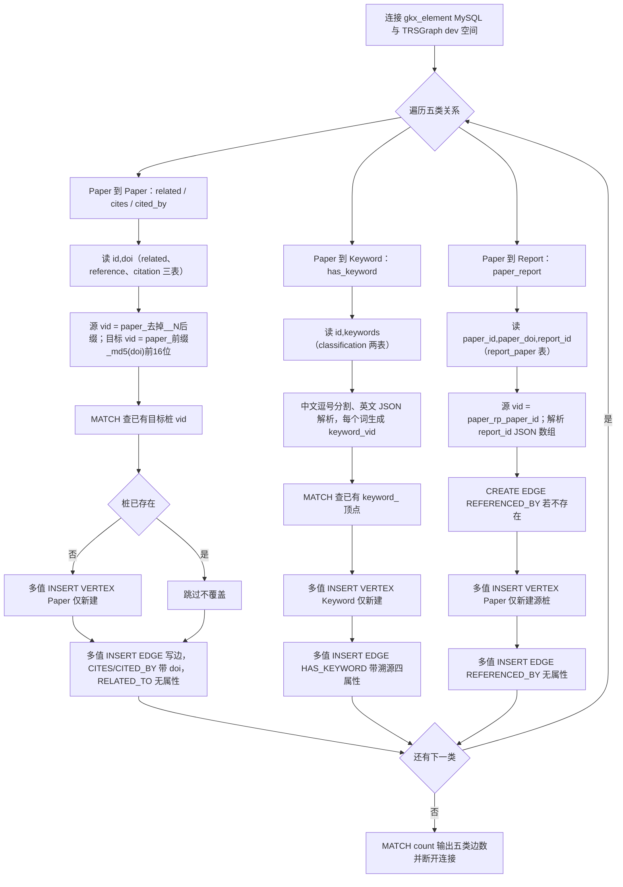

# 论文/期刊 实体关系抽取 ETL

本目录负责「国内外论文、期刊」领域的关系抽取：从 `gkx_element`
要素库的论文关系表抽取「从论文出发」的有向边，INSERT 到 TRSGraph 的 `dev` 图空间，
把已存在的 Paper 实体（及其它实体）联系起来。

> 任务要求（`task.md`）：trsgraph 边都是有向边，每人只做从自己负责业务领域出发的关系；、
> 先直接抽实体和关系，不用管对齐和消歧；流程图用 mermaid。
> 期刊（Journal）在本体中没有出边（只作为 `PUBLISHED_IN` 的目标端），故本任务不涉及 Journal 出边。

## 抽取的关系

均为 **从论文出发** 的有向边，覆盖论文到任意实体类型：

| 边类型 | 方向 | 含义 | 源表 | 边属性 |
|---|---|---|---|---|
| `RELATED_TO` | Paper→Paper | 相关论文 | `dwd_zh_paper_related` / `dwd_en_paper_related` | 无 |
| `CITES` | Paper→Paper | 参考文献 | `dwd_zh_paper_reference` / `dwd_en_paper_reference` | `reference_identifier`=doi |
| `CITED_BY` | Paper→Paper | 被引论文 | `dwd_zh_paper_citation` / `dwd_en_paper_citation` | `citation_identifier`=doi |
| `HAS_KEYWORD` | Paper→Keyword | 关键词 | `dwd_zh_paper_classification` / `dwd_en_paper_classification` | 溯源四件套 |
| `REFERENCED_BY` | Paper→Report | 论文被报告引用 | `dwd_zh_report_paper` | 无（新建边类型） |

另：`AUTHORED_BY`(Paper→Person)、`PUBLISHED_IN`(Paper→Journal) 由 0721 实体抽取任务已建立，本任务不重复。

## 边含义说明

- **RELATED_TO（Paper→Paper，相关论文）**
  源论文与另一篇论文存在「相关」关系（同主题/同研究方向/同系列工作，但非直接引用）。
  来源表 `dwd_zh/en_paper_related` 每行表示「论文 id 相关于 doi 指向的论文」。
  无属性；目标论文多数不在库内，建占位桩。例：论文 A 相关于论文 B → `paper_A` -[:RELATED_TO]-> `paper_rel_{md5(B的doi)}`。

- **CITES（Paper→Paper，参考文献）**
  源论文在参考文献列表中引用了目标论文。来源表 `dwd_zh/en_paper_reference` 每行表示「论文 id 引用了 doi 指向的文献」。
  边属性 `reference_identifier` 存被引文献的 doi；目标文献多数不在库内，建占位桩 `paper_ref_{md5(doi)[:16]}`。
  例：论文 A 引用了文献 B → `paper_A` -[:CITES {reference_identifier:"10.xxx"}]-> `paper_ref_{md5("10.xxx")[:16]}`。

- **CITED_BY（Paper→Paper，被引论文）**
  源论文被目标论文引用（与 CITES 互为反向，但均按「从论文出发」建模：A 被 B 引用 → A 出 CITED_BY 边指向 B）。
  来源表 `dwd_zh/en_paper_citation` 每行表示「论文 id 被 doi 指向的论文引用」。
  边属性 `citation_identifier` 存施引论文的 doi；目标多数不在库内，建占位桩 `paper_cit_{md5(doi)[:16]}`。

- **HAS_KEYWORD（Paper→Keyword，关键词）**
  源论文标注了某个关键词/主题词。来源表 `dwd_zh/en_paper_classification` 的 `keywords` 字段
  （中文逗号分隔、英文 JSON 数组）展开为每个词一条边。关键词建模为 `Keyword` 顶点以支撑跨论文主题聚合。
  边带溯源四属性（source_table/source_record_id/ingest_batch/ingest_time），与 dev 已有 HAS_KEYWORD schema 一致。
  例：论文 A 标注关键词「深度学习」→ `paper_A` -[:HAS_KEYWORD]-> `keyword_{md5("深度学习")}`。

- **REFERENCED_BY（Paper→Report，论文被报告引用）**
  源论文被某篇科技报告引用/收录。来源表 `dwd_zh_report_paper` 每行表示「某 paper（按 doi/paper_id 标识）
  出现在 report_id 指向的报告的参考文献中」；`report_id` 为 JSON 数组，展开为每个报告一条边。
  目标 `report_{uuid}` 为已入图的 Report 实体（不触碰）；源 paper 不在库内（`dwd_zh_report_paper.paper_doi`
  抽样 0/12806 命中已入图论文），故建占位源桩 `paper_rp_{paper_id}`（属性 doi+source=report_paper）。
  本任务新建的边类型，无属性。例：论文 P 被报告 R 引用 → `paper_rp_{P的hash}` -[:REFERENCED_BY]-> `report_{R的uuid}`。

## 未抽取（已知限制）

- **OUTPUT_OF（Paper→Project）**：干净关联表 `dwd_rel_project_paper` 在 `gkx_element` 中不存在；
  唯一可推导的源 `dwd_zh/en_project_output.output_journal_articles`（JSON）只含 title/authors/journal、
  无 paper id 或 doi，且抽样 200 个标题精确匹配论文库命中 **0/200**——产出论文不在已入图论文集合内，
  按任务「不对齐消歧」约束无法连到已有 Paper 实体，故不建。
- **Paper→资助方**：`dwd_zh/en_paper_funding.funds` 为自由文本致谢，无结构化资助方 id，
  本体亦无对应边，不抽取。

## VID 与属性约定（与 dev 已有数据保持一致）

- **源端**：`paper_{id}`，id 去掉关系表行号后缀 `__N`（关系表 id 形如 `1002153099575427075__0`，
  真实论文 id 是前缀），连到真实 Paper 顶点。
- **Paper→Paper 目标桩**：`paper_{ref|cit|rel}_{md5(doi)[:16]}`，与 0721 既有 CITES/CITED_BY 桩一致
  （16 字符 md5），属性 `doi` + `source`(reference/citation/related)。
- **Keyword**：`keyword_{md5(keyword)}`（32 字符，与已有 Keyword 顶点一致），属性 `keyword`。
- **Paper→Report 源桩**：`paper_rp_{paper_id}`（`dwd_zh_report_paper.paper_id` 本身是 md5 哈希，
  与真实论文 `paper_{numeric_id}` 命名空间隔离），属性 `doi`+`source=report_paper`；
  目标 `report_{uuid}` 已存在，不触碰。
- **边属性**：只写该边类型 schema 中已存在的列，不 ALTER 已有边；`REFERENCED_BY` 为本任务新建边类型（无属性）。

## 安全约束

1. 只 INSERT / UPSERT / CREATE，绝不 DELETE 或 ALTER 已有点边或 schema。
2. 建桩前先 `MATCH` 查出已存在的目标 vid 集合，只对「不存在」的顶点做 INSERT VERTEX，
   已有顶点一律跳过（连属性都不覆盖），彻底避免修改既有数据。
3. 边用多值 `INSERT EDGE`（rank@0，与 0721 既有 CITES 一致），同 (src,dst,@0) 重复插入为幂等覆盖，
   脚本可安全重复执行。

## 运行方式

```bash
cd backend
PYTHONPATH=. .venv/bin/python script/paper_journal_relation/load_paper_relation.py
```

可选环境变量：

| 变量 | 默认 | 说明 |
|---|---|---|
| `PAPER_LIMIT` | 空(全量) | 限制每张表抽取行数，调试用 |
| `BATCH_SIZE` | 500 | 单条 nGQL 多值 INSERT 的批量 |
| `MAX_WORKERS` | 8 | 并发线程数 |
| `RELATION_TYPES` | 空(全跑) | 逗号分隔：`related,cites,cited_by,has_keyword,paper_report` |

## 抽取结果（dev 空间，MATCH 实测，distinct 关系数）

| 边类型 | 源表行数 | distinct 关系数 | 覆盖 |
|---|---|---|---|
| `RELATED_TO` | 79640 | 79319 | ✅ |
| `CITES` | 90008 | 89979 | ✅ |
| `CITED_BY` | 2549 | 2548 | ✅ |
| `HAS_KEYWORD` | ~4000 行展开 | ~20000（+项目域 10249） | ✅ |
| `REFERENCED_BY` | 12806 | 12713（93 行 report_id 为空跳过） | ✅ |

> distinct 数与源表行数的差额均为源表自身重复行合并，非漏导。

## ⚠ dev 空间当前状态说明

开发过程中一次脚本重写曾误把 Paper→Paper 目标 vid 改为 32 字符 md5，全量重跑后给每条 Paper→Paper
关系多建了一套 32 字符桩 + 32 字符边，导致 `RELATED_TO`/`CITES`/`CITED_BY` **边数翻倍**（16 字符正确集
+ 32 字符重复集各一份）。脚本现已修正回 16 字符 md5，**再运行为幂等、不会继续新增重复**。
`HAS_KEYWORD`/`REFERENCED_BY` 不受影响（vid 一致，未翻倍）。

如需清除 32 字符重复集（vid 长度 42，前缀 `paper_ref_`/`paper_cit_`/`paper_rel_`，与 16 字符集长度 26
隔离），可对这批顶点执行 `DELETE VERTEX ... WITH EDGE`（仅删 32 字符桩，不动 16 字符既有数据）。

## 脚本流程图




## 字段映射（源表 → 边/桩）

| 源表字段 | 映射目标 |
|---|---|
| `id`（去 `__N` 后缀） | 源端 Paper vid `paper_{id}` |
| `doi`（reference/citation/related） | 目标桩 vid `paper_{前缀}_{md5(doi)[:16]}`；CITES→`reference_identifier`；CITED_BY→`citation_identifier` |
| `keywords`（classification） | UNWIND 每个词 → Keyword vid `keyword_{md5(词)}` + HAS_KEYWORD 边 |
| `paper_id` / `paper_doi` / `report_id`（report_paper） | 源桩 `paper_rp_{paper_id}`(doi=paper_doi)；目标 `report_{uuid}`；REFERENCED_BY 边 |
