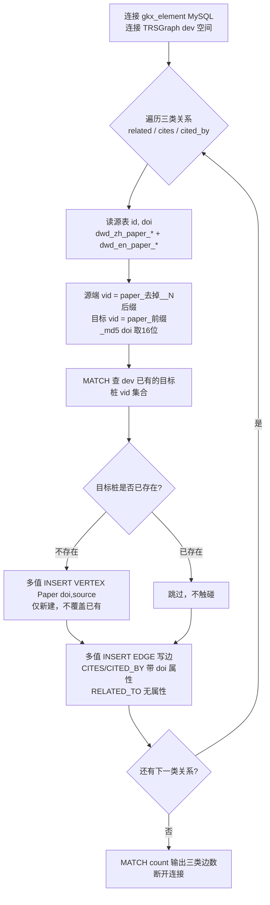

# 论文/期刊 实体关系抽取 ETL

本目录负责 **0725 关系抽取任务** 中「国内外论文、期刊」领域的关系抽取：从 `gkx_element`
要素库的论文关系表抽取「从论文出发」的有向边，INSERT 到 TRSGraph 的 `dev` 图空间，
把已存在的 Paper 实体联系起来。

> 任务要求（`task.md`）：trsgraph 边都是有向边，每人只做从自己负责业务领域出发的关系；
> 不用直接用 nebula3 python sdk，使用亚涛封装的 `infra.graph_db.get_trs_graph_client`；
> 先直接抽实体和关系，不用管对齐和消歧；流程图用 mermaid。

## 抽取的关系

均为 **Paper → Paper**（从论文出发）：

| 边类型 | 含义 | 源表 | 边属性 | 目标桩 source |
|---|---|---|---|---|
| `RELATED_TO` | 相关论文 | `dwd_zh_paper_related` / `dwd_en_paper_related` | 无 | `related` |
| `CITES` | 参考文献 | `dwd_zh_paper_reference` / `dwd_en_paper_reference` | `reference_identifier` = doi | `reference` |
| `CITED_BY` | 被引论文 | `dwd_zh_paper_citation` / `dwd_en_paper_citation` | `citation_identifier` = doi | `citation` |

期刊（Journal）在本体中没有「从期刊出发」的有向边（期刊是 `PUBLISHED_IN` 的目标端），
故本任务不涉及 Journal 出边。

## VID 与属性约定

- **源端**：`paper_{id}`。关系表 `id` 形如 `1002153099575427075__0`（带行号后缀 `__N`），
  脚本用正则 `__\d+$` 去掉后缀，得到真实论文 id，连到 dev 中已存在的 Paper 顶点。
- **目标端**：`paper_{ref|cit|rel}_{md5(doi)[:16]}`。目标论文多数不在库内，按本体设计
  「先直接抽、不对齐消歧」建占位 Paper 桩，属性仅 `doi` + `source`。
  桩 vid 用独立前缀命名空间，与真实论文 `paper_{id}` 隔离，绝不覆盖真实 Paper。
- **边属性**：只写该边类型在 schema 中已存在的列（`reference_identifier` /
  `citation_identifier`），RELATED_TO 无属性。不 ALTER EDGE。

## 安全约束

1. **只 INSERT / UPSERT，绝不 DELETE / ALTER** 已有点边或 schema。
2. 写边前先 `MATCH` 查出已存在的目标桩 vid 集合，**只对不存在的桩做 INSERT VERTEX**，
   已有桩一律跳过（连属性都不覆盖），彻底避免修改既有数据。
3. 边用多值 `INSERT EDGE`（rank `@0`），同 `(src, dst, @0)` 重复插入为幂等覆盖，
   属性值相同不丢数据——脚本可安全重复执行。

## 运行方式

```bash
cd backend
PYTHONPATH=. .venv/bin/python script/paper_journal_relation/load_paper_relation.py
```

可选环境变量：

| 变量 | 默认 | 说明 |
|---|---|---|
| `PAPER_LIMIT` | 空(全量) | 限制每张表抽取行数，调试用 |
| `BATCH_SIZE` | 500 | 单条 nGQL 多值 INSERT 的批量 |
| `MAX_WORKERS` | 8 | 并发线程数 |
| `RELATION_TYPES` | 空(全跑) | 逗号分隔：`related,cites,cited_by` |

## 抽取结果（dev 空间，MATCH 实测）

| 边类型 | 抽取前 | 抽取后 |
|---|---|---|
| `RELATED_TO` | 0 | 79319 |
| `CITES` | 23019 | 89979 |
| `CITED_BY` | 100 | 2548 |

既有边 `AUTHORED_BY`(21030) / `PUBLISHED_IN`(2276) 抽取前后数量不变，未被触碰。

## 脚本流程图



## 字段映射（源表 → 边）

| 源表字段 | 映射目标 |
|---|---|
| `id`（去 `__N` 后缀） | 源端 Paper vid `paper_{id}` |
| `doi` | 目标桩 vid `paper_{前缀}_{md5(doi)[:16]}`；CITES→`reference_identifier`；CITED_BY→`citation_identifier` |
| （无对应字段） | 目标桩 `Paper.source` = reference/citation/related |

## 已知限制

- 目标论文多数不在库内，仅建占位桩（`doi`+`source`），未做 DOI 对齐消歧（按任务要求）。
  后续若需对齐，可用 `SAME_AS` 边把占位桩与真实 Paper 合并。
- 源端论文 id 去后缀后仍有少数不在 dev 已加载 Paper 集合中（源表覆盖范围大于已入图论文），
  这些边源端会指向尚不存在的顶点，待论文实体补齐后自动连通。
- `CITES` 的中文参考文献（23019 条）由上一阶段 0721 实体抽取任务已加载，本脚本幂等覆盖，
  新增的是英文参考文献（66989 条）。
