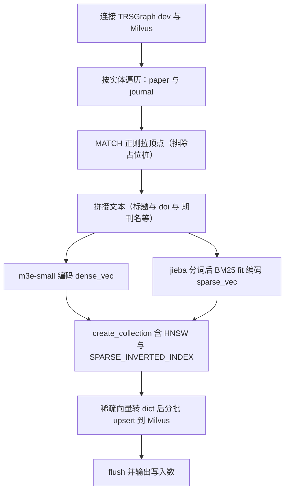
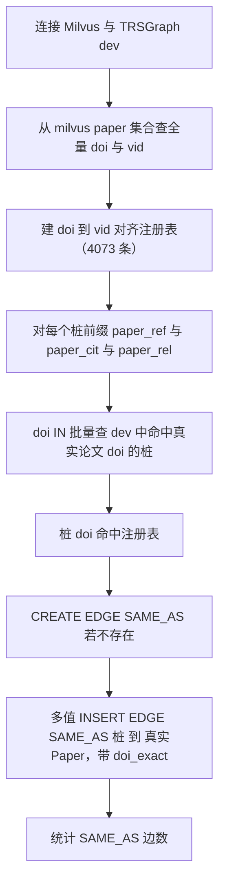

# 论文/期刊 Milvus 索引与对齐补关系


1. 用 Milvus 为 dev 图空间中的 Paper、Journal 实体建立索引（BM25 稀疏 + m3e-small 稠密 + 混合检索）。
2. 用 Milvus `paper` 集合作 doi→vid 注册表，对 0725 留下的占位桩做精确 doi 对齐，建 SAME_AS 边补齐需要对齐才能建立的关系。

> 任务要求（`task.md`）：为每个实体建索引；补齐需要实体对齐/消歧才能建立的关系；
> 不直接用 nebula3 sdk，使用 `infra.graph_db.TRSGraphClient`；mermaid 画流程图或序列图。
> Milvus 由 PR#54 在 211 以 docker standalone 部署（端口 19530/19531）。

## 文件

| 文件 | 作用 |
|---|---|
| `build_paper_journal_milvus_index.py` | 从 dev 拉 Paper/Journal 顶点，建 `paper`、`journal` 两个 Milvus collection（BM25 + 稠密 + 混合索引） |
| `align_paper_relations.py` | 用 milvus paper 集合的 doi→vid 注册表，把占位桩按 doi 精确对齐到真实 Paper，建 SAME_AS 边 |
| `milvus.py` | Milvus 客户端进程单例（读 `MILVUS_URI` 等环境变量，本目录自包含） |

## 一、Milvus 索引设计

为 Paper、Journal 各建一个 collection，字段 = 主键 vid + 业务属性 + 拼接文本 + 稠密向量 + 稀疏向量。

### paper 集合

- 数据源：dev 中真实 Paper 顶点（vid `paper_{numeric_id}`，正则排除 `paper_ref_/paper_cit_/paper_rel_/paper_rp_` 占位桩），共 **4073** 个。
- 拼接文本：`title_zh｜title_en｜doi｜期刊｜年份`（摘要未入图，不纳入）。
- 字段：`vid`(PK)、`paper_id`、`title_zh`、`title_en`、`doi`、`text`、`dense_vec`、`sparse_vec`。
- 索引：
  - `dense_vec` FLOAT_VECTOR(512d, m3e-small)，HNSW / COSINE
  - `sparse_vec` SPARSE_FLOAT_VECTOR，SPARSE_INVERTED_INDEX / BM25（jieba 中文分词, k1=1.5, b=0.75）

### journal 集合

- 数据源：dev 中 Journal 顶点（vid `journal_{id}`），共 **2000** 个。
- 拼接文本：`name_zh｜name_en｜缩写｜issn｜eissn｜国家`。
- 字段：`vid`(PK)、`journal_id`、`name_zh`、`name_en`、`issn`、`text`、`dense_vec`、`sparse_vec`。
- 索引：同 paper（HNSW/COSINE + SPARSE_INVERTED_INDEX/BM25）。

> BM25 稀疏编码用 jieba 自定义分析器（不依赖 nltk 语料数据，避免离线环境下载失败）。
> 稀疏向量以 `{col_index: value}` dict 形式 upsert（pymilvus 2.4 要求）。

## 二、对齐补关系：SAME_AS（占位桩 → 真实 Paper）

### 背景

CITES/CITED_BY/RELATED_TO 的目标论文未做对齐，目标不在库内时建了占位桩
（`paper_ref_/paper_cit_/paper_rel_`）。其中一部分桩的 doi 实际命中了库内真实 Paper——
本任务用 Milvus `paper` 集合的 doi→vid 注册表做精确 doi 对齐，建 SAME_AS 边把占位桩与真实实体对齐。

### 为何用 doi 精确匹配而非 m3e 语义检索

项目产出/报告引用的论文与我们的论文库几乎不重叠（标题精确 0/200、fuzzy 0/390 命中），
m3e 语义 top-1 余弦普遍 0.85-0.9 但命中的是「主题相近的不同篇」，会产生误对齐。
doi 精确匹配只放行真同一篇，是可靠的对齐信号。

### 对齐流程

1. 从 Milvus `paper` 集合分页查全量 (doi, vid) 建 doi→vid 注册表（4073 条）。
2. 对每个桩前缀（paper_ref/paper_cit/paper_rel），用 `doi IN [batch]` 批量查 dev 中命中真实论文 doi 的桩。
3. 桩 doi 命中 → 建 SAME_AS 边 `桩 -> 真实 Paper`，属性：`confidence=1.0`、`match_method=doi_exact`、`source_table=stub_doi_align`、溯源四件套。
4. SAME_AS 为本任务新建边类型；使用 `infra.graph_db.TRSGraphClient` 多值 INSERT EDGE（rank@0 幂等）。

### 安全约束

- 只 CREATE EDGE / INSERT EDGE，绝不 DELETE/ALTER 已有数据；SAME_AS 为新建边类型。
- 既有 CITES/RELATED_TO/AUTHORED_BY 等边数量不变，未被触碰。

## 运行方式

> 这两个脚本的依赖（pymilvus[model]、sentence-transformers，会拉 torch）在 `[project.optional-dependencies] milvus` 里，**CI 默认不装**。跑脚本前先装：
> `uv sync --extra milvus`（首次还会下载 m3e-small 模型 ~100MB）。

```bash
cd backend
uv sync --extra milvus   # 装脚本依赖（torch 等）

# 1) 建 Milvus 索引（首次下载 m3e-small ~100MB）
MILVUS_URI=http://127.0.0.1:19530 \
TRS_GRAPH_BASE_URL=http://127.0.0.1:8090 TRS_GRAPH_SPACE=dev TRS_GRAPH_API_KEY=ysukeg \
  uv run python -m script.paper_milvus.build_paper_journal_milvus_index --drop-existing

# 2) 对齐补 SAME_AS（先 dry-run 看匹配）
MILVUS_URI=http://127.0.0.1:19530 \
TRS_GRAPH_BASE_URL=http://127.0.0.1:8090 TRS_GRAPH_SPACE=dev TRS_GRAPH_API_KEY=ysukeg \
  uv run python -m script.paper_milvus.align_paper_relations --dry-run
# 满意后去掉 --dry-run 真正写边
```

可选环境变量：`MILVUS_URI`、`MILVUS_DB_NAME`、`PAPER_DENSE_MODEL`(默认 moka-ai/m3e-small)、`PAPER_DENSE_DEVICE`(默认 cpu)。

## 抽取结果（dev 空间实测）

| 项目 | 结果 |
|---|---|
| `paper` collection | 4073 条（真实 Paper） |
| `journal` collection | 2000 条 |
| SAME_AS 边（新建） | **518 条**（paper_ref 桩 48 + paper_rel 桩 470；paper_cit 0） |
| 既有边 CITES/RELATED_TO/AUTHORED_BY | 数量不变，未受影响 |

## 索引构建流程图



## SAME_AS 对齐流程图



## 已知限制

- **OUTPUT_OF（Paper→Project）**：曾尝试用 milvus 混合检索把 `dwd_zh/en_project_output.output_journal_articles`
  的论文标题语义对齐到真实 Paper，但项目产出论文与论文库几乎不重叠（标题精确 0/200、fuzzy 0/390 命中），
  m3e 语义 top-1 余弦 0.85-0.9 命中的是「主题相近的不同篇」，强行建边会误对齐，故不建。
  待论文库覆盖到项目产出论文后可再启用语义对齐。
- Paper 摘要未入图（在 `dwd_zh/en_paper_abstract` 表，未加载到 Paper 顶点属性），索引文本不含摘要；
  如需可后续补摘要属性后重建。
- 占位桩含 0725 历史遗留的 16/32 字符 md5 重复变体，两者 doi 相同，均会各自建 SAME_AS 指向同一真实论文（符合预期）。
- CITES/CITED_BY/RELATED_TO 占位桩中仅 doi 命中真实论文的建了 SAME_AS；其余桩 doi 在库内无对应真实论文，不处理。
