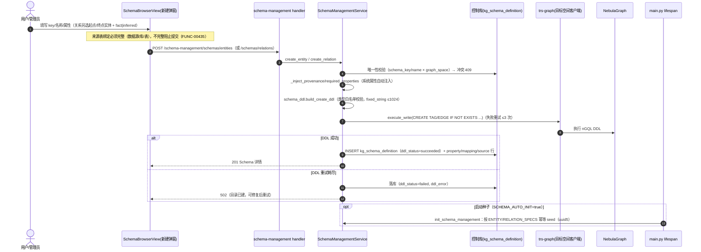
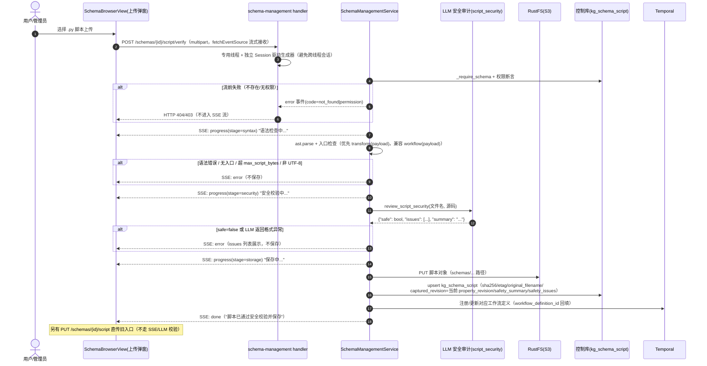
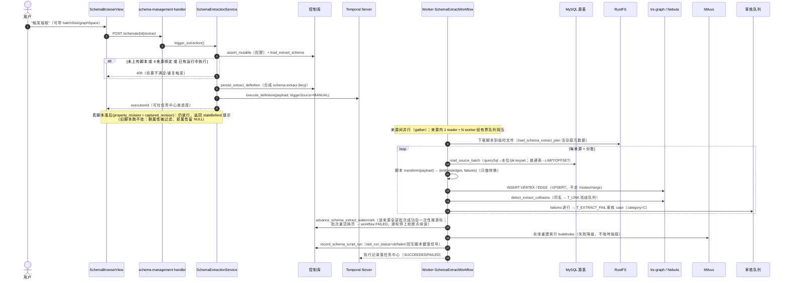
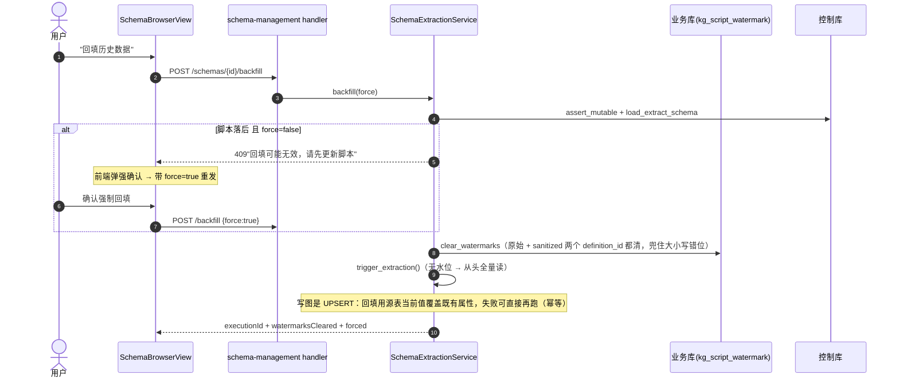
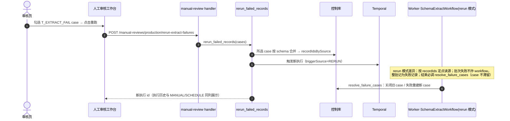

# Schema 管理模块（代码结构 / 表结构 / 功能说明）

> 前端路由 `/schema`（`SchemaBrowserView`，`meta.admin: true`）；API 前缀 `/api/v1/schema-management`，注册在 **admin 路由组**（`require_authenticated_user` + `require_platform_admin`）。
> 关联文档：`docs/schema_storage_tables.md`（表 DDL 从 dev2 控制库导出）；CLAUDE.md「平台喂数批次抽取」节；e2e 驱动脚本 `dev2_extract_e2e.py`。

## 一、功能描述

Schema 管理是图谱构建的**元数据中枢**：定义实体/关系结构（Nebula TAG/EDGE 的镜像目录）→ 绑定数据来源 → 挂抽取脚本 → 触发平台喂数抽取，一条链路全部从这个页面出发。

### 1. Schema 目录（元数据 CRUD）

- **实体（kind=entity → Nebula TAG）/ 关系（kind=relation → EDGE）**，按 **图空间隔离**（`graph_space` 列，默认 `TRS_GRAPH_SPACE`，创建时可显式指定；`(schema_key, graph_space)`、`(name, graph_space)` 唯一）。
- **创建即在目标图空间真实执行 DDL**（`service/schema_ddl.py`）：`CREATE TAG/EDGE IF NOT EXISTS`，数据类型白名单校验（`string/int64/double/bool/date/datetime/geo` + `fixed_string(n≤1024)`），DDL 失败重试 3 次（DDL 后的 schema 传播延迟是已知问题）。
- 关系定义带**起点/终点实体**（`source_schema_id`/`target_schema_id`，FK **RESTRICT**——被关系引用的实体不能删）、`relation_category`（fact 事实关系 / inferred 推理关系）、起点/终点表达式。
- 属性带约束：数据类型、required、rule、category（core/…）、position；**provenance / required 系统属性自动注入**（`_inject_*`）。
- **属性生命周期**：加属性 → 目录插入 + `property_revision` +1 + 图库 `ALTER TAG/EDGE ADD`；删属性 → 目录**硬删行** + 图库 `ALTER DROP`（属性软删已退役，列仅为兼容保留）。
- **目录假删**：删 Schema 置 `is_deleted` 并改写 key/name 释放唯一键，允许同名重建；被关系引用时阻止删除。
- **系统 Schema 目录种子**：`SCHEMA_AUTO_INIT=true` 时启动 seed（Expert/Organization/Paper/Project/Patent…，`script/init_schema_management.py` + `service/schema_catalog_seed.py`，uuid5 确定性 id 支持幂等重跑）。
- **拓扑总览**：`GET /schemas/topology` 返回实体-关系-实体的元图谱，前端 vue-flow 渲染。

### 2. 来源表绑定（kg_schema_source）

- 实体/关系都可绑定**多张 MySQL 来源表**：`datasource_id`（指向配置管理的 `platform_mysql_datasource`）+ 库名 + 表名 + pk 列 + 时间列 + 可选 `query_sql`（复杂 SQL 走该列）。
- 每张表**独立水位**，可并行抽取；绑定必须完整（数据源/库/表），不完整阻止提交（FUNC-00435）。

### 3. 抽取脚本管理（kg_schema_script + S3）

- 上传 `.py` 脚本：大小上限（`max_script_bytes`）、UTF-8（含 BOM 容忍）、`ast.parse` 语法检查、**必须有 `transform(payload)` 入口**（旧 `workflow(payload)` 兼容）——脚本只做"接收行数据 → 输出 `{entities|edges, failures}` JSON"的纯转换。
- **LLM 安全校验**（`service/script_security.py`）：审计危险 import/eval/exec/网络/文件越界/混淆代码，判定纯计算变换才放行；结论（safe/issues/summary）落库到脚本的 `safety_summary`/`safety_issues`。
- **SSE 流式上传校验**：`POST /schemas/{id}/script/verify` 边校验边推 `progress`/`error` 事件（前端走 `fetchEventSource`，支持 POST + 流式，不能用 axios）；流前失败（不存在/无权限）映射 HTTP 4xx，流中失败发 `type=error` 事件；整个流程在专用线程 + 独立 Session 中驱动（避免跨线程会话）。
- 脚本本体存 **S3/RustFS**（`SCHEMA_S3_*` 配置），MySQL 只存元数据（bucket/object_key/sha256/etag/original_filename/size）；下载回放带 `X-Content-SHA256` 校验头。
- **单一执行通道**（原"两个化身"已收敛，2026-09-14 D1）：脚本只存 **S3 一份副本**，由 `kg.schema.extract` 合成定义执行时由 worker 下载到临时文件调 `transform(payload)`。历史上的 kg.custom.python 化身（`_register_workflow` → `create_python_definition` 注册 `schema-{safe_key}` 定义）已删除；`kg_schema_script.workflow_definition_id` 列保留做兼容、恒为 NULL。注意 `kg.custom.steps` 是工作流系统自身的多步流水线上传，与 Schema 脚本无关。
- **脚本落后判定**：上传时快照 `captured_revision`，落后于当前 `property_revision` 即"脚本未覆盖最新属性"——触发抽取时提示、回填时需强确认（`force`）。

### 4. 平台喂数抽取（kg.schema.extract Temporal 工作流）

- **触发**（`POST /{id}/extract`）：要求已上传脚本 + ≥1 来源绑定，否则 409；由 schema 定义**合成** workflow definition（`schema-extract-{key}`，worker 端 activity 从 S3 下载脚本本体）。
- **读取模式**：querySql 绑定走水位/pk keyset 游标（合成唯一 pk）；普通表走 LIMIT/OFFSET。
- **写图必须走 nGQL `INSERT VERTEX`**（trs-graph `/nodes/merge` 会把 id/name/vid 从属性剥离，DDL 的 NOT NULL id/name 会 400）；同名冲突检测（消歧）；实体重建 Milvus 索引失败降级不拖垮抽取；逐行失败落 **T_EXTRACT_FAIL** 审核 case（队列 category=C）。
- **失败重跑**：`POST /manual-reviews/production/rerun-extract-failures` → 所选 case 按 schema 合并为新执行，`triggerSource=RERUN`（与 MANUAL/SCHEDULE 同列展示）。
- **回填**（`POST /{id}/backfill`）：清空该 Schema 全部来源水位后全量重跑，可反复执行；脚本落后时未带 `force` 返回 409，前端强确认后重发。
- **水位语义**：`kg_script_watermark` 类比 Kafka consumer offset——step 成功后由 activity 写入，失败不写；`schema_key` 含大写/特殊字符时 definition_id 有原始/sanitized 两个变体，回填两个都清。

### 5. 权限（资源级，在 admin 组之上）

- **系统 Schema**（is_system）：仅平台管理员或 `SCHEMA_ADMIN_USER_IDS` 可改脚本/来源/删除。
- **自建 Schema**：仅创建者（`created_by`）或平台管理员。
- 删除系统 Schema 需显式开关放行（`_allow_system_delete`）。

## 二、代码结构

### 后端

```
backend/
├── biz/handler/schema_management.py     # 16 个端点（含 SSE verify、脚本下载）
├── biz/schemas/schema_management.py     # 请求模型（Entity/RelationSchemaCreate、SourcesReplace、Extract/BackfillRequest…）
├── application/schema_management.py     # 薄门面 SchemaManagementApplication
├── service/
│   ├── schema_management.py             # 核心（~1200 行）：CRUD、假删、属性生命周期、
│   │                                    #   脚本校验保存、权限断言、序列化、并发抽取检测
│   ├── schema_ddl.py                    # nGQL DDL 构建/执行（CREATE/ALTER TAG/EDGE、类型校验、重试）
│   ├── script_security.py               # LLM 安全校验（ScriptSecurityVerdict）
│   ├── schema_extraction.py             # kg.schema.extract 触发/回填/失败重跑（合成 workflow definition）
│   └── schema_catalog_seed.py           # 系统目录种子数据（ENTITY/ATTRIBUTE/FACT/INFERRED_SPECS）
├── dao/schema_management.py             # 查询对象（list/stats/referencing_relations…）
├── db_model/
│   ├── schema_management.py             # 5 张控制表（Base 来自 service/workflow_models → 控制库）
│   └── script_watermark.py              # kg_script_watermark（Base 来自 db_model.base → 业务库！）
├── infra/
│   ├── workflow_mysql.py                # 控制库引擎（WORKFLOW_MYSQL_* → temporal-mysql 的 techkg_control，
│   │                                    #   与业务库 gkx_element 解耦；库不存在自动建）
│   └── s3.py                            # 脚本对象存储（SCHEMA_S3_* → RustFS）
├── script/init_schema_management.py     # 建表 + 种子初始化（可独立运行，也被 SCHEMA_AUTO_INIT 调用）
└── service/temporal_workflows.py        # SchemaExtractWorkflow（执行侧，读源/转换/写图/推游标）
```

### API 一览（`/api/v1/schema-management`，admin 组）

| 端点 | 作用 |
|---|---|
| `GET /overview` | 统计（实体/关系数、脚本覆盖率等，按图空间） |
| `GET /schemas`、`GET /schemas/topology` | 列表（分页/筛选）、元图谱 |
| `GET /schemas/{id}` | 详情（属性/映射/来源/脚本快照/运行状态） |
| `POST /schemas/entities`、`POST /schemas/relations` | 创建（同步执行图库 DDL） |
| `DELETE /schemas/{id}` | 假删（被关系引用 → 409） |
| `POST /schemas/{id}/properties`、`DELETE /schemas/{id}/properties/{name}` | 属性增删（+图库 ALTER、revision+1） |
| `PUT /schemas/{id}/sources` | 替换来源表绑定 |
| `POST /schemas/{id}/extract` | 触发抽取（Temporal） |
| `POST /schemas/{id}/backfill` | 清水位全量重跑（force 强确认） |
| `PUT /schemas/{id}/script` | 直接替换脚本（旧入口） |
| `POST /schemas/{id}/script/verify` | **SSE**：上传→LLM 校验→保存，流式回传 |
| `GET /schemas/{id}/script/content`、`GET /schemas/{id}/script` | 查看/下载脚本 |

领域异常 → HTTP：NotFound 404 / Permission 403 / Conflict 409 / Script 400 / Storage|Ddl 502。

### 前端

```
frontend/src/
├── views/platform/SchemaBrowserView.vue   # ~1600 行：实体/关系两个 tab + 拓扑总览（vue-flow）
│                                          #   + 新建/详情/属性/来源表/上传脚本（SSE 进度）/查看脚本弹窗
│                                          #   + 触发抽取/回填（staleBehind 强确认）
└── api/schemaManagement.ts                # ~540 行：全部 API client；SSE 走 @microsoft/fetch-event-source
                                           #   （支持 POST + 自定义头 + 流式，axios 不支持）
```

## 三、表结构

**双库架构**：schema 目录/脚本元数据/来源绑定在**控制库**（`WORKFLOW_MYSQL_DATABASE`，dev2 为 `techkg_control`，跑在 temporal-mysql 上，与业务库解耦——schema 不耦合、备份不耦合）；抽取**水位在业务库**（`kg_script_watermark`，随 main.py 建表清单创建）。

```
kg_schema_definition（控制库，1 行 = 1 个 schema）
 ├── kg_schema_property   1:N  属性与约束（硬删除）
 ├── kg_schema_mapping    1:N  来源对象映射（展示用）
 ├── kg_schema_script     1:1  抽取脚本元数据（本体在 S3/RustFS）
 └── kg_schema_source     1:N  来源表绑定（每表独立水位）
      自引用 source/target_schema_id → kg_schema_definition.id（RESTRICT）
kg_script_watermark（业务库，definition_id+step_id 主键）
```

### kg_schema_definition（核心列）

| 列 | 说明 |
|---|---|
| id / schema_key / name / label / kind | kind: entity/relation |
| graph_space | 归属图空间（DDL 在该空间执行，同名 schema 可在不同空间）；与 key/name 组成两个唯一键 |
| identity_key / attribute_identity_key / attribute_source | 身份键与属性来源描述 |
| instance_count / version / display_order / is_core | 展示与统计 |
| relation_category / source_schema_id / target_schema_id / source_expression / target_expression | 仅关系：fact/inferred、起止实体（RESTRICT FK）、表达式 |
| llm_config_id | 作业默认 LLM 配置（软关联 `platform_llm_config.id`，接配置管理） |
| ddl_statement / ddl_status / ddl_error / ddl_executed_at | 图库 DDL 执行状态（pending/succeeded/failed/skipped） |
| property_revision | 属性修订号（增/删 +1），与脚本 captured_revision 比对判"脚本落后" |
| is_deleted / deleted_at | 目录假删（改写 key/name 释放唯一键） |
| created_by / is_system | 权限判定（系统 Schema 仅管理员） |

索引：`(kind, created_at)`、`(graph_space)`；唯一：`(schema_key, graph_space)`、`(name, graph_space)`。

### kg_schema_property / kg_schema_mapping / kg_schema_script / kg_schema_source

- **property**：schema_id FK CASCADE、name、data_type、required、rule、category、position、UNIQUE(schema_id, name)。
- **mapping**：schema_id FK CASCADE、source_name（来源对象名，展示用）、position、UNIQUE(schema_id, source_name)。
- **script**：schema_id FK CASCADE（1:1）、bucket/object_key/original_filename/content_type/size_bytes/etag/**sha256**、uploaded_by、workflow_definition_id/function_name（工作流注册回填）、**captured_revision**（上传时快照）、last_run_status（none/ok/failed，抽取收尾回写）/last_run_error、safety_summary/safety_issues（LLM 审计结论）。
- **source**：schema_id FK CASCADE、datasource_id（→配置管理）、database_name/table_name、pk_column（默认 id）/time_column（默认 update_time）、query_sql（复杂 SQL）、position、UNIQUE(schema_id, datasource_id, database_name, table_name)。

### kg_script_watermark（业务库）

| 列 | 说明 |
|---|---|
| definition_id + step_id | 联合主键（step 默认 `_default`） |
| watermark | 上次成功运行的时间游标 |
| checkpoint (JSON) | keyset 检查点（类比 Kafka offset / Debezium lsn） |
| updated_at | |

## 四、关键机制小结

- **三态一致性**：MySQL 目录 ↔ Nebula 图结构（DDL 同步执行/ALTER）↔ S3 脚本，任何一环失败都有明确的落库状态（ddl_status、last_run_status、safety_*）。
- **并发抽取检测**：`find_running_execution` 阻止同一 Schema 重复触发（判定"实际运行中"而非仅看记录状态）。
- **脚本约定**：`transform(payload)` 只输出 `{entities|edges, failures}`；平台负责读源/写图/消歧/索引/游标——脚本零副作用，安全边界靠 LLM 审计 + 入口检查兜底。
- **写图铁律**：实体写图必须 nGQL `INSERT VERTEX`，不走 `/nodes/merge`（id/name/vid 属性剥离问题）。

## 五、工作时序图

### 5.1 创建 Schema（目录 + 图库 DDL 同步）



### 5.2 上传抽取脚本（SSE：语法检查 → LLM 安全校验 → S3 保存）



### 5.3 触发平台喂数抽取（kg.schema.extract）



### 5.4 回填历史数据（清水位全量重跑）



### 5.5 抽取失败记录重跑（T_EXTRACT_FAIL → RERUN）


