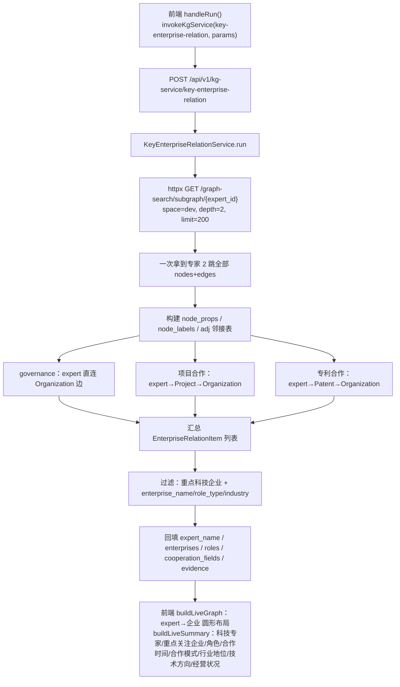
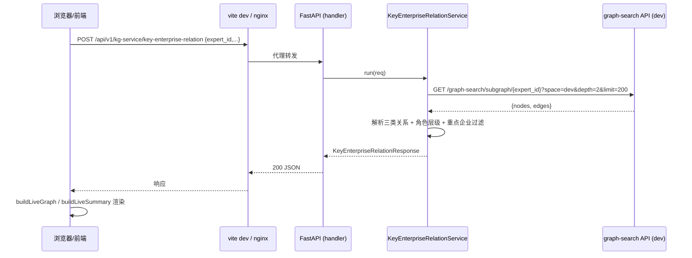
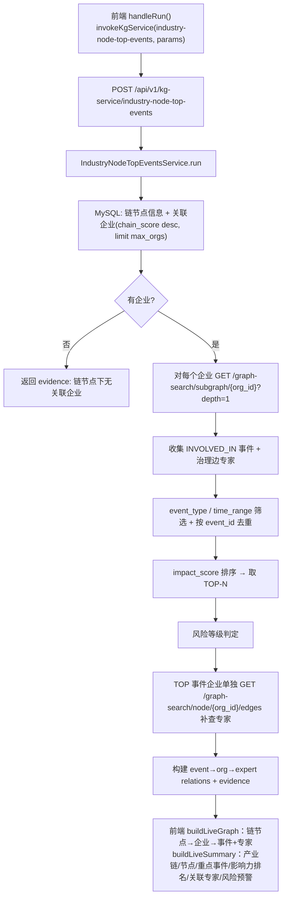
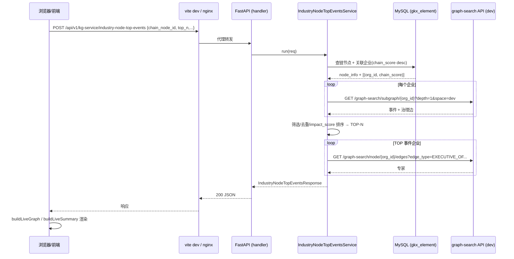
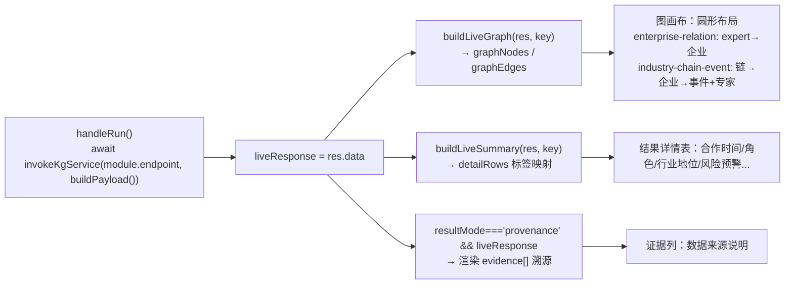

# 重点关注科技企业关系 & 产业链点 TOP-N 事件 业务实现说明

本文档说明「九大业务」中的两个业务服务——**重点关注科技企业关系**（`key-enterprise-relation`）与**科技产业链点 TOP-N 事件关系**（`industry-node-top-events`）——的前后端实现。两个业务共同遵循一条硬约束：

> 业务编排层**只调用 FastAPI 后端暴露的 API**（`/api/v1/graph-search/*` 查图、MySQL ORM 取链节点映射），**不直连 NebulaGraph、不直连图 SDK**。

涉及的图空间固定为 `dev`。

---

## 1. 涉及文件

### 后端（DDD 分层，新增模块）

| 层 | 重点关注科技企业关系 | 产业链点 TOP-N 事件 |
| --- | --- | --- |
| schemas | `backend/biz/schemas/tech_enterprise_relation_business.py` | `backend/biz/schemas/industry_node_top_events_business.py` |
| handler | `backend/biz/handler/tech_enterprise_relation_business.py` | `backend/biz/handler/industry_node_top_events_business.py` |
| service | `backend/service/tech_enterprise_relation_business.py` | `backend/service/industry_node_top_events_business.py` |
| router | `backend/biz/router/register.py`（注册两条 router，挂载于 `/api/v1/kg-service`） | 同左 |

- 端点：`POST /api/v1/kg-service/key-enterprise-relation`、`POST /api/v1/kg-service/industry-node-top-events`，均附带 `GET .../describe`。
- 两个 service 不走 `application/` 层（业务编排直接在 service 内完成），handler 仍是薄壳：解析请求 → 调 service → 返回响应。
- 数据来源：
  - 图：通过 `httpx.AsyncClient` 调本机 FastAPI 的 `graph-search` 端点（`BUSINESS_API_BASE`，默认 `http://127.0.0.1:8000`）。
  - MySQL：`infra/mysql.py` 的 `MySQLClient`，仅 TOP-N 用到（`db_model/industry_chain.py` 的 `DwdIndustryChainInfo` / `DwdOrgIndustryChainDtl`）。

### 前端

| 文件 | 作用 |
| --- | --- |
| `frontend/src/api/kgService.ts` | `invokeKgService(endpoint, params, timeout=60000)`：去掉 `/api` 前缀后走 `http.post`（baseURL `/api`，dev 由 vite 代理）。 |
| `frontend/src/views/business-service/service-modules.ts` | 业务模块契约：`enterprise-relation`（endpoint `/api/v1/kg-service/key-enterprise-relation`）与 `industry-chain-event`（endpoint `/api/v1/kg-service/industry-node-top-events`），含真实可用的 `requestExample`。 |
| `frontend/src/views/business-service/components/BusinessServiceAlgorithmPanel.vue` | 面板：`handleRun()` 调真实 API，`buildLiveGraph()` 渲染图，`buildLiveSummary()` 渲染结果详情，溯源回退渲染 `evidence[]`。 |
| `frontend/vite.config.ts` | `server.host='0.0.0.0'`、`allowedHosts=true`，便于经跳板机/端口转发访问；`/api` 代理到 `VITE_API_TARGET`。 |

---

## 2. 重点关注科技企业关系（key-enterprise-relation）

### 2.1 业务目标

围绕一个**科技专家/人才**，聚合其与**重点关注科技企业**之间的全部关联关系，输出可解释的「专家 ↔ 企业」关系清单，含合作模式、角色定位、角色层级、合作时间、企业背景、数据来源。

### 2.2 三类关系来源

均从专家 2 跳子图内解析，不多次查图：

| 关系类型 | 图路径 | 合作模式 | 合作时间来源 |
| --- | --- | --- | --- |
| governance 治理 | `Person --[EXECUTIVE_OF/LEGAL_REP_OF/ACTUAL_CONTROLLER_OF/BENEFICIAL_OWNER_OF/SHAREHOLDER_OF/AFFILIATED_WITH]--> Organization` | 边类型映射（高管任职/法人代表/实际控制/受益所有/股东持股/任职） | `AFFILIATED_WITH` 取专家 `work_experience_date`，其余无 |
| project_cooperation 项目合作 | `Person --[HAS_PARTICIPANT/LEADS]--> Project --[PARTICIPATES_IN/FUNDED_BY]--> Organization` | 项目合作 | `Project.research_period` / `approval_time` |
| patent_cooperation 专利合作 | `Person --[INVENTED_BY]--> Patent --[APPLIED_BY]--> Organization` | 专利合作 | `Patent.application_date` |

角色层级：`董事长/CEO/法人/控制人/受益/股东 → L1`，`CTO/首席/总工程师/总监/副总 → L2`，`工程师/技术员/主管/经理 → L3`（来自 `position` 边属性 + 边类型）。

重点科技企业筛选：排除高校/研究院/医院/政府/MOCK；命中上市状态/股票代码/公司类名称才保留。支持 `enterprise_name` / `role_type` / `industry` 过滤。

### 2.3 流程图



### 2.4 时序图



---

## 3. 产业链点 TOP-N 事件关系（industry-node-top-events）

### 3.1 业务目标

给定一个**产业链节点**（如 `IC0007007`），找出该节点下重点企业的**高风险/高影响力事件**并做 TOP-N 排名，输出「事件 ↔ 企业 ↔ 专家」关联，给出风险等级与节点影响判断。

### 3.2 数据来源

- **MySQL**（`gkx_element` 库，本地开发统一用此库，`gkx_local` 已废弃）：
  - `dwd_industry_chain_info`：链节点信息（`node_name` / `chain_name` / `node_imp_level`）。
  - `dwd_org_industry_chain_dtl`：链节点→企业映射（`antitypic` 企业外部 ID、`chain_score` 关联强度），按 `chain_score` 降序取 `max_orgs` 家。
  - 仅 select 需要的列，避开 ORM `downstream_lin` 与实际列名 `downstream_link_code` 不一致的旧 bug；排序用 `.desc()`（MySQL 不支持 `NULLS LAST`）。
- **图（dev 空间，经 graph-search API）**：
  - 每个企业 `GET /graph-search/subgraph/{org_id}?depth=1`：取 `INVOLVED_IN` 事件 + 治理边（`EXECUTIVE_OF` 等）关联专家。
  - TOP 事件所在企业 `GET /graph-search/node/{org_id}/edges?edge_type=...&direction=in`：补查治理边取专家（subgraph depth=1 易被事件占满，专家需单独查）。

### 3.3 影响力评分

```
impact_score = EVENT_WEIGHT(event_type)        # 风险类 3.0 / 财务类 2.0 / 其它 1.0~1.5
             × (1 + log10(amount+1)/10)        # 金额因子
             × recency                         # 按年衰减，2026≈1.0
             × (1 + chain_score/100)           # 企业在链上的强度
```

按分数降序取 `top_n`。风险等级：TOP 事件含风险类→高，含财务类→中，否则低。

### 3.4 流程图



### 3.5 时序图



---

## 4. 前端接线总览

`BusinessServiceAlgorithmPanel.vue` 的渲染路径与真实数据对齐：



要点：
- `buildPayload()` 把表单里的数字字段强制转成数字（`top_n` 等）。
- `moduleInfo.key` 变更时重置 `liveResponse`，避免上一业务的图残留。
- 图节点 `relations` 字段、事件置信度（`impact_score/10`）均来自真实响应，不再使用 mock。

---

## 5. 验证

- 单测：`backend/tests/unit/test_tech_enterprise_relation_business_service.py`（mock httpx 子图）、`backend/tests/unit/test_industry_node_top_events_business_service.py`（mock MySQL + httpx）。
- 集成测试：`backend/tests/integration/test_tech_enterprise_relation_business_api.py`、`backend/tests/integration/test_industry_node_top_events_business_api.py`（标 `@pytest.mark.external`，需真实服务）。
- 真实参数示例：重点关注科技企业关系 `expert_id=person_00fdcec8aa4d1ba8554596c3310e36cf`；TOP-N 事件 `chain_node_id=IC0007007, top_n=5`。

> 已知数据缺口：TOP-N 中链节点关联的多为上市公司，`dwd_org_executive_info` 当前仅部分加载，可能导致部分企业查不到治理专家（专家=0），属数据覆盖问题，非脚本 bug。
