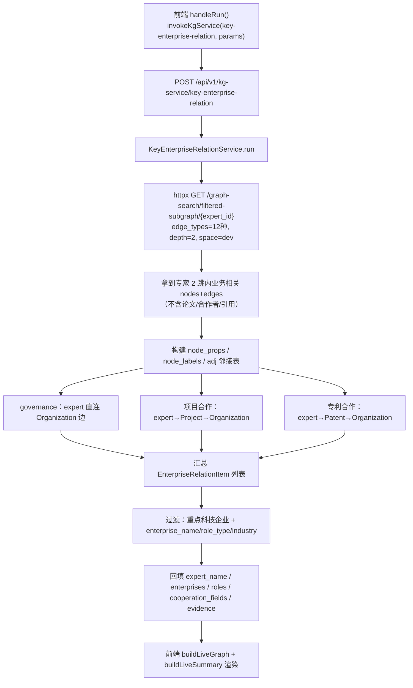
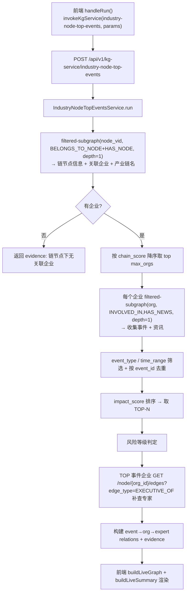
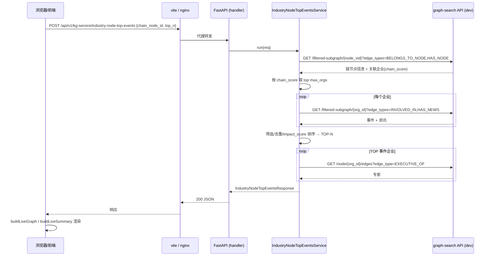

# 重点关注科技企业关系 & 产业链点 TOP-N 事件 业务实现说明

本文档说明「九大业务」中的两个业务服务——**重点关注科技企业关系**（`key-enterprise-relation`）与**科技产业链点 TOP-N 事件关系**（`industry-node-top-events`）——的前后端实现。两个业务共同遵循一条硬约束：

> 业务编排层**只调用 FastAPI 后端暴露的 API**（`/api/v1/graph-search/*` 查图），**不直连 NebulaGraph、不直连图 SDK、不直连 MySQL**。

涉及的图空间固定为 `dev`。

---

## 1. 新增原子能力：filtered-subgraph

两个业务都依赖新增的 `GET /graph-search/filtered-subgraph/{node_id}` 端点（`biz/handler/graph_search.py`）：

- 参数：`edge_types`（逗号分隔多边类型）、`depth`、`direction`、`limit`、`space`。
- 与 `/subgraph` 的区别：支持**多边类型过滤**，每种边类型单独查 NebulaGraph，不互相占 limit 名额，不捞论文/合作者/引用等无关数据。
- 返回与 `/subgraph` 相同的 `{nodes, edges}` 结构。

---

## 2. 涉及文件

### 后端

| 层 | 重点关注科技企业关系 | 产业链点 TOP-N 事件 |
| --- | --- | --- |
| schemas | `biz/schemas/tech_enterprise_relation_business.py` | `biz/schemas/industry_node_top_events_business.py` |
| handler | `biz/handler/tech_enterprise_relation_business.py` | `biz/handler/industry_node_top_events_business.py` |
| service | `service/tech_enterprise_relation_business.py` | `service/industry_node_top_events_business.py` |
| router | `biz/router/register.py`（挂载于 `/api/v1/kg-service`） | 同左 |
| 原子 API | `biz/handler/graph_search.py`（新增 `filtered-subgraph` 端点） | 同左 |

端点：`POST /api/v1/kg-service/key-enterprise-relation`、`POST /api/v1/kg-service/industry-node-top-events`，均附带 `GET` describe。

两个 service 用 `httpx.AsyncClient` 调本机 FastAPI 的 `graph-search` 端点（`BUSINESS_API_BASE`，默认 `http://127.0.0.1:8000`），**不直连图、不直连 MySQL**。

### 前端

| 文件 | 作用 |
| --- | --- |
| `frontend/src/api/kgService.ts` | `invokeKgService(endpoint, params)`：走 `http.post`（baseURL `/api`，dev 由 vite 代理）。 |
| `frontend/src/views/business-service/service-modules.ts` | 业务模块契约，含真实可用的 `requestExample`。 |
| `frontend/src/views/business-service/components/BusinessServiceAlgorithmPanel.vue` | `handleRun()` 调真实 API，`buildLiveGraph()` 渲染图，`buildLiveSummary()` 渲染结果详情，溯源回退渲染 `evidence[]`。 |
| `frontend/vite.config.ts` | `host='0.0.0.0'`、`allowedHosts=true`，便于经跳板机/端口转发访问。 |

### ETL 脚本（数据准备）

| 脚本 | 作用 |
| --- | --- |
| `script/industry_chain_etl/load_industry_chain_graph.py` | 产业链图谱 ETL：建 IndustryChain/IndustryNode tag + HAS_NODE/CHILD_OF/DOWNSTREAM_OF/COVERS_CHAIN edge，从 gkx_element 灌入 180 链节点 + 374 企业关联 + 476 产业资讯。 |
| `script/workflow/paper_journal_chain_etl.py` | 工作流封装脚本（任务二）：论文实体+关系+产业链 ETL 合一，支持增量更新，入口 `workflow(payload)`。 |

---

## 3. 重点关注科技企业关系（key-enterprise-relation）

### 3.1 业务目标

围绕一个**科技专家/人才**，聚合其与**重点关注科技企业**之间的全部关联关系，输出可解释的「专家 ↔ 企业」关系清单，含合作模式、角色定位、角色层级、合作时间、企业背景。

### 3.2 三类关系来源

通过 **filtered-subgraph(depth=2, 12 种边类型)** 一次拿到专家 2 跳内全部业务相关边（不捞论文/合作者/引用），在 Python 内存里分类：

| 关系类型 | 图路径 | 合作模式 | 合作时间来源 |
| --- | --- | --- | --- |
| governance 治理 | `Person --[EXECUTIVE_OF/LEGAL_REP_OF/ACTUAL_CONTROLLER_OF/BENEFICIAL_OWNER_OF/SHAREHOLDER_OF/AFFILIATED_WITH]--> Organization` | 边类型映射 | `AFFILIATED_WITH` 取专家 `work_experience_date`，其余无 |
| project_cooperation 项目合作 | `Person --[HAS_PARTICIPANT/LEADS]--> Project --[PARTICIPATES_IN/FUNDED_BY]--> Organization` | 项目合作 | `Project.research_period` / `approval_time` |
| patent_cooperation 专利合作 | `Person --[INVENTED_BY]--> Patent --[APPLIED_BY]--> Organization` | 专利合作 | `Patent.application_date` |

角色层级：`董事长/CEO/法人/控制人/受益/股东 → L1`，`CTO/首席/总工程师/总监/副总 → L2`，`工程师/技术员/主管/经理 → L3`。

重点科技企业筛选：排除高校/研究院/医院/政府/MOCK；命中上市状态/股票代码/公司类名称才保留。支持 `enterprise_name` / `role_type` / `industry` 过滤。

### 3.3 流程图



### 3.4 首要企业风险探测（标书「经营状况」之风险提示）

过滤后对 `relations[0]`（前端 summary 高亮的首要企业）做一次 best-effort 风险事件探测：`GET /graph-search/filtered-subgraph/{org_id}?edge_types=INVOLVED_IN&depth=1`，统计风险类事件（`RISK_EVENT_TYPES`，复用 TOP-N 定义）类型与计数，写入 `relations[0].risk_summary`：

- 有风险事件 → `近 N 条风险事件（类型、…）`
- 无 → `暂无风险事件记录`
- 查询失败/超时 → 空串，不阻断主流程

只查首要企业，避免 N×调用控延迟。前端 `风险提示` 直接渲染 `r0.risk_summary`。`_enterprise_background` 另取 `main_products` 供「技术方向」维度。

### 3.5 企业背景字段从 extra_json 摊平提取（标书「行业地位/技术方向/经营状况」）

周威的 org ETL（`merge_existing_properties`）把多源表数据合并进 Organization 节点的 `extra_json`（JSON blob），顶层 tag 属性只留最后写的表（多为 `dwd_org_stock_base`）。因此 `industry_class`/`registered_capital`/`founded_year`/`main_products` 顶层常为 NULL，但 base_info 的注册资本/成立年/行业、product 表的主营/经营范围都埋在 `extra_json` 里：

```
extra_json = {
  "existing_payload": { ...dwd_org_base_info: registered_capital_value, incorporation_year, province, lerep, industry_l1_name... },
  "source_records": { "dwd_org_org_product_info:...": { main_prod, main_activities, description } }
}
```

`_flatten_org_props` 摊平顶层 + `existing_payload` + `source_records[*]`，`_enterprise_background` 按候选列名（`industry_l1_name`/`industry`/`industry_class`、`registered_capital_value`/`registered_capital`、`incorporation_year`/`founded_year`、`main_products`/`main_prod`、`legal_rep`/`lerep`…）提取，写入响应 `enterprise_background`，前端 `行业地位/技术方向/经营状况` 直渲。`tech_field`（合作领域）同样取自摊平后的 `industry_l1_name`。

---

## 4. 产业链点 TOP-N 事件关系（industry-node-top-events）

### 4.1 业务目标

给定一个**产业链节点**（如 `IC0007007`），找出该节点下重点企业的**高风险/高影响力事件**并做 TOP-N 排名，输出「事件 ↔ 企业 ↔ 专家」关联，给出风险等级。

### 4.2 数据来源（纯 graph-search API，不直连 MySQL）

产业链节点/企业/事件/专家全部从 dev 图空间经 graph-search API 查：

1. `GET /graph-search/filtered-subgraph/{node_vid}?edge_types=BELONGS_TO_NODE,HAS_NODE&depth=1` → 链节点信息 + 关联企业（BELONGS_TO_NODE，带 chain_score）+ 产业链名（HAS_NODE→IndustryChain）。
2. 按 chain_score 降序取 top `max_orgs` 家企业。
3. 每个企业 `GET /graph-search/filtered-subgraph/{org_id}?edge_types=INVOLVED_IN,HAS_NEWS&depth=1` → 事件 + 资讯（News 节点统一记 `event_type=news` 参与排序，补「发展趋势」维度）。
4. TOP 事件企业 `GET /graph-search/node/{org_id}/edges?edge_type=EXECUTIVE_OF&direction=in` → 专家。

> 产业链节点数据由 `script/industry_chain_etl/load_industry_chain_graph.py` 从 gkx_element 灌入 dev 图空间（IndustryNode tag + BELONGS_TO_NODE/HAS_NODE/CHILD_OF/DOWNSTREAM_OF 边）。

### 4.3 影响力评分

```
impact_score = EVENT_WEIGHT(event_type)        # 风险类 3.0 / 财务类 2.0 / 其它 1.0~1.5
             × (1 + log10(amount+1)/10)        # 金额因子
             × recency                         # 按年衰减，2026≈1.0
             × (1 + chain_score/100)           # 企业在链上的强度
```

按分数降序取 `top_n`。风险等级：TOP 事件含风险类→高，含财务类→中，否则低。

### 4.4 标书分析维度（节点影响 / 发展趋势 / 机遇挖掘）

`IndustryNodeTopEventsService._derive_analysis` 从已取 TOP 事件池**纯规则派生**三段分析文案（无 LLM、无新图调用），写入响应 `node_impact` / `trend` / `opportunity`：

- **节点影响**：主事件类型 + 风险等级 + 波及链上企业数 + 风险/财务/资讯事件计数。
- **发展趋势**：按 `occur_date` 年份分布聚合；近 2 年（≥2025）占比 > 50% →「短期热度上升」，否则「分布平稳」。
- **机遇挖掘**：机遇类事件（financing/stock_finance/annual_finance/bid/news）计数 + 涉及企业数，提示产业合作与资本运作机会。

前端 `buildLiveSummary` 直接渲染 `d.node_impact` / `d.trend` / `d.opportunity`，空则回退 count 派生。

### 4.4 流程图



### 4.5 时序图



---

## 5. 前端接线

`BusinessServiceAlgorithmPanel.vue`：

- `handleRun()` → `invokeKgService(module.endpoint, buildPayload())` → `liveResponse = res`。
- `buildLiveGraph(res, key)` → `graphNodes / graphEdges`（圆形布局，enterprise-relation: expert→企业；TOP-N: 链→企业→事件+专家）。
- `buildLiveSummary(res, key)` → `detailRows` 标签映射（角色/合作时间/合作模式/行业地位/风险预警…）。
- 溯源 tab：`liveResponse.data.evidence[]` 回退渲染。
- 图节点 `relations` 字段、事件置信度（`impact_score/10`）均来自真实响应。
- `moduleInfo.key` 变更时重置 `liveResponse`，避免上一业务的图残留。

---

## 6. 验证

- 单测：`tests/unit/test_tech_enterprise_relation_business_service.py`（mock httpx filtered-subgraph）、`tests/unit/test_industry_node_top_events_business_service.py`（mock httpx filtered-subgraph）。
- 集成测试：`tests/integration/test_tech_enterprise_relation_business_api.py`、`tests/integration/test_industry_node_top_events_business_api.py`（`@pytest.mark.external`）。
- 真实参数示例：重点关注科技企业关系 `expert_id=person_893b432670627d6337b9b7edaab0e917`；TOP-N 事件 `chain_node_id=IC0007007, top_n=5`。

> 已知数据缺口：TOP-N 中链节点关联企业的 governance 边（EXECUTIVE_OF）未全覆盖（`dwd_org_executive_info` 仅部分加载），部分企业查不到专家（experts=0），属数据覆盖问题，非脚本 bug。
