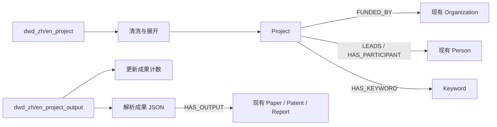

# 国内外项目：MySQL → TRSGraph 字段级映射

> 责任域：国内外项目（兴坤）
> 图空间：`dev`；统一 Tag：`Project`；VID：`project_{id}`
> 源库：`gkx_element`

## 1. 责任边界

项目 ETL 只创建以 `Project` 为起点的业务边：

| Edge | 方向 | 来源 |
|---|---|---|
| `FUNDED_BY` | Project → Organization | `funded_institution` |
| `LEADS` | Project → Person | `project_host` |
| `HAS_PARTICIPANT` | Project → Person | `participants` |
| `HAS_KEYWORD` | Project → Keyword | `keywords` |
| `HAS_OUTPUT` | Project → Paper/Patent/Report | output JSON |

项目 ETL 不创建 `SOURCED_FROM`、`PARTICIPATES_IN`、`OUTPUT_OF`，也不创建
Person、Organization、Paper、Patent、Report 桩节点。未唯一精确匹配的终点跳过并写入报告。



## 2. 通用规则

### 2.1 Project 顶点与溯源

| 属性 | 取值 |
|---|---|
| VID | `project_{id}` |
| `source` | `zh_project` / `en_project` |
| `source_system` | `gkx_element` |
| `source_table` | `dwd_zh_project` / `dwd_en_project` |
| `source_record_id` | 项目 `id` |
| `source_url` | `project_page_url` |
| `ingest_batch` | ETL 批次 |
| `ingest_time` | ETL 执行时间 |
| `source_update_time` | 主表 `updated_time` |

数据源全部内嵌在 Project 属性中，不创建或连接 DataSource。

### 2.2 边溯源和幂等

所有边包含 `source_table`、`source_record_id`、`ingest_batch`、`ingest_time`。
`merge_edge.identityProps.source_record_id` 必须非空。

普通项目关系使用项目 `id`；`HAS_OUTPUT` 使用：

```text
{project_id}|{output_type}|{target_vid}
```

### 2.3 精确匹配

- 文本：trim、连续空白压缩、英文小写。
- Organization：`name_cn/name_en` 唯一精确命中。
- Person：`name_zh/name_cn/name_en` 唯一精确命中。
- Paper：DOI；其次标题+年份；最后唯一标题。
- Patent：申请号、公布号、patent_id；最后唯一标题。
- Report：标题；有年份时同时校验 publication_date。
- 0 命中写 `not_found`；多命中写 `ambiguous`；均不建边。
- Keyword：`keyword_{md5(normalized)}`，不存在时允许创建。

## 3. `dwd_zh_project` 字段

| # | MySQL 字段 | 现网类型 | 图映射 / disposition |
|---:|---|---|---|
| 1 | `id` | varchar(255) | Project VID；`source_record_id` |
| 2 | `project_number` | varchar(255) | `Project.project_number` |
| 3 | `title` | varchar(255) | `Project.title` |
| 4 | `project_source` | varchar(255) | `Project.project_source` |
| 5 | `funded_institution` | varchar(255) | 定位 Organization，创建 `FUNDED_BY` |
| 6 | `project_level` | varchar(255) | `Project.project_level` |
| 7 | `funded_amount` | decimal(18,2) | Project 属性及 `FUNDED_BY.funded_amount` |
| 8 | `discipline` | varchar(255) | `Project.discipline` |
| 9 | `discipline_code` | varchar(255) | `Project.discipline_code` |
| 10 | `fund_category` | varchar(255) | Project 属性及 `FUNDED_BY.fund_category` |
| 11 | `funded_province` | varchar(255) | `Project.funded_region` |
| 12 | `participating_institution` | json | 机构域 `PARTICIPATES_IN` 候选；项目域不写边 |
| 13 | `approval_year` | int | `Project.approval_year` 字符串 |
| 14 | `approval_time` | datetime | `Project.approval_time` ISO 字符串 |
| 15 | `research_period` | varchar(255) | `Project.research_period` |
| 16 | `project_host` | varchar(255) | 定位 Person，创建 `LEADS` |
| 17 | `participants` | json | 展开定位 Person，创建 `HAS_PARTICIPANT` |
| 18 | `keywords` | json | 展开 Keyword，创建 `HAS_KEYWORD` |
| 19 | `abstract` | text | `Project.abstract` |
| 20 | `final_report_abstract` | text | `Project.final_report_abstract` |
| 21 | `project_page_url` | text | `Project.project_page_url`、`source_url` |
| 22 | `updated_time` | datetime | `Project.source_update_time` |
| 23 | `create_time` | datetime nullable | MySQL 保留，本期不进图 |

## 4. `dwd_en_project` 字段

字段 disposition 与中文主表相同；现网类型差异如下：

| 字段 | 现网类型 / 说明 |
|---|---|
| `id` | varchar(64) |
| `project_number` | varchar(32) |
| `title` | varchar(512) |
| `project_source` | varchar(64) |
| `funded_institution` | varchar(128) |
| `discipline` | varchar(256) |
| `fund_category` | varchar(64) |
| `funded_province` | varchar(32) |
| `participating_institution` | json |
| `approval_year` | int |
| `approval_time` | datetime |
| `participants` / `keywords` | json |
| `abstract` / `final_report_abstract` | longtext |
| `updated_time` | datetime → `source_update_time` |
| `create_time` | datetime nullable，本期不进图 |

固定属性：`source="en_project"`、`source_table="dwd_en_project"`。

## 5. Output 计数字段

`output.id == project.id`，用于更新已有 Project。

| 字段 | Project 属性 / disposition |
|---|---|
| `total_outputs` | `total_outputs` |
| `journal_articles_count` | `journal_articles_count` |
| `conference_papers_count` | `conference_papers_count` |
| `degree_papers_count` | `degree_papers_count` |
| `patents_count` | `patents_count` |
| `books_count` | `books_count` |
| `clinical_trials_count` | `clinical_trials_count`，仅英文 output 存在 |
| `awards_count` | `awards_count` |
| `reports_count` | `reports_count` |
| `other_outputs_count` | `other_outputs_count` |
| `create_time` | 四表 nullable；不进图 |
| `updated_time` | 仅中文 output 存在；不覆盖主表溯源 |

现网四表均无 `products_count`。

## 6. Output JSON 与 `HAS_OUTPUT`

| 字段 | `output_type` | 终点 | 匹配 |
|---|---|---|---|
| `output_journal_articles` | `journal_article` | Paper | DOI / 标题+年份 / 标题 |
| `output_conference_papers` | `conference_paper` | Paper | DOI / 标题+年份 / 标题 |
| `output_degree_papers` | `degree_paper` | Paper | DOI / 标题+年份 / 标题 |
| `output_patents` | `patent` | Patent | 申请号 / 公布号 / patent_id / 标题 |
| `output_reports` | `report` | Report | 标题+年份 / 标题 |
| `output_books` | — | — | 仅计数 |
| `output_awards` | — | — | 仅计数 |
| `output_clinical_trials` | — | — | 仅计数 |
| `output_other` | — | — | 仅计数 |

`HAS_OUTPUT` 属性：

| 属性 | 取值 |
|---|---|
| `output_type` | 上表枚举 |
| `output_title` | JSON 原始标题 |
| `output_identifier` | DOI / 专利号，可空 |
| `match_method` | `doi_exact` / `title_year_exact` / `title_exact` / `patent_number_exact` |
| `match_evidence` | 规范化匹配值 |
| `confidence` | 确定性匹配固定 `1.0` |
| `source_table` | 中文或英文 output 表 |
| `source_record_id` | 稳定关系键 |
| `ingest_batch` / `ingest_time` | ETL 注入 |

## 7. 运行与报告

```bash
cd backend
TRS_GRAPH_SPACE=dev uv run python -m script.load_project_graph \
  --relations-only --dry-run --report-dir /tmp/project-dry-run
```

报告：

```text
etl_summary.json
unmatched_organizations.jsonl
ambiguous_organizations.jsonl
unmatched_persons.jsonl
ambiguous_persons.jsonl
unmatched_outputs.jsonl
ambiguous_outputs.jsonl
cross_domain_candidates.jsonl
```

## 8. 验收

执行 `backend/script/ngql/project_accept_real.ngql`。业务边只允许：

```text
FUNDED_BY
LEADS
HAS_PARTICIPANT
HAS_KEYWORD
HAS_OUTPUT
```

Project 的 `SOURCED_FROM` 数量必须为 0；项目 ETL 不新增
`PARTICIPATES_IN` 或 `OUTPUT_OF`。
