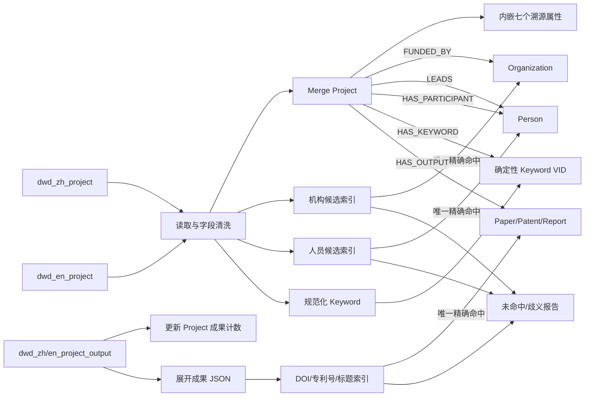
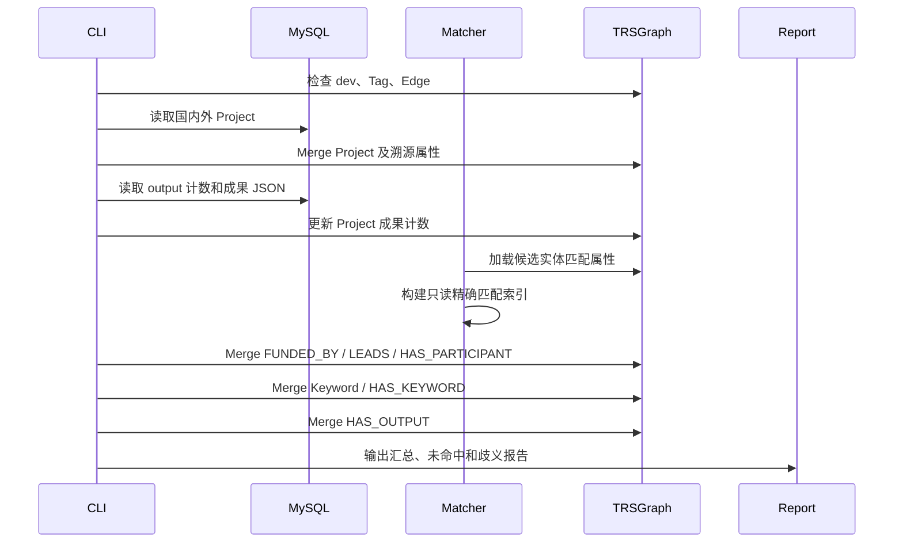

# 国内外项目实体与关系入图实施汇报

> 责任领域：国内外项目  
> 源数据库：MySQL `gkx_element`  
> 目标图空间：TRSGraph `dev`  
> 实施批次：`BATCH_20260726_PROJECT_REL_V1`  
> 汇报日期：2026-07-26

## 1. 项目背景

本次工作的目标是分析科技要素数据库中的项目表和字段，并将国内外项目实体及其业务关系映射到 TRSGraph。项目域只负责创建以 `Project` 为起点的有向关系，将已经存在的机构、人员、论文、专利和报告实体连接起来。

涉及四张源表：

| 类型 | 主表 | 成果表 |
|---|---|---|
| 国内项目 | `dwd_zh_project` | `dwd_zh_project_output` |
| 国外项目 | `dwd_en_project` | `dwd_en_project_output` |

本次实施遵循以下边界：

- 统一使用 `Project` Tag，不创建 `ZhProject` 或 `EnProject`。
- 只创建从 `Project` 出发的业务边。
- 不创建 `Project → DataSource`，数据源信息内嵌在 Project 属性中。
- 不写入 `SOURCED_FROM`、`PARTICIPATES_IN`、`OUTPUT_OF`。
- 不创建 Person、Organization、Paper、Patent、Report 桩节点。
- 未唯一精确命中的实体跳过并写入运行报告。
- Keyword 是唯一允许通过确定性 VID 新建的辅助实体。

## 2. 实施范围

### 2.1 Project 实体

国内外项目统一映射为：

```text
VID = project_{项目id}
Tag = Project
```

本次共处理：

| 来源 | Project 数量 |
|---|---:|
| `zh_project` | 2,000 |
| `en_project` | 1,994 |
| 合计 | 3,994 |

### 2.2 项目业务关系

| Edge | 方向 | 来源字段 |
|---|---|---|
| `FUNDED_BY` | Project → Organization | `funded_institution` |
| `LEADS` | Project → Person | `project_host` |
| `HAS_PARTICIPANT` | Project → Person | `participants` |
| `HAS_KEYWORD` | Project → Keyword | `keywords` |
| `HAS_OUTPUT` | Project → Paper/Patent/Report | output JSON |

### 2.3 不在本期创建的关系

| Edge | 原因 |
|---|---|
| `SOURCED_FROM` | 数据源信息已内嵌在 Project 属性中 |
| `PARTICIPATES_IN` | 属于 Person/Organization 指向 Project 的反向或跨域关系 |
| `OUTPUT_OF` | 本期统一使用 Project → 成果的 `HAS_OUTPUT` |

全局 Schema 中可以继续保留这些 Edge，供其他业务领域使用，但项目 ETL 不写入这些关系。

## 3. 总体技术方案



ETL 通过 `infra.graph_db.get_trs_graph_client()` 访问 TRSGraph，并在启动时强制检查：

```text
TRS_GRAPH_SPACE=dev
```

没有直接使用 Nebula Python Client SDK。

## 4. Project 属性映射

### 4.1 核心业务字段

| MySQL 字段 | Project 属性或用途 |
|---|---|
| `id` | VID、`source_record_id` |
| `project_number` | `project_number` |
| `title` | `title` |
| `project_source` | `project_source` |
| `project_level` | `project_level` |
| `funded_amount` | Project 属性、`FUNDED_BY.funded_amount` |
| `discipline` | `discipline` |
| `discipline_code` | `discipline_code` |
| `fund_category` | Project 属性、`FUNDED_BY.fund_category` |
| `funded_province` | `funded_region` |
| `approval_year` | `approval_year` |
| `approval_time` | `approval_time` |
| `research_period` | `research_period` |
| `abstract` | `abstract` |
| `final_report_abstract` | `final_report_abstract` |
| `project_page_url` | `project_page_url`、`source_url` |

### 4.2 标准溯源属性

项目不再连接 DataSource，统一保留以下七个标准溯源属性：

| Project 属性 | 取值 |
|---|---|
| `source_system` | `gkx_element` |
| `source_table` | `dwd_zh_project` / `dwd_en_project` |
| `source_record_id` | 项目 `id` |
| `source_url` | `project_page_url` |
| `ingest_batch` | ETL 批次号 |
| `ingest_time` | ETL 执行时间 |
| `source_update_time` | 主表 `updated_time` |

另外使用：

```text
source = zh_project / en_project
```

四张表的 `create_time` 保留在 MySQL，本期不扩展 Project Tag，因此不进入图属性。

### 4.3 成果计数

`output.id == project.id`，因此 output 表可以通过项目 ID 确定性更新对应 Project 的成果计数：

```text
total_outputs
journal_articles_count
conference_papers_count
degree_papers_count
patents_count
books_count
clinical_trials_count
awards_count
reports_count
other_outputs_count
```

这里的 ID 用于定位 Project，而不是定位某一篇具体论文或某一件具体专利。

## 5. 关系建立方法

### 5.1 通用文本规范化

名称和标题在匹配前执行：

```text
去除首尾空白
→ 连续空白压缩
→ 英文转换为 lowercase
```

匹配结果处理规则：

| 命中数 | 处理 |
|---:|---|
| 1 | 创建业务边 |
| 0 | 跳过，记录 `not_found` |
| 大于 1 | 跳过，记录 `ambiguous` |

该策略保证不会因为同名、简称或模糊标题而建立错误关系。

### 5.2 FUNDED_BY

使用：

```text
funded_institution
→ Organization.name_cn / name_en
→ 唯一精确命中
→ Project -[:FUNDED_BY]-> Organization
```

边属性包括：

```text
funded_amount
fund_category
source_table
source_record_id
ingest_batch
ingest_time
```

### 5.3 LEADS 与 HAS_PARTICIPANT

负责人：

```text
project_host
→ Person.name_zh / name_cn / name_en
→ Project -[:LEADS]-> Person
```

参与人：

```text
participants JSON
→ 展开人员名称
→ Person.name_zh / name_cn / name_en
→ Project -[:HAS_PARTICIPANT]-> Person
```

本期不结合机构、邮箱、学科等字段进行人员消歧，因此同名人员不会直接连边。

### 5.4 HAS_KEYWORD

Keyword 使用规范化文本生成确定性 VID：

```text
keyword_{md5(normalized_keyword)}
```

处理流程：

```text
keywords JSON
→ 展开和规范化
→ 创建或复用 Keyword
→ Project -[:HAS_KEYWORD]-> Keyword
```

Keyword 是项目域唯一允许创建的新辅助实体。

### 5.5 HAS_OUTPUT

成果 JSON 映射如下：

| output 字段 | `output_type` | 目标 Tag |
|---|---|---|
| `output_journal_articles` | `journal_article` | Paper |
| `output_conference_papers` | `conference_paper` | Paper |
| `output_degree_papers` | `degree_paper` | Paper |
| `output_patents` | `patent` | Patent |
| `output_reports` | `report` | Report |

论文匹配顺序：

```text
规范化 DOI
→ 标题 + 发表年份
→ 规范化标题
```

专利匹配顺序：

```text
application_number
→ publication_number
→ patent_id
→ title_original / title_zh / title_en
```

报告匹配顺序：

```text
title_cn / title_en
→ 有年份时校验 publication_date
```

每条 `HAS_OUTPUT` 保存：

```text
output_type
output_title
output_identifier
match_method
match_evidence
confidence
source_table
source_record_id
ingest_batch
ingest_time
```

其中：

```text
confidence = 1.0
source_record_id = {project_id}|{output_type}|{target_vid}
```

稳定的 `source_record_id` 同时作为 `merge_edge.identityProps`，保证重复执行不会增加重复边。

## 6. 为什么成果关系不能直接使用项目 ID

四张表中存在两种不同语义的 ID：

```text
project.id
output.id
```

并且：

```text
output.id == project.id
```

这只能证明某一整组 output JSON 属于哪个 Project。它不能标识 JSON 中的某一篇论文或某一件专利。

例如：

```text
project.id = P001
output.id  = P001
```

表示 P001 项目拥有这一组成果数据，但不能推出：

```text
Paper.id  = P001
Patent.id = P001
```

Paper、Patent 的 VID 由论文域和专利域按照各自源表及编码规则生成，项目 output 数据并不天然知道该 VID。因此当前使用 DOI、申请号、公开号、成果业务 ID及标题进行跨域匹配。

如果后续确认 output JSON 中存在与论文、专利源表完全一致的稳定主键，例如：

```text
paper_id == 论文源表主键
patent_id == 专利源表主键
```

则匹配顺序应升级为：

```text
成果源记录 ID / 确定性 VID
→ DOI 或专利号
→ 标题 + 年份
→ 标题
```

ID 直连必须先证明两侧 ID 属于同一编码体系，否则会把不同业务域中碰巧相同的 ID 错误连接。

## 7. ETL 阶段与 CLI

### 7.1 执行阶段



### 7.2 支持的参数

```text
--nodes-only
--relations-only
--dry-run
--id
--id-prefix
--limit
--ingest-batch
--strict-existing-entities
--report-dir
```

典型 dry-run：

```bash
cd backend
TRS_GRAPH_SPACE=dev uv run python -m script.load_project_graph \
  --relations-only \
  --dry-run \
  --ingest-batch BATCH_PROJECT_DRYRUN \
  --report-dir /tmp/project-dry-run
```

## 8. 实施过程

本次按照以下顺序执行：

1. 检查四张表真实字段及 ORM。
2. 初始化并确认 `HAS_OUTPUT` Edge Schema。
3. 完成自动测试和全量 dry-run。
4. 选取一个真实项目进行金丝雀写入。
5. 使用相同批次重复运行金丝雀，验证边数量不增加。
6. 全量处理 3,994 个 Project。
7. 使用直连 Nebula Graph 的 nGQL 完成最终验收。

金丝雀项目：

```text
Project VID:
project_0082e5f7-dbf5-40a3-87d7-1e3cc38b15b8

项目名称:
磁场诱导离子凝胶聚合物电解质二维通道及离子传递特性
```

金丝雀最终关系：

| Edge | 数量 |
|---|---:|
| `FUNDED_BY` | 1 |
| `LEADS` | 1 |
| `HAS_KEYWORD` | 5 |

使用相同批次重复运行后数量保持不变，幂等验证通过。

## 9. 全量实施结果

### 9.1 最终图数据

| Edge | 数量 |
|---|---:|
| `FUNDED_BY` | 449 |
| `LEADS` | 135 |
| `HAS_PARTICIPANT` | 635 |
| `HAS_KEYWORD` | 16,696 |
| `HAS_OUTPUT` | 11 |
| 合计 | 17,926 |

其他结果：

| 指标 | 数量 |
|---|---:|
| 扫描 Project | 3,994 |
| 更新成果计数的 Project | 3,994 |
| Keyword 候选 | 16,696 |
| 新建 Keyword | 8,256 |
| 跨域候选报告 | 3,994 |

### 9.2 严格匹配漏斗

| 对象 | 候选数 | 唯一命中 | 歧义 | 未命中 |
|---|---:|---:|---:|---:|
| Organization | 3,994 | 449 | 76 | 3,469 |
| Person | 20,761 | 770 | 536 | 19,455 |
| Paper/Patent/Report | 45,266 | 11 | 27 | 45,228 |
| Keyword | 16,696 | 16,696 | 0 | 0 |

成果候选构成：

| 类型 | 候选数 |
|---|---:|
| Paper | 40,752 |
| Patent | 2,514 |
| Report | 2,000 |
| 合计 | 45,266 |

人员唯一命中的 770 条关系对应：

```text
LEADS 135 + HAS_PARTICIPANT 635 = 770
```

### 9.3 为什么源数据多但关系少

关系数量少的主要原因不是 ETL 少处理了数据，而是本期要求：

```text
只连接 dev 中已经存在且唯一精确命中的实体
```

未命中和歧义候选都不会创建关系。

Organization 常见问题：

- 项目表使用简称，而图中是机构全称。
- 中英文名称没有建立别名映射。
- 名称带院系、实验室或分支机构。
- dev 中不存在对应机构。
- 同名机构存在多个节点。

Person 常见问题：

- 人员重名。
- 中英文姓名表达方式不同。
- 项目数据只有姓名，缺少机构、邮箱等消歧信息。
- dev 中不存在对应人员。

成果常见问题：

- output JSON 中缺少稳定成果 ID、DOI或专利号。
- 标题存在中英文、标点、副标题和版本差异。
- dev 中尚未存在对应成果。
- dev 中存在重复成果，导致非唯一命中。

因此当前数字反映的是“确定无歧义的可连接关系”，而不是源表中全部潜在关系。

## 10. 运行报告

全量报告目录：

```text
/tmp/project-rel-v1/
```

包含：

```text
etl_summary.json
unmatched_organizations.jsonl
ambiguous_organizations.jsonl
unmatched_persons.jsonl
ambiguous_persons.jsonl
unmatched_outputs.jsonl
ambiguous_outputs.jsonl
cross_domain_candidates.jsonl
```

这些文件是运行产物，不提交 Git。

## 11. nGQL 验收

### 11.1 Project 数量

```ngql
USE dev;

MATCH (p:Project)
RETURN
  p.Project.source AS source,
  count(p) AS project_count
ORDER BY source;
```

验收结果：

```text
en_project  1994
zh_project  2000
```

### 11.2 项目出边统计

```ngql
MATCH (p:Project)-[e]->()
RETURN
  type(e) AS edge_type,
  count(e) AS edge_count
ORDER BY edge_type;
```

验收结果：

```text
FUNDED_BY          449
HAS_KEYWORD      16696
HAS_OUTPUT           11
HAS_PARTICIPANT     635
LEADS               135
```

### 11.3 禁用关系

```ngql
MATCH (p:Project)-[e:SOURCED_FROM|PARTICIPATES_IN|OUTPUT_OF]->()
RETURN
  type(e) AS edge_type,
  count(e) AS edge_count;
```

验收结果为空，即数量为 0。

### 11.4 边溯源完整性

```ngql
MATCH (:Project)-[e]->()
WHERE
  e.source_record_id IS NULL OR
  e.source_record_id == "" OR
  e.ingest_batch IS NULL OR
  e.ingest_batch == ""
RETURN count(e) AS invalid_provenance_edges;
```

验收结果：

```text
invalid_provenance_edges = 0
```

### 11.5 HAS_OUTPUT 抽查

```ngql
MATCH (p:Project)-[e:HAS_OUTPUT]->(o)
RETURN
  id(p) AS project_vid,
  id(o) AS output_vid,
  labels(o) AS output_tags,
  e.HAS_OUTPUT.output_type AS output_type,
  e.HAS_OUTPUT.output_title AS output_title,
  e.HAS_OUTPUT.output_identifier AS output_identifier,
  e.HAS_OUTPUT.match_method AS match_method,
  e.HAS_OUTPUT.match_evidence AS match_evidence,
  e.HAS_OUTPUT.source_record_id AS relation_identity,
  e.HAS_OUTPUT.ingest_batch AS ingest_batch
LIMIT 20;
```

## 12. 测试与质量门禁

本次实现覆盖：

- 四张项目表 ORM 和真实字段。
- Project 标准七个溯源属性。
- JSON、日期、名称、DOI、专利号和标题规范化。
- 唯一命中、未命中、多命中。
- 五类成果解析。
- 非空 `identityProps` 和稳定关系键。
- strict 模式不创建桩节点。
- 项目 ETL 不写禁用关系。
- `nodes-only`、`relations-only`、`dry-run` 阶段隔离。

最终质量门禁：

```text
ruff format --check .       通过
ruff check .                通过
pytest -m "not external"    205 passed, 4 skipped
git diff --check            通过
```

测试中的三个 SQLAlchemy warning 来自既有 Organization DAO 测试，不属于本次项目 ETL 失败。

## 13. 当前结论

本期已完成：

1. 国内外 3,994 个 Project 的统一建模。
2. Project 标准溯源属性内嵌。
3. 五类 Project 出边的抽取和幂等写入。
4. `HAS_OUTPUT` 本体、Schema 和 ETL 实现。
5. 未匹配、歧义和跨域候选报告。
6. 全量 dry-run、金丝雀、幂等和 nGQL 验收。
7. 项目域与 DataSource 关系解耦。

图中最终只出现项目域允许的五种出边，未生成桩节点，未写入禁用关系，边级溯源字段完整。

## 14. 风险与下一步建议

### 14.1 第一优先级：确认成果 ID

进一步分析 output JSON 是否包含：

```text
paper_id
article_id
achievement_id
patent_id
application_number
publication_number
doi
```

并与论文、专利源表确认是否属于同一编码体系。如果能够证明 ID 一致，应增加 ID 或确定性 VID 优先匹配。

### 14.2 第二优先级：建立实体对齐层

建议增加：

- Organization 别名、简称和中英文名称映射。
- Person 姓名与机构联合匹配。
- DOI 多种前缀和格式清洗。
- 专利号国家代码、分隔符和种类码规范化。
- 论文、专利、报告标题标点和副标题规范化。

### 14.3 第三优先级：消歧

对歧义候选增加辅助证据：

```text
Person：姓名 + 机构 + 学科
Organization：名称 + 地区 + 机构类型
Paper：标题 + 年份 + 作者 + 期刊
Patent：专利号 + 申请人 + 申请年份
Report：标题 + 年份 + 发布机构
```

### 14.4 第四优先级：扩展成果本体

第一版以下成果仅保留计数：

```text
output_books
output_awards
output_clinical_trials
output_other
```

如业务需要，应先补充 Book、Award、ClinicalTrial 等本体设计，再增加对应实体和关系，避免临时复用不合适的 Tag。

### 14.5 回滚策略

关系可按照：

```text
ingest_batch = BATCH_20260726_PROJECT_REL_V1
```

定位本批写入数据。回滚时：

- 只删除本批项目业务边。
- 不删除 3,994 个共享 Project。
- 不删除共享 Person、Organization、Paper、Patent、Report。
- 本批 Keyword 仅在没有其他引用关系时删除。
- 不处理已有 DataSource 元数据节点。

## 15. 汇报总结

本次工作的核心成果不是把所有文本候选强制连接，而是在明确责任边界和方向的前提下，建立了一套可重复运行、可追溯、可验收的项目关系入图流程。

当前 17,926 条关系均满足：

```text
Project 出发
→ 目标实体存在
→ 唯一精确命中
→ 边身份非空
→ 重复执行幂等
→ 批次与来源可追溯
```

下一阶段的重点应从“继续增加 ETL 写入规则”转为“确认成果统一 ID、补充实体别名与消歧证据”。只有完成跨域实体对齐，才能在保证准确率的同时显著提升项目与机构、人员及成果之间的关系覆盖率。
