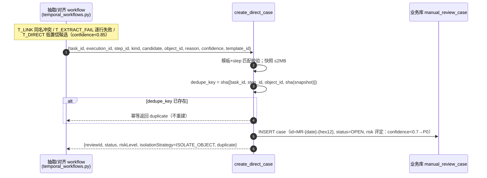
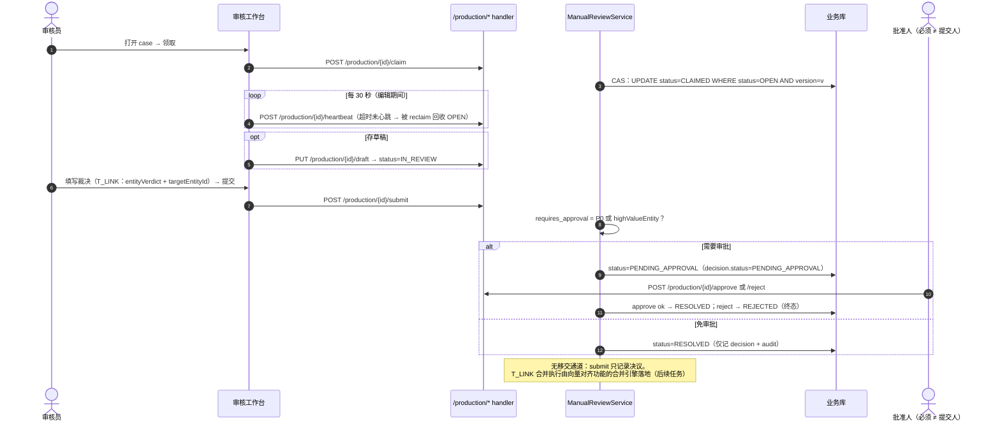
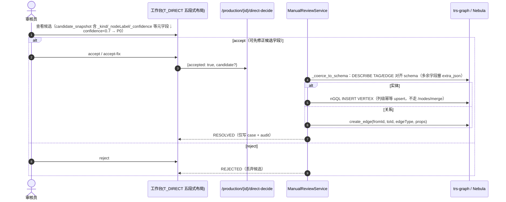
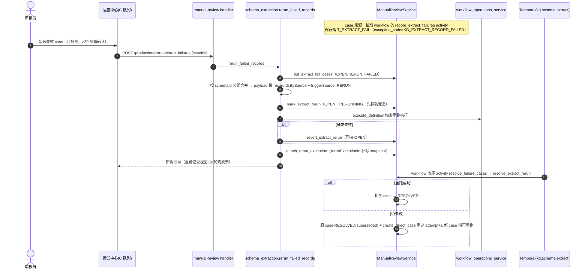

# 人工审核模块（代码结构 / 表结构 / 功能说明 / 时序图）

> 单路由组：`/api/v1/manual-reviews`（**admin 组**，`biz/handler/manual_review.py`，鉴权经网关身份 `get_review_identity`）。
> 前端：`/manual-review`（OperationsCenterView, mode=review）、`/manual-review/task/:instanceId`（ManualReviewWorkspaceView 审核工作台）。
>
> **2026-09-15 起 graph-build 移交通道整体删除**：原「审核只管裁决、执行交外部 graph-build 服务」的设计从未投产（该服务未开发），执行逻辑改由本仓库内实现。内部入口（`/api/v1/internal/manual-reviews`）、correction/outbox/execution/execution_event 表、常驻 worker（`run_manual_review_worker.py`）、测试替身（`run_graph_build_double.py` / `run_review_test_server.py`）全部移除；6 个休眠模板（T_MAP/T_DQ_FILL/T_DQ_MERGE/T_EVIDENCE/T_ATTR/T_RUNTIME）一并删除。存量表未 DROP（模型已删，表留作历史数据）。

## 一、功能描述

生产审核服务：**事后队列**（抽取流水线完整跑完后，异常对象整批进审核队列，审核员裁决；不做运行中暂停等待）。三类产活模板、简化状态机、乐观锁并发控制。

### 1. 队列分类（查询期模板映射，非表列）

| category | 模板 | 含义 |
|---|---|---|
| **A 入库决策** | T_DIRECT、T_LINK | 候选实体/关系入库直判 / 同名冲突实体对齐裁决 |
| **C 抽取失败重跑** | T_EXTRACT_FAIL | 逐行抽取失败记录重跑 |

3 个模板挂在 7 个流水线步骤上（source/normalize/schema/extract/align/validate/persist）：extract→T_EXTRACT_FAIL、align→T_LINK、T_DIRECT 挂抽取 workflow 的自定义 step。旧别名 `T_ENTITY` 归一化为 `T_LINK`。高风险动作集合现为空（机制保留：`requires_approval` 判定 + 四方签核强制提交人 ≠ 批准人）。风险策略 SLA：P0=claim 15min/resolve 30min，P1=1h/4h，P2=4h/1d。

### 2. case 状态机

```
OPEN → CLAIMED → IN_REVIEW → PENDING_APPROVAL → RESOLVED
失败/旁路：REJECTED、CANCELLED、EXPIRED（终态集：RESOLVED/REJECTED/CANCELLED/EXPIRED）
T_EXTRACT_FAIL 重跑生命周期：RERUNNING、RERUN_FAILED
```

- claim 用 CAS（`UPDATE ... WHERE status=OPEN AND version=v`）+ version 乐观锁；心跳超时的 CLAIMED/IN_REVIEW 由 `reclaim_expired` 回收 OPEN。
- **是否需审批**：P0 或 highValueEntity → `PENDING_APPROVAL`，且**提交人 ≠ 批准人**（enforce）；否则 submit 直接落 RESOLVED。
- **无移交通道**：submit 只记录决议（decision + audit），不再有 APPLYING/VERIFYING 等下发中间态。
- 旁路：T_DIRECT 两步决策不走 claim/submit/approve（OPEN→RESOLVED/REJECTED）；T_EXTRACT_FAIL 点重跑即 RERUNNING。

### 3. 建案入口（唯一的 ingress）

`service/manual_review_production.py: create_direct_case` —— 由 `service/temporal_workflows.py` 在 workflow 内直接调用（不走 HTTP）：

- **T_LINK**：实体对齐同名冲突（`detect_extract_collisions`）；
- **T_EXTRACT_FAIL**：逐行抽取失败（`record_extract_failures`，exception_code=KG_EXTRACT_RECORD_FAILED）；
- **T_DIRECT**：低置信候选隔离（confidence < 0.85 的实体/关系候选）。

幂等键：`dedupe_key = sha([task_id, step_id, object_id, sha(snapshot)])`；confidence < 0.7 → P0，否则 P1；快照带 `_kind/_nodeLabel/_edgeType/_fromId/_toId/_confidence` 元字段。

### 4. 裁决后的落地路径

- **A. T_DIRECT 直写图库（旁路）**：accept → `_coerce_to_schema`（DESCRIBE TAG/EDGE 对齐 schema）→ entity 走 nGQL `INSERT VERTEX` 列级幂等 upsert / relation 走 `create_edge`；仅写 case/audit。可带修正后候选（覆盖快照后写图并记审计）。
- **B. T_LINK**：submit 记录 `entityVerdict`（merge/create）+ `targetEntityId` → RESOLVED。合并执行由向量对齐功能的合并引擎落地（后续任务，代码内以 TODO 标注）。
- **C. T_EXTRACT_FAIL**：不走 submit，直接经 `workflow_operations_service.execute_definition` 触发 `kg.schema.extract` 重跑（与 Schema 管理模块共用闭环）。

## 二、代码结构

```
backend/
├── biz/handler/manual_review.py            # admin 组：/production/* 17 端点
├── biz/schemas/manual_review_production.py # 生产请求模型
├── biz/dependencies/review_identity.py     # 网关身份头（X-User-*）→ ReviewIdentity
├── service/
│   ├── manual_review_production.py         # ManualReviewService（单例 manual_review_service）
│   └── manual_review_domain.py             # 模板/流水线步骤/风险策略/是否需审批 等领域常量
├── db_model/manual_review.py               # 5 张表（业务库 Base）
└── tests/unit/test_manual_review_*.py + tests/integration/test_manual_review_*_api.py

frontend/src/
├── views/platform/OperationsCenterView.vue      # 审核队列页：A 入库决策 / C 抽取失败重跑 双 tab；
│                                                #   C 类批量勾选重跑（>20 条确认）、重跑记录 8s 轮询
├── views/platform/ManualReviewWorkspaceView.vue # 工作台：claim + 30s 心跳；
│                                                 #   T_DIRECT 五段式 / T_EXTRACT_FAIL / T_LINK 三套专用布局
├── views/platform/rerun-history.ts / manual-review-data.ts（3 模板目录 + 演示种子）
└── api/workflowOperations.ts                    # 生产审核全部 client
```

### API 一览

`/api/v1/manual-reviews`（admin 组，`biz/handler/manual_review.py`）：

| 端点 | 作用 |
|---|---|
| `GET /production/queue` | 审核队列（queue tab/status/statusGroup/kind/risk/domain/templateId/assigneeId/category/keyword/sort=updatedAt+order=asc\|desc/分页；不传 sort 默认 风险级→创建时间升序） |
| `GET /production/{case_id}` | case 详情（含快照/诊断） |
| `POST /production/{case_id}/claim` | 领取（CAS，OPEN→CLAIMED） |
| `POST /production/{case_id}/heartbeat` | 心跳续约（超时被 reclaim 回收） |
| `POST /production/{case_id}/release` | 释放回 OPEN |
| `POST /production/{case_id}/transfer` | 转派（review_admin） |
| `PUT /production/{case_id}/draft` | 存草稿（→IN_REVIEW） |
| `POST /production/{case_id}/submit` | 提交决策（P0/高价值 → PENDING_APPROVAL，否则直接 RESOLVED） |
| `POST /production/{case_id}/approve` | 审批通过（批准人 ≠ 提交人） |
| `POST /production/{case_id}/reject` | 审批驳回（→REJECTED） |
| `POST /production/{case_id}/direct-decide` | T_DIRECT 两步决策（accept 写图 / reject 丢弃，不走 claim/submit） |
| `POST /production/rerun-extract-failures` | T_EXTRACT_FAIL 批量重跑（caseIds ≤2000 → 合并为 RERUN 执行；接受 OPEN/RERUN_FAILED） |
| `POST /production/delete-cases` | T_EXTRACT_FAIL 硬删除（caseIds ≤2000，review_admin；连同草稿/证据/裁决/审计，非 C 类 id 跳过，返回 deleted/skipped） |
| `POST /production/{case_id}/cancel` | 取消（review_admin） |
| `GET /production/{case_id}/audit-logs` | 审计日志 |
| `POST /production/{case_id}/evidence/upload-url` | S3 预签名上传 URL |
| `POST /production/{case_id}/evidence/complete` | 附件完整性校验落库（sha256/大小/类型白名单） |
| `POST /production/internal/reclaim-expired` | 手动回收过期领取（review_admin） |

## 三、表结构（业务库 5 张表，`db_model/manual_review.py`）

| 表 | 用途 | 关键列 / 说明 |
|---|---|---|
| `manual_review_case` | case 主表 | id（`MR-{YYYYMMDD}-{hex12}`）、`dedupe_key` UNIQUE（sha([task_id,step,object_id,fingerprint])）、source_task_id、pipeline_step_id、template_id、risk_level（P0/P1/P2）、scope（OBJECT）、**status**、assignee/submitted_by、**version**（乐观锁）、heartbeat_at、input/candidate_snapshot、diagnosis、workflow 上下文（type/id/run_id/task_queue）、isolation_scope |
| `manual_review_draft` | 草稿 | case_id(PK)、payload、updated_by |
| `manual_review_decision` | 决策 | case_id(idx)、action_id、result(JSON)、status（PENDING_APPROVAL/APPROVED/REJECTED）、submitted_by、approved_by |
| `manual_review_evidence` | 附件 | case_id(idx)、sha256、bucket/object_key（S3 预签名上传）、trust_level、size_bytes |
| `manual_review_audit_log` | 审计 | case_id(idx)、event_type、actor、old/new_status、detail(JSON) |

索引要点：case 表 `ix_review_queue(status,risk_level,domain,created_at)`（队列查询）、`ix_review_assignee(assignee_id,status)`。

> 原 `manual_review_correction` / `manual_review_outbox` / `manual_review_execution` / `manual_review_execution_event` 四张表的模型已删；存量表未 DROP（历史数据），新代码不再读写。

## 四、关键 env

`REVIEW_SNAPSHOT_MAX_BYTES`(2MB)、`REVIEW_EVIDENCE_MAX_BYTES`(20MB)、`REVIEW_EVIDENCE_CONTENT_TYPES`（附件类型白名单）、`REVIEW_S3_*`（证据附件桶，默认 `tech-kg-review-evidence`）、`REVIEW_HEADER_*`（网关身份头名，默认 `X-User-Id` 等）。

## 五、工作时序图

### 5.1 workflow 建案（唯一 ingress，幂等 + 对象隔离）



### 5.2 审核处置主线（claim → 草稿 → 提交 →（P0 审批）→ RESOLVED）



### 5.3 T_DIRECT 两步决策（直写图库旁路）



### 5.4 T_EXTRACT_FAIL 重跑闭环（跨模块）


