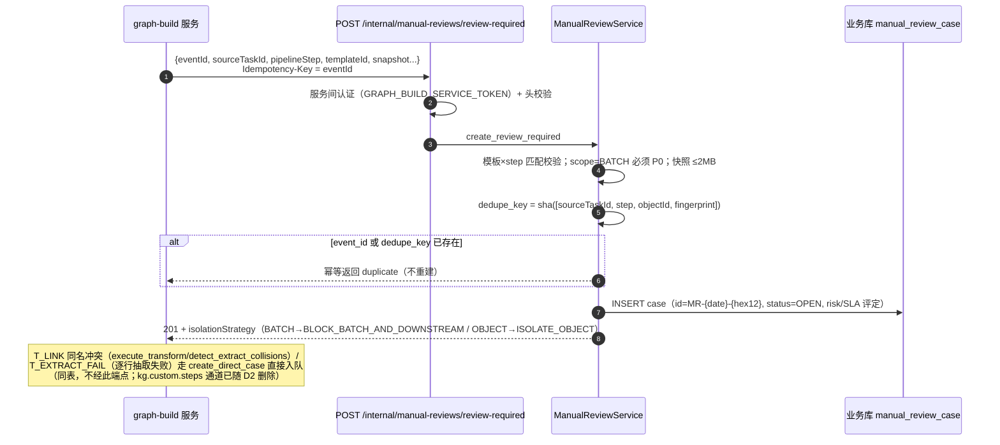
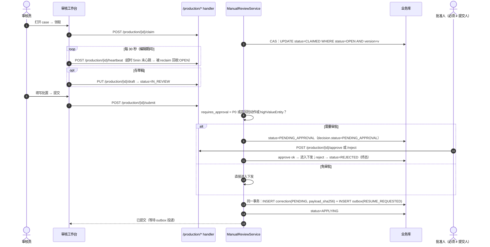
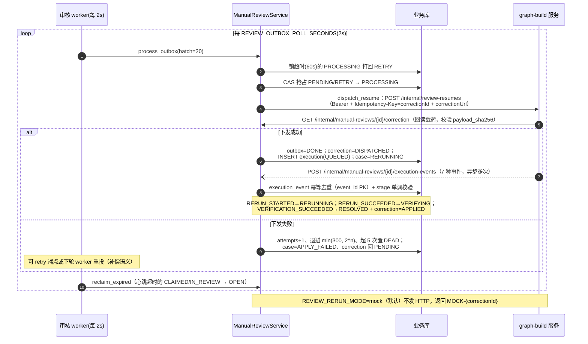
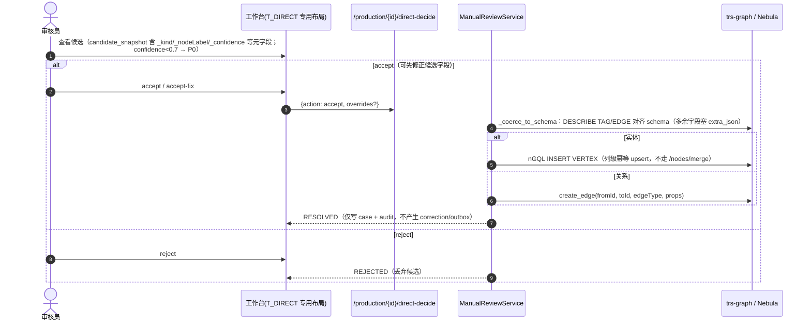
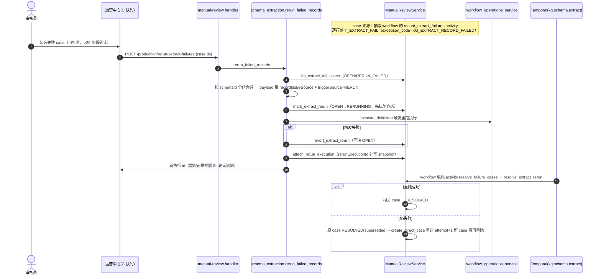

# 人工审核模块（代码结构 / 表结构 / 功能说明 / 时序图）

> 两个路由组：`/api/v1/manual-reviews`（**admin 组**，人工审核工作台）+ `/api/v1/internal/manual-reviews`（**免登录**，服务间认证：网关身份头 + HMAC 签名，供 graph-build 调用）。
> 前端：`/manual-review`（OperationsCenterView, mode=review）、`/manual-review/task/:instanceId`（ManualReviewWorkspaceView 审核工作台）。
>
> **勘误（与 CLAUDE.md 表述不符）**：审核 worker（`script/run_manual_review_worker.py`）是**进程内直调** `manual_review_service.process_outbox()`（每 2s），**不调用 HTTP internal 端点**；internal 端点的调用方是 graph-build 服务。worker 未纳入 docker-compose，需单独部署。

## 一、功能描述

生产审核服务 + 与图谱构建（graph-build）的交接边界（handoff boundary）。三类队列、13 态状态机、乐观锁并发控制、事务性 outbox 重跑下发、事件溯源回调闭环。

### 1. 队列分类（查询期模板映射，非表列）

| category | 模板 | 含义 |
|---|---|---|
| **A 入库决策** | T_DIRECT、T_LINK、T_EVIDENCE | 候选实体/关系是否入库 |
| **B 数据修正** | T_MAP、T_DQ_FILL、T_DQ_MERGE、T_ATTR | 选值映射/补全/定主/属性对照 |
| **C 抽取失败重跑** | T_EXTRACT_FAIL | 逐行抽取失败记录重跑 |

T_RUNTIME 永远排除在审核队列之外（自动重试/告警另行处理）。9 个模板挂在 7 个流水线步骤上（source/normalize/schema/extract/align/validate/persist），模板×step 匹配校验。高风险动作集合：force-pass / rollback-dict / skip-task。风险策略 SLA：P0=claim 15min/resolve 30min，P1=1h/4h，P2=4h/1d。

### 2. case 状态机（13 态）

```
OPEN → CLAIMED → IN_REVIEW → PENDING_APPROVAL → APPLYING → RERUNNING → VERIFYING → RESOLVED
失败/旁路：APPLY_FAILED、RERUN_FAILED、REJECTED、CANCELLED（终态集：RESOLVED/REJECTED/CANCELLED/EXPIRED）
```

- claim 用 CAS（`UPDATE ... WHERE status=OPEN AND version=v`）+ version 乐观锁；心跳超时（默认 5min）由 reclaim 回收 OPEN。
- **是否需审批**：P0 或高风险动作或 highValueEntity → `PENDING_APPROVAL`，且**提交人 ≠ 批准人**（enforce）；否则 submit 直接进入下发。
- 事件驱动阶段：execution-event 回调按 stage **单调递增**（禁止状态回退），RERUN_SUCCEEDED→VERIFYING、VERIFICATION_SUCCEEDED→RESOLVED（并置 correction=APPLIED）。
- 旁路：T_DIRECT 两步决策不走 claim/submit/approve（OPEN→RESOLVED/REJECTED）；T_EXTRACT_FAIL 触发即 RERUNNING。

### 3. graph-build 交接边界（三条 HTTP 契约）

graph-build 服务（生产尚未开发，现用测试替身 `script/run_graph_build_double.py` 承接；`REVIEW_RERUN_MODE` 默认 mock）：

1. graph-build → `POST /internal/manual-reviews/review-required`：异常上报入队（Idempotency-Key 必须 == eventId）；
2. 审核侧 outbox → graph-build `POST {GRAPH_BUILD_INTERNAL_URL}/internal/review-resumes`：重跑下发（Bearer + Idempotency-Key=correctionId，带 correctionUrl 供对方回读修正载荷并校验 payloadSha256）；
3. graph-build → `POST /internal/manual-reviews/{id}/execution-events`：7 种执行生命周期回调。

### 4. 审核通过后的两条落地路径

- **A. T_DIRECT 直写图库（旁路）**：accept → `_coerce_to_schema`（DESCRIBE TAG/EDGE 对齐 schema）→ entity 走 nGQL `INSERT VERTEX` 列级幂等 upsert / relation 走 `create_edge`；仅写 case/audit，不走 correction/outbox/workflow。
- **B. 常规模板**：submit/approve → `enqueue_correction` **同事务**写 correction（PENDING）+ outbox（RESUME_REQUESTED）→ worker 投递 graph-build → 回调驱动 RERUNNING→VERIFYING→RESOLVED。
- **C. T_EXTRACT_FAIL**：不走 outbox，直接经 `workflow_operations_service.execute_definition` 触发 `kg.schema.extract`（与 Schema 管理模块共用闭环）。

### 5. 事务性 outbox（不丢消息）

submit/approve 与 outbox 行同事务落库；`process_outbox` 先把锁超时（60s）的 PROCESSING 打回 RETRY，再 CAS 抢占 PENDING/RETRY → `dispatch_resume`；失败 attempts+1、指数退避 `min(300, 2^n)`、超 5 次置 DEAD、case=APPLY_FAILED（可 retry 或 worker 重投补偿）。

## 二、代码结构

```
backend/
├── biz/handler/manual_review.py            # admin 组：legacy 演示队列 7 端点 + /production/* 22 端点
├── biz/handler/manual_review_internal.py   # 免登录：review-required / correction / execution-events
├── biz/schemas/manual_review_production.py # 生产请求模型
├── service/
│   ├── manual_review_production.py         # ManualReviewService（~1740 行，单例 manual_review_service）
│   ├── manual_review_domain.py             # 模板/流水线步骤/风险策略/是否需审批 等领域常量
│   └── review_service_auth.py / review_identity.py  # 服务间 Bearer + 网关身份头（HMAC）
├── db_model/manual_review.py               # 9 张表（业务库 Base）
├── script/run_manual_review_worker.py      # 常驻 worker：process_outbox + reclaim_expired（每 2s）
└── script/run_graph_build_double.py        # graph-build 测试替身

frontend/src/
├── views/platform/OperationsCenterView.vue     # 审核队列页：A 入库决策 / C 抽取失败重跑 双 tab；
│                                               #   C 类批量勾选重跑（>20 条确认）、重跑记录 8s 轮询
├── views/platform/ManualReviewWorkspaceView.vue # 工作台（~2000 行）：claim + 30s 心跳；
│                                                #   T_DIRECT/T_EXTRACT_FAIL/T_LINK/T_EVIDENCE 专用布局，其余走动态表单
├── views/platform/rerun-history.ts / manual-review-data.ts
├── components/manual-review/ManualReviewDynamicForm.vue
└── api/workflowOperations.ts                   # 生产审核全部 client
```

### API 一览

`/api/v1/manual-reviews`（admin 组，`biz/handler/manual_review.py`）——legacy 演示队列：

| 端点 | 作用 |
|---|---|
| `GET /manual-reviews` | 演示队列列表（status/domain/category/batchId/时间/keyword/分页，带缓存） |
| `GET /manual-reviews/{review_id}` | 演示 case 详情 |
| `GET /manual-reviews/{review_id}/flow` | 任务流程 flow |
| `POST /manual-reviews/{review_id}/actions` | 处置动作提交 |
| `PUT /manual-reviews/{review_id}/result` | 修改结果 |
| `POST /manual-reviews/{review_id}/retry` | 重试工作流下发 |
| `POST /manual-reviews/{review_id}/revoke` | 撤销 |

生产审核（同 router，`/production/*`，鉴权经网关身份 `get_review_identity`）：

| 端点 | 作用 |
|---|---|
| `POST /manual-reviews/internal/cases` | 从 legacy 参数创建生产 case |
| `GET /production/queue` | 审核队列（queue tab/status/statusGroup/kind/risk/domain/templateId/assigneeId/category/keyword/分页） |
| `GET /production/{case_id}` | case 详情（含快照/诊断/执行） |
| `POST /production/{case_id}/claim` | 领取（CAS，OPEN→CLAIMED） |
| `POST /production/{case_id}/heartbeat` | 心跳续约（超时被 reclaim 回收） |
| `POST /production/{case_id}/release` | 释放回 OPEN |
| `POST /production/{case_id}/transfer` | 转派（review_admin） |
| `PUT /production/{case_id}/draft` | 存草稿（→IN_REVIEW） |
| `POST /production/{case_id}/submit` | 提交决策（P0/高风险/高价值 → PENDING_APPROVAL，否则直接下发） |
| `POST /production/{case_id}/approve` | 审批通过（批准人 ≠ 提交人） |
| `POST /production/{case_id}/reject` | 审批驳回（→REJECTED） |
| `POST /production/{case_id}/direct-decide` | T_DIRECT 两步决策（accept 写图 / reject 丢弃，不走 claim/submit） |
| `POST /production/rerun-extract-failures` | T_EXTRACT_FAIL 批量重跑（caseIds ≤2000 → 合并为 RERUN 执行） |
| `POST /production/{case_id}/cancel` | 取消（review_admin） |
| `POST /production/{case_id}/retry` | APPLY_FAILED/RERUN_FAILED 重试下发 |
| `POST /production/{case_id}/executions/{execution_id}/complete` | 手工回填执行结果（review_admin） |
| `GET /production/{case_id}/executions` | 执行列表 |
| `GET /production/{case_id}/audit-logs` | 审计日志 |
| `POST /production/{case_id}/evidence/upload-url` | S3 预签名上传 URL |
| `POST /production/{case_id}/evidence/complete` | 附件完整性校验落库（sha256/大小/类型白名单） |
| `POST /production/internal/process-outbox` | 手动驱动 outbox（review_admin，兜底 worker） |
| `POST /production/internal/reclaim-expired` | 手动回收过期领取（review_admin） |

`/api/v1/internal/manual-reviews`（免登录，服务间认证 Bearer + HMAC 签名，供 graph-build 调用）：

| 端点 | 作用 |
|---|---|
| `POST /internal/manual-reviews/review-required` | graph-build 异常上报入队（Idempotency-Key == eventId，幂等） |
| `GET /internal/manual-reviews/{review_id}/correction` | 拉取修正载荷（含 payloadSha256 校验） |
| `POST /internal/manual-reviews/{review_id}/execution-events` | 重跑执行生命周期回调（7 种事件，stage 单调） |

## 三、表结构（业务库 9 张表，`db_model/manual_review.py`）

| 表 | 用途 | 关键列 / 说明 |
|---|---|---|
| `manual_review_case` | case 主表 | id（`MR-{YYYYMMDD}-{hex12}`）、`dedupe_key` UNIQUE（sha([sourceTaskId,step,objectId,fingerprint])）、`event_id` UNIQUE（幂等）、source_task_id、pipeline_step_id、template_id、risk_level（P0/P1/P2）、scope（OBJECT/BATCH）、**status**、assignee/submitted_by、**version**（乐观锁）、heartbeat_at、input/candidate_snapshot、diagnosis、workflow 上下文（type/id/run_id/task_queue/resume_token）、isolation_scope |
| `manual_review_draft` | 草稿 | case_id(PK)、payload、updated_by |
| `manual_review_decision` | 决策 | case_id(idx)、action_id、result(JSON)、status（PENDING_APPROVAL/APPROVED/REJECTED）、submitted_by、approved_by |
| `manual_review_evidence` | 附件 | case_id(idx)、sha256、bucket/object_key（S3 预签名上传）、trust_level、size_bytes |
| `manual_review_correction` | 修正载荷 | case_id(idx)、adapter（模板名）、payload、**payload_sha256**（graph-build 回读校验）、rerun_step_id、status（PENDING/DISPATCHED/APPLIED）、attempts |
| `manual_review_execution` | 重跑执行 | id（=graph-build 返回 executionId）、case_id(idx)、workflow_type/id/run_id、status（QUEUED/RUNNING/RERUN_SUCCEEDED/COMPLETED/FAILED） |
| `manual_review_audit_log` | 审计 | case_id(idx)、event_type、actor、old/new_status、detail(JSON) |
| `manual_review_outbox` | 事务性发件箱 | event_type（RESUME_REQUESTED）、status（PENDING/RETRY/PROCESSING/DONE/DEAD）、attempts、available_at（指数退避）、locked_at |
| `manual_review_execution_event` | 事件溯源 | event_id(PK，幂等去重)、case_id(idx)、execution_id、**stage**（int，单调）、event_type、payload |

索引要点：case 表 `ix_review_queue(status,risk_level,domain,created_at)`（队列查询）、`ix_review_assignee(assignee_id,status)`。

## 四、关键 env

`REVIEW_RERUN_MODE`（mock|real，默认 mock）、`GRAPH_BUILD_INTERNAL_URL`、`GRAPH_BUILD_SERVICE_TOKEN`（外呼 Bearer + internal 端点认证）、`REVIEW_RESUME_MAX_ATTEMPTS`(5)/`REVIEW_RESUME_TIMEOUT_SECONDS`(10)、`REVIEW_OUTBOX_POLL_SECONDS`(2)/`REVIEW_OUTBOX_BATCH_SIZE`(20)/`REVIEW_OUTBOX_LOCK_TIMEOUT_SECONDS`(60)、`REVIEW_HEARTBEAT_TIMEOUT_MINUTES`(5)、`REVIEW_IDENTITY_REQUIRE_SIGNATURE`(true)/`REVIEW_IDENTITY_HMAC_SECRET` + `REVIEW_HEADER_*`（网关头名）、`REVIEW_SNAPSHOT_MAX_BYTES`(2MB)、`REVIEW_EVIDENCE_MAX_BYTES`(20MB)、`REVIEW_S3_*`（证据附件桶，默认 `tech-kg-review-evidence`）。

## 五、工作时序图

### 5.1 graph-build 异常上报入队（幂等 + 隔离策略）



### 5.2 审核处置主线（claim → 草稿 → 提交 → 审批 → 同事务落 correction+outbox）



### 5.3 outbox 投递 → graph-build → 回调闭环（worker 主循环）



### 5.4 T_DIRECT 两步决策（直写图库旁路）



### 5.5 T_EXTRACT_FAIL 重跑闭环（跨模块）


