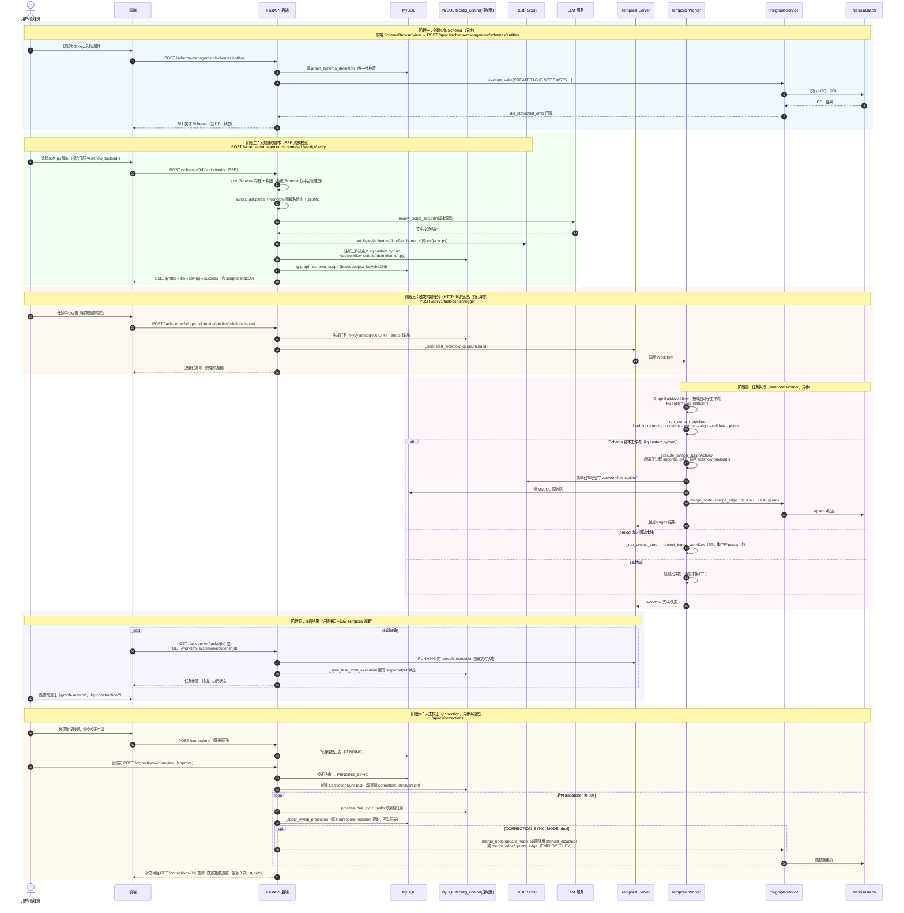

# 图谱构建整体工作流时序图

本文档描述从「创建实体 Schema → 添加抽取脚本 → 触发构建任务 → 任务执行 → 写图 → 查看结果 → 人工校正」的端到端流程，作为全流程联调测试的参考底稿。时序图中的端点与类名均对应实际代码实现。

## 参与者与存储分工

| 参与者 | 职责 |
|---|---|
| 前端（Schema 管理页 / 任务中心 / 校正中心） | 发起请求、SSE 接收脚本校验进度、轮询任务状态 |
| FastAPI 后端（handler → application → service） | 同步控制面：Schema/脚本/任务/校正的受理与管理 |
| MySQL | 业务数据、Schema 定义（`graph_schema_definition`）、脚本元数据（`graph_schema_script`）、治理/校正表 |
| MySQL 控制面库 `techkg_control`（temporal-mysql 实例，`WORKFLOW_MYSQL_*`） | 控制面状态：工作流定义、任务（task）、执行记录（execution）、校正同步任务 |
| RustFS (S3) | 抽取脚本文件存储（`schemas/{kind}/{schema_id}/...`） |
| Temporal Server | 异步任务引擎（队列 `tech-kg-workflows`；不可用时走 `LOCAL_FALLBACK`） |
| Temporal Worker | 执行 Workflow / Activity（默认与 API 同进程，可独立进程 `script/run_temporal_worker.py`） |
| trs-graph-service → NebulaGraph | 图数据读写与 DDL（后端不直连 Nebula） |
| LLM（`infra/llm.py`） | 脚本安全审查、部分业务分析 |
| Redis | 仅登录会话（auth），不在构建主链路上 |

> 注意：`backend/script/entity_extractors_one_entity/`（一实体一脚本）与 `relation_extractors_one_relation/`（一关系一脚本）是离线 ETL 脚本包，由运维按依赖顺序手工执行；在线闭环中，等价动作是把对应脚本上传到 Schema 管理页注册为 `kg.custom.python` 工作流。

## 一、总览时序图（端到端）

## 二、关键同步/异步边界

1. **同步**：
   - 创建 Schema（含 Nebula DDL，`service/schema_ddl.py` → `execute_write`，失败重试 3 次）；
   - 脚本校验保存（SSE 但同一 HTTP 连接内完成）；
   - 任务触发（受理即返回任务号，不等执行）。
2. **异步边界 1（构建执行）**：`POST /task-center/trigger` → `Client.start_workflow`（`service/temporal_runtime.py`）→ Temporal 调度 Worker → Activity（子进程跑脚本 / 内置流水线）→ 写图。Temporal 不可用时任务仅以 QUEUED 落库（`LOCAL_FALLBACK`）。
3. **异步边界 2（校正同步）**：审核通过 → 同步任务入队 → 后台 dispatcher（`main.py` `_run_correction_dispatcher`，默认 30s 轮询）→ MySQL 投影 +（dual 模式）图写入；失败按 30×2ⁿ 指数退避重试。
4. **轮询刷新**：`GET /workflow-system/executions/{id}` 与 `GET /task-center/tasks/{id}` 在任务 RUNNING 时会主动向 Temporal 拉取最新状态并回写控制面库（`techkg_control`），再返回给前端。

## 三、各阶段 API 速查

| 阶段 | 端点 | 位置 |
|---|---|---|
| 创建实体 Schema | `POST /api/v1/schema-management/schemas/entities` | `backend/biz/handler/schema_management.py:123` |
| 创建关系 Schema | `POST /api/v1/schema-management/schemas/relations` | 同上 `:139` |
| 上传并校验脚本（SSE） | `POST /api/v1/schema-management/schemas/{id}/script/verify` | 同上 `:200` |
| 查看脚本内容 | `GET /api/v1/schema-management/schemas/{id}/script/content` | 同上 `:285` |
| 触发图谱构建 | `POST /api/v1/task-center/trigger` | `backend/biz/handler/task_center.py:106` |
| 执行工作流定义 | `POST /api/v1/workflow-system/definitions/{id}/execute` | `backend/biz/handler/workflow_system.py:72` |
| 查询执行状态 | `GET /api/v1/workflow-system/executions/{id}` | 同上 `:98` |
| 任务详情 | `GET /api/v1/task-center/tasks/{id}` | `backend/biz/handler/task_center.py:61` |
| 定时策略 | `GET/PUT /api/v1/task-center/update-policy` | 同上 `:95/:100` |
| 图查询 | `GET /api/v1/graph-search/*`（nodes/paths/subgraph/stats…） | `backend/biz/handler/graph_search.py` |
| 提交校正 | `POST /api/v1/corrections` | `backend/biz/handler/correction.py:38` |
| 审核校正 | `POST /api/v1/corrections/{id}/review` | 同上 `:123` |
| 同步重试 | `POST /api/v1/corrections/{id}/retry` | 同上 `:144` |

## 四、联调测试时的检查点建议

1. **创建实体**：创建后立即查 `GET /schemas/{id}` 确认 `ddl_status` 为成功；重复 schema_key 应报唯一性冲突；系统 Schema 删除应被拒绝。
2. **添加脚本**：上传不含 `workflow(payload)` 的脚本应在 syntax 阶段失败；LLM 未配置 `LLM_API_KEY` 时 llm 阶段报错；成功后 RustFS 对象与控制面库定义（`kg.custom.python`）应同时存在。
3. **触发任务**：受理返回 `PI-yyyymmdd-XXXXXX`；Temporal 停掉时任务应停在 QUEUED（LOCAL_FALLBACK）而非 500。
4. **执行验证**：任务详情 steps 应从 RUNNING 逐个推进；脚本工作流的 `stages` 输出应回写 task output。
5. **图数据验证**：用 `/graph-search/nodes` 按 label 查询新写入的点；关系走 `/graph-search/edges` 或子图查询。
6. **校正闭环**：approve 后等待 ≤30s 观察投影表写入；dual 模式下图数据更新；同步失败可 retry 且幂等。

## 五、两套脚本体系的关系（测试口径）

- **在线闭环（本文时序图）**：Schema 管理页上传脚本 → 注册为 `kg.custom.python` 工作流 → 任务中心触发 → Temporal Worker 子进程执行。
- **离线 ETL（一实体一脚本/一关系一脚本）**：`python -m script.entity_extractors_one_entity.person_entity` 等由运维手工执行，执行顺序为：实体脚本先行 → 结构边 → 机构域 11 边 → 匹配边 → 对齐修正（align_* + Milvus）。联调在线流程时，可用离线脚本作为「预期图数据」的对照来源。

详见 `docs/关系抽取脚本一关系一脚本拆分设计.md`、`docs/业务服务实体抽取脚本映射表.md`、`backend/docs/admin_governance.md`。
