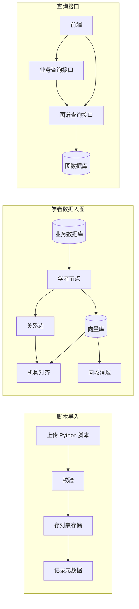
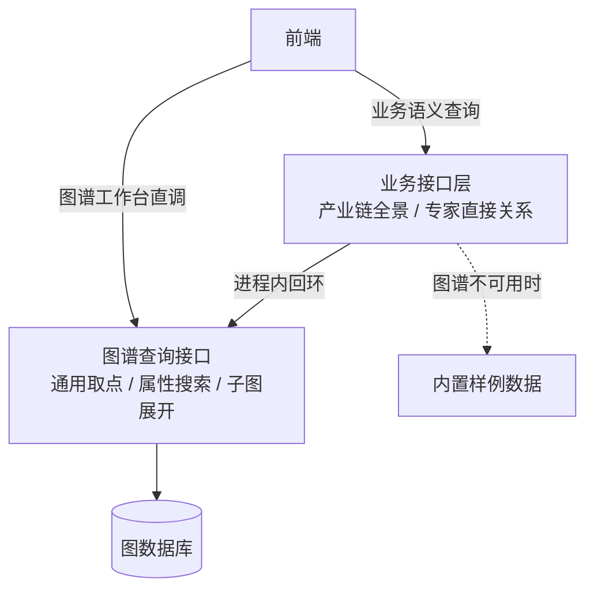
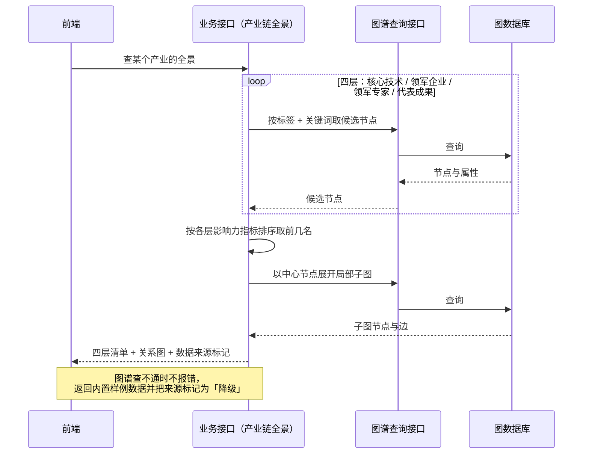
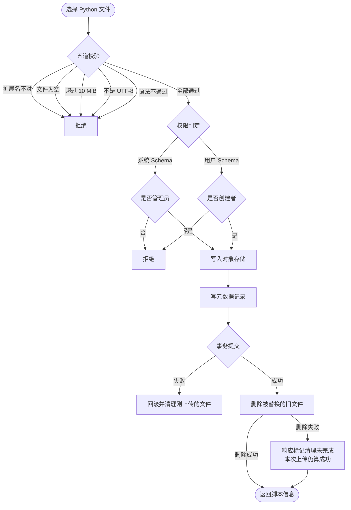
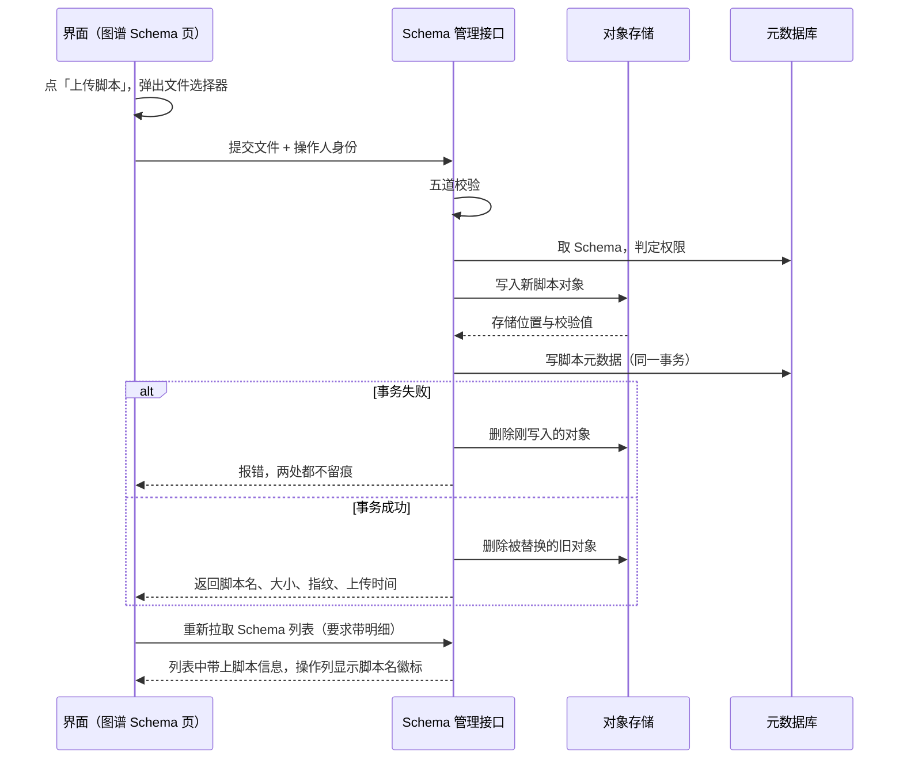
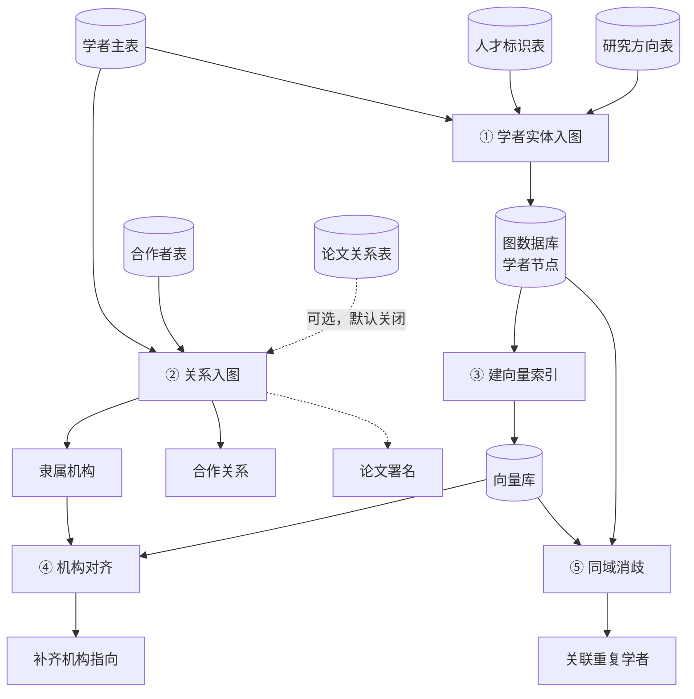

# 更新说明：学者域与产业链

## 一句话结论

学者域与产业链的代码已落地；产业链四层的图谱标签已按真实图谱（`dev` 空间）核对并修正；五个学者脚本已导入 Schema 管理，对象存储与元数据都已核对一致。学者脚本本身还没有对真实数据正式跑过。

---

## 一、三条链路的关系



三条链路互不调用。脚本只入库不执行；数据入图靠命令行手工触发；只有查询接口是线上实时的。

---

## 二、查询接口怎么分层

业务接口不直接连图数据库，中间垫了一层通用的图谱查询接口。



以「产业链全景」为例，一次请求的实际时序：



三点需要知道：

- **为什么绕一层**：业务接口只表达「我要产业链的四层内容」这种业务语义，具体怎么按标签取点、怎么展开子图统一交给下层。以后换图数据库或调查询策略，只动一层。
- **这层调用不走网络**。形式上是发 HTTP 请求，底层直接打进当前进程的路由表，没有真实网络往返。
- **降级不会返回错误码**。图谱查不通时静默返回样例数据，只在响应里放一个来源标记。前端必须读这个标记才知道数据真假——这是最容易踩的坑。

图谱查询接口不能摘除：业务接口的两层结构架在它上面，图谱工作台页面也直接在用它。

---

## 三、脚本导入怎么走

脚本是 Schema 的附件。**一个 Schema 只能挂一个脚本，再上传是替换不是追加。**



时序上看，一次上传要同时落对象存储和数据库两处：



两个值得注意的设计：

- **旧文件删不掉不影响本次上传**。清理失败只在响应里标一个字段，不回滚，避免因为一个残留文件让整次上传作废。
- **事务失败会反向清理对象存储**，不留孤儿文件。

界面上「新建 Schema」是一次请求、两阶段交互：填完表单点保存不立刻提交，先弹文件选择器，选好脚本后把表单和脚本一起发出去。

### 安全边界（重要）

**脚本只被存储，从不被加载、导入或执行。** 语法校验只确认它是一份能解析的 Python 文件，仅此而已——没有导入白名单、没有依赖检查、没有入口函数约定、没有沙箱、没有签名。界面上限制只能选 `.py` 也只是浏览器层面的筛选，不是校验。

元数据表里预留了工作流定义与入口函数两个字段，但目前没有任何代码读写它们，是留给将来做执行器的钩子。

所以现在的 Schema 脚本本质是**带版本的文档附件**，不是可执行流水线。真要让它跑起来，得另建执行器和隔离环境。

---

## 四、这次实际导入了什么

五个学者脚本各挂到语义最接近的 Schema 上：

- 学者实体入图 → `Expert`
- 关系入图 → `AFFILIATED_WITH`
- 同域消歧 → `CO_AUTHOR`
- 机构对齐 → `WORKS_AT`
- 向量索引 → `ResearchField`

机构对齐原计划挂 `Organization`，但那里已经有一份别人上传的机构入库脚本。受「一个 Schema 只能挂一个脚本」限制，挂上去会把它覆盖掉，因此改挂 `WORKS_AT`（学者与机构的任职关系，语义上同样贴合）。

Schema 定义本身没有任何改动：条数、属性、来源映射、更新时间全部未变，只是多了脚本附件。

### 踩到的配置坑

脚本对象存储的地址有一个默认值，但环境里实际部署的存储服务不在这个端口上，而所有部署都没有覆盖这个配置项——结果是**任何一次脚本上传都必然失败，且错误信息只有一句「上传失败」**，看不出根因。

补上正确的存储地址、账号和桶名并重启服务后，上传即通过。这个配置项需要补进部署说明，否则换台机器还会再踩一次。另外，同环境里其他人的服务仍是旧配置，那边的脚本下载会失败，需要各自补配置后重启。

---

## 五、学者数据怎么入图

五步，有严格的先后依赖。



**① 学者实体入图**。从学者主表逐页读取，合并人才标识与研究方向，写成图上的学者节点，每个节点都带溯源信息：来自哪个系统、哪张表、哪一行、哪个批次、什么时候写的。

这一步有个防御设计：仓库里的建表语句和真实表结构存在漂移，所以脚本不信任仓库 DDL，运行时先探测目标字段是否存在，缺了就降级处理而不是崩掉。真实环境里学者表确实没有机构 ID 字段，这条降级路径是常态而非例外——也就意味着第 ④ 步的机构对齐是必须做的，不是可选优化。

**② 关系入图**。写三类边：学者隶属机构、学者间合作、论文署名（默认关闭）。

机构这里有个关键概念叫**桩节点**：学者有机构 ID 时直接指向真实机构；只有机构名时，用机构名算哈希造一个临时节点先把边挂上。这个临时节点不代表真实机构已建立，它是留给第 ④ 步认领的。两者全缺的跳过并计数。

**③ 建向量索引**。输入是**图数据不是数据库**，从图里分页拉学者节点建索引，所以必须在 ① 之后跑。每个学者拼一段描述文本，同时建语义向量与关键词稀疏索引两种，查询时两路融合。这样查「做大模型的清华老师」和查一个具体人名，两种问法都能命中。

**④ 机构对齐**。扫描指向桩节点的隶属边，拿机构名去向量库检索真实机构，相似度过阈值就写一条等价边把桩节点认领掉，低于阈值的计入待人工处理。

**⑤ 同域消歧**。同一个人被抽成多个节点时，用四个维度打分：向量相似度（权重最高）、姓名相似度、机构相似度、研究方向重合度（权重最低）。按得分分三档：高置信直接写等价边，中间地带只写报表等人工复核，低分丢弃。

这个脚本**默认只试跑不写图**，必须显式加参数才落边——消歧判错的代价比漏判大，所以默认保守。

---

## 六、产业链四层标签的修正

产业链全景的每一层都配了一组图谱标签名和取值字段。这批配置原先是按设计假设写的，和真实图谱核对后发现三层对不上：

- 核心技术层配的三个标签在真实图谱里根本不存在，已改为图谱中实际承载技术词的标签
- 领军企业层取的机构名字段不存在，真实图谱用的是中英文双字段
- 代表成果层只取了一个标题字段，而论文、专利各有自己的中英文标题字段命名，已补齐

领军专家层原本就是对的。子图节点的显示名候选也一并放宽，否则界面上会直接露出节点 ID。

**这类错配的危险在于不会报错**：查不到就返回空，然后静默降级到样例数据，页面看起来正常但数据是假的。唯一识别办法是看响应里的来源标记。

---

## 七、验证情况

- 后端测试 336 通过、7 跳过、3 失败。3 个失败是既有问题，标记为依赖外部服务的用例，涉及模块都不在本次变更范围内。
- 脚本导入后逐项核对了三处一致：对象存储里的文件、元数据表里的记录、界面上的脚本名徽标。
- 前端零改动，未跑构建。
- 脚本尚未对真实数据正式跑过；真实数据量与表结构已核对（学者两千余条，其中机构 ID 字段缺失）。

---

## 八、待办

- 学者脚本对真实数据试跑，确认无误再正式写图
- 用真实图谱调两个业务接口，确认响应里的来源标记不是「降级」；若是「降级」说明标签仍未对上
- 把脚本对象存储的配置项补进部署说明
- 依赖锁文件需要重新生成（本地缺工具；该文件在本次改动之前就已与依赖声明不同步，属既有问题）

---

## 附、代码位置速查

需要看代码时按这里找，正文不再重复。

**脚本导入链路**
- 界面：`frontend/src/views/platform/SchemaBrowserView.vue`
- 接口层：`backend/biz/handler/schema_management.py`，基础路径 `/api/v1/schema-management`
- 业务逻辑：`backend/service/schema_management.py`
- 对象存储：`backend/infra/s3.py`，对象键格式 `schemas/{类型}/{schema_id}/{uuid}-{文件名}`
- 元数据表：`kg_schema_script`
- 配置项：`SCHEMA_ADMIN_USER_IDS`（管理员名单）、`SCHEMA_SCRIPT_MAX_BYTES`（默认 10 MiB）、`SCHEMA_S3_ENDPOINT_URL` / `SCHEMA_S3_ACCESS_KEY` / `SCHEMA_S3_SECRET_KEY` / `SCHEMA_S3_BUCKET`（对象存储，默认值与实际部署端口不一致，必须显式配置）

**学者数据入图（`backend/script/` 下，按顺序）**
1. `load_scholar_entities.py`
2. `load_scholar_relations.py`
3. `build_scholar_milvus_index.py`
4. `align_scholar_affiliations.py`
5. `dedupe_scholar_persons.py`

领域细节见 `backend/docs/scholar_relation_flow.md`。消歧可调项：`SCHOLAR_DEDUPE_TOPK`（候选数，默认 5）、`SCHOLAR_DEDUPE_HIGH`（写边阈值，默认 0.75）、`SCHOLAR_DEDUPE_MID`（报表阈值，默认 0.55）。

**查询接口**
- 图谱查询层：`backend/biz/handler/graph_search.py`
- 回环客户端：`backend/infra/graph_api_client.py`
- 产业链全景：`backend/service/industry_chain_panorama.py`，四层标签配置在文件开头
- 专家直接关系：`backend/service/expert_direct_relation.py`

**本地执行前置**

学者脚本依赖远端数据库、图服务、向量库，本地跑需要先做端口转发：

```bash
ssh -N \
  -L 3306:127.0.0.1:3306 \
  -L 8090:127.0.0.1:8090 \
  -L 19530:127.0.0.1:19531 \
  jump211
```

然后带上连接参数试跑：

```bash
cd backend
MYSQL_HOST=127.0.0.1 MYSQL_PORT=3306 MYSQL_DATABASE=gkx_element \
TRS_GRAPH_BASE_URL=http://127.0.0.1:8090 \
uv run python -m script.load_scholar_entities --dry-run
```
