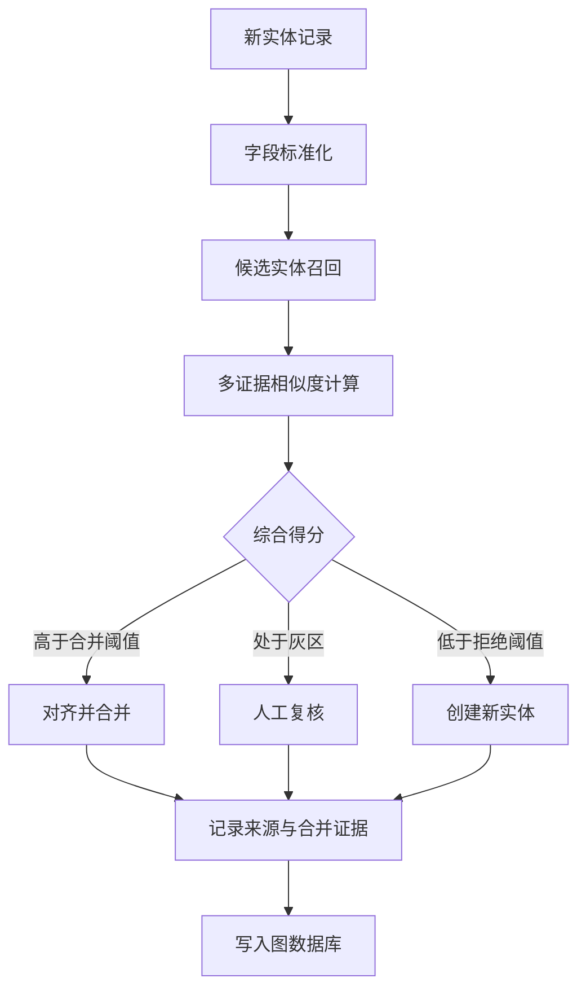
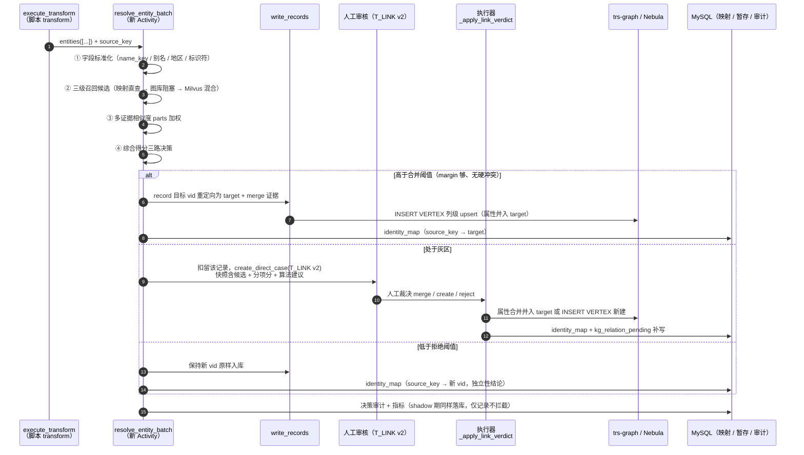

# 实体对齐三路决策改造方案（新实体入库全流程）

> 撰写日期：2026-09-17
> 代码基线：分支 `kgetl`（2026-09-15 graph-build 移交通道删除后的形态；行号以当日代码为准）
> 关联文档：
> - 《[实体消歧与入库对齐-落地方案（人工审核专项）](./实体消歧与入库对齐-落地方案（人工审核专项）.md)》——本文采纳其全部硬约束、"6 张新表裁为 2 张"、"M1 执行器先行"的分期结论，并将其 deferred 的打分/召回/阈值设计补全为完整方案
> - 《[人工审核模块](./人工审核模块.md)》《[人工审核-数据流入](./人工审核-数据流入.md)》《[人工审核-数据流出](./人工审核-数据流出.md)》——审核模块现状
> - 《[图谱构建整体工作流时序图](./图谱构建整体工作流时序图.md)》——`kg.schema.extract` 全链路
>
> 本文定位：把「字段标准化 → 候选实体召回 → 多证据相似度 → 综合得分三路决策（自动合并 / 人工复核 / 新建）→ 记录来源与合并证据 → 写入图数据库」这条目标流程，逐节点落到本仓库现有代码上。

## 一、目标流程与差距总览



各节点落地位置（目标态）：

| 节点 | 落点 |
|---|---|
| A 新实体记录 | `kg.schema.extract` 的 `execute_transform` 输出（契约不变，零脚本改动） |
| B/C/D/E | **新增 Activity `resolve_entity_batch`**，插在 `execute_transform` 与 `write_records` 之间 |
| F 对齐并合并 | 改写 record 目标 vid 后走 `write_records`；人工路径走 T_LINK 执行器 `_apply_link_verdict` |
| G 人工复核 | 人工审核模块 T_LINK v2 case（复用 `create_direct_case` + 队列/工作台） |
| H 创建新实体 | 保持新 vid 直接 `write_records` |
| I 记录来源与合并证据 | 图节点溯源/合并证据列 + `kg_entity_identity_map` + 审计 |
| J 写入图数据库 | nGQL `INSERT VERTEX` 列级幂等 upsert（复用现有两套样板） |

### 现状差距表

| # | 流程节点 | 现状 | 差距 | 改造章节 |
|---|---|---|---|---|
| A | 新实体记录 | 脚本 `transform(payload)` 输出 `{entities, edges, failures}`（`script/extract_transform_common.py` 契约） | 无"待对齐记录"概念，产出直接进写图 | §4.1 |
| B | 字段标准化 | 脚本内自行清洗；写图时 `_coerce_to_schema`（`manual_review_production.py:848`）仅对齐 schema 列 | 无对齐专用标准化层（name_key / 别名 / 地区归一） | §4.2 |
| C | 候选实体召回 | **无写前召回**。`detect_extract_collisions`（`temporal_workflows.py:1081`）写图后仅按 `props.name` 精确查图 | 多级召回（映射直查 / 图库阻塞 / 向量混合）不存在 | §4.3 |
| D | 多证据相似度 | 已有离线实现：`OrganizationHybridMatcher`（`service/organization_entity_alignment.py:258`）、学者去重 `script/dedupe_scholar_persons.py`，均不接主通道 | 主通道无打分 | §4.4 |
| E | 综合得分三路决策 | 无阈值。同名一律人工（T_LINK 全量），低置信候选走 T_DIRECT | 合并阈值 / 灰区 / 拒绝阈值三段决策不存在 | §4.5 |
| F | 对齐并合并 | T_LINK merge 裁决**只记决议不执行**（`manual_review_production.py:297`、`:328` 两处 TODO） | 合并执行器缺失 | §4.7 |
| G | 人工复核 | 模块完整（队列 / 工作台 / 状态机 / 4-eyes / 审计） | 缺证据面板输入（v2 case）、缺执行反馈态 | §4.6 |
| H | 创建新实体 | `write_records`（`temporal_workflows.py:929`）nGQL `INSERT VERTEX` | enforce 期需按决策放行 / 扣留 | §4.5、§4.7 |
| I | 记录来源与合并证据 | 机构域节点有完整溯源列；平台通道注入 `source_table/create_time/update_time` 缺省（`:1006-1014`）；case 快照带 `source_table/source_record_id` | 跨源身份映射、合并证据落图缺失 | §4.8 |
| J | 写入图数据库 | 两套样板：`write_records`（含 self-heal）与 `_write_candidate_to_graph`（`manual_review_production.py:792`） | 复用即可，需统一空值列过滤语义 | §4.9 |

## 二、现状盘点（为什么改）

### 2.1 主通道管线现状（`kg.schema.extract`）

`SchemaExtractWorkflow`（`service/temporal_workflows.py:1356` 起）每个来源绑定并发执行「1 reader + N worker」，批内顺序：

1. `read_source_batch` —— 水位 / pk keyset 或 LIMIT/OFFSET 读源；
2. `execute_transform` —— S3 脚本子进程，产出 entities / edges / failures /（可选）pendingReview；
3. `write_records`（`:929`）—— DESCRIBE TAG/EDGE 对齐列 → 注入溯源缺省 → nGQL `INSERT VERTEX/EDGE`（`Unknown column` 自动剔列重试）；
4. `detect_extract_collisions`（`:1081`，实体批次后调用，接线 `:1660`）—— `MATCH (v:\`Tag\`) WHERE v.name IN [...]` 精确同名查图，同名不同 vid（含批内互重名）→ `create_direct_case(template_id="T_LINK")`；**不阻塞写图**；
5. `build_entity_index` —— Milvus kg_entity 混合索引（失败降级）；
6. `record_extract_failures`（`:1178`）—— 逐行失败 → T_EXTRACT_FAIL；
7. `advance_schema_extract_watermark` —— 整链成功后推游标。

### 2.2 人工审核模块现状

- 事后队列（不暂停流水线）；3 个产活模板：**T_DIRECT**（accept 直写图）、**T_LINK**（同名冲突对齐裁决）、**T_EXTRACT_FAIL**（失败重跑）。
- 建案唯一入口 `create_direct_case`（`manual_review_production.py:343`），`dedupe_key = sha([task_id, step_id, object_id, sha(snapshot)])` 幂等。
- 状态机 `OPEN → CLAIMED → IN_REVIEW → PENDING_APPROVAL → RESOLVED/REJECTED`（终态集 `manual_review_domain.py:98`）；P0 / 高价值实体强制 4-eyes（提交人 ≠ 批准人）。
- **T_LINK 裁决契约已定义**（`manual_review_domain.py:78-85`）：`entityVerdict ∈ {merge, create, retype}`，merge 必填 `targetEntityId`（`validate_action :112-116`）——**缺的只是执行**：`submit`/`approve` 中为 TODO（`:297`、`:328`），裁决后直接 RESOLVED，无任何图操作。

### 2.3 可复用资产

| 组件 | 位置 | 能力 | 复用方式 |
|---|---|---|---|
| `OrganizationHybridMatcher` | `service/organization_entity_alignment.py:258` | BM25 稀疏 + 384 维哈希稠密 → Milvus `hybrid_search` top-20 召回；打分 `0.60×名称(WRatio) + 0.25×召回分 + 结构化字段加权（冲突倒扣）`，归一名精确保底 0.95；三档决策 `≥0.88 且 margin≥0.08 → matched / ≥0.76 → review / 否则 rejected`（`:409-420`） | 打分与决策结构**通用化**为 EvidenceScorer + ResolutionPolicy（§4.4/§4.5） |
| `normalize_alignment_text` / `tokenize_alignment_text` | 同文件 `:24` / `:34` | NFKC + casefold + 去标点空白；中英混合 token（2/3-gram） | 标准化层直接引用（§4.2） |
| `EntitySearchService` | `service/entity_search.py`（reindex `:349`、混合检索 `:533-705`） | kg_entity Milvus hybrid（dense + BM25 sparse，RRF），按图空间重建索引 | 召回第三级（§4.3）；enforce 期需增量化（§10 风险 5） |
| 学者域去重 | `script/dedupe_scholar_persons.py`（阈值 `:71-79`、打分 `:115-134`） | `0.40×milvus + 0.30×name + 0.20×org + 0.10×fields`；高置信写 `SAME_AS` 边（0.75/0.55） | Person 类型 policy 初始值来源 |
| 机构域溯源体系 | `script/organization_etl_common.py`（`node_provenance :1192`、`edge_provenance :1178`） | `source_system/source_table/source_record_id/ingest_batch/ingest_time/confidence` 列 | 图节点证据列口径对齐（§4.8） |
| `merge_existing_properties` | `script/organization_entity_etl.py:934-982` | 同 vid 属性合并：非空不被空覆盖、confidence 只升不降、`extra_json.source_records` 多源共存 | merge 执行器的属性合并语义（§4.7） |
| T_DIRECT 写图样板 | `manual_review_production.py:792`（`_write_candidate_to_graph`）、`:848`（`_coerce_to_schema`） | DESCRIBE 对齐 schema → nGQL `INSERT VERTEX` 列级幂等 upsert；`_` 前缀元字段防注入 | T_LINK 执行器直接照搬（§4.7/§4.9） |
| 消歧 v1 | `temporal_workflows.py:1081` | 同名冲突检测（写后） | M3 后降级为夜间巡检（§8） |
| 人工审核全套 | `service/manual_review_production.py` + 前端两视图 | 队列 / 认领 / 审批 / 审计 / 附件 | G 节点直接复用（§4.6） |

### 2.4 核心问题（改造动机）

1. **写后检测拦不住重复入库**：同名实体已先写图才发 case，图里先长出重复点，人工合并永远在还债。
2. **同名 ≠ 同实体，且同名 ≠ 唯一需要人工**：精确同名匹配既漏（name_cn/name_en/别名/缩写）又滥（所有同名都进人工），审核量随数据线性增长；而真正该自动合并的高置信重复（同一 org_id 不同写法）没人处理。
3. **T_LINK 裁决闭环断裂**：人工判了 merge 也没有任何执行，决议攒在 MySQL 里等一个不存在的"合并引擎"。
4. **无跨源身份映射**：同一来源记录重跑 / 多源写同一实体时，图上没有"来源记录 → 规范实体"的映射依据，关系端点重映射无从谈起。
5. **打分资产离线化**：完整的三路决策范式已在机构域 / 学者域离线脚本各有一份，主通道用不上。

## 三、总体设计

### 3.1 目标架构



### 3.2 硬约束（全文有效，源自评审结论，不可裁剪）

1. **关系端点必须重映射**：实体对齐后关系仍挂旧 vid 是最隐蔽的数据错误。`kg_entity_identity_map` 必须与 T_LINK 执行同批落地；enforce 期关系步写图前批量 `lookup_mapping`，端点未生效的关系进 `kg_relation_pending` 暂存。
2. **候选注入防护**：`targetEntityId` 服务端必须校验属于该 case 的候选集（v1：existing/new ids；v2：`candidates[].vid`），不在集合内直接拒绝；快照 `candidate` 的 `_` 前缀元字段不可被请求覆盖（沿用 direct_decide 原则）。
3. **空值不覆盖非空**：合并写入用列级 upsert，来源为空的列**不写**（而非写空串）；来源局部 id（org_id / company_code 等）不得覆盖规范身份字段（id/name/vid）。
4. **幂等**：重试复用同一 vid、同一逻辑键；`identity_map` 以 `(graph_space, source_key, version)` 唯一。
5. **过期结论拒绝应用**：提交裁决时校验候选集指纹，候选已变更（如算法重新打分、新候选加入）则要求刷新后重判。

### 3.3 策略与阈值（ResolutionPolicy）

打分权重与三段阈值按**实体类型**配置，随任务快照下发，带版本号可回滚：

```python
@dataclass
class ResolutionPolicy:
    policy_version: str            # 如 "org-resolution-v1"，落 case 快照与图节点证据
    entity_type: str               # Organization / Person / ...
    weights: dict[str, float]      # name / alias / identifier / region / address / retrieval
    merge_threshold: float         # 综合得分 ≥ 此值 且 margin 达标 → 自动合并
    margin_min: float              # top1 - top2 最小分差
    review_floor: float            # ≥ 此值 → 灰区人工；< 此值 → 新建
    top_k: int                     # 召回条数
    hard_conflicts: tuple[str, ...]  # 硬冲突证据码（出现即禁自动合并）
    high_value: bool               # True：自动合并降级为人工（建议徽标仍给出）
```

初始值（shadow 期校准后调整，`policy_version` 递增）：

| entity_type | 参照实现 | 权重（name/retrieval/结构化） | merge / margin / floor | 一期档位 |
|---|---|---|---|---|
| Organization | `OrganizationHybridMatcher` | 0.60 / 0.25 / 0.15 | 0.88 / 0.08 / 0.76 | shadow → enforce |
| Person | `dedupe_scholar_persons` | 0.30 / 0.40 / 0.30（org+fields） | 0.75 / 0.10 / 0.55 | 仅 shadow |
| 其他类型 | — | 同 Organization 起步 | floor=1.0（全部进灰区） | 仅 shadow 观测 |

阈值冷启动原则：**宁可灰区偏大，不可自动合并出错**。非 Organization / Person 类型一期一律人工（floor=1.0），shadow 数据攒够再放开。

## 四、流程节点详细设计

### 4.1 新实体记录（输入契约）

`execute_transform` 的输出契约**零改动**：脚本仍输出 `{"entities": [{"id": vid, "props": {...}}], "failures": [...]}`。`resolve_entity_batch` 在 activity 内为每条实体记录补充对齐上下文：

```json
{
  "vid": "org_srcA_123",
  "nodeLabel": "Organization",
  "props": {"name_cn": "XX研究院", "org_id": "123", "province": "北京市", "...": "..."},
  "sourceKey": "sha(datasource + db + table + pk + output_key)",
  "sourceTable": "example_org_table",
  "sourceRecordId": "123",
  "batchId": "..."
}
```

`sourceKey` 是身份映射与关系端点重映射的唯一逻辑键，由平台侧（非脚本）计算——脚本无感知。

### 4.2 字段标准化（EntityNormalizer）

新增 `service/entity_resolution.py::normalize_entity(record, policy)`。**标准化只产生对齐用键，不回写 props**（写图仍用脚本原值，避免标准化副作用污染业务字段）：

| 步骤 | 规则 | 输出字段 |
|---|---|---|
| 通用清洗 | NFKC、全半角归一、空白折叠、拉丁 casefold、去标点（即 `normalize_alignment_text` 语义，**不删法人后缀**） | `nameKey` |
| 别名展开 | name_cn / name_en / aliases / 缩写各生成 key | `aliasKeys[]` |
| 召回增强名 | 法人后缀剥离（参照 `enterprise_mining_disambiguator._COMPANY_SUFFIXES`）——仅用于召回与加分，不作唯一键 | `nameCore` |
| 地区归一 | 省/市全称 ↔ 简称 ↔ 行政区划别名 | `region.provinceKey / cityKey` |
| 标识符抽取 | external_id / org_id / credit_no 等局部 id | `identifiers{}` |
| 地址归一 | 去标点 + 折叠空白 | `addressKey` |

输出即 4.4 节打分的证据输入；同时携带原始字段供人工面板展示。

### 4.3 候选实体召回（三级，按成本递增）

| 级 | 通道 | 实现 | 命中语义 |
|---|---|---|---|
| T1 身份映射直查 | `kg_entity_identity_map` | `lookup_mapping(space, source_keys)` 批量 | 该来源记录**已裁决过** → 直接复用结论（vid 重定向），跳过打分；零成本、最高优先 |
| T2 图库阻塞查询 | Nebula nGQL | `nameKey/aliasKeys/name/name_cn/name_en IN [...]`（LIMIT 200）+ `identifiers` 精确等值 | 精确同名 / 同标识符集合——消歧 v1 的写前超集 |
| T3 向量混合召回 | Milvus kg_entity | `EntitySearchService` hybrid（dense + BM25 sparse，RRF）或 `OrganizationHybridMatcher` 的 BM25+哈希稠密编码，`top_k=20` | 模糊候选，携带 `retrieval_score` |

辅助规则：

- **批内互撞**：同批 `nameKey` 相同的记录先批内归组（消歧 v1 已考虑批内重名，此处前置到写前），组内以标识符 / 结构化证据决定归并或全部进灰区；
- **三级合并**：按 vid 去重，保留最高 `retrieval_score`，标记候选来源（`exact_name / identifier / vector`）；
- 召回失败（Milvus 不可用等）**降级不阻断**：仅 T2 命中照常决策，T3 缺失时自动合并档收紧为"归一名精确 + 标识符命中"，否则进灰区。

### 4.4 多证据相似度计算（EvidenceScorer）

把 `OrganizationHybridMatcher._score_hit`（`service/organization_entity_alignment.py:278`）通用化为按 policy 加权的分项打分：

```
score = Σ ( w_i × part_i ) − 冲突扣分
```

| part | 计算方法 | Organization 权重示例 |
|---|---|---|
| `name` | rapidfuzz WRatio（归一名 vs 候选 canonical_name + aliases 最大值）；归一名精确 = 1.0 | 0.60（含 alias 命中） |
| `identifier` | external_id / org_id / credit_no 精确等值 = 1.0 | 计入结构化 0.15 |
| `region` | province/city/country 精确匹配加分，**冲突倒扣** | 0.15 内 |
| `address` | addressKey WRatio ≥ 0.85 加分 | 0.15 内 |
| `retrieval` | T3 召回分（clamp 0-1） | 0.25 |
| `kind/type` | 实体类别不一致 → 硬冲突码 | — |

规则沿用：归一名精确且无硬冲突 → `score = max(score, 0.95)` 保底；输出：

```json
{
  "total": 0.91,
  "parts": {"name": 1.0, "identifier": 1.0, "region": 1.0, "address": 0.82, "retrieval": 0.74},
  "reasonCodes": ["NAME_EXACT", "ID_MATCH", "REGION_MATCH", "ADDRESS_HIGH_SIM"],
  "hardConflicts": [],
  "margin": 0.12,
  "coverage": 0.8
}
```

`coverage` = 有值证据字段占比（评审文档 v2 case 契约字段）；`margin` = top1 − top2（仅一个候选时 margin = 1.0）。

### 4.5 综合得分与三路决策

`resolve_entity_batch` 对每条记录产出 `ResolutionDecision` 后分流：

| 档 | 条件 | 动作 |
|---|---|---|
| **AUTO_MERGE** | `score ≥ merge_threshold` 且 `margin ≥ margin_min` 且无硬冲突 且非 high_value | record 目标 vid 重定向为 target，携带 merge 证据进 `write_records`（列级 upsert 并入 target）；写 `identity_map(source_key → target)` |
| **MANUAL_REVIEW**（灰区） | `review_floor ≤ score < merge_threshold`，或 margin 不足，或存在硬冲突但 score 高，或 high_value 强制 | **扣留该记录（enforce 期不进 write_records）**，`create_direct_case(T_LINK v2)`，快照含候选 + 分项分 + 算法建议 |
| **CREATE_NEW** | `score < review_floor`（或无候选命中） | 保持新 vid 原样入库；写 `identity_map(source_key → 新 vid)`，记录独立性结论（下次同源记录 T1 直查命中即复用） |

```json
{
  "decisionId": "res-...",
  "verdict": "merge | review | create",
  "targetVid": "org_x_9",
  "score": 0.91, "margin": 0.12, "coverage": 0.8,
  "reasonCodes": ["NAME_EXACT", "ID_MATCH"],
  "policyVersion": "org-resolution-v1"
}
```

所有档位（含自动档）的决策都写审计（shadow 期唯一的产出就是这批数据），供阈值校准与指标统计。

### 4.6 人工复核（T_LINK v2 case）

**case 契约**（在 v1 字段上叠加证据块，`existingCandidates/newIds` 保留——前端旧对比卡与队列筛选零改动）：

```json
{
  "_kind": "entity", "_nodeLabel": "Organization", "_origin": "pre_write",
  "name": "XX研究院",
  "newIds": ["org_srcA_123"],
  "existingCandidates": [{"vid": "org_x_9", "name": "XX研究院", "score": 0.91}],
  "resolution": {"decisionId": "res-...", "suggestedVerdict": "merge", "matchScore": 0.91,
                  "margin": 0.12, "coverage": 0.8, "reasonCodes": ["NAME_EXACT", "ADDRESS_MATCH"],
                  "policyVersion": "org-resolution-v1"},
  "candidates": [
    {"vid": "org_x_9", "score": 0.91,
     "parts": {"name": 1.0, "address": 0.82, "region": 1.0},
     "props": {"name": "...", "province": "...", "address": "..."}}
  ],
  "incoming": {"vid": "org_srcA_123",
               "props": {"org_id": "123", "name_cn": "XX研究院", "province": "北京市"},
               "sourceTable": "example_org_table", "sourceRecordId": "123"}
}
```

- 建案复用 `create_direct_case`（template_id=T_LINK、pipeline_step=align、dedupe_key 幂等、confidence<0.7 → P0）；
- **P1 低风险默认路径**：新增 `link_decide` 单步裁决（裁决即执行，与 direct_decide 同款乐观锁）；
- **P0 / 高价值**：沿用 `submit` → `approve` 两步链，`approve` 成功后执行；
- 两代 case 以快照是否含 `incoming` 字段判定（不新增数据库列）：v1 存量走现有左右对比卡，v2 渲染证据面板。

### 4.7 对齐并合并 / 创建新实体（执行器）

新增 `manual_review_production.py::_apply_link_verdict(c, verdict, target_vid, identity)`，动作语义按 case 来源分支：

| 动作 | v1 存量 case（实体已在图） | v2 写前 case（实体未入图） |
|---|---|---|
| `merge`（targetEntityId） | ① 属性合并写入 target：nGQL `INSERT VERTEX` 列级 upsert（**空值列不写**＝不覆盖非空；来源局部 id 列剔除）② `identity_map`：newIds（除 target）→ target ③ **不删旧点不迁边**（物理合并是 M4 治理任务，映射层归一） | ① `incoming.props` 属性合并写入 target（同规则）② `identity_map`：source_key → target ③ 补写 `kg_relation_pending` 中以该记录为端点的关系 |
| `create` | 确认"并非同一实体"：不写图、不建映射，RESOLVED（记录独立性结论） | ① `INSERT VERTEX` 写入 `incoming.vid`（复用 `_write_candidate_to_graph` 实体分支的 coerce + 幂等模式）② `identity_map`：source_key → 新 vid ③ 补写 pending 关系 |
| `retype` | 返回"暂不支持：请驳回后修正脚本重跑"（域模型枚举保留） | 同左 |
| `reject-candidate` | REJECTED，记录否定证据（哪些候选被否定，供召回端学习） | 同左 + incoming 记录标记 SKIPPED（不写图） |

属性合并规则（两代通用，对齐 `merge_existing_properties` 语义）：

- 规范身份字段（id/name/vid）以 target 现值为准；来源 `org_id/company_code` 等局部标识进 `extra_json` 或丢弃（审计只记字段名不记值，参照 direct_decide `:760-769`）；
- `confidence` 只升不降；
- `extra_json.source_records` 追加 `{"table:record": 原始行}`，多源共存；
- `_coerce_to_schema` 对齐目标 tag schema（避免 Unknown column 400）。

**执行顺序与失败语义**：图写成功 → `identity_map` 落库 → pending 关系补写 → case RESOLVED；任一步失败 → case 进 **APPLY_FAILED**（非终态），`retry_apply` 幂等重放 `decision.result` 中的裁决（同 vid upsert）。执行前后各留一条审计 `LINK_APPLIED`（verdict / target / 映射条数）。

### 4.8 记录来源与合并证据

三处留痕，互为印证：

| 载体 | 内容 |
|---|---|
| **图节点属性** | 溯源列沿用现有口径：`source_table/source_record_id/ingest_batch/ingest_time/update_time/confidence`（平台通道缺省注入已有）；**新增合并证据列** `match_method`（`auto_resolution / manual_review / exact`）+ `match_evidence`（JSON：parts / reasonCodes / policyVersion / decisionId）。merge 时 target 的 `update_time` 刷新 |
| **MySQL `kg_entity_identity_map`** | source_key → canonical_vid 映射，`decision_ref` 指向审核 decision id 或 shadow decisionId——关系端点重映射的唯一依据 |
| **审核留痕** | `manual_review_decision.result`（裁决全文）+ `manual_review_audit_log`（状态迁移 + LINK_APPLIED）；灰区进人工的，算法建议与人工结论的偏差是阈值校准的直接输入 |

指标（一期 6 项，从 identity_map + case 表聚合，不单独建表）：`received / autoMerged / created / pendingReview / graphApplied / applyFailed`。

### 4.9 写入图数据库

统一约定（两套样板合并为同一语义）：

1. 先 `DESCRIBE TAG/EDGE` 对齐列类型（string 列数值转字符串）；
2. **来源为空的列不进 INSERT 列清单**（列级 upsert：不写该列＝保留旧值；严禁写空串覆盖）；
3. nGQL `INSERT VERTEX \`Tag\`(cols) VALUES "vid":(...)` 幂等 upsert；**严禁 REST `/nodes/merge`**（会把 id/name/vid 从属性剥离导致 NOT NULL 列 400）；
4. `Unknown column` 自动剔列重试（沿用 `write_with_self_heal`）；
5. AUTO_MERGE 路径由 `write_records` 执行（target vid + 合并后的属性）；人工路径由 `_apply_link_verdict` 执行——同一套渲染函数，不同调用方。

## 五、数据模型变更（一期两张新表）

```sql
-- 来源记录 → 规范实体映射（关系重映射的唯一依据；merge/create 执行器与图写同批落库）
CREATE TABLE kg_entity_identity_map (
  id            BIGINT AUTO_INCREMENT PRIMARY KEY,
  graph_space   VARCHAR(64)  NOT NULL,
  source_key    VARCHAR(255) NOT NULL,  -- datasource+db+table+pk+output_key 哈希
  source_raw    VARCHAR(512) NOT NULL,  -- 原始组成字段（审计）
  entity_type   VARCHAR(64)  NOT NULL,
  canonical_vid VARCHAR(255) NOT NULL,
  decision_ref  VARCHAR(64)  NOT NULL,  -- 审核 decision id / shadow decisionId
  status        VARCHAR(16)  NOT NULL DEFAULT 'ACTIVE',  -- ACTIVE / REVOKED
  version       INT NOT NULL DEFAULT 1,
  created_at    DATETIME, updated_at DATETIME,
  UNIQUE KEY uk_map (graph_space, source_key, version),
  KEY idx_vid (graph_space, canonical_vid)
);

-- 端点尚在审核中的关系暂存（M3 起 resolve 阶段写入；T_LINK 应用后补写）
CREATE TABLE kg_relation_pending (
  id           BIGINT AUTO_INCREMENT PRIMARY KEY,
  graph_space  VARCHAR(64)  NOT NULL,
  edge_type    VARCHAR(64)  NOT NULL,
  src_source_key VARCHAR(255) NOT NULL,
  dst_source_key VARCHAR(255) NOT NULL,
  props_json   JSON,
  source_table VARCHAR(128), source_record_id VARCHAR(128),
  status       VARCHAR(16)  NOT NULL DEFAULT 'PENDING',  -- PENDING / APPLIED / DROPPED
  created_at   DATETIME, applied_at DATETIME,
  UNIQUE KEY uk_rel (graph_space, edge_type, src_source_key, dst_source_key, source_record_id)
);
```

- 决策 / 审计**不建新表**：一审一决策复用 `manual_review_decision` + `manual_review_audit_log`；算法证据随 case 快照走；shadow 决策（无 case）只写 identity_map（decision_ref 指向 shadow decisionId）+ JSONL 审计。
- **状态机扩展**：`APPLY_FAILED` 加入 case 状态，**不进** `TERMINAL_STATUSES`（`manual_review_domain.py:98`）——队列 pending/processed 口径（`:118-119` 按 `NOT IN / IN` 终态切）自动把它归入"待处理"，语义正确；`retry_apply` 成功后 → RESOLVED。

## 六、后端服务与 API 变更

| 文件 | 改动 |
|---|---|
| `service/entity_resolution.py`（新） | `normalize_entity` / 三级召回 / `EvidenceScorer` / `ResolutionPolicy` / `resolve_batch`（纯函数内核，便于单测与 shadow 复用） |
| `service/temporal_workflows.py` | 新 Activity `resolve_entity_batch`（M2 shadow / M3 enforce），插在 `execute_transform` 与 `write_records` 之间；关系步写图前批量 `lookup_mapping` 重映射端点；`detect_extract_collisions` M3 后降级夜间巡检（按 source_key 去重，不再重复建案） |
| `service/manual_review_production.py` | 新增 `link_decide` / `_apply_link_verdict` / `retry_apply`；`submit`/`approve` 的 TODO（`:297`/`:328`）替换为执行器调用；`list_cases` 支持 `status=APPLY_FAILED` 精确过滤 |
| `service/manual_review_domain.py` | `write_target("T_LINK")` 文案（`:136`）更新为「实体对齐决议（merge 绑定规范实体并属性归并，create 新建入库）」；`APPLY_FAILED` 状态常量 |
| `dao/entity_resolution.py`（新） | `bind_mapping` / `lookup_mapping`（批量）/ `pending_relations_for` |
| `db_model/entity_resolution.py`（新） | 两张表 ORM |
| `biz/handler/manual_review.py` | 2 个新端点（下表） |
| `biz/schemas/manual_review_production.py` | `LinkDecideRequest`（verdict 枚举 + 条件必填 targetEntityId，复用 validate_action 语义） |

API 变更：

| 端点 | 方法 | 说明 |
|---|---|---|
| `/manual-reviews/production/{id}/link-decide` | POST | `{version, verdict, targetEntityId?, note}`；P1 直判即执行 |
| `/manual-reviews/production/{id}/retry-apply` | POST | APPLY_FAILED 重试，幂等 |
| `/manual-reviews/production/{id}` | GET | 详情增加 `resolution` 证据块 + `applyStatus/applyError` |
| `/manual-reviews/production/queue` | GET | 支持 `status=APPLY_FAILED` 精确过滤 |
| `/manual-reviews/production/resolution-stats` | GET | 6 项指标（聚合查询，可后置） |

## 七、前端改造

**ManualReviewWorkspaceView.vue（T_LINK 工作台升级）**：

- 快照含 `candidates`（v2）→ 渲染**证据面板**：候选列表（前 5）名称 / 区域 / 地址 / 标识符 + 分项分条（name/address/region/other）+ 总分徽标 + 与次名候选的分差；算法建议徽标（`suggestedVerdict` + matchScore + coverage + 原因标签 + policyVersion）；待入库记录卡（incoming：来源表 / 记录 ID / 原始字段折叠展开）；
- 决策区三选一：**并入所选候选**（选中行高亮 → merge）/ **确认为新实体**（create）/ **均不匹配**（reject）；v1/v2 的 create 文案区分（v2 才有"写图"含义）；
- 快照无 `candidates`（v1 存量）→ 现有左右对比卡，零改动兼容；
- 裁决结果三态：已入库（RESOLVED）/ 应用失败（APPLY_FAILED + "重试应用"按钮）/ 已驳回。

**OperationsCenterView.vue（队列）**：A 类筛选追加「应用失败」（`status=APPLY_FAILED` 精确过滤）；行内操作追加「重试应用」；状态徽标 `is-应用失败`（红）。

**workflowOperations.ts**：`linkDecide` / `retryApply` 两个 client 函数。

## 八、实施分期与工作量

```text
M1 执行器期（人工审核专项，先行——无论算法何时上线，执行能力都是闭环末端）
    T_LINK 裁决真实执行：link_decide / _apply_link_verdict / identity_map / APPLY_FAILED / 前端证据面板
    用存量同名冲突 case 驱动开发验证，不接抽取管线
M2 影子期
    resolve_entity_batch Activity（shadow：只记决策与建议，不拦截写图）
    建表回填、阈值校准（复用 OrganizationHybridMatcher 打分结构）
M3 生效期
    enforce：MANUAL_REVIEW 记录扣留不写图 → T_LINK v2 case（写前契约）
    AUTO_MERGE 改写 vid 并入 / CREATE_NEW 直接入库
    关系端点重映射 + kg_relation_pending 补写
    detect_extract_collisions 降级为夜间巡检（防新旧两套审核单并存）
M4 治理期（二期）
    轻量 outbox、索引代次切换、Person 独立策略、存量重复节点物理合并、旁路写入收口
```

| 阶段 | 内容 | 估算 |
|---|---|---|
| M1-1 | 两张表 + dao + db_model | 0.5 天 |
| M1-2 | `_apply_link_verdict` 四动作 + `link_decide` + submit/approve 接线 + 状态机 | 2 天 |
| M1-3 | 2 个 API 端点 + schemas | 0.5 天 |
| M1-4 | 前端证据面板 + 队列筛选/重试 | 2 天 |
| M1-5 | 单测（动作语义 / 注入拒绝 / 幂等重试 / 空值保护）+ 存量 case 手工验证 | 1.5 天 |
| M2 | `service/entity_resolution.py`（标准化/召回/打分/决策）+ Activity shadow 接线 + 校准脚本 | 4-5 天 |
| M3 | enforce 扣留 + 关系重映射 + 巡检降级 | 3-4 天 |

Temporal 兼容：新增 Activity 改变命令序列，在途执行按旧版本自然结束（dev 在途量小），必要时用 workflow 版本 API 分支。

## 九、验收清单（按流程节点）

| 流程节点 | 场景 | 预期 |
|---|---|---|
| B/C/D 标准化召回打分 | 同名不同写法 / 别名 / 缩写 | nameKey 归一命中；T2 精确 + T3 向量均召回 target 且分项分正确 |
| E 三路决策 | score 0.95 margin 0.2 | AUTO_MERGE，队列无 case |
| E 三路决策 | score 0.80（灰区） | 扣留 + v2 case（enforce）；shadow 期仅审计 |
| E 三路决策 | score 0.30 | CREATE_NEW，新 vid 入图 + 映射 |
| E 三路决策 | 硬冲突（country/type）+ 高分 | 不自动合并，进灰区 |
| F/G 人工 merge | v1 存量 case | target 属性合并更新（非空不被空覆盖）；identity_map 生成 newIds→target；case RESOLVED；审计两条 |
| F/G 人工 merge | v2 case | 属性并入 target；映射生效；pending 关系补写 |
| F/G 人工 create | v2 case | `incoming.vid` 新实体入图（幂等 upsert）；映射生效 |
| 安全 | targetEntityId 不在候选集 | 400 校验错误，case 状态不变 |
| 安全 | 提交时候选集已变更 | 拒绝过期应用，要求刷新 |
| 可靠性 | 图写失败（模拟 trs-graph 500） | case → APPLY_FAILED；队列可见；retry_apply 幂等重试成功后 RESOLVED；不伪报完成 |
| 可靠性 | 同批重跑 / 重试重放 | 同 vid 同逻辑键幂等，identity_map 不产生重复版本 |
| I 来源与证据 | AUTO_MERGE 后查 target 节点 | `match_method/match_evidence`（含 policyVersion、decisionId）+ `update_time` 刷新；identity_map 可反查 |
| J 写图 | 合并写入 | nGQL 语句不含来源为空列（单测断言）；不走 /nodes/merge |
| 前端 | 两代 case | v1 渲染旧对比卡；v2 渲染证据面板；互不干扰 |
| 队列 | APPLY_FAILED 筛选 | 仅返回应用失败行；行内重试可用 |

## 十、风险与开放问题

1. **同名多候选的 v1 merge 粒度**：v1 case 的 newIds 互相之间是否同实体并不确定（同名 ≠ 同实体），一期 merge 只做"全部指向 target"的映射归一，物理正确性依赖 M4 治理——审核 UI 文案需明示。
2. **identity_map 与旁路写入的一致性**：机构域 ETL、T_DIRECT、旧脚本等直写图的路径不产生 source_key，映射表覆盖不到；一期接受（这些路径本就不消歧），M4 收口。
3. **属性合并的 nGQL 语义**：INSERT VERTEX 列级 upsert 意味着"不写该列＝保留旧值"，实现时必须按 target 现值过滤掉来源为空的列，而不是写空串。
4. **两代 case 的 `_origin` 判定**：以快照是否含 `incoming` 字段为准，不新增数据库列。
5. **Milvus 索引新鲜度**：enforce 期写图后 kg_entity 索引若不增量更新，后续批次召回会漏掉刚入库的实体——批内互撞归组是兜底，M3 需给 `EntitySearchService` 补增量 add（reindex 全量仅作夜间修复）。
6. **阈值冷启动**：前两周灰区可能偏大（人工量上升），靠 shadow 期校准 + `policy_version` 可回滚；非 Organization/Person 类型一期 floor=1.0 全人工。
7. **双轨并存**：M3 前 `detect_extract_collisions` 仍会产生 v1 case；M3 切换后按 source_key 去重防重复审核单，并保留夜间巡检防旁路写入产生同名。
8. **开放问题**：`retype` 动作一期不执行（用"驳回 + 修正脚本重跑"覆盖场景，域模型枚举保留）；`kg_entity_resolution_decision` 独立决策表是否需要，待 M2 shadow 评估后定。
