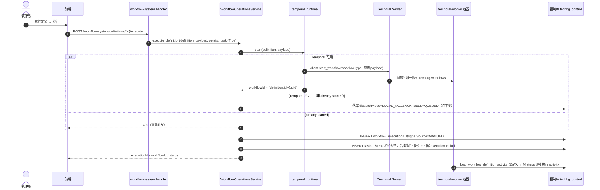
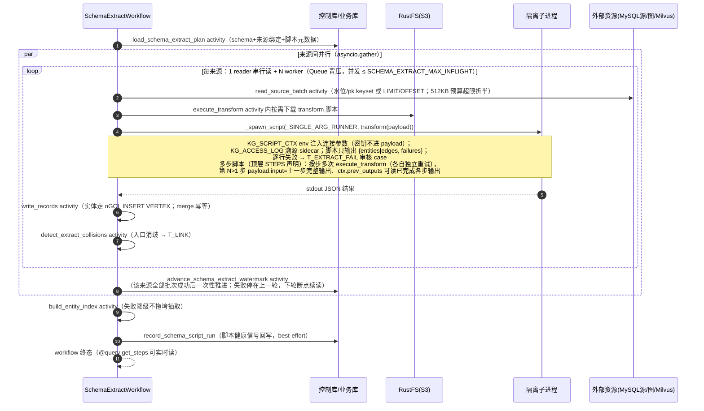
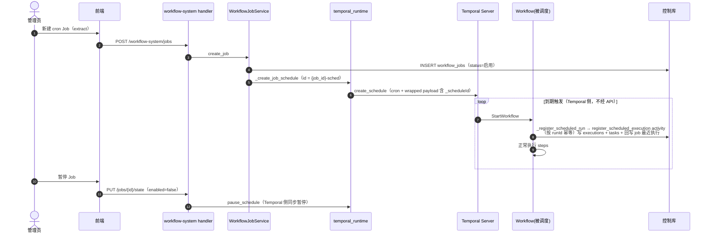
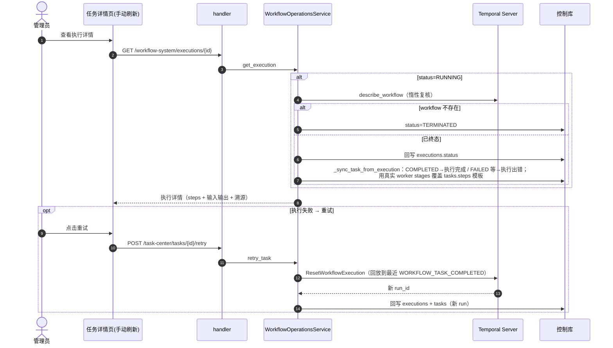

# 工作流系统模块（代码结构 / 表结构 / 功能说明 / 时序图）

> 前端路由 `/graph-build`（图谱构建 Job 列表）、`/graph-build/jobs/:jobId` 等任务详情页；API 前缀 `/api/v1/workflow-system`，注册在 **admin 路由组**。任务中心 `/api/v1/task-center` 同为 admin 组，读同一套控制面表。
>
> **⚠️ CLAUDE.md 三处描述已过时**（与当前代码不符，勘误依据 commit `fd7d134`、`932fc82`，`docs/spec-lang-system-spec.md:35` 亦有记录）：
> 1. 控制面**不是 SQLite**（`WORKFLOW_DATABASE_PATH` 在代码中零引用）——是 **MySQL `techkg_control`**（`infra/workflow_mysql.py`，跑在 temporal-mysql 实例，env `WORKFLOW_MYSQL_*`）；
> 2. API 进程内 Temporal worker **已删除**——唯一 worker 是 `temporal-worker` 容器（`script/run_temporal_worker.py`）；
> 3. "用户工作流组合已注册算子"**不成立**——工作流 step 从不引用算子名；算子注册表更已于 2026-09-14（D4）整体下线（见 `docs/算子注册模块.md` 顶部注记）。

## 一、功能描述

Temporal 驱动的异步任务引擎 + MySQL 控制面，承担：工作流定义管理、执行与状态回写、定时调度（Schedule/Job）、任务中心视图、失败重试。

### 1. 工作流定义（declarative + extract 两类 sourceKind）

| workflowType | sourceKind | steps 结构 | 执行方式 |
|---|---|---|---|
| `kg.custom.configurable` | declarative | 名称/中文标签列表 | workflow 内联**纯记账 stub**（回显 payload，不引用算子、不做真实 ETL；C1 范畴保留） |
| `kg.schema.extract` | extract | `["extract"]`（Schema 目录合成） | 见 `docs/Schema管理模块.md` 5.3 |

> 2026-09-14 D2/D3 收敛：`kg.custom.python` / `kg.custom.steps` / `kg.custom.chain`（独立脚本上传通道）与 `kg.entity.*` / `kg.relation.*` / `kg.graph.build`（builtin 域 stub 族）均已删除——用户代码唯一入口是 Schema 管理上传，唯一执行引擎是 `kg.schema.extract`；`execute_kg_step` 空壳 activity 一并移除（configurable 改为内联记账）。

脚本统一由 `_spawn_script` 启动隔离子进程：`KG_SCRIPT_CTX` env 注入连接参数（**密钥不进 workflow payload**）、`KG_ACCESS_LOG` 溯源 sidecar、backend+sdk 进 PYTHONPATH（`kg.schema.extract` 的 `execute_transform` 共用该 runner）。

**与 Schema 管理的桥（已拆除，2026-09-14 D1）**：历史上 Schema 页上传抽取脚本时会经 `_register_workflow` 把同一脚本注册成 `kg.custom.python` 定义（定义列表里的 `schema-*` 条目）。该化身已删除——Schema 脚本唯一执行通道是 `kg.schema.extract` 合成定义；控制库残留的 `schema-%` 定义行需人工清理（保留 `schema-extract-%` 合成定义）。

### 2. 执行与状态回写

- `execute_definition`：Temporal `start_workflow`（workflowId = `{definition.id}-{uuid}`，declarative 的 payload 包装为 `{definitionId, payload}`，extract 直传）→ 写 `workflow_executions`（triggerSource=MANUAL/SCHEDULE/RERUN、dispatchMode=TEMPORAL/TEMPORAL_SCHEDULE/LOCAL_FALLBACK）→ persist_task 时写 `tasks` 行（steps 初始为空，由 `_sync_task_from_execution` 惰性回填）。
- **Temporal 不可用降级**：`dispatchMode=LOCAL_FALLBACK, status=QUEUED` 落库待下发；"already started" → 409。
- **状态回写是惰性的**：`get_execution`/`list_jobs` 读到 RUNNING 才向 Temporal describe 刷新（workflow 不存在→TERMINATED）；终态后 `_sync_task_from_execution` 回写 tasks（COMPLETED→执行完成 / FAILED 等→执行出错），并用真实 worker stages 覆盖 steps 模板；失败补查用 `@query get_steps`。前端**无 SSE 无轮询**，新鲜度全靠这条惰性复核链。

### 3. 定时调度

- **Schedule**（定义级）：`create_schedule` 先删同名再建 `ScheduleSpec(cron, tz)`；Temporal 不可用降级仅存本地。
- **Job**（任务中心的用户视图，唯一 taskType：`extract`——D2 后 single/chain/upload 停止新建，存量行触发会因 workflow 未注册而失败）：cron Job 自动建 `{job_id}-sched` Schedule；启停 Job 同步 pause/resume Schedule。
- **Schedule 直发 workflow 不经 API**：workflow `run()` 开头 `_register_scheduled_run` → `register_scheduled_execution` activity（按 runId 幂等）补写 executions+tasks，并回写 Job 最近执行。
- 自动抽取策略（update_policy）：频率（每天/每12小时/…）映射 cron，为**每个可抽取 schema**（已传脚本且绑定来源）维护 `auto-extract-{schemaId}` Schedule（保存策略时快照刷新；D3 重指向，旧 `auto-graph-build` 清理见 SQL 清单）。

### 4. 失败重试

`POST /tasks/{id}/retry` → Temporal **`ResetWorkflowExecution`** 回放到最近 WORKFLOW_TASK_COMPLETED，新 run_id 回写 executions+tasks。

### 5. Retry storm 防护（保护 trs-graph session pool）

- 全局 activity RetryPolicy：initial 2s / backoff 2.0 / max 30s / **maximum_attempts=5**；
- worker 并发 `TEMPORAL_MAX_CONCURRENT_ACTIVITIES`（默认 4）；per-step RetryPolicy 缺省 maximumAttempts=1（不重试）；
- 单批字节预算 512KB，超限折半 LIMIT，防 gRPC 4MB ResourceExhausted 无限重试；抽取并发 `SCHEMA_EXTRACT_MAX_INFLIGHT` 默认 3、硬上限 8。

## 二、代码结构

```
backend/
├── biz/handler/workflow_system.py      # 19 端点（definitions[declarative]、execute、
│                                       #   executions、schedules、jobs CRUD/trigger/state）
├── biz/handler/task_center.py          # /task-center：overview/batches/tasks/retry/update-policy/trigger
├── biz/schemas/workflow_operations.py  # 请求模型（注意：无 workflow_system.py，模型都在这里）
├── application/
│   ├── workflow_operations.py          # WorkflowOperationsApplication（薄门面单例）
│   └── workflow_jobs.py                # WorkflowJobApplication
├── service/
│   ├── workflow_operations.py          # 执行/状态回写/Schedule/update_policy（~700 行）
│   ├── workflow_jobs.py                # Job CRUD、cron 映射、_refresh_running_jobs
│   ├── workflow_repository.py          # 控制面仓储（~1160 行，SQLAlchemy → techkg_control）
│   ├── workflow_models.py              # 控制面 ORM（Base，被 schema_management 的表共用）
│   ├── temporal_runtime.py             # Temporal client 封装：start/describe/schedule/reset/run_worker
│   ├── temporal_workflows.py           # 2 个 Workflow 类（configurable/extract）+ 12 个 activity（队列唯一）
│   └── script_watermark.py / stage_normalizer.py
├── infra/workflow_mysql.py             # 控制库引擎（WORKFLOW_MYSQL_* → techkg_control，库不存在自动建）
└── script/run_temporal_worker.py       # 唯一 worker 入口（temporal-worker 容器）

frontend/src/
├── views/platform/GraphBuildView.vue           # /graph-build Job 列表（无轮询，手动刷新）
├── views/platform/ProcessInstanceDetailView.vue # 任务/Job/执行详情（steps/输入输出/溯源/retry）
├── components/JobLaunchDialog.vue              # 新建 Job（唯一类型 extract：选 schema + 批大小）
└── api/workflowOperations.ts                   # task-center + 生产审核 + workflow-system 全部 client
```

### API 一览

`/api/v1/workflow-system`（admin 组，`biz/handler/workflow_system.py`，19 个端点）：

| 端点 | 作用 |
|---|---|
| `GET /health` | Temporal 连接健康状态 |
| `GET /definitions` | 定义列表（category 过滤：entity/relation/graph/custom；结果缓存） |
| `POST /definitions` | 创建 declarative 定义（kg.custom.configurable，steps 跑记账 stub） |
| `GET /definitions/{id}` | 单个定义（404 处理） |
| `POST /definitions/{id}/execute` | 执行定义（校验资源选择器归属；already started → 409；Temporal 不可用降级 LOCAL_FALLBACK） |
| `GET /executions` | 执行记录列表（limit/definitionId/scheduleId/triggerSource 过滤） |
| `GET /executions/{id}` | 执行详情（RUNNING 时惰性向 Temporal 刷新并回写 tasks） |
| `GET /schedules` | Schedule 列表 |
| `POST /definitions/{id}/schedules` | 创建 cron Schedule（Temporal 不可用降级仅存本地） |
| `PUT /schedules/{id}/state` | 暂停/恢复 Schedule |
| `POST /schedules/{id}/trigger` | 立即触发一次 Schedule |
| `DELETE /schedules/{id}` | 删除 Schedule（本地 + Temporal） |
| `GET /jobs` | 任务中心 Job 列表（name/status/taskType 过滤） |
| `POST /jobs` | 创建 Job（taskType 仅 extract；其余历史值拒绝） |
| `GET /jobs/{id}` | Job 详情 + 执行历史（读路径惰性刷新 RUNNING） |
| `POST /jobs/{id}/trigger` | 手动触发 Job |
| `PUT /jobs/{id}/state` | 启用/暂停 Job（同步 pause Temporal Schedule） |
| `PUT /jobs/{id}` | 编辑 Job（名称/脚本顺序/资源选择器/cron） |
| `DELETE /jobs/{id}` | 删除 Job（执行历史保留） |

> D2 已下线三个脚本上传端点：`POST /definitions/python|steps|chains`（现返回 404/405）——脚本唯一上传入口收敛到 Schema 管理。

`/api/v1/task-center`（admin 组，`biz/handler/task_center.py`，读同一套控制面表）：

| 端点 | 作用 |
|---|---|
| `GET /overview` | 任务总览（tasks/batches/source_updates/update_policy 聚合） |
| `GET /batches` | 批次列表 |
| `GET /tasks` | 任务列表（筛选 + 分页） |
| `GET /tasks/{task_id}` | 任务详情（附 `@query get_steps` 实时步骤状态） |
| `POST /tasks/{task_id}/retry` | 失败重试（Temporal ResetWorkflowExecution 回放，新 run_id 回写） |
| `GET /data-sources/updates` | 源更新增量（source_updates 表） |
| `GET /update-policy` / `PUT /update-policy` | 读/写自动抽取策略（频率映射 cron，每 schema 一个 auto-extract-* Schedule） |
| `POST /trigger` | 立即触发全量抽取（遍历可抽取 schema 逐个启动 kg.schema.extract，D3 重指向） |

## 三、表结构（控制库 `techkg_control`，与业务库解耦）

| 表 | 用途 | 关键列 |
|---|---|---|
| `workflow_definitions` | 工作流定义 | id(PK)、workflow_type(idx，**无 UNIQUE**——python 类多定义共享)、category(idx)、active、payload（sourceKind/steps/taskQueue/scriptPath…） |
| `workflow_executions` | 执行记录 | id(PK)、definition_id、workflow_id(idx)、run_id、status(idx)（RUNNING/COMPLETED/FAILED/CANCELED/TERMINATED/TIMED_OUT/QUEUED，Temporal 状态字串）、job_id(idx)、payload（triggerSource、dispatchMode） |
| `workflow_schedules` | Schedule | id、definition_id、active、payload |
| `workflow_jobs` | 任务中心 Job | id、name(idx)、task_type(idx)（D2 后仅新增 extract，存量 single/chain/upload 待清理）、definition_id、owner(idx)、status（启用/暂停）、schedule_kind(once/cron)、cron、payload |
| `tasks` | 任务中心任务行 | id、batch_id、stage、**task_status(idx)**（执行中/执行出错/等待人工审核/执行完成）、domain、kind、processed_at(idx)、payload |
| `batches` | 批次 | id、update_date(idx)、payload(LONGTEXT) |
| `source_updates` | 源更新水位 | seq(自增)、domain、detected_at、payload |
| `settings` | KV 设置 | key(PK)、payload（如 update_policy） |

同库还有 Schema 管理五表（见 `docs/Schema管理模块.md`）与 `kg_entity_search_state`。legacy 演示审核表 `reviews` 已随批次 3 删除（配套 `DROP TABLE reviews` 待人工执行，见清理清单 1.2）。注意 **`kg_script_watermark` 在业务库**（Base 不同）。

## 四、关键 env

`TEMPORAL_ADDRESS`（默认 localhost:7233）、`TEMPORAL_NAMESPACE`、`TEMPORAL_TASK_QUEUE`（tech-kg-workflows，**全部 workflow 注册到这唯一队列**）、`TEMPORAL_MAX_CONCURRENT_ACTIVITIES`（4）、`WORKFLOW_MYSQL_HOST/PORT/DATABASE/USERNAME/PASSWORD`（temporal-mysql:3306/techkg_control）、`SCHEMA_EXTRACT_MAX_INFLIGHT` 等。（`WORKFLOW_SCRIPT_DIR` 与 api/worker 共享 `workflow-state` 卷已随 D6 于 2026-09-14 退场——用户脚本全在 S3，worker 按需下载，该卷仅剩 worker 本地运行态。）

## 五、工作时序图

### 5.1 手动执行工作流定义（含 Temporal 不可用降级）



### 5.2 kg.schema.extract 逐批执行（读源 → transform 子进程 → 入库）



> 旧 `kg.custom.steps`（多步流水线上传通道）与 `kg.custom.python`（单脚本上传）的逐步执行图已随 D2 删除——两通道的时序与上图子进程 runner 机制一致，仅 steps 数组来源不同。多步能力已于 2026-09-15 并入 `kg.schema.extract` 主通道：用户在 Schema 脚本顶层声明 `STEPS` 清单（不再有独立上传通道/双参 runner），平台按序逐步执行 `execute_transform`，语义详见 `docs/Schema管理模块.md` 第 4 节。

### 5.3 cron Job / Schedule 定时触发（不经 API 的落库闭环）



### 5.4 状态惰性回写与失败重试


