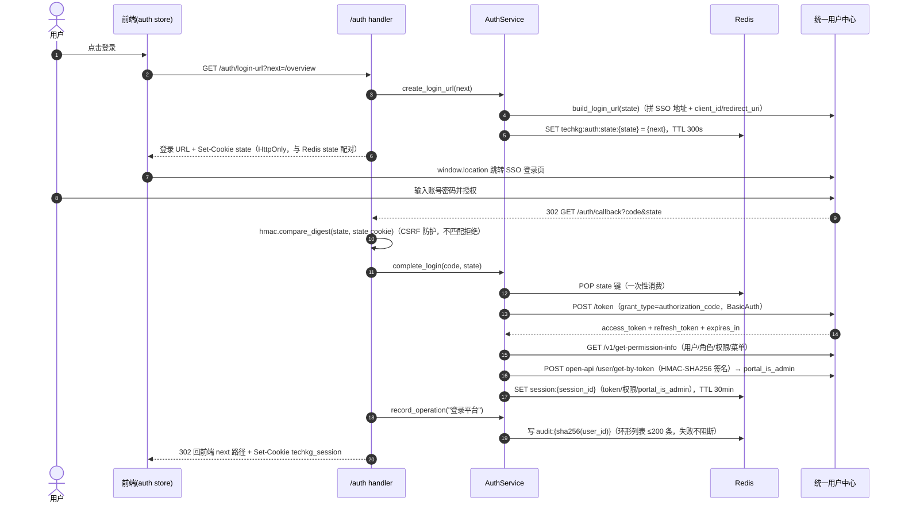
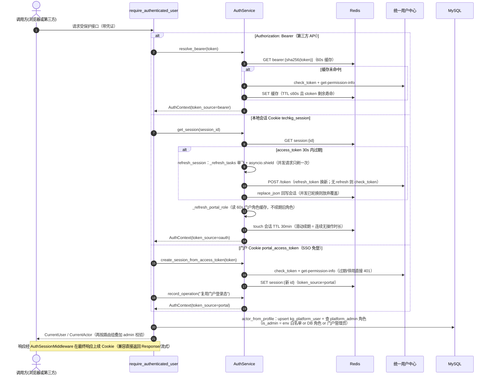
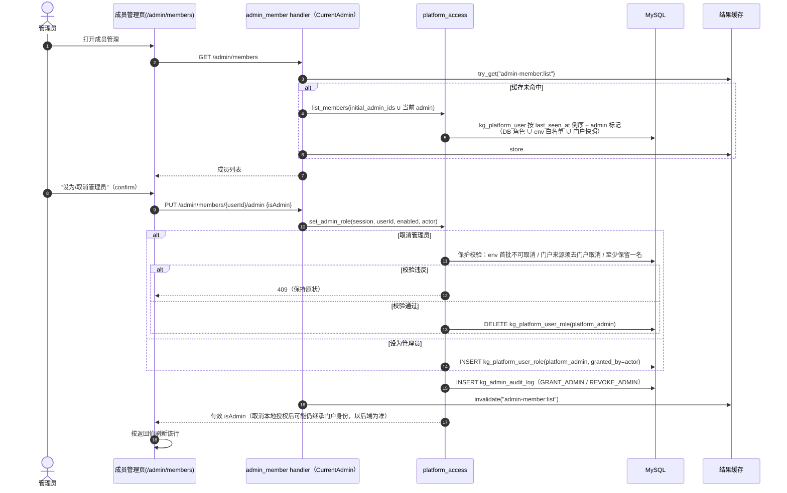
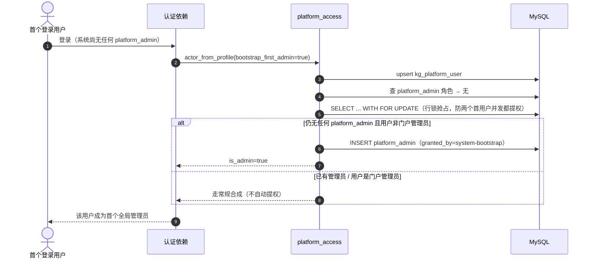

# 用户管理与权限模块（代码结构 / 表结构 / 功能说明）

> 覆盖两大块：**认证**（统一用户中心 OAuth2 + 本地 Redis 会话，"你是谁"）与**授权**（本地平台角色/权限 + 成员管理，"你能干什么"）。
> 相关既有文档：`docs/unified-auth-setup.md`（统一认证接入）、`docs/kgetl-role-access.md`（角色访问矩阵）。

## 一、功能描述

### 1. 认证（`AUTH_ENABLED` 总开关）

TODO(zhangzhong): 登陆认证和API认证是不是做成两套？研究一下登陆的文件，让周威和天驰整理一下SSO，门户接入配置的流程

- **`AUTH_ENABLED=false` 时默认拒绝**所有受保护接口；仅 `APP_ENV ∈ {dev,development,local,test}` 且显式开 `AUTH_ALLOW_INSECURE_DEV_CONTEXT` 才放行模拟管理员 `dev_context()`——防生产误配后匿名提权。
- **三条登录路径**（`require_authenticated_user` 内按序尝试）：
  1. **Bearer token**（第三方 API 调用）：`Authorization: Bearer <token>` → `check_token` + `get_permission_info`，结果按 `sha256(token)` 缓存 Redis（`AUTH_BEARER_CACHE_TTL_SECONDS`，默认 60s）。
  2. **本地会话 Cookie**（`techkg_session`，名字可配 `AUTH_SESSION_COOKIE`）：Redis 会话 id；命中后 token 快过期时自动用 refresh_token 换新（并发去重：`_refresh_tasks` + `asyncio.shield`，避免并发请求重复刷新互相覆盖）。
  3. **门户 Cookie SSO**（生产默认，`USER_CENTER_PORTAL_COOKIE_LOGIN_ENABLED=true`）：浏览器带来的门户 `portal_access_token` cookie → 校验后转换成本地 Redis 会话（`token_source=portal`），并记录"复用门户登录态"操作审计。
- **OAuth2 授权码登录**（人工登录入口）：`GET /auth/login-url` 生成 state（存 Redis 300s + 下发 state cookie）→ 跳统一用户中心 SSO → `GET /auth/callback` 用 `hmac.compare_digest` 比对 state cookie 防 CSRF → `exchange_code` 换 token → 建本地会话 → 302 回前端。
- **会话生命周期**：Redis 存储，默认 **30 分钟空闲超时**（每次已认证请求 touch 续期，配置表达"连续无操作时长"）；`POST /auth/refresh` 手动续期；logout 删本地会话 + 调用户中心远端撤销（仅 oauth/bearer 来源；门户共享 token 由门户退出流程负责，不能让其它系统登录态半失效）。
- **门户管理员身份**：`portal_is_admin` 来自用户中心 open-api `get-by-token`（HMAC-SHA256 签名）返回的 `gkxUser.role == 1`，每次请求读取独立短期缓存（默认 60s，不续期旧角色），身份不一致/账号停用直接拒绝。
- **操作审计**：登录、复用门户登录态、退出等写入 Redis 每用户环形列表（默认 200 条 / 90 天 TTL），`GET /auth/operation-logs` 分页+筛选查询；审计写入失败不阻断登录。

### 2. 授权（平台角色模型）

- **身份合成**（`actor_from_profile`，每请求执行，不信任前端传入身份）：

  ```
  is_admin = bootstrap_admin（env 白名单 PLATFORM_INITIAL_ADMIN_USER_IDS 或认证未启用）
          or database_admin（kg_platform_user_role 表有 platform_admin 角色）
          or portal_admin（统一用户中心门户管理员）
  ```

- **权限集**（`PlatformActor.permissions`）：
  - 普通用户：`analysis:read`、`correction:submit`
  - 管理员追加：`admin:access`、`correction:review`、`correction:sync`、`member:manage`、`schema:manage`、`workflow:manage`
  - dev_context / 用户中心授予 `*` 时通配放行（`require_permission`）
- **副作用**：每次认证成功 upsert `kg_platform_user`（刷新 `last_seen_at`）+ 同步门户角色快照（role_code=`portal_admin_snapshot`，**仅供成员列表展示**，绝不作为本地授权依据）。
- **首管理员引导**：`PLATFORM_BOOTSTRAP_FIRST_ADMIN=true` 时，DB 无任何 `platform_admin` 且用户非门户管理员 → `with_for_update` 抢锁后把当前登录用户提为管理员（`granted_by=system-bootstrap`）。
- **降级**：角色表不可用时登录仍可用（走 bootstrap_admin），管理写操作经自己的 DB 依赖明确报错。
- **免认证模式性能优化**：进程内 `_DEV_ACTOR_UPSERTED` 集合避免每请求 upsert 同一用户行——否则 500 并发下该行成为 InnoDB 行锁热点，管理端吞吐被串行化。

### 3. 成员管理（`/admin/members`，仅管理员）

- **列表**：所有登录过本系统的用户（`kg_platform_user` 按 `last_seen_at` 倒序）+ admin 标记（DB 角色 ∪ env 首批白名单 ∪ 门户快照）；走结果缓存，角色变更时失效。
- **设/取消管理员**（`PUT /{user_id}/admin`）三条保护规则（409）：
  1. env 配置的首批管理员不能在页面取消；
  2. 管理员身份来自门户的（有 portal 快照、无本地角色），须去门户取消；
  3. 至少保留一名本地管理员（除非还有 env 白名单或操作者本身是门户管理员）。
- 每次变更写 `kg_admin_audit_log`（GRANT_ADMIN / REVOKE_ADMIN）。

### 4. 前端

- **路由守卫**（`router.beforeEach`）：每次导航重新拉 `profile`（及时反映门户/本系统的授权与撤权）；`meta.admin` 且非管理员 → `/forbidden`；`meta.permission` 校验；非管理员访问 `/overview` 重定向 `/expert-direct`；未登录 → 跳登录（`loginRedirect`）。
- **auth store**（pinia）：`loadCurrentUser`（会话版本化 + WeakMap 去重并发加载）、`startLogin`（拿 login-url 跳用户中心）、`logout`（本地必清 + 尽力远端撤销）；401 → invalidate。
- **门户 iframe 桥接**（`portal/iframeBridge.ts`）：嵌入统一门户时桥接门户登录态。
- **视图**：`views/auth/`（Login、UserCenter、AccountSecurity=读 `/auth/security`、OperationLogs=读 `/auth/operation-logs`、AccessDenied）、`views/admin/MemberManagementView.vue`（成员表格 + 统计卡 + 设/取消管理员；auth 关闭且开启示例回退时展示 mock 数据）。

## 二、代码结构

### 后端

```
backend/
├── config/auth.py                 # AuthSettings.from_env()：全部 AUTH_/USER_CENTER_/PLATFORM_* env
├── infra/
│   ├── user_center.py             # 统一用户中心 OAuth2 客户端（BasicAuth；open-api 走 HMAC-SHA256 签名）
│   └── redis.py                   # AsyncJsonStore（会话/state/bearer/审计的 KV 存取原语）
├── service/
│   ├── auth.py                    # AuthService：login-url/callback、会话存取续期刷新、
│   │                              #   resolve_bearer、门户会话转换、logout、审计读写、profile 解析
│   └── platform_access.py         # PlatformActor、角色合成、list_members、set_admin_role
├── application/auth.py            # AuthApplication 门面（进程单例 get_auth_application），
│                                  #   profile() 在用户中心身份上附加 platform_roles/permissions/is_admin
├── biz/
│   ├── handler/auth.py            # /auth 路由（login-url、callback、me、permissions、security、
│   │                              #   operation-logs、refresh、logout）
│   ├── handler/admin_member.py    # /admin/members 路由（admin 组）
│   ├── dependencies/auth.py       # require_authenticated_user / CurrentUser / CurrentActor /
│   │                              #   require_platform_admin / CurrentAdmin / require_permission(perm)
│   ├── auth_cookies.py            # AuthSessionMiddleware（响应级续 Cookie，兼容直接返回 Response/
│   │                              #   流式响应）+ set_session_cookie + portal_sso_blocked
│   └── schemas/auth.py            # AuthProfile/UserProfile/RoleSummary/MenuSummary/OperationLog* 等
└── db_model/platform_governance.py # PlatformUser / PlatformUserRole / AdminAuditLog
```

路由挂载（`biz/router/register.py`）：`auth_router` **免依赖挂载**（登录入口本身不能要求登录）；`admin_member_router` 在 **admin 组**（`require_authenticated_user` + `require_platform_admin`）；业务路由在 protected 组（仅 `require_authenticated_user`，细粒度用 `require_permission` / `CurrentActor` 的 owner 隔离）。

### API 一览

`/api/v1/auth/*`（免鉴权挂载，`biz/handler/auth.py`）：

| 端点 | 作用 |
|---|---|
| `GET /auth/login-url?next=` | 获取统一用户中心登录 URL（state 存 Redis + 下发 state cookie，TTL 300s） |
| `GET /auth/callback` | OAuth2 授权码回调（校验 state cookie → 换 token → 建会话 → 302 回前端；`include_in_schema=False`） |
| `GET /auth/me` | 当前用户 profile（用户中心身份 + platform_roles/platform_permissions/is_admin） |
| `GET /auth/permissions` | 当前权限集摘要 |
| `GET /auth/security` | 账号安全信息（会话剩余时长/绑定建议/管理入口 URL） |
| `GET /auth/operation-logs` | 操作日志分页查询（category/result/keyword 筛选；dev 模式回退 mock） |
| `POST /auth/refresh` | 手动续期会话（refresh_token 换新） |
| `POST /auth/logout` | 退出（删本地会话 + 尽力远端撤销） |

`/api/v1/admin/members`（admin 组，`biz/handler/admin_member.py`）：

| 端点 | 作用 |
|---|---|
| `GET /admin/members` | 成员列表（结果缓存 `admin-member:list`；admin 标记 = DB 角色 ∪ env 白名单 ∪ 门户快照） |
| `PUT /admin/members/{user_id}/admin` | 设/取消全局管理员（404 未登录过；409 触发三条保护规则；写审计） |

### 前端

```
frontend/src/
├── stores/auth.ts                 # pinia auth store（版本化并发去重）
├── api/auth.ts                    # getLoginUrl/getCurrentProfile/refresh/logout 等
├── api/currentUser.ts             # currentUserId()（供配置管理 owner 参数）/ currentUserIsAdmin()
├── router/index.ts                # beforeEach 守卫（admin/permission/登录跳转）
├── auth/sessionVersion.ts         # 会话版本（登出/失效后作废进行中的加载）
├── auth/sessionRecovery.ts        # installSessionRecovery(router)
├── portal/iframeBridge.ts         # 门户 iframe 登录态桥接
├── views/auth/                    # Login / UserCenter / AccountSecurity / OperationLogs / AccessDenied
└── views/admin/MemberManagementView.vue
```

## 三、表结构与存储

### MySQL（3 张表，`db_model/platform_governance.py`）

**`kg_platform_user`** — 登录过本系统的用户（首次认证自动插入，不存密码，密码归用户中心）

| 列 | 类型 | 说明 |
| --- | --- | --- |
| user_id | VARCHAR(128) PK | 统一用户中心用户 id |
| username / nickname | VARCHAR(128) | |
| email | VARCHAR(255) | |
| last_seen_at / created_at / updated_at | DATETIME | server_default=now()；updated_at onupdate=now() |

**`kg_platform_user_role`** — 角色授予

| 列 | 类型 | 说明 |
| --- | --- | --- |
| id | VARCHAR(36) PK | UUID |
| user_id | VARCHAR(128) FK→kg_platform_user.user_id **ON DELETE CASCADE** | |
| role_code | VARCHAR(32) | `platform_admin`（本地管理员，授权依据）/ `portal_admin_snapshot`（门户角色快照，仅展示） |
| granted_by | VARCHAR(128) | 操作者 user_id 或 `system-bootstrap` / `user-center` |
| created_at | DATETIME | |

约束：`UNIQUE(user_id, role_code)`；索引 `role_code`。

**`kg_admin_audit_log`** — 管理操作审计

| 列 | 类型 | 说明 |
| --- | --- | --- |
| id | VARCHAR(36) PK | UUID |
| actor_id / actor_name | VARCHAR(128) | |
| action | VARCHAR(64) | 如 GRANT_ADMIN / REVOKE_ADMIN |
| resource_type / resource_id | VARCHAR(64) / VARCHAR(256) | |
| detail | JSON | |
| created_at | DATETIME | |

索引：`(actor_id, created_at)`、`(resource_type, resource_id)`。

### Redis 键（AuthService 前缀，均带 TTL）

| 键 | TTL | 内容 |
| --- | --- | --- |
| `techkg:auth:state:{state}` | 300s（`AUTH_STATE_TTL_SECONDS`） | OAuth2 state → next 路径 |
| `techkg:auth:session:{session_id}` | 30min 空闲（`AUTH_SESSION_TTL_SECONDS`，每请求 touch） | access_token/refresh_token/expires_at/permission_info/portal_is_admin/token_source |
| `techkg:auth:bearer:{sha256(token)}` | 60s（`AUTH_BEARER_CACHE_TTL_SECONDS`） | Bearer 解析缓存 |
| `techkg:auth:audit:{sha256(user_id)}` | 90d，每用户最多 200 条 | 操作日志环形列表 |
| `techkg:auth:portal-role:{client_id}:{sha256(token)}` | 60s | 门户管理员身份短期缓存 |

## 四、关键环境变量

| 变量 | 默认 | 作用 |
| --- | --- | --- |
| `AUTH_ENABLED` | true | 认证总开关 |
| `AUTH_ALLOW_INSECURE_DEV_CONTEXT` | false | 免认证放行（仅 dev/test 环境生效） |
| `USER_CENTER_CLIENT_ID` / `USER_CENTER_CLIENT_SECRET` | 空 | OAuth2 凭据（必配） |
| `USER_CENTER_PORTAL_COOKIE_LOGIN_ENABLED` | false | 门户 Cookie SSO（生产默认开） |
| `USER_CENTER_PORTAL_ADMIN_ENABLED` | true | 是否采信门户管理员身份 |
| `AUTH_SESSION_TTL_SECONDS` | 1800 | 会话空闲超时 |
| `PLATFORM_INITIAL_ADMIN_USER_IDS` | 空 | 首批管理员白名单（不可页面取消） |
| `PLATFORM_BOOTSTRAP_FIRST_ADMIN` | false | 首登录用户自动提权 |
| `PLATFORM_DEV_FIRST_USER_ADMIN` | false | dev 环境第一个用户当管理员 |

## 五、工作时序图

### 5.1 OAuth2 授权码登录（人工登录入口）



### 5.2 受保护请求的鉴权解析（Bearer / 本地会话 / 门户 Cookie 三路径）



### 5.3 成员管理：设/取消全局管理员



### 5.4 首管理员引导（PLATFORM_BOOTSTRAP_FIRST_ADMIN）


