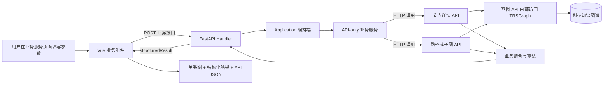
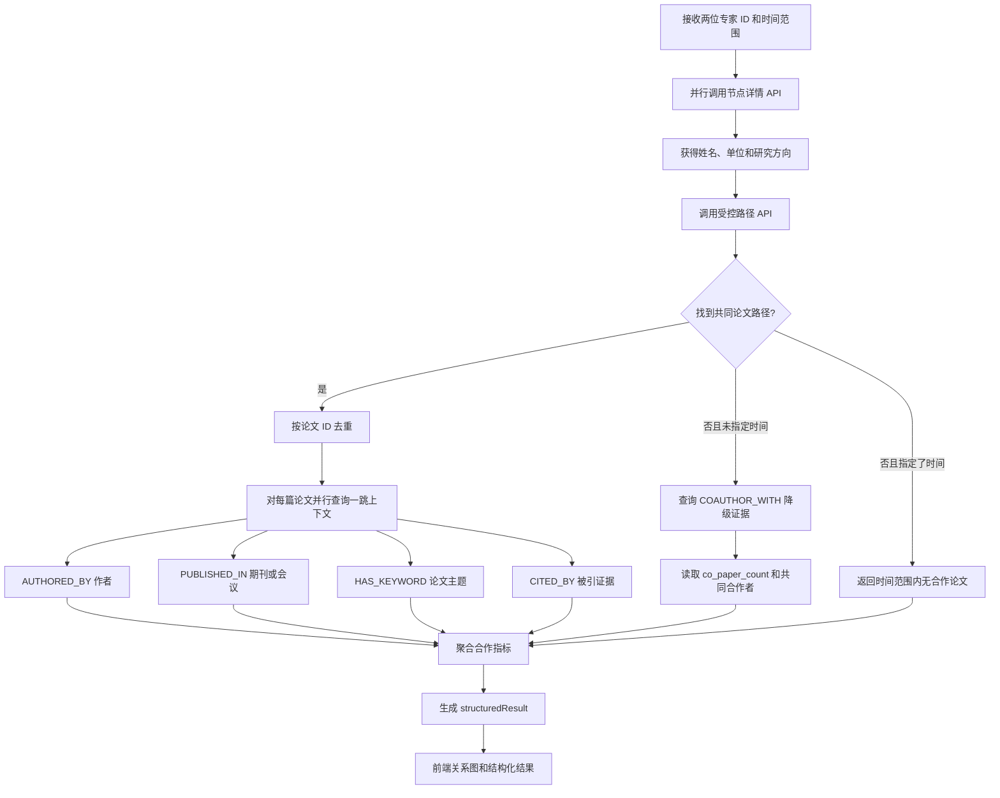
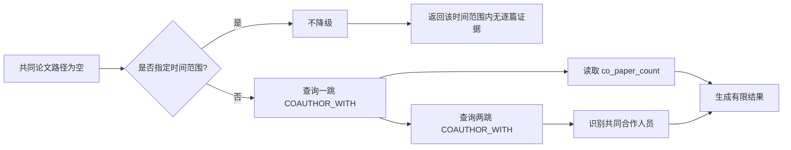
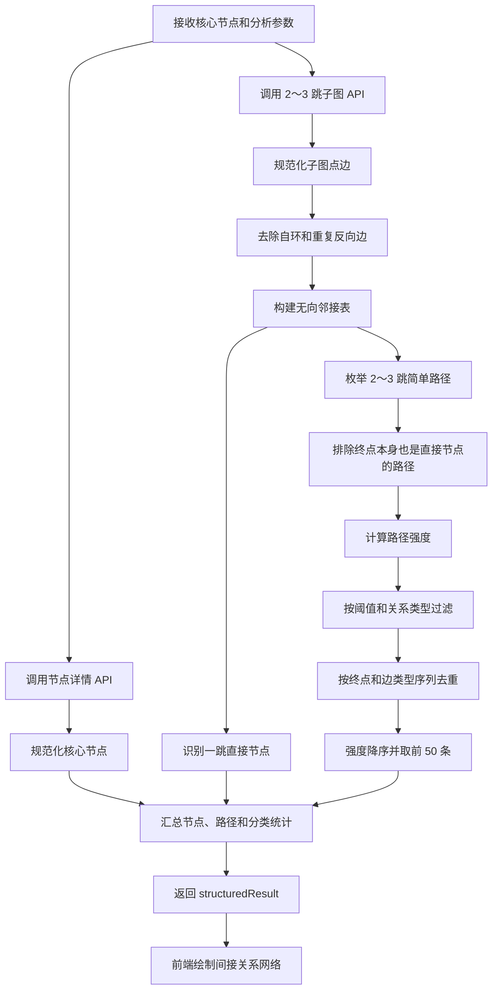
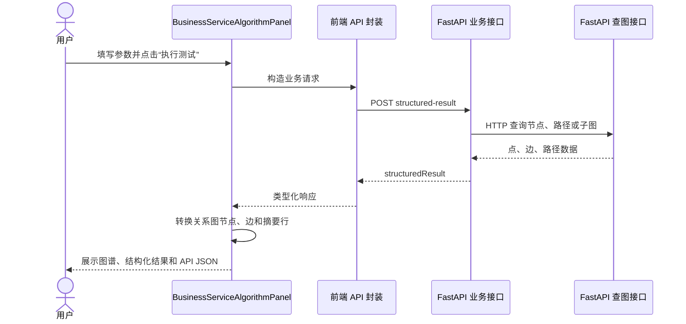

# 科技专家论文合作关系与单节点间接关系实现说明

> 文档状态：已按当前代码实现整理
>
> 适用项目：`tech-kg-api`
>
> 涉及业务：科技专家论文合作关系、科技单节点间接关系

## 1. 实现结论

两项业务均已实现，并已接入现有“业务服务”前端页面进行可视化展示。

实现遵循同一个关键约束：**业务服务只能通过 FastAPI 对外 API 获取图数据，不直接访问图数据库、MySQL、DAO 或图数据库 SDK。** 图数据库的访问仍封装在查图 API 内部，这样本项目自身与第三方厂商使用的是同一套原子能力。

| 业务 | 是否可实现 | 使用的查图原子能力 | 是否新增原子能力 |
|---|---|---|---|
| 科技专家论文合作关系 | 可以 | 节点详情、受控多跳路径、节点子图 | 是，新增受控多跳路径查询 |
| 科技单节点间接关系 | 可以 | 节点详情、多层节点子图 | 否，现有子图查询已足够 |

## 2. 总体架构



调用边界如下：

```text
前端
  -> FastAPI 业务接口
     -> Application
        -> API-only Service
           -> FastAPI 查图接口
              -> TRSGraphClient
                 -> trs-graph-service / NebulaGraph
```

业务服务中的 `GraphSearchApiClient` 和 `GraphQueryApiClient` 均使用 `httpx.AsyncClient` 发起 HTTP 请求。它们不导入 `dao`、`infra.graph_db`、SQLAlchemy 或数据库模型。

## 3. API 清单

### 3.1 面向业务调用方的接口

| 业务 | 方法与地址 | 用途 |
|---|---|---|
| 论文合作关系 | `POST /api/v1/kg-construction/expert-paper-cooperation-relations/demo/structured-result` | 输入两位专家与可选时间范围，返回论文合作分析结果 |
| 单节点间接关系 | `POST /api/v1/kg-construction/expert-indirect-relations/demo/structured-result` | 输入核心节点、路径深度、关系类型和阈值，返回间接关系网络 |

### 3.2 业务内部复用的查图原子接口

| 原子接口 | 论文合作 | 单节点间接关系 | 作用 |
|---|:---:|:---:|---|
| `GET /api/v1/graph-search/nodes/{node_id}` | 是 | 是 | 获取核心专家或人才节点属性 |
| `POST /api/v1/graph-search/paths/search` | 是 | 否 | 按边类型、方向、目标标签和属性条件查询 1～4 跳路径 |
| `GET /api/v1/graph-search/subgraph/{node_id}` | 是 | 是 | 获取论文一跳上下文，或核心节点 2～3 跳子图 |

## 4. 科技专家论文合作关系

### 4.1 业务输入

```json
{
  "dataSource": "knowledge_graph",
  "expertAId": "4P566No1",
  "expertBId": "d492835p",
  "startTime": "2021-01-01",
  "endTime": "2024-12-31"
}
```

`startTime` 和 `endTime` 可以不传。两个专家 ID 不能相同，日期需要满足 `YYYY-MM-DD`，且开始时间不能晚于结束时间。

当前前端固定使用 `knowledge_graph` 数据源，因为本业务的证据来自已入图的论文实体和关系。Schema 为后续厂商接入保留了其他数据源枚举，但当前算法不会绕过查图 API 直接查询这些外部数据库。

### 4.2 为什么增加受控多跳查询

原有子图 API 可以返回某节点周围的点和边，但无法同时表达以下精确条件：

- 从指定专家出发；
- 第一跳沿 `AUTHORED_BY` 的反向到达 `Paper`；
- 可在论文节点上按 `publication_year` 过滤；
- 第二跳沿 `AUTHORED_BY` 正向到达另一位指定专家；
- 支持分页，避免一次返回过多路径。

因此新增了原子能力：

```text
POST /api/v1/graph-search/paths/search
```

它不是任意图查询接口。调用方只能提交经过 Pydantic 校验的以下内容：

- 1～4 个路径步骤；
- 每一步的边类型、方向和目标节点标签；
- 最多 10 个目标节点属性过滤条件；
- `eq/ne/gt/gte/lt/lte` 六种比较操作；
- 每页最多 200 条路径。

服务端对图标签、边类型和属性名使用标识符白名单，对标量值转义，再编译为只读 `MATCH` 查询。调用方不能提交任意 nGQL，也不能通过该接口写图。

### 4.3 主分析流程



共同论文的路径模型为：

```text
Person A <-[:AUTHORED_BY]- Paper -[:AUTHORED_BY]-> Person B
```

对应的受控路径请求示意如下：

```json
{
  "sourceId": "person_4P566No1",
  "targetId": "person_d492835p",
  "steps": [
    {
      "edgeType": "AUTHORED_BY",
      "direction": "in",
      "targetLabel": "Paper",
      "targetFilters": [
        { "property": "publication_year", "operator": "gte", "value": "2021" },
        { "property": "publication_year", "operator": "lte", "value": "2024" }
      ]
    },
    {
      "edgeType": "AUTHORED_BY",
      "direction": "out",
      "targetLabel": "Person",
      "targetFilters": []
    }
  ],
  "limit": 200,
  "offset": 0,
  "space": "dev"
}
```

### 4.4 指标如何计算

| 输出指标 | 计算依据 |
|---|---|
| 作者列表 | 两个专家节点的 `name_zh` 或 `name_en` |
| 作者单位 | 专家节点的 `scholar_org` |
| 合作发表时间 | 共同论文最早与最晚 `publication_year` |
| 论文主题 | 共同论文通过 `HAS_KEYWORD` 连接的关键词，按出现频次取前 8 个；无关键词时使用双方研究方向补充 |
| 合作论文数量 | 共同论文按论文节点 ID 去重后的数量 |
| 期刊/会议级别 | 先按论文类型区分期刊或会议，再从发表载体读取 JCR、中科院、分区、Top、SCI 等属性 |
| 被引情况 | 优先读取路径边上的 `citations`；否则对 `CITED_BY` 证据去重计数 |
| 合作频次 | 当前合规简化实现等于合作论文数量 |
| 核心合作人员 | 共同论文中的其他作者按共同出现次数降序取前 5 个 |
| 稳定团队成员 | 其他作者至少共同出现 2 篇论文，并且覆盖至少 2 个不同年份，最多返回 5 人 |
| 共同贡献 | 根据是否有联合产出、被引、跨机构以及主研究主题生成可解释标签 |
| 学术影响评分 | `min(99.5, 论文数 × 6.5 + 总被引 / max(18, 论文数 × 3) + 已分级成果数 × 4)` |

### 4.5 图数据不完整时的降级策略

部分图空间只有专家之间聚合后的 `COAUTHOR_WITH` 边，并没有完整的 `Person-Paper-Person` 作者路径。为了不把已有合作事实误判成“没有合作”，实现了保守降级：



降级只使用图中已经存在的事实，不反推不存在的论文明细：

- 可返回合作论文总量和核心共同合作者；
- 论文主题可使用专家研究方向作为补充信息；
- 合作年份、期刊会议级别和逐篇被引情况保持空值或 `0`；
- 因缺少逐年共同作者证据，不会误判为长期稳定团队。

这一处理保证“有多少证据就输出多少结论”，避免生成无法追溯的业务数据。

### 4.6 业务响应结构

```json
{
  "structuredResult": {
    "authorList": ["专家 A", "专家 B"],
    "authorUnits": ["机构 A", "机构 B"],
    "cooperationTimeRange": {
      "startYear": 2021,
      "endYear": 2024,
      "displayText": "2021 - 2024"
    },
    "paperTopics": ["医学影像", "人工智能"],
    "cooperationPaperCount": 12,
    "journalLevelCount": { "JCR-Q1": 5 },
    "conferenceLevelCount": { "未分级": 2 },
    "citation": { "total": 160, "max": 42 },
    "cooperationFrequency": 12,
    "academicImpactScore": 99.5,
    "stableTeamMembers": ["合作人员甲"],
    "coreCollaborators": ["合作人员甲", "合作人员乙"],
    "sharedContribution": ["联合论文产出", "持续学术影响"]
  }
}
```

上例用于说明字段结构，不代表当前图空间的固定结果。

## 5. 科技单节点间接关系

### 5.1 业务输入

```json
{
  "core_node_id": "4P566No1",
  "relation_types": ["学术关联", "机构关联"],
  "path_depth": 2,
  "min_strength": 0.65
}
```

参数约束：

- `core_node_id`：核心专家或人才节点 ID；
- `relation_types`：最多 6 项，空数组表示不过滤类型；既支持中文分类名，也支持图中的边类型；
- `path_depth`：只允许 2 或 3 跳；
- `min_strength`：`0～1`。

### 5.2 为什么没有新增多跳 API

这个业务围绕一个核心节点探索其周边网络，不要求像论文合作那样约束每一跳的固定边类型和终点。因此现有接口已经能够一次返回所需数据：

```text
GET /api/v1/graph-search/subgraph/{node_id}
    ?depth=2
    &limit=200
    &direction=both
    &space=dev
```

路径重建、强度计算、关系分类和排序属于业务算法，放在 API-only 业务服务中完成。这样没有为了一个简单业务重复增加与子图查询重叠的原子接口。

### 5.3 分析流程



### 5.4 路径判定

实现将子图中的关系作为可双向探索的关联证据。例如图中边的存储方向是 `Paper -> Person`，从人员节点分析社交网络时仍可沿该关系反向找到论文节点。

满足以下条件的路径才作为间接关系候选：

- 从核心节点开始；
- 路径长度至少 2 跳，最多为请求的 `path_depth`；
- 路径中不重复经过同一节点，避免环路；
- 终点不是核心节点的一跳直接邻居；
- 路径强度达到 `min_strength`；
- 路径分类或原始边类型符合 `relation_types` 过滤条件。

同一个间接节点可能有多条传递路径。当前按“终点节点 + 边类型序列”去重，保留强度最高的路径，因此既避免完全重复，也保留不同关系链带来的多种解释。

### 5.5 关联强度算法

单边强度按以下优先级取得：

1. 如果边上存在 `confidence`、`score` 或 `relation_strength`，直接归一化到 `0～1`；
2. 如果是论文合作边且有 `co_paper_count` 或 `cooperation_count`，使用对数归一化：

```text
edgeStrength = min(0.95, 0.6 + log(1 + count) / log(201) × 0.35)
```

3. 否则使用各关系类型的默认权重，例如任职关系 `0.88～0.90`、共同作者 `0.84`、论文作者 `0.86`、引用关系 `0.72`；未配置类型使用 `0.75`。

一条路径的综合强度为：

```text
pathStrength = 几何平均值(各边强度) × 0.92^(路径跳数 - 1)
```

使用几何平均值可以避免简单相加导致路径越长分数越高；`0.92` 的长度衰减体现间接传递越长，关系可信度通常越弱。结果最多保留 4 位小数。

### 5.6 间接关系分类

| 分类 | 识别的主要边类型 |
|---|---|
| 项目关联 | `PARTICIPATES_IN`、`HAS_PARTICIPANT`、`FUNDED_BY`、`OUTPUT_OF`、`HAS_OUTPUT` |
| 专利关联 | `INVENTED_BY`、`APPLIED_BY`、`BELONGS_TO_NODE` |
| 产业关联 | `INVESTS_IN`、`SHAREHOLDER_OF`、`SUBSIDIARY_OF`、`ACQUIRES`、`ACTUAL_CONTROLLER_OF`、`BENEFICIAL_OWNER_OF`、`PRODUCES` |
| 机构关联 | `AFFILIATED_WITH`、`EMPLOYED_BY`、`EXECUTIVE_OF`、`LEADS`、`MEMBER_OF_FAMILY` |
| 学术关联 | `COAUTHOR_WITH`、`AUTHORED_BY`、`CITES`、`CITED_BY`、`PUBLISHED_IN`、`HAS_KEYWORD`、`RELATED_TO` |
| 资源关联 | 未命中上述分类的其他关系 |

一条路径包含多类关系时，当前按表中从上到下的优先顺序标注一个主类型，保证前端统计口径唯一且简单。

### 5.7 业务响应结构

```json
{
  "structuredResult": {
    "coreNode": {
      "id": "person_4P566No1",
      "name": "核心专家",
      "entityType": "科技专家",
      "labels": ["Person"],
      "properties": {}
    },
    "pathDepth": 2,
    "minStrength": 0.65,
    "directNodeCount": 20,
    "indirectNodeCount": 8,
    "pathCount": 10,
    "relationTypeCount": {
      "学术关联": 8,
      "机构关联": 2
    },
    "averageStrength": 0.71,
    "maxStrength": 0.82,
    "directNodes": [],
    "indirectNodes": [],
    "paths": [
      {
        "pathId": "path_person_a_person_b_person_c",
        "depth": 2,
        "relationType": "学术关联",
        "strength": 0.82,
        "pathText": "专家 A → 专家 B → 专家 C",
        "targetNode": {},
        "nodes": [],
        "edges": []
      }
    ]
  }
}
```

上例用于说明字段结构，不代表当前图空间的固定结果。

## 6. 前端如何调用与展示

两个业务复用了原有业务服务页面，没有改变页面整体展示格式和模块结构。



页面继续保留以下展示模块：

- 图谱结果：节点与关系的可交互关系图；
- 结构化结果：业务指标和代表路径；
- 实体详情、关系详情和证据链；
- 规则说明；
- API 返回 JSON。

两项业务的动态映射方式：

| 业务 | 图谱展示 | 结构化展示 |
|---|---|---|
| 论文合作关系 | 两位专家、论文聚合节点、单位、主题、期刊会议级别、团队节点 | 12 行，包括时间、主题、论文数、被引、共同贡献、核心人员和团队特征 |
| 单节点间接关系 | 从结果中选取强度最高的前 10 条路径，按跳数分层布局，合并重复点边 | 9 行，包括核心节点、直接/间接节点、分类、代表路径、路径数和强度 |

后端最多返回 50 条间接路径，前端只绘制前 10 条，以控制图谱密度；完整路径仍可在 API JSON 中查看。

## 7. 如何查看可视化页面

### 7.1 Docker 方式

在项目根目录执行：

```bash
docker compose up -d --build
```

默认页面：

```text
科技专家论文合作关系：http://localhost:8088/#/paper-cooperation
科技单节点间接关系：http://localhost:8088/#/node-indirect
FastAPI 文档：http://localhost:8001/docs
```

### 7.2 本地开发方式

后端：

```bash
cd backend
uv run uvicorn main:app --reload --port 8000
```

前端：

```bash
cd frontend
pnpm install
VITE_API_TARGET=http://127.0.0.1:8000 pnpm dev
```

然后访问 Vite 输出的端口，通常是：

```text
http://localhost:5173/#/paper-cooperation
http://localhost:5173/#/node-indirect
```

如果项目运行在远程服务器，可通过 SSH 隧道把前端端口转发到本机，再用浏览器访问 `localhost`。

## 8. 配置、容量与边界

### 8.1 环境变量

| 变量 | 默认值 | 说明 |
|---|---|---|
| `KG_INTERNAL_API_BASE_URL` | `http://127.0.0.1:8000/api/v1` | 业务服务调用同一 FastAPI 服务中查图 API 的基础地址 |
| `KG_GRAPH_SPACE` | `dev` | 两项业务查询的图空间 |
| `VITE_API_TARGET` | `http://127.0.0.1:8000` | Vite 开发服务器的 `/api` 代理目标 |

Docker 部署时应把 `KG_INTERNAL_API_BASE_URL` 设置为 API 容器实际可访问的地址，不能在多容器环境中错误地把 `127.0.0.1` 指向其他容器。

### 8.2 当前保护性限制

| 项目 | 限制 |
|---|---|
| 受控路径查询深度 | 1～4 跳 |
| 受控路径单页数量 | 最多 200 |
| 论文合作扫描数量 | 最多 1000 篇共同论文 |
| 单篇论文上下文并发 | 最多 8 个并发查询任务 |
| 单节点子图点边数量 | 查图 API 请求 `limit=200` |
| 单节点路径深度 | 2～3 跳 |
| 间接关系候选路径 | 最多枚举 1000 条 |
| 间接关系响应路径 | 最多返回 50 条 |
| 前端可视化路径 | 最多绘制前 10 条 |

这些限制用于满足当前业务覆盖与合规要求，同时避免高连接度节点导致响应过大。若后续业务要求完整枚举亿级图上的全部路径，应继续扩展可分页原子能力，而不是在业务服务中直连图数据库。

## 9. 关键代码位置

| 层次 | 论文合作关系 | 单节点间接关系 |
|---|---|---|
| 请求/响应 Schema | [`backend/biz/schema/expert_paper_cooperation.py`](../backend/biz/schema/expert_paper_cooperation.py) | [`backend/biz/schema/expert_indirect_relation.py`](../backend/biz/schema/expert_indirect_relation.py) |
| FastAPI Handler | [`backend/biz/handler/expert_paper_cooperation.py`](../backend/biz/handler/expert_paper_cooperation.py) | [`backend/biz/handler/expert_indirect_relation.py`](../backend/biz/handler/expert_indirect_relation.py) |
| Application | [`backend/application/expert_paper_cooperation.py`](../backend/application/expert_paper_cooperation.py) | [`backend/application/expert_indirect_relation.py`](../backend/application/expert_indirect_relation.py) |
| API-only Service | [`backend/service/expert_paper_cooperation_api.py`](../backend/service/expert_paper_cooperation_api.py) | [`backend/service/expert_indirect_relation_api.py`](../backend/service/expert_indirect_relation_api.py) |
| 查图原子能力 | [`backend/biz/handler/graph_search.py`](../backend/biz/handler/graph_search.py) | 复用同一文件中的节点与子图接口 |
| 前端 API | [`frontend/src/api/expertPaperCooperation.ts`](../frontend/src/api/expertPaperCooperation.ts) | [`frontend/src/api/expertIndirectRelation.ts`](../frontend/src/api/expertIndirectRelation.ts) |
| 前端结果映射 | [`frontend/src/views/business-service/components/BusinessServiceAlgorithmPanel.vue`](../frontend/src/views/business-service/components/BusinessServiceAlgorithmPanel.vue) | [`frontend/src/views/business-service/indirect-relation-view.ts`](../frontend/src/views/business-service/indirect-relation-view.ts) |
| 前端业务配置 | [`frontend/src/views/business-service/service-modules.ts`](../frontend/src/views/business-service/service-modules.ts) | 同左 |
| 单元测试 | [`backend/tests/unit/test_expert_paper_cooperation_api.py`](../backend/tests/unit/test_expert_paper_cooperation_api.py)、[`backend/tests/unit/test_typed_path_search.py`](../backend/tests/unit/test_typed_path_search.py) | [`backend/tests/unit/test_expert_indirect_relation_api.py`](../backend/tests/unit/test_expert_indirect_relation_api.py) |

## 10. 已验证内容

实现过程中已覆盖以下验证：

- 业务服务只通过 HTTP 调用 FastAPI 查图接口；
- 受控多跳查询能正确生成只读路径查询，并验证非法标识符；
- 论文合作主路径聚合、`COAUTHOR_WITH` 降级和稳定团队判断有单元测试；
- 间接路径枚举、直接节点排除、关系分类、强度阈值和去重有单元测试；
- 后端相关测试通过；
- Ruff 静态检查通过；
- Vue TypeScript 类型检查通过；
- Vite 生产构建通过；
- 两个前端页面均能通过前端代理调用真实 FastAPI 业务接口并展示结果。

## 11. 后续数据完善建议

当前功能已经覆盖需求。进一步提高结果完整度时，优先完善图数据，而不是提高算法复杂度：

1. 补齐 `Person <- AUTHORED_BY - Paper` 作者关系，减少论文合作降级场景；
2. 补齐论文 `publication_year`、发表载体、级别和引用证据；
3. 统一图中关系的 `confidence` 或 `relation_strength` 口径，使间接强度更多使用事实属性；
4. 对超高连接度节点增加子图分页或游标能力，以减少 `limit=200` 带来的截断；
5. 若厂商需要逐篇证据明细，可在现有业务响应外新增明细列表，但不改变已有摘要和可视化模块。

