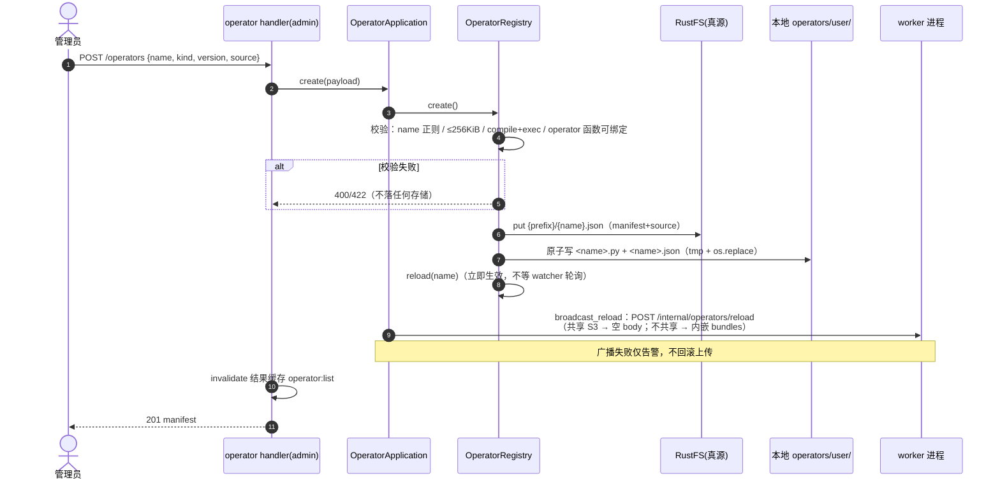
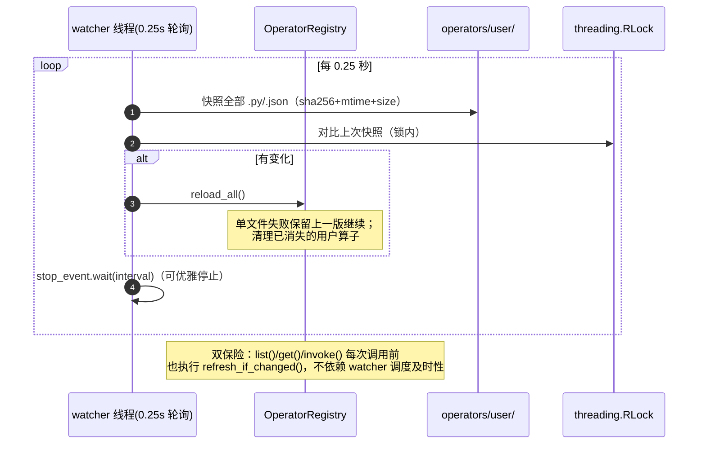
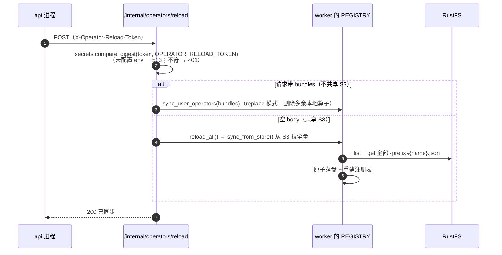
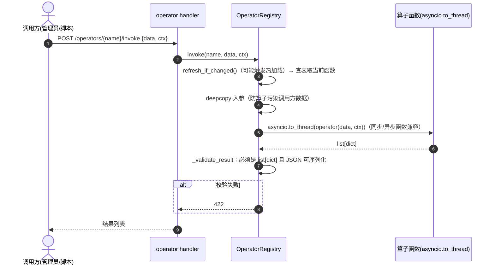

# 算子注册模块（代码结构 / 存储 / 功能说明 / 时序图）

> API 前缀 `/api/v1/operators`（**admin 路由组**）+ `/internal/operators`（免登录，worker 用，靠 `X-Operator-Reload-Token` 自校验）。
> 设计文档：`backend/docs/operator_registry.md`。
>
> **定位澄清**：算子注册表与工作流系统是**两套并行系统**——工作流 step 不引用算子名（见 `docs/工作流系统模块.md`），CLAUDE.md"User-defined workflows compose registered operators"与当前代码不符。算子目前的消费方是 HTTP `invoke`（第三方/脚本调用）与 scholar ETL 注册线。前端**没有算子管理视图**（`api/kgConstruction.ts` 里的 `listOperators/invokeOperator` 暂无视图引用）。

## 一、功能描述

线程安全、热加载的 Python 算子注册表：算子 = 一个 `operator(data, ctx) -> list[dict]` 纯函数，持久化在 S3（真源）+ 本地文件系统（执行缓存），多进程（api + temporal-worker）通过 S3 / 广播同步。

### 1. 算子契约

- **签名**：`Callable[[list[dict], dict], list[dict]]`；返回非 `list[dict]` 或不可 JSON 序列化 → 422。
- **校验**（`_function_from_source`）：源码 `compile` + `exec` 进新造 ModuleType → 必须有可调用顶层 `operator` 属性 → `inspect.signature(...).bind([], {})` 必须可绑定 → 模块注册进 `sys.modules`。
- **元数据**：manifest 仅 5 字段（name/version/kind/description/builtin/updated_at），**无参数 JSON Schema**。name 正则 `^[a-zA-Z][a-zA-Z0-9_.-]{0,127}$`；源码上限 256 KiB。
- **kind 枚举**：`data_processing` / `entity_extraction` / `relation_extraction` / `entity_ingestion` / `relation_ingestion`。
- **ctx**：纯 JSON dict，完全由调用方传（内置算子读 `field_mapping`/`rules`/`existing_entities` 等）；**不注入**数据源/图空间/Milvus/LLM 客户端——需要基础设施的算子（scholar 系列）在函数体内直接 `from script.xxx import run` 导入后端模块。

### 2. 内置算子（5 个，不可覆盖/修改/删除）

| 名字 | 功能 |
|---|---|
| `builtin.data_normalize` | 字段名映射、字符串清洗、可选过滤空值 |
| `builtin.entity_extract` | 按用户正则规则从文本抽取实体 |
| `builtin.relation_extract` | 字段映射或正则命名分组抽取关系 |
| `builtin.entity_load` | 按主键/名称匹配生成 insert/merge 入库计划（`_ingest` 标记，**不写库**） |
| `builtin.relation_load` | 按 source/target/type 组合键生成关系入库计划 |

### 3. scholar 算子（`backend/operators/scholar/`，已提交源码，5 个）

薄封装（忽略 data、从 ctx 取参、返回 `[{"status","params","stats"}]`），包装 `script/` 下 ETL：`load_entities`（Person 顶点）、`load_relations`（AFFILIATED_WITH + COAUTHOR_WITH 边）、`build_milvus_index`（稠密+BM25 双编码）、`align_affiliations`（Milvus 混检对齐机构写 SAME_AS）、`dedupe_persons`（综合打分消歧）。

**加载方式**：这些文件**不参与运行时目录扫描**（运行时目录是 `operators/user/`）。由 `script/register_scholar_operators.py` 经 ASGI 进程内调 HTTP API 注册（存在走 PUT 热更新、新算子走 POST，支持 `--invoke` 冒烟）。源码在 git 里只是可读版本。

### 4. 热加载

- watcher daemon 线程**轮询**（默认 0.25s，非 inotify）：对目录 `.py/.json` 计算 sha256+mtime+size 快照，不一致才 `reload_all()`（单文件失败保留上一版继续，并清理已消失的用户算子）。
- 更稳的一层：`list()/get()/invoke()` 每次调用前也执行 `refresh_if_changed()`，不依赖 watcher 线程调度。
- 线程安全：单把 `threading.RLock` 保护注册表与文件快照；磁盘 I/O 在锁外。

### 5. 多进程同步

api 进程上传/更新算子后：S3 put（真源）→ 本地原子写盘（tmp + `os.replace`）→ reload → **`broadcast_reload()`** 向 `OPERATOR_WORKER_BASE_URIS` 每个地址 POST `/internal/operators/reload`：共享同一 S3 store 时发空 body（worker 自行拉 S3）；不共享时把 bundles 内嵌下发。广播失败仅告警不回滚。

### 6. 安全边界（如实记录）

**上传不走 LLM 安全校验**（`script_security` 是 Schema 抽取脚本专用）。算子上传校验只有：pydantic `check_text`（≤64 字符白名单）、256KiB 上限、语法编译 + `operator` 函数签名检查。`backend/docs/operator_registry.md` 明示：源码以 API 进程权限执行，仅限受信管理员，语法检查不是安全沙箱。

## 二、代码结构

```
backend/
├── biz/handler/operator.py             # admin 6 端点 + internal reload 端点
├── biz/schemas/operator.py             # 上传模型（check_text 文本校验）
├── application/operator.py             # OperatorApplication：create + broadcast_reload
├── service/
│   ├── operator_registry.py            # OperatorRegistry：注册表/watcher/校验/invoke（单例 REGISTRY）
│   └── operator_builtins.py            # 5 个内置算子实现
├── infra/operator_store.py             # S3OperatorStore（boto3，path-style，3 次重试）
├── operators/
│   ├── scholar/                        # 已提交的 5 个 scholar 算子源码（git 侧可读版本）
│   └── user/                           # gitignore 运行时缓存（OPERATOR_DIR，容器挂 operator-data 卷）
└── script/register_scholar_operators.py # scholar 算子注册线（ASGI 进程内调 API）

frontend/src/api/kgConstruction.ts      # listOperators / invokeOperator（暂无视图使用）
```

main.py lifespan：`REGISTRY.initialize_store()`（ensure bucket + S3 → 本地全量同步）+ `REGISTRY.start_watcher()`；退出 `stop_watcher()`。

## 三、持久化（无 MySQL 表）

- **S3 / RustFS 为真源**：key = `{OPERATOR_S3_PREFIX}/{name}.json`（默认前缀 `operators`），对象内容 `{"manifest": {...}, "source": "..."}`，一算子一对象。
- **本地文件系统为执行缓存**：`operators/user/<name>.py` + `<name>.json`，原子写（tmp + `os.replace`）。
- env：`OPERATOR_DIR`（默认 `backend/operators/user`）、`OPERATOR_S3_BUCKET`（未设 → 纯本地模式无 store）、`OPERATOR_S3_PREFIX` / `OPERATOR_S3_ENDPOINT_URL` / `OPERATOR_S3_ACCESS_KEY_ID` / `OPERATOR_S3_SECRET_ACCESS_KEY` / `OPERATOR_S3_REGION`、`OPERATOR_WORKER_BASE_URIS`、`OPERATOR_RELOAD_TOKEN`。dev/生产 compose：endpoint `operator-rustfs:9000`，bucket `tech-kg-operators`，宿主 9020/9021。

## 四、API 一览

| 端点 | 作用 |
|---|---|
| `GET /api/v1/operators` | 列表（kind 过滤，结果缓存 `operator:list`） |
| `GET /api/v1/operators/{name}` | 单个 manifest |
| `POST /api/v1/operators`（201） | 上传（成功后失效列表缓存） |
| `PUT /api/v1/operators/{name}` | 更新源码/版本（立即热加载） |
| `DELETE /api/v1/operators/{name}` | 删除用户算子（内置不可删） |
| `POST /api/v1/operators/{name}/invoke` | 调用算子 |
| `POST /internal/operators/reload` | worker 侧同步（token 头校验；带 body=装快照，空 body=拉 S3） |

## 五、工作时序图

### 5.1 上传算子（校验 → S3 → 落盘 → 热加载 → 广播）



### 5.2 热加载 watcher 与读写自愈



### 5.3 worker 侧同步（internal reload）



### 5.4 invoke 执行


