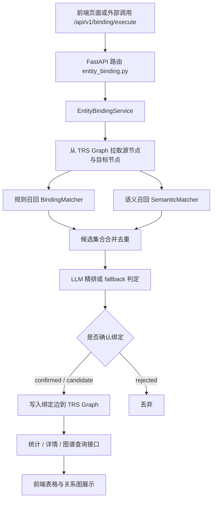
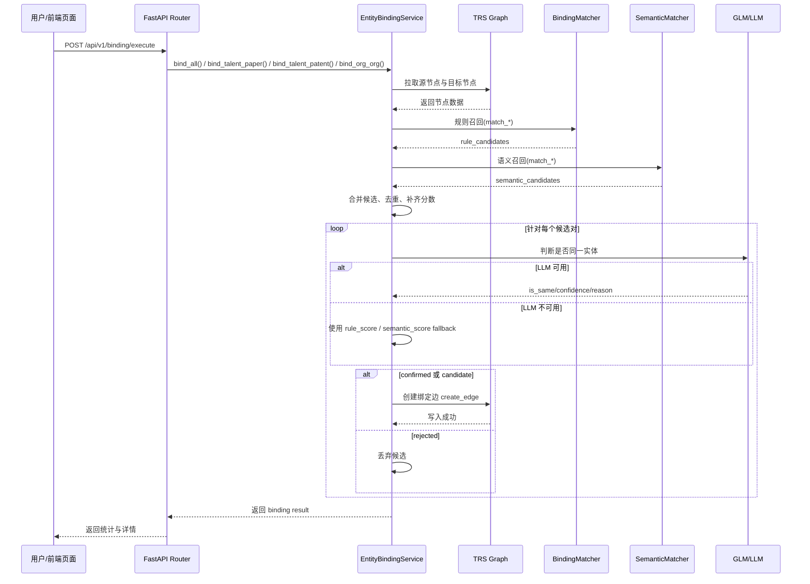

# 跨库绑定设计文档

## 1. 背景

本项目的跨库绑定（Entity Binding）用于将人才库、论文库、专利库、机构库中的实体进行对齐，识别不同数据源中是否指向同一个现实世界对象。

当前实现基于三段式流程：

- 规则召回
- 语义召回（Embedding）
- LLM 精排

最终结果以图边的形式写入 TRS Graph，供统计、详情展示和关系图可视化使用。

---

## 2. 目标

跨库绑定设计的目标如下：

- 提升实体候选召回率，覆盖简称、跨语言、领域相近等场景
- 保留规则匹配的可解释性和低成本优势
- 利用语义召回补齐纯字符规则无法覆盖的候选
- 利用 LLM 对候选做最终判断，输出 `confirmed` / `candidate` / `rejected`
- 将绑定结果统一写入图数据库，供前端页面和 API 查询

---

## 3. 涉及模块

### 后端入口

- `app/main.py`
- `app/routers/entity_binding.py`

### 核心服务

- `app/services/entity_binding.py`
- `app/services/binding_matcher.py`
- `app/services/semantic_matcher.py`

### 图数据库访问

- `graph_db/config.py`
- `graph_db/backends/trs_graph_backend.py`

### 前端页面

- `app/static/binding.html`

---

## 4. 支持的绑定类型

当前支持三类绑定：

- 人才 ↔ 论文：`talent_paper`
- 人才 ↔ 专利：`talent_patent`
- 机构 ↔ 机构：`org_org`

对应边类型：

- `bind_talent_paper_author`
- `bind_talent_patent_inventor`
- `bind_org_org`

---

## 5. 总体流程图



---

## 6. 时序图



---

## 7. 规则召回设计

规则召回由 `app/services/binding_matcher.py` 提供，主要使用以下相似度：

- 姓名相似度：精确匹配 + 编辑距离相似度
- 机构相似度：Jaccard + 编辑距离 + 包含关系
- 领域相似度：字符级 Jaccard

### 规则权重

#### 人才 ↔ 论文

- 姓名：`0.6`
- 机构：`0.3`
- 领域：`0.1`
- 进入候选阈值：`0.5`

#### 人才 ↔ 专利

- 姓名：`0.7`
- 机构：`0.3`
- 进入候选阈值：`0.5`

#### 机构 ↔ 机构

- 名称相似度 + 地域 bonus + 类型 bonus
- 进入候选阈值：`0.6`

### 优点

- 成本低
- 可解释
- 对精确匹配、缩写匹配、机构包含关系有效

### 局限

- 对跨语言、语义近义、简称扩展覆盖有限

---

## 8. 语义召回设计

语义召回由 `app/services/semantic_matcher.py` 提供，依赖 `sentence-transformers`。

### 默认模型

- `moka-ai/m3e-small`

### 文本构造策略

#### 人才文本

拼接字段：

- `name_zh`
- `name_en`
- `scholar_org_name_zh`
- `scholar_org_name_en`
- `fields`

#### 论文文本

拼接字段：

- `authors`
- `institution`
- `zh_name`
- `en_name`
- `keywords`

#### 专利文本

拼接字段：

- `first_inventor_name`
- `first_applicant_name`
- `title_zh`
- `keywords`

#### 机构文本

拼接字段：

- `name_cn`
- `province`
- `city`
- `org_type`

### 召回逻辑

- 对左右两侧实体文本分别做 embedding
- 计算相似度矩阵：`score_matrix = left_vectors @ right_vectors.T`
- 对每个左侧实体取 TopK 候选
- 过滤低于阈值的候选

### 可配置项

- `SEMANTIC_MATCHING_ENABLED`
- `SEMANTIC_MATCHING_MODEL`
- `SEMANTIC_MATCHING_TOP_K`
- `SEMANTIC_MATCHING_MIN_SCORE`

### 优点

- 能补充规则召回覆盖不到的候选
- 对跨语言、术语近义、文本整体语义更友好

### 当前风险

- 对机构实体，纯 embedding 容易出现高语义相似但业务上不应绑定的候选
- 例如高校之间因“高等院校、北京、大学”等公共语义过强，可能出现误召回

---

## 9. 候选合并策略

在 `EntityBindingService` 中，规则召回与语义召回结果会被合并：

- 以 `(source_id, target_id)` 为键合并候选
- 对机构 ↔ 机构场景，按无向边去重
- 如果候选同时存在于规则召回和语义召回中：
  - 保留两侧分数
- 如果候选只存在于语义召回中：
  - `rule_score = 0`
- 如果候选只存在于规则召回中：
  - `semantic_score = 0`

这样后续精排时可以识别：

- `rule+llm`
- `semantic+llm`
- `rule-only`
- `semantic-only`

---

## 10. 精排与状态判定

### LLM 精排

对于每个候选对，系统会构造实体摘要并调用 LLM。

输入包括：

- 源实体描述
- 目标实体描述
- 数据源类型

期望输出：

```json
{"is_same": true, "confidence": 0.92, "reason": "姓名一致，机构一致，研究方向匹配"}
```

### 状态判定规则

- `is_same=true` 且 `confidence >= 0.7` → `confirmed`
- `is_same=true` 且 `0.5 <= confidence < 0.7` → `candidate`
- 其余 → `rejected`

### fallback 逻辑

当 LLM 不可用时：

- 人才 ↔ 论文：使用 `rule_score` 或 `semantic_score` 的较大值
- 人才 ↔ 专利：使用 `rule_score` 或 `semantic_score` 的较大值
- 机构 ↔ 机构：使用 `rule_score` 或 `semantic_score` 的较大值

并基于不同类型的 fallback 阈值直接做确认。

---

## 11. 结果写入设计

确认或候选结果写入图数据库边，边属性包含：

- `confidence`
- `method`
- `bound_at`
- `rule_score`
- `llm_score`
- `status`

写入接口由 `self.db.create_edge(...)` 完成。

最终这些边会被以下接口读取：

- `/api/v1/binding/stats`
- `/api/v1/binding/detail`
- `/api/v1/binding/graph`

---

## 12. 前端展示流程

前端页面路径：

- `/binding`

主要区域：

- 操作区：初始化、执行绑定、清除数据
- 统计区：展示 confirmed / candidate / total
- 详情表：展示每条绑定记录
- 关系图：展示绑定图谱结构

前端会调用以下后端接口：

- `POST /api/v1/binding/init-data`
- `POST /api/v1/binding/execute`
- `GET /api/v1/binding/stats`
- `GET /api/v1/binding/detail`
- `GET /api/v1/binding/graph`
- `DELETE /api/v1/binding/clear`

---

## 13. 当前实现效果

当前服务已经可以正常跑通：

- 服务可启动
- 页面可访问
- 初始化可执行
- 全量绑定可执行
- 统计、详情、图谱接口可返回结果

当前验证结果中：

- 人才 ↔ 论文：可正常确认目标绑定
- 人才 ↔ 专利：可正常确认目标绑定
- 机构 ↔ 机构：存在语义误召回偏高的问题，需要继续收紧阈值或增加额外约束

---


## 14. 总结

本次跨库绑定方案已经从原始的“规则召回 + LLM 精排”升级为：

- 规则召回
- 语义召回
- 候选合并
- LLM 精排
- 图数据库写入与可视化展示

该方案兼顾了：

- 低成本规则匹配
- embedding 语义补召回
- LLM 最终判定
- 图数据库统一管理结果

目前整体流程已经可运行，后续主要优化重点在 `org_org` 场景的误召回控制。
