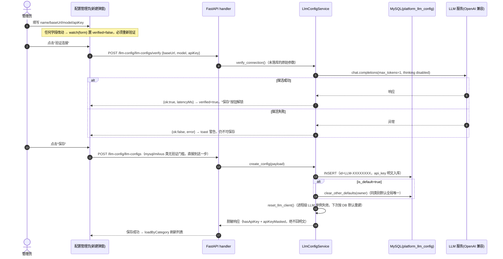
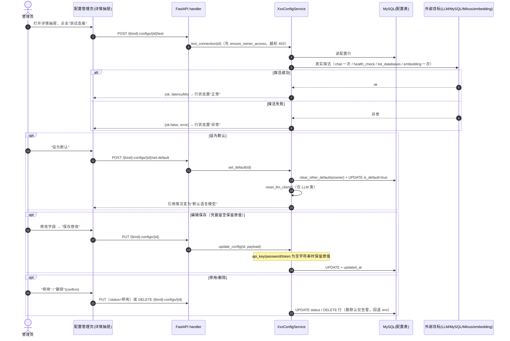
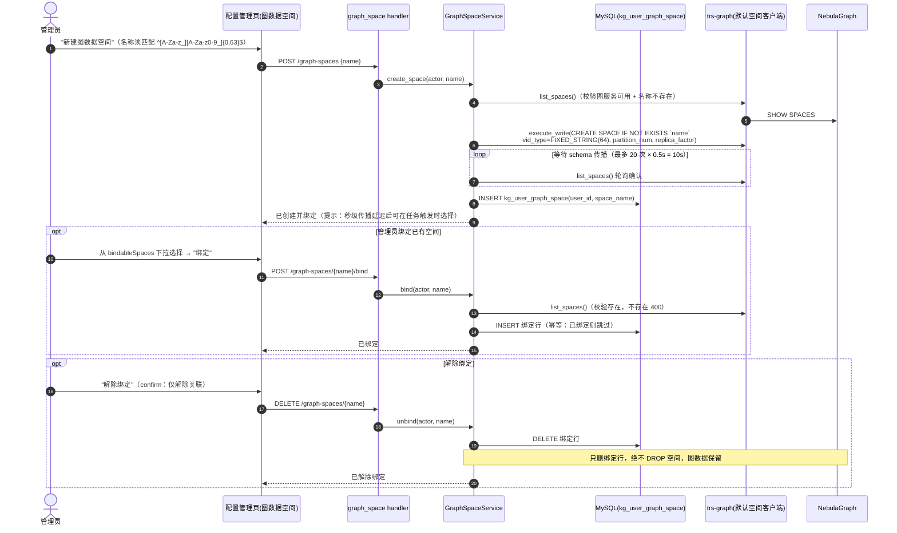

# 配置管理模块（代码结构 / 表结构 / 功能说明）

> 前端路由 `/configurations`（`meta.admin: true`，仅平台管理员可见）。
> 后端五个 router 全部注册在 **admin 路由组**（`require_authenticated_user` + `require_platform_admin`，见 `backend/biz/router/register.py:96-108`）。

## 一、功能描述

配置管理页是平台的**外部资源连接配置中心**，管理 5 个分类：

| 分类 | kind | 管理对象 | 持久化 |
|---|---|---|---|
| 语言模型 | `llm` | OpenAI 兼容 LLM 连接（base_url / model / api_key） | `platform_llm_config` |
| 向量模型 | `embedding` | embedding 模型连接（多一个 dimensions 维度） | `platform_embedding_config` |
| MySQL 数据源 | `mysql` | 关系库连接（host/port/库/账号密码） | `platform_mysql_datasource` |
| 向量数据空间 | `milvus` | Milvus 向量库连接（uri 为空回退 env `MILVUS_*`） | `platform_milvus_config` |
| 图数据空间 | — | NebulaGraph 图空间绑定关系 | `kg_user_graph_space` + trs-graph |

核心交互功能：

- **首屏并行加载**：四类配置用 `Promise.allSettled` 一次拉齐（让左侧分类计数固定展示），图空间单独拉取；切换分类不重拉，仅首拉失败时补拉；增删改后的刷新由各 mutation 内的 `loadByCategory` 覆盖。
- **列表**：关键词搜索（名称/id/类型/地址/模型）+ 状态筛选（正常/异常/停用）。
- **新建弹窗**：LLM/embedding 强制**"验证通过才能保存"**——用弹窗里的原始参数真实探活（`POST /verify`），任何字段改动会使已验证状态失效需重验（`watch(form, deep)` 重置 `verified`）；mysql/milvus 无此门槛。
- **详情抽屉**：编辑保存、**测试连接**（后端真实探活，成功置"正常"/失败置"异常"）、设为默认、停用/启用、删除。
- **凭据安全**：api_key/password/token 明文入库但**响应只回脱敏掩码**（`••••••••` + 末 4 位）+ `hasXxx` 布尔；更新时留空保留原值。
- **图数据空间**：新建会**真实执行 Nebula `CREATE SPACE`**（`vid_type=FIXED_STRING(64)`，partition/replica 可由 `GRAPH_SPACE_PARTITION_NUM` / `GRAPH_SPACE_REPLICA_FACTOR` 覆盖，默认 100/3），并轮询 `SHOW SPACES` 等传播（0.5s × 20 次 = 最多 10s）后自动绑定；管理员可绑定已有空间；解绑只删绑定行，**绝不 DROP 空间**。普通用户只能看到默认业务空间 + 自己绑定的空间。

## 二、代码结构

### 前端

```
frontend/src/
├── router/index.ts:98                              # /configurations 路由（admin: true）
├── layouts/AppLayout.vue:561                       # 侧边导航入口
├── views/platform/ConfigurationManagementView.vue  # 页面本体（单文件组件）
└── api/
    ├── llmConfig.ts / embeddingConfig.ts
    ├── mysqlDatasource.ts / milvusConfig.ts
    └── graphSpace.ts
```

页面结构：左侧分类导航（带计数）+ 右侧配置表格 + Teleport 到 body 的详情抽屉/新建弹窗（Teleport 是必须的：留在页面内时 fixed 定位会被 `.app-stage` 的 `backdrop-filter` 接管成包含块）。所有配置在页面里统一归一化为 `ConfigItem`（`toConfigItem()` 按 kind 分支），四种 kind 的增删改查/测试/设默认共用同一套 UI。

### 后端（DDD 五层）

```
backend/
├── biz/router/register.py:96-108       # 五个 router 注册进 admin_routers
├── biz/handler/                        # 薄 handler，只做解析/鉴权/调用
│   ├── llm_config.py                   #   prefix=/llm-config
│   ├── embedding_config.py             #   prefix=/embedding-config
│   ├── mysql_datasource.py             #   prefix=/mysql-datasources
│   ├── milvus_config.py                #   prefix=/milvus-configs
│   └── graph_space.py                  #   prefix=/graph-spaces
├── biz/schemas/llm_config.py 等        # Pydantic 请求/响应模型（llm/embedding 有 VerifyRequest）
├── biz/dependencies/resources.py       # resource_owner_filter + ensure_owner_access（owner 隔离）
├── application/
│   ├── llm_config.py / embedding_config.py / mysql_datasource.py / milvus_config.py
│   └── （graph_space 无 application 层，handler 直连 service）
├── service/
│   ├── llm_config.py / embedding_config.py / mysql_datasource.py / milvus_config.py
│   └── graph_space.py                  # CREATE SPACE + 绑定/解绑逻辑
├── dao/
│   └── llm_config.py / embedding_config.py / mysql_datasource.py / milvus_config.py
└── db_model/
    ├── llm_config.py / embedding_config.py / mysql_datasource.py / milvus_config.py
    └── platform_governance.py:65       # UserGraphSpace（图空间绑定表）
```

### API 一览（均挂 `/api/v1`，admin 鉴权）

| 模块 | 端点 |
|---|---|
| LLM | `GET/POST /llm-config/llm-configs`、`GET/PUT/DELETE /llm-configs/{id}`、`POST /{id}/set-default`、`POST /{id}/test`、`POST /llm-configs/verify`（保存前验证） |
| Embedding | 同 LLM 结构（`/embedding-config` 前缀，含 `/verify`） |
| MySQL | CRUD + `set-default` + `test` + `GET /{id}/databases` + `GET /{id}/tables` + `GET /{id}/tables/{name}/columns`（后三者供 schema 抽取选源） |
| Milvus | CRUD + `set-default` + `test` + `GET /{id}/databases` |
| 图空间 | `GET/POST /graph-spaces`（POST 即创建 + 绑定）、`POST /{name}/bind`、`DELETE /{name}`（解绑） |

## 三、表结构（5 张表）

四张配置表结构同构，差异只在连接字段。通用列：`id VARCHAR(64) PK`、`name VARCHAR(128)`、`description VARCHAR(500)`、`owner VARCHAR(128)`、`is_default BOOL`（全局唯一默认，service 层 `clear_other_defaults` 保证）、`status VARCHAR(32)`（中文枚举：正常/停用/异常）、`created_at/updated_at DATETIME`，索引 `(is_default, status)`。

**`platform_llm_config`**（id 形如 `LLM-XXXXXXXX`）

| 列 | 类型 | 说明 |
|---|---|---|
| base_url | VARCHAR(256) | OpenAI 兼容入口 |
| api_key | VARCHAR(256) | 明文存储，响应脱敏 |
| model | VARCHAR(128) | 模型名 |

**`platform_embedding_config`** — 同 LLM，多一列 `dimensions INT NULL`（向量维度）。

**`platform_mysql_datasource`**

| 列 | 类型 | 说明 |
|---|---|---|
| host | VARCHAR(256) | |
| port | INT | default 3306 |
| default_database | VARCHAR(128) | |
| username / password | VARCHAR(128) / VARCHAR(256) | 密码明文存储，响应脱敏 |

**`platform_milvus_config`**

| 列 | 类型 | 说明 |
|---|---|---|
| uri | VARCHAR(256) | 空 = 回退 env `MILVUS_*` |
| token | VARCHAR(256) | 响应脱敏 |
| default_db | VARCHAR(128) | default 'default' |

**`kg_user_graph_space`**（`db_model/platform_governance.py:65`，用户↔图空间绑定关系；空间本体在 NebulaGraph 侧）

| 列 | 类型 | 说明 |
|---|---|---|
| id | VARCHAR(36) PK | UUID |
| user_id | VARCHAR(128) | 索引 `idx_kg_user_graph_space_user` |
| space_name | VARCHAR(128) | |
| created_at | DATETIME | server_default=now() |

约束：`UNIQUE(user_id, space_name)`

## 四、关键机制

- **owner 隔离**：列表按 owner 过滤（管理员全量、普通用户仅自己，`resource_owner_filter`）；单条操作校验 `ensure_owner_access`，越权 403。列表因此**不走共享结果缓存**——缓存键不含用户身份，共享缓存会串数据。
- **默认配置全局唯一**：设默认/建默认时 `clear_other_defaults` 清掉同 owner 其它行；四张表同套路。删除默认配置只告警不阻止，删除后回退 env。
- **LLM 配置与全局 LLM 客户端联动**：增删改/设默认后 `reset_llm_client()` 使进程单例失效；`resolve_llm_settings()` DB 默认配置优先，**DB 配置缺 api_key 或无记录时回退 env**（`LLM_API_KEY`/`ZHIPUAI_API_KEY`，避免空配置屏蔽可用 env key）；另有 `get_llm_client_by_id()` / `get_llm_settings_by_id()` 供作业 activity 按指定配置临时构造客户端。
- **测试/验证都是真实探活**，返回 `{ok, latencyMs, error}`：
  - LLM：真发一次 `chat.completions`（max_tokens=1、`thinking: disabled`）；
  - embedding：真发一次向量请求；
  - MySQL：建临时 `MySQLClient` 做 `health_check`；
  - Milvus：建临时 pymilvus 客户端 `list_databases`。
  - `test`（已保存配置）与 `verify`（保存前用表单原始参数）是两个入口。
- **图空间创建**：走默认 env 空间的 trs-graph 客户端执行 DDL（CREATE SPACE 需已存在空间做执行上下文），创建后轮询确认再绑定；单存储节点集群可把 `GRAPH_SPACE_REPLICA_FACTOR` 调小避免 "Host not enough!"。名称校验 `^[A-Za-z_][A-Za-z0-9_]{0,63}$`。

## 五、工作时序图

### 5.1 新建模型配置（验证通过才能保存，LLM / embedding）



### 5.2 已保存配置的运维操作（测试连接 / 设默认 / 停用 / 删除）



### 5.3 图数据空间：创建 → 绑定 → 解绑


